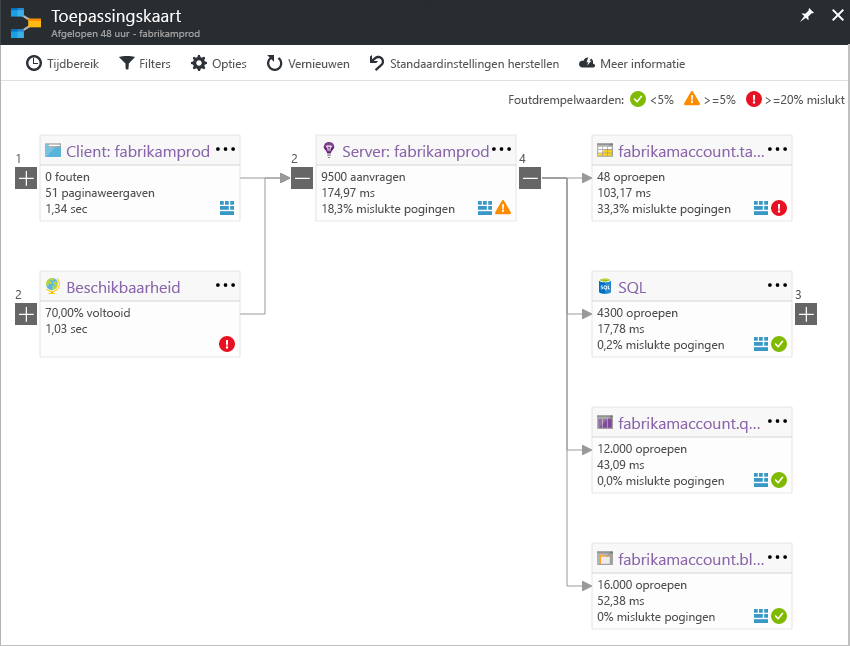

# De toepassingstoewijzing in Application InsightsApplication Map in Application Insights
In [Azure Application Insights](app-insights-overview.md), toewijzing van de toepassing is een visuele indeling van de afhankelijkheidsrelaties tussen onderdelen van uw toepassing.In [Azure Application Insights](app-insights-overview.md), Application Map is a visual layout of the dependency relationships of your application components. Elk onderdeel toont KPI's zoals belasting, prestaties, fouten en waarschuwingen, om te zien van de onderdelen die zijn veroorzaakt door een prestatieprobleem of fout.Each component shows KPIs such as load, performance, failures, and alerts, to help you discover any component causing a performance issue or failure. U kunt via van elk onderdeel klikken om meer gedetailleerde diagnostische gegevens, zoals Application Insights-gebeurtenissen te.You can click through from any component to more detailed diagnostics, such as Application Insights events. Als uw app gebruikmaakt van Azure-services, kunt u ook doorklikken naar Azure diagnostics, zoals SQL Database Advisor aanbevelingen.If your app uses Azure services, you can also click through to Azure diagnostics, such as SQL Database Advisor recommendations.

U kunt een toepassing toewijzen aan de Azure-dashboard, waar deze zich volledig functioneel vastmaken zoals andere grafieken.Like other charts, you can pin an application map to the Azure dashboard, where it is fully functional. 

## Open de toepassing-kaartOpen the application map
De kaart openen vanuit de overzichtsblade van uw toepassing:Open the map from the overview blade for your application:

De kaart wordt weergegeven:The map shows:

* BeschikbaarheidstestsAvailability tests
* Client-side-onderdeel (bewaakt met de JavaScript SDK)Client-side component (monitored with the JavaScript SDK)
* Server-side-onderdeelServer-side component
* Afhankelijkheden van de client en server-onderdelenDependencies of the client and server components

U kunt uitvouwen en samenvouwen afhankelijkheid koppeling groepen:You can expand and collapse dependency link groups:

Als er veel afhankelijkheden van een bepaald type (SQL, HTTP-enzovoort), kunnen ze gegroepeerde weergegeven.If you have many dependencies of one type (SQL, HTTP etc.), they may appear grouped. 

## Ter plaatse problemenSpot problems
Elk knooppunt heeft relevante prestatie-indicatoren, zoals de belasting, prestaties en fout tarieven voor het desbetreffende onderdeel.Each node has relevant performance indicators, such as the load, performance, and failure rates for that component. 

De pictogrammen waarschuwing Markeer mogelijke problemen.Warning icons highlight possible problems. Een oranje waarschuwing betekent dat er fouten zijn in aanvragen, paginaweergaven of afhankelijkheidsaanroepen.An orange warning means there are failures in requests, page views or dependency calls. Rood betekent een Faalpercentage 5% of hoger.Red means a failure rate above 5%. Als u deze drempels aanpassen wilt, opent u de opties.If you want to adjust these thresholds, open Options.

Actieve waarschuwingen ook weergeven van:Active alerts also show up: 

Als u SQL Azure gebruikt, is er een pictogram dat ziet u wanneer er zijn aanbevelingen voor hoe u kunt de prestaties verbeteren.If you use SQL Azure, there's an icon that shows when there are recommendations on how you can improve performance. 

Klik op een pictogram voor meer informatie:Click any icon to get more details:

## Diagnostische klik doorDiagnostic click through
Elk van de knooppunten op de kaart biedt gerichte klik door voor diagnostische gegevens.Each of the nodes on the map offers targeted click through for diagnostics. De opties variëren afhankelijk van het type van het knooppunt.The options vary depending on the type of the node.

De opties omvatten voor onderdelen die worden gehost in Azure, directe koppelingen naar deze.For components that are hosted in Azure, the options include direct links to them.

## Filters en tijdsbereikFilters and time range
Standaard de kaart bevat een overzicht van alle gegevens die beschikbaar zijn voor het gekozen tijdsbereik.By default, the map summarizes all the data available for the chosen time range. Maar u kunt deze zodanig dat alleen de namen van de specifieke bewerking of afhankelijkheden filteren.But you can filter it to include only specific operation names or dependencies.

* Naam van de bewerking: dit omvat zowel paginaweergaven en serverzijde aanvraagtypen.Operation name: This includes both page views and server-side request types. Met deze optie wordt de kaart de KPI op het knooppunt server-clientzijde voor de geselecteerde bewerkingen alleen.With this option, the map shows the KPI on the server/client-side node for the selected operations only. De afhankelijkheden aangeroepen in de context van deze specifieke bewerkingen worden weergegeven.It shows the dependencies called in the context of those specific operations.
* Basisnaam voor afhankelijkheid: dit omvat de AJAX browser afhankelijkheden en afhankelijkheden van de serverzijde.Dependency base name: This includes the AJAX browser dependencies and server-side dependencies. Als u aangepaste afhankelijkheidstelemetrie met de API TrackDependency rapporteert, weergegeven ze ook hier.If you report custom dependency telemetry with the TrackDependency API, they also appear here. U kunt de afhankelijkheden om weer te geven op de kaart selecteren.You can select the dependencies to show on the map. Deze selectie filteren op dit moment niet de aanvragen van de server of de client-side paginaweergaven.Currently this selection does not filter the server-side requests, or the client-side page views.

## Filters opslaanSave filters
Pincode voor het opslaan van de filters die u hebt toegepast, de gefilterde weergave naar een [dashboard](app-insights-dashboards.md).To save the filters you have applied, pin the filtered view onto a [dashboard](app-insights-dashboards.md).

## FoutvensterError pane
Wanneer u een knooppunt in het overzicht klikt, wordt een foutvenster weergegeven aan de rechterkant van fouten voor dat knooppunt samen te vatten.When you click a node in the map, an error pane is displayed on the right-hand side summarizing failures for that node. Fouten zijn gegroepeerd eerst op bewerkings-ID en vervolgens gegroepeerd op probleem-ID.Failures are grouped first by operation ID and then grouped by problem ID.

Op een fout te klikken, gaat u naar de meest recente exemplaar van deze fout.Clicking on a failure takes you to the most recent instance of that failure.

## Status van resourcesResource health
Voor sommige brontypen resourcestatus weergegeven aan de bovenkant van het deelvenster fout.For some resource types, resource health is displayed at the top of the error pane. Bijvoorbeeld, ziet te klikken op een SQL-knooppunt de status van de database en waarschuwingen die zijn gestart.For example, clicking a SQL node will show the database health and any alerts that have fired.

U kunt klikken op de naam van de resource standaard overzicht metrische gegevens voor die bron weergeven.You can click the resource name to view standard overview metrics for that resource.

## End-to-end-systeem app mapsEnd-to-end system app maps

*SDK-versie 2.3 of hoger vereist**Requires SDK version 2.3 or higher*

Als uw toepassing verschillende onderdelen - bijvoorbeeld een back-endservice verder naar de web-app heeft - moet u ze kunt weergeven op één geïntegreerde app-kaart.If your application has several components - for example, a back-end service in addition to the web app - then you can show them all on one integrated app map.

De app-kaart wordt opgezocht serverknooppunten HTTP afhankelijkheid-aanroepen tussen servers met de Application Insights-SDK geïnstalleerd.The app map finds server nodes by following any HTTP dependency calls made between servers with the Application Insights SDK installed. Elke Application Insights-resource wordt uitgegaan van één server bevatten.Each Application Insights resource is assumed to contain one server.

### Met meerdere functie-app-kaart (preview)Multi-role app map (preview)

De preview-functie voor het toewijzen van meerdere functie-app kunt u de app-kaart gebruiken met meerdere servers die gegevens te verzenden naar dezelfde Application Insights-resource / instrumentatiesleutel.The preview multi-role app map feature allows you to use the app map with multiple servers sending data to the same Application Insights resource  / instrumentation key. Servers in de kaart worden gesegmenteerd op de eigenschap cloud_RoleName op telemetrie-items.Servers in the map are segmented by the cloud_RoleName property on telemetry items. Ingesteld *toepassing van meerdere rollenoverzicht* naar *op* op de blade Previews zodat deze configuratie.Set *Multi-role Application Map* to *On* from the Previews blade to enable this configuration.

Deze aanpak is het wellicht wenselijk in een toepassing micro-services of in andere scenario's waarvoor gebeurtenissen met elkaar correleren over meerdere servers in één Application Insights-resource.This approach may be desired in a micro-services application, or in other scenarios where you want to correlate events across multiple servers within a single Application Insights resource.

## VideoVideo

> [!VIDEO https://channel9.msdn.com/events/Connect/2016/112/player] 

## FeedbackFeedback
Geef feedback via de portal feedbackoptie.Please provide feedback through the portal feedback option.

## Volgende stappenNext steps

* [Azure PortalAzure portal](https://portal.azure.com)
