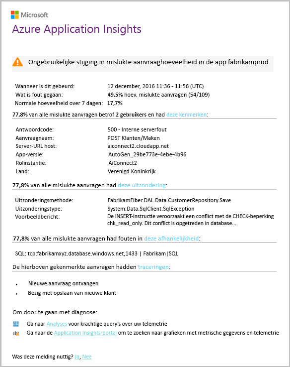

# Overzicht van Application Insights voor DevOpsOverview of Application Insights for DevOps

Met [Application Insights](app-insights-overview.md), u kunt snel ontdekken hoe uw app wordt uitgevoerd en wordt gebruikt wanneer het live.With [Application Insights](app-insights-overview.md), you can quickly find out how your app is performing and being used when it's live. Er is een probleem, kunt u informatie over het helpt bij het beoordelen van de impact en helpt u de oorzaak te achterhalen.If there's a problem, it lets you know about it, helps you assess the impact, and helps you determine the cause.

Hier volgt een account van een team dat webtoepassingen ontwikkelt:Here's an account from a team that develops web applications:

* *"Een aantal dagen geleden implementeerden we een 'secundaire' hotfix. Een brede testronde niet worden uitgevoerd, maar helaas sommige onverwachte wijziging in de nettolading, waardoor ze niet compatibel zijn tussen de begin- en back-ends is samengevoegd. Direct serveruitzonderingen toenam, onze waarschuwing geactiveerd en er zijn aangebracht op de hoogte van de situatie. Een paar muisklikken opgeslagen op de Application Insights-portal wij voldoende informatie van de uitzondering callstacks om het probleem vast te stellen. We onmiddellijk teruggedraaid en de schade beperkt. Application Insights heeft dit deel van de devops bladeren aangebracht zeer eenvoudig en actie worden uitgevoerd."**"A couple of days ago, we deployed a 'minor' hotfix. We didn't run a broad test pass, but unfortunately some unexpected change got merged into the payload, causing incompatibility between the front and back ends. Immediately, server exceptions surged, our alert fired, and we were made aware of the situation. A few clicks away on the Application Insights portal, we got enough information from exception callstacks to narrow down the problem. We rolled back immediately and limited the damage. Application Insights has made this part of the devops cycle very easy and actionable."*

In dit artikel volgen we een team in Fabrikam Bank die het systeem internetbankieren (OBS) om te zien hoe ze Application Insights gebruiken om snel reageren op klanten en wijzigingen ontwikkelt.In this article we follow a team in Fabrikam Bank that develops the online banking system (OBS) to see how they use Application Insights to quickly respond to customers and make updates.  

Het team werkt op een DevOps cyclus afgebeeld in de volgende afbeelding:The team works on a DevOps cycle depicted in the following illustration:

Vereisten van de feed in de achterstand van hun ontwikkeling (takenlijst).Requirements feed into their development backlog (task list). Ze werken in een korte sprints, wat vaak resulteert in een werkende software - gewoonlijk in de vorm van verbeteringen en uitbreidingen voor de bestaande toepassing.They work in short sprints, which often deliver working software - usually in the form of improvements and extensions to the existing application. De live-app wordt regelmatig bijgewerkt met nieuwe functies.The live app is frequently updated with new features. Het live is, wordt het in het team bewaakt om prestaties en gebruik met behulp van Application Insights.While it's live, the team monitors it for performance and usage with the help of Application Insights. Deze gegevens APM-feeds terug naar de achterstand van hun ontwikkeling.This APM data feeds back into their development backlog.

Het team gebruik maakt van Application Insights voor het bewaken van de webtoepassing live nauw voor:The team uses Application Insights to monitor the live web application closely for:

* De prestaties.Performance. Ze willen weten hoe reactietijden verschillen naargelang het aantal verzoeken; hoeveel CPU-, netwerk-, schijf- en andere bronnen worden gebruikt; en waar de knelpunten zijn.They want to understand how response times vary with request count; how much CPU, network, disk, and other resources are being used; and where the bottlenecks are.
* Fouten.Failures. Als er uitzonderingen zijn of mislukte aanvragen, of als een prestatiemeteritem buiten de vertrouwd bereik gaat, het team moet snel worden kennen, zodat ze actie kunnen ondernemen.If there are exceptions or failed requests, or if a performance counter goes outside its comfortable range, the team needs to know rapidly so that they can take action.
* Het gebruik.Usage. Wanneer er een nieuwe functie wordt uitgebracht, wil het team in welke mate het wordt gebruikt en of gebruikers hebben problemen met het weten.Whenever a new feature is released, the team want to know to what extent it is used, and whether users have any difficulties with it.

Laten we zich richten op het feedback deel van de cyclus:Let's focus on the feedback part of the cycle:

## Slechte beschikbaarheid detecterenDetect poor availability
Marcela Markova is een senior ontwikkelaar van het team OBS, en wordt de lead op online-prestaties bewaken.Marcela Markova is a senior developer on the OBS team, and takes the lead on monitoring online performance. Ze stelt u verschillende [beschikbaarheidstests](app-insights-monitor-web-app-availability.md):She sets up several [availability tests](app-insights-monitor-web-app-availability.md):

* Een enkele URL-test voor de belangrijkste startpagina voor de app http://fabrikambank.com/onlinebanking/.A single-URL test for the main landing page for the app, http://fabrikambank.com/onlinebanking/. Ze stelt criteria van HTTP-code, 200 en tekst 'Welkom!'.She sets criteria of HTTP code 200 and text 'Welcome!'. Als deze test mislukt, is er een ernstig probleem met het netwerk of de servers of misschien een probleem met de implementatie.If this test fails, there's something seriously wrong with the network or the servers, or maybe a deployment issue. (Of iemand de welkomstpagina is gewijzigd!(Or someone has changed the Welcome! bericht op de pagina zonder dat haar weten.)message on the page without letting her know.)
* Een dieper test met meerdere stappen, die zich aanmeldt en een account van de huidige aanbieding, controle van enkele belangrijke gegevens op elke pagina opgehaald.A deeper multi-step test, which logs in and gets a current account listing, checking a few key details on each page. Deze test controleert of de koppeling naar de database met gebruikersaccounts werkt.This test verifies that the link to the accounts database is working. Ze gebruikt een fictieve klant-id: een aantal worden bijgehouden voor testdoeleinden.She uses a fictitious customer id: a few of them are maintained for test purposes.

Met deze tests is ingesteld, is het Marcela er zeker van te zijn dat het team snel over een storing weten.With these tests set up, Marcela is confident that the team will quickly know about any outage.  

Fouten worden weergegeven als rood punten op de web-test-grafiek:Failures show up as red dots on the web test chart:

Maar belangrijker is, een waarschuwing over een storing in het ontwikkelingsteam per e-mail is verzonden.But more importantly, an alert about any failure is emailed to the development team. Op die manier kunnen weten ze voordat u vrijwel alle klanten.In that way, they know about it before nearly all the customers.

## Prestaties bewakenMonitor Performance
Op de overzichtspagina in Application Insights wordt een grafiek ziet u diverse [belangrijke metrische gegevens](app-insights-web-monitor-performance.md).On the overview page in Application Insights, there's a chart that shows a variety of [key metrics](app-insights-web-monitor-performance.md).

Laadtijd van browserpagina is afgeleid van telemetrie die rechtstreeks van webpagina's.Browser page load time is derived from telemetry sent directly from web pages. Serverreactietijd, aantal servers-aanvraag en aantal mislukte aanvragen zijn alle gemeten in de webserver en van daaruit naar Application Insights is verzonden.Server response time, server request count, and failed request count are all measured in the web server and sent to Application Insights from there.

Marcela is enigszins betrokken zijn bij de server antwoord-grafiek.Marcela is slightly concerned with the server response graph. Deze grafiek toont de gemiddelde tijd tussen wanneer de server een HTTP-aanvraag van de browser van een gebruiker ontvangt, en wanneer het antwoord retourneert.This graph shows the average time between when the server receives an HTTP request from a user's browser, and when it returns the response. Het is niet ongebruikelijke is een variatie in deze grafiek zien als de belasting op het systeem varieert.It isn't unusual to see a variation in this chart, as load on the system varies. Maar in dit geval wordt er lijkt dat een correlatie tussen small verhogingen in de telling van aanvragen, en big komt in de reactietijd.But in this case, there seems to be a correlation between small rises in the count of requests, and big rises in the response time. Dat kan duiden op het systeem werkt alleen bij de grenzen.That could indicate that the system is operating just at its limits.

Ze opent de grafieken Servers:She opens the Servers charts:

Er lijkt geen teken van bronbeperking, dus misschien dat de dalen in de grafieken van de reactie server zojuist een samenvallen zijn.There seems to be no sign of resource limitation there, so maybe the bumps in the server response charts are just a coincidence.

## Waarschuwingen instellen om doelstellingen te behalenSet alerts to meet goals
Niettemin wil ze de reactietijden gaten houden.Nevertheless, she'd like to keep an eye on the response times. Als ze te hoog, dat ze wil weten over het direct.If they go too high, she wants to know about it immediately.

Zodat ze stelt een [waarschuwing](app-insights-metrics-explorer.md), reactietijden groter is dan een typische drempelwaarde.So she sets an [alert](app-insights-metrics-explorer.md), for response times greater than a typical threshold. Hiermee geeft u haar erop vertrouwen dat ze over het weten moet als reactietijden traag zijn.This gives her confidence that she'll know about it if response times are slow.

Waarschuwingen kunnen worden ingesteld voor een groot aantal andere metrische gegevens.Alerts can be set on a wide variety of other metrics. U kunt bijvoorbeeld een e-mailberichten ontvangen als het aantal uitzondering toeneemt, anders wordt de hoeveelheid beschikbaar geheugen laag, of als er een piek in de aanvragen van clients.For example, you can receive emails if the exception count becomes high, or the available memory goes low, or if there is a peak in client requests.

## Blijf op de hoogte met slim DetectiewaarschuwingenStay informed with Smart Detection Alerts
Volgende dag, een e-mailwaarschuwingen van de Application Insights binnenkomen.Next day, an alert email does arrive from Application Insights. Maar wanneer ze de wordt geopend, ze vindt dat niet zo is de reactie tijd waarschuwing die ze ingesteld.But when she opens it, she finds it isn't the response time alert that she set. In plaats daarvan krijgt haar is er een plotselinge toename van mislukte aanvragen - dat wil zeggen, aanvragen die codes van 500 of meer fout geretourneerd.Instead, it tells her there's been a sudden rise in failed requests - that is, requests that have returned failure codes of 500 or more.

Mislukte aanvragen zijn waarbij gebruikers een fout - doorgaans na een uitzondering opgetreden in de code hebt gezien.Failed requests are where users have seen an error - typically following an exception thrown in the code. Mogelijk zien ze een bericht tekst "Helaas uw gegevens nu niet bijwerken."Maybe they see a message saying "Sorry we couldn't update your details right now." Of op absolute gênante ergste geval een Stackdump wordt weergegeven op het scherm van de gebruiker, door de webserver.Or, at absolute embarrassing worst, a stack dump appears on the user's screen, courtesy of the web server.

Deze waarschuwing is onverwacht, omdat de laatste keer dat ze, gezien het aantal mislukte aanvragen encouragingly lage is.This alert is a surprise, because the last time she looked at it, the failed request count was encouragingly low. Er is een klein aantal fouten worden verwacht in een overbelaste server.A small number of failures is to be expected in a busy server.

Het is ook een stukje onverwacht voor haar omdat ze niet beschikbaar om deze waarschuwing te configureren.It was also a bit of a surprise for her because she didn't have to configure this alert. Application Insights bevatten Slimme detectie.Application Insights include Smart Detection. Automatisch wordt aangepast aan de gebruikelijke fout patroon en fouten 'wordt gebruikt voor' op een bepaalde pagina of onder hoge belasting van uw app of gekoppeld aan andere metrische gegevens.It automatically adjusts to your app's usual failure pattern, and "gets used to" failures on a particular page, or under high load, or linked to other metrics. Er wordt een waarschuwing gegeven alleen als er een nooit meer dan wat ze kunnen verwachten afkomstig is.It raises the alarm only if there's a rise above what it comes to expect.

Dit is een zeer nuttig e-mailadres.This is a very useful email. Het verhogen niet alleen een waarschuwing wordt gegeven.It doesn't just raise an alarm. Veel van de selectie en diagnostische werk te gebeurt.It does a lot of the triage and diagnostic work, too.

Er wordt weergegeven hoeveel klanten door worden getroffen, en welke webpagina's of bewerkingen.It shows how many customers are affected, and which web pages or operations. Marcela kunt bepalen of ze nodig heeft om op te halen van het hele team werkt op deze als een detailanalyse fire of of kan worden genegeerd totdat de volgende week.Marcela can decide whether she needs to get the whole team working on this as a fire drill, or whether it can be ignored until next week.

Het e-mailbericht ziet ook dat een bepaalde uitzondering is opgetreden en - zelfs meer interessante - of de fout gekoppeld aan de mislukte aanroepen met een bepaalde database is.The email also shows that a particular exception occurred, and - even more interesting - that the failure is associated with failed calls to a particular database. Hier wordt uitgelegd waarom de fout plotseling komt Hoewel team Marcela van updates niet onlangs geïmplementeerd.This explains why the fault suddenly appeared even though Marcela's team has not deployed any updates recently.

Marcella pingt de opvulteken van het database-team op basis van dit e-mailbericht.Marcella pings the leader of the database team based on this email. Ze leert dat ze een hotfix beschikbaar in de afgelopen half uur; vrijgegeven en Oeps, mogelijk er is een secundaire schemawijziging...She learns that they released a hot fix in the past half hour; and Oops, maybe there might have been a minor schema change....

Daarom is het probleem op de manier om te worden opgelost, zelfs vóór het onderzoeken van Logboeken en binnen 15 minuten ervan die voortvloeien.So the problem is on the way to being fixed, even before investigating logs, and within 15 minutes of it arising. Marcela klikt echter op de koppeling om de Application Insights openen.However, Marcela clicks the link to open Application Insights. Deze direct door naar een mislukte aanvraag wordt geopend en kan ze zien de mislukte aanroep in de bijbehorende lijst met afhankelijkheidsaanroepen-database.It opens straight onto a failed request, and she can see the failed database call in the associated list of dependency calls.

## Uitzonderingen te detecterenDetect exceptions
Met een beetje van setup [uitzonderingen](app-insights-asp-net-exceptions.md) automatisch naar Application Insights worden gerapporteerd.With a little bit of setup, [exceptions](app-insights-asp-net-exceptions.md) are reported to Application Insights automatically. Ze kunnen ook worden vastgelegd expliciet door het invoegen van aanroepen naar [TrackException()](app-insights-api-custom-events-metrics.md#trackexception) in de code in:They can also be captured explicitly by inserting calls to [TrackException()](app-insights-api-custom-events-metrics.md#trackexception) into the code:  

    var telemetry = new TelemetryClient();
    ...
    try
    { ...
    }
    catch (Exception ex)
    {
       // Set up some properties:
       var properties = new Dictionary <string, string>
         {{"Game", currentGame.Name}};

       var measurements = new Dictionary <string, double>
         {{"Users", currentGame.Users.Count}};

       // Send the exception telemetry:
       telemetry.TrackException(ex, properties, measurements);
    }

Het team Fabrikam Bank is altijd telemetrie te verzenden van een uitzondering ontwikkeld, tenzij er een duidelijke herstel.The Fabrikam Bank team has evolved the practice of always sending telemetry on an exception, unless there's an obvious recovery.  

In feite hun strategie is zelfs breder is dan: verzenden van telemetrie in alle gevallen waar de klant gefrustreerd is in wat ze doen, wilden of het komt met een uitzondering opgetreden in de code of niet overeen.In fact, their strategy is even broader than that: They send telemetry in every case where the customer is frustrated in what they wanted to do, whether it corresponds to an exception in the code or not. Bijvoorbeeld, als het systeem externe tussen overschrijving een bericht 'deze transactie kan niet worden voltooid' om een operationele reden (Er is geen fout van de klant geeft) bijhouden vervolgens zij die gebeurtenis.For example, if the external inter-bank transfer system returns a "can't complete this transaction" message for some operational reason (no fault of the customer) then they track that event.

    var successCode = AttemptTransfer(transferAmount, ...);
    if (successCode < 0)
    {
       var properties = new Dictionary <string, string>
            {{ "Code", returnCode, ... }};
       var measurements = new Dictionary <string, double>
         {{"Value", transferAmount}};
       telemetry.TrackEvent("transfer failed", properties, measurements);
    }

TrackException wordt gebruikt voor het rapporteren van uitzonderingen omdat zendt het een kopie van de stack.TrackException is used to report exceptions because it sends a copy of the stack. TrackEvent wordt gebruikt voor het rapporteren van andere gebeurtenissen.TrackEvent is used to report other events. U kunt alle eigenschappen die mogelijk nuttig zijn bij de diagnose koppelen.You can attach any properties that might be useful in diagnosis.

Uitzonderingen en gebeurtenissen weergegeven in de [diagnostische gegevens doorzoeken](app-insights-diagnostic-search.md) blade.Exceptions and events show up in the [Diagnostic Search](app-insights-diagnostic-search.md) blade. U kunt inzoomen in deze om te zien van de aanvullende eigenschappen en stacktracering.You can drill into them to see the additional properties and stack trace.

## Proactief bewakenMonitor proactively
Marcela niet alleen hoeft verder niets te wachten op waarschuwingen.Marcela doesn't just sit around waiting for alerts. Snel na elke opnieuw implementeren, ze kijken neemt [reactietijden](app-insights-web-monitor-performance.md) -zowel de algehele afbeelding en de tabel van de traagste aanvragen, evenals een aantal uitzonderingen is.Soon after every redeployment, she takes a look at [response times](app-insights-web-monitor-performance.md) - both the overall figure and the table of slowest requests, as well as exception counts.  

Ze kan het effect van de prestaties van elke implementatie doorgaans vergelijken per week met de laatste beoordelen.She can assess the performance effect of every deployment, typically comparing each week with the last. Als er een plotselinge verslechtering, worden ze die gegeven aan de relevante ontwikkelaars.If there's a sudden worsening, she raises that with the relevant developers.

## Selectie problemenTriage issues
De eerste stap is - voor het beoordelen van de ernst en de omvang van een probleem - selectie na detectie.Triage - assessing the severity and extent of a problem - is the first step after detection. Moeten we noemen uit het team om middernacht?Should we call out the team at midnight? Of kan het blijven totdat de afstand in de achterstand van de volgende handige?Or can it be left until the next convenient gap in the backlog? Er zijn enkele belangrijke vragen in de selectie.There are some key questions in triage.

Hoe vaak gebeurt dit?How often is it happening? De grafieken op de overzichtsblade sommige perspectief om een probleem te geven.The charts on the Overview blade give some perspective to a problem. Bijvoorbeeld, de toepassing Fabrikam gegenereerd vier web test waarschuwingen één nacht.For example, the Fabrikam application generated four web test alerts one night. De grafiek bekijkt in de ochtend, kan het team zien dat er immers rode punten zijn nog steeds de meeste tests is alsof groen.Looking at the chart in the morning, the team could see that there were indeed some red dots, though still most of the tests were green. Dieper ingegaan op de grafiek beschikbaarheid, werd het ons duidelijk dat deze problemen uit één testlocatie zijn.Drilling into the availability chart, it was clear that all of these intermittent problems were from one test location. Dit is natuurlijk een netwerkprobleem die invloed hebben op slechts één route en schakelt zichzelf waarschijnlijk.This was obviously a network issue affecting only one route, and would most likely clear itself.  

Daarentegen een indrukwekkende en stabiele stijging van de grafiek uitzondering tellingen of antwoord vaak is natuurlijk iets zorgen over.By contrast, a dramatic and stable rise in the graph of exception counts or response times is obviously something to panic about.

Een e-mailbericht nuttig selectie is probeer het zelf.A useful triage tactic is Try It Yourself. Als u hetzelfde probleem, weet u dat het echte is.If you run into the same problem, you know it's real.

Welke fractie van de gebruikers worden beïnvloed?What fraction of users are affected? Als u een ruwe antwoord, het Faalpercentage door het aantal sessies te delen.To obtain a rough answer, divide the failure rate by the session count.

Wanneer er trage reacties, vergelijkt u de tabel aanvragen traagste reageert met de frequentie van de informatie over het gebruik van elke pagina.When there are slow responses, compare the table of slowest-responding requests with the usage frequency of each page.

Het is belangrijk de geblokkeerde scenario?How important is the blocked scenario? Als dit een functioneel probleem het verhaal van een bepaalde gebruiker worden geblokkeerd, maakt het uit veel?If this is a functional problem blocking a particular user story, does it matter much? Als klanten hun rekeningen kunnen niet betalen, is dit ernstige; Als ze niet kunnen de kleur scherm Voorkeuren wijzigen, kunt mogelijk het wachten.If customers can't pay their bills, this is serious; if they can't change their screen color preferences, maybe it can wait. De details van de gebeurtenis of uitzondering of de identiteit van de pagina langzaam vertelt u klanten hebben waar problemen.The detail of the event or exception, or the identity of the slow page, tells you where customers are having trouble.

## Problemen vaststellenDiagnose issues
Diagnose is niet erg hetzelfde is als het opsporen van fouten.Diagnosis isn't quite the same as debugging. Voordat u tracering via de code, moet u een idee van de reden, hebben waar en wanneer het probleem zich voordoet.Before you start tracing through the code, you should have a rough idea of why, where and when the issue is occurring.

**Wanneer treedt dit?****When does it happen?** De historische weergave geleverd door de grafieken gebeurtenissen en metrische gegevens kunt gemakkelijk effecten correleren met mogelijke oorzaken.The historical view provided by the event and metric charts makes it easy to correlate effects with possible causes. Als er onregelmatige pieken in tijd of uitzondering respons zijn, bekijkt u het aantal verzoeken: bij deze waar de pieken op hetzelfde moment wordt het lijkt erop dat een probleem met de bronnen.If there are intermittent peaks in response time or exception rates, look at the request count: if it peaks at the same time, then it looks like a resource problem. Wilt u meer CPU of geheugen toewijzen?Do you need to assign more CPU or memory? Of is het een afhankelijkheid die de belasting kan niet worden beheerd?Or is it a dependency that can't manage the load?

**Het is ons?****Is it us?**  Als u een plotselinge afname in de prestaties van een bepaald soort aanvraag - bijvoorbeeld wanneer de klant wil een rekeningoverzicht - hebt vervolgens bestaat de kans is mogelijk een extern subsysteem in plaats van uw webtoepassing.If you have a sudden drop in performance of a particular type of request - for example when the customer wants an account statement - then there's a possibility it might be an external subsystem rather than your web application. In Metrics Explorer, selecteer de afhankelijkheidsfout frequentie en duur afhankelijkheid tarieven en hun geschiedenis gedurende de afgelopen paar uren of dagen met het probleem dat u achterhaalt vergelijken.In Metrics Explorer, select the Dependency Failure rate and Dependency Duration rates and compare their histories over the past few hours or days with the problem you detected. Als er wijzigingen zijn correleren, kan een externe subsysteem te wijten zijn.If there are correlating changes, then an external subsystem might be to blame.  

Sommige afhankelijkheidsproblemen trage zijn geolocatie problemen.Some slow dependency issues are geolocation problems. Fabrikam Bank Azure virtuele machines worden gebruikt en dat ze had per ongeluk hun webserver en de server van de accountpartner in verschillende landen gevestigde gedetecteerd.Fabrikam Bank uses Azure virtual machines, and discovered that they had inadvertently located their web server and account server in different countries. Een aanzienlijk is veroorzaakt door het migreren van een van beide.A dramatic improvement was brought about by migrating one of them.

**Wat er?****What did we do?** Als het probleem zich in een afhankelijkheid niet wordt weergegeven, en als deze is niet altijd er, wordt deze waarschijnlijk veroorzaakt door een recente wijziging.If the issue doesn't appear to be in a dependency, and if it wasn't always there, it's probably caused by a recent change. Het historische perspectief geleverd door de grafieken metrische gegevens en gebeurtenissen kunt gemakkelijk plotselinge wijzigingen correleren met implementaties.The historical perspective provided by the metric and event charts makes it easy to correlate any sudden changes with deployments. Die wordt beperkt u de zoekactie voor het probleem.That narrows down the search for the problem.

**Wat gebeurt er?****What's going on?** Sommige problemen slechts zelden en kunnen het lastig voor het opsporen van door het testen offline.Some problems occur only rarely and can be difficult to track down by testing offline. We kunnen doen is om te proberen om vast te leggen van de fout als deze live optreedt.All we can do is to try to capture the bug when it occurs live. U kunt de stackdumps in uitzonderingenrapporten controleren.You can inspect the stack dumps in exception reports. Bovendien kunt u tracering-aanroepen, schrijven met uw favoriete framework voor logboekregistratie of TrackTrace() of TrackEvent().In addition, you can write tracing calls, either with your favorite logging framework or with TrackTrace() or TrackEvent().  

Fabrikam had een onregelmatig probleem met tussen account overdrachten, maar alleen met bepaalde accounttypen.Fabrikam had an intermittent problem with inter-account transfers, but only with certain account types. Om te begrijpen beter gebeurtenissen, ze TrackTrace() aanroepen op de belangrijkste punten in de code wordt het accounttype koppelen als een eigenschap aan elke aanroep ingevoegd.To understand better what was happening, they inserted TrackTrace() calls at key points in the code, attaching the account type as a property to each call. Die het gemakkelijk voor het filteren van alleen de traceringen in Diagnostic Search geworden.That made it easy to filter out just those traces in Diagnostic Search. Ze ook parameterwaarden als eigenschappen en metingen aan de traceringsaanroepen gekoppeld.They also attached parameter values as properties and measures to the trace calls.

## Reageren op gedetecteerde problemenRespond to discovered issues
Zodra u het probleem hebt vastgesteld, kunt u een plan om dit te herstellen.Once you've diagnosed the issue, you can make a plan to fix it. Mogelijk moet u een recente wijziging terugdraaien of misschien u kunt alleen opwekken en op te lossen.Maybe you need to roll back a recent change, or maybe you can just go ahead and fix it. Als het herstel is voltooid, Application Insights kunt u zien of u is voltooid.Once the fix is done, Application Insights tells you whether you succeeded.  

Het ontwikkelteam van Fabrikam Bank nemen een meer gestructureerde benadering voor prestatiemeting dan ze gebruikt om te voordat ze Application Insights gebruikt.Fabrikam Bank's development team take a more structured approach to performance measurement than they used to before they used Application Insights.

* Ze prestatiedoelen in termen van specifieke maatregelen hebt ingesteld in de overzichtspagina van Application Insights.They set performance targets in terms of specific measures in the Application Insights overview page.
* Ze ontwerpen prestatiemetingen in de toepassing vanaf het begin, zoals de metrische gegevens die het meten van de voortgang van de gebruiker via 'schoorstenen'.They design performance measures into the application from the start, such as the metrics that measure user progress through 'funnels.'  

## Monitor gebruikersactiviteitMonitor user activity
Wanneer reactietijd consistent goed is en er enkele uitzonderingen zijn, kunt de dev-team tot bruikbaarheid verplaatsen.When response time is consistently good and there are few exceptions, the dev team can move on to usability. Ze kunnen zien over het verbeteren van de gebruikerservaring en het stimuleren van meer gebruikers om de gewenste doelstellingen te realiseren.They can think about how to improve the users' experience, and how to encourage more users to achieve the desired goals.

Application Insights kunnen ook worden gebruikt voor meer informatie over wat gebruikers doen met een app.Application Insights can also be used to learn what users do with an app. Zodra deze goed blijft werken wordt uitgevoerd, wil het team weten welke functies de meest populaire zijn wat gebruikers wel en hebben problemen met en hoe vaak ze terugkeren.Once it's running smoothly, the team would like to know which features are the most popular, what users like or have difficulty with, and how often they come back. Waarmee ze hun werk toekomstige prioriteren.That will help them prioritize their upcoming work. En ze kunnen plannen waarmee het succes van elke functie als onderdeel van het ontwikkelingsproces bevindt.And they can plan to measure the success of each feature as part of the development cycle. 

Een typische gebruiker reis via de website heeft bijvoorbeeld een duidelijke 'trechter'.For example, a typical user journey through the web site has a clear "funnel." Veel klanten bekijken de tarieven van verschillende soorten lening.Many customers look at the rates of different types of loan. Een kleiner getal gaat u naar het formulier aanhalingstekens invullen.A smaller number go on to fill in the quotation form. Van mensen die een aanhalingstekens ophalen, is enkele opwekken en verricht de lening.Of those who get a quotation, a few go ahead and take out the loan.

Het bedrijf kunt u overweegt waar het grootste aantal klanten neerzetten, werken over het ophalen van meer gebruikers via naar de onderkant van de trechter.By considering where the greatest numbers of customers drop out, the business can work out how to get more users through to the bottom of the funnel. In sommige gevallen is er mogelijk een gebruikersfout ervaring (UX) - bijvoorbeeld de knop 'volgende' is moeilijk te vinden of de instructies zijn niet duidelijk.In some cases, there might be a user experience (UX) failure - for example, the 'next' button is hard to find, or the instructions aren't obvious. Er zijn meer waarschijnlijk meer belangrijke zakelijke redenen voor drop-outs: mogelijk de tarieven voor autofinancieringen te hoog zijn.More likely, there are more significant business reasons for drop-outs: maybe the loan rates are too high.

Ongeacht de redenen, kunt de gegevens u het team komen wat gebruikers doen.Whatever the reasons, the data helps the team work out what users are doing. Aanroepen van meer bijhouden kunnen u meer details worden ingevoegd.More tracking calls can be inserted to work out more detail. TrackEvent() kan worden gebruikt voor het tellen van eventuele gebruikersacties uit de kleine details op van een afzonderlijke knop naar aanzienlijke prestaties, zoals een lening af te betalen.TrackEvent() can be used to count any user actions, from the fine detail of individual button clicks, to significant achievements such as paying off a loan.

Het team wordt ophalen gebruikt om informatie over gebruikersactiviteit.The team is getting used to having information about user activity. Tegenwoordig wanneer ze een nieuwe functie ontwerpt, werken ze uit hoe ze feedback over het gebruik ervan krijgen.Nowadays, whenever they design a new feature, they work out how they will get feedback about its usage. Ze ontwerp bijhouden aanroepen in de functie vanaf het begin.They design tracking calls into the feature from the start. Ze de feedback voor het verbeteren van de functie in elke ontwikkelingscyclus gebruiken.They use the feedback to improve the feature in each development cycle.

[Meer informatie over het bijhouden van gebruik](app-insights-usage-overview.md).[Read more about tracking usage](app-insights-usage-overview.md).

## De cyclus DevOps toepassenApply the DevOps cycle
Dit is dus hoe een team gebruik Application Insights niet alleen op afzonderlijke problemen kan oplossen, maar voor het verbeteren van de levenscyclus van de ontwikkeling.So that's how one team use Application Insights not just to fix individual issues, but to improve their development lifecycle. Ik hoop dat het enkele ideeën over hoe Application Insights u met de prestaties van Toepassingsbeheer in uw eigen toepassingen helpen kan hebt gekregen.I hope it has given you some ideas about how Application Insights can help you with application performance management in your own applications.

## VideoVideo

> [!VIDEO https://channel9.msdn.com/events/Connect/2016/112/player]

## Volgende stappenNext steps
U kunt aan de slag op verschillende manieren, afhankelijk van de kenmerken van uw toepassing.You can get started in several ways, depending on the characteristics of your application. Kies wat u het beste past:Pick what suits you best:

* [ASP.NET-webtoepassingASP.NET web application](app-insights-asp-net.md)
* [Java-webtoepassingJava web application](app-insights-java-get-started.md)
* [Node.js-webtoepassingNode.js web application](app-insights-nodejs.md)
* Al geïmplementeerde apps, die worden gehost op [IIS](app-insights-monitor-web-app-availability.md), [J2EE](app-insights-java-live.md), of [Azure](app-insights-azure.md).Already deployed apps, hosted on [IIS](app-insights-monitor-web-app-availability.md), [J2EE](app-insights-java-live.md), or [Azure](app-insights-azure.md).
* [Webpagina's](app-insights-javascript.md) -App met één pagina of normale webpagina - Gebruik deze zelf of in aanvulling op een van de opties van de server.[Web pages](app-insights-javascript.md) - Single Page App or ordinary web page - use this on its own or in addition to any of the server options.
* [Beschikbaarheidstests](app-insights-monitor-web-app-availability.md) voor het testen van uw app op het openbare internet.[Availability tests](app-insights-monitor-web-app-availability.md) to test your app from the public internet.
