# Wat is Application Insights?What is Application Insights?
Application Insights is een uitbreidbare APM-service (Application Performance Management) voor webontwikkelaars op meerdere platforms.Application Insights is an extensible Application Performance Management (APM) service for web developers on multiple platforms. Gebruik deze toomonitor uw live-webtoepassing.Use it toomonitor your live web application. Afwijkende prestaties worden automatisch gedetecteerd.It will automatically detect performance anomalies. Dit omvat krachtige analytics extra toohelp onderzoeken van problemen en toounderstand met uw app daadwerkelijk wat gebruikers doen.It includes powerful analytics tools toohelp you diagnose issues and toounderstand what users actually do with your app.  Het ontworpen toohelp u continu prestaties en bruikbaarheid verbeteren.It's designed toohelp you continuously improve  performance and usability. De Tool werkt voor apps gehost op een groot aantal verschillende platforms, waaronder .NET, Node.js en J2EE, lokaal of in de cloud Hallo.It works for apps on a wide variety of platforms including .NET, Node.js and J2EE, hosted on-premises or in hello cloud. Het kan worden geïntegreerd met uw devOps-proces en heeft verbinding punten tooa aantal ontwikkelingsprogramma's.It  integrates with your devOps process, and has connection points tooa variety of development tools.

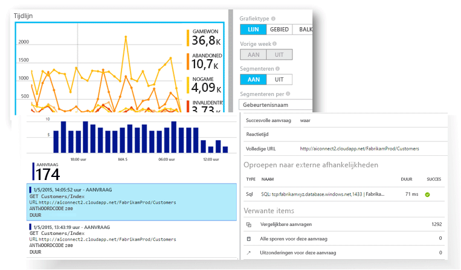

[Bekijk het introductiefilmpje hello](https://www.youtube.com/watch?v=fX2NtGrh-Y0).[Take a look at hello intro animation](https://www.youtube.com/watch?v=fX2NtGrh-Y0).

## Hoe werkt Application Insights?How does Application Insights work?
U een kleine instrumentation pakket installeren in uw toepassing en een Application Insights-resource in Microsoft Azure-portal Hallo instellen.You install a small instrumentation package in your application, and set up an Application Insights resource in hello Microsoft Azure portal. Hallo instrumentation bewaakt van uw app en verzendt telemetrie toohello gegevensportal.hello instrumentation monitors your app and sends telemetry data toohello portal. (overal kan worden uitgevoerd door de toepassing hello - heeft geen toobe gehost in Azure.)(hello application can run anywhere - it doesn't have toobe hosted in Azure.)

U kunt niet alleen webservicetoepassing hello, maar ook alle onderdelen van de achtergrond softwareontwikkelaars en Hallo JavaScript in Hallo webpagina's zelf.You can instrument not only hello web service application, but also any background components, and hello JavaScript in hello web pages themselves. 

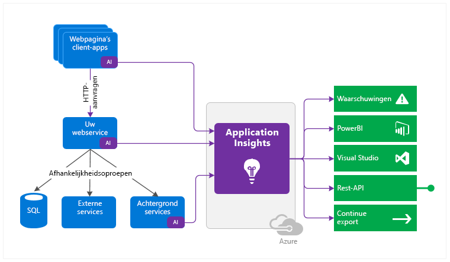

U kunt bovendien ophalen van telemetrie van de hostomgevingen Hallo zoals prestatiemeteritems of Azure diagnostics Docker-Logboeken.In addition, you can pull in telemetry from hello host environments such as performance counters, Azure diagnostics, or Docker logs. U kunt ook webtests die regelmatig synthetische aanvragen tooyour webservice verzenden instellen.You can also set up web tests that periodically send synthetic requests tooyour web service.

Alle deze stromen telemetrie zijn geïntegreerd in de Azure-portal, waar u krachtige kunt toepassen Hallo analytische en zoeken extra toohello onbewerkte gegevens.All these telemetry streams are integrated in hello Azure portal, where you can apply powerful analytic and search tools toohello raw data.

### Wat is de overhead Hallo?What's hello overhead?
Hallo impact op de prestaties van uw app is erg klein.hello impact on your app's performance is very small. De aanroepen voor het bijhouden van het appgebruik blokkeren uw app niet en worden batchgewijs in een afzonderlijke thread verzonden.Tracking calls are non-blocking, and are batched and sent in a separate thread.

## Wat wordt er door Application Insights gecontroleerd?What does Application Insights monitor?

Application Insights is gericht op Hallo ontwikkelingsteam, toohelp u begrijpen hoe uw app wordt uitgevoerd en hoe deze wordt gebruikt.Application Insights is aimed at hello development team, toohelp you understand how your app is performing and how it's being used. Met deze service kunt u het volgende controleren:It monitors:

* **Aantal aanvragen, reactietijden en foutpercentages** - ga na welke pagina's het populairst zijn op welke tijdstippen van de dag en waar uw gebruikers zich bevinden.**Request rates, response times, and failure rates** - Find out which pages are most popular, at what times of day, and where your users are. Ontdek welke pagina's het beste presteren.See which pages perform best. Als uw reactietijden en foutpercentages omhoog gaan wanneer er meer aanvragen binnenkomen, hebt u mogelijk te weinig resources.If your response times and failure rates go high when there are more requests, then perhaps you have a resourcing problem. 
* **Aantal afhankelijkheidsrelaties, reactietijden en foutpercentages** - controleer of externe services zorgen voor vertraging.**Dependency rates, response times, and failure rates** - Find out whether external services are slowing you down.
* **Uitzonderingen** - Analyse Hallo geaggregeerd statistieken, of Kies specifieke exemplaren en inzoomen Hallo stacktracering en verwante aanvragen.**Exceptions** - Analyse hello aggregated statistics, or pick specific instances and drill into hello stack trace and related requests. Zowel server- als browseruitzonderingen worden gerapporteerd.Both server and browser exceptions are reported.
* **Paginaweergaven en de prestaties bij het laden van pagina’s** - deze gegevens worden gerapporteerd door de browsers van uw gebruikers.**Page views and load performance** - reported by your users' browsers.
* **AJAX-aanroepen** van webpagina's - ga na wat het aantal aanroepen, de reactietijden en de foutpercentages zijn.**AJAX calls** from web pages - rates, response times, and failure rates.
* **Aantal gebruikers en sessies**.**User and session counts**.
* **Prestatiemeteritems** van uw Windows- of Linux-servers, zoals die voor CPU-, geheugen- en netwerkgebruik.**Performance counters** from your Windows or Linux server machines, such as CPU, memory, and network usage. 
* **Diagnostische gegevens van hosts** van Docker of Azure.**Host diagnostics** from Docker or Azure. 
* **Diagnostische traceerlogboeken** van uw app - met behulp hiervan kunt u de samenhang vaststellen tussen traceergebeurtenissen en aanvragen.**Diagnostic trace logs** from your app - so that you can correlate trace events with requests.
* **Aangepaste gebeurtenissen en metrische gegevens** dat u uzelf in Hallo client of server code, tootrack zakelijke gebeurtenissen schrijven zoals artikelen verkocht of games gewonnen.**Custom events and metrics** that you write yourself in hello client or server code, tootrack business events such as items sold or games won.

## Waar kan ik mijn telemetrie bekijken?Where do I see my telemetry?

Er zijn tal van manieren tooexplore uw gegevens.There are plenty of ways tooexplore your data. Lees de volgende artikelen:Check out these articles:

|  |  |
| --- | --- |
| [**Slimme detectie en handmatige waarschuwingen****Smart detection and manual alerts**](app-insights-proactive-diagnostics.md) Automatische waarschuwingen aan te passen van tooyour app normale patronen van Telemetrie en trigger wanneer er iets buiten Hallo gebruikelijke patroon.Automatic alerts adapt tooyour app's normal patterns of telemetry and trigger when there's something outside hello usual pattern. U kunt ook [waarschuwingen instellen](app-insights-alerts.md) voor bepaalde niveaus van aangepaste functies of standaardfuncties voor het verzamelen van metrische gegevens.You can also [set alerts](app-insights-alerts.md) on particular levels of custom or standard metrics. |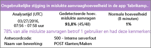 |
| [**Overzicht van de toepassing****Application map**](app-insights-app-map.md) Hallo-onderdelen van uw app, met de belangrijkste metrische gegevens en waarschuwingen.hello components of your app, with key metrics and alerts. |  |
| [**Profiler****Profiler**](app-insights-profiler.md) Hallo uitvoering profielen opgevangen aanvragen te controleren.Inspect hello execution profiles of sampled requests. |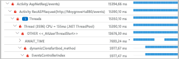 |
| [**Gebruiksanalyse****Usage analysis**](app-insights-usage-overview.md) Analyseer de segmentatie en retentie van gebruikers.Analyze user segmentation and retention.| |
| [**Diagnostische zoekactie naar gegevens van bepaalde items****Diagnostic search for instance data**](app-insights-diagnostic-search.md) U kunt zoeken naar gebeurtenissen, zoals aanvragen, uitzonderingen, afhankelijkheidsaanroepen, logboektraceringen en paginaweergaven en deze gegevens ook filteren.Search and filter events such as requests, exceptions, dependency calls, log traces, and page views.  |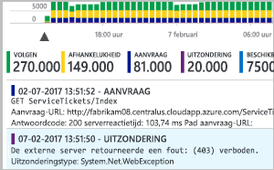 |
| [**Metrics Explorer voor cumulatieve gegevens****Metrics Explorer for aggregated data**](app-insights-metrics-explorer.md) Verken, filter en segmenteer cumulatieve gegevens, zoals aantallen aanvragen, fouten en uitzonderingen, reactietijden en paginalaadtijden.Explore, filter, and segment aggregated data such as rates of requests, failures, and exceptions; response times, page load times. | |
| [**Dashboards****Dashboards**](app-insights-dashboards.md#dashboards) Combineer gegevens van meerdere resources tot een mash-up en deel deze met anderen.Mash up data from multiple resources and share with others. Dit is ideaal voor toepassingen met meerdere onderdelen en continue weergegeven in de Hallo team ruimte.Great for multi-component applications, and for continuous display in hello team room. | |
| [**Live Metrics Stream****Live Metrics Stream**](app-insights-live-stream.md) Wanneer u een nieuwe build implementeert, bekijk deze indicatoren toomake voor prestaties near-realtime controleren of alles werkt zoals verwacht.When you deploy a new build, watch these near-real-time performance indicators toomake sure everything works as expected. |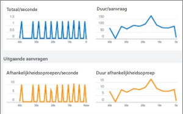 |
| [**Analytics****Analytics**](app-insights-analytics.md) Beantwoord moeilijke vragen over de prestaties en het gebruik van uw app met behulp van deze krachtige querytaal.Answer tough questions about your app's performance and usage by using this powerful query language. |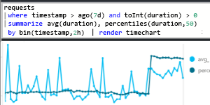 |
| [**Visual Studio****Visual Studio**](app-insights-visual-studio.md) Zie prestatiegegevens op Hallo-code.See performance data in hello code. Ga toocode van stack-traces.Go toocode from stack traces.|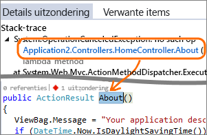 |
| [**Snapshot Debugger****Snapshot debugger**](app-insights-snapshot-debugger.md) Spoor fouten op in momentopnamen van live activiteiten, inclusief parameterwaarden.Debug snapshots sampled from live operations, with parameter values.|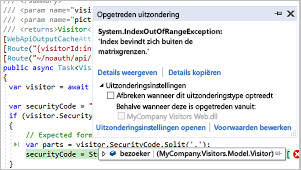 |
| [**Power BI****Power BI**](app-insights-export-power-bi.md) Integreer metrische gegevens over het gebruik van de toepassing met andere business intelligence.Integrate usage metrics with other business intelligence.| 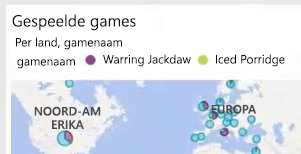|
| [**REST API****REST API**](https://dev.applicationinsights.io/) Schrijf code toorun query's via uw metrische gegevens en de onbewerkte gegevens.Write code toorun queries over your metrics and raw data.|  |
| [**Continue export****Continuous export**](app-insights-export-telemetry.md) Het exporteren van de onbewerkte gegevens toostorage bulksgewijs zodra deze binnenkomen.Bulk export of raw data toostorage as soon as it arrives. |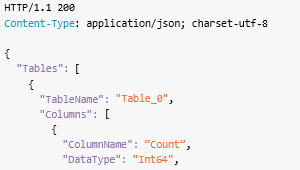 |

## Hoe kan ik Application Insights gebruiken?How do I use Application Insights?

### BewakenMonitor
Installeer Application Insights in uw app, stel de [beschikbaarheidswebtests](app-insights-monitor-web-app-availability.md) in en ga als volgt te werk:Install Application Insights in your app, set up [availability web tests](app-insights-monitor-web-app-availability.md), and:

* Instellen van een [dashboard](app-insights-dashboards.md) voor uw team ruimte tookeep een ogen op load, reactiesnelheid en prestaties van uw afhankelijkheden hello, pagina belasting en AJAX-aanroepen.Set up a [dashboard](app-insights-dashboards.md) for your team room tookeep an eye on load, responsiveness, and hello performance of your dependencies, page loads, and AJAX calls.
* Ontdek welke Hallo traagste en de meeste mislukte aanvragen zijn.Discover which are hello slowest and most failing requests.
* Bekijk [Live Stream](app-insights-live-stream.md) wanneer u een nieuwe release tooknow onmiddellijk over een verslechtering van implementeert.Watch [Live Stream](app-insights-live-stream.md) when you deploy a new release, tooknow immediately about any degradation.

### Fouten detecteren en een diagnose stellenDetect, Diagnose
Ga als volgt te werk als u een waarschuwing ontvangt of een probleem detecteert:When you receive an alert or discover a problem:

* Beoordeel hoeveel gebruikers last hebben van het probleem.Assess how many users are affected.
* Ga na of er een verband is tussen fouten en uitzonderingen, afhankelijkheidsaanroepen en traceringen.Correlate failures with exceptions, dependency calls and traces.
* Bekijk de informatie van Profiler, momentopnamen, stackdumps en traceerlogboeken.Examine profiler, snapshots, stack dumps, and trace logs.

### Meten is wetenBuild, Measure, Learn
[Hallo effectiviteit meten](app-insights-usage-overview.md) van elke nieuwe functie die u implementeert.[Measure hello effectiveness](app-insights-usage-overview.md) of each new feature that you deploy.

* Toomeasure plannen hoe klanten nieuwe UX- of business-functies gebruiken.Plan toomeasure how customers use new UX or business features.
* Schrijf aangepaste telemetrie in uw code.Write custom telemetry into your code.
* Base Hallo volgende ontwikkeling bladeren op vaste bewijs van uw telemetrie.Base hello next development cycle on hard evidence from your telemetry.

## Aan de slagGet started
Application Insights is een Hallo veel services die worden gehost in Microsoft Azure en telemetrie er verzonden voor analyse en presentatie.Application Insights is one of hello many services hosted within Microsoft Azure, and telemetry is sent there for analysis and presentation. Voordat u iets anders doen, u hoeft dus een abonnement te[Microsoft Azure](http://azure.com).So before you do anything else, you'll need a subscription too[Microsoft Azure](http://azure.com). Deze gratis toosign actief is en als u ervoor kiest Hallo basic [prijzen plan](https://azure.microsoft.com/pricing/details/application-insights/) van Application Insights, er zijn geen kosten tot uw toepassing toohave aanzienlijke gebruik is geworden.It's free toosign up, and if you choose hello basic [pricing plan](https://azure.microsoft.com/pricing/details/application-insights/) of Application Insights, there's no charge until your application has grown toohave substantial usage. Als uw organisatie al een abonnement heeft, kunnen ze de tooit van uw Microsoft-account toevoegen.If your organization already has a subscription, they could add your Microsoft account tooit.

Er zijn verschillende manieren tooget gestart.There are several ways tooget started. Begin op de manier die voor u het beste werkt.Begin with whichever works best for you. U kunt ook Hallo anderen later toevoegen.You can add hello others later.

* **Uitvoeringstijd at: uw web-app op Hallo-server te instrumenteren.****At run time: instrument your web app on hello server.** Update toohello code voorkomt.Avoids any update toohello code. U moet een beheerserver toegang tooyour.You need admin access tooyour server.
  * [**IIS on-premises of op een VM****IIS on-premises or on a VM**](app-insights-monitor-performance-live-website-now.md)
  * [**Azure web-app of VM****Azure web app or VM**](app-insights-monitor-performance-live-website-now.md)
  * [**J2EE****J2EE**](app-insights-java-live.md)
* **Op tijdstip development: Application Insights tooyour code toevoegen.****At development time: add Application Insights tooyour code.** Hiermee kunt u toowrite aangepaste Telemetrie en tooinstrument back-end en bureaublad-apps.Allows you toowrite custom telemetry and tooinstrument back-end and desktop apps.
  * [Visual Studio](app-insights-asp-net.md) 2013 update 2 of hoger.[Visual Studio](app-insights-asp-net.md) 2013 update 2 or later.
  * Java in [Eclipse](app-insights-java-eclipse.md) of [andere hulpprogramma’s](app-insights-java-get-started.md)Java in [Eclipse](app-insights-java-eclipse.md) or [other tools](app-insights-java-get-started.md)
  * [Node.jsNode.js](app-insights-nodejs.md)
  * [Andere platformsOther platforms](app-insights-platforms.md)
* **[Instrumenteer uw webpagina’s](app-insights-javascript.md)** voor paginaweergaven, AJAX-aanroepen en andere telemetrie op de clientzijde.**[Instrument your web pages](app-insights-javascript.md)** for page view, AJAX and other client-side telemetry.
* **[Beschikbaarheidstests](app-insights-monitor-web-app-availability.md)** - ping uw website regelmatig vanaf onze servers.**[Availability tests](app-insights-monitor-web-app-availability.md)** - ping your website regularly from our servers.

## Volgende stappenNext steps
Gebruik tijdens runtime:Get started at runtime with:

* [IIS-serverIIS server](app-insights-monitor-performance-live-website-now.md)
* [J2EE-serverJ2EE server](app-insights-java-live.md)

Gebruik tijdens het ontwikkelen:Get started at development time with:

* [ASP.NETASP.NET](app-insights-asp-net.md)
* [JavaJava](app-insights-java-get-started.md)
* [Node.jsNode.js](app-insights-nodejs.md)

## Ondersteuning en feedbackSupport and feedback
* Vragen en problemen:Questions and Issues:
  * [Problemen oplossen][qna][Troubleshooting][qna]
  * [MSDN-forumMSDN Forum](https://social.msdn.microsoft.com/Forums/vstudio/home?forum=ApplicationInsights)
  * [StackOverflowStackOverflow](http://stackoverflow.com/questions/tagged/ms-application-insights)
* Uw suggesties:Your suggestions:
  * [UserVoiceUserVoice](https://visualstudio.uservoice.com/forums/357324)
* Blog:Blog:
  * [Application Insights-blogApplication Insights blog](https://azure.microsoft.com/blog/tag/application-insights)

## Video'sVideos

[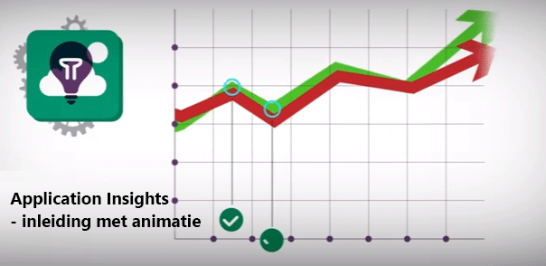](https://www.youtube.com/watch?v=fX2NtGrh-Y0)

> [!VIDEO https://channel9.msdn.com/events/Connect/2016/100/player] 

<!--Link references-->

[android]: https://github.com/Microsoft/ApplicationInsights-Android
[azure]: ../insights-perf-analytics.md
[client]: app-insights-javascript.md
[desktop]: app-insights-windows-desktop.md
[detect]: app-insights-detect-triage-diagnose.md
[greenbrown]: app-insights-asp-net.md
[ios]: https://github.com/Microsoft/ApplicationInsights-iOS
[java]: app-insights-java-get-started.md
[knowUsers]: app-insights-web-track-usage.md
[platforms]: app-insights-platforms.md
[portal]: http://portal.azure.com/
[qna]: app-insights-troubleshoot-faq.md
[redfield]: app-insights-monitor-performance-live-website-now.md
