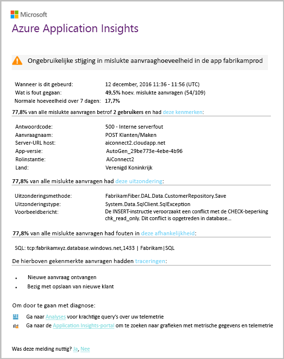

# Slimme detectie - fout afwijkingen
[Application Insights](app-insights-overview.md) automatisch een melding in bijna realtime als uw web-app optreedt in een abnormale toename in de Hallo frequentie van mislukte aanvragen. Een ongewone stijging van Hallo frequentie van HTTP-aanvragen of afhankelijkheidsaanroepen die worden gerapporteerd als mislukt wordt gedetecteerd. Voor aanvragen voor zijn mislukte aanvragen meestal die met reactiecodes van 400 of hoger. toohelp u sorteren en onderzoeken Hallo probleem, een analyse van Hallo kenmerken van Hallo fouten en gerelateerde telemetrie is opgegeven in Hallo melding. Er zijn ook koppelingen toohello Application Insights-portal voor verdere diagnose. Hallo moet functie geen installatie of de configuratie, aangezien hierbij machine learning algoritmen toopredict Hallo normale Faalpercentage.

Deze functie werkt voor Java- en ASP.NET web-apps, gehost in Hallo cloud of op uw eigen servers. Werkt het ook voor elke app die aanvraag of een afhankelijkheid telemetrie - bijvoorbeeld genereert als u hebt een werkrol die aanroept [TrackRequest()](app-insights-api-custom-events-metrics.md#trackrequest) of [TrackDependency()](app-insights-api-custom-events-metrics.md#trackdependency).

Na het instellen van [Application Insights voor uw project](app-insights-overview.md), en het opgegeven uw app in een bepaalde minimale hoeveelheid telemetrie genereert, Slimme detectie van de fout afwijkingen duurt 24 uur toolearn Hallo normaal gedrag van uw app, voordat deze is ingeschakeld en waarschuwingen kunt verzenden.

Hier volgt een voorbeeld-waarschuwing.

> [!NOTE]
> Standaard krijgt u een kortere indeling mail dan het volgende voorbeeld. Maar u kunt [switch toothis gedetailleerde indeling](#configure-alerts).
>
>

U ziet dat het vertelt u:

* Hallo Faalpercentage vergeleken toonormal app-gedrag.
* Hoeveel gebruikers zijn beïnvloed – zodat u hoeveel tooworry weet.
* Een kenmerkend patroon Hallo fouten gekoppeld. In dit voorbeeld is een bepaalde responscode, de Aanvraagnaam (bewerking) en de app-versie worden gebruikt. Die u onmiddellijk wordt uitgelegd waar toostart opzoeken in uw code. Andere mogelijkheden mogelijk een specifiek besturingssysteem browser of de client.
* Hallo uitzondering logboektraceringen en afhankelijkheidsfout (databases of andere externe componenten) die worden weergegeven die zijn gekoppeld aan Hallo toobe gekenmerkt fouten.
* Koppelingen rechtstreeks toorelevant zoekopdrachten Hallo telemetrie in Application Insights.

## Voordelen van Slimme detectie
Gewone [metrische waarschuwingen](app-insights-alerts.md) zien er mogelijk een probleem. Maar Slimme detectie begint Hallo diagnostische werk voor u het uitvoeren van een groot aantal Hallo analyse u anders zou hebben toodo zelf. U krijgt Hallo resultaten netjes verpakt, zodat u tooget snel toohello hoofdmap van Hallo probleem.

## Hoe werkt het?
Slimme detectie bewaakt Hallo telemetrie van uw app en in bepaalde Hallo uitvalpercentage ontvangen. Deze regel telt het aantal aanvragen voor welke Hallo Hallo `Successful request` eigenschap is ingesteld op false en Hallo afhankelijkheid aantal aanroepen voor welke Hallo `Successful call` eigenschap is ingesteld op false. Voor aanvragen, standaard `Successful request == (resultCode < 400)` (tenzij u aangepaste code te hebt geschreven[filter](app-insights-api-filtering-sampling.md#filtering) of genereren van uw eigen [TrackRequest](app-insights-api-custom-events-metrics.md#trackrequest) aanroepen). 

Prestaties van uw app heeft een doorsnee patroon gedrag. Sommige aanvragen of afhankelijkheidsaanroepen worden meer foutgevoelige toofailure dan andere; en hello algehele Faalpercentage mogelijk omhoog gaan als de belasting toeneemt. Slimme detectie gebruikt machine learning toofind deze afwijkingen.

Als telemetrie in Application Insights uit uw web-app afkomstig is, vergelijkt Slimme detectie Hallo huidige gedrag met Hallo patronen gezien via Hallo afgelopen paar dagen. Als een abnormale toename in Faalpercentage wordt waargenomen ten opzichte van eerdere prestaties, wordt een analyse wordt geactiveerd.

Wanneer een analyse wordt geactiveerd, voert Hallo-service een analyse van de cluster op Hallo van mislukte aanvragen, tootry tooidentify een patroon van de waarden die kenmerkend zijn voor Hallo fouten. Hallo analyse heeft gedetecteerd dat de meeste storingen over een specifieke resultaatcode, de Aanvraagnaam van de, Server-URL-host en rolinstantie zijn in Hallo bovenstaande voorbeeld. Hallo analyse is daarentegen is gedetecteerd dat Hallo clienteigenschap van het besturingssysteem zijn verdeeld over meerdere waarden en zodat deze niet wordt weergegeven.

Wanneer uw service is uitgerust met deze telemetrie-aanroepen, zoekt Hallo analyser naar een uitzondering en een afhankelijkheidsfout die zijn gekoppeld aan aanvragen in het is geïdentificeerd, samen met een voorbeeld van alle traceringslogboeken zoeken die zijn gekoppeld aan de Hallo-cluster aanvragen.

Hallo resulterende analysis wordt tooyou verzonden als waarschuwing, tenzij u deze niet op hebt geconfigureerd.

Zoals Hallo [waarschuwt u handmatig instellen](app-insights-alerts.md), u kunt inspecteren van de status van waarschuwing Hallo Hallo en configureert op Hallo waarschuwingen-blade van uw Application Insights-resource. Maar in tegenstelling tot andere waarschuwingen, of u kunt geen tooset up Slimme detectie configureren. Als u wilt, kunt u uitschakelen of wijzigen van de doel-e-mailadressen.

## Waarschuwingen configureren
Slimme detectie uitschakelen, e-mailontvangers Hallo wijzigen, een webhook maken of opt-in toomore gedetailleerde berichten een waarschuwing.

Open de pagina waarschuwingen Hallo. Fout afwijkingen is samen met eventuele waarschuwingen die u handmatig hebt ingesteld en u kunt zien of deze zich momenteel in de waarschuwingsstatus Hallo opgenomen.

Klik op de waarschuwing tooconfigure Hallo deze.

U ziet dat u Slimme detectie kunt uitschakelen, maar u kunt het niet verwijderen (of maak een nieuwe).

#### Gedetailleerde waarschuwingen
Als u selecteert 'Meer gedetailleerde diagnostische gegevens ophalen' bevatten Hallo e meer diagnostische gegevens. U zult soms kunnen toodiagnose Hallo probleem net van Hallo gegevens in Hallo e-mailbericht.

Er is een lichte risico dat meer gedetailleerde waarschuwing Hallo kan gevoelige gegevens bevatten, omdat deze uitzondering en tracering berichten bevat. Echter, dit gebeurt alleen als uw code gevoelige gegevens in deze berichten kunnen zou.

## Gesorteerd en het onderzoeken van een waarschuwing
Een waarschuwing geeft aan dat een abnormale toename in de frequentie van mislukte aanvragen Hallo is gevonden. Is het waarschijnlijk dat er een probleem is met uw app of de omgeving.

Van Hallo percentage aanvragen en het aantal beïnvloede gebruikers, kunt u bepalen hoe urgent Hallo probleem is. Hallo bovenstaande voorbeeld Hallo Faalpercentage van 22.5% worden vergeleken met een normale percentage van de % 1, geeft aan dat er een probleem op. Op Hallo daarentegen, alleen 11 gebruikers is van invloed op. Als uw app, zou u kunnen tooassess hoe ernstig die zijn.

In veel gevallen kunt u zich kunt toodiagnose Hallo probleem snel van Hallo Aanvraagnaam, uitzondering, fout- en traceringsbestanden afhankelijkheidsgegevens opgegeven.

Er zijn een aantal andere aanwijzingen. Hallo afhankelijkheid Faalpercentage in dit voorbeeld is bijvoorbeeld Hallo hetzelfde zijn als Hallo uitzondering snelheid (89,3%). Dit kan erop wijzen dat Hallo uitzondering rechtstreeks vanuit Hallo afhankelijkheidsfout ontstaat-zodat u een duidelijk beeld van waar u toostart opzoeken in uw code.

tooinvestigate bovendien Hallo koppelingen in elke sectie gaat u rechte tooa [zoekpagina](app-insights-diagnostic-search.md) toohello relevante aanvragen, uitzonderingen, afhankelijkheid of traceringen gefilterd. Of u kunt Hallo [Azure-portal](https://portal.azure.com), gaat u toohello Application Insights-resource voor uw app en Hallo fouten blade geopend.

In dit voorbeeld opent te klikken op Hallo 'afhankelijkheid fouten details weergeven, u Hallo Application Insights search-blade. Hallo SQL-instructie een voorbeeld van de hoofdoorzaak hello bevat te zien: null-waarden zijn opgegeven op verplichte velden en kan niet worden gevalideerd tijdens het Hallo opslagbewerking.

## Recente waarschuwingen weergeven

Klik op **Slimme detectie** tooget toohello meest recente waarschuwing:

## Wat is Hallo verschil...
Slimme detectie van afwijkingen fout vormt een aanvulling op andere vergelijkbare maar verschillende functies van Application Insights.

* [Metrische waarschuwingen](app-insights-alerts.md) worden ingesteld door u en een breed scala aan metrische gegevens zoals CPU-bezetting, aanvraag tarieven, laadtijden voor pagina's en enzovoort kunt bewaken. U kunt ze toowarn u, bijvoorbeeld, als u tooadd meer resources nodig. Daarentegen Slimme detectie van afwijkingen van de fout bevat informatie over een klein aantal belangrijke metrische gegevens (momenteel alleen frequentie van mislukte aanvragen), ontworpen toonotify die u in bijna realtime manier zodra de frequentie van mislukte aanvragen voor uw web-app kan oplopen ten opzichte van tooweb-app normaal gedrag.

    Slimme detectie wordt de drempelwaarde in antwoord tooprevailing voorwaarden automatisch aangepast.

    Slimme detectie begint Hallo diagnostische werk voor u.
* [Detectie van afwijkingen van smartcard](app-insights-proactive-performance-diagnostics.md) ook gebruikt intelligence toodiscover ongewone patronen in de metrische gegevens van uw computer en is geen configuratie door u vereist. Maar in tegenstelling tot Slimme detectie van de fout afwijkingen Hallo doel van Slimme detectie van afwijkingen toofind segmenten van uw gebruik verzamelbuis die mogelijk niet goed worden geleverd - bijvoorbeeld door specifieke pagina's op een specifiek type browser is. Hallo analyse dagelijks wordt uitgevoerd en als een van de resultaten wordt gevonden, is het waarschijnlijk toobe veel minder urgente dan een waarschuwing. Daarentegen Hallo-analyse voor fout afwijkingen continu wordt uitgevoerd op binnenkomende telemetriegegevens en u ontvangt een melding binnen enkele minuten als server uitvalpercentage groter zijn dan verwacht.

## Als u een waarschuwing Slimme detectie ontvangt
*Waarom hebt ik deze waarschuwing ontvangen?*

* We een ongewone stijging van mislukte aanvragen snelheid vergeleken toohello normale basislijn Hallo voorgaande periode gedetecteerd. Na analyse Hallo storingen en bijbehorende telemetrie zien we er is een probleem dat u ziet in.

*Hallo-bericht betekent dat er contact is een probleem?*

* We proberen tooalert op app onderbreking of vermindering, maar alleen u volledig inzicht in de Hallo semantiek en Hallo gevolgen voor de app Hallo of gebruikers.

*Ja, bekijkt u die mijn gegevens?*

* Nee. Hallo-service is geheel automatisch. Alleen het ophalen van Hallo meldingen. Uw gegevens [persoonlijke](app-insights-data-retention-privacy.md).

*Heb ik toosubscribe toothis waarschuwing?*

* Nee. Er is een fout opgetreden in elke toepassing dat verzendt telemetrie aanvragen Hallo Slimme detectie waarschuwingsregel.

*Kan ik afmelden of Hallo waarschuwingsmeldingen toomy collega's in plaats daarvan ophalen?*

* Ja, In waarschuwingsregels, klikt u op Hallo Slimme detectie regel tooconfigure deze. U kunt Hallo waarschuwing uitschakelen of geadresseerden voor Hallo waarschuwing wijzigen.

*Ik Hallo e-mailbericht is verbroken. Waar vind ik Hallo meldingen in Hallo-portal*

* In Logboeken Hallo-activiteit. In Azure, Hallo Application Insights-resource voor uw app openen en selecteer vervolgens activiteitenlogboeken.

*Aantal Hallo waarschuwingen zijn bekende problemen en ik wil niet tooreceive ze.*

* Waarschuwingsonderdrukking hebben we op onze achterstand.

## Volgende stappen
Deze diagnostische hulpprogramma's kunnen u controleren Hallo telemetrie van uw app:

* [Metrische explorer](app-insights-metrics-explorer.md)
* [Search explorer](app-insights-diagnostic-search.md)
* [Analytics - krachtige querytaal](app-insights-analytics-tour.md)

Smart detecties zijn volledig automatisch. Maar misschien wilt u tooset van sommige waarschuwingen meer?

* [Handmatig geconfigureerde metrische waarschuwingen](app-insights-alerts.md)
* [Webtests voor beschikbaarheid](app-insights-monitor-web-app-availability.md)
