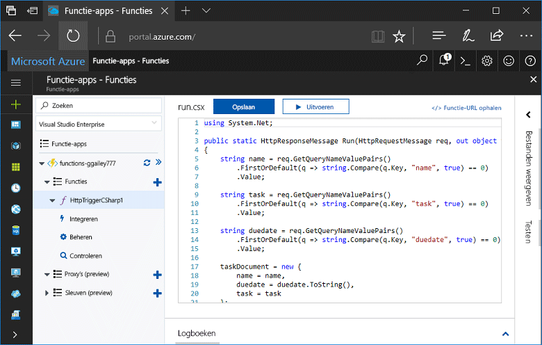
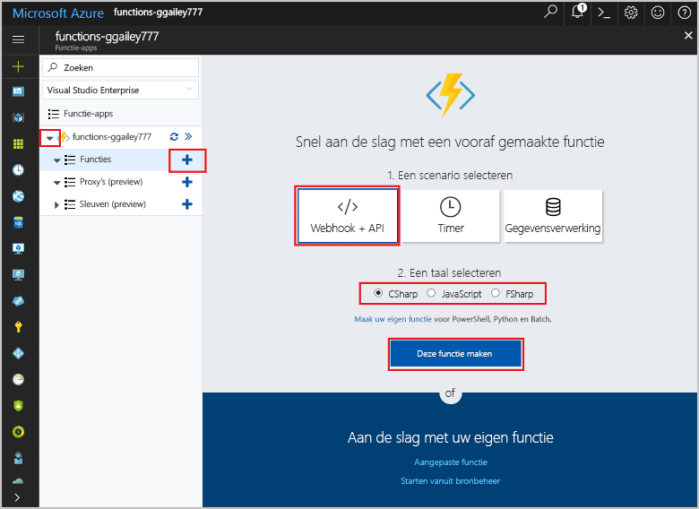
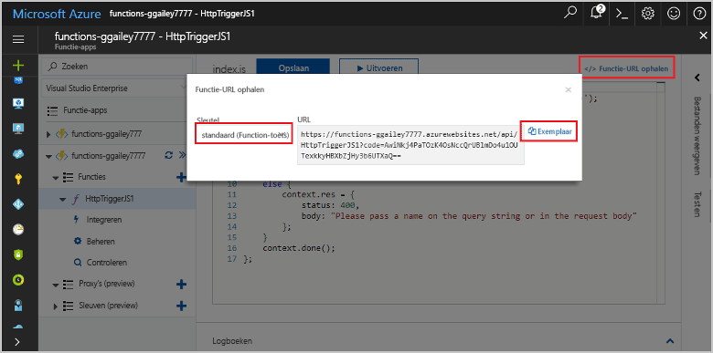
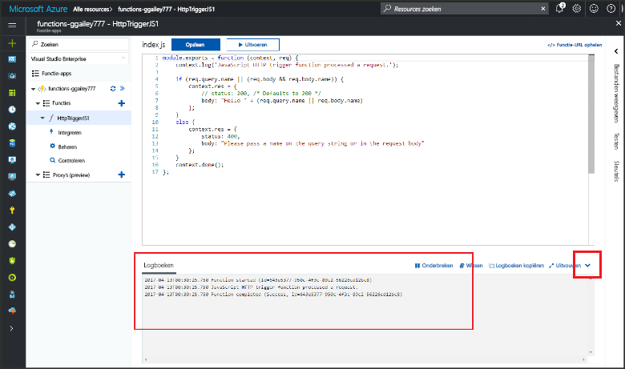

# Maken van uw eerste functie in hello Azure-portalCreate your first function in hello Azure portal

Azure Functions, kunt u uw code in een omgeving zonder server uitvoeren zonder toofirst een virtuele machine maken of een webtoepassing publiceert.Azure Functions lets you execute your code in a serverless environment without having toofirst create a VM or publish a web application. In dit onderwerp informatie over hoe toouse functioneert toocreate een functie "Hallo wereld" in hello Azure-portal.In this topic, learn how toouse Functions toocreate a "hello world" function in hello Azure portal.

[!INCLUDE [quickstarts-free-trial-note](../../includes/quickstarts-free-trial-note.md)]

## Meld u bij tooAzureLog in tooAzure

Meld u bij toohello [Azure-portal](https://portal.azure.com/).Log in toohello [Azure portal](https://portal.azure.com/).

## Een functie-app makenCreate a function app

U moet een functie-app toohost Hallo uitvoering van uw functies hebben.You must have a function app toohost hello execution of your functions. Met een functie-app kunt u functies groeperen in een logische eenheid, zodat u resources eenvoudiger kunt beheren, implementeren en delen.A function app lets you group functions as a logic unit for easier management, deployment, and sharing of resources. 

[!INCLUDE [Create function app Azure portal](../../includes/functions-create-function-app-portal.md)]

[!INCLUDE [functions-portal-favorite-function-apps](../../includes/functions-portal-favorite-function-apps.md)]

Vervolgens maakt u een functie in nieuwe Hallo-functie-app.Next, you create a function in hello new function app.

## Een door HTTP geactiveerde functie makenCreate an HTTP triggered function

1. Vouw uw nieuwe functie-app en klik op Hallo  **+**  knop naast te**functies**.Expand your new function app, then click hello **+** button next too**Functions**.

2.  In Hallo **snel aan de slag** pagina **WebHook + API**, **een taal kiezen** voor uw functie en klik op **maken van deze functie** .In hello **Get started quickly** page, select **WebHook + API**, **Choose a language** for your function, and click **Create this function**. 
   
    

Een functie wordt gemaakt in uw gekozen taal met Hallo-sjabloon voor een functie HTTP is geactiveerd.A function is created in your chosen language using hello template for an HTTP triggered function. U kunt de nieuwe functie Hallo uitvoeren door een HTTP-aanvraag te verzenden.You can run hello new function by sending an HTTP request.

## Hallo functie testenTest hello function

1. Klik in de nieuwe functie op **</> Functie-URL ophalen**, selecteer **Standaard (functietoets)** en klik vervolgens op **Kopieer**.In your new function, click **</> Get function URL**, select **default (Function key)**, and then click **Copy**. 

    

2. Hallo function URL in de adresbalk van uw browser plakken.Paste hello function URL into your browser's address bar. Hallo-queryreeks toevoegen `&name=<yourname>` toothis URL en druk op Hallo `Enter` sleutel op uw toetsenbord tooexecute Hallo-aanvraag.Append hello query string `&name=<yourname>` toothis URL and press hello `Enter` key on your keyboard tooexecute hello request. Hallo Hieronder volgt een voorbeeld van het Hallo-antwoord geretourneerd door de functie Hallo in de browser Edge Hallo:hello following is an example of hello response returned by hello function in hello Edge browser:

    

    Hallo-aanvraag URL bevat een sleutel die is vereist, standaard tooaccess uw functie via HTTP.hello request URL includes a key that is required, by default, tooaccess your function over HTTP.   

3. Wanneer de functie wordt uitgevoerd, is traceringsinformatie toohello Logboeken geschreven.When your function runs, trace information is written toohello logs. toosee hello trace-uitvoer van de vorige uitvoering hello, tooyour functie in de portal Hallo retourneren en klik op Hallo pijl onderaan Hallo Hallo scherm tooexpand **logboeken**.toosee hello trace output from hello previous execution, return tooyour function in hello portal and click hello up arrow at hello bottom of hello screen tooexpand **Logs**. 

   

## Resources opschonenClean up resources

[!INCLUDE [Clean up resources](../../includes/functions-quickstart-cleanup.md)]

## Volgende stappenNext steps

U hebt een functie-app met een eenvoudige door HTTP geactiveerde functie gemaakt.You have created a function app with a simple HTTP triggered function.  

[!INCLUDE [Next steps note](../../includes/functions-quickstart-next-steps.md)]

Zie [Azure Functions HTTP and webhook bindings](functions-bindings-http-webhook.md) (Azure Functions-HTTP- en webhookbindingen) voor meer informatie.For more information, see [Azure Functions HTTP and webhook bindings](functions-bindings-http-webhook.md).

