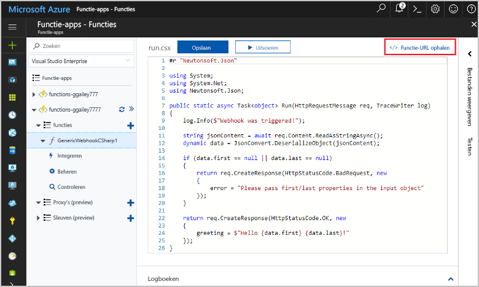
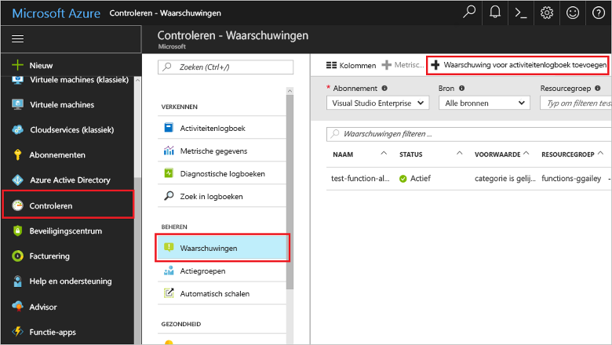
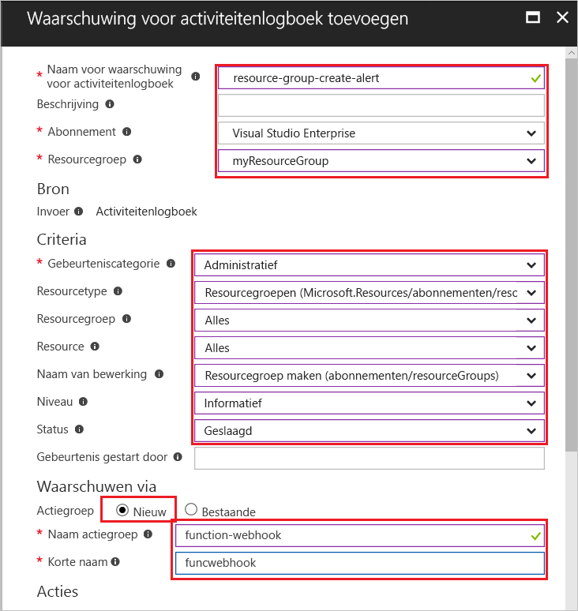
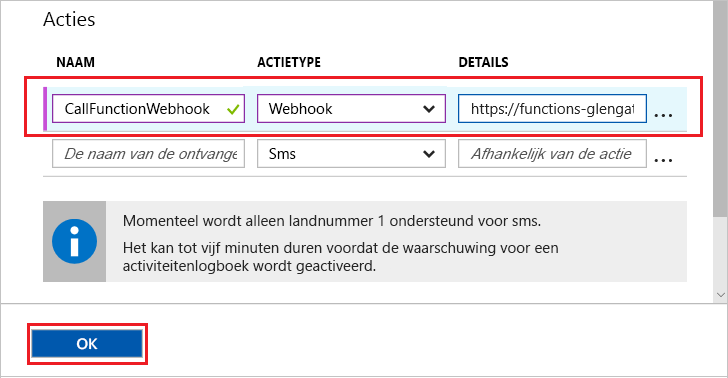
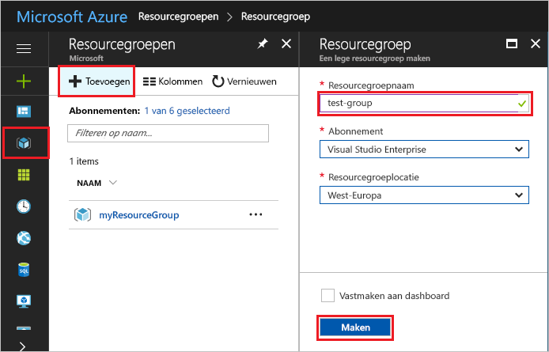
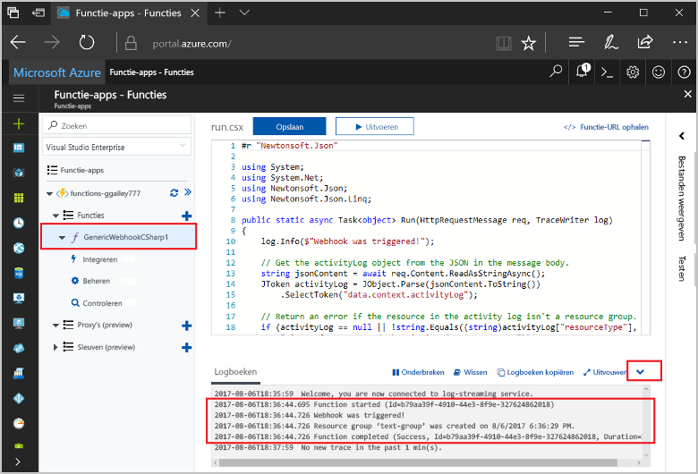

# <a name="create-a-function-triggered-by-a-generic-webhook"></a><span data-ttu-id="0a8bf-103">Maak een functie die wordt geactiveerd door een algemene webhook</span><span class="sxs-lookup"><span data-stu-id="0a8bf-103">Create a function triggered by a generic webhook</span></span>

<span data-ttu-id="0a8bf-104">Azure Functions, kunt u uw code in een omgeving zonder server uitvoeren zonder toofirst een virtuele machine maken of een webtoepassing publiceert.</span><span class="sxs-lookup"><span data-stu-id="0a8bf-104">Azure Functions lets you execute your code in a serverless environment without having toofirst create a VM or publish a web application.</span></span> <span data-ttu-id="0a8bf-105">U kunt bijvoorbeeld een functie toobe geactiveerd door een waarschuwing gegenereerd door Azure Monitor configureren.</span><span class="sxs-lookup"><span data-stu-id="0a8bf-105">For example, you can configure a function toobe triggered by an alert raised by Azure Monitor.</span></span> <span data-ttu-id="0a8bf-106">Dit onderwerp leest u hoe tooexecute C#-code als een resourcegroep is tooyour abonnement toegevoegd.</span><span class="sxs-lookup"><span data-stu-id="0a8bf-106">This topic shows you how tooexecute C# code when a resource group is added tooyour subscription.</span></span>   


## <a name="prerequisites"></a><span data-ttu-id="0a8bf-108">Vereisten</span><span class="sxs-lookup"><span data-stu-id="0a8bf-108">Prerequisites</span></span> 

<span data-ttu-id="0a8bf-109">toocomplete in deze zelfstudie:</span><span class="sxs-lookup"><span data-stu-id="0a8bf-109">toocomplete this tutorial:</span></span>

+ <span data-ttu-id="0a8bf-110">Als u nog geen abonnement op Azure hebt, maak dan een [gratis account](https://azure.microsoft.com/free/?WT.mc_id=A261C142F) aan voordat u begint.</span><span class="sxs-lookup"><span data-stu-id="0a8bf-110">If you don't have an Azure subscription, create a [free account](https://azure.microsoft.com/free/?WT.mc_id=A261C142F) before you begin.</span></span>

[!INCLUDE [functions-portal-favorite-function-apps](../../includes/functions-portal-favorite-function-apps.md)]

## <a name="create-an-azure-function-app"></a><span data-ttu-id="0a8bf-111">Een Azure-functie-app maken</span><span class="sxs-lookup"><span data-stu-id="0a8bf-111">Create an Azure Function app</span></span>

[!INCLUDE [Create function app Azure portal](../../includes/functions-create-function-app-portal.md)]

<span data-ttu-id="0a8bf-112">Vervolgens maakt u een functie in nieuwe Hallo-functie-app.</span><span class="sxs-lookup"><span data-stu-id="0a8bf-112">Next, you create a function in hello new function app.</span></span>

## <span data-ttu-id="0a8bf-113"><a name="create-function"></a>Maak een functie generic webhook geactiveerd</span><span class="sxs-lookup"><span data-stu-id="0a8bf-113"><a name="create-function"></a>Create a generic webhook triggered function</span></span>

1. <span data-ttu-id="0a8bf-114">Vouw de functie-app en klik op Hallo  **+**  knop naast te**functies**.</span><span class="sxs-lookup"><span data-stu-id="0a8bf-114">Expand your function app and click hello **+** button next too**Functions**.</span></span> <span data-ttu-id="0a8bf-115">Als u deze functie is de eerste certificaat in uw app functie hello, selecteert u **aangepaste functie**.</span><span class="sxs-lookup"><span data-stu-id="0a8bf-115">If this function is hello first one in your function app, select **Custom function**.</span></span> <span data-ttu-id="0a8bf-116">De volledige set Hallo van functie-sjablonen worden weergegeven.</span><span class="sxs-lookup"><span data-stu-id="0a8bf-116">This displays hello complete set of function templates.</span></span>

    

2. <span data-ttu-id="0a8bf-118">Selecteer Hallo **Generic WebHook - C#** sjabloon.</span><span class="sxs-lookup"><span data-stu-id="0a8bf-118">Select hello **Generic WebHook - C#** template.</span></span> <span data-ttu-id="0a8bf-119">Typ een naam voor uw C#-functie en selecteer vervolgens **maken**.</span><span class="sxs-lookup"><span data-stu-id="0a8bf-119">Type a name for your C# function, then select **Create**.</span></span>

      

2. <span data-ttu-id="0a8bf-121">Klik in de nieuwe functie op **<> / Get function URL**, kopiëren en opslaan van Hallo-waarde.</span><span class="sxs-lookup"><span data-stu-id="0a8bf-121">In your new function, click **</> Get function URL**, then copy and save hello value.</span></span> <span data-ttu-id="0a8bf-122">U gebruikt deze waarde tooconfigure hello webhook.</span><span class="sxs-lookup"><span data-stu-id="0a8bf-122">You use this value tooconfigure hello webhook.</span></span> 

    
         
<span data-ttu-id="0a8bf-124">Vervolgens maakt u een webhook-eindpunt in een waarschuwing voor het logboek van activiteit in de Azure-Monitor.</span><span class="sxs-lookup"><span data-stu-id="0a8bf-124">Next, you create a webhook endpoint in an activity log alert in Azure Monitor.</span></span> 

## <a name="create-an-activity-log-alert"></a><span data-ttu-id="0a8bf-125">Maken van een activiteit logboek-waarschuwing</span><span class="sxs-lookup"><span data-stu-id="0a8bf-125">Create an activity log alert</span></span>

1. <span data-ttu-id="0a8bf-126">In Azure-portal hello, navigeert u toohello **Monitor** service, selecteer **waarschuwingen**, en klik op **toevoegen activiteit logboek waarschuwing**.</span><span class="sxs-lookup"><span data-stu-id="0a8bf-126">In hello Azure portal, navigate toohello **Monitor** service, select **Alerts**, and click **Add activity log alert**.</span></span>   

    

2. <span data-ttu-id="0a8bf-128">Hallo-instellingen zoals opgegeven in de tabel hello gebruiken:</span><span class="sxs-lookup"><span data-stu-id="0a8bf-128">Use hello settings as specified in hello table:</span></span>

    

    | <span data-ttu-id="0a8bf-130">Instelling</span><span class="sxs-lookup"><span data-stu-id="0a8bf-130">Setting</span></span>      |  <span data-ttu-id="0a8bf-131">Voorgestelde waarde</span><span class="sxs-lookup"><span data-stu-id="0a8bf-131">Suggested value</span></span>   | <span data-ttu-id="0a8bf-132">Beschrijving</span><span class="sxs-lookup"><span data-stu-id="0a8bf-132">Description</span></span>                              |
    | ------------ |  ------- | -------------------------------------------------- |
    | <span data-ttu-id="0a8bf-133">**Waarschuwing voor activiteit logboeknaam**</span><span class="sxs-lookup"><span data-stu-id="0a8bf-133">**Activity log alert name**</span></span> | <span data-ttu-id="0a8bf-134">resource-group-maken-waarschuwing</span><span class="sxs-lookup"><span data-stu-id="0a8bf-134">resource-group-create-alert</span></span> | <span data-ttu-id="0a8bf-135">Naam van Hallo activiteit logboek waarschuwing.</span><span class="sxs-lookup"><span data-stu-id="0a8bf-135">Name of hello activity log alert.</span></span> |
    | <span data-ttu-id="0a8bf-136">**Abonnement**</span><span class="sxs-lookup"><span data-stu-id="0a8bf-136">**Subscription**</span></span> | <span data-ttu-id="0a8bf-137">Uw abonnement</span><span class="sxs-lookup"><span data-stu-id="0a8bf-137">Your subscription</span></span> | <span data-ttu-id="0a8bf-138">Hallo-abonnement die u voor deze zelfstudie gebruikt.</span><span class="sxs-lookup"><span data-stu-id="0a8bf-138">hello subscription you are using for this tutorial.</span></span> | 
    |  <span data-ttu-id="0a8bf-139">**Resourcegroep**</span><span class="sxs-lookup"><span data-stu-id="0a8bf-139">**Resource Group**</span></span> | <span data-ttu-id="0a8bf-140">myResourceGroup</span><span class="sxs-lookup"><span data-stu-id="0a8bf-140">myResourceGroup</span></span> | <span data-ttu-id="0a8bf-141">Hallo-resourcegroep die Hallo resources een melding sturen om te worden geïmplementeerd.</span><span class="sxs-lookup"><span data-stu-id="0a8bf-141">hello resource group that hello alert resources are deployed to.</span></span> <span data-ttu-id="0a8bf-142">Met behulp van dezelfde resourcegroep Hallo als uw app in de functie maakt het eenvoudiger tooclean up nadat u Hallo-zelfstudie hebt voltooid.</span><span class="sxs-lookup"><span data-stu-id="0a8bf-142">Using hello same resource group as your function app makes it easier tooclean up after you complete hello tutorial.</span></span> |
    | <span data-ttu-id="0a8bf-143">**Gebeurteniscategorie**</span><span class="sxs-lookup"><span data-stu-id="0a8bf-143">**Event category**</span></span> | <span data-ttu-id="0a8bf-144">Beheerdersrechten</span><span class="sxs-lookup"><span data-stu-id="0a8bf-144">Administrative</span></span> | <span data-ttu-id="0a8bf-145">Deze categorie omvat wijzigingen tooAzure resources.</span><span class="sxs-lookup"><span data-stu-id="0a8bf-145">This category includes changes made tooAzure resources.</span></span>  |
    | <span data-ttu-id="0a8bf-146">**Brontype**</span><span class="sxs-lookup"><span data-stu-id="0a8bf-146">**Resource type**</span></span> | <span data-ttu-id="0a8bf-147">Resourcegroepen</span><span class="sxs-lookup"><span data-stu-id="0a8bf-147">Resource groups</span></span> | <span data-ttu-id="0a8bf-148">Waarschuwingen tooresource groepsactiviteiten filtert.</span><span class="sxs-lookup"><span data-stu-id="0a8bf-148">Filters alerts tooresource group activities.</span></span> |
    | <span data-ttu-id="0a8bf-149">**Resourcegroep**</span><span class="sxs-lookup"><span data-stu-id="0a8bf-149">**Resource Group**</span></span><br/><span data-ttu-id="0a8bf-150">en **Resource**</span><span class="sxs-lookup"><span data-stu-id="0a8bf-150">and **Resource**</span></span> | <span data-ttu-id="0a8bf-151">Alle</span><span class="sxs-lookup"><span data-stu-id="0a8bf-151">All</span></span> | <span data-ttu-id="0a8bf-152">Alle resources bewaken.</span><span class="sxs-lookup"><span data-stu-id="0a8bf-152">Monitor all resources.</span></span> |
    | <span data-ttu-id="0a8bf-153">**De naam van bewerking**</span><span class="sxs-lookup"><span data-stu-id="0a8bf-153">**Operation name**</span></span> | <span data-ttu-id="0a8bf-154">Een resourcegroep maken</span><span class="sxs-lookup"><span data-stu-id="0a8bf-154">Create Resource Group</span></span> | <span data-ttu-id="0a8bf-155">Waarschuwingen toocreate operations filtert.</span><span class="sxs-lookup"><span data-stu-id="0a8bf-155">Filters alerts toocreate operations.</span></span> |
    | <span data-ttu-id="0a8bf-156">**Niveau**</span><span class="sxs-lookup"><span data-stu-id="0a8bf-156">**Level**</span></span> | <span data-ttu-id="0a8bf-157">Informatief</span><span class="sxs-lookup"><span data-stu-id="0a8bf-157">Informational</span></span> | <span data-ttu-id="0a8bf-158">Informatieve waarschuwing bevatten.</span><span class="sxs-lookup"><span data-stu-id="0a8bf-158">Include informational level alerts.</span></span> | 
    | <span data-ttu-id="0a8bf-159">**Status**</span><span class="sxs-lookup"><span data-stu-id="0a8bf-159">**Status**</span></span> | <span data-ttu-id="0a8bf-160">Geslaagd</span><span class="sxs-lookup"><span data-stu-id="0a8bf-160">Succeeded</span></span> | <span data-ttu-id="0a8bf-161">Tooactions filters waarschuwingen die zijn met succes voltooid.</span><span class="sxs-lookup"><span data-stu-id="0a8bf-161">Filters alerts tooactions that have completed successfully.</span></span> |
    | <span data-ttu-id="0a8bf-162">**Actiegroep**</span><span class="sxs-lookup"><span data-stu-id="0a8bf-162">**Action group**</span></span> | <span data-ttu-id="0a8bf-163">Nieuw</span><span class="sxs-lookup"><span data-stu-id="0a8bf-163">New</span></span> | <span data-ttu-id="0a8bf-164">Maak een nieuwe actiegroep, waarmee wordt gedefinieerd Hallo actie duurt wanneer een waarschuwing wordt gegenereerd.</span><span class="sxs-lookup"><span data-stu-id="0a8bf-164">Create a new action group, which defines hello action takes when an alert is raised.</span></span> |
    | <span data-ttu-id="0a8bf-165">**De naam van groep**</span><span class="sxs-lookup"><span data-stu-id="0a8bf-165">**Action group name**</span></span> | <span data-ttu-id="0a8bf-166">functie-webhook</span><span class="sxs-lookup"><span data-stu-id="0a8bf-166">function-webhook</span></span> | <span data-ttu-id="0a8bf-167">Een naam tooidentify Hallo actiegroep.</span><span class="sxs-lookup"><span data-stu-id="0a8bf-167">A name tooidentify hello action group.</span></span>  | 
    | <span data-ttu-id="0a8bf-168">**Korte naam**</span><span class="sxs-lookup"><span data-stu-id="0a8bf-168">**Short name**</span></span> | <span data-ttu-id="0a8bf-169">funcwebhook</span><span class="sxs-lookup"><span data-stu-id="0a8bf-169">funcwebhook</span></span> | <span data-ttu-id="0a8bf-170">Een korte naam voor Hallo actiegroep.</span><span class="sxs-lookup"><span data-stu-id="0a8bf-170">A short name for hello action group.</span></span> |  

3. <span data-ttu-id="0a8bf-171">In **acties**, een actie met Hallo-instellingen zoals opgegeven in de tabel Hallo toevoegen:</span><span class="sxs-lookup"><span data-stu-id="0a8bf-171">In **Actions**, add an action using hello settings as specified in hello table:</span></span> 

    

    | <span data-ttu-id="0a8bf-173">Instelling</span><span class="sxs-lookup"><span data-stu-id="0a8bf-173">Setting</span></span>      |  <span data-ttu-id="0a8bf-174">Voorgestelde waarde</span><span class="sxs-lookup"><span data-stu-id="0a8bf-174">Suggested value</span></span>   | <span data-ttu-id="0a8bf-175">Beschrijving</span><span class="sxs-lookup"><span data-stu-id="0a8bf-175">Description</span></span>                              |
    | ------------ |  ------- | -------------------------------------------------- |
    | <span data-ttu-id="0a8bf-176">**Naam**</span><span class="sxs-lookup"><span data-stu-id="0a8bf-176">**Name**</span></span> | <span data-ttu-id="0a8bf-177">CallFunctionWebhook</span><span class="sxs-lookup"><span data-stu-id="0a8bf-177">CallFunctionWebhook</span></span> | <span data-ttu-id="0a8bf-178">Een naam voor het Hallo-actie.</span><span class="sxs-lookup"><span data-stu-id="0a8bf-178">A name for hello action.</span></span> |
    | <span data-ttu-id="0a8bf-179">**Actietype**</span><span class="sxs-lookup"><span data-stu-id="0a8bf-179">**Action type**</span></span> | <span data-ttu-id="0a8bf-180">Webhook</span><span class="sxs-lookup"><span data-stu-id="0a8bf-180">Webhook</span></span> | <span data-ttu-id="0a8bf-181">Hallo antwoord toohello waarschuwing is dat een Webhook-URL wordt aangeroepen.</span><span class="sxs-lookup"><span data-stu-id="0a8bf-181">hello response toohello alert is that a Webhook URL is called.</span></span> |
    | <span data-ttu-id="0a8bf-182">**Details**</span><span class="sxs-lookup"><span data-stu-id="0a8bf-182">**Details**</span></span> | <span data-ttu-id="0a8bf-183">URL van de functie</span><span class="sxs-lookup"><span data-stu-id="0a8bf-183">Function URL</span></span> | <span data-ttu-id="0a8bf-184">Plak in Hallo webhook-URL van Hallo-functie die u eerder hebt gekopieerd.</span><span class="sxs-lookup"><span data-stu-id="0a8bf-184">Paste in hello webhook URL of hello function that you copied earlier.</span></span> |<span data-ttu-id="0a8bf-185">v</span><span class="sxs-lookup"><span data-stu-id="0a8bf-185">v</span></span>

4. <span data-ttu-id="0a8bf-186">Klik op **OK** toocreate Hallo waarschuwing en de actie-groep.</span><span class="sxs-lookup"><span data-stu-id="0a8bf-186">Click **OK** toocreate hello alert and action group.</span></span>  

<span data-ttu-id="0a8bf-187">Hallo webhook heet nu als een resourcegroep wordt gemaakt in uw abonnement.</span><span class="sxs-lookup"><span data-stu-id="0a8bf-187">hello webhook is now called when a resource group is created in your subscription.</span></span> <span data-ttu-id="0a8bf-188">Werk vervolgens Hallo code in de functie toohandle Hallo JSON-logboekgegevens in Hallo hoofdtekst van Hallo-aanvraag.</span><span class="sxs-lookup"><span data-stu-id="0a8bf-188">Next, you update hello code in your function toohandle hello JSON log data in hello body of hello request.</span></span>   

## <a name="update-hello-function-code"></a><span data-ttu-id="0a8bf-189">Hallo functiecode bijwerken</span><span class="sxs-lookup"><span data-stu-id="0a8bf-189">Update hello function code</span></span>

1. <span data-ttu-id="0a8bf-190">Navigeer terug tooyour functie-app in de portal Hallo uit en vouw de functie.</span><span class="sxs-lookup"><span data-stu-id="0a8bf-190">Navigate back tooyour function app in hello portal, and expand your function.</span></span> 

2. <span data-ttu-id="0a8bf-191">Hallo C#-scriptcode in Hallo-functie in de portal Hallo vervangen door Hallo code te volgen:</span><span class="sxs-lookup"><span data-stu-id="0a8bf-191">Replace hello C# script code in hello function in hello portal with hello following code:</span></span>

    ```csharp
    #r "Newtonsoft.Json"
    
    using System;
    using System.Net;
    using Newtonsoft.Json;
    using Newtonsoft.Json.Linq;
    
    public static async Task<object> Run(HttpRequestMessage req, TraceWriter log)
    {
        log.Info($"Webhook was triggered!");
    
        // Get hello activityLog object from hello JSON in hello message body.
        string jsonContent = await req.Content.ReadAsStringAsync();
        JToken activityLog = JObject.Parse(jsonContent.ToString())
            .SelectToken("data.context.activityLog");
    
        // Return an error if hello resource in hello activity log isn't a resource group. 
        if (activityLog == null || !string.Equals((string)activityLog["resourceType"], 
            "Microsoft.Resources/subscriptions/resourcegroups"))
        {
            log.Error("An error occured");
            return req.CreateResponse(HttpStatusCode.BadRequest, new
            {
                error = "Unexpected message payload or wrong alert received."
            });
        }
    
        // Write information about hello created resource group toohello streaming log.
        log.Info(string.Format("Resource group '{0}' was {1} on {2}.",
            (string)activityLog["resourceGroupName"],
            ((string)activityLog["subStatus"]).ToLower(), 
            (DateTime)activityLog["submissionTimestamp"]));
    
        return req.CreateResponse(HttpStatusCode.OK);    
    }
    ```

<span data-ttu-id="0a8bf-192">U kunt nu Hallo functie testen door een nieuwe resourcegroep maken in uw abonnement.</span><span class="sxs-lookup"><span data-stu-id="0a8bf-192">Now you can test hello function by creating a new resource group in your subscription.</span></span>

## <a name="test-hello-function"></a><span data-ttu-id="0a8bf-193">Hallo functie testen</span><span class="sxs-lookup"><span data-stu-id="0a8bf-193">Test hello function</span></span>

1. <span data-ttu-id="0a8bf-194">Klik op Hallo resource group-pictogram in Hallo links van hello Azure portal, selecteer **+ toevoegen**, typ een **Resourcegroepnaam**, en selecteer **maken** toocreate een lege resourcegroep.</span><span class="sxs-lookup"><span data-stu-id="0a8bf-194">Click hello resource group icon in hello left of hello Azure portal, select **+ Add**, type a **Resource group name**, and select **Create** toocreate an empty resource group.</span></span>
    
    

2. <span data-ttu-id="0a8bf-196">De functie tooyour Ga terug en vouw Hallo **logboeken** venster.</span><span class="sxs-lookup"><span data-stu-id="0a8bf-196">Go back tooyour function and expand hello **Logs** window.</span></span> <span data-ttu-id="0a8bf-197">Nadat de resourcegroep Hallo is gemaakt, hello activiteit logboek waarschuwing triggers Hallo webhook en Hallo-functie wordt uitgevoerd.</span><span class="sxs-lookup"><span data-stu-id="0a8bf-197">After hello resource group is created, hello activity log alert triggers hello webhook and hello function executes.</span></span> <span data-ttu-id="0a8bf-198">U ziet Hallo-naam van Hallo nieuwe resourcegroep toohello Logboeken geschreven.</span><span class="sxs-lookup"><span data-stu-id="0a8bf-198">You see hello name of hello new resource group written toohello logs.</span></span>  

    

3. <span data-ttu-id="0a8bf-200">(Optioneel) Ga terug en verwijderen van Hallo resourcegroep die u hebt gemaakt.</span><span class="sxs-lookup"><span data-stu-id="0a8bf-200">(Optional) Go back and delete hello resource group that you created.</span></span> <span data-ttu-id="0a8bf-201">Houd er rekening mee dat deze activiteit Hallo-functie niet activeren.</span><span class="sxs-lookup"><span data-stu-id="0a8bf-201">Note that this activity doesn't trigger hello function.</span></span> <span data-ttu-id="0a8bf-202">Dit komt doordat delete-bewerkingen worden gefilterd door Hallo waarschuwing.</span><span class="sxs-lookup"><span data-stu-id="0a8bf-202">This is because delete operations are filtered out by hello alert.</span></span> 

## <a name="clean-up-resources"></a><span data-ttu-id="0a8bf-203">Resources opschonen</span><span class="sxs-lookup"><span data-stu-id="0a8bf-203">Clean up resources</span></span>

[!INCLUDE [Next steps note](../../includes/functions-quickstart-cleanup.md)]

## <a name="next-steps"></a><span data-ttu-id="0a8bf-204">Volgende stappen</span><span class="sxs-lookup"><span data-stu-id="0a8bf-204">Next steps</span></span>

<span data-ttu-id="0a8bf-205">U kunt een functie die wordt uitgevoerd wanneer een aanvraag wordt ontvangen van een algemene webhook hebt gemaakt.</span><span class="sxs-lookup"><span data-stu-id="0a8bf-205">You have created a function that runs when a request is received from a generic webhook.</span></span> 

[!INCLUDE [Next steps note](../../includes/functions-quickstart-next-steps.md)]

<span data-ttu-id="0a8bf-206">Zie [Azure Functions HTTP and webhook bindings](functions-bindings-http-webhook.md) (Azure Functions-HTTP- en webhookbindingen) voor meer informatie over webhooktriggers.</span><span class="sxs-lookup"><span data-stu-id="0a8bf-206">For more information about webhook triggers, see [Azure Functions HTTP and webhook bindings](functions-bindings-http-webhook.md).</span></span> <span data-ttu-id="0a8bf-207">toolearn meer informatie over het ontwikkelen van functies in C#, Zie [Azure Functions C# script referentie voor ontwikkelaars](functions-reference-csharp.md).</span><span class="sxs-lookup"><span data-stu-id="0a8bf-207">toolearn more about developing functions in C#, see [Azure Functions C# script developer reference](functions-reference-csharp.md).</span></span>

