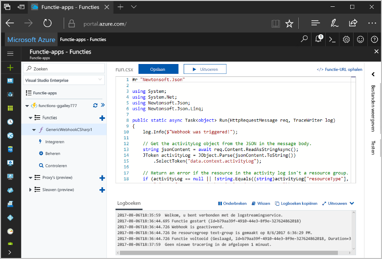

# <a name="create-a-function-triggered-by-a-generic-webhook"></a>Maak een functie die wordt geactiveerd door een algemene webhook

Azure Functions, kunt u uw code in een omgeving zonder server uitvoeren zonder toofirst een virtuele machine maken of een webtoepassing publiceert. U kunt bijvoorbeeld een functie toobe geactiveerd door een waarschuwing gegenereerd door Azure Monitor configureren. Dit onderwerp leest u hoe tooexecute C#-code als een resourcegroep is tooyour abonnement toegevoegd.   



## <a name="prerequisites"></a>Vereisten 

toocomplete in deze zelfstudie:

+ Als u nog geen abonnement op Azure hebt, maak dan een [gratis account](https://azure.microsoft.com/free/?WT.mc_id=A261C142F) aan voordat u begint.

[!INCLUDE [functions-portal-favorite-function-apps](../../includes/functions-portal-favorite-function-apps.md)]

## <a name="create-an-azure-function-app"></a>Een Azure-functie-app maken

[!INCLUDE [Create function app Azure portal](../../includes/functions-create-function-app-portal.md)]

Vervolgens maakt u een functie in nieuwe Hallo-functie-app.

## <a name="create-function"></a>Maak een functie generic webhook geactiveerd

1. Vouw de functie-app en klik op Hallo  **+**  knop naast te**functies**. Als u deze functie is de eerste certificaat in uw app functie hello, selecteert u **aangepaste functie**. De volledige set Hallo van functie-sjablonen worden weergegeven.

    

2. Selecteer Hallo **Generic WebHook - C#** sjabloon. Typ een naam voor uw C#-functie en selecteer vervolgens **maken**.

      

2. Klik in de nieuwe functie op **<> / Get function URL**, kopiëren en opslaan van Hallo-waarde. U gebruikt deze waarde tooconfigure hello webhook. 

    
         
Vervolgens maakt u een webhook-eindpunt in een waarschuwing voor het logboek van activiteit in de Azure-Monitor. 

## <a name="create-an-activity-log-alert"></a>Maken van een activiteit logboek-waarschuwing

1. In Azure-portal hello, navigeert u toohello **Monitor** service, selecteer **waarschuwingen**, en klik op **toevoegen activiteit logboek waarschuwing**.   

    

2. Hallo-instellingen zoals opgegeven in de tabel hello gebruiken:

    

    | Instelling      |  Voorgestelde waarde   | Beschrijving                              |
    | ------------ |  ------- | -------------------------------------------------- |
    | **Waarschuwing voor activiteit logboeknaam** | resource-group-maken-waarschuwing | Naam van Hallo activiteit logboek waarschuwing. |
    | **Abonnement** | Uw abonnement | Hallo-abonnement die u voor deze zelfstudie gebruikt. | 
    |  **Resourcegroep** | myResourceGroup | Hallo-resourcegroep die Hallo resources een melding sturen om te worden geïmplementeerd. Met behulp van dezelfde resourcegroep Hallo als uw app in de functie maakt het eenvoudiger tooclean up nadat u Hallo-zelfstudie hebt voltooid. |
    | **Gebeurteniscategorie** | Beheerdersrechten | Deze categorie omvat wijzigingen tooAzure resources.  |
    | **Brontype** | Resourcegroepen | Waarschuwingen tooresource groepsactiviteiten filtert. |
    | **Resourcegroep**<br/>en **Resource** | Alle | Alle resources bewaken. |
    | **De naam van bewerking** | Een resourcegroep maken | Waarschuwingen toocreate operations filtert. |
    | **Niveau** | Informatief | Informatieve waarschuwing bevatten. | 
    | **Status** | Geslaagd | Tooactions filters waarschuwingen die zijn met succes voltooid. |
    | **Actiegroep** | Nieuw | Maak een nieuwe actiegroep, waarmee wordt gedefinieerd Hallo actie duurt wanneer een waarschuwing wordt gegenereerd. |
    | **De naam van groep** | functie-webhook | Een naam tooidentify Hallo actiegroep.  | 
    | **Korte naam** | funcwebhook | Een korte naam voor Hallo actiegroep. |  

3. In **acties**, een actie met Hallo-instellingen zoals opgegeven in de tabel Hallo toevoegen: 

    

    | Instelling      |  Voorgestelde waarde   | Beschrijving                              |
    | ------------ |  ------- | -------------------------------------------------- |
    | **Naam** | CallFunctionWebhook | Een naam voor het Hallo-actie. |
    | **Actietype** | Webhook | Hallo antwoord toohello waarschuwing is dat een Webhook-URL wordt aangeroepen. |
    | **Details** | URL van de functie | Plak in Hallo webhook-URL van Hallo-functie die u eerder hebt gekopieerd. |v

4. Klik op **OK** toocreate Hallo waarschuwing en de actie-groep.  

Hallo webhook heet nu als een resourcegroep wordt gemaakt in uw abonnement. Werk vervolgens Hallo code in de functie toohandle Hallo JSON-logboekgegevens in Hallo hoofdtekst van Hallo-aanvraag.   

## <a name="update-hello-function-code"></a>Hallo functiecode bijwerken

1. Navigeer terug tooyour functie-app in de portal Hallo uit en vouw de functie. 

2. Hallo C#-scriptcode in Hallo-functie in de portal Hallo vervangen door Hallo code te volgen:

    ```csharp
    #r "Newtonsoft.Json"
    
    using System;
    using System.Net;
    using Newtonsoft.Json;
    using Newtonsoft.Json.Linq;
    
    public static async Task<object> Run(HttpRequestMessage req, TraceWriter log)
    {
        log.Info($"Webhook was triggered!");
    
        // Get hello activityLog object from hello JSON in hello message body.
        string jsonContent = await req.Content.ReadAsStringAsync();
        JToken activityLog = JObject.Parse(jsonContent.ToString())
            .SelectToken("data.context.activityLog");
    
        // Return an error if hello resource in hello activity log isn't a resource group. 
        if (activityLog == null || !string.Equals((string)activityLog["resourceType"], 
            "Microsoft.Resources/subscriptions/resourcegroups"))
        {
            log.Error("An error occured");
            return req.CreateResponse(HttpStatusCode.BadRequest, new
            {
                error = "Unexpected message payload or wrong alert received."
            });
        }
    
        // Write information about hello created resource group toohello streaming log.
        log.Info(string.Format("Resource group '{0}' was {1} on {2}.",
            (string)activityLog["resourceGroupName"],
            ((string)activityLog["subStatus"]).ToLower(), 
            (DateTime)activityLog["submissionTimestamp"]));
    
        return req.CreateResponse(HttpStatusCode.OK);    
    }
    ```

U kunt nu Hallo functie testen door een nieuwe resourcegroep maken in uw abonnement.

## <a name="test-hello-function"></a>Hallo functie testen

1. Klik op Hallo resource group-pictogram in Hallo links van hello Azure portal, selecteer **+ toevoegen**, typ een **Resourcegroepnaam**, en selecteer **maken** toocreate een lege resourcegroep.
    
    

2. De functie tooyour Ga terug en vouw Hallo **logboeken** venster. Nadat de resourcegroep Hallo is gemaakt, hello activiteit logboek waarschuwing triggers Hallo webhook en Hallo-functie wordt uitgevoerd. U ziet Hallo-naam van Hallo nieuwe resourcegroep toohello Logboeken geschreven.  

    

3. (Optioneel) Ga terug en verwijderen van Hallo resourcegroep die u hebt gemaakt. Houd er rekening mee dat deze activiteit Hallo-functie niet activeren. Dit komt doordat delete-bewerkingen worden gefilterd door Hallo waarschuwing. 

## <a name="clean-up-resources"></a>Resources opschonen

[!INCLUDE [Next steps note](../../includes/functions-quickstart-cleanup.md)]

## <a name="next-steps"></a>Volgende stappen

U kunt een functie die wordt uitgevoerd wanneer een aanvraag wordt ontvangen van een algemene webhook hebt gemaakt. 

[!INCLUDE [Next steps note](../../includes/functions-quickstart-next-steps.md)]

Zie [Azure Functions HTTP and webhook bindings](functions-bindings-http-webhook.md) (Azure Functions-HTTP- en webhookbindingen) voor meer informatie over webhooktriggers. toolearn meer informatie over het ontwikkelen van functies in C#, Zie [Azure Functions C# script referentie voor ontwikkelaars](functions-reference-csharp.md).

