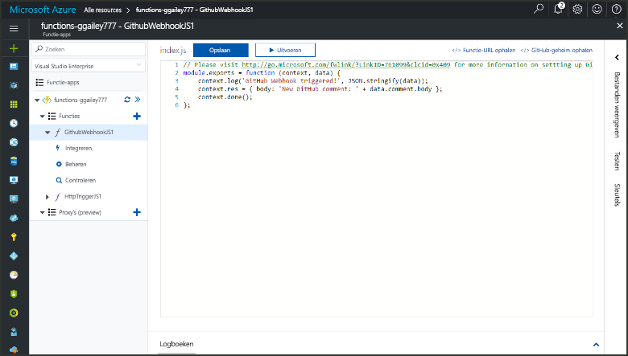
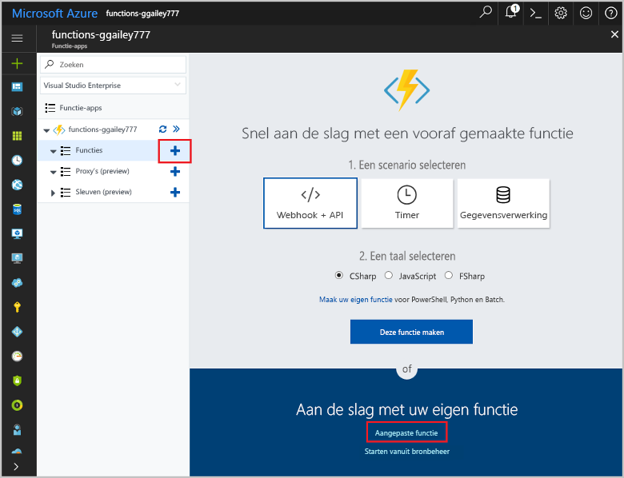
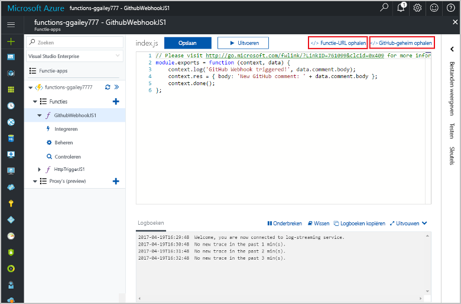

# Een door een GitHub-webhook geactiveerde functie maken

Meer informatie over hoe toocreate een functie die wordt veroorzaakt door een HTTP-webhook-aanvraag met een GitHub-specifieke nettolading.

## Vereisten

+ Een GitHub-account met ten minste één project.
+ Een Azure-abonnement. Als u nog geen abonnement hebt, maakt u een [gratis account](https://azure.microsoft.com/free/?WT.mc_id=A261C142F) voordat u begint.

[!INCLUDE [functions-portal-favorite-function-apps](../../includes/functions-portal-favorite-function-apps.md)]

## Een Azure-functie-app maken

[!INCLUDE [Create function app Azure portal](../../includes/functions-create-function-app-portal.md)]

Vervolgens maakt u een functie in nieuwe Hallo-functie-app.

## Een door een GitHub-webhook geactiveerde functie maken

1. Vouw de functie-app en klik op Hallo  **+**  knop naast te**functies**. Als dit eerste functie in uw app functie hello, selecteer **aangepaste functie**. De volledige set Hallo van functie-sjablonen worden weergegeven.

    

2. Selecteer Hallo **GitHub WebHook** sjabloon voor de gewenste taal. **Geef de functie een naam** en selecteer vervolgens **Maken**.

      

3. Klik in de nieuwe functie op **<> / Get function URL**, kopiëren en opslaan van Hallo waarden. Hetzelfde geldt voor Hallo **<> / ophalen van GitHub geheim**. U gebruikt deze waarden tooconfigure hello webhook in GitHub.

    

Vervolgens maakt u een webhook in uw GitHub-opslagplaats.

## Hallo webhook configureren

1. Navigeer in GitHub, tooa opslagplaats waarvan u eigenaar. U kunt ook een opslagplaats gebruiken die u hebt gesplitst. Als u een opslagplaats toofork moet, gebruikt u <https://github.com/Azure-Samples/functions-quickstart>.

1. Klik achtereenvolgens op **Instellingen**, **Webhooks** en **Webhook toevoegen**.

    

1. Instellingen zoals opgegeven in de tabel hello gebruiken en klik vervolgens op **webhook toevoegen**.

    

| Instelling | Voorgestelde waarde | Beschrijving |
|---|---|---|
| **URL van de nettolading** | Gekopieerde waarde | Hallo-waarde geretourneerd door **<> / Get function URL**. |
| **Geheim**   | Gekopieerde waarde | Hallo-waarde geretourneerd door **<> / ophalen van GitHub geheim**. |
| **Inhoudstype** | application/json | Hallo functie verwacht een JSON-nettolading. |
| Gebeurtenistriggers | Ik wil afzonderlijke gebeurtenissen selecteren | We willen alleen tootrigger op probleem Opmerking gebeurtenissen.  |
| | Opmerking bij actie item |  |

Nu Hallo webhook geconfigureerde tootrigger is de functie wanneer een nieuwe probleem opmerking wordt toegevoegd.

## Hallo functie testen

1. Open in uw GitHub-opslagplaats Hallo **problemen** tabblad in een nieuw browservenster.

1. Op het nieuwe venster Hallo **nieuwe probleem**, typt u een titel en klik vervolgens op **indienen van nieuwe probleem**.

1. Typ een opmerking in Hallo probleem, en klik op **Opmerking**.

    

1. Ga terug toohello portal en bekijk Hallo Logboeken. Hier ziet u een vermelding in het traceerlogboek door Hallo nieuwe opmerkingstekst.

     

## Resources opschonen

[!INCLUDE [Next steps note](../../includes/functions-quickstart-cleanup.md)]

## Volgende stappen

U hebt een functie gemaakt die wordt uitgevoerd wanneer er een aanvraag wordt ontvangen van een GitHub-webhook.

[!INCLUDE [Next steps note](../../includes/functions-quickstart-next-steps.md)]

Zie [Azure Functions HTTP and webhook bindings](functions-bindings-http-webhook.md) (Azure Functions-HTTP- en webhookbindingen) voor meer informatie over webhooktriggers.
