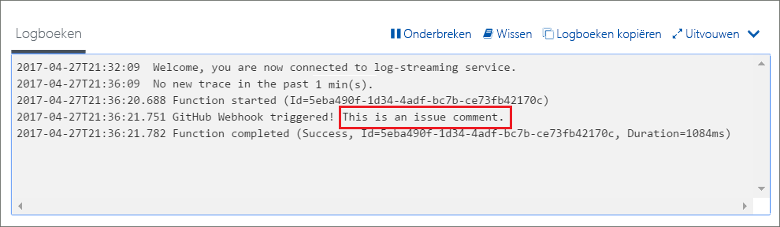

# Een door een GitHub-webhook geactiveerde functie makenCreate a function triggered by a GitHub webhook

Ontdek hoe u een functie maakt die wordt geactiveerd door een HTTP-webhookaanvraag met een specifieke GitHub-nettolading.Learn how to create a function that is triggered by an HTTP webhook request with a GitHub-specific payload.

## VereistenPrerequisites

+ Een GitHub-account met ten minste één project.A GitHub account with at least one project.
+ Een Azure-abonnement.An Azure subscription. Als u nog geen abonnement hebt, maakt u een [gratis account](https://azure.microsoft.com/free/?WT.mc_id=A261C142F) voordat u begint.If you don't have one, create a [free account](https://azure.microsoft.com/free/?WT.mc_id=A261C142F) before you begin.

[!INCLUDE [functions-portal-favorite-function-apps](../../includes/functions-portal-favorite-function-apps.md)]

## Een Azure-functie-app makenCreate an Azure Function app

[!INCLUDE [Create function app Azure portal](../../includes/functions-create-function-app-portal.md)]

Vervolgens maakt u een functie in de nieuwe functie-app.Next, you create a function in the new function app.

## Een door een GitHub-webhook geactiveerde functie makenCreate a GitHub webhook triggered function

1. Vouw de functie-app uit en klik op de knop **+** naast **Functies**.Expand your function app and click the **+** button next to **Functions**. Als dit de eerste functie in de functie-app is, selecteert u **Aangepaste functie**.If this is the first function in your function app, select **Custom function**. U ziet nu de volledige set het functiesjablonen.This displays the complete set of function templates.

    

2. Selecteer de **GitHub WebHook** sjabloon voor de gewenste taal.Select the **GitHub WebHook** template for your desired language. **Geef de functie een naam** en selecteer vervolgens **Maken**.**Name your function**, then select **Create**.

      

3. Klik in de nieuwe functie op **</> Functie-URL ophalen**, kopieer de waarden en sla deze op.In your new function, click **</> Get function URL**, then copy and save the values. Doe hetzelfde voor **</> GitHub-geheim ophalen**.Do the same thing for **</> Get GitHub secret**. U hebt deze waarden nodig voor het configureren van de webhook in GitHub.You use these values to configure the webhook in GitHub.

    

Vervolgens maakt u een webhook in uw GitHub-opslagplaats.Next, you create a webhook in your GitHub repository.

## De webhook configurerenConfigure the webhook

1. Navigeer naar een van uw opslagplaatsen in GitHub.In GitHub, navigate to a repository that you own. U kunt ook een opslagplaats gebruiken die u hebt gesplitst.You can also use any repository that you have forked. Als u een opslagplaats moet splitsen, gebruikt u <https://github.com/Azure-Samples/functions-quickstart>.If you need to fork a repository, use <https://github.com/Azure-Samples/functions-quickstart>.

1. Klik achtereenvolgens op **Instellingen**, **Webhooks** en **Webhook toevoegen**.Click **Settings**, then click **Webhooks**, and  **Add webhook**.

    

1. Gebruik de instellingen zoals die in de tabel zijn opgegeven en klik vervolgens op **Webhook toevoegen**.Use settings as specified in the table, then click **Add webhook**.

    

| InstellingSetting | Voorgestelde waardeSuggested value | BeschrijvingDescription |
|---|---|---|
| **URL van de nettolading****Payload URL** | Gekopieerde waardeCopied value | Gebruik de waarde die wordt geretourneerd door **</> Functie-URL ophalen**.Use the value returned by  **</> Get function URL**. |
| **Geheim****Secret**   | Gekopieerde waardeCopied value | Gebruik de waarde die wordt geretourneerd door **</> GitHub-geheim ophalen**.Use the value returned by  **</> Get GitHub secret**. |
| **Inhoudstype****Content type** | application/jsonapplication/json | De functie verwacht een JSON-nettolading.The function expects a JSON payload. |
| GebeurtenistriggersEvent triggers | Ik wil afzonderlijke gebeurtenissen selecterenLet me select individual events | We willen alleen activeren bij gebeurtenissen met een opmerking bij actie van het item.We only want to trigger on issue comment events.  |
| | Opmerking bij actie itemIssue comment |  |

Nu is de webhook zo geconfigureerd dat de functie wordt geactiveerd wanneer er een nieuwe probleemopmerking wordt toegevoegd.Now, the webhook is configured to trigger your function when a new issue comment is added.

## De functie testenTest the function

1. Open in uw GitHub-opslagplaats het tabblad **Problemen** in een nieuw browservenster.In your GitHub repository, open the **Issues** tab in a new browser window.

1. Klik in het nieuwe venster op **Nieuw probleem**, voer een titel in en klik op **Nieuw probleem verzenden**.In the new window, click **New Issue**, type a title, and then click **Submit new issue**.

1. Typ een opmerking bij probleem en klik op **Opmerking**.In the issue, type a comment and click **Comment**.

    

1. Ga terug naar de portal en bekijk de logboeken.Go back to the portal and view the logs. Hier ziet u een traceervermelding met de tekst van de nieuwe opmerking.You should see a trace entry with the new comment text.

     

## Resources opschonenClean up resources

[!INCLUDE [Next steps note](../../includes/functions-quickstart-cleanup.md)]

## Volgende stappenNext steps

U hebt een functie gemaakt die wordt uitgevoerd wanneer er een aanvraag wordt ontvangen van een GitHub-webhook.You have created a function that runs when a request is received from a GitHub webhook.

[!INCLUDE [Next steps note](../../includes/functions-quickstart-next-steps.md)]

Zie [Azure Functions HTTP and webhook bindings](functions-bindings-http-webhook.md) (Azure Functions-HTTP- en webhookbindingen) voor meer informatie over webhooktriggers.For more information about webhook triggers, see [Azure Functions HTTP and webhook bindings](functions-bindings-http-webhook.md).
