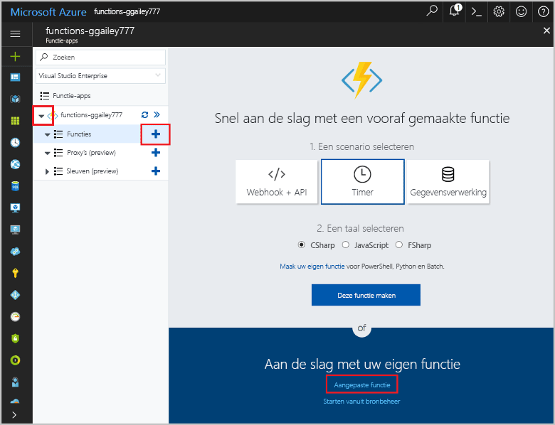

# Maak een functie in Azure die wordt geactiveerd door een timerCreate a function in Azure that is triggered by a timer

Meer informatie over hoe toouse Azure Functions toocreate een functie die wordt uitgevoerd op basis van een planning die u definieert.Learn how toouse Azure Functions toocreate a function that runs based a schedule that you define.

## VereistenPrerequisites

toocomplete in deze zelfstudie:toocomplete this tutorial:

+ Als u nog geen abonnement op Azure hebt, maak dan een [gratis account](https://azure.microsoft.com/free/?WT.mc_id=A261C142F) aan voordat u begint.If you don't have an Azure subscription, create a [free account](https://azure.microsoft.com/free/?WT.mc_id=A261C142F) before you begin.

[!INCLUDE [functions-portal-favorite-function-apps](../../includes/functions-portal-favorite-function-apps.md)]

## Een Azure-functie-app makenCreate an Azure Function app

[!INCLUDE [Create function app Azure portal](../../includes/functions-create-function-app-portal.md)]

Vervolgens maakt u een functie in nieuwe Hallo-functie-app.Next, you create a function in hello new function app.

## Een door een timer geactiveerde functie makenCreate a timer triggered function

1. Vouw de functie-app en klik op Hallo  **+**  knop naast te**functies**.Expand your function app and click hello **+** button next too**Functions**. Als dit eerste functie in uw app functie hello, selecteer **aangepaste functie**.If this is hello first function in your function app, select **Custom function**. De volledige set Hallo van functie-sjablonen worden weergegeven.This displays hello complete set of function templates.

    

2. Selecteer Hallo **TimerTrigger** sjabloon voor de gewenste taal.Select hello **TimerTrigger** template for your desired language. Gebruik vervolgens Hallo instellingen zoals opgegeven in de tabel Hallo:Then use hello settings as specified in hello table:

    

    | InstellingSetting | Voorgestelde waardeSuggested value | BeschrijvingDescription |
    |---|---|---|
    | **Een naam voor de functie opgeven****Name your function** | TimerTriggerCSharp1TimerTriggerCSharp1 | Hallo-naam van de timerfunctie geactiveerd definieert.Defines hello name of your timer triggered function. |
    | **[Planning](http://en.wikipedia.org/wiki/Cron#CRON_expression)****[Schedule](http://en.wikipedia.org/wiki/Cron#CRON_expression)** | 0 \*/1 \* \* \* \*0 \*/1 \* \* \* \* | Een veld zes [CRON expressie](http://en.wikipedia.org/wiki/Cron#CRON_expression) die uw toorun functie plant u elke minuut.A six field [CRON expression](http://en.wikipedia.org/wiki/Cron#CRON_expression) that schedules your function toorun every minute. |

2. Klik op **Create**.Click **Create**. Er wordt een functie gemaakt in uw gekozen taal en deze wordt elke minuut uitgevoerd.A function is created in your chosen language that runs every minute.

3. Controleer of u kan worden uitgevoerd door toohello Logboeken geschreven traceringsinformatie weer te geven.Verify execution by viewing trace information written toohello logs.

    

U kunt nu de planning van de functie Hallo wijzigen zodat deze minder vaak zoals één keer per uur wordt uitgevoerd.Now, you can change hello function's schedule so that it runs less often, such as once every hour. 

## Hallo timer schema bijwerkenUpdate hello timer schedule

1. Vouw de functie uit en klik op **Integreren**.Expand your function and click **Integrate**. Dit is waar u definieert u welke invoer en uitvoer van de bindingen voor de functie en ook Hallo-planning instellen.This is where you define input and output bindings for your function and also set hello schedule. 

2. Voer voor de nieuwe **Planning** een waarde van `0 0 */1 * * *` in en klik vervolgens op **Opslaan**.Enter a new **Schedule** value of `0 0 */1 * * *`, and then click **Save**.  

U hebt nu een functie die één keer per uur wordt uitgevoerd.You now have a function that runs once every hour. 

## Resources opschonenClean up resources

[!INCLUDE [Next steps note](../../includes/functions-quickstart-cleanup.md)]

## Volgende stappenNext steps

U hebt een functie gemaakt die wordt uitgevoerd op basis van een schema.You have created a function that runs based on a schedule.

[!INCLUDE [Next steps note](../../includes/functions-quickstart-next-steps.md)]

Zie voor meer informatie over timeractiveringen [Schedule code execution with Azure Functions](functions-bindings-timer.md) (Code-uitvoering plannen met Azure Functions).For more information timer triggers, see [Schedule code execution with Azure Functions](functions-bindings-timer.md).