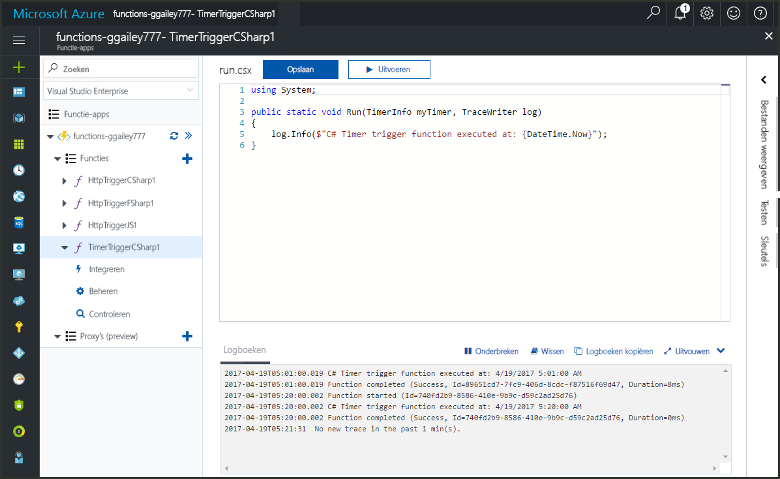
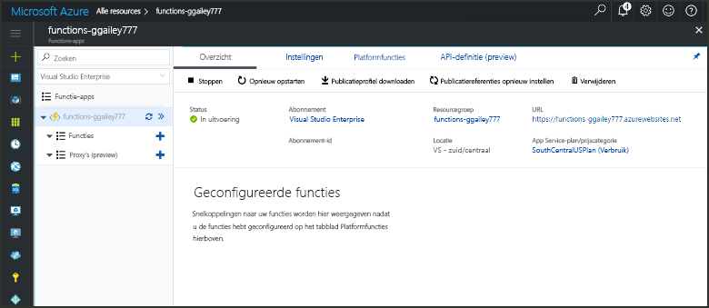
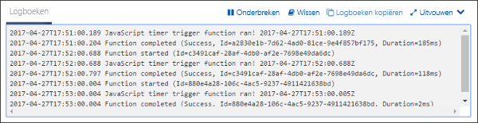
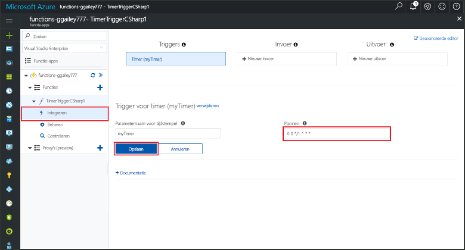

# Maak een functie in Azure die wordt geactiveerd door een timer

Meer informatie over hoe toouse Azure Functions toocreate een functie die wordt uitgevoerd op basis van een planning die u definieert.

## Vereisten

toocomplete in deze zelfstudie:

+ Als u nog geen abonnement op Azure hebt, maak dan een [gratis account](https://azure.microsoft.com/free/?WT.mc_id=A261C142F) aan voordat u begint.

[!INCLUDE [functions-portal-favorite-function-apps](../../includes/functions-portal-favorite-function-apps.md)]

## Een Azure-functie-app maken

[!INCLUDE [Create function app Azure portal](../../includes/functions-create-function-app-portal.md)]

Vervolgens maakt u een functie in nieuwe Hallo-functie-app.

## Een door een timer geactiveerde functie maken

1. Vouw de functie-app en klik op Hallo  **+**  knop naast te**functies**. Als dit eerste functie in uw app functie hello, selecteer **aangepaste functie**. De volledige set Hallo van functie-sjablonen worden weergegeven.

    

2. Selecteer Hallo **TimerTrigger** sjabloon voor de gewenste taal. Gebruik vervolgens Hallo instellingen zoals opgegeven in de tabel Hallo:

    

    | Instelling | Voorgestelde waarde | Beschrijving |
    |---|---|---|
    | **Een naam voor de functie opgeven** | TimerTriggerCSharp1 | Hallo-naam van de timerfunctie geactiveerd definieert. |
    | **[Planning](http://en.wikipedia.org/wiki/Cron#CRON_expression)** | 0 \*/1 \* \* \* \* | Een veld zes [CRON expressie](http://en.wikipedia.org/wiki/Cron#CRON_expression) die uw toorun functie plant u elke minuut. |

2. Klik op **Create**. Er wordt een functie gemaakt in uw gekozen taal en deze wordt elke minuut uitgevoerd.

3. Controleer of u kan worden uitgevoerd door toohello Logboeken geschreven traceringsinformatie weer te geven.

    

U kunt nu de planning van de functie Hallo wijzigen zodat deze minder vaak zoals één keer per uur wordt uitgevoerd. 

## Hallo timer schema bijwerken

1. Vouw de functie uit en klik op **Integreren**. Dit is waar u definieert u welke invoer en uitvoer van de bindingen voor de functie en ook Hallo-planning instellen. 

2. Voer voor de nieuwe **Planning** een waarde van `0 0 */1 * * *` in en klik vervolgens op **Opslaan**.  

U hebt nu een functie die één keer per uur wordt uitgevoerd. 

## Resources opschonen

[!INCLUDE [Next steps note](../../includes/functions-quickstart-cleanup.md)]

## Volgende stappen

U hebt een functie gemaakt die wordt uitgevoerd op basis van een schema.

[!INCLUDE [Next steps note](../../includes/functions-quickstart-next-steps.md)]

Zie voor meer informatie over timeractiveringen [Schedule code execution with Azure Functions](functions-bindings-timer.md) (Code-uitvoering plannen met Azure Functions).