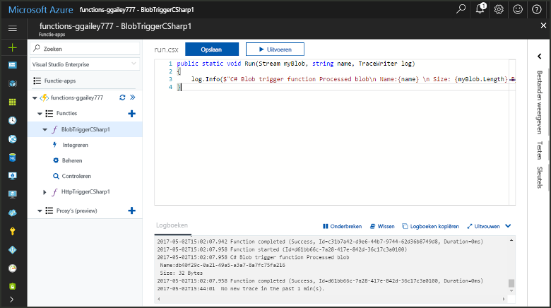
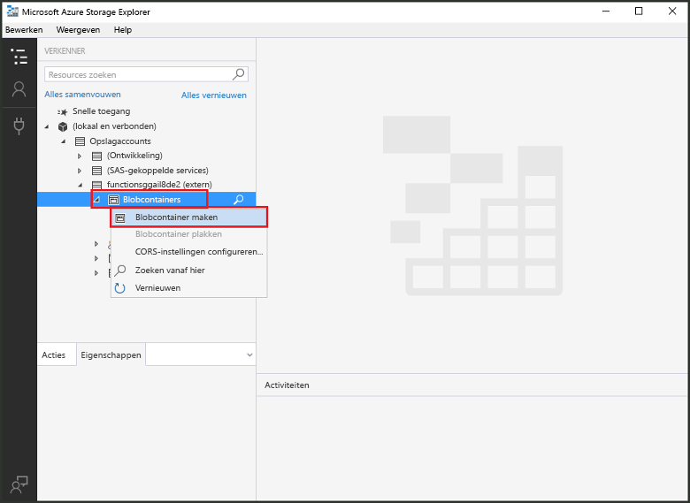
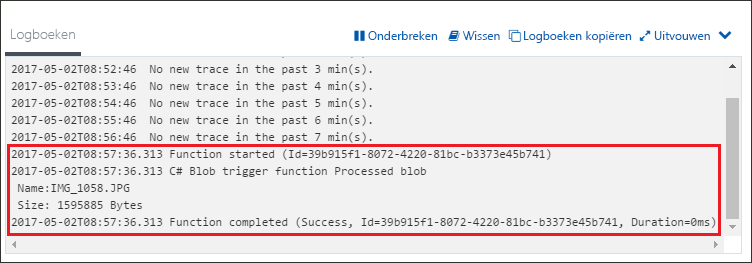

# Een door Azure Blob Storage geactiveerde functie makenCreate a function triggered by Azure Blob storage

Meer informatie over hoe toocreate een functie die wordt geactiveerd wanneer de bestanden zijn geüpload tooor bijgewerkt in Azure Blob-opslag.Learn how toocreate a function triggered when files are uploaded tooor updated in Azure Blob storage.

## VereistenPrerequisites

+ Download en installeer Hallo [Microsoft Azure Storage Explorer](http://storageexplorer.com/).Download and install hello [Microsoft Azure Storage Explorer](http://storageexplorer.com/).
+ Een Azure-abonnement.An Azure subscription. Als u nog geen abonnement hebt, maakt u een [gratis account](https://azure.microsoft.com/free/?WT.mc_id=A261C142F) voordat u begint.If you don't have one, create a [free account](https://azure.microsoft.com/free/?WT.mc_id=A261C142F) before you begin.

[!INCLUDE [functions-portal-favorite-function-apps](../../includes/functions-portal-favorite-function-apps.md)]

## Een Azure-functie-app makenCreate an Azure Function app

[!INCLUDE [Create function app Azure portal](../../includes/functions-create-function-app-portal.md)]

Vervolgens maakt u een functie in nieuwe Hallo-functie-app.Next, you create a function in hello new function app.

## Een door Blob Storage geactiveerde functie makenCreate a Blob storage triggered function

1. Vouw de functie-app en klik op Hallo  **+**  knop naast te**functies**.Expand your function app and click hello **+** button next too**Functions**. Als dit eerste functie in uw app functie hello, selecteer **aangepaste functie**.If this is hello first function in your function app, select **Custom function**. De volledige set Hallo van functie-sjablonen worden weergegeven.This displays hello complete set of function templates.

    

2. Selecteer Hallo **BlobTrigger** sjabloon voor de gewenste taal en Hallo-instellingen zoals opgegeven in de tabel hello gebruiken.Select hello **BlobTrigger** template for your desired language, and use hello settings as specified in hello table.

    

    | InstellingSetting | Voorgestelde waardeSuggested value | BeschrijvingDescription |
    |---|---|---|
    | **Pad****Path**   | mycontainer/{name}mycontainer/{name}    | Locatie in Blob Storage die wordt bewaakt.Location in Blob storage being monitored. Hallo-bestandsnaam van Hallo blob wordt doorgegeven Hallo-binding als Hallo _naam_ parameter.hello file name of hello blob is passed in hello binding as hello _name_ parameter.  |
    | **Opslagaccountverbinding****Storage account connection** | AzureWebJobStorageAzureWebJobStorage | U kunt Hallo storage-account verbinding is al wordt gebruikt door de functie-app gebruiken of een nieuwe maken.You can use hello storage account connection already being used by your function app, or create a new one.  |
    | **Een naam voor de functie opgeven****Name your function** | Uniek in uw functie-appUnique in your function app | Naam van deze door Blob geactiveerde functie.Name of this blob triggered function. |

3. Klik op **maken** toocreate uw functie.Click **Create** toocreate your function.

Vervolgens maakt u verbinding tooyour Azure Storage-account en Hallo maken **mycontainer** container.Next, you connect tooyour Azure Storage account and create hello **mycontainer** container.

## Hallo-container makenCreate hello container

1. Klik in de functie op **Integreren**, vouw **Documentatie** uit en kopieer de **Accountnaam** en de **Accountsleutel**.In your function, click **Integrate**, expand **Documentation**, and copy both **Account name** and **Account key**. U gebruikt deze referenties tooconnect toohello storage-account.You use these credentials tooconnect toohello storage account. Als u al uw storage-account hebt gekoppeld, slaat u toostep 4.If you have already connected your storage account, skip toostep 4.

    

1. Hallo uitvoeren [Microsoft Azure Storage Explorer](http://storageexplorer.com/) hulpprogramma, klikt u op Hallo verbinding pictogram aan de linkerkant hello, kiest u **gebruik van een naam van het opslagaccount en de sleutel**, en klik op **volgende**.Run hello [Microsoft Azure Storage Explorer](http://storageexplorer.com/) tool, click hello connect icon on hello left, choose **Use a storage account name and key**, and click **Next**.

    

1. Voer Hallo **accountnaam** en **accountsleutel** uit stap 1, klikt u op **volgende** en vervolgens **Connect**.Enter hello **Account name** and **Account key** from step 1, click **Next** and then **Connect**. 

    

1. Vouw Hallo gekoppeld opslagaccount, met de rechtermuisknop op **Blob-containers**, klikt u op **maken blob-container**, type `mycontainer`, en druk op enter.Expand hello attached storage account, right-click **Blob containers**, click **Create blob container**, type `mycontainer`, and then press enter.

    

Nu dat u een blob-container hebt, kunt u Hallo functie testen door het uploaden van een bestand toohello-container.Now that you have a blob container, you can test hello function by uploading a file toohello container.

## Hallo functie testenTest hello function

1. Terug in hello Azure-portal, vouw bladeren tooyour functie Hallo **logboeken** Hallo onderaan pagina Hallo en zorg ervoor dat in dit logboek streaming wordt niet onderbroken.Back in hello Azure portal, browse tooyour function expand hello **Logs** at hello bottom of hello page and make sure that log streaming isn't paused.

1. Vouw in Storage Explorer uw opslagaccount, **Blob-containers** en **mycontainer** uit.In Storage Explorer, expand your storage account, **Blob containers**, and **mycontainer**. Klik op **Uploaden** en klik vervolgens op **Bestanden uploaden...**.Click **Upload** and then **Upload files...**.

    

1. In Hallo **bestanden uploaden** dialoogvenster vak, klikt u op Hallo **bestanden** veld.In hello **Upload files** dialog box, click hello **Files** field. Zoeken naar tooa-bestand op uw lokale computer, zoals een afbeeldingsbestand, te selecteren en op **Open** en vervolgens **uploaden**.Browse tooa file on your local computer, such as an image file, select it and click **Open** and then **Upload**.

1. Ga terug tooyour functie Logboeken en controleer of dat Hallo blob is gelezen.Go back tooyour function logs and verify that hello blob has been read.

   

    >[!NOTE]
    > Wanneer de functie-app in Hallo verbruik standaardplan wordt uitgevoerd, kan er een vertraging van up tooseveral minuten tussen Hallo blob wordt toegevoegd of bijgewerkt en Hallo werken wordt geactiveerd.When your function app runs in hello default Consumption plan, there may be a delay of up tooseveral minutes between hello blob being added or updated and hello function being triggered. Overweeg om uw functie-app in een App Service-plan uit te voeren, als u lage latentie in uw door blob geactiveerde functies nodig hebt.If you need low latency in your blob triggered functions, consider running your function app in an App Service plan.

## Resources opschonenClean up resources

[!INCLUDE [Next steps note](../../includes/functions-quickstart-cleanup.md)]

## Volgende stappenNext steps

U hebt gemaakt dat een functie die wordt uitgevoerd als een blob tooor bijgewerkt in de Blob-opslag is toegevoegd.You have created a function that runs when a blob is added tooor updated in Blob storage. 

[!INCLUDE [Next steps note](../../includes/functions-quickstart-next-steps.md)]

Zie [Azure Functions Blob storage bindings](functions-bindings-storage-blob.md) (Blob-opslagbindingen in Azure Functions) voor meer informatie over de Blob-opslagtriggers.For more information about Blob storage triggers, see [Azure Functions Blob storage bindings](functions-bindings-storage-blob.md).
