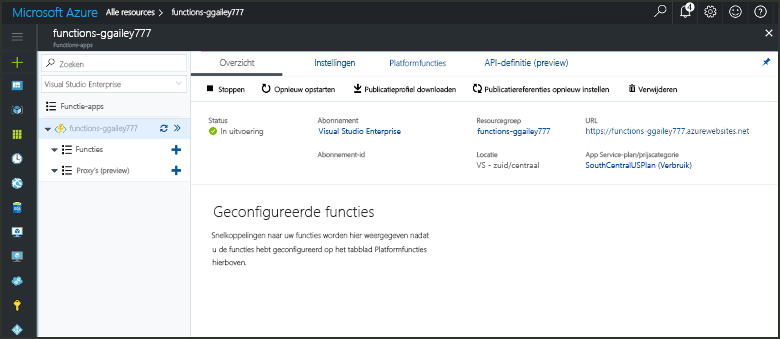
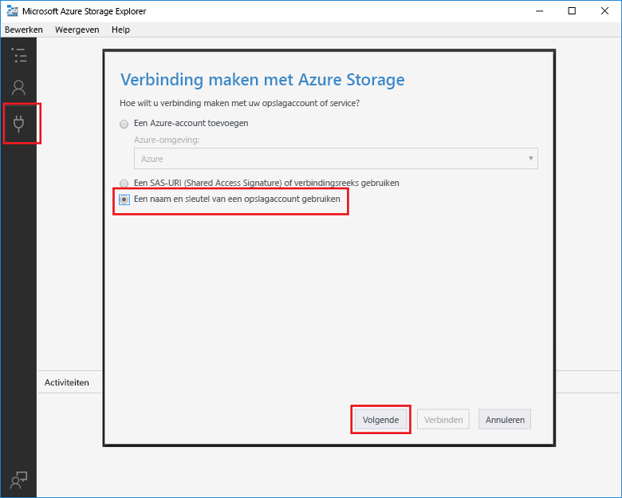

# Een door Azure Blob Storage geactiveerde functie maken

Meer informatie over hoe toocreate een functie die wordt geactiveerd wanneer de bestanden zijn geüpload tooor bijgewerkt in Azure Blob-opslag.

## Vereisten

+ Download en installeer Hallo [Microsoft Azure Storage Explorer](http://storageexplorer.com/).
+ Een Azure-abonnement. Als u nog geen abonnement hebt, maakt u een [gratis account](https://azure.microsoft.com/free/?WT.mc_id=A261C142F) voordat u begint.

[!INCLUDE [functions-portal-favorite-function-apps](../../includes/functions-portal-favorite-function-apps.md)]

## Een Azure-functie-app maken

[!INCLUDE [Create function app Azure portal](../../includes/functions-create-function-app-portal.md)]

Vervolgens maakt u een functie in nieuwe Hallo-functie-app.

## Een door Blob Storage geactiveerde functie maken

1. Vouw de functie-app en klik op Hallo  **+**  knop naast te**functies**. Als dit eerste functie in uw app functie hello, selecteer **aangepaste functie**. De volledige set Hallo van functie-sjablonen worden weergegeven.

    

2. Selecteer Hallo **BlobTrigger** sjabloon voor de gewenste taal en Hallo-instellingen zoals opgegeven in de tabel hello gebruiken.

    

    | Instelling | Voorgestelde waarde | Beschrijving |
    |---|---|---|
    | **Pad**   | mycontainer/{name}    | Locatie in Blob Storage die wordt bewaakt. Hallo-bestandsnaam van Hallo blob wordt doorgegeven Hallo-binding als Hallo _naam_ parameter.  |
    | **Opslagaccountverbinding** | AzureWebJobStorage | U kunt Hallo storage-account verbinding is al wordt gebruikt door de functie-app gebruiken of een nieuwe maken.  |
    | **Een naam voor de functie opgeven** | Uniek in uw functie-app | Naam van deze door Blob geactiveerde functie. |

3. Klik op **maken** toocreate uw functie.

Vervolgens maakt u verbinding tooyour Azure Storage-account en Hallo maken **mycontainer** container.

## Hallo-container maken

1. Klik in de functie op **Integreren**, vouw **Documentatie** uit en kopieer de **Accountnaam** en de **Accountsleutel**. U gebruikt deze referenties tooconnect toohello storage-account. Als u al uw storage-account hebt gekoppeld, slaat u toostep 4.

    

1. Hallo uitvoeren [Microsoft Azure Storage Explorer](http://storageexplorer.com/) hulpprogramma, klikt u op Hallo verbinding pictogram aan de linkerkant hello, kiest u **gebruik van een naam van het opslagaccount en de sleutel**, en klik op **volgende**.

    

1. Voer Hallo **accountnaam** en **accountsleutel** uit stap 1, klikt u op **volgende** en vervolgens **Connect**. 

    

1. Vouw Hallo gekoppeld opslagaccount, met de rechtermuisknop op **Blob-containers**, klikt u op **maken blob-container**, type `mycontainer`, en druk op enter.

    

Nu dat u een blob-container hebt, kunt u Hallo functie testen door het uploaden van een bestand toohello-container.

## Hallo functie testen

1. Terug in hello Azure-portal, vouw bladeren tooyour functie Hallo **logboeken** Hallo onderaan pagina Hallo en zorg ervoor dat in dit logboek streaming wordt niet onderbroken.

1. Vouw in Storage Explorer uw opslagaccount, **Blob-containers** en **mycontainer** uit. Klik op **Uploaden** en klik vervolgens op **Bestanden uploaden...**.

    

1. In Hallo **bestanden uploaden** dialoogvenster vak, klikt u op Hallo **bestanden** veld. Zoeken naar tooa-bestand op uw lokale computer, zoals een afbeeldingsbestand, te selecteren en op **Open** en vervolgens **uploaden**.

1. Ga terug tooyour functie Logboeken en controleer of dat Hallo blob is gelezen.

   

    >[!NOTE]
    > Wanneer de functie-app in Hallo verbruik standaardplan wordt uitgevoerd, kan er een vertraging van up tooseveral minuten tussen Hallo blob wordt toegevoegd of bijgewerkt en Hallo werken wordt geactiveerd. Overweeg om uw functie-app in een App Service-plan uit te voeren, als u lage latentie in uw door blob geactiveerde functies nodig hebt.

## Resources opschonen

[!INCLUDE [Next steps note](../../includes/functions-quickstart-cleanup.md)]

## Volgende stappen

U hebt gemaakt dat een functie die wordt uitgevoerd als een blob tooor bijgewerkt in de Blob-opslag is toegevoegd. 

[!INCLUDE [Next steps note](../../includes/functions-quickstart-next-steps.md)]

Zie [Azure Functions Blob storage bindings](functions-bindings-storage-blob.md) (Blob-opslagbindingen in Azure Functions) voor meer informatie over de Blob-opslagtriggers.
