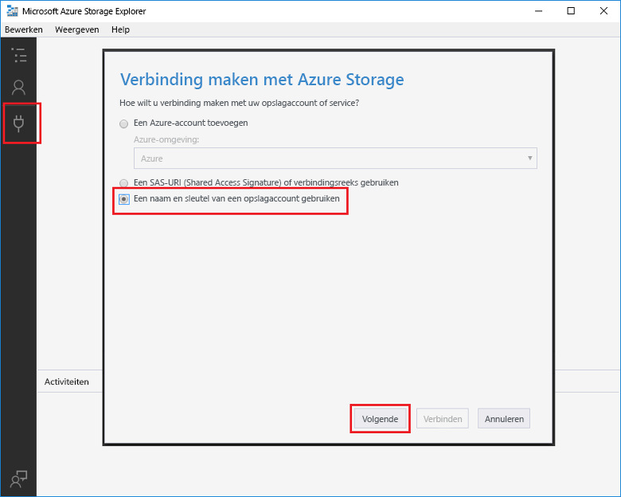

# Een door Azure Queue Storage geactiveerde functie makenCreate a function triggered by Azure Queue storage

Meer informatie over hoe toocreate een functie die wordt geactiveerd wanneer berichten worden verzonden tooan Azure Storage-wachtrij.Learn how toocreate a function triggered when messages are submitted tooan Azure Storage queue.

## VereistenPrerequisites

- Download en installeer Hallo [Microsoft Azure Storage Explorer](http://storageexplorer.com/).Download and install hello [Microsoft Azure Storage Explorer](http://storageexplorer.com/).

- Een Azure-abonnement.An Azure subscription. Als u nog geen abonnement hebt, maakt u een [gratis account](https://azure.microsoft.com/free/?WT.mc_id=A261C142F) voordat u begint.If you don't have one, create a [free account](https://azure.microsoft.com/free/?WT.mc_id=A261C142F) before you begin.

[!INCLUDE [functions-portal-favorite-function-apps](../../includes/functions-portal-favorite-function-apps.md)]

## Een Azure-functie-app makenCreate an Azure Function app

[!INCLUDE [Create function app Azure portal](../../includes/functions-create-function-app-portal.md)]

Vervolgens maakt u een functie in nieuwe Hallo-functie-app.Next, you create a function in hello new function app.

## Een door een wachtrij geactiveerde functie makenCreate a Queue triggered function

1. Vouw de functie-app en klik op Hallo  **+**  knop naast te**functies**.Expand your function app and click hello **+** button next too**Functions**. Als dit eerste functie in uw app functie hello, selecteer **aangepaste functie**.If this is hello first function in your function app, select **Custom function**. De volledige set Hallo van functie-sjablonen worden weergegeven.This displays hello complete set of function templates.

    

2. Selecteer Hallo **QueueTrigger** sjabloon voor de gewenste taal en Hallo-instellingen zoals opgegeven in de tabel hello gebruiken.Select hello **QueueTrigger** template for your desired language, and  use hello settings as specified in hello table.

    
    
    | InstellingSetting | Voorgestelde waardeSuggested value | BeschrijvingDescription |
    |---|---|---|
    | **Wachtrijnaam****Queue name**   | myqueue-itemsmyqueue-items    | Naam van Hallo wachtrij tooconnect tooin uw Storage-account.Name of hello queue tooconnect tooin your Storage account. |
    | **Opslagaccountverbinding****Storage account connection** | AzureWebJobStorageAzureWebJobStorage | U kunt Hallo storage-account verbinding is al wordt gebruikt door de functie-app gebruiken of een nieuwe maken.You can use hello storage account connection already being used by your function app, or create a new one.  |
    | **Een naam voor de functie opgeven****Name your function** | Uniek in uw functie-appUnique in your function app | Naam van deze door een wachtrij geactiveerde functie.Name of this queue triggered function. |

3. Klik op **maken** toocreate uw functie.Click **Create** toocreate your function.

Vervolgens maakt u verbinding tooyour Azure Storage-account en Hallo maken **rapportberichten items** storage-wachtrij.Next, you connect tooyour Azure Storage account and create hello **myqueue-items** storage queue.

## Hallo wachtrij makenCreate hello queue

1. Klik in de functie op **Integreren**, vouw **Documentatie** uit en kopieer de **Accountnaam** en de **Accountsleutel**.In your function, click **Integrate**, expand **Documentation**, and copy both **Account name** and **Account key**. U gebruikt deze referenties tooconnect toohello storage-account.You use these credentials tooconnect toohello storage account. Als u al uw storage-account hebt gekoppeld, slaat u toostep 4.If you have already connected your storage account, skip toostep 4.

    vv

1. Hallo uitvoeren [Microsoft Azure Storage Explorer](http://storageexplorer.com/) hulpprogramma, klikt u op Hallo verbinding pictogram aan de linkerkant hello, kiest u **gebruik van een naam van het opslagaccount en de sleutel**, en klik op **volgende**.Run hello [Microsoft Azure Storage Explorer](http://storageexplorer.com/) tool, click hello connect icon on hello left, choose **Use a storage account name and key**, and click **Next**.

    

1. Voer Hallo **accountnaam** en **accountsleutel** uit stap 1, klikt u op **volgende** en vervolgens **Connect**.Enter hello **Account name** and **Account key** from step 1, click **Next** and then **Connect**.

    

1. Vouw Hallo gekoppeld opslagaccount, met de rechtermuisknop op **wachtrijen**, klikt u op **wachtrij maken**, type `myqueue-items`, en druk op enter.Expand hello attached storage account, right-click **Queues**, click **Create queue**, type `myqueue-items`, and then press enter.

    

Nu dat u een opslagwachtrij hebt, kunt u Hallo functie testen door een berichtenwachtrij toohello toe te voegen.Now that you have a storage queue, you can test hello function by adding a message toohello queue.

## Hallo functie testenTest hello function

1. Terug in hello Azure-portal, vouw bladeren tooyour functie Hallo **logboeken** Hallo onderaan pagina Hallo en zorg ervoor dat in dit logboek streaming wordt niet onderbroken.Back in hello Azure portal, browse tooyour function expand hello **Logs** at hello bottom of hello page and make sure that log streaming isn't paused.

1. Vouw in Storage Explorer uw opslagaccount, **Wachtrijen** en **myqueue-items** uit en klik vervolgens op **Bericht toevoegen**.In Storage Explorer, expand your storage account, **Queues**, and **myqueue-items**, then click **Add message**.

    

1. Typ uw "Hallo wereld"-Type your "Hello World!" bericht in **Berichttekst** en klik op **OK**.message in **Message text** and click **OK**.

1. Wacht een paar seconden en vervolgens gaat u terug tooyour functie Logboeken en controleer of dat nieuwe Hallo-bericht is gelezen uit de wachtrij Hallo.Wait for a few seconds, then go back tooyour function logs and verify that hello new message has been read from hello queue.

    

1. Klik in Opslagverkenner op **vernieuwen** en controleer of het Hallo-bericht dat is verwerkt en is niet langer in de wachtrij Hallo.Back in Storage Explorer, click **Refresh** and verify that hello message has been processed and is no longer in hello queue.

## Resources opschonenClean up resources

[!INCLUDE [Next steps note](../../includes/functions-quickstart-cleanup.md)]

## Volgende stappenNext steps

U kunt een functie die wordt uitgevoerd als er een bericht wordt toegevoegd tooa opslagwachtrij hebt gemaakt.You have created a function that runs when a message is added tooa storage queue.

[!INCLUDE [Next steps note](../../includes/functions-quickstart-next-steps.md)]

Zie [Azure Functions Storage queue bindings](functions-bindings-storage-queue.md) (Opslagwachtrijbindingen van Azure Functions) voor meer informatie over activeringen van Queue Storage.For more information about Queue storage triggers, see [Azure Functions Storage queue bindings](functions-bindings-storage-queue.md).