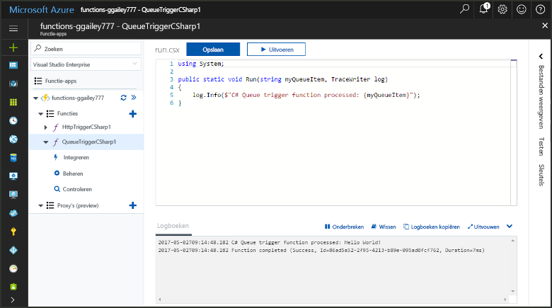
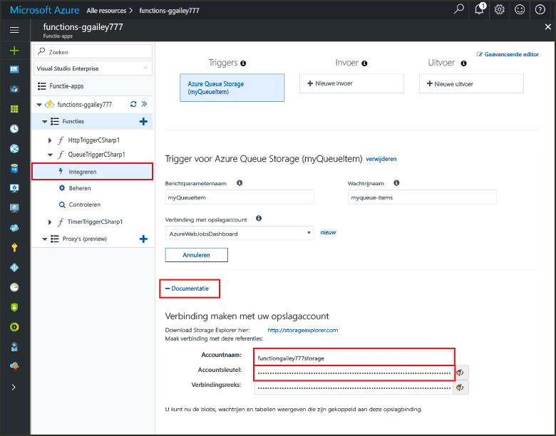
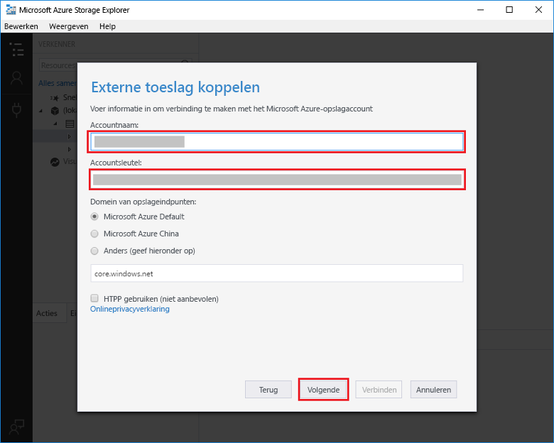
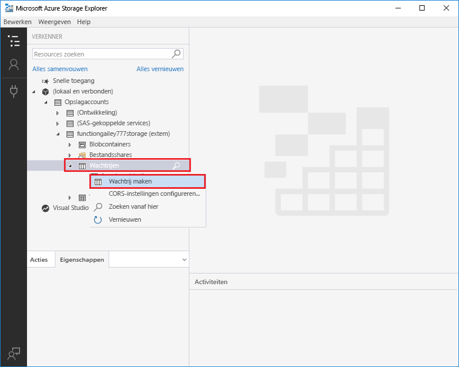
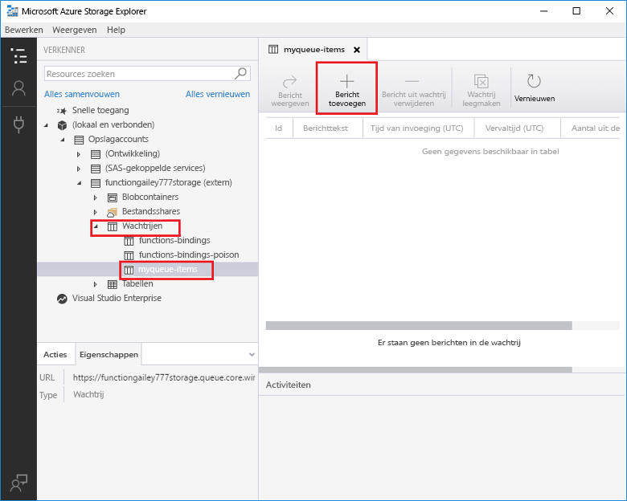
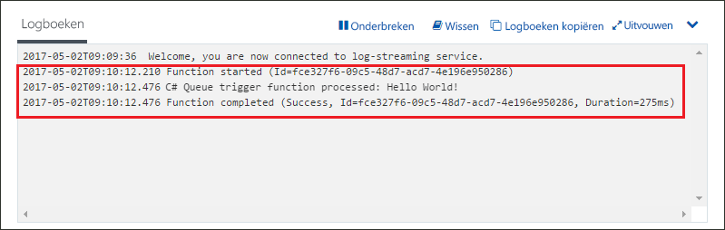

# Een door Azure Queue Storage geactiveerde functie makenCreate a function triggered by Azure Queue storage

Ontdek hoe u een functie maakt die wordt geactiveerd wanneer er berichten worden verzonden naar een Azure Storage-wachtrij.Learn how to create a function triggered when messages are submitted to an Azure Storage queue.

## VereistenPrerequisites

- De [Microsoft Azure Storage Explorer](http://storageexplorer.com/) downloaden en installeren.Download and install the [Microsoft Azure Storage Explorer](http://storageexplorer.com/).

- Een Azure-abonnement.An Azure subscription. Als u nog geen abonnement hebt, maakt u een [gratis account](https://azure.microsoft.com/free/?WT.mc_id=A261C142F) voordat u begint.If you don't have one, create a [free account](https://azure.microsoft.com/free/?WT.mc_id=A261C142F) before you begin.

[!INCLUDE [functions-portal-favorite-function-apps](../../includes/functions-portal-favorite-function-apps.md)]

## Een Azure-functie-app makenCreate an Azure Function app

[!INCLUDE [Create function app Azure portal](../../includes/functions-create-function-app-portal.md)]

Vervolgens maakt u een functie in de nieuwe functie-app.Next, you create a function in the new function app.

## Een door een wachtrij geactiveerde functie makenCreate a Queue triggered function

1. Vouw de functie-app uit en klik op de knop **+** naast **Functies**.Expand your function app and click the **+** button next to **Functions**. Als dit de eerste functie in de functie-app is, selecteert u **Aangepaste functie**.If this is the first function in your function app, select **Custom function**. U ziet nu de volledige set het functiesjablonen.This displays the complete set of function templates.

    

2. Selecteer de sjabloon **QueueTrigger** voor de gewenste taal en gebruik de instellingen die zijn opgegeven in de tabel.Select the **QueueTrigger** template for your desired language, and  use the settings as specified in the table.

    
    
    | InstellingSetting | Voorgestelde waardeSuggested value | BeschrijvingDescription |
    |---|---|---|
    | **Wachtrijnaam****Queue name**   | myqueue-itemsmyqueue-items    | De naam van de wachtrij waarmee u verbinding moet maken in uw opslagaccount.Name of the queue to connect to in your Storage account. |
    | **Opslagaccountverbinding****Storage account connection** | AzureWebJobStorageAzureWebJobStorage | U kunt de opslagaccountverbinding gebruiken die al door de functie-app wordt gebruikt of u kunt een nieuwe maken.You can use the storage account connection already being used by your function app, or create a new one.  |
    | **Een naam voor de functie opgeven****Name your function** | Uniek in uw functie-appUnique in your function app | Naam van deze door een wachtrij geactiveerde functie.Name of this queue triggered function. |

3. Klik op **Maken** om de functie te maken.Click **Create** to create your function.

Vervolgens maakt u verbinding met uw Azure Storage-account en maakt u de opslagwachtrij **myqueue-items**.Next, you connect to your Azure Storage account and create the **myqueue-items** storage queue.

## De wachtrij makenCreate the queue

1. Klik in de functie op **Integreren**, vouw **Documentatie** uit en kopieer de **Accountnaam** en de **Accountsleutel**.In your function, click **Integrate**, expand **Documentation**, and copy both **Account name** and **Account key**. Met deze referenties kunt u verbinding maken met het opslagaccount.You use these credentials to connect to the storage account. Als u uw opslagaccount al hebt verbonden, gaat u naar stap 4.If you have already connected your storage account, skip to step 4.

    vv

1. Voer het hulpprogramma [Microsoft Azure Storage Explorer](http://storageexplorer.com/) uit, klik op het verbindingspictogram aan de linkerkant, kies **Een opslagaccountnaam en -sleutel gebruiken** en klik op **Volgende**.Run the [Microsoft Azure Storage Explorer](http://storageexplorer.com/) tool, click the connect icon on the left, choose **Use a storage account name and key**, and click **Next**.

    

1. Voer de **Accountnaam** en de **Accountsleutel** van stap 1 in. Klik op **Volgende** en vervolgens op **Verbinding maken**.Enter the **Account name** and **Account key** from step 1, click **Next** and then **Connect**.

    

1. Vouw het gekoppelde opslagaccount uit. Klik met de rechtermuisknop op **Wachtrijen**, klik op **Wachtrij maken**, typ `myqueue-items` en druk op Enter.Expand the attached storage account, right-click **Queues**, click **Create queue**, type `myqueue-items`, and then press enter.

    

Nu u een opslagwachtrij hebt, kunt u de functie testen door een bericht toe te voegen aan de wachtrij.Now that you have a storage queue, you can test the function by adding a message to the queue.

## De functie testenTest the function

1. Blader in Azure Portal naar de functie, vouw de **Logboeken** onderaan de pagina uit en zorg ervoor dat logboekstreaming niet wordt onderbroken.Back in the Azure portal, browse to your function expand the **Logs** at the bottom of the page and make sure that log streaming isn't paused.

1. Vouw in Storage Explorer uw opslagaccount, **Wachtrijen** en **myqueue-items** uit en klik vervolgens op **Bericht toevoegen**.In Storage Explorer, expand your storage account, **Queues**, and **myqueue-items**, then click **Add message**.

    

1. Typ uw "Hallo wereld"-Type your "Hello World!" bericht in **Berichttekst** en klik op **OK**.message in **Message text** and click **OK**.

1. Wacht een paar seconden en ga vervolgens terug naar de functielogboeken en controleer of het nieuwe bericht is gelezen.Wait for a few seconds, then go back to your function logs and verify that the new message has been read from the queue.

    

1. Klik in Storage Explorer op **Vernieuwen** en controleer of het bericht is verwerkt en niet langer in de wachtrij staat.Back in Storage Explorer, click **Refresh** and verify that the message has been processed and is no longer in the queue.

## Resources opschonenClean up resources

[!INCLUDE [Next steps note](../../includes/functions-quickstart-cleanup.md)]

## Volgende stappenNext steps

U hebt een functie gemaakt die wordt uitgevoerd wanneer er een bericht wordt toegevoegd aan een opslagwachtrij.You have created a function that runs when a message is added to a storage queue.

[!INCLUDE [Next steps note](../../includes/functions-quickstart-next-steps.md)]

Zie [Azure Functions Storage queue bindings](functions-bindings-storage-queue.md) (Opslagwachtrijbindingen van Azure Functions) voor meer informatie over activeringen van Queue Storage.For more information about Queue storage triggers, see [Azure Functions Storage queue bindings](functions-bindings-storage-queue.md).