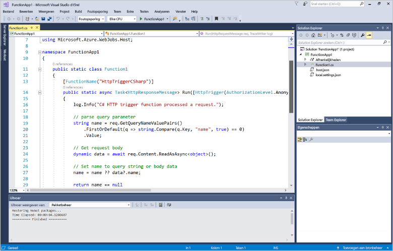
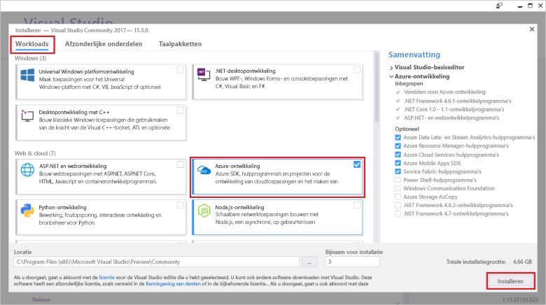
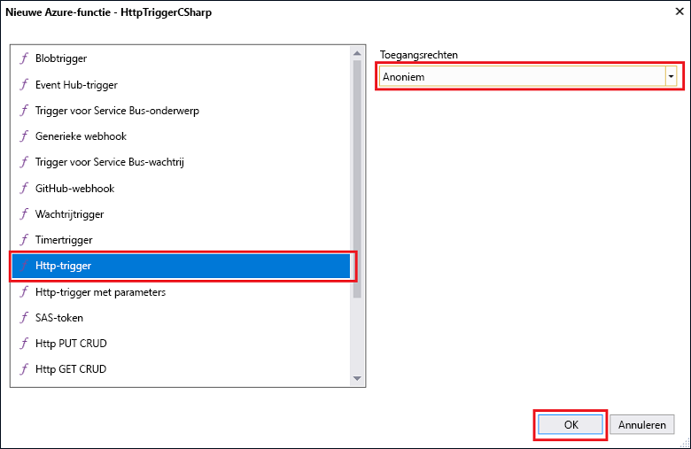

# Uw eerste functie maken met Visual StudioCreate your first function using Visual Studio

Azure Functions, kunt u uw code in een omgeving zonder server uitvoeren zonder toofirst een virtuele machine maken of een webtoepassing publiceert.Azure Functions lets you execute your code in a serverless environment without having toofirst create a VM or publish a web application.

In dit onderwerp leert u hoe toouse 2017 voor Visual Studio-hulpprogramma's voor Azure Functions toocreate Hallo en de functie van een 'Hallo wereld' lokaal testen.In this topic, you learn how toouse hello Visual Studio 2017 tools for Azure Functions toocreate and test a "hello world" function locally. Vervolgens wordt u Hallo functie code tooAzure publiceren.You will then publish hello function code tooAzure. Deze hulpprogramma's zijn beschikbaar als onderdeel van hello Azure ontwikkeling werkbelasting in Visual Studio 2017 versie 15,3 of een latere versie.These tools are available as part of hello Azure development workload in Visual Studio 2017 version 15.3, or a later version.

## VereistenPrerequisites

toocomplete deze zelfstudie, installatie:toocomplete this tutorial, install:

* [Visual Studio 2017 versie 15,3](https://www.visualstudio.com/vs/preview/), met inbegrip van Hallo **ontwikkelen van Azure** werkbelasting.[Visual Studio 2017 version 15.3](https://www.visualstudio.com/vs/preview/), including hello **Azure development** workload.

    
    
    >[!NOTE]  
    Nadat u installeren of upgraden van tooVisual Studio 2017 versie 15,3, moet u mogelijk ook toomanually update Hallo 2017 van Visual Studio-hulpprogramma's voor Azure Functions.After you install or upgrade tooVisual Studio 2017 version 15.3, you might also need toomanually update hello Visual Studio 2017 tools for Azure Functions. U kunt bijwerken Hallo-hulpprogramma's van Hallo **extra** menu onder **uitbreidingen en Updates...**   >  **Updates** > **Visual Studio Marketplace** > **Azure Functions en Web extra taken**  >  **Update**.You can update hello tools from hello **Tools** menu under **Extensions and Updates...** > **Updates** > **Visual Studio Marketplace** > **Azure Functions and Web Jobs Tools** > **Update**. 

[!INCLUDE [quickstarts-free-trial-note](../../includes/quickstarts-free-trial-note.md)] 

## Een Azure Functions-project in Visual Studio makenCreate an Azure Functions project in Visual Studio

[!INCLUDE [Create a project using hello Azure Functions template](../../includes/functions-vstools-create.md)]

Nu u Hallo-project hebt gemaakt, kunt u uw eerste functie maken.Now that you have created hello project, you can create your first function.

## Hallo-functie makenCreate hello function

1. Klik in **Solution Explorer** met de rechtermuisknop op het projectknooppunt en selecteer  > **Nieuw item****Toevoegen**.In **Solution Explorer**, right-click on your project node and select **Add** > **New Item**. Selecteer **Azure-functie** en klik op **Toevoegen**.Select **Azure Function** and click **Add**.

2. Selecteer **HttpTrigger**, typ een **Functienaam**, selecteer **Anoniem** bij **Toegangsrechten** en klik op **Maken**.Select **HttpTrigger**, type a **Function Name**, select **Anonymous** for **Access Rights**, and click **Create**. Hallo-functie gemaakt, wordt geopend door een HTTP-aanvraag vanaf elke client.hello function created is accessed by an HTTP request from any client. 

    

    Een bestand met code toegevoegd tooyour project met een klasse die de functiecode implementeert.A code file is added tooyour project that contains a class that implements your function code. Deze code is gebaseerd op een sjabloon waarmee u een naamwaarde en het gebruik weer ontvangt.This code is based on a template, which receives a name value and echos it back. Hallo **functienaam** kenmerk Hallo-naam van de functie wordt ingesteld.hello **FunctionName** attribute sets hello name of your function. Hallo **HttpTrigger** kenmerk geeft aan dat het Hallo-bericht waarmee Hallo-functie wordt geactiveerd.hello **HttpTrigger** attribute indicates hello message that triggers hello function. 

    

Nu u een HTTP-geactiveerde-functie hebt gemaakt, kunt u deze testen op uw lokale computer.Now that you have created an HTTP-triggered function, you can test it on your local computer.

## Hallo functie lokaal testenTest hello function locally

Met Azure Functions Core-hulpprogramma's kunt u Azure Functions-projecten uitvoeren op uw lokale ontwikkelcomputer.Azure Functions Core Tools lets you run Azure Functions project on your local development computer. U bent na vragen aan gebruiker tooinstall deze hulpprogramma's Hallo eerste keer dat u een functie vanuit Visual Studio start.You are prompted tooinstall these tools hello first time you start a function from Visual Studio.  

1. tootest uw functie druk op F5.tootest your function, press F5. Als u wordt gevraagd, Hallo verzoek van Visual Studio toodownload accepteert en hulpprogramma's voor Azure Functions Core (CLI) installeren.If prompted, accept hello request from Visual Studio toodownload and install Azure Functions Core (CLI) tools.  U moet mogelijk ook een firewall-uitzondering tooenable zodat Hallo hulpprogramma's voor HTTP-aanvragen kunnen verwerken.You may also need tooenable a firewall exception so that hello tools can handle HTTP requests.

2. Hallo-URL kopiëren van de functie van Azure Functions-runtime Hallo uitvoer.Copy hello URL of your function from hello Azure Functions runtime output.  

    

3. Hallo-URL voor Hallo HTTP-aanvraag in de adresbalk van uw browser plakken.Paste hello URL for hello HTTP request into your browser's address bar. Hallo-queryreeks toevoegen `&name=<yourname>` toothis URL en Hallo aanvraag uit te voeren.Append hello query string `&name=<yourname>` toothis URL and execute hello request. Hallo hieronder vindt u antwoord Hallo in Hallo browser toohello lokale GET-aanvraag geretourneerd door de functie Hallo:hello following shows hello response in hello browser toohello local GET request returned by hello function: 

    

4. toostop foutopsporing, klikt u op Hallo **stoppen** op de werkbalk van Hallo Visual Studio.toostop debugging, click hello **Stop** button on hello Visual Studio toolbar.

Nadat u hebt gecontroleerd of de functie Hallo correct wordt uitgevoerd op de lokale computer, is het tijd toopublish Hallo project tooAzure.After you have verified that hello function runs correctly on your local computer, it's time toopublish hello project tooAzure.

## Hallo project tooAzure publicerenPublish hello project tooAzure

Voordat u uw project kunt publiceren, moet u een functie-app in uw Azure-abonnement hebben.You must have a function app in your Azure subscription before you can publish your project. U kunt rechtstreeks vanuit Visual Studio een functie-app maken.You can create a function app right from Visual Studio.

[!INCLUDE [Publish hello project tooAzure](../../includes/functions-vstools-publish.md)]

## Uw functie testen in AzureTest your function in Azure

1. Hallo basis-URL van de functie-app Hallo van Hallo publiceren profielpagina kopiëren.Copy hello base URL of hello function app from hello Publish profile page. Vervang Hallo `localhost:port` gedeelte van het Hallo-URL die u hebt gebruikt bij het testen van de functie Hallo lokaal met Hallo nieuwe basis-URL.Replace hello `localhost:port` portion of hello URL you used when testing hello function locally with hello new base URL. Als voorheen Zorg ervoor dat tooappend Hallo-queryreeks `&name=<yourname>` toothis URL en Hallo aanvraag uit te voeren.As before, make sure tooappend hello query string `&name=<yourname>` toothis URL and execute hello request.

    Hallo-URL die uw HTTP-aanroepen geactiveerd functie ziet er als volgt:hello URL that calls your HTTP triggered function looks like this:

        http://<functionappname>.azurewebsites.net/api/<functionname>?name=<yourname> 

2. Deze nieuwe URL voor Hallo HTTP-aanvraag in de adresbalk van uw browser plakken.Paste this new URL for hello HTTP request into your browser's address bar. Hallo hieronder vindt u antwoord Hallo in Hallo browser toohello externe GET-aanvraag geretourneerd door de functie Hallo:hello following shows hello response in hello browser toohello remote GET request returned by hello function: 

    
 
## Volgende stappenNext steps

Met de functie van een eenvoudige HTTP is geactiveerd, hebt u Visual Studio toocreate een C#-functie-app gebruikt.You have used Visual Studio toocreate a C# function app with a simple HTTP triggered function. 

+ toolearn hoe tooconfigure uw project toosupport andere soorten triggers en bindingen, Zie Hallo [Hallo-project configureren voor lokale ontwikkeling](functions-develop-vs.md#configure-the-project-for-local-development) in sectie [Azure Functions-Tools voor Visual Studio](functions-develop-vs.md).toolearn how tooconfigure your project toosupport other types of triggers and bindings, see hello [Configure hello project for local development](functions-develop-vs.md#configure-the-project-for-local-development) section in [Azure Functions Tools for Visual Studio](functions-develop-vs.md).
+ toolearn meer informatie over lokale testen en foutopsporing met hello Azure Functions Core's, Zie [Code en test Azure Functions lokaal](functions-run-local.md).toolearn more about local testing and debugging using hello Azure Functions Core Tools, see [Code and test Azure Functions locally](functions-run-local.md). 
+ toolearn meer informatie over het ontwikkelen van functies als .NET-klassebibliotheken, Zie [met behulp van .NET-klassebibliotheken met Azure Functions](functions-dotnet-class-library.md).toolearn more about developing functions as .NET class libraries, see [Using .NET class libraries with Azure Functions](functions-dotnet-class-library.md). 

