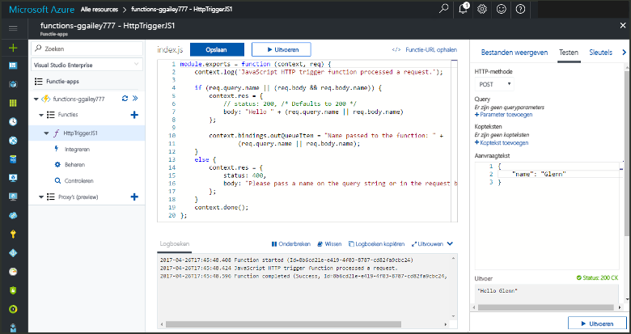
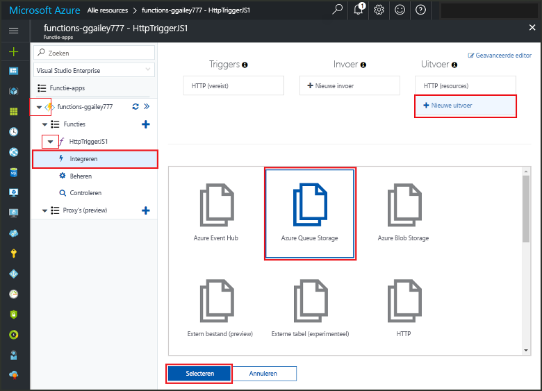
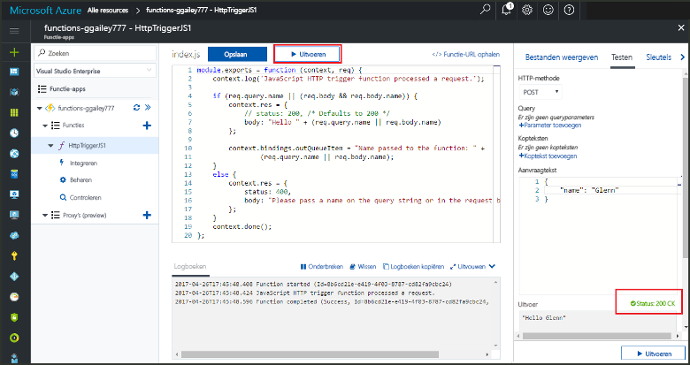
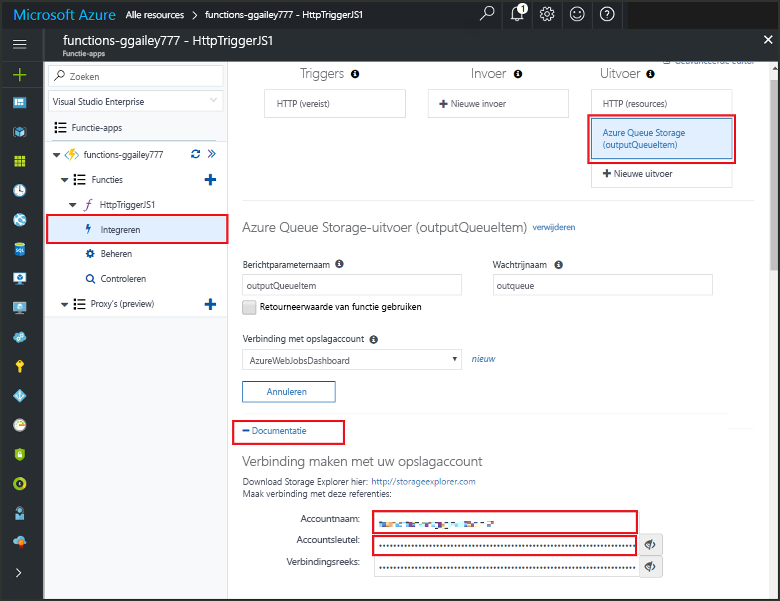

# <a name="add-messages-tooan-azure-storage-queue-using-functions"></a>Berichten tooan Azure Storage-wachtrij met behulp van functies toevoegen

Azure Functions geeft invoer en uitvoer bindingen u een declaratieve manier tooconnect tooexternal servicegegevens uit een functie. In dit onderwerp informatie over hoe een bestaande functie door toe te voegen die binding uitvoer tooupdate verzendt berichten tooAzure Queue storage.  



## <a name="prerequisites"></a>Vereisten 

[!INCLUDE [Previous topics](../../includes/functions-quickstart-previous-topics.md)]

* Hallo installeren [Microsoft Azure Storage Explorer](http://storageexplorer.com/).

## <a name="add-binding"></a>Een uitvoerbinding toevoegen
 
1. Vouw de functie-app en de functie uit.

2. Selecteer **integreren** en **+ nieuw uitvoer**, en kies vervolgens **Azure Queue storage** en kies **Selecteer**.
    
    

3. Hallo-instellingen zoals opgegeven in de tabel hello gebruiken: 

    

    | Instelling      |  Voorgestelde waarde   | Beschrijving                              |
    | ------------ |  ------- | -------------------------------------------------- |
    | **Wachtrijnaam**   | myqueue-items    | Hallo-naam van Hallo wachtrij tooconnect tooin uw Storage-account. |
    | **Opslagaccountverbinding** | AzureWebJobStorage | U kunt Hallo storage-account verbinding is al wordt gebruikt door de functie-app gebruiken of een nieuwe maken.  |
    | **Naam van de berichtparameter** | outputQueueItem | Hallo-naam van de binding uitvoerparameter Hallo. | 

4. Klik op **opslaan** tooadd Hallo binding.
 
Nu dat u een uitvoer-binding die is gedefinieerd hebt, moet u tooupdate Hallo code toouse Hallo binding tooadd berichten tooa wachtrij.  

## <a name="update-hello-function-code"></a>Hallo functiecode bijwerken

1. Selecteer uw functiecode toodisplay Hallo functie in Hallo-editor. 

2. Voor een C#-functie, werkt de functiedefinitie van de als volgt tooadd hello **outputQueueItem** storage binding-parameter. Sla deze stap over voor een JavaScript-functie.

    ```cs   
    public static async Task<HttpResponseMessage> Run(HttpRequestMessage req, 
        ICollector<string> outputQueueItem, TraceWriter log)
    {
        ....
    }
    ```

3. Hallo volgen op code toohello functie vlak voordat het Hallo-methode retourneert toevoegen. Hallo relevante codefragment voor Hallo taal van de functie gebruikt.

    ```javascript
    context.bindings.outputQueueItem = "Name passed toohello function: " + 
                (req.query.name || req.body.name);
    ```

    ```cs
    outputQueueItem.Add("Name passed toohello function: " + name);     
    ```

4. Selecteer **opslaan** toosave wijzigingen.

Hallo-waarde doorgegeven toohello HTTP-trigger is opgenomen in een toegevoegde toohello berichtenwachtrij.
 
## <a name="test-hello-function"></a>Hallo functie testen 

1. Nadat het Hallo codewijzigingen zijn opgeslagen, selecteert u **uitvoeren**. 

    

2. Controleer Hallo logboeken toomake ervoor Hallo-functie is voltooid. Een nieuwe wachtrij met de naam **outqueue** in uw opslagaccount is gemaakt door Hallo runtime van Functions wanneer Hallo uitvoer binding voor het eerst is gebruikt.

Vervolgens kunt u tooyour storage account tooverify Hallo nieuwe wachtrij en het Hallo-bericht dat u tooit toegevoegd. 

## <a name="connect-toohello-queue"></a>Verbinding maken met toohello wachtrij

Overslaan Hallo eerste drie stappen uit als u al hebt geïnstalleerd Opslagverkenner en het opslagaccount tooyour verbonden.    

1. Kies in de functie **integreren** en nieuwe Hallo **Azure Queue storage** binding uitvoer uit en vouw vervolgens **documentatie**. Kopieer de **Accountnaam** en de **Accountsleutel**. U gebruikt deze referenties tooconnect toohello storage-account.
 
    

2. Hallo uitvoeren [Microsoft Azure Storage Explorer](http://storageexplorer.com/) tool, selecteer Hallo verbinding pictogram aan de linkerkant hello, kiest u **gebruik van een naam van het opslagaccount en de sleutel**, en selecteer **volgende**.

    
    
3. Plakken Hallo **accountnaam** en **accountsleutel** stap van 1 in hun bijbehorende velden en selecteer vervolgens **volgende**, en **Connect**. 
  
    

4. Vouw Hallo gekoppeld opslagaccount **wachtrijen** en controleer of er een wachtrij met de naam **rapportberichten items** bestaat. U ziet ook een bericht al in de wachtrij Hallo.  
 
    
 

## <a name="clean-up-resources"></a>Resources opschonen

[!INCLUDE [Next steps note](../../includes/functions-quickstart-cleanup.md)]

## <a name="next-steps"></a>Volgende stappen

U kunt een bestaande functie voor uitvoer binding tooan hebt toegevoegd. 

[!INCLUDE [Next steps note](../../includes/functions-quickstart-next-steps.md)]

Zie voor meer informatie over opslag voor binding tooQueue [bindingen van Azure Functions Storage wachtrij](functions-bindings-storage-queue.md). 


