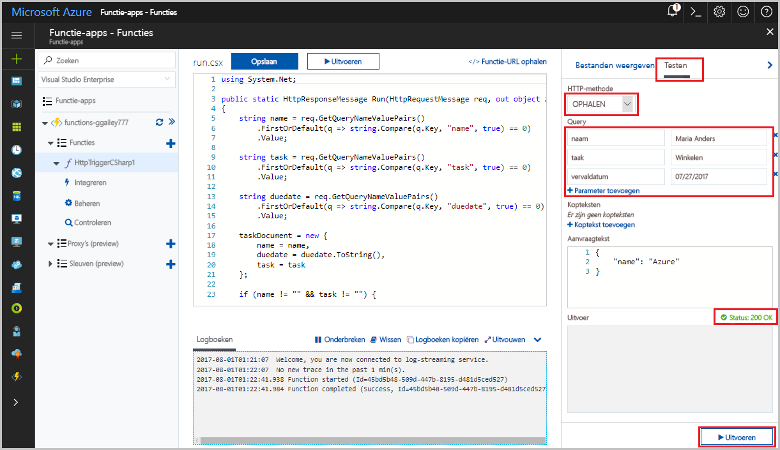

# <a name="store-unstructured-data-using-azure-functions-and-cosmos-db"></a><span data-ttu-id="e6067-104">Ongestructureerde gegevens opslaan met behulp van Azure Functions en Cosmos DB</span><span class="sxs-lookup"><span data-stu-id="e6067-104">Store unstructured data using Azure Functions and Cosmos DB</span></span>

<span data-ttu-id="e6067-105">[Azure Cosmos DB](https://azure.microsoft.com/services/cosmos-db/) is een uitstekende manier toostore ongestructureerde en JSON-gegevens.</span><span class="sxs-lookup"><span data-stu-id="e6067-105">[Azure Cosmos DB](https://azure.microsoft.com/services/cosmos-db/) is a great way toostore unstructured and JSON data.</span></span> <span data-ttu-id="e6067-106">Cosmos DB biedt, in combinatie met Azure Functions, een snelle en eenvoudige manier om gegevens op te slaan met veel minder code dan nodig is voor het opslaan van gegevens in een relationele database.</span><span class="sxs-lookup"><span data-stu-id="e6067-106">Combined with Azure Functions, Cosmos DB makes storing data quick and easy with much less code than required for storing data in a relational database.</span></span>

<span data-ttu-id="e6067-107">Azure Functions geeft invoer en uitvoer bindingen u een declaratieve manier tooconnect tooexternal servicegegevens uit een functie.</span><span class="sxs-lookup"><span data-stu-id="e6067-107">In Azure Functions, input and output bindings provide a declarative way tooconnect tooexternal service data from your function.</span></span> <span data-ttu-id="e6067-108">In dit onderwerp informatie over hoe tooupdate een bestaande C# functioneren tooadd een uitvoer-binding die niet-gestructureerde gegevens opslaat in een Cosmos-DB-document.</span><span class="sxs-lookup"><span data-stu-id="e6067-108">In this topic, learn how tooupdate an existing C# function tooadd an output binding that stores unstructured data in a Cosmos DB document.</span></span> 


## <a name="prerequisites"></a><span data-ttu-id="e6067-110">Vereisten</span><span class="sxs-lookup"><span data-stu-id="e6067-110">Prerequisites</span></span>

<span data-ttu-id="e6067-111">toocomplete in deze zelfstudie:</span><span class="sxs-lookup"><span data-stu-id="e6067-111">toocomplete this tutorial:</span></span>

[!INCLUDE [Previous quickstart note](../../includes/functions-quickstart-previous-topics.md)]

## <a name="add-an-output-binding"></a><span data-ttu-id="e6067-112">Een uitvoerbinding toevoegen</span><span class="sxs-lookup"><span data-stu-id="e6067-112">Add an output binding</span></span>

1. <span data-ttu-id="e6067-113">Vouw de functie-app en de functie uit.</span><span class="sxs-lookup"><span data-stu-id="e6067-113">Expand both your function app and your function.</span></span>

1. <span data-ttu-id="e6067-114">Selecteer **integreren** en **+ nieuw uitvoer**, die is op Hallo rechts op de pagina Hallo top.</span><span class="sxs-lookup"><span data-stu-id="e6067-114">Select **Integrate** and **+ New Output**, which is at hello top right of hello page.</span></span> <span data-ttu-id="e6067-115">Kies **Azure Cosmos DB**, en klik op **Selecteren**.</span><span class="sxs-lookup"><span data-stu-id="e6067-115">Choose **Azure Cosmos DB**, and click **Select**.</span></span>

    

3. <span data-ttu-id="e6067-117">Gebruik Hallo **Azure Cosmos DB uitvoer** instellingen zoals opgegeven in de tabel Hallo:</span><span class="sxs-lookup"><span data-stu-id="e6067-117">Use hello **Azure Cosmos DB output** settings as specified in hello table:</span></span> 

    

    | <span data-ttu-id="e6067-119">Instelling</span><span class="sxs-lookup"><span data-stu-id="e6067-119">Setting</span></span>      | <span data-ttu-id="e6067-120">Voorgestelde waarde</span><span class="sxs-lookup"><span data-stu-id="e6067-120">Suggested value</span></span>  | <span data-ttu-id="e6067-121">Beschrijving</span><span class="sxs-lookup"><span data-stu-id="e6067-121">Description</span></span>                                |
    | ------------ | ---------------- | ------------------------------------------ |
    | <span data-ttu-id="e6067-122">**Parameternaam van document**</span><span class="sxs-lookup"><span data-stu-id="e6067-122">**Document parameter name**</span></span> | <span data-ttu-id="e6067-123">taskDocument</span><span class="sxs-lookup"><span data-stu-id="e6067-123">taskDocument</span></span> | <span data-ttu-id="e6067-124">De naam die toohello Cosmos-DB-object in de code verwijst.</span><span class="sxs-lookup"><span data-stu-id="e6067-124">Name that refers toohello Cosmos DB object in code.</span></span> |
    | <span data-ttu-id="e6067-125">**Databasenaam**</span><span class="sxs-lookup"><span data-stu-id="e6067-125">**Database name**</span></span> | <span data-ttu-id="e6067-126">taskDatabase</span><span class="sxs-lookup"><span data-stu-id="e6067-126">taskDatabase</span></span> | <span data-ttu-id="e6067-127">Naam van de database toosave documenten.</span><span class="sxs-lookup"><span data-stu-id="e6067-127">Name of database toosave documents.</span></span> |
    | <span data-ttu-id="e6067-128">**Naam van verzameling**</span><span class="sxs-lookup"><span data-stu-id="e6067-128">**Collection name**</span></span> | <span data-ttu-id="e6067-129">TaskCollection</span><span class="sxs-lookup"><span data-stu-id="e6067-129">TaskCollection</span></span> | <span data-ttu-id="e6067-130">Naam van verzameling met Cosmos DB-databases.</span><span class="sxs-lookup"><span data-stu-id="e6067-130">Name of collection of Cosmos DB databases.</span></span> |
    | <span data-ttu-id="e6067-131">**Indien waar, maakt Hallo Cosmos-DB-database en verzameling**</span><span class="sxs-lookup"><span data-stu-id="e6067-131">**If true, creates hello Cosmos DB database and collection**</span></span> | <span data-ttu-id="e6067-132">Geselecteerd</span><span class="sxs-lookup"><span data-stu-id="e6067-132">Checked</span></span> | <span data-ttu-id="e6067-133">Hallo-verzameling niet al bestaat, zodat deze maken.</span><span class="sxs-lookup"><span data-stu-id="e6067-133">hello collection doesn't already exist, so create it.</span></span> |

4. <span data-ttu-id="e6067-134">Selecteer **nieuw** volgende toohello **Cosmos document databaseverbinding** label en selecteer **+ nieuw**.</span><span class="sxs-lookup"><span data-stu-id="e6067-134">Select **New** next toohello **Cosmos DB document connection** label, and select **+ Create new**.</span></span> 

5. <span data-ttu-id="e6067-135">Gebruik Hallo **nieuwe account** instellingen zoals opgegeven in de tabel Hallo:</span><span class="sxs-lookup"><span data-stu-id="e6067-135">Use hello **New account** settings as specified in hello table:</span></span> 

    

    | <span data-ttu-id="e6067-137">Instelling</span><span class="sxs-lookup"><span data-stu-id="e6067-137">Setting</span></span>      | <span data-ttu-id="e6067-138">Voorgestelde waarde</span><span class="sxs-lookup"><span data-stu-id="e6067-138">Suggested value</span></span>  | <span data-ttu-id="e6067-139">Beschrijving</span><span class="sxs-lookup"><span data-stu-id="e6067-139">Description</span></span>                                |
    | ------------ | ---------------- | ------------------------------------------ |
    | <span data-ttu-id="e6067-140">**ID**</span><span class="sxs-lookup"><span data-stu-id="e6067-140">**ID**</span></span> | <span data-ttu-id="e6067-141">Naam van de database</span><span class="sxs-lookup"><span data-stu-id="e6067-141">Name of database</span></span> | <span data-ttu-id="e6067-142">Unieke ID voor de database van Hallo Cosmos-DB</span><span class="sxs-lookup"><span data-stu-id="e6067-142">Unique ID for hello Cosmos DB database</span></span>  |
    | <span data-ttu-id="e6067-143">**API**</span><span class="sxs-lookup"><span data-stu-id="e6067-143">**API**</span></span> | <span data-ttu-id="e6067-144">SQL (DocumentDB)</span><span class="sxs-lookup"><span data-stu-id="e6067-144">SQL (DocumentDB)</span></span> | <span data-ttu-id="e6067-145">Hallo document database API selecteren.</span><span class="sxs-lookup"><span data-stu-id="e6067-145">Select hello document database API.</span></span>  |
    | <span data-ttu-id="e6067-146">**Abonnement**</span><span class="sxs-lookup"><span data-stu-id="e6067-146">**Subscription**</span></span> | <span data-ttu-id="e6067-147">Azure-abonnement</span><span class="sxs-lookup"><span data-stu-id="e6067-147">Azure Subscription</span></span> | <span data-ttu-id="e6067-148">Azure-abonnement</span><span class="sxs-lookup"><span data-stu-id="e6067-148">Azure Subscription</span></span>  |
    | <span data-ttu-id="e6067-149">**Resourcegroep**</span><span class="sxs-lookup"><span data-stu-id="e6067-149">**Resource Group**</span></span> | <span data-ttu-id="e6067-150">myResourceGroup</span><span class="sxs-lookup"><span data-stu-id="e6067-150">myResourceGroup</span></span> |  <span data-ttu-id="e6067-151">Hallo bestaande resourcegroep gebruiken die uw app functie bevat.</span><span class="sxs-lookup"><span data-stu-id="e6067-151">Use hello existing resource group that contains your function app.</span></span> |
    | <span data-ttu-id="e6067-152">**Locatie**</span><span class="sxs-lookup"><span data-stu-id="e6067-152">**Location**</span></span>  | <span data-ttu-id="e6067-153">West-Europa</span><span class="sxs-lookup"><span data-stu-id="e6067-153">WestEurope</span></span> | <span data-ttu-id="e6067-154">Selecteer een locatie in de buurt tooeither uw functie-app of tooother-apps die gebruikmaken van Hallo opgeslagen documenten.</span><span class="sxs-lookup"><span data-stu-id="e6067-154">Select a location near tooeither your function app or tooother apps that use hello stored documents.</span></span>  |

6. <span data-ttu-id="e6067-155">Klik op **OK** toocreate Hallo-database.</span><span class="sxs-lookup"><span data-stu-id="e6067-155">Click **OK** toocreate hello database.</span></span> <span data-ttu-id="e6067-156">Het duurt enkele minuten toocreate Hallo-database.</span><span class="sxs-lookup"><span data-stu-id="e6067-156">It may take a few minutes toocreate hello database.</span></span> <span data-ttu-id="e6067-157">Nadat het Hallo-database is gemaakt, wordt Hallo databaseverbindingsreeks opgeslagen als een functie app-instelling.</span><span class="sxs-lookup"><span data-stu-id="e6067-157">After hello database is created, hello database connection string is stored as a function app setting.</span></span> <span data-ttu-id="e6067-158">Hallo-naam van deze appinstelling wordt ingevoegd in **Cosmos-DB-account verbinding**.</span><span class="sxs-lookup"><span data-stu-id="e6067-158">hello name of this app setting is inserted in **Cosmos DB account connection**.</span></span> 
 
8. <span data-ttu-id="e6067-159">Nadat het Hallo-verbindingsreeks is ingesteld, selecteert u **opslaan** toocreate Hallo binding.</span><span class="sxs-lookup"><span data-stu-id="e6067-159">After hello connection string is set, select **Save** toocreate hello binding.</span></span>

## <a name="update-hello-function-code"></a><span data-ttu-id="e6067-160">Hallo functiecode bijwerken</span><span class="sxs-lookup"><span data-stu-id="e6067-160">Update hello function code</span></span>

<span data-ttu-id="e6067-161">Hallo bestaande C# functiecode vervangen door Hallo code te volgen:</span><span class="sxs-lookup"><span data-stu-id="e6067-161">Replace hello existing C# function code with hello following code:</span></span>

```csharp
using System.Net;

public static HttpResponseMessage Run(HttpRequestMessage req, out object taskDocument, TraceWriter log)
{
    string name = req.GetQueryNameValuePairs()
        .FirstOrDefault(q => string.Compare(q.Key, "name", true) == 0)
        .Value;

    string task = req.GetQueryNameValuePairs()
        .FirstOrDefault(q => string.Compare(q.Key, "task", true) == 0)
        .Value;

    string duedate = req.GetQueryNameValuePairs()
        .FirstOrDefault(q => string.Compare(q.Key, "duedate", true) == 0)
        .Value;

    taskDocument = new {
        name = name,
        duedate = duedate.ToString(),
        task = task
    };

    if (name != "" && task != "") {
        return req.CreateResponse(HttpStatusCode.OK);
    }
    else {
        return req.CreateResponse(HttpStatusCode.BadRequest);
    }
}

```
<span data-ttu-id="e6067-162">Dit codevoorbeeld Hallo HTTP-aanvraag queryreeksen leest en wijst deze toofields in Hallo `taskDocument` object.</span><span class="sxs-lookup"><span data-stu-id="e6067-162">This code sample reads hello HTTP Request query strings and assigns them toofields in hello `taskDocument` object.</span></span> <span data-ttu-id="e6067-163">Hallo `taskDocument` binding stuurt Hallo objectgegevens uit deze binding parameter toobe opgeslagen in Hallo gebonden documentdatabase.</span><span class="sxs-lookup"><span data-stu-id="e6067-163">hello `taskDocument` binding sends hello object data from this binding parameter toobe stored in hello bound document database.</span></span> <span data-ttu-id="e6067-164">Hallo-database wordt gemaakt van Hallo eerst Hallo-functie wordt uitgevoerd.</span><span class="sxs-lookup"><span data-stu-id="e6067-164">hello database is created hello first time hello function runs.</span></span>

## <a name="test-hello-function-and-database"></a><span data-ttu-id="e6067-165">Test Hallo functie en de database</span><span class="sxs-lookup"><span data-stu-id="e6067-165">Test hello function and database</span></span>

1. <span data-ttu-id="e6067-166">Vouw het rechtervenster Hallo en selecteer **Test**.</span><span class="sxs-lookup"><span data-stu-id="e6067-166">Expand hello right window and select **Test**.</span></span> <span data-ttu-id="e6067-167">Onder **Query**, klikt u op **+ parameter toevoegen** en voeg de volgende parameters toohello queryreeks Hallo:</span><span class="sxs-lookup"><span data-stu-id="e6067-167">Under **Query**, click **+ Add parameter** and add hello following parameters toohello query string:</span></span>

    + `name`
    + `task`
    + `duedate`

2. <span data-ttu-id="e6067-168">Klik op **Uitvoeren** en controleer of een 200-status wordt geretourneerd.</span><span class="sxs-lookup"><span data-stu-id="e6067-168">Click **Run** and verify that a 200 status is returned.</span></span>

    

1. <span data-ttu-id="e6067-170">Vouw Hallo pictogram-balk op Hallo linkerkant Hallo Azure-portal, type `cosmos` in Hallo zoeken veld en selecteert u een **Azure Cosmos DB**.</span><span class="sxs-lookup"><span data-stu-id="e6067-170">On hello left side of hello Azure portal, expand hello icon bar, type `cosmos` in hello search field, and select **Azure Cosmos DB**.</span></span>

    

2. <span data-ttu-id="e6067-172">Selecteer Hallo-database die u hebt gemaakt, selecteer vervolgens **Data Explorer**.</span><span class="sxs-lookup"><span data-stu-id="e6067-172">Select hello database you created, then select **Data Explorer**.</span></span> <span data-ttu-id="e6067-173">Vouw Hallo **verzamelingen** knooppunten, selecteer Nieuw document Hallo en Bevestig dat document Hallo uw tekenreekswaarden query samen met enkele aanvullende metagegevens bevat.</span><span class="sxs-lookup"><span data-stu-id="e6067-173">Expand hello **Collections** nodes, select hello new document, and confirm that hello document contains your query string values, along with some additional metadata.</span></span> 

    

<span data-ttu-id="e6067-175">U hebt een binding tooyour HTTP-trigger die niet-gestructureerde gegevens in een Cosmos-DB-database opslaat toegevoegd.</span><span class="sxs-lookup"><span data-stu-id="e6067-175">You have successfully added a binding tooyour HTTP trigger that stores unstructured data in a Cosmos DB database.</span></span>

[!INCLUDE [Clean-up section](../../includes/clean-up-section-portal.md)]

## <a name="next-steps"></a><span data-ttu-id="e6067-176">Volgende stappen</span><span class="sxs-lookup"><span data-stu-id="e6067-176">Next steps</span></span>

[!INCLUDE [functions-quickstart-next-steps](../../includes/functions-quickstart-next-steps.md)]

<span data-ttu-id="e6067-177">Zie voor meer informatie over binding tooa Cosmos DB database [bindingen van Azure Functions Cosmos DB](functions-bindings-documentdb.md).</span><span class="sxs-lookup"><span data-stu-id="e6067-177">For more information about binding tooa Cosmos DB database, see [Azure Functions Cosmos DB bindings](functions-bindings-documentdb.md).</span></span>
