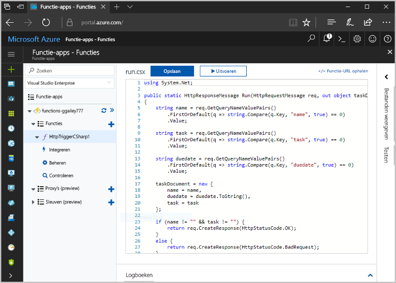
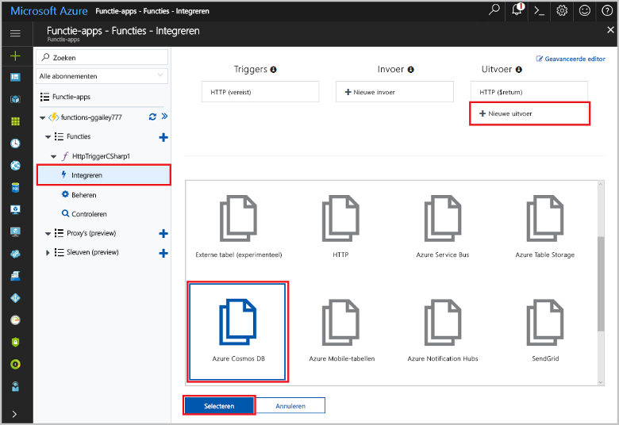
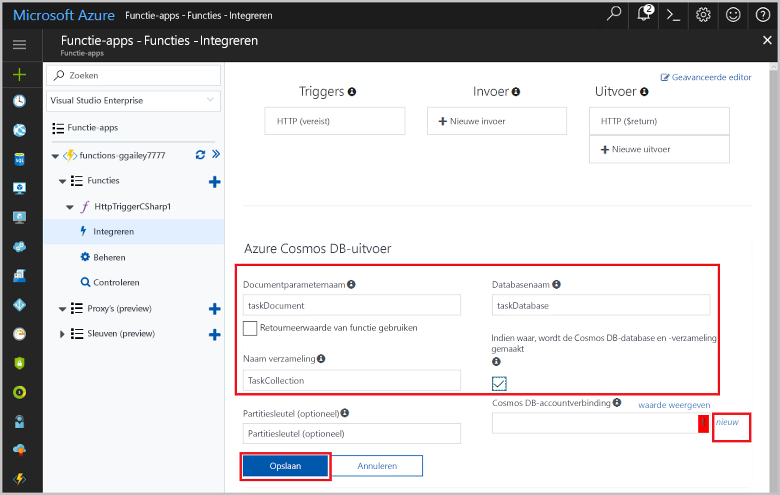
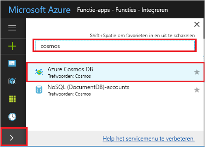
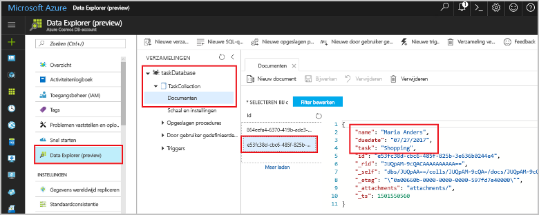

# <a name="store-unstructured-data-using-azure-functions-and-cosmos-db"></a><span data-ttu-id="dd8e3-104">Ongestructureerde gegevens opslaan met behulp van Azure Functions en Cosmos DB</span><span class="sxs-lookup"><span data-stu-id="dd8e3-104">Store unstructured data using Azure Functions and Cosmos DB</span></span>

<span data-ttu-id="dd8e3-105">[Azure Cosmos DB](https://azure.microsoft.com/services/cosmos-db/) is een geweldige manier om ongestructureerde gegevens en JSON-gegevens op te slaan.</span><span class="sxs-lookup"><span data-stu-id="dd8e3-105">[Azure Cosmos DB](https://azure.microsoft.com/services/cosmos-db/) is a great way to store unstructured and JSON data.</span></span> <span data-ttu-id="dd8e3-106">Cosmos DB biedt, in combinatie met Azure Functions, een snelle en eenvoudige manier om gegevens op te slaan met veel minder code dan nodig is voor het opslaan van gegevens in een relationele database.</span><span class="sxs-lookup"><span data-stu-id="dd8e3-106">Combined with Azure Functions, Cosmos DB makes storing data quick and easy with much less code than required for storing data in a relational database.</span></span>

<span data-ttu-id="dd8e3-107">In Azure Functions bieden invoer- en uitvoerbindingen een verklarende manier om verbinding te maken met externe servicegegevens vanuit uw functie.</span><span class="sxs-lookup"><span data-stu-id="dd8e3-107">In Azure Functions, input and output bindings provide a declarative way to connect to external service data from your function.</span></span> <span data-ttu-id="dd8e3-108">In dit onderwerp wordt uitgelegd hoe u een bestaande C#-functie kunt bijwerken voor het toevoegen van een uitvoerbinding die niet-gestructureerde gegevens in een Cosmos-DB-document opslaat.</span><span class="sxs-lookup"><span data-stu-id="dd8e3-108">In this topic, learn how to update an existing C# function to add an output binding that stores unstructured data in a Cosmos DB document.</span></span> 



## <a name="prerequisites"></a><span data-ttu-id="dd8e3-110">Vereisten</span><span class="sxs-lookup"><span data-stu-id="dd8e3-110">Prerequisites</span></span>

<span data-ttu-id="dd8e3-111">Vereisten voor het voltooien van deze zelfstudie:</span><span class="sxs-lookup"><span data-stu-id="dd8e3-111">To complete this tutorial:</span></span>

[!INCLUDE [Previous quickstart note](../../includes/functions-quickstart-previous-topics.md)]

## <a name="add-an-output-binding"></a><span data-ttu-id="dd8e3-112">Een uitvoerbinding toevoegen</span><span class="sxs-lookup"><span data-stu-id="dd8e3-112">Add an output binding</span></span>

1. <span data-ttu-id="dd8e3-113">Vouw de functie-app en de functie uit.</span><span class="sxs-lookup"><span data-stu-id="dd8e3-113">Expand both your function app and your function.</span></span>

1. <span data-ttu-id="dd8e3-114">Selecteer rechts boven op de pagina **Integreren** en **+ Nieuwe uitvoer**.</span><span class="sxs-lookup"><span data-stu-id="dd8e3-114">Select **Integrate** and **+ New Output**, which is at the top right of the page.</span></span> <span data-ttu-id="dd8e3-115">Kies **Azure Cosmos DB**, en klik op **Selecteren**.</span><span class="sxs-lookup"><span data-stu-id="dd8e3-115">Choose **Azure Cosmos DB**, and click **Select**.</span></span>

    

3. <span data-ttu-id="dd8e3-117">Gebruik de **Azure Cosmos DB-uitvoer**instellingen zoals opgegeven in de tabel:</span><span class="sxs-lookup"><span data-stu-id="dd8e3-117">Use the **Azure Cosmos DB output** settings as specified in the table:</span></span> 

    

    | <span data-ttu-id="dd8e3-119">Instelling</span><span class="sxs-lookup"><span data-stu-id="dd8e3-119">Setting</span></span>      | <span data-ttu-id="dd8e3-120">Voorgestelde waarde</span><span class="sxs-lookup"><span data-stu-id="dd8e3-120">Suggested value</span></span>  | <span data-ttu-id="dd8e3-121">Beschrijving</span><span class="sxs-lookup"><span data-stu-id="dd8e3-121">Description</span></span>                                |
    | ------------ | ---------------- | ------------------------------------------ |
    | <span data-ttu-id="dd8e3-122">**Parameternaam van document**</span><span class="sxs-lookup"><span data-stu-id="dd8e3-122">**Document parameter name**</span></span> | <span data-ttu-id="dd8e3-123">taskDocument</span><span class="sxs-lookup"><span data-stu-id="dd8e3-123">taskDocument</span></span> | <span data-ttu-id="dd8e3-124">Naam die in code verwijst naar het Cosmos DB-object.</span><span class="sxs-lookup"><span data-stu-id="dd8e3-124">Name that refers to the Cosmos DB object in code.</span></span> |
    | <span data-ttu-id="dd8e3-125">**Databasenaam**</span><span class="sxs-lookup"><span data-stu-id="dd8e3-125">**Database name**</span></span> | <span data-ttu-id="dd8e3-126">taskDatabase</span><span class="sxs-lookup"><span data-stu-id="dd8e3-126">taskDatabase</span></span> | <span data-ttu-id="dd8e3-127">Naam van database waarin documenten worden opgeslagen.</span><span class="sxs-lookup"><span data-stu-id="dd8e3-127">Name of database to save documents.</span></span> |
    | <span data-ttu-id="dd8e3-128">**Naam van verzameling**</span><span class="sxs-lookup"><span data-stu-id="dd8e3-128">**Collection name**</span></span> | <span data-ttu-id="dd8e3-129">TaskCollection</span><span class="sxs-lookup"><span data-stu-id="dd8e3-129">TaskCollection</span></span> | <span data-ttu-id="dd8e3-130">Naam van verzameling met Cosmos DB-databases.</span><span class="sxs-lookup"><span data-stu-id="dd8e3-130">Name of collection of Cosmos DB databases.</span></span> |
    | <span data-ttu-id="dd8e3-131">**Indien waar, worden de Cosmos-DB-database en -verzameling gemaakt**</span><span class="sxs-lookup"><span data-stu-id="dd8e3-131">**If true, creates the Cosmos DB database and collection**</span></span> | <span data-ttu-id="dd8e3-132">Geselecteerd</span><span class="sxs-lookup"><span data-stu-id="dd8e3-132">Checked</span></span> | <span data-ttu-id="dd8e3-133">De verzameling bestaat nog niet, dus moet u deze maken.</span><span class="sxs-lookup"><span data-stu-id="dd8e3-133">The collection doesn't already exist, so create it.</span></span> |

4. <span data-ttu-id="dd8e3-134">Selecteer **Nieuw** naast het label **Cosmos DB-documentverbinding** en selecteer **+ Nieuwe maken**.</span><span class="sxs-lookup"><span data-stu-id="dd8e3-134">Select **New** next to the **Cosmos DB document connection** label, and select **+ Create new**.</span></span> 

5. <span data-ttu-id="dd8e3-135">Gebruik de instellingen voor **Nieuw account** zoals opgegeven in de tabel:</span><span class="sxs-lookup"><span data-stu-id="dd8e3-135">Use the **New account** settings as specified in the table:</span></span> 

    

    | <span data-ttu-id="dd8e3-137">Instelling</span><span class="sxs-lookup"><span data-stu-id="dd8e3-137">Setting</span></span>      | <span data-ttu-id="dd8e3-138">Voorgestelde waarde</span><span class="sxs-lookup"><span data-stu-id="dd8e3-138">Suggested value</span></span>  | <span data-ttu-id="dd8e3-139">Beschrijving</span><span class="sxs-lookup"><span data-stu-id="dd8e3-139">Description</span></span>                                |
    | ------------ | ---------------- | ------------------------------------------ |
    | <span data-ttu-id="dd8e3-140">**ID**</span><span class="sxs-lookup"><span data-stu-id="dd8e3-140">**ID**</span></span> | <span data-ttu-id="dd8e3-141">Naam van de database</span><span class="sxs-lookup"><span data-stu-id="dd8e3-141">Name of database</span></span> | <span data-ttu-id="dd8e3-142">Unieke id voor de Cosmos DB-database</span><span class="sxs-lookup"><span data-stu-id="dd8e3-142">Unique ID for the Cosmos DB database</span></span>  |
    | <span data-ttu-id="dd8e3-143">**API**</span><span class="sxs-lookup"><span data-stu-id="dd8e3-143">**API**</span></span> | <span data-ttu-id="dd8e3-144">SQL (DocumentDB)</span><span class="sxs-lookup"><span data-stu-id="dd8e3-144">SQL (DocumentDB)</span></span> | <span data-ttu-id="dd8e3-145">Selecteer de documentdatabase-API.</span><span class="sxs-lookup"><span data-stu-id="dd8e3-145">Select the document database API.</span></span>  |
    | <span data-ttu-id="dd8e3-146">**Abonnement**</span><span class="sxs-lookup"><span data-stu-id="dd8e3-146">**Subscription**</span></span> | <span data-ttu-id="dd8e3-147">Azure-abonnement</span><span class="sxs-lookup"><span data-stu-id="dd8e3-147">Azure Subscription</span></span> | <span data-ttu-id="dd8e3-148">Azure-abonnement</span><span class="sxs-lookup"><span data-stu-id="dd8e3-148">Azure Subscription</span></span>  |
    | <span data-ttu-id="dd8e3-149">**Resourcegroep**</span><span class="sxs-lookup"><span data-stu-id="dd8e3-149">**Resource Group**</span></span> | <span data-ttu-id="dd8e3-150">myResourceGroup</span><span class="sxs-lookup"><span data-stu-id="dd8e3-150">myResourceGroup</span></span> |  <span data-ttu-id="dd8e3-151">Gebruik de bestaande resourcegroep die uw functie-app bevat.</span><span class="sxs-lookup"><span data-stu-id="dd8e3-151">Use the existing resource group that contains your function app.</span></span> |
    | <span data-ttu-id="dd8e3-152">**Locatie**</span><span class="sxs-lookup"><span data-stu-id="dd8e3-152">**Location**</span></span>  | <span data-ttu-id="dd8e3-153">West-Europa</span><span class="sxs-lookup"><span data-stu-id="dd8e3-153">WestEurope</span></span> | <span data-ttu-id="dd8e3-154">Selecteer een locatie die zich in de buurt van uw functie-app bevindt of van andere apps die gebruikmaken van de opgeslagen documenten.</span><span class="sxs-lookup"><span data-stu-id="dd8e3-154">Select a location near to either your function app or to other apps that use the stored documents.</span></span>  |

6. <span data-ttu-id="dd8e3-155">Klik op **OK** om de database te maken.</span><span class="sxs-lookup"><span data-stu-id="dd8e3-155">Click **OK** to create the database.</span></span> <span data-ttu-id="dd8e3-156">Het maken van de database kan een paar minuten duren.</span><span class="sxs-lookup"><span data-stu-id="dd8e3-156">It may take a few minutes to create the database.</span></span> <span data-ttu-id="dd8e3-157">Nadat de database is gemaakt, wordt de verbindingsreeks voor de database opgeslagen als een functie-app-instelling.</span><span class="sxs-lookup"><span data-stu-id="dd8e3-157">After the database is created, the database connection string is stored as a function app setting.</span></span> <span data-ttu-id="dd8e3-158">De naam van deze app-instelling wordt ingevoegd in **Cosmos DB-accountverbinding**.</span><span class="sxs-lookup"><span data-stu-id="dd8e3-158">The name of this app setting is inserted in **Cosmos DB account connection**.</span></span> 
 
8. <span data-ttu-id="dd8e3-159">Nadat de verbindingsreeks is ingesteld, selecteert u **Opslaan** om de binding te maken.</span><span class="sxs-lookup"><span data-stu-id="dd8e3-159">After the connection string is set, select **Save** to create the binding.</span></span>

## <a name="update-the-function-code"></a><span data-ttu-id="dd8e3-160">De functiecode bijwerken</span><span class="sxs-lookup"><span data-stu-id="dd8e3-160">Update the function code</span></span>

<span data-ttu-id="dd8e3-161">Vervang de bestaande C#-functiecode door het volgende:</span><span class="sxs-lookup"><span data-stu-id="dd8e3-161">Replace the existing C# function code with the following code:</span></span>

```csharp
using System.Net;

public static HttpResponseMessage Run(HttpRequestMessage req, out object taskDocument, TraceWriter log)
{
    string name = req.GetQueryNameValuePairs()
        .FirstOrDefault(q => string.Compare(q.Key, "name", true) == 0)
        .Value;

    string task = req.GetQueryNameValuePairs()
        .FirstOrDefault(q => string.Compare(q.Key, "task", true) == 0)
        .Value;

    string duedate = req.GetQueryNameValuePairs()
        .FirstOrDefault(q => string.Compare(q.Key, "duedate", true) == 0)
        .Value;

    taskDocument = new {
        name = name,
        duedate = duedate.ToString(),
        task = task
    };

    if (name != "" && task != "") {
        return req.CreateResponse(HttpStatusCode.OK);
    }
    else {
        return req.CreateResponse(HttpStatusCode.BadRequest);
    }
}

```
<span data-ttu-id="dd8e3-162">In dit codevoorbeeld worden de queryreeksen van de HTTP-aanvraag gelezen en toegewezen aan het velden in het `taskDocument`-object.</span><span class="sxs-lookup"><span data-stu-id="dd8e3-162">This code sample reads the HTTP Request query strings and assigns them to fields in the `taskDocument` object.</span></span> <span data-ttu-id="dd8e3-163">De `taskDocument`-binding verzendt de objectgegevens van deze bindingsparameter voor opslag in de gebonden documentdatabase.</span><span class="sxs-lookup"><span data-stu-id="dd8e3-163">The `taskDocument` binding sends the object data from this binding parameter to be stored in the bound document database.</span></span> <span data-ttu-id="dd8e3-164">De database wordt de eerste keer dat de functie wordt uitgevoerd gemaakt.</span><span class="sxs-lookup"><span data-stu-id="dd8e3-164">The database is created the first time the function runs.</span></span>

## <a name="test-the-function-and-database"></a><span data-ttu-id="dd8e3-165">De functie en database testen</span><span class="sxs-lookup"><span data-stu-id="dd8e3-165">Test the function and database</span></span>

1. <span data-ttu-id="dd8e3-166">Vouw het rechtervenster uit en selecteer **Testen**.</span><span class="sxs-lookup"><span data-stu-id="dd8e3-166">Expand the right window and select **Test**.</span></span> <span data-ttu-id="dd8e3-167">Klik onder **Query** op **+ Parameter toevoegen** en voeg de volgende parameters toe aan de querytekenreeks:</span><span class="sxs-lookup"><span data-stu-id="dd8e3-167">Under **Query**, click **+ Add parameter** and add the following parameters to the query string:</span></span>

    + `name`
    + `task`
    + `duedate`

2. <span data-ttu-id="dd8e3-168">Klik op **Uitvoeren** en controleer of een 200-status wordt geretourneerd.</span><span class="sxs-lookup"><span data-stu-id="dd8e3-168">Click **Run** and verify that a 200 status is returned.</span></span>

    

1. <span data-ttu-id="dd8e3-170">Vouw aan de linkerkant van Azure Portal de pictogrammenbalk uit, typ `cosmos` in het zoekveld en selecteer **Azure Cosmos DB**.</span><span class="sxs-lookup"><span data-stu-id="dd8e3-170">On the left side of the Azure portal, expand the icon bar, type `cosmos` in the search field, and select **Azure Cosmos DB**.</span></span>

    

2. <span data-ttu-id="dd8e3-172">Selecteer de database die u hebt gemaakt en selecteer vervolgens **Data Explorer**.</span><span class="sxs-lookup"><span data-stu-id="dd8e3-172">Select the database you created, then select **Data Explorer**.</span></span> <span data-ttu-id="dd8e3-173">Vouw de knooppunten **Verzamelingen** uit, selecteer het nieuwe document en controleer of het document uw querytekenreekswaarden, samen met enkele aanvullende metagegevens, bevat.</span><span class="sxs-lookup"><span data-stu-id="dd8e3-173">Expand the **Collections** nodes, select the new document, and confirm that the document contains your query string values, along with some additional metadata.</span></span> 

    

<span data-ttu-id="dd8e3-175">U hebt een binding toegevoegd aan uw HTTP-trigger die niet-gestructureerde gegevens in een Cosmos-DB-database opslaat.</span><span class="sxs-lookup"><span data-stu-id="dd8e3-175">You have successfully added a binding to your HTTP trigger that stores unstructured data in a Cosmos DB database.</span></span>

[!INCLUDE [Clean-up section](../../includes/clean-up-section-portal.md)]

## <a name="next-steps"></a><span data-ttu-id="dd8e3-176">Volgende stappen</span><span class="sxs-lookup"><span data-stu-id="dd8e3-176">Next steps</span></span>

[!INCLUDE [functions-quickstart-next-steps](../../includes/functions-quickstart-next-steps.md)]

<span data-ttu-id="dd8e3-177">Zie [Azure Functions Cosmos DB bindings](functions-bindings-documentdb.md) (Bindingen tussen Azure Functions en Cosmos DB) voor meer informatie over de binding met een Cosmos DB database.</span><span class="sxs-lookup"><span data-stu-id="dd8e3-177">For more information about binding to a Cosmos DB database, see [Azure Functions Cosmos DB bindings](functions-bindings-documentdb.md).</span></span>
