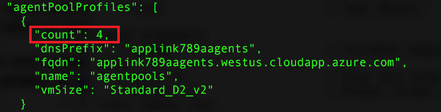

# <a name="deploy-a-docker-container-hosting-solution-using-hello-azure-cli-20"></a>Een oplossing met behulp van Azure CLI 2.0 Hallo hosting Docker-container implementeren

Gebruik Hallo `az acs` opdrachten in hello Azure CLI 2.0 toocreate en beheren van clusters in Azure Container Service. U kunt ook een Azure Container Service-cluster implementeren met behulp van Hallo [Azure-portal](container-service-deployment.md) of hello Azure Container Service API's.

Voor meer informatie over `az acs` opdrachten, doorgeven Hallo `-h` parameter tooany opdracht. Bijvoorbeeld: `az acs create -h`.


## <a name="prerequisites"></a>Vereisten
een Azure Container Service-cluster gebruikt toocreate hello Azure CLI 2.0, moet:
* beschikken over een Azure-account ([krijg een gratis proefversie](https://azure.microsoft.com/pricing/free-trial/))
* hebt geïnstalleerd en geconfigureerd Hallo [Azure CLI 2.0](/cli/azure/install-az-cli2)

## <a name="get-started"></a>Aan de slag 
### <a name="log-in-tooyour-account"></a>Meld u bij tooyour account
```azurecli
az login 
```

Volg interactief Hallo prompts toolog in. Zie voor andere methoden toolog in, [aan de slag met Azure CLI 2.0](/cli/azure/get-started-with-az-cli2).

### <a name="set-your-azure-subscription"></a>Uw Azure-abonnement instellen

Als u meer dan één Azure-abonnement hebt, stelt u Hallo standaardabonnement. Bijvoorbeeld:

```
az account set --subscription "f66xxxxx-xxxx-xxxx-xxx-zgxxxx33cha5"
```


### <a name="create-a-resource-group"></a>Een resourcegroep maken
Het wordt aangeraden om een resourcegroep te maken voor elk cluster. Geef een Azure-regio op waarin Azure Container Service [beschikbaar](https://azure.microsoft.com/en-us/regions/services/) is. Bijvoorbeeld:

```azurecli
az group create -n acsrg1 -l "westus"
```
Uitvoer is vergelijkbaar toohello volgende:


## <a name="create-an-azure-container-service-cluster"></a>Een Azure Container Service-cluster maken

gebruik van een cluster toocreate `az acs create`.
Een naam voor Hallo cluster en het Hallo-naam van resourcegroep Hallo gemaakt in de vorige stap Hallo zijn verplichte parameters. 

Andere invoer zijn set toodefault waarden (Zie het volgende scherm Hallo) tenzij overschreven met behulp van hun respectieve switches. Bijvoorbeeld, is Hallo orchestrator ingesteld door Standaardbesturingssysteem tooDC. En als u niet opgeeft, een DNS-voorvoegsel is gemaakt op basis van de clusternaam Hallo.


### <a name="quick-acs-create-using-defaults"></a>Snel `acs create` met standaardinstellingen
Als u een openbare SSH-RSA-sleutelbestand hebt `id_rsa.pub` op de standaardlocatie hello (of gemaakt voor [OS X- en Linux](../../virtual-machines/linux/mac-create-ssh-keys.md) of [Windows](../../virtual-machines/linux/ssh-from-windows.md)), een opdracht zoals Hallo volgende gebruiken:

```azurecli
az acs create -n acs-cluster -g acsrg1 -d applink789
```
Als u geen openbare SSH-sleutel hebt, gebruikt u deze tweede opdracht. Deze opdracht met Hallo `--generate-ssh-keys` switch maakt voor u.

```azurecli
az acs create -n acs-cluster -g acsrg1 -d applink789 --generate-ssh-keys
```

Nadat u Hallo opdracht invoert, wacht u ongeveer 10 minuten voor Hallo cluster toobe gemaakt. Hallo-opdrachtuitvoer bevat volledig gekwalificeerde domeinnamen (FQDN's) van Hallo master en agent knooppunten en een SSH-opdracht tooconnect toohello eerste model. Hier volgt de verkorte uitvoer:


> [!TIP]
> Hallo [Kubernetes scenario](../kubernetes/container-service-kubernetes-walkthrough.md) ziet u hoe toouse `az acs create` met standaard waarden toocreate een Kubernetes cluster.
>

## <a name="manage-acs-clusters"></a>ACS-clusters beheren

Gebruik aanvullende `az acs` opdrachten toomanage uw cluster. Hier volgen enkele voorbeelden.

### <a name="list-clusters-under-a-subscription"></a>Clusters groeperen onder een abonnement

```azurecli
az acs list --output table
```

### <a name="list-clusters-in-a-resource-group"></a>Clusters groeperen onder een resourcegroep

```azurecli
az acs list -g acsrg1 --output table
```


### <a name="display-details-of-a-container-service-cluster"></a>Details van een Container Service-cluster weergeven

```azurecli
az acs show -g acsrg1 -n acs-cluster --output list
```


### <a name="scale-hello-cluster"></a>Schaal Hallo cluster
Zowel het opschalen als het uitschalen van agentknooppunten is toegestaan. parameter Hallo `new-agent-count` Hallo nieuwe aantal agents in Hallo ACS-cluster is.

```azurecli
az acs scale -g acsrg1 -n acs-cluster --new-agent-count 4
```



## <a name="delete-a-container-service-cluster"></a>Een Container Service-cluster verwijderen
```azurecli
az acs delete -g acsrg1 -n acs-cluster 
```
Met deze opdracht worden alle resources (netwerk en opslag) zijn gemaakt tijdens het maken van Hallo containerservice niet verwijderd. toodelete alle resources gemakkelijk, verdient het implementeren van ieder cluster in een afzonderlijke resourcegroep. Hallo resourcegroep vervolgens verwijderen wanneer het Hallo-cluster is niet langer vereist.

## <a name="next-steps"></a>Volgende stappen
Nu u een werkend cluster hebt, kunt u deze documenten lezen voor meer informatie over verbinding en beheer:

* [Verbinding maken met tooan Azure Container Service-cluster](../container-service-connect.md)
* [Werken met de Azure Container Service en DC/OS](container-service-mesos-marathon-rest.md)
* [Werken met de Azure Container Service en Docker Swarm](container-service-docker-swarm.md)
* [Werken met de Azure Container Service en Kubernetes](../kubernetes/container-service-kubernetes-walkthrough.md)