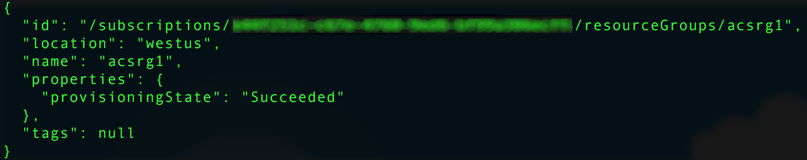

# <a name="deploy-a-docker-container-hosting-solution-using-the-azure-cli-20"></a><span data-ttu-id="9b63f-103">Een Docker-containerhostingoplossing implementeren met behulp van de Azure CLI 2.0</span><span class="sxs-lookup"><span data-stu-id="9b63f-103">Deploy a Docker container hosting solution using the Azure CLI 2.0</span></span>

<span data-ttu-id="9b63f-104">Gebruik de `az acs`-opdrachten in Azure CLI 2.0 om clusters te maken en te beheren in Azure Container Service.</span><span class="sxs-lookup"><span data-stu-id="9b63f-104">Use the `az acs` commands in the Azure CLI 2.0 to create and manage clusters in Azure Container Service.</span></span> <span data-ttu-id="9b63f-105">U kunt ook een Azure Container Service-cluster implementeren met behulp van [Azure Portal](container-service-deployment.md) of de Azure Container Service-API’s.</span><span class="sxs-lookup"><span data-stu-id="9b63f-105">You can also deploy an Azure Container Service cluster by using the [Azure portal](container-service-deployment.md) or the Azure Container Service APIs.</span></span>

<span data-ttu-id="9b63f-106">Voor meer informatie over `az acs`-opdrachten, gebruikt u de parameter `-h` voor een opdracht.</span><span class="sxs-lookup"><span data-stu-id="9b63f-106">For help on `az acs` commands, pass the `-h` parameter to any command.</span></span> <span data-ttu-id="9b63f-107">Bijvoorbeeld: `az acs create -h`.</span><span class="sxs-lookup"><span data-stu-id="9b63f-107">For example: `az acs create -h`.</span></span>


## <a name="prerequisites"></a><span data-ttu-id="9b63f-108">Vereisten</span><span class="sxs-lookup"><span data-stu-id="9b63f-108">Prerequisites</span></span>
<span data-ttu-id="9b63f-109">Als u een Azure Container Service-cluster wilt maken met Azure CLI 2.0, moet u:</span><span class="sxs-lookup"><span data-stu-id="9b63f-109">To create an Azure Container Service cluster using the Azure CLI 2.0, you must:</span></span>
* <span data-ttu-id="9b63f-110">beschikken over een Azure-account ([krijg een gratis proefversie](https://azure.microsoft.com/pricing/free-trial/))</span><span class="sxs-lookup"><span data-stu-id="9b63f-110">have an Azure account ([get a free trial](https://azure.microsoft.com/pricing/free-trial/))</span></span>
* <span data-ttu-id="9b63f-111">[Azure CLI 2.0](/cli/azure/install-az-cli2) hebben geïnstalleerd en ingesteld</span><span class="sxs-lookup"><span data-stu-id="9b63f-111">have installed and set up the [Azure CLI 2.0](/cli/azure/install-az-cli2)</span></span>

## <a name="get-started"></a><span data-ttu-id="9b63f-112">Aan de slag</span><span class="sxs-lookup"><span data-stu-id="9b63f-112">Get started</span></span> 
### <a name="log-in-to-your-account"></a><span data-ttu-id="9b63f-113">Meld u aan bij uw account</span><span class="sxs-lookup"><span data-stu-id="9b63f-113">Log in to your account</span></span>
```azurecli
az login 
```

<span data-ttu-id="9b63f-114">Volg de aanwijzingen om u interactief aan te melden.</span><span class="sxs-lookup"><span data-stu-id="9b63f-114">Follow the prompts to log in interactively.</span></span> <span data-ttu-id="9b63f-115">Raadpleeg [Aan de slag met Azure CLI 2.0](/cli/azure/get-started-with-az-cli2) voor informatie over andere aanmeldingsmethoden.</span><span class="sxs-lookup"><span data-stu-id="9b63f-115">For other methods to log in, see [Get started with Azure CLI 2.0](/cli/azure/get-started-with-az-cli2).</span></span>

### <a name="set-your-azure-subscription"></a><span data-ttu-id="9b63f-116">Uw Azure-abonnement instellen</span><span class="sxs-lookup"><span data-stu-id="9b63f-116">Set your Azure subscription</span></span>

<span data-ttu-id="9b63f-117">Als u meer dan één Azure-abonnement hebt, stelt u een standaardabonnement in.</span><span class="sxs-lookup"><span data-stu-id="9b63f-117">If you have more than one Azure subscription, set the default subscription.</span></span> <span data-ttu-id="9b63f-118">Bijvoorbeeld:</span><span class="sxs-lookup"><span data-stu-id="9b63f-118">For example:</span></span>

```
az account set --subscription "f66xxxxx-xxxx-xxxx-xxx-zgxxxx33cha5"
```


### <a name="create-a-resource-group"></a><span data-ttu-id="9b63f-119">Een resourcegroep maken</span><span class="sxs-lookup"><span data-stu-id="9b63f-119">Create a resource group</span></span>
<span data-ttu-id="9b63f-120">Het wordt aangeraden om een resourcegroep te maken voor elk cluster.</span><span class="sxs-lookup"><span data-stu-id="9b63f-120">We recommend that you create a resource group for every cluster.</span></span> <span data-ttu-id="9b63f-121">Geef een Azure-regio op waarin Azure Container Service [beschikbaar](https://azure.microsoft.com/en-us/regions/services/) is.</span><span class="sxs-lookup"><span data-stu-id="9b63f-121">Specify an Azure region in which Azure Container Service is [available](https://azure.microsoft.com/en-us/regions/services/).</span></span> <span data-ttu-id="9b63f-122">Bijvoorbeeld:</span><span class="sxs-lookup"><span data-stu-id="9b63f-122">For example:</span></span>

```azurecli
az group create -n acsrg1 -l "westus"
```
<span data-ttu-id="9b63f-123">De uitvoer lijkt op het volgende:</span><span class="sxs-lookup"><span data-stu-id="9b63f-123">Output is similar to the following:</span></span>




## <a name="create-an-azure-container-service-cluster"></a><span data-ttu-id="9b63f-125">Een Azure Container Service-cluster maken</span><span class="sxs-lookup"><span data-stu-id="9b63f-125">Create an Azure Container Service cluster</span></span>

<span data-ttu-id="9b63f-126">Gebruik `az acs create` om een cluster te maken.</span><span class="sxs-lookup"><span data-stu-id="9b63f-126">To create a cluster, use `az acs create`.</span></span>
<span data-ttu-id="9b63f-127">Een naam voor het cluster en de naam van de resourcegroep die is gemaakt in de vorige stap zijn verplichte parameters.</span><span class="sxs-lookup"><span data-stu-id="9b63f-127">A name for the cluster and the name of the resource group created in the previous step are mandatory parameters.</span></span> 

<span data-ttu-id="9b63f-128">Andere invoer is ingesteld op standaardwaarden (zie het volgende scherm), tenzij deze wordt overschreven met behulp van de respectieve switches.</span><span class="sxs-lookup"><span data-stu-id="9b63f-128">Other inputs are set to default values (see the following screen) unless overwritten using their respective switches.</span></span> <span data-ttu-id="9b63f-129">De orchestrator is bijvoorbeeld standaard ingesteld op DC/OS.</span><span class="sxs-lookup"><span data-stu-id="9b63f-129">For example, the orchestrator is set by default to DC/OS.</span></span> <span data-ttu-id="9b63f-130">Als u er geen opgeeft, wordt een DNS-naamvoorvoegsel gemaakt op basis van de clusternaam.</span><span class="sxs-lookup"><span data-stu-id="9b63f-130">And if you don't specify one, a DNS name prefix is created based on the cluster name.</span></span>


### <a name="quick-acs-create-using-defaults"></a><span data-ttu-id="9b63f-132">Snel `acs create` met standaardinstellingen</span><span class="sxs-lookup"><span data-stu-id="9b63f-132">Quick `acs create` using defaults</span></span>
<span data-ttu-id="9b63f-133">Als u een openbaar SSH RSA-sleutelbestand (`id_rsa.pub`) hebt op de standaardlocatie (of als u er een hebt gemaakt voor [OS X en Linux](../../virtual-machines/linux/mac-create-ssh-keys.md) of [Windows](../../virtual-machines/linux/ssh-from-windows.md)), gebruikt u een opdracht als de volgende:</span><span class="sxs-lookup"><span data-stu-id="9b63f-133">If you have an SSH RSA public key file `id_rsa.pub` in the default location (or created one for [OS X and Linux](../../virtual-machines/linux/mac-create-ssh-keys.md) or [Windows](../../virtual-machines/linux/ssh-from-windows.md)), use a command like the following:</span></span>

```azurecli
az acs create -n acs-cluster -g acsrg1 -d applink789
```
<span data-ttu-id="9b63f-134">Als u geen openbare SSH-sleutel hebt, gebruikt u deze tweede opdracht.</span><span class="sxs-lookup"><span data-stu-id="9b63f-134">If you don't have an SSH public key, use this second command.</span></span> <span data-ttu-id="9b63f-135">Met deze opdracht met de `--generate-ssh-keys`-switch wordt er een voor u gemaakt.</span><span class="sxs-lookup"><span data-stu-id="9b63f-135">This command with the `--generate-ssh-keys` switch creates one for you.</span></span>

```azurecli
az acs create -n acs-cluster -g acsrg1 -d applink789 --generate-ssh-keys
```

<span data-ttu-id="9b63f-136">Wanneer u de opdracht hebt ingevoerd, duurt het ongeveer 10 minuten voor het cluster is gemaakt.</span><span class="sxs-lookup"><span data-stu-id="9b63f-136">After you enter the command, wait for about 10 minutes for the cluster to be created.</span></span> <span data-ttu-id="9b63f-137">De uitvoer van de opdracht bevat de volledig gekwalificeerde domeinnamen (FQDN’s) van de hoofd- en agentknooppunten en een SSH-opdracht om verbinding te maken met het eerste hoofdknooppunt.</span><span class="sxs-lookup"><span data-stu-id="9b63f-137">The command output includes fully qualified domain names (FQDNs) of the master and agent nodes and an SSH command to connect to the first master.</span></span> <span data-ttu-id="9b63f-138">Hier volgt de verkorte uitvoer:</span><span class="sxs-lookup"><span data-stu-id="9b63f-138">Here is abbreviated output:</span></span>


> [!TIP]
> <span data-ttu-id="9b63f-140">In de [Kubernetes-walkthrough](../kubernetes/container-service-kubernetes-walkthrough.md) ziet u hoe u `az acs create` gebruikt met standaardwaarden om een Kubernetes-cluster te maken.</span><span class="sxs-lookup"><span data-stu-id="9b63f-140">The [Kubernetes walkthrough](../kubernetes/container-service-kubernetes-walkthrough.md) shows how to use `az acs create` with default values to create a Kubernetes cluster.</span></span>
>

## <a name="manage-acs-clusters"></a><span data-ttu-id="9b63f-141">ACS-clusters beheren</span><span class="sxs-lookup"><span data-stu-id="9b63f-141">Manage ACS clusters</span></span>

<span data-ttu-id="9b63f-142">Gebruik aanvullende `az acs`-opdrachten voor het beheren van uw cluster.</span><span class="sxs-lookup"><span data-stu-id="9b63f-142">Use additional `az acs` commands to manage your cluster.</span></span> <span data-ttu-id="9b63f-143">Hier volgen enkele voorbeelden.</span><span class="sxs-lookup"><span data-stu-id="9b63f-143">Here are some examples.</span></span>

### <a name="list-clusters-under-a-subscription"></a><span data-ttu-id="9b63f-144">Clusters groeperen onder een abonnement</span><span class="sxs-lookup"><span data-stu-id="9b63f-144">List clusters under a subscription</span></span>

```azurecli
az acs list --output table
```

### <a name="list-clusters-in-a-resource-group"></a><span data-ttu-id="9b63f-145">Clusters groeperen onder een resourcegroep</span><span class="sxs-lookup"><span data-stu-id="9b63f-145">List clusters in a resource group</span></span>

```azurecli
az acs list -g acsrg1 --output table
```


### <a name="display-details-of-a-container-service-cluster"></a><span data-ttu-id="9b63f-147">Details van een Container Service-cluster weergeven</span><span class="sxs-lookup"><span data-stu-id="9b63f-147">Display details of a container service cluster</span></span>

```azurecli
az acs show -g acsrg1 -n acs-cluster --output list
```


### <a name="scale-the-cluster"></a><span data-ttu-id="9b63f-149">Het cluster schalen</span><span class="sxs-lookup"><span data-stu-id="9b63f-149">Scale the cluster</span></span>
<span data-ttu-id="9b63f-150">Zowel het opschalen als het uitschalen van agentknooppunten is toegestaan.</span><span class="sxs-lookup"><span data-stu-id="9b63f-150">Both scaling in and scaling out of agent nodes are allowed.</span></span> <span data-ttu-id="9b63f-151">De parameter `new-agent-count` is het nieuwe aantal agents in het ACS-cluster.</span><span class="sxs-lookup"><span data-stu-id="9b63f-151">The parameter `new-agent-count` is the new number of agents in the ACS cluster.</span></span>

```azurecli
az acs scale -g acsrg1 -n acs-cluster --new-agent-count 4
```


## <a name="delete-a-container-service-cluster"></a><span data-ttu-id="9b63f-153">Een Container Service-cluster verwijderen</span><span class="sxs-lookup"><span data-stu-id="9b63f-153">Delete a container service cluster</span></span>
```azurecli
az acs delete -g acsrg1 -n acs-cluster 
```
<span data-ttu-id="9b63f-154">Met deze verwijderopdracht verwijdert u niet alle resources (netwerk en opslag) die zijn gemaakt tijdens het maken van de Container Service.</span><span class="sxs-lookup"><span data-stu-id="9b63f-154">This command does not delete all resources (network and storage) created while creating the container service.</span></span> <span data-ttu-id="9b63f-155">Als u alle resources gemakkelijk wilt verwijderen, wordt het aangeraden om elk cluster in een afzonderlijke resourcegroep te implementeren.</span><span class="sxs-lookup"><span data-stu-id="9b63f-155">To delete all resources easily, it is recommended you deploy each cluster in a distinct resource group.</span></span> <span data-ttu-id="9b63f-156">Verwijder vervolgens de resourcegroep wanneer het cluster niet langer nodig is.</span><span class="sxs-lookup"><span data-stu-id="9b63f-156">Then, delete the resource group when the cluster is no longer required.</span></span>

## <a name="next-steps"></a><span data-ttu-id="9b63f-157">Volgende stappen</span><span class="sxs-lookup"><span data-stu-id="9b63f-157">Next steps</span></span>
<span data-ttu-id="9b63f-158">Nu u een werkend cluster hebt, kunt u deze documenten lezen voor meer informatie over verbinding en beheer:</span><span class="sxs-lookup"><span data-stu-id="9b63f-158">Now that you have a functioning cluster, see these documents for connection and management details:</span></span>

* [<span data-ttu-id="9b63f-159">Verbinding maken met een Azure Container Service-cluster</span><span class="sxs-lookup"><span data-stu-id="9b63f-159">Connect to an Azure Container Service cluster</span></span>](../container-service-connect.md)
* [<span data-ttu-id="9b63f-160">Werken met de Azure Container Service en DC/OS</span><span class="sxs-lookup"><span data-stu-id="9b63f-160">Work with Azure Container Service and DC/OS</span></span>](container-service-mesos-marathon-rest.md)
* [<span data-ttu-id="9b63f-161">Werken met de Azure Container Service en Docker Swarm</span><span class="sxs-lookup"><span data-stu-id="9b63f-161">Work with Azure Container Service and Docker Swarm</span></span>](container-service-docker-swarm.md)
* [<span data-ttu-id="9b63f-162">Werken met de Azure Container Service en Kubernetes</span><span class="sxs-lookup"><span data-stu-id="9b63f-162">Work with Azure Container Service and Kubernetes</span></span>](../kubernetes/container-service-kubernetes-walkthrough.md)