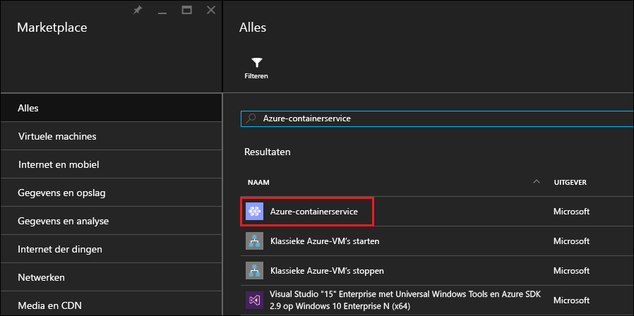
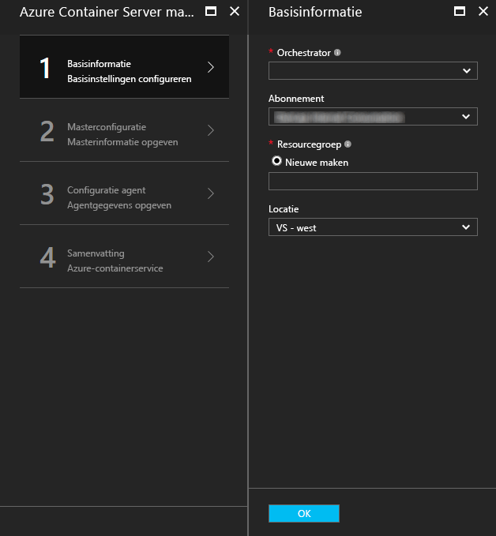
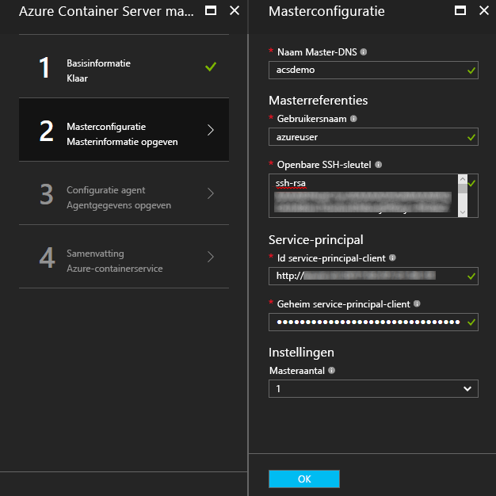
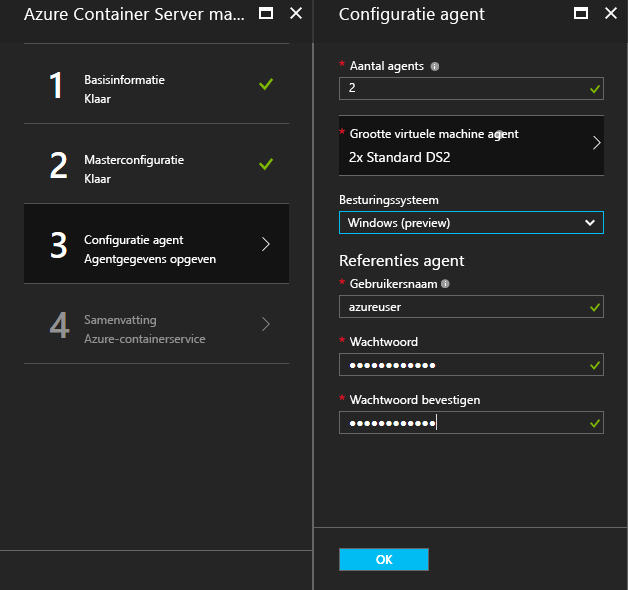
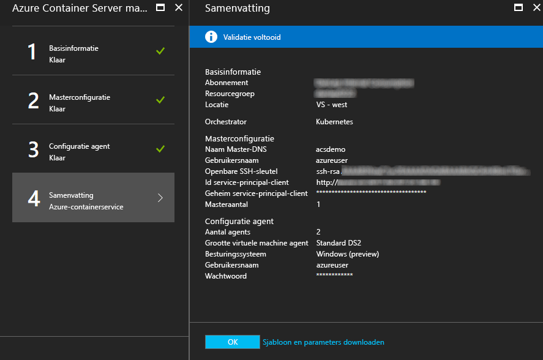
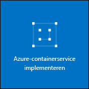

# <a name="deploy-a-docker-container-hosting-solution-using-the-azure-portal"></a><span data-ttu-id="cc581-104">Een Docker-containerhostingoplossing implementeren met behulp van Azure Portal</span><span class="sxs-lookup"><span data-stu-id="cc581-104">Deploy a Docker container hosting solution using the Azure portal</span></span>


<span data-ttu-id="cc581-105">Azure Container Service biedt een snelle implementatie van populaire open-sourceoplossingen voor containerclustering en -orchestration.</span><span class="sxs-lookup"><span data-stu-id="cc581-105">Azure Container Service provides rapid deployment of popular open-source container clustering and orchestration solutions.</span></span> <span data-ttu-id="cc581-106">In dit document vindt u instructies voor het implementeren van een Azure Container Service-cluster met behulp van Azure Portal of een Azure Resource Manager-snelstartsjabloon.</span><span class="sxs-lookup"><span data-stu-id="cc581-106">This document walks you through deploying an Azure Container Service cluster by using the Azure portal or an Azure Resource Manager quickstart template.</span></span> 

<span data-ttu-id="cc581-107">U kunt ook een Azure Container Service-cluster implementeren met behulp van de [Azure CLI 2.0](container-service-create-acs-cluster-cli.md) of de Azure Container Service-API's.</span><span class="sxs-lookup"><span data-stu-id="cc581-107">You can also deploy an Azure Container Service cluster by using the [Azure CLI 2.0](container-service-create-acs-cluster-cli.md) or the Azure Container Service APIs.</span></span>

<span data-ttu-id="cc581-108">Zie [Kennismaking met Azure Container Service](../container-service-intro.md) voor achtergrondinformatie.</span><span class="sxs-lookup"><span data-stu-id="cc581-108">For background, see [Azure Container Service introduction](../container-service-intro.md).</span></span>


## <a name="prerequisites"></a><span data-ttu-id="cc581-109">Vereisten</span><span class="sxs-lookup"><span data-stu-id="cc581-109">Prerequisites</span></span>

* <span data-ttu-id="cc581-110">**Azure-abonnement**: als u nog geen abonnement hebt, kunt u zich registreren voor een [gratis proefversie](http://azure.microsoft.com/pricing/free-trial/?WT.mc_id=AA4C1C935).</span><span class="sxs-lookup"><span data-stu-id="cc581-110">**Azure subscription**: If you don't have one, sign up for a [free trial](http://azure.microsoft.com/pricing/free-trial/?WT.mc_id=AA4C1C935).</span></span> <span data-ttu-id="cc581-111">Voor een groter cluster kunt u een Betalen per gebruik-abonnement of andere aanschafopties overwegen.</span><span class="sxs-lookup"><span data-stu-id="cc581-111">For a larger cluster, consider a pay-as-you go subscription or other purchase options.</span></span>

    > [!NOTE]
    > <span data-ttu-id="cc581-112">Uw Azure-abonnementgebruik en [resourcequota’s](../../azure-subscription-service-limits.md), zoals kernquota's, kunnen de omvang beperken van het cluster dat u implementeert.</span><span class="sxs-lookup"><span data-stu-id="cc581-112">Your Azure subscription usage and [resource quotas](../../azure-subscription-service-limits.md), such as cores quotas, can limit the size of the cluster you deploy.</span></span> <span data-ttu-id="cc581-113">Als u een verhoging van het quotum wilt aanvragen, opent u een [online een ondersteuningsverzoek](../../azure-supportability/how-to-create-azure-support-request.md). Hiervoor worden geen kosten in rekening gebracht.</span><span class="sxs-lookup"><span data-stu-id="cc581-113">To request a quota increase, open an [online customer support request](../../azure-supportability/how-to-create-azure-support-request.md) at no charge.</span></span>
    >

* <span data-ttu-id="cc581-114">**Openbare SSH RSA-sleutel**: wanneer u implementeert via de portal of een van de snelstartsjablonen van Azure, moet u de openbare sleutel opgeven voor verificatie bij de virtuele machines van Azure Container Service.</span><span class="sxs-lookup"><span data-stu-id="cc581-114">**SSH RSA public key**: When deploying through the portal or one of the Azure quickstart templates, you need to provide the public key for authentication against Azure Container Service virtual machines.</span></span> <span data-ttu-id="cc581-115">Als u SSH RSA-sleutels (Secure Shell) wilt maken, ziet u de richtlijnen voor [OS X en Linux](../../virtual-machines/linux/mac-create-ssh-keys.md) of [Windows](../../virtual-machines/linux/ssh-from-windows.md).</span><span class="sxs-lookup"><span data-stu-id="cc581-115">To create Secure Shell (SSH) RSA keys, see the [OS X and Linux](../../virtual-machines/linux/mac-create-ssh-keys.md) or [Windows](../../virtual-machines/linux/ssh-from-windows.md) guidance.</span></span> 

* <span data-ttu-id="cc581-116">**Service-principalclient-id en -geheim** (alleen Kubernetes): zie [Informatie over de service-principal voor een Kubernetes-cluster](../kubernetes/container-service-kubernetes-service-principal.md) voor meer informatie over en richtlijnen voor het maken van een service-principal voor Azure Active Directory.</span><span class="sxs-lookup"><span data-stu-id="cc581-116">**Service principal client ID and secret** (Kubernetes only): For more information and guidance to create an Azure Active Directory service principal, see [About the service principal for a Kubernetes cluster](../kubernetes/container-service-kubernetes-service-principal.md).</span></span>


## <a name="create-a-cluster-by-using-the-azure-portal"></a><span data-ttu-id="cc581-117">Een cluster maken met Azure Portal</span><span class="sxs-lookup"><span data-stu-id="cc581-117">Create a cluster by using the Azure portal</span></span>
1. <span data-ttu-id="cc581-118">Meld u aan bij Azure Portal, selecteer **New** en zoek in Azure Marketplace naar **Azure Container Service**.</span><span class="sxs-lookup"><span data-stu-id="cc581-118">Sign in to the Azure portal, select **New**, and search the Azure Marketplace for **Azure Container Service**.</span></span>

      <br />

2. <span data-ttu-id="cc581-120">Klik op **Azure Container Service** en klik op **Create**.</span><span class="sxs-lookup"><span data-stu-id="cc581-120">Click **Azure Container Service**, and click **Create**.</span></span>

3. <span data-ttu-id="cc581-121">Voer in de blade **Basics** de volgende gegevens op:</span><span class="sxs-lookup"><span data-stu-id="cc581-121">On the **Basics** blade, enter the following information:</span></span>

    * <span data-ttu-id="cc581-122">**Orchestrator**: selecteer een van de container-orchestrators om op het cluster te implementeren.</span><span class="sxs-lookup"><span data-stu-id="cc581-122">**Orchestrator**: Select one of the container orchestrators to deploy on the cluster.</span></span>
        * <span data-ttu-id="cc581-123">**DC/OS**: implementeert een DC/OS-cluster.</span><span class="sxs-lookup"><span data-stu-id="cc581-123">**DC/OS**: Deploys a DC/OS cluster.</span></span>
        * <span data-ttu-id="cc581-124">**Swarm**: implementeert een Docker Swarm-cluster.</span><span class="sxs-lookup"><span data-stu-id="cc581-124">**Swarm**: Deploys a Docker Swarm cluster.</span></span>
        * <span data-ttu-id="cc581-125">**Kubernetes**: implementeert een Kubernetes-cluster.</span><span class="sxs-lookup"><span data-stu-id="cc581-125">**Kubernetes**: Deploys a Kubernetes cluster.</span></span>
    * <span data-ttu-id="cc581-126">**Subscription**: selecteer een Azure-abonnement.</span><span class="sxs-lookup"><span data-stu-id="cc581-126">**Subscription**: Select an Azure subscription.</span></span>
    * <span data-ttu-id="cc581-127">**Resource group**: voer de naam van een nieuwe resourcegroep voor de implementatie in.</span><span class="sxs-lookup"><span data-stu-id="cc581-127">**Resource group**: Enter the name of a new resource group for the deployment.</span></span>
    * <span data-ttu-id="cc581-128">**Location**: selecteer een Azure-regio voor de Azure Container Service-implementatie.</span><span class="sxs-lookup"><span data-stu-id="cc581-128">**Location**: Select an Azure region for the Azure Container Service deployment.</span></span> <span data-ttu-id="cc581-129">Raadpleeg voor beschikbaarheid, [Beschikbare producten per regio](https://azure.microsoft.com/regions/services/).</span><span class="sxs-lookup"><span data-stu-id="cc581-129">For availability, check [Products available by region](https://azure.microsoft.com/regions/services/).</span></span>
    
      <br />
    
    <span data-ttu-id="cc581-131">Klik op **OK** wanneer u klaar bent om door te gaan.</span><span class="sxs-lookup"><span data-stu-id="cc581-131">Click **OK** when you're ready to proceed.</span></span>

4. <span data-ttu-id="cc581-132">Voer in de blade **Master configuration** in het cluster de volgende instellingen voor het Linux-hoofdknooppunt (of de hoofdknooppunten) in (sommige instellingen zijn specifiek voor elke orchestrator):</span><span class="sxs-lookup"><span data-stu-id="cc581-132">On the **Master configuration** blade, enter the following settings for the Linux master node or nodes in the cluster (some settings are specific to each orchestrator):</span></span>

    * <span data-ttu-id="cc581-133">**Master DNS name**: het voorvoegsel dat wordt gebruikt om een unieke FQDN (fully qualified domain name) te maken voor de master.</span><span class="sxs-lookup"><span data-stu-id="cc581-133">**Master DNS name**: The prefix used to create a unique fully qualified domain name (FQDN) for the master.</span></span> <span data-ttu-id="cc581-134">De master-FQDN-naam ziet er zo uit: *voorvoegsel*mgmt. *locatie*.cloudapp.azure.com.</span><span class="sxs-lookup"><span data-stu-id="cc581-134">The master FQDN is of the form *prefix*mgmt.*location*.cloudapp.azure.com.</span></span>
    * <span data-ttu-id="cc581-135">**User name**: de gebruikersnaam voor een account op elke virtuele Linux-machine in het cluster.</span><span class="sxs-lookup"><span data-stu-id="cc581-135">**User name**: The user name for an account on each of the Linux virtual machines in the cluster.</span></span>
    * <span data-ttu-id="cc581-136">**SSH RSA public key**: voeg de openbare sleutel toe die wordt gebruikt voor verificatie bij de virtuele Linux-machines.</span><span class="sxs-lookup"><span data-stu-id="cc581-136">**SSH RSA public key**: Add the public key to be used for authentication against the Linux virtual machines.</span></span> <span data-ttu-id="cc581-137">Het is belangrijk dat deze sleutel geen regeleinden bevat, maar wel het voorvoegsel `ssh-rsa`.</span><span class="sxs-lookup"><span data-stu-id="cc581-137">It is important that this key contains no line breaks, and it includes the `ssh-rsa` prefix.</span></span> <span data-ttu-id="cc581-138">Het achtervoegsel `username@domain` is optioneel.</span><span class="sxs-lookup"><span data-stu-id="cc581-138">The `username@domain` postfix is optional.</span></span> <span data-ttu-id="cc581-139">De sleutel moet er ongeveer zo uitzien: **ssh-rsa AAAAB3Nz...<...>...UcyupgH azureuser@linuxvm**.</span><span class="sxs-lookup"><span data-stu-id="cc581-139">The key should look something like the following: **ssh-rsa AAAAB3Nz...<...>...UcyupgH azureuser@linuxvm**.</span></span> 
    * <span data-ttu-id="cc581-140">**Service principal**: als u de Kubernetes-orchestrator hebt geselecteerd, voert u een **Service-principalclient-id** (ook wel de appId genoemd) en een **Service principalclientgeheim** (wachtwoord) voor Azure Active Directory in.</span><span class="sxs-lookup"><span data-stu-id="cc581-140">**Service principal**: If you selected the Kubernetes orchestrator, enter an Azure Active Directory **Service principal client ID** (also called the appId) and **Service principal client secret** (password).</span></span> <span data-ttu-id="cc581-141">Zie [Over de service-principal voor een Kubernetes-cluster](../kubernetes/container-service-kubernetes-service-principal.md) voor meer informatie.</span><span class="sxs-lookup"><span data-stu-id="cc581-141">For more information, see [About the service principal for a Kubernetes cluster](../kubernetes/container-service-kubernetes-service-principal.md).</span></span>
    * <span data-ttu-id="cc581-142">**Master count**: het aantal masters in het cluster.</span><span class="sxs-lookup"><span data-stu-id="cc581-142">**Master count**: The number of masters in the cluster.</span></span>
    * <span data-ttu-id="cc581-143">**VM diagnostics**: voor sommige orchestrators kunt u VM-diagnostische gegevens inschakelen op de masters.</span><span class="sxs-lookup"><span data-stu-id="cc581-143">**VM diagnostics**: For some orchestrators, you can enable VM diagnostics on the masters.</span></span>

      <br />

    <span data-ttu-id="cc581-145">Klik op **OK** wanneer u klaar bent om door te gaan.</span><span class="sxs-lookup"><span data-stu-id="cc581-145">Click **OK** when you're ready to proceed.</span></span>

5. <span data-ttu-id="cc581-146">Voer in de blade **Agent configuration** de volgende gegevens in:</span><span class="sxs-lookup"><span data-stu-id="cc581-146">On the **Agent configuration** blade, enter the following information:</span></span>

    * <span data-ttu-id="cc581-147">**Agent count**: voor Docker Swarm en Kubernetes is dit het oorspronkelijke aantal agents in de agentschaalset.</span><span class="sxs-lookup"><span data-stu-id="cc581-147">**Agent count**: For Docker Swarm and Kubernetes, this value is the initial number of agents in the agent scale set.</span></span> <span data-ttu-id="cc581-148">Voor DC/OS is dit het oorspronkelijke aantal agents in een persoonlijke schaalset.</span><span class="sxs-lookup"><span data-stu-id="cc581-148">For DC/OS, it is the initial number of agents in a private scale set.</span></span> <span data-ttu-id="cc581-149">Bovendien wordt een openbare schaalset gemaakt voor DC/OS, die een vooraf bepaald aantal agents bevat.</span><span class="sxs-lookup"><span data-stu-id="cc581-149">Additionally, a public scale set is created for DC/OS, which contains a predetermined number of agents.</span></span> <span data-ttu-id="cc581-150">Het aantal agents in deze openbare schaalset wordt bepaald door het aantal masters in het cluster: één openbare agent voor één master en twee openbare agents voor drie of vijf masters.</span><span class="sxs-lookup"><span data-stu-id="cc581-150">The number of agents in this public scale set is determined by the number of masters in the cluster: one public agent for one master, and two public agents for three or five masters.</span></span>
    * <span data-ttu-id="cc581-151">**Agent virtual machine size**: de grootte van de virtuele machines van de agent.</span><span class="sxs-lookup"><span data-stu-id="cc581-151">**Agent virtual machine size**: The size of the agent virtual machines.</span></span>
    * <span data-ttu-id="cc581-152">**Operating system**: deze instelling is momenteel alleen beschikbaar als u de Kubernetes-orchestrator hebt geselecteerd.</span><span class="sxs-lookup"><span data-stu-id="cc581-152">**Operating system**: This setting is currently available only if you selected the Kubernetes orchestrator.</span></span> <span data-ttu-id="cc581-153">Kies een Linux-distributie of een Windows Server-besturingssysteem om uit te voeren op de agents.</span><span class="sxs-lookup"><span data-stu-id="cc581-153">Choose either a Linux distribution or a Windows Server operating system to run on the agents.</span></span> <span data-ttu-id="cc581-154">Op basis van deze instelling wordt bepaald of op het cluster Linux- of Windows-container-apps kunnen worden uitgevoerd.</span><span class="sxs-lookup"><span data-stu-id="cc581-154">This setting determines whether your cluster can run Linux or Windows container apps.</span></span> 

        > [!NOTE]
        > <span data-ttu-id="cc581-155">Ondersteuning voor Windows-containers bevindt zich voor Kubernetes-clusters nog in de preview-fase.</span><span class="sxs-lookup"><span data-stu-id="cc581-155">Windows container support is in preview for Kubernetes clusters.</span></span> <span data-ttu-id="cc581-156">Op DC/OS- en Swarm-clusters worden momenteel alleen Linux-agents ondersteund in Azure-Container Service.</span><span class="sxs-lookup"><span data-stu-id="cc581-156">On DC/OS and Swarm clusters, only Linux agents are currently supported in Azure Container Service.</span></span>

    * <span data-ttu-id="cc581-157">**Agent credentials**: als u het Windows-besturingssysteem hebt geselecteerd, voert u een **Gebruikersnaam** en **Wachtwoord** voor beheerders in voor de agent-VM‘s.</span><span class="sxs-lookup"><span data-stu-id="cc581-157">**Agent credentials**: If you selected the Windows operating system, enter an administrator **User name** and **Password** for the agent VMs.</span></span> 

      <br />

    <span data-ttu-id="cc581-159">Klik op **OK** wanneer u klaar bent om door te gaan.</span><span class="sxs-lookup"><span data-stu-id="cc581-159">Click **OK** when you're ready to proceed.</span></span>

6. <span data-ttu-id="cc581-160">Klik op **OK** nadat de servicevalidatie is voltooid.</span><span class="sxs-lookup"><span data-stu-id="cc581-160">After service validation finishes, click **OK**.</span></span>

      <br />

7. <span data-ttu-id="cc581-162">Lees de voorwaarden.</span><span class="sxs-lookup"><span data-stu-id="cc581-162">Review the terms.</span></span> <span data-ttu-id="cc581-163">Klik op **Create** om het implementatieproces te starten.</span><span class="sxs-lookup"><span data-stu-id="cc581-163">To start the deployment process, click **Create**.</span></span>

    <span data-ttu-id="cc581-164">Als u ervoor gekozen hebt om de implementatie aan Azure Portal vast te maken, kunt u de status van de implementatie zien.</span><span class="sxs-lookup"><span data-stu-id="cc581-164">If you've elected to pin the deployment to the Azure portal, you can see the deployment status.</span></span>

      <br />

<span data-ttu-id="cc581-166">Het duurt enkele minuten om de implementatie te voltooien.</span><span class="sxs-lookup"><span data-stu-id="cc581-166">The deployment takes several minutes to complete.</span></span> <span data-ttu-id="cc581-167">Daarna is het Azure Container Service-cluster klaar voor gebruik.</span><span class="sxs-lookup"><span data-stu-id="cc581-167">Then, the Azure Container Service cluster is ready for use.</span></span>


## <a name="create-a-cluster-by-using-a-quickstart-template"></a><span data-ttu-id="cc581-168">Een cluster maken met het snelstartsjabloon</span><span class="sxs-lookup"><span data-stu-id="cc581-168">Create a cluster by using a quickstart template</span></span>
<span data-ttu-id="cc581-169">Er zijn Azure-snelstartsjablonen beschikbaar voor het implementeren van clusters in Azure Container Service.</span><span class="sxs-lookup"><span data-stu-id="cc581-169">Azure quickstart templates are available to deploy a cluster in Azure Container Service.</span></span> <span data-ttu-id="cc581-170">De verstrekte snelstartsjablonen kunnen worden aangepast om aanvullende of geavanceerde Azure-configuratie toe te voegen.</span><span class="sxs-lookup"><span data-stu-id="cc581-170">The provided quickstart templates can be modified to include additional or advanced Azure configuration.</span></span> <span data-ttu-id="cc581-171">Als u een Azure Container Service-cluster wilt maken met een Azure-snelstartsjabloon, hebt u een Azure-abonnement nodig.</span><span class="sxs-lookup"><span data-stu-id="cc581-171">To create an Azure Container Service cluster by using an Azure quickstart template, you need an Azure subscription.</span></span> <span data-ttu-id="cc581-172">Als u er geen hebt, kunt u zich [registreren voor een gratis proefversie](http://azure.microsoft.com/pricing/free-trial/?WT.mc_id=AA4C1C935).</span><span class="sxs-lookup"><span data-stu-id="cc581-172">If you don't have one, then sign up for a [free trial](http://azure.microsoft.com/pricing/free-trial/?WT.mc_id=AA4C1C935).</span></span> 

<span data-ttu-id="cc581-173">Volg deze stappen voor het implementeren van een cluster middels een sjabloon en Azure CLI 2.0 (zie de [instructies voor installeren en instellen](/cli/azure/install-az-cli2)).</span><span class="sxs-lookup"><span data-stu-id="cc581-173">Follow these steps to deploy a cluster using a template and the Azure CLI 2.0 (see [installation and setup instructions](/cli/azure/install-az-cli2)).</span></span>

> [!NOTE] 
> <span data-ttu-id="cc581-174">Als u een Windows-systeem gebruikt, kunt u vergelijkbare stappen volgen voor het implementeren van een sjabloon, maar dan via Azure PowerShell.</span><span class="sxs-lookup"><span data-stu-id="cc581-174">If you're on a Windows system, you can use similar steps to deploy a template using Azure PowerShell.</span></span> <span data-ttu-id="cc581-175">De stappen worden verderop in dit gedeelte beschreven.</span><span class="sxs-lookup"><span data-stu-id="cc581-175">See steps later in this section.</span></span> <span data-ttu-id="cc581-176">U kunt sjablonen ook implementeren via de [portal](../../azure-resource-manager/resource-group-template-deploy-portal.md) of op een andere manier.</span><span class="sxs-lookup"><span data-stu-id="cc581-176">You can also deploy a template through the [portal](../../azure-resource-manager/resource-group-template-deploy-portal.md) or other methods.</span></span>

1. <span data-ttu-id="cc581-177">Selecteer een van de beschikbare snelstartsjablonen van GitHub om een DC/OS-, Docker Swarm- of Kubernetes-cluster te implementeren.</span><span class="sxs-lookup"><span data-stu-id="cc581-177">To deploy a DC/OS, Docker Swarm, or Kubernetes cluster, select one of the available quickstart templates from GitHub.</span></span> <span data-ttu-id="cc581-178">Hierna volgt een gedeeltelijke lijst.</span><span class="sxs-lookup"><span data-stu-id="cc581-178">A partial list follows.</span></span> <span data-ttu-id="cc581-179">De DC/OS- en Swarm-sjablonen zijn hetzelfde, behalve voor wat betreft de standaardselectie voor de orchestrator.</span><span class="sxs-lookup"><span data-stu-id="cc581-179">The DC/OS and Swarm templates are the same, except for the default orchestrator selection.</span></span>

    * [<span data-ttu-id="cc581-180">DC/OS-sjabloon</span><span class="sxs-lookup"><span data-stu-id="cc581-180">DC/OS template</span></span>](https://github.com/Azure/azure-quickstart-templates/tree/master/101-acs-dcos)
    * [<span data-ttu-id="cc581-181">Swarm-sjabloon</span><span class="sxs-lookup"><span data-stu-id="cc581-181">Swarm template</span></span>](https://github.com/Azure/azure-quickstart-templates/tree/master/101-acs-swarm)
    * [<span data-ttu-id="cc581-182">Kubernetes-sjabloon</span><span class="sxs-lookup"><span data-stu-id="cc581-182">Kubernetes template</span></span>](https://github.com/Azure/azure-quickstart-templates/tree/master/101-acs-kubernetes)

2. <span data-ttu-id="cc581-183">Meld u aan bij uw Azure-account (`az login`) en zorg ervoor dat de Azure CLI is gekoppeld aan uw Azure-abonnement.</span><span class="sxs-lookup"><span data-stu-id="cc581-183">Log in to your Azure account (`az login`), and make sure that the Azure CLI is connected to your Azure subscription.</span></span> <span data-ttu-id="cc581-184">U kunt het standaardabonnement bekijken met behulp van de volgende opdracht:</span><span class="sxs-lookup"><span data-stu-id="cc581-184">You can see the default subscription by using the following command:</span></span>

    ```azurecli
    az account show
    ```
    
    <span data-ttu-id="cc581-185">Als u meer dan één abonnement hebt en u een ander standaardabonnement wilt instellen, voert u `az account set --subscription` uit en geeft u de id of de naam van het abonnement op.</span><span class="sxs-lookup"><span data-stu-id="cc581-185">If you have more than one subscription and need to set a different default subscription, run `az account set --subscription` and specify the subscription ID or name.</span></span>

3. <span data-ttu-id="cc581-186">Als best practice kunt u een nieuwe resourcegroep gebruiken voor de implementatie.</span><span class="sxs-lookup"><span data-stu-id="cc581-186">As a best practice, use a new resource group for the deployment.</span></span> <span data-ttu-id="cc581-187">Voor het maken van een resourcegroep gebruikt u de opdracht `az group create` en geeft u een resourcegroepnaam en -locatie op:</span><span class="sxs-lookup"><span data-stu-id="cc581-187">To create a resource group, use the `az group create` command specify a resource group name and location:</span></span> 

    ```azurecli
    az group create --name "RESOURCE_GROUP" --location "LOCATION"
    ```

4. <span data-ttu-id="cc581-188">Maak een JSON-bestand met de vereiste sjabloonparameters.</span><span class="sxs-lookup"><span data-stu-id="cc581-188">Create a JSON file containing the required template parameters.</span></span> <span data-ttu-id="cc581-189">Download het parameterbestand met de naam `azuredeploy.parameters.json` dat bij de Azure Container Service-sjabloon `azuredeploy.json` staat in GitHub.</span><span class="sxs-lookup"><span data-stu-id="cc581-189">Download the parameters file named `azuredeploy.parameters.json` that accompanies the Azure Container Service template `azuredeploy.json` in GitHub.</span></span> <span data-ttu-id="cc581-190">Voer de vereiste parameterwaarden voor uw cluster.</span><span class="sxs-lookup"><span data-stu-id="cc581-190">Enter required parameter values for your cluster.</span></span> 

    <span data-ttu-id="cc581-191">Als u bijvoorbeeld de [DC/OS-sjabloon](https://github.com/Azure/azure-quickstart-templates/tree/master/101-acs-dcos) wilt gebruiken, geeft u parameterwaarden op voor `dnsNamePrefix` en `sshRSAPublicKey`.</span><span class="sxs-lookup"><span data-stu-id="cc581-191">For example, to use the [DC/OS template](https://github.com/Azure/azure-quickstart-templates/tree/master/101-acs-dcos), supply parameter values for `dnsNamePrefix` and `sshRSAPublicKey`.</span></span> <span data-ttu-id="cc581-192">Bekijk de beschrijvingen in `azuredeploy.json` en de opties voor andere parameters.</span><span class="sxs-lookup"><span data-stu-id="cc581-192">See the descriptions in `azuredeploy.json` and options for other parameters.</span></span>  
 

5. <span data-ttu-id="cc581-193">Maak een Container Service-cluster door de volgende opdracht te gebruiken voor het bestand met implementatieparameters:</span><span class="sxs-lookup"><span data-stu-id="cc581-193">Create a Container Service cluster by passing the deployment parameters file with the following command, where:</span></span>

    * <span data-ttu-id="cc581-194">**RESOURCE_GROUP** is de naam is van de resourcegroep die u hebt gemaakt tijdens de vorige stap.</span><span class="sxs-lookup"><span data-stu-id="cc581-194">**RESOURCE_GROUP** is the name of the resource group that you created in the previous step.</span></span>
    * <span data-ttu-id="cc581-195">**DEPLOYMENT_NAME** (optioneel) is de naam die u de implementatie geeft.</span><span class="sxs-lookup"><span data-stu-id="cc581-195">**DEPLOYMENT_NAME** (optional) is a name you give to the deployment.</span></span>
    * <span data-ttu-id="cc581-196">**TEMPLATE_URI** is de locatie van het implementatiebestand `azuredeploy.json`.</span><span class="sxs-lookup"><span data-stu-id="cc581-196">**TEMPLATE_URI** is the location of the deployment file `azuredeploy.json`.</span></span> <span data-ttu-id="cc581-197">Deze URI moet het RAW-bestand zijn en geen verwijzing naar de GitHub-gebruikersinterface.</span><span class="sxs-lookup"><span data-stu-id="cc581-197">This URI must be the Raw file, not a pointer to the GitHub UI.</span></span> <span data-ttu-id="cc581-198">U vindt deze URI door het bestand `azuredeploy.json` te selecteren in GitHub en op de knop **Raw** te klikken.</span><span class="sxs-lookup"><span data-stu-id="cc581-198">To find this URI, select the `azuredeploy.json` file in GitHub, and click the **Raw** button.</span></span>  

    ```azurecli
    az group deployment create -g RESOURCE_GROUP -n DEPLOYMENT_NAME --template-uri TEMPLATE_URI --parameters @azuredeploy.parameters.json
    ```

    <span data-ttu-id="cc581-199">U kunt in de opdrachtregel ook parameters opgeven als een tekenreeks met JSON-indeling.</span><span class="sxs-lookup"><span data-stu-id="cc581-199">You can also provide parameters as a JSON-formatted string on the command line.</span></span> <span data-ttu-id="cc581-200">Gebruik een opdracht die hierop lijkt:</span><span class="sxs-lookup"><span data-stu-id="cc581-200">Use a command similar to the following:</span></span>

    ```azurecli
    az group deployment create -g RESOURCE_GROUP -n DEPLOYMENT_NAME --template-uri TEMPLATE_URI --parameters "{ \"param1\": {\"value1\"} … }"
    ```

    > [!NOTE]
    > <span data-ttu-id="cc581-201">Het duurt enkele minuten om de implementatie te voltooien.</span><span class="sxs-lookup"><span data-stu-id="cc581-201">The deployment takes several minutes to complete.</span></span>
    > 

### <a name="equivalent-powershell-commands"></a><span data-ttu-id="cc581-202">Vergelijkbare PowerShell-opdrachten</span><span class="sxs-lookup"><span data-stu-id="cc581-202">Equivalent PowerShell commands</span></span>
<span data-ttu-id="cc581-203">U kunt een Azure Container Service-clustersjabloon ook implementeren met PowerShell.</span><span class="sxs-lookup"><span data-stu-id="cc581-203">You can also deploy an Azure Container Service cluster template with PowerShell.</span></span> <span data-ttu-id="cc581-204">Dit document is gebaseerd op versie 1.0 van de [Azure PowerShell-module](https://azure.microsoft.com/blog/azps-1-0/).</span><span class="sxs-lookup"><span data-stu-id="cc581-204">This document is based on the version 1.0 [Azure PowerShell module](https://azure.microsoft.com/blog/azps-1-0/).</span></span>

1. <span data-ttu-id="cc581-205">Selecteer een van de beschikbare snelstartsjablonen van GitHub om een DC/OS-, Docker Swarm- of Kubernetes-cluster te implementeren.</span><span class="sxs-lookup"><span data-stu-id="cc581-205">To deploy a DC/OS, Docker Swarm, or Kubernetes cluster, select one of the available quickstart templates from GitHub.</span></span> <span data-ttu-id="cc581-206">Hierna volgt een gedeeltelijke lijst.</span><span class="sxs-lookup"><span data-stu-id="cc581-206">A partial list follows.</span></span> <span data-ttu-id="cc581-207">De DC/OS- en Swarm-sjablonen zijn hetzelfde, behalve voor wat betreft de standaardselectie voor de orchestrator.</span><span class="sxs-lookup"><span data-stu-id="cc581-207">Note that the DC/OS and Swarm templates are the same, with the exception of the default orchestrator selection.</span></span>

    * [<span data-ttu-id="cc581-208">DC/OS-sjabloon</span><span class="sxs-lookup"><span data-stu-id="cc581-208">DC/OS template</span></span>](https://github.com/Azure/azure-quickstart-templates/tree/master/101-acs-dcos)
    * [<span data-ttu-id="cc581-209">Swarm-sjabloon</span><span class="sxs-lookup"><span data-stu-id="cc581-209">Swarm template</span></span>](https://github.com/Azure/azure-quickstart-templates/tree/master/101-acs-swarm)
    * [<span data-ttu-id="cc581-210">Kubernetes-sjabloon</span><span class="sxs-lookup"><span data-stu-id="cc581-210">Kubernetes template</span></span>](https://github.com/Azure/azure-quickstart-templates/tree/master/101-acs-kubernetes)

2. <span data-ttu-id="cc581-211">Controleer voordat u een cluster maakt in uw Azure-abonnement, of uw PowerShell-sessie is aangemeld bij Azure.</span><span class="sxs-lookup"><span data-stu-id="cc581-211">Before creating a cluster in your Azure subscription, verify that your PowerShell session has been signed in to Azure.</span></span> <span data-ttu-id="cc581-212">U kunt dit doen met de opdracht `Get-AzureRMSubscription`:</span><span class="sxs-lookup"><span data-stu-id="cc581-212">You can do this with the `Get-AzureRMSubscription` command:</span></span>

    ```powershell
    Get-AzureRmSubscription
    ```

3. <span data-ttu-id="cc581-213">Als u zich bij Azure wilt aanmelden, gebruikt u de opdracht `Login-AzureRMAccount`:</span><span class="sxs-lookup"><span data-stu-id="cc581-213">If you need to sign in to Azure, use the `Login-AzureRMAccount` command:</span></span>

    ```powershell
    Login-AzureRmAccount
    ```

4. <span data-ttu-id="cc581-214">Als best practice kunt u een nieuwe resourcegroep gebruiken voor de implementatie.</span><span class="sxs-lookup"><span data-stu-id="cc581-214">As a best practice, use a new resource group for the deployment.</span></span> <span data-ttu-id="cc581-215">Voor het maken van een resourcegroep gebruikt u de opdracht `New-AzureRmResourceGroup` en geeft u een resourcegroepnaam en bestemmingsregio op:</span><span class="sxs-lookup"><span data-stu-id="cc581-215">To create a resource group, use the `New-AzureRmResourceGroup` command, and specify a resource group name and destination region:</span></span>

    ```powershell
    New-AzureRmResourceGroup -Name GROUP_NAME -Location REGION
    ```

5. <span data-ttu-id="cc581-216">Nadat u een resourcegroep hebt gemaakt, kunt u uw cluster maken met de volgende opdracht.</span><span class="sxs-lookup"><span data-stu-id="cc581-216">After you create a resource group, you can create your cluster with the following command.</span></span> <span data-ttu-id="cc581-217">De URI van de gewenste sjabloon wordt opgegeven met de `-TemplateUri`-parameter.</span><span class="sxs-lookup"><span data-stu-id="cc581-217">The URI of the desired template is specified with the `-TemplateUri` parameter.</span></span> <span data-ttu-id="cc581-218">Wanneer u deze opdracht uitvoert, vraagt PowerShell u de parameterwaarden voor de implementatie op te geven.</span><span class="sxs-lookup"><span data-stu-id="cc581-218">When you run this command, PowerShell prompts you for deployment parameter values.</span></span>

    ```powershell
    New-AzureRmResourceGroupDeployment -Name DEPLOYMENT_NAME -ResourceGroupName RESOURCE_GROUP_NAME -TemplateUri TEMPLATE_URI
    ```

#### <a name="provide-template-parameters"></a><span data-ttu-id="cc581-219">Sjabloonparameters opgeven</span><span class="sxs-lookup"><span data-stu-id="cc581-219">Provide template parameters</span></span>
<span data-ttu-id="cc581-220">Als u bekend bent met PowerShell, weet u dat u door de beschikbare parameters voor een cmdlet kunt lopen door een minteken (-) te typen en dan op de tabtoets te drukken.</span><span class="sxs-lookup"><span data-stu-id="cc581-220">If you're familiar with PowerShell, you know that you can cycle through the available parameters for a cmdlet by typing a minus sign (-) and then pressing the TAB key.</span></span> <span data-ttu-id="cc581-221">Dezelfde functionaliteit werkt ook met parameters die u in de sjabloon definieert.</span><span class="sxs-lookup"><span data-stu-id="cc581-221">This same functionality also works with parameters that you define in your template.</span></span> <span data-ttu-id="cc581-222">Zodra u de sjabloonnaam gaat typen, haalt de cmdlet de sjabloon op, parseert de parameters en voegt de sjabloonparameters dynamisch aan de opdracht toe.</span><span class="sxs-lookup"><span data-stu-id="cc581-222">As soon as you type the template name, the cmdlet fetches the template, parses the parameters, and adds the template parameters to the command dynamically.</span></span> <span data-ttu-id="cc581-223">Dit maakt het eenvoudig om sjabloonparameterwaarden op te geven.</span><span class="sxs-lookup"><span data-stu-id="cc581-223">This makes it easy to specify the template parameter values.</span></span> <span data-ttu-id="cc581-224">En als u de waarde van een vereiste parameter bent vergeten, vraagt PowerShell u om de waarde.</span><span class="sxs-lookup"><span data-stu-id="cc581-224">And, if you forget a required parameter value, PowerShell prompts you for the value.</span></span>

<span data-ttu-id="cc581-225">Hier ziet u de volledige opdracht, inclusief parameters.</span><span class="sxs-lookup"><span data-stu-id="cc581-225">Here is the full command, with parameters included.</span></span> <span data-ttu-id="cc581-226">Geef uw eigen waarden op voor de namen van de resources.</span><span class="sxs-lookup"><span data-stu-id="cc581-226">Provide your own values for the names of the resources.</span></span>

```powershell
New-AzureRmResourceGroupDeployment -ResourceGroupName RESOURCE_GROUP_NAME-TemplateURI TEMPLATE_URI -adminuser value1 -adminpassword value2 ....
```

## <a name="next-steps"></a><span data-ttu-id="cc581-227">Volgende stappen</span><span class="sxs-lookup"><span data-stu-id="cc581-227">Next steps</span></span>
<span data-ttu-id="cc581-228">Nu u een werkend cluster hebt, kunt u deze documenten lezen voor meer informatie over verbinding en beheer:</span><span class="sxs-lookup"><span data-stu-id="cc581-228">Now that you have a functioning cluster, see these documents for connection and management details:</span></span>

* [<span data-ttu-id="cc581-229">Verbinding maken met een Azure Container Service-cluster</span><span class="sxs-lookup"><span data-stu-id="cc581-229">Connect to an Azure Container Service cluster</span></span>](../container-service-connect.md)
* [<span data-ttu-id="cc581-230">Werken met de Azure Container Service en DC/OS</span><span class="sxs-lookup"><span data-stu-id="cc581-230">Work with Azure Container Service and DC/OS</span></span>](container-service-mesos-marathon-rest.md)
* [<span data-ttu-id="cc581-231">Werken met de Azure Container Service en Docker Swarm</span><span class="sxs-lookup"><span data-stu-id="cc581-231">Work with Azure Container Service and Docker Swarm</span></span>](container-service-docker-swarm.md)
* [<span data-ttu-id="cc581-232">Werken met de Azure Container Service en Kubernetes</span><span class="sxs-lookup"><span data-stu-id="cc581-232">Work with Azure Container Service and Kubernetes</span></span>](../kubernetes/container-service-kubernetes-walkthrough.md)
