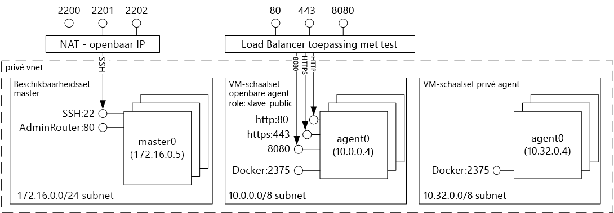
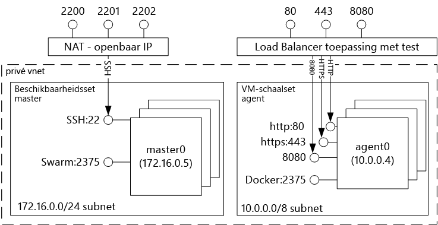
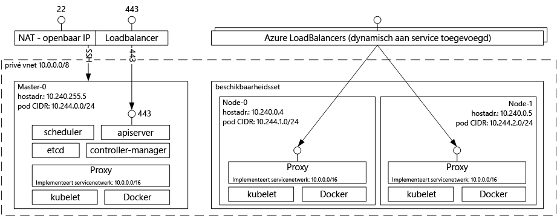

# Inleiding tooDocker container-oplossingen met Azure Container Service die als host fungeertIntroduction tooDocker container hosting solutions with Azure Container Service 
Azure Container Service maakt het eenvoudiger voor u toocreate, configureren en beheren van een cluster van virtuele machines die vooraf geconfigureerde toorun beperkte toepassingen zijn.Azure Container Service makes it simpler for you toocreate, configure, and manage a cluster of virtual machines that are preconfigured toorun containerized applications. De service maakt gebruik van een geoptimaliseerde configuratie van populaire open-source tools voor planning en orchestration.It uses an optimized configuration of popular open-source scheduling and orchestration tools. Dit kunt u toouse uw bestaande vaardigheden of tekenen van een grote en groeiende hoofdtekst van de community-expertise, toodeploy en beheren van toepassingen op basis van een container op Microsoft Azure.This enables you toouse your existing skills, or draw upon a large and growing body of community expertise, toodeploy and manage container-based applications on Microsoft Azure.

Azure Container Service maakt gebruik van Hallo Docker-container indeling tooensure dat uw toepassingscontainers volledig mobiel zijn.Azure Container Service leverages hello Docker container format tooensure that your application containers are fully portable. Het ondersteunt ook uw keuze van Marathon en DC/OS, Docker Swarm of Kubernetes zodat u kunt deze toepassingen toothousands van containers of zelfs tienduizenden te schalen.It also supports your choice of Marathon and DC/OS, Docker Swarm, or Kubernetes so that you can scale these applications toothousands of containers, or even tens of thousands.

Met behulp van Azure Container Service kunt u profiteren van de functies bedrijfsniveau van Azure, zonder dat zij de toepassing draagbaarheid--inclusief draagbaarheid op Hallo orkestratielaag.By using Azure Container Service, you can take advantage of the enterprise-grade features of Azure, while still maintaining application portability--including portability at hello orchestration layers.

## Azure Container Service gebruikenUsing Azure Container Service
Ons doel met Azure Container Service is een container hostomgeving tooprovide met behulp van open-source hulpprogramma's en -technologieën die tegenwoordig populair onder onze klanten.Our goal with Azure Container Service is tooprovide a container hosting environment by using open-source tools and technologies that are popular among our customers today. einde toothis, geven we Hallo API-eindpunten voor uw gekozen orchestrator (DC/OS, Docker Swarm of Kubernetes).toothis end, we expose hello standard API endpoints for your chosen orchestrator (DC/OS, Docker Swarm, or Kubernetes). Met behulp van deze eindpunten, kunt u gebruikmaken van alle software die geschikt is voor toothose eindpunten communiceren.By using these endpoints, you can leverage any software that is capable of talking toothose endpoints. U kunt bijvoorbeeld in geval van Docker Swarm-eindpunt Hallo Hallo toouse hello Docker-opdrachtregelinterface (CLI) selecteren.For example, in hello case of hello Docker Swarm endpoint, you might choose toouse hello Docker command-line interface (CLI). U kunt voor DC/OS Hallo DCOS CLI.For DC/OS, you might choose hello DCOS CLI. Voor Kubernetes zou u `kubectl` kunnen gebruiken.For Kubernetes, you might choose `kubectl`.

## Een Docker-cluster maken met behulp van Azure Container ServiceCreating a Docker cluster by using Azure Container Service
toobegin met behulp van Azure Container Service implementeren van een Azure Container Service-cluster via Hallo-portal (zoeken Hallo Marketplace voor **Azure Container Service**), met behulp van een Azure Resource Manager-sjabloon ([Docker Swarm](https://github.com/Azure/azure-quickstart-templates/tree/master/101-acs-swarm), [DC/OS](https://github.com/Azure/azure-quickstart-templates/tree/master/101-acs-dcos), of [Kubernetes](https://github.com/Azure/azure-quickstart-templates/tree/master/101-acs-kubernetes)), of met Hallo [Azure CLI 2.0](container-service-create-acs-cluster-cli.md).toobegin using Azure Container Service, you deploy an Azure Container Service cluster via hello portal (search hello Marketplace for **Azure Container Service**), by using an Azure Resource Manager template ([Docker Swarm](https://github.com/Azure/azure-quickstart-templates/tree/master/101-acs-swarm), [DC/OS](https://github.com/Azure/azure-quickstart-templates/tree/master/101-acs-dcos), or [Kubernetes](https://github.com/Azure/azure-quickstart-templates/tree/master/101-acs-kubernetes)), or with hello [Azure CLI 2.0](container-service-create-acs-cluster-cli.md). Hallo opgegeven Quick Start-sjablonen kunnen worden gewijzigd tooinclude extra of geavanceerde configuratie van Azure.hello provided quickstart templates can be modified tooinclude additional or advanced Azure configuration. Zie [Een Azure Container Service-cluster implementeren](container-service-deployment.md) voor meer informatie.For more information, see [Deploy an Azure Container Service cluster](container-service-deployment.md).

## Een toepassing implementerenDeploying an application
Voor orchestration met Azure Container Service kunt u kiezen uit Docker Swarm, DC/OS of Kubernetes.Azure Container Service provides a choice of Docker Swarm, DC/OS, or Kubernetes for orchestration. De implementatie van uw toepassing hangt af van de orchestrator die u kiest.How you deploy your application depends on your choice of orchestrator.

### Met DC/OSUsing DC/OS
DC/OS is een gedistribueerde besturingssysteem op basis van Hallo Apache Mesos gedistribueerde systemen kernel.DC/OS is a distributed operating system based on hello Apache Mesos distributed systems kernel. Apache Mesos is ondergebracht op Hallo Apache Software Foundation en vindt u enkele Hallo [grootste namen in IT](http://mesos.apache.org/documentation/latest/powered-by-mesos/) als gebruikers en medewerkers.Apache Mesos is housed at hello Apache Software Foundation and lists some of hello [biggest names in IT](http://mesos.apache.org/documentation/latest/powered-by-mesos/) as users and contributors.

DC/OS en Apache Mesos bieden een indrukwekkende functieset:DC/OS and Apache Mesos include an impressive feature set:

* In de praktijk beproefde schaalbaarheidProven scalability
* Fouttolerante gerepliceerde master en slaves op basis van Apache ZooKeeperFault-tolerant replicated master and slaves using Apache ZooKeeper
* Ondersteuning voor containers met Docker-indelingSupport for Docker-formatted containers
* Systeemeigen isolatie tussen taken met Linux-containersNative isolation between tasks with Linux containers
* Multiresource planning (geheugen, CPU, schijf en poorten)Multiresource scheduling (memory, CPU, disk, and ports)
* Java, Python en C++ API's voor het ontwikkelen van nieuwe parallelle toepassingenJava, Python, and C++ APIs for developing new parallel applications
* Een web-UI voor weergave van de clusterstatusA web UI for viewing cluster state

DC/OS uitgevoerd op Azure Container Service bevat standaard Hallo Marathon orchestration platform voor het plannen van workloads.By default, DC/OS running on Azure Container Service includes hello Marathon orchestration platform for scheduling workloads. Inbegrepen bij Hallo DC/OS-implementatie van ACS is echter Hallo Mesosphere Universe van services die tooyour service kunnen worden toegevoegd.However, included with hello DC/OS deployment of ACS is hello Mesosphere Universe of services that can be added tooyour service. Services in Hallo Universe bevatten Spark, Hadoop, Cassandra en nog veel meer.Services in hello Universe include Spark, Hadoop, Cassandra, and much more.

#### Met MarathonUsing Marathon
Marathon is een cluster-brede init en controlesysteem voor services in cgroups-- of, in geval van een Azure Container Service Docker ingedeelde containers Hallo.Marathon is a cluster-wide init and control system for services in cgroups--or, in hello case of Azure Container Service, Docker-formatted containers. Marathon biedt een web-UI van waaruit u uw toepassingen kunt implementeren.Marathon provides a web UI from which you can deploy your applications. U hebt hiertoe toegang via een URL die er ongeveer als volgt uitziet: `http://DNS_PREFIX.REGION.cloudapp.azure.com`. DNS\_VOORVOEGSEL en REGIO worden gedefinieerd tijdens de implementatie.You can access this at a URL that looks something like `http://DNS_PREFIX.REGION.cloudapp.azure.com` where DNS\_PREFIX and REGION are both defined at deployment time. Indien gewenst, kunt u ook uw eigen DNS-naam opgeven.Of course, you can also provide your own DNS name. Zie voor meer informatie over het uitvoeren van een container met Hallo webgebruikersinterface van Marathon [DC/OS-containerbeheer via Hallo webgebruikersinterface van Marathon](container-service-mesos-marathon-ui.md).For more information on running a container using hello Marathon web UI, see [DC/OS container management through hello Marathon web UI](container-service-mesos-marathon-ui.md).

U kunt ook Hallo REST-API's gebruiken voor communicatie met Marathon.You can also use hello REST APIs for communicating with Marathon. Er zijn een aantal clientbibliotheken beschikbaar voor elke tool.There are a number of client libraries that are available for each tool. Ze hebben betrekking op diverse talen-- en natuurlijk kunt u Hallo HTTP-protocol in een andere taal.They cover a variety of languages--and, of course, you can use hello HTTP protocol in any language. Daarnaast bieden veel populaire DevOps-tools ondersteuning voor Marathon.In addition, many popular DevOps tools provide support for Marathon. Zo beschikt u over maximale flexibiliteit voor uw bedrijfsteam wanneer u met een Azure Container Service-cluster werkt.This provides maximum flexibility for your operations team when you are working with an Azure Container Service cluster. Zie voor meer informatie over het uitvoeren van een container via Marathon REST API Hallo [DC/OS-containerbeheer via Marathon REST API Hallo](container-service-mesos-marathon-rest.md).For more information on running a container by using hello Marathon REST API, see [DC/OS container management through hello Marathon REST API](container-service-mesos-marathon-rest.md).

### Met Docker SwarmUsing Docker Swarm
Docker Swarm biedt systeemeigen clustering voor Docker.Docker Swarm provides native clustering for Docker. Omdat de Docker Swarm fungeert Hallo standard Docker API, een hulpmiddel dat al met een daemon Docker communiceert Swarm tootransparently scale toomultiple hosts op Azure Container Service kunt gebruiken.Because Docker Swarm serves hello standard Docker API, any tool that already communicates with a Docker daemon can use Swarm tootransparently scale toomultiple hosts on Azure Container Service.

[!INCLUDE [container-service-swarm-mode-note](../../../includes/container-service-swarm-mode-note.md)]

Ondersteunde hulpprogramma's voor het beheer van containers in een Swarm-cluster bevatten, maar zijn niet beperkt tot Hallo volgende:Supported tools for managing containers on a Swarm cluster include, but are not limited to, hello following:

* DokkuDokku
* Docker CLI en Docker ComposeDocker CLI and Docker Compose
* KraneKrane
* JenkinsJenkins

### Kubernetes gebruikenUsing Kubernetes
Kubernetes is een populaire open-source orchestrator van productieklasse voor containers.Kubernetes is a popular open-source, production-grade container orchestrator tool. Kubernetes automatiseert het implementeren, schalen en beheren van toepassingen in containers.Kubernetes automates deployment, scaling, and management of containerized applications. Omdat dit een open source is en wordt aangedreven door Hallo open source-community, naadloos op Azure Container Service wordt uitgevoerd en kan worden gebruikt toodeploy containers op grote schaal op Azure Container Service.Because it is an open-source solution and is driven by hello open-source community, it runs seamlessly on Azure Container Service and can be used toodeploy containers at scale on Azure Container Service.

De applicatie bevat een uitgebreide set functies, zoals:It has a rich set of features including:
* Horizontaal schalenHorizontal scaling
* Servicedetectie en taakverdelingService discovery and load balancing
* Geheimen en configuratiebeheerSecrets and configuration management
* Op API gebaseerde geautomatiseerde implementaties en terugdraaiactiesAPI-based automated rollouts and rollbacks
* Automatisch herstelSelf-healing

## Video'sVideos
Aan de slag met Azure Container Service (101):Getting started with Azure Container Service (101):  

> [!VIDEO https://channel9.msdn.com/Shows/Azure-Friday/Azure-Container-Service-101/player]
>
>

Gebouw toepassingen gebruik hello Azure Container Service (Build 2016)Building Applications Using hello Azure Container Service (Build 2016)

> [!VIDEO https://channel9.msdn.com/Events/Build/2016/B822/player]
>
>

## Volgende stappenNext steps

Een container service-cluster met behulp van Hallo implementeren [portal](container-service-deployment.md) of [Azure CLI 2.0](container-service-create-acs-cluster-cli.md).Deploy a container service cluster using hello [portal](container-service-deployment.md) or [Azure CLI 2.0](container-service-create-acs-cluster-cli.md).
