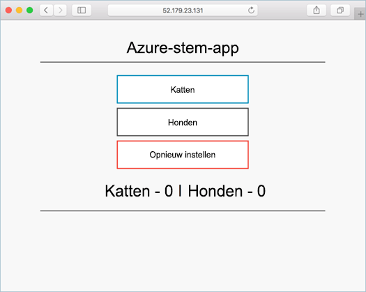

# <a name="deploy-kubernetes-cluster-for-linux-containers"></a><span data-ttu-id="7d0a6-103">Kubernetes-cluster voor Linux-containers implementeren</span><span class="sxs-lookup"><span data-stu-id="7d0a6-103">Deploy Kubernetes cluster for Linux containers</span></span>

<span data-ttu-id="7d0a6-104">Een cluster Kubernetes wordt geïmplementeerd met behulp van hello Azure CLI in deze snel starten.</span><span class="sxs-lookup"><span data-stu-id="7d0a6-104">In this quick start, a Kubernetes cluster is deployed using hello Azure CLI.</span></span> <span data-ttu-id="7d0a6-105">Een container voor meerdere-toepassing die bestaan uit een webfront-end en een Redis-exemplaar wordt vervolgens geïmplementeerd en uitgevoerd op Hallo-cluster.</span><span class="sxs-lookup"><span data-stu-id="7d0a6-105">A multi-container application consisting of web front end and a Redis instance is then deployed and run on hello cluster.</span></span> <span data-ttu-id="7d0a6-106">Zodra de voltooid, Hallo-toepassing is toegankelijk via internet Hallo.</span><span class="sxs-lookup"><span data-stu-id="7d0a6-106">Once completed, hello application is accessible over hello internet.</span></span> 

<span data-ttu-id="7d0a6-107">Hallo-voorbeeldtoepassing die is gebruikt in dit document is geschreven in Python.</span><span class="sxs-lookup"><span data-stu-id="7d0a6-107">hello example application used in this document is written in Python.</span></span> <span data-ttu-id="7d0a6-108">Hallo-concepten en hier beschreven stappen kunnen worden gebruikt toodeploy elke container installatiekopie in een cluster met Kubernetes.</span><span class="sxs-lookup"><span data-stu-id="7d0a6-108">hello concepts and steps detailed here can be used toodeploy any container image into a Kubernetes cluster.</span></span> <span data-ttu-id="7d0a6-109">Hallo code, Dockerfile en vooraf gemaakte Kubernetes manifestbestanden gerelateerde toothis project zijn beschikbaar op [GitHub](https://github.com/Azure-Samples/azure-voting-app-redis.git).</span><span class="sxs-lookup"><span data-stu-id="7d0a6-109">hello code, Dockerfile, and pre-created Kubernetes manifest files related toothis project are available on [GitHub](https://github.com/Azure-Samples/azure-voting-app-redis.git).</span></span>



<span data-ttu-id="7d0a6-111">Deze snel starten, wordt ervan uitgegaan dat een basiskennis van Kubernetes concepten, Zie voor gedetailleerde informatie over Kubernetes hello [Kubernetes documentatie]( https://kubernetes.io/docs/home/).</span><span class="sxs-lookup"><span data-stu-id="7d0a6-111">This quick start assumes a basic understanding of Kubernetes concepts, for detailed information on Kubernetes see hello [Kubernetes documentation]( https://kubernetes.io/docs/home/).</span></span>

<span data-ttu-id="7d0a6-112">Als u nog geen abonnement op Azure hebt, maak dan een [gratis account](https://azure.microsoft.com/free/?WT.mc_id=A261C142F) aan voordat u begint.</span><span class="sxs-lookup"><span data-stu-id="7d0a6-112">If you don't have an Azure subscription, create a [free account](https://azure.microsoft.com/free/?WT.mc_id=A261C142F) before you begin.</span></span>

[!INCLUDE [cloud-shell-try-it.md](../../../includes/cloud-shell-try-it.md)]

<span data-ttu-id="7d0a6-113">Als u tooinstall kiest en Hallo CLI lokaal gebruiken, is deze snelstartgids vereist dat u de versie van de Azure CLI Hallo 2.0.4 worden uitgevoerd of hoger.</span><span class="sxs-lookup"><span data-stu-id="7d0a6-113">If you choose tooinstall and use hello CLI locally, this quickstart requires that you are running hello Azure CLI version 2.0.4 or later.</span></span> <span data-ttu-id="7d0a6-114">Voer `az --version` toofind Hallo versie.</span><span class="sxs-lookup"><span data-stu-id="7d0a6-114">Run `az --version` toofind hello version.</span></span> <span data-ttu-id="7d0a6-115">Als u tooinstall of upgrade nodig hebt, raadpleegt u [2.0 voor Azure CLI installeren]( /cli/azure/install-azure-cli).</span><span class="sxs-lookup"><span data-stu-id="7d0a6-115">If you need tooinstall or upgrade, see [Install Azure CLI 2.0]( /cli/azure/install-azure-cli).</span></span> 

## <a name="create-a-resource-group"></a><span data-ttu-id="7d0a6-116">Een resourcegroep maken</span><span class="sxs-lookup"><span data-stu-id="7d0a6-116">Create a resource group</span></span>

<span data-ttu-id="7d0a6-117">Een resourcegroep maken met de Hallo [az groep maken](/cli/azure/group#create) opdracht.</span><span class="sxs-lookup"><span data-stu-id="7d0a6-117">Create a resource group with hello [az group create](/cli/azure/group#create) command.</span></span> <span data-ttu-id="7d0a6-118">Een Azure-resourcegroep is een logische groep waarin Azure-resources worden geïmplementeerd en beheerd.</span><span class="sxs-lookup"><span data-stu-id="7d0a6-118">An Azure resource group is a logical group in which Azure resources are deployed and managed.</span></span> 

<span data-ttu-id="7d0a6-119">Hallo volgende voorbeeld maakt u een resourcegroep met de naam *myResourceGroup* in Hallo *westeurope* locatie.</span><span class="sxs-lookup"><span data-stu-id="7d0a6-119">hello following example creates a resource group named *myResourceGroup* in hello *westeurope* location.</span></span>

```azurecli-interactive 
az group create --name myResourceGroup --location westeurope
```

<span data-ttu-id="7d0a6-120">Uitvoer:</span><span class="sxs-lookup"><span data-stu-id="7d0a6-120">Output:</span></span>

```json
{
  "id": "/subscriptions/00000000-0000-0000-0000-000000000000/resourceGroups/myResourceGroup",
  "location": "westeurope",
  "managedBy": null,
  "name": "myResourceGroup",
  "properties": {
    "provisioningState": "Succeeded"
  },
  "tags": null
}
```

## <a name="create-kubernetes-cluster"></a><span data-ttu-id="7d0a6-121">Een Kubernetes-cluster maken</span><span class="sxs-lookup"><span data-stu-id="7d0a6-121">Create Kubernetes cluster</span></span>

<span data-ttu-id="7d0a6-122">Een cluster Kubernetes maken in Azure Container Service met Hallo [az acs maken](/cli/azure/acs#create) opdracht.</span><span class="sxs-lookup"><span data-stu-id="7d0a6-122">Create a Kubernetes cluster in Azure Container Service with hello [az acs create](/cli/azure/acs#create) command.</span></span> <span data-ttu-id="7d0a6-123">Hallo volgende voorbeeld wordt een cluster met de naam *myK8sCluster* hoofdsleutel met een Linux-knooppunt en drie knooppunten voor Linux-agent.</span><span class="sxs-lookup"><span data-stu-id="7d0a6-123">hello following example creates a cluster named *myK8sCluster* with one Linux master node and three Linux agent nodes.</span></span>

```azurecli-interactive 
az acs create --orchestrator-type kubernetes --resource-group myResourceGroup --name myK8sCluster --generate-ssh-keys 
```

<span data-ttu-id="7d0a6-124">Na enkele minuten Hallo-opdracht is voltooid en retourneert informatie over de json-indeling over Hallo-cluster.</span><span class="sxs-lookup"><span data-stu-id="7d0a6-124">After several minutes, hello command completes and returns json formatted information about hello cluster.</span></span> 

## <a name="connect-toohello-cluster"></a><span data-ttu-id="7d0a6-125">Verbinding maken met cluster toohello</span><span class="sxs-lookup"><span data-stu-id="7d0a6-125">Connect toohello cluster</span></span>

<span data-ttu-id="7d0a6-126">Gebruik een cluster Kubernetes toomanage [kubectl](https://kubernetes.io/docs/user-guide/kubectl/), Hallo Kubernetes opdrachtregelprogramma client.</span><span class="sxs-lookup"><span data-stu-id="7d0a6-126">toomanage a Kubernetes cluster, use [kubectl](https://kubernetes.io/docs/user-guide/kubectl/), hello Kubernetes command-line client.</span></span> 

<span data-ttu-id="7d0a6-127">Als u Azure CloudShell gebruikt, is kubectl al geïnstalleerd.</span><span class="sxs-lookup"><span data-stu-id="7d0a6-127">If you're using Azure CloudShell, kubectl is already installed.</span></span> <span data-ttu-id="7d0a6-128">Als u wilt dat tooinstall deze lokaal, kunt u Hallo [az acs kubernetes install-cli](/cli/azure/acs/kubernetes#install-cli) opdracht.</span><span class="sxs-lookup"><span data-stu-id="7d0a6-128">If you want tooinstall it locally, you can use hello [az acs kubernetes install-cli](/cli/azure/acs/kubernetes#install-cli) command.</span></span>

<span data-ttu-id="7d0a6-129">tooconfigure kubectl tooconnect tooyour Kubernetes cluster uitvoeren Hallo [az acs kubernetes get-referenties](/cli/azure/acs/kubernetes#get-credentials) opdracht.</span><span class="sxs-lookup"><span data-stu-id="7d0a6-129">tooconfigure kubectl tooconnect tooyour Kubernetes cluster, run hello [az acs kubernetes get-credentials](/cli/azure/acs/kubernetes#get-credentials) command.</span></span> <span data-ttu-id="7d0a6-130">Deze stap referenties downloadt en configureert u Hallo Kubernetes CLI toouse ze.</span><span class="sxs-lookup"><span data-stu-id="7d0a6-130">This step downloads credentials and configures hello Kubernetes CLI toouse them.</span></span>

```azurecli-interactive 
az acs kubernetes get-credentials --resource-group=myResourceGroup --name=myK8sCluster
```

<span data-ttu-id="7d0a6-131">tooverify hello verbinding tooyour cluster, gebruik Hallo [kubectl ophalen](https://kubernetes.io/docs/user-guide/kubectl/v1.6/#get) opdracht tooreturn een lijst met clusterknooppunten Hallo.</span><span class="sxs-lookup"><span data-stu-id="7d0a6-131">tooverify hello connection tooyour cluster, use hello [kubectl get](https://kubernetes.io/docs/user-guide/kubectl/v1.6/#get) command tooreturn a list of hello cluster nodes.</span></span>

```azurecli-interactive
kubectl get nodes
```

<span data-ttu-id="7d0a6-132">Uitvoer:</span><span class="sxs-lookup"><span data-stu-id="7d0a6-132">Output:</span></span>

```bash
NAME                    STATUS                     AGE       VERSION
k8s-agent-14ad53a1-0    Ready                      10m       v1.6.6
k8s-agent-14ad53a1-1    Ready                      10m       v1.6.6
k8s-agent-14ad53a1-2    Ready                      10m       v1.6.6
k8s-master-14ad53a1-0   Ready,SchedulingDisabled   10m       v1.6.6
```

## <a name="run-hello-application"></a><span data-ttu-id="7d0a6-133">Hallo-toepassing uitvoeren</span><span class="sxs-lookup"><span data-stu-id="7d0a6-133">Run hello application</span></span>

<span data-ttu-id="7d0a6-134">Een manifestbestand Kubernetes definieert een gewenste status voor Hallo-cluster, inclusief wat de installatiekopieën van de container moeten worden uitgevoerd.</span><span class="sxs-lookup"><span data-stu-id="7d0a6-134">A Kubernetes manifest file defines a desired state for hello cluster, including what container images should be running.</span></span> <span data-ttu-id="7d0a6-135">In dit voorbeeld is een manifest gebruikte toocreate alle objecten die nodig zijn toorun hello Azure stem toepassing.</span><span class="sxs-lookup"><span data-stu-id="7d0a6-135">For this example, a manifest is used toocreate all objects needed toorun hello Azure Vote application.</span></span> 

<span data-ttu-id="7d0a6-136">Maak een bestand met de naam `azure-vote.yml` en kopiëren naar het volgende YAML Hallo.</span><span class="sxs-lookup"><span data-stu-id="7d0a6-136">Create a file named `azure-vote.yml` and copy into it hello following YAML.</span></span> <span data-ttu-id="7d0a6-137">Als u werkt in Azure Cloud Shell, kan dit bestand worden gemaakt met behulp van vi of Nano, zoals bij een virtueel of fysiek systeem.</span><span class="sxs-lookup"><span data-stu-id="7d0a6-137">If you are working in Azure Cloud Shell, this file can be created using vi or Nano as if working on a virtual or physical system.</span></span>

```yaml
apiVersion: apps/v1beta1
kind: Deployment
metadata:
  name: azure-vote-back
spec:
  replicas: 1
  template:
    metadata:
      labels:
        app: azure-vote-back
    spec:
      containers:
      - name: azure-vote-back
        image: redis
        ports:
        - containerPort: 6379
          name: redis
---
apiVersion: v1
kind: Service
metadata:
  name: azure-vote-back
spec:
  ports:
  - port: 6379
  selector:
    app: azure-vote-back
---
apiVersion: apps/v1beta1
kind: Deployment
metadata:
  name: azure-vote-front
spec:
  replicas: 1
  template:
    metadata:
      labels:
        app: azure-vote-front
    spec:
      containers:
      - name: azure-vote-front
        image: microsoft/azure-vote-front:redis-v1
        ports:
        - containerPort: 80
        env:
        - name: REDIS
          value: "azure-vote-back"
---
apiVersion: v1
kind: Service
metadata:
  name: azure-vote-front
spec:
  type: LoadBalancer
  ports:
  - port: 80
  selector:
    app: azure-vote-front
```

<span data-ttu-id="7d0a6-138">Gebruik Hallo [kubectl maken](https://kubernetes.io/docs/user-guide/kubectl/v1.6/#create) opdracht toorun Hallo-toepassing.</span><span class="sxs-lookup"><span data-stu-id="7d0a6-138">Use hello [kubectl create](https://kubernetes.io/docs/user-guide/kubectl/v1.6/#create) command toorun hello application.</span></span>

```azurecli-interactive
kubectl create -f azure-vote.yml
```

<span data-ttu-id="7d0a6-139">Uitvoer:</span><span class="sxs-lookup"><span data-stu-id="7d0a6-139">Output:</span></span>

```bash
deployment "azure-vote-back" created
service "azure-vote-back" created
deployment "azure-vote-front" created
service "azure-vote-front" created
```

## <a name="test-hello-application"></a><span data-ttu-id="7d0a6-140">Hallo toepassing testen</span><span class="sxs-lookup"><span data-stu-id="7d0a6-140">Test hello application</span></span>

<span data-ttu-id="7d0a6-141">Als de toepassing hello wordt uitgevoerd, een [Kubernetes service](https://kubernetes.io/docs/concepts/services-networking/service/) wordt gemaakt dat gegarandeerd toepassing front-end toohello Hallo internet.</span><span class="sxs-lookup"><span data-stu-id="7d0a6-141">As hello application is run, a [Kubernetes service](https://kubernetes.io/docs/concepts/services-networking/service/) is created that exposes hello application front end toohello internet.</span></span> <span data-ttu-id="7d0a6-142">Dit kan enkele minuten toocomplete duren.</span><span class="sxs-lookup"><span data-stu-id="7d0a6-142">This process can take a few minutes toocomplete.</span></span> 

<span data-ttu-id="7d0a6-143">toomonitor gemaakt, maar gebruik Hallo [kubectl ophalen service](https://kubernetes.io/docs/user-guide/kubectl/v1.6/#get) opdracht Hello `--watch` argument.</span><span class="sxs-lookup"><span data-stu-id="7d0a6-143">toomonitor progress, use hello [kubectl get service](https://kubernetes.io/docs/user-guide/kubectl/v1.6/#get) command with hello `--watch` argument.</span></span>

```azurecli-interactive
kubectl get service azure-vote-front --watch
```

<span data-ttu-id="7d0a6-144">In eerste instantie Hallo **extern IP-** voor Hallo *azure stem voorgrond* service wordt weergegeven als *in behandeling*.</span><span class="sxs-lookup"><span data-stu-id="7d0a6-144">Initially hello **EXTERNAL-IP** for hello *azure-vote-front* service appears as *pending*.</span></span> <span data-ttu-id="7d0a6-145">Nadat u Hallo extern IP-adres is gewijzigd van *in behandeling* tooan *IP-adres*, gebruik `CTRL-C` toostop hello kubectl controle proces.</span><span class="sxs-lookup"><span data-stu-id="7d0a6-145">Once hello EXTERNAL-IP address has changed from *pending* tooan *IP address*, use `CTRL-C` toostop hello kubectl watch process.</span></span> 
  
```bash
azure-vote-front   10.0.34.242   <pending>     80:30676/TCP   7s
azure-vote-front   10.0.34.242   52.179.23.131   80:30676/TCP   2m
```

<span data-ttu-id="7d0a6-146">U kunt nu toohello externe IP-adres toosee hello Azure stem App bladeren.</span><span class="sxs-lookup"><span data-stu-id="7d0a6-146">You can now browse toohello external IP address toosee hello Azure Vote App.</span></span>

  

## <a name="delete-cluster"></a><span data-ttu-id="7d0a6-148">Cluster verwijderen</span><span class="sxs-lookup"><span data-stu-id="7d0a6-148">Delete cluster</span></span>
<span data-ttu-id="7d0a6-149">Wanneer Hallo cluster niet langer nodig is, kunt u Hallo [az groep verwijderen](/cli/azure/group#delete) opdracht tooremove Hallo-resourcegroep, containerservice en alle gerelateerde resources.</span><span class="sxs-lookup"><span data-stu-id="7d0a6-149">When hello cluster is no longer needed, you can use hello [az group delete](/cli/azure/group#delete) command tooremove hello resource group, container service, and all related resources.</span></span>

```azurecli-interactive 
az group delete --name myResourceGroup --yes --no-wait
```

## <a name="get-hello-code"></a><span data-ttu-id="7d0a6-150">Hallo code ophalen</span><span class="sxs-lookup"><span data-stu-id="7d0a6-150">Get hello code</span></span>

<span data-ttu-id="7d0a6-151">In deze snel starten is vooraf gemaakte container installatiekopieën gebruikte toocreate een Kubernetes-implementatie.</span><span class="sxs-lookup"><span data-stu-id="7d0a6-151">In this quick start, pre-created container images have been used toocreate a Kubernetes deployment.</span></span> <span data-ttu-id="7d0a6-152">Hallo gerelateerd toepassingscode, Dockerfile, en het manifestbestand Kubernetes zijn beschikbaar op GitHub.</span><span class="sxs-lookup"><span data-stu-id="7d0a6-152">hello related application code, Dockerfile, and Kubernetes manifest file are available on GitHub.</span></span>

[<span data-ttu-id="7d0a6-153">https://github.com/Azure-Samples/azure-voting-app-redis</span><span class="sxs-lookup"><span data-stu-id="7d0a6-153">https://github.com/Azure-Samples/azure-voting-app-redis</span></span>](https://github.com/Azure-Samples/azure-voting-app-redis.git)

## <a name="next-steps"></a><span data-ttu-id="7d0a6-154">Volgende stappen</span><span class="sxs-lookup"><span data-stu-id="7d0a6-154">Next steps</span></span>

<span data-ttu-id="7d0a6-155">In deze snel starten een cluster Kubernetes geïmplementeerd en een toepassing met meerdere container tooit geïmplementeerd.</span><span class="sxs-lookup"><span data-stu-id="7d0a6-155">In this quick start, you deployed a Kubernetes cluster and deployed a multi-container application tooit.</span></span> 

<span data-ttu-id="7d0a6-156">toolearn meer informatie over Azure Container Service en doorloop compleet codevoorbeeld met toodeployment blijven toohello Kubernetes cluster zelfstudie.</span><span class="sxs-lookup"><span data-stu-id="7d0a6-156">toolearn more about Azure Container Service, and walk through a complete code toodeployment example, continue toohello Kubernetes cluster tutorial.</span></span>

> [!div class="nextstepaction"]
> [<span data-ttu-id="7d0a6-157">Een ACS Kubernetes-cluster beheren</span><span class="sxs-lookup"><span data-stu-id="7d0a6-157">Manage an ACS Kubernetes cluster</span></span>](./container-service-tutorial-kubernetes-prepare-app.md)
