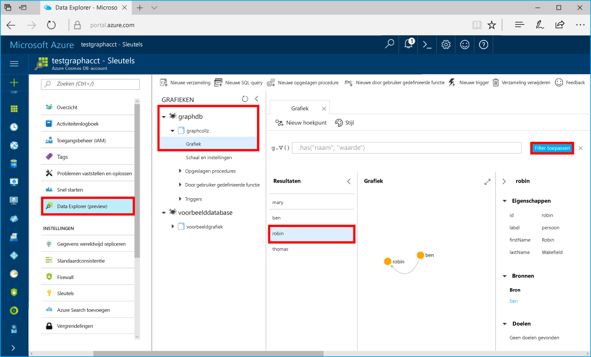

# <a name="azure-cosmos-db-build-a-net-application-using-hello-graph-api"></a><span data-ttu-id="39bb9-103">Azure Cosmos DB: Een .NET-toepassing hello Graph API met bouwen</span><span class="sxs-lookup"><span data-stu-id="39bb9-103">Azure Cosmos DB: Build a .NET application using hello Graph API</span></span>

<span data-ttu-id="39bb9-104">Azure Cosmos DB is de wereldwijd gedistribueerde multimodel-databaseservice van Microsoft.</span><span class="sxs-lookup"><span data-stu-id="39bb9-104">Azure Cosmos DB is Microsoft’s globally distributed multi-model database service.</span></span> <span data-ttu-id="39bb9-105">U kunt snel maken en query document, de sleutel/waarde en de grafiek databases, die allemaal van Hallo wereldwijde distributie en mogelijkheden van de horizontale schaal Hallo kern van Azure Cosmos DB profiteren.</span><span class="sxs-lookup"><span data-stu-id="39bb9-105">You can quickly create and query document, key/value, and graph databases, all of which benefit from hello global distribution and horizontal scale capabilities at hello core of Azure Cosmos DB.</span></span> 

<span data-ttu-id="39bb9-106">Deze snel starten laat zien hoe toocreate een Cosmos-DB Azure-account, database en het gebruik van de grafiek (container) hello Azure-portal.</span><span class="sxs-lookup"><span data-stu-id="39bb9-106">This quick start demonstrates how toocreate an Azure Cosmos DB account, database, and graph (container) using hello Azure portal.</span></span> <span data-ttu-id="39bb9-107">U vervolgens bouwen en uitvoeren van een console-app die is gebouwd op Hallo [Graph API](graph-sdk-dotnet.md) (preview).</span><span class="sxs-lookup"><span data-stu-id="39bb9-107">You then build and run a console app built on hello [Graph API](graph-sdk-dotnet.md) (preview).</span></span>  

## <a name="prerequisites"></a><span data-ttu-id="39bb9-108">Vereisten</span><span class="sxs-lookup"><span data-stu-id="39bb9-108">Prerequisites</span></span>

<span data-ttu-id="39bb9-109">Als u Visual Studio 2017 geïnstalleerd nog geen hebt, kunt u downloaden en gebruiken van Hallo **gratis** [Visual Studio 2017 Community Edition](https://www.visualstudio.com/downloads/).</span><span class="sxs-lookup"><span data-stu-id="39bb9-109">If you don’t already have Visual Studio 2017 installed, you can download and use hello **free** [Visual Studio 2017 Community Edition](https://www.visualstudio.com/downloads/).</span></span> <span data-ttu-id="39bb9-110">Zorg ervoor dat u inschakelt **ontwikkelen van Azure** tijdens de installatie van Visual Studio Hallo.</span><span class="sxs-lookup"><span data-stu-id="39bb9-110">Make sure that you enable **Azure development** during hello Visual Studio setup.</span></span>

[!INCLUDE [quickstarts-free-trial-note](../../includes/quickstarts-free-trial-note.md)]

## <a name="create-a-database-account"></a><span data-ttu-id="39bb9-111">Een databaseaccount maken</span><span class="sxs-lookup"><span data-stu-id="39bb9-111">Create a database account</span></span>

[!INCLUDE [cosmos-db-create-dbaccount-graph](../../includes/cosmos-db-create-dbaccount-graph.md)]

## <a name="add-a-graph"></a><span data-ttu-id="39bb9-112">Een graaf toevoegen</span><span class="sxs-lookup"><span data-stu-id="39bb9-112">Add a graph</span></span>

[!INCLUDE [cosmos-db-create-graph](../../includes/cosmos-db-create-graph.md)]

## <a name="clone-hello-sample-application"></a><span data-ttu-id="39bb9-113">Hallo-voorbeeldtoepassing klonen</span><span class="sxs-lookup"><span data-stu-id="39bb9-113">Clone hello sample application</span></span>

<span data-ttu-id="39bb9-114">Nu gaan we kloon een Graph-API-app vanuit github Hallo verbindingsreeks instellen en uitvoeren.</span><span class="sxs-lookup"><span data-stu-id="39bb9-114">Now let's clone a Graph API app from github, set hello connection string, and run it.</span></span> <span data-ttu-id="39bb9-115">U ziet hoe eenvoudig het is toowork met gegevens via een programma.</span><span class="sxs-lookup"><span data-stu-id="39bb9-115">You'll see how easy it is toowork with data programmatically.</span></span> 

1. <span data-ttu-id="39bb9-116">Open een git-terminalvenster zoals git bash en en `cd` tooa werkmap.</span><span class="sxs-lookup"><span data-stu-id="39bb9-116">Open a git terminal window, such as git bash, and `cd` tooa working directory.</span></span>  

2. <span data-ttu-id="39bb9-117">Hallo na de opdracht tooclone Hallo voorbeeld opslagplaats worden uitgevoerd.</span><span class="sxs-lookup"><span data-stu-id="39bb9-117">Run hello following command tooclone hello sample repository.</span></span> 

    ```bash
    git clone https://github.com/Azure-Samples/azure-cosmos-db-graph-dotnet-getting-started.git
    ```

3. <span data-ttu-id="39bb9-118">Open Visual Studio en open Hallo oplossingsbestand.</span><span class="sxs-lookup"><span data-stu-id="39bb9-118">Then open Visual Studio and open hello solution file.</span></span> 

## <a name="review-hello-code"></a><span data-ttu-id="39bb9-119">Hallo code bekijken</span><span class="sxs-lookup"><span data-stu-id="39bb9-119">Review hello code</span></span>

<span data-ttu-id="39bb9-120">We maken een kort overzicht van wat in Hallo-app gebeurt er.</span><span class="sxs-lookup"><span data-stu-id="39bb9-120">Let's make a quick review of what's happening in hello app.</span></span> <span data-ttu-id="39bb9-121">Het bestand Program.cs Open Hallo en u vindt dat deze regels code hello Azure Cosmos DB resources maken.</span><span class="sxs-lookup"><span data-stu-id="39bb9-121">Open hello Program.cs file and you'll find that these lines of code create hello Azure Cosmos DB resources.</span></span> 

* <span data-ttu-id="39bb9-122">Hallo DocumentClient is geïnitialiseerd.</span><span class="sxs-lookup"><span data-stu-id="39bb9-122">hello DocumentClient is initialized.</span></span> <span data-ttu-id="39bb9-123">Hallo-Preview toegevoegd we extensie graph API op Hallo Azure DB die Cosmos-client.</span><span class="sxs-lookup"><span data-stu-id="39bb9-123">In hello preview, we added a graph extension API on hello Azure Cosmos DB client.</span></span> <span data-ttu-id="39bb9-124">We werken op een zelfstandige grafiek client ontkoppeld van hello Azure DB die Cosmos-client en -bronnen.</span><span class="sxs-lookup"><span data-stu-id="39bb9-124">We are working on a standalone graph client decoupled from hello Azure Cosmos DB client and resources.</span></span>

    ```csharp
    using (DocumentClient client = new DocumentClient(
        new Uri(endpoint),
        authKey,
        new ConnectionPolicy { ConnectionMode = ConnectionMode.Direct, ConnectionProtocol = Protocol.Tcp }))
    ```

* <span data-ttu-id="39bb9-125">Er wordt een nieuwe database gemaakt.</span><span class="sxs-lookup"><span data-stu-id="39bb9-125">A new database is created.</span></span>

    ```csharp
    Database database = await client.CreateDatabaseIfNotExistsAsync(new Database { Id = "graphdb" });
    ```

* <span data-ttu-id="39bb9-126">Er wordt en nieuwe graaf gemaakt.</span><span class="sxs-lookup"><span data-stu-id="39bb9-126">A new graph is created.</span></span>

    ```csharp
    DocumentCollection graph = await client.CreateDocumentCollectionIfNotExistsAsync(
        UriFactory.CreateDatabaseUri("graphdb"),
        new DocumentCollection { Id = "graph" },
        new RequestOptions { OfferThroughput = 1000 });
    ```
* <span data-ttu-id="39bb9-127">Een reeks Gremlin stappen worden uitgevoerd met Hallo `CreateGremlinQuery` methode.</span><span class="sxs-lookup"><span data-stu-id="39bb9-127">A series of Gremlin steps are executed using hello `CreateGremlinQuery` method.</span></span>

    ```csharp
    // hello CreateGremlinQuery method extensions allow you tooexecute Gremlin queries and iterate
    // results asychronously
    IDocumentQuery<dynamic> query = client.CreateGremlinQuery<dynamic>(graph, "g.V().count()");
    while (query.HasMoreResults)
    {
        foreach (dynamic result in await query.ExecuteNextAsync())
        {
            Console.WriteLine($"\t {JsonConvert.SerializeObject(result)}");
        }
    }

    ```

## <a name="update-your-connection-string"></a><span data-ttu-id="39bb9-128">Uw verbindingsreeks bijwerken</span><span class="sxs-lookup"><span data-stu-id="39bb9-128">Update your connection string</span></span>

<span data-ttu-id="39bb9-129">Nu gaat u terug toohello Azure portal tooget verbindingsreeksgegevens en kopieer dit naar Hallo-app.</span><span class="sxs-lookup"><span data-stu-id="39bb9-129">Now go back toohello Azure portal tooget your connection string information and copy it into hello app.</span></span>

1. <span data-ttu-id="39bb9-130">Open in Visual Studio-2017 Hallo App.config-bestand.</span><span class="sxs-lookup"><span data-stu-id="39bb9-130">In Visual Studio 2017, open hello App.config file.</span></span> 

2. <span data-ttu-id="39bb9-131">Klik in hello Azure-portal in uw Azure DB die Cosmos-account op **sleutels** in Hallo linkernavigatiebalk.</span><span class="sxs-lookup"><span data-stu-id="39bb9-131">In hello Azure portal, in your Azure Cosmos DB account, click **Keys** in hello left navigation.</span></span> 

    

3. <span data-ttu-id="39bb9-133">Kopieer uw **URI** waarde uit de portal hello, waardoor het Hallo Hallo eindpunt sleutelwaarde in App.config. Kunt u de knop kopiëren Hallo zoals weergegeven in Hallo vóór schermafbeelding toocopy Hallo waarde.</span><span class="sxs-lookup"><span data-stu-id="39bb9-133">Copy your **URI** value from hello portal and make it hello value of hello Endpoint key in App.config. You can use hello copy button as shown in hello preceding screenshot toocopy hello value.</span></span>

    `<add key="Endpoint" value="https://FILLME.documents.azure.com:443" />`

4. <span data-ttu-id="39bb9-134">Kopieer uw **primaire sleutel** waarde uit de Hallo-portal en maken het Hallo Hallo AuthKey sleutelwaarde in App.config en sla vervolgens uw wijzigingen.</span><span class="sxs-lookup"><span data-stu-id="39bb9-134">Copy your **PRIMARY KEY** value from hello portal, and make it hello value of hello AuthKey key in App.config, then save your changes.</span></span> 

    `<add key="AuthKey" value="FILLME" />`

<span data-ttu-id="39bb9-135">U hebt nu uw app bijgewerkt met alle Hallo info moet toocommunicate met Azure Cosmos DB.</span><span class="sxs-lookup"><span data-stu-id="39bb9-135">You've now updated your app with all hello info it needs toocommunicate with Azure Cosmos DB.</span></span> 

## <a name="run-hello-console-app"></a><span data-ttu-id="39bb9-136">Hallo-console-app uitvoeren</span><span class="sxs-lookup"><span data-stu-id="39bb9-136">Run hello console app</span></span>

1. <span data-ttu-id="39bb9-137">In Visual Studio met de rechtermuisknop op Hallo **GraphGetStarted** project in **Solution Explorer** en klik vervolgens op **NuGet-pakketten beheren**.</span><span class="sxs-lookup"><span data-stu-id="39bb9-137">In Visual Studio, right-click on hello **GraphGetStarted** project in **Solution Explorer** and then click **Manage NuGet Packages**.</span></span> 

2. <span data-ttu-id="39bb9-138">In Hallo NuGet **Bladeren** in het vak *Microsoft.Azure.Graphs* en controleer Hallo **bevat voorlopige versie** vak.</span><span class="sxs-lookup"><span data-stu-id="39bb9-138">In hello NuGet **Browse** box, type *Microsoft.Azure.Graphs* and check hello **Includes prerelease** box.</span></span> 

3. <span data-ttu-id="39bb9-139">Installeren in Hallo resultaten Hallo **Microsoft.Azure.Graphs** bibliotheek.</span><span class="sxs-lookup"><span data-stu-id="39bb9-139">From hello results, install hello **Microsoft.Azure.Graphs** library.</span></span> <span data-ttu-id="39bb9-140">Hiermee installeert u hello Azure Cosmos DB grafiek uitbreidingspakket-bibliotheek en alle afhankelijkheden.</span><span class="sxs-lookup"><span data-stu-id="39bb9-140">This installs hello Azure Cosmos DB graph extension library package and all dependencies.</span></span>

    <span data-ttu-id="39bb9-141">Als u een bericht krijgt over het controleren van wijzigingen toohello oplossing, klikt u op **OK**.</span><span class="sxs-lookup"><span data-stu-id="39bb9-141">If you get a message about reviewing changes toohello solution, click **OK**.</span></span> <span data-ttu-id="39bb9-142">Als u een bericht ontvangt over het accepteren van de licentie, klikt u op **Accepteren**.</span><span class="sxs-lookup"><span data-stu-id="39bb9-142">If you get a message about license acceptance, click **I accept**.</span></span>

4. <span data-ttu-id="39bb9-143">Klik op CTRL + F5 toorun Hallo-toepassing.</span><span class="sxs-lookup"><span data-stu-id="39bb9-143">Click CTRL + F5 toorun hello application.</span></span>

   <span data-ttu-id="39bb9-144">Hallo-consolevenster geeft Hallo hoekpunten en randen toohello grafiek worden toegevoegd.</span><span class="sxs-lookup"><span data-stu-id="39bb9-144">hello console window displays hello vertexes and edges being added toohello graph.</span></span> <span data-ttu-id="39bb9-145">Wanneer Hallo-script is voltooid, druk op ENTER tweemaal tooclose Hallo consolevenster.</span><span class="sxs-lookup"><span data-stu-id="39bb9-145">When hello script completes, press ENTER twice tooclose hello console window.</span></span> 

## <a name="browse-using-hello-data-explorer"></a><span data-ttu-id="39bb9-146">Bladeren met behulp van Hallo Data Explorer</span><span class="sxs-lookup"><span data-stu-id="39bb9-146">Browse using hello Data Explorer</span></span>

<span data-ttu-id="39bb9-147">U kunt nu gaat u terug tooData Explorer in hello Azure-portal en bladeren en de nieuwe grafiekgegevens zoeken.</span><span class="sxs-lookup"><span data-stu-id="39bb9-147">You can now go back tooData Explorer in hello Azure portal and browse and query your new graph data.</span></span>

1. <span data-ttu-id="39bb9-148">In Data Explorer Hallo nieuwe database in deelvenster wordt weergegeven Hallo grafieken.</span><span class="sxs-lookup"><span data-stu-id="39bb9-148">In Data Explorer, hello new database appears in hello Graphs pane.</span></span> <span data-ttu-id="39bb9-149">Vouw **graphdb**, **graphcollz** uit en klik vervolgens op **Grafiek**.</span><span class="sxs-lookup"><span data-stu-id="39bb9-149">Expand **graphdb**, **graphcollz**, and then click **Graph**.</span></span>

2. <span data-ttu-id="39bb9-150">Klik op Hallo **Filter toepassen** knop toouse Hallo standaard query tooview alle Hallo verticies in Hallo-grafiek.</span><span class="sxs-lookup"><span data-stu-id="39bb9-150">Click hello **Apply Filter** button toouse hello default query tooview all hello verticies in hello graph.</span></span> <span data-ttu-id="39bb9-151">Hallo-gegevens die zijn gegenereerd door Hallo voorbeeld-app wordt weergegeven in Hallo grafieken deelvenster.</span><span class="sxs-lookup"><span data-stu-id="39bb9-151">hello data generated by hello sample app is displayed in hello Graphs pane.</span></span>

    <span data-ttu-id="39bb9-152">U kunt in-en uitzoomen Hallo grafiek, kunt u Hallo grafiek ruimte voor de weergave uitvouwen, extra verticies toevoegen en verplaatsen verticies op Hallo weergeven voor aanvallen.</span><span class="sxs-lookup"><span data-stu-id="39bb9-152">You can zoom in and out of hello graph, you can expand hello graph display space, add additional verticies, and move verticies on hello display surface.</span></span>

    

## <a name="review-slas-in-hello-azure-portal"></a><span data-ttu-id="39bb9-154">Sla's bekijken in hello Azure-portal</span><span class="sxs-lookup"><span data-stu-id="39bb9-154">Review SLAs in hello Azure portal</span></span>

[!INCLUDE [cosmosdb-tutorial-review-slas](../../includes/cosmos-db-tutorial-review-slas.md)]

## <a name="clean-up-resources"></a><span data-ttu-id="39bb9-155">Resources opschonen</span><span class="sxs-lookup"><span data-stu-id="39bb9-155">Clean up resources</span></span>

<span data-ttu-id="39bb9-156">Als u deze app niet toocontinue toouse gaat, verwijdert u alle resources die zijn gemaakt door deze snelstartgids in hello Azure-portal met Hallo stappen te volgen:</span><span class="sxs-lookup"><span data-stu-id="39bb9-156">If you're not going toocontinue toouse this app, delete all resources created by this quickstart in hello Azure portal with hello following steps:</span></span> 

1. <span data-ttu-id="39bb9-157">Hallo links menu in hello Azure-portal en klik op **resourcegroepen** en klik vervolgens op Hallo-naam van het Hallo-resource die u hebt gemaakt.</span><span class="sxs-lookup"><span data-stu-id="39bb9-157">From hello left-hand menu in hello Azure portal, click **Resource groups** and then click hello name of hello resource you created.</span></span> 
2. <span data-ttu-id="39bb9-158">Klik op de pagina van de groep resource **verwijderen**, typ de naam Hallo van Hallo resource toodelete in Hallo tekstvak en klik op **verwijderen**.</span><span class="sxs-lookup"><span data-stu-id="39bb9-158">On your resource group page, click **Delete**, type hello name of hello resource toodelete in hello text box, and then click **Delete**.</span></span>

## <a name="next-steps"></a><span data-ttu-id="39bb9-159">Volgende stappen</span><span class="sxs-lookup"><span data-stu-id="39bb9-159">Next steps</span></span>

<span data-ttu-id="39bb9-160">In deze snelstartgids hebt u geleerd hoe toocreate een Cosmos-DB Azure-account maken van een grafiek met Hallo Data Explorer en een app uitvoeren.</span><span class="sxs-lookup"><span data-stu-id="39bb9-160">In this quickstart, you've learned how toocreate an Azure Cosmos DB account, create a graph using hello Data Explorer, and run an app.</span></span> <span data-ttu-id="39bb9-161">U kunt nu complexere query's maken en met Gremlin krachtige logica implementeren om door een graaf te gaan.</span><span class="sxs-lookup"><span data-stu-id="39bb9-161">You can now build more complex queries and implement powerful graph traversal logic using Gremlin.</span></span> 

> [!div class="nextstepaction"]
> [<span data-ttu-id="39bb9-162">Query’s uitvoeren met Gremlin</span><span class="sxs-lookup"><span data-stu-id="39bb9-162">Query using Gremlin</span></span>](tutorial-query-graph.md)

