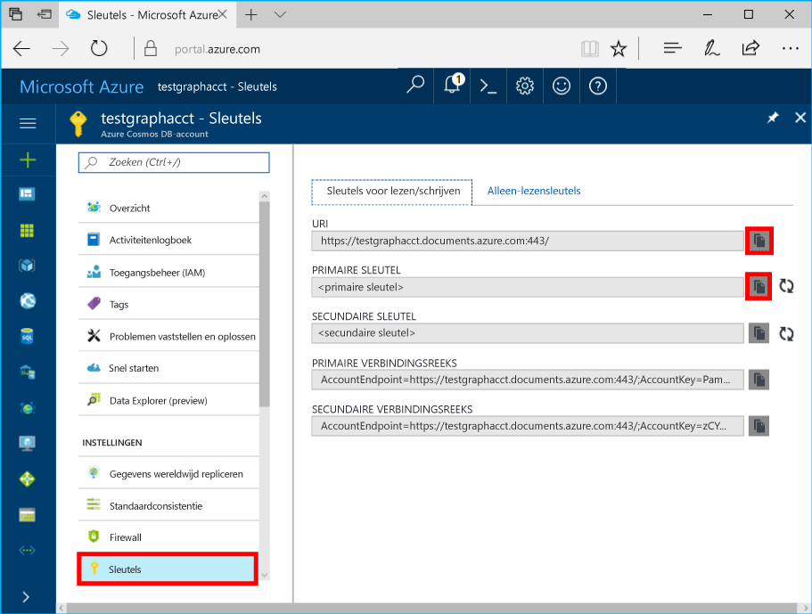

# <a name="azure-cosmos-db-create-query-and-traverse-a-graph-in-hello-gremlin-console"></a>Azure Cosmos DB: Maken, query, en bladeren door een grafiek in Hallo Gremlin-console

Azure Cosmos DB is de wereldwijd gedistribueerde multimodel-databaseservice van Microsoft. U kunt snel maken en query document, de sleutel/waarde en de grafiek databases, die allemaal van Hallo wereldwijde distributie en mogelijkheden van de horizontale schaal Hallo kern van Azure Cosmos DB profiteren. 

Deze snel starten laat zien hoe toocreate een Cosmos-DB Azure-account, database en het gebruik van de grafiek (container) hello Azure-portal en vervolgens gebruik Hallo [Gremlin Console](https://tinkerpop.apache.org/docs/current/reference/#gremlin-console) van [Apache TinkerPop](http://tinkerpop.apache.org) toowork met Grafiekgegevens API (preview). In deze zelfstudie maakt u maken en query hoekpunten en randen, bijwerken van een eigenschap hoekpunt hoekpunten opvragen, passeren Hallo grafiek en een hoekpunt verwijderen.


Hallo Gremlin console is Groovy/Java gebaseerd en op Linux, Mac en Windows wordt uitgevoerd. U kunt dit downloaden van Hallo [Apache TinkerPop site](https://www.apache.org/dyn/closer.lua/tinkerpop/3.2.5/apache-tinkerpop-gremlin-console-3.2.5-bin.zip).

## <a name="prerequisites"></a>Vereisten

In dat geval moet u een Azure-abonnement toocreate een account voor Azure Cosmos DB toohave in voor deze snelstartgids.

[!INCLUDE [quickstarts-free-trial-note](../../includes/quickstarts-free-trial-note.md)]

U moet ook tooinstall hello [Gremlin Console](http://tinkerpop.apache.org/). Gebruik versie 3.2.5 of hoger.

## <a name="create-a-database-account"></a>Een databaseaccount maken

[!INCLUDE [cosmos-db-create-dbaccount-graph](../../includes/cosmos-db-create-dbaccount-graph.md)]

## <a name="add-a-graph"></a>Een graaf toevoegen

[!INCLUDE [cosmos-db-create-graph](../../includes/cosmos-db-create-graph.md)]

## <a id="ConnectAppService"></a>Verbinding maken met tooyour app service
1. Hallo Gremlin Console voordat u begint, maken of wijzigen van Hallo afstand secure.yaml-configuratiebestand in Hallo apache-tinkerpop-gremlin-console-3.2.5/conf directory.
2. Vul uw *host-*, *poort-*, *gebruikersnaam-*, *wachtwoord-*, *connectionPool-* en *serializer-*configuraties in:

    Instelling|Voorgestelde waarde|Beschrijving
    ---|---|---
    hosts|[***.graphs.azure.com]|Zie de onderstaande schermafbeelding. Dit is Hallo Gremlin URI-waarde op de overzichtspagina Hallo Hallo Azure-portal tussen vierkante haken met hallo afsluitende: 443 / verwijderd.<br><br>Deze waarde kan ook worden opgehaald uit Hallo sleutels tabblad Hallo URI-waarde met https:// te verwijderen, documenten toographs wijzigen en verwijderen van Hallo afsluitende: 443 /.
    poort|443|Too443 ingesteld.
    gebruikersnaam|*Uw gebruikersnaam*|bron van het formulier Hallo Hallo `/dbs/<db>/colls/<coll>` waar `<db>` is de databasenaam van uw en `<coll>` is de verzamelingsnaam van uw.
    wachtwoord|*Uw primaire sleutel*| Zie de tweede onderstaande schermafbeelding. Dit is de primaire sleutel, die u uit Hallo sleutels pagina Hallo in Hallo primaire sleutel in Azure portal ophalen kunt. De knop kopiëren Hallo Hallo links op Hallo toocopy Hallo waarde gebruiken.
    connectionPool|{enableSsl: true}|De instelling van de verbindingsgroep voor SSL.
    serializer|{ className: org.apache.tinkerpop.gremlin.<br>driver.ser.GraphSONMessageSerializerV1d0,<br> config: { serializeResultToString: true }}|Stel toothis waarde en verwijdert `\n` regeleinden bij het plakken in Hallo-waarde.

    Voor Hallo hosts waarde, kopieert u Hallo **Gremlin URI** waarde van Hallo **overzicht** pagina: 

    Voor Hallo wachtwoordwaarde, kopieert u Hallo **primaire sleutel** van Hallo **sleutels** pagina: 


3. Voer in de terminal `bin/gremlin.bat` of `bin/gremlin.sh` toostart hello [Gremlin Console](http://tinkerpop.apache.org/docs/3.2.5/tutorials/getting-started/).
4. Voer in de terminal `:remote connect tinkerpop.server conf/remote-secure.yaml` tooconnect tooyour-app service.

    > [!TIP]
    > Als u de foutmelding Hallo `No appenders could be found for logger` Hallo afstand secure.yaml bestand Hallo serialisatiefunctie waarde te werken, zoals beschreven in stap 2. 

Goed gedaan. Nu dat Hallo setup is voltooid, begint met bepaalde consoleopdrachten.

We proberen een eenvoudige count()-opdracht. Typ Hallo volgende in de console Hallo Hallo een opdrachtprompt:
```
:> g.V().count()
```

> [!TIP]
> Kennisgeving Hallo `:>` of Hallo vóór `g.V().count()` tekst? 
>
> Dit is onderdeel van het Hallo-opdracht moet u tootype. Het is belangrijk bij het gebruik van Hallo Gremlin-console met Azure Cosmos DB.  
>
> Als dit wordt weggelaten `:>` voorvoegsel Hiermee geeft u Hallo console tooexecute Hallo opdracht lokaal, vaak op basis van een grafiek in het geheugen.
> Met deze `:>` vertelt Hallo console tooexecute een externe opdracht, in dit geval tegen Cosmos-DB (ofwel Hallo localhost-emulator of een > Azure-instantie).


## <a name="create-vertices-and-edges"></a>Hoekpunten en randen maken

Laten we beginnen met het toevoegen van vijf hoekpunten voor de personen *Thomas*, *Marije*, *Robin*, *Ben* en *Jack*.

Invoer (Thomas):

```
:> g.addV('person').property('firstName', 'Thomas').property('lastName', 'Andersen').property('age', 44).property('userid', 1)
```

Uitvoer:

```
==>[id:796cdccc-2acd-4e58-a324-91d6f6f5ed6d,label:person,type:vertex,properties:[firstName:[[id:f02a749f-b67c-4016-850e-910242d68953,value:Thomas]],lastName:[[id:f5fa3126-8818-4fda-88b0-9bb55145ce5c,value:Andersen]],age:[[id:f6390f9c-e563-433e-acbf-25627628016e,value:44]],userid:[[id:796cdccc-2acd-4e58-a324-91d6f6f5ed6d|userid,value:1]]]]
```
Invoer (Marije):

```
:> g.addV('person').property('firstName', 'Mary Kay').property('lastName', 'Andersen').property('age', 39).property('userid', 2)

```

Uitvoer:

```
==>[id:0ac9be25-a476-4a30-8da8-e79f0119ea5e,label:person,type:vertex,properties:[firstName:[[id:ea0604f8-14ee-4513-a48a-1734a1f28dc0,value:Mary Kay]],lastName:[[id:86d3bba5-fd60-4856-9396-c195ef7d7f4b,value:Andersen]],age:[[id:bc81b78d-30c4-4e03-8f40-50f72eb5f6da,value:39]],userid:[[id:0ac9be25-a476-4a30-8da8-e79f0119ea5e|userid,value:2]]]]

```

Invoer (Robin):

```
:> g.addV('person').property('firstName', 'Robin').property('lastName', 'Wakefield').property('userid', 3)
```

Uitvoer:

```
==>[id:8dc14d6a-8683-4a54-8d74-7eef1fb43a3e,label:person,type:vertex,properties:[firstName:[[id:ec65f078-7a43-4cbe-bc06-e50f2640dc4e,value:Robin]],lastName:[[id:a3937d07-0e88-45d3-a442-26fcdfb042ce,value:Wakefield]],userid:[[id:8dc14d6a-8683-4a54-8d74-7eef1fb43a3e|userid,value:3]]]]
```

Invoer (Ben):

```
:> g.addV('person').property('firstName', 'Ben').property('lastName', 'Miller').property('userid', 4)

```

Uitvoer:

```
==>[id:ee86b670-4d24-4966-9a39-30529284b66f,label:person,type:vertex,properties:[firstName:[[id:a632469b-30fc-4157-840c-b80260871e9a,value:Ben]],lastName:[[id:4a08d307-0719-47c6-84ae-1b0b06630928,value:Miller]],userid:[[id:ee86b670-4d24-4966-9a39-30529284b66f|userid,value:4]]]]
```

Invoer (Jack):

```
:> g.addV('person').property('firstName', 'Jack').property('lastName', 'Connor').property('userid', 5)
```

Uitvoer:

```
==>[id:4c835f2a-ea5b-43bb-9b6b-215488ad8469,label:person,type:vertex,properties:[firstName:[[id:4250824e-4b72-417f-af98-8034aa15559f,value:Jack]],lastName:[[id:44c1d5e1-a831-480a-bf94-5167d133549e,value:Connor]],userid:[[id:4c835f2a-ea5b-43bb-9b6b-215488ad8469|userid,value:5]]]]
```


Laten we nu randen toevoegen om relaties tussen deze personen aan te geven.

Invoer (Thomas -> Marije):

```
:> g.V().hasLabel('person').has('firstName', 'Thomas').addE('knows').to(g.V().hasLabel('person').has('firstName', 'Mary Kay'))
```

Uitvoer:

```
==>[id:c12bf9fb-96a1-4cb7-a3f8-431e196e702f,label:knows,type:edge,inVLabel:person,outVLabel:person,inV:0d1fa428-780c-49a5-bd3a-a68d96391d5c,outV:1ce821c6-aa3d-4170-a0b7-d14d2a4d18c3]
```

Invoer (Thomas -> Robin):

```
:> g.V().hasLabel('person').has('firstName', 'Thomas').addE('knows').to(g.V().hasLabel('person').has('firstName', 'Robin'))
```

Uitvoer:

```
==>[id:58319bdd-1d3e-4f17-a106-0ddf18719d15,label:knows,type:edge,inVLabel:person,outVLabel:person,inV:3e324073-ccfc-4ae1-8675-d450858ca116,outV:1ce821c6-aa3d-4170-a0b7-d14d2a4d18c3]
```

Invoer (Robin -> Ben):

```
:> g.V().hasLabel('person').has('firstName', 'Robin').addE('knows').to(g.V().hasLabel('person').has('firstName', 'Ben'))
```

Uitvoer:

```
==>[id:889c4d3c-549e-4d35-bc21-a3d1bfa11e00,label:knows,type:edge,inVLabel:person,outVLabel:person,inV:40fd641d-546e-412a-abcc-58fe53891aab,outV:3e324073-ccfc-4ae1-8675-d450858ca116]
```

## <a name="update-a-vertex"></a>Een hoekpunt bijwerken

We werken Hallo *Thomas* hoekpunt met een nieuwe ouderdom van *45*.

Invoer:
```
:> g.V().hasLabel('person').has('firstName', 'Thomas').property('age', 45)
```
Uitvoer:

```
==>[id:ae36f938-210e-445a-92df-519f2b64c8ec,label:person,type:vertex,properties:[firstName:[[id:872090b6-6a77-456a-9a55-a59141d4ebc2,value:Thomas]],lastName:[[id:7ee7a39a-a414-4127-89b4-870bc4ef99f3,value:Andersen]],age:[[id:a2a75d5a-ae70-4095-806d-a35abcbfe71d,value:45]]]]
```

## <a name="query-your-graph"></a>Query uitvoeren op uw graaf

Nu gaan we verschillende query's uitvoeren op de graaf.

Eerst gaan we proberen een query met een filter tooreturn alleen degenen die ouder dan 40 jaar zijn.

Invoer (filterquery):

```
:> g.V().hasLabel('person').has('age', gt(40))
```

Uitvoer:

```
==>[id:ae36f938-210e-445a-92df-519f2b64c8ec,label:person,type:vertex,properties:[firstName:[[id:872090b6-6a77-456a-9a55-a59141d4ebc2,value:Thomas]],lastName:[[id:7ee7a39a-a414-4127-89b4-870bc4ef99f3,value:Andersen]],age:[[id:a2a75d5a-ae70-4095-806d-a35abcbfe71d,value:45]]]]
```

Daarna laten we voornaam Hallo-project voor Hallo mensen die ouder dan 40 jaar zijn.

Invoer (filter + projectiequery):

```
:> g.V().hasLabel('person').has('age', gt(40)).values('firstName')
```

Uitvoer:

```
==>Thomas
```

## <a name="traverse-your-graph"></a>Door uw graaf gaan

Laten we passeren Hallo grafiek tooreturn alle Thomas van vrienden.

Invoer (vrienden van Thomas):

```
:> g.V().hasLabel('person').has('firstName', 'Thomas').outE('knows').inV().hasLabel('person')
```

Uitvoer: 

```
==>[id:f04bc00b-cb56-46c4-a3bb-a5870c42f7ff,label:person,type:vertex,properties:[firstName:[[id:14feedec-b070-444e-b544-62be15c7167c,value:Mary Kay]],lastName:[[id:107ab421-7208-45d4-b969-bbc54481992a,value:Andersen]],age:[[id:4b08d6e4-58f5-45df-8e69-6b790b692e0a,value:39]]]]
==>[id:91605c63-4988-4b60-9a30-5144719ae326,label:person,type:vertex,properties:[firstName:[[id:f760e0e6-652a-481a-92b0-1767d9bf372e,value:Robin]],lastName:[[id:352a4caa-bad6-47e3-a7dc-90ff342cf870,value:Wakefield]]]]
```

Vervolgens gaan we aan de volgende beveiligingslaag hoekpunten Hallo. Hallo grafiek tooreturn alle Hallo vrienden of van vrienden van Thomas passeren.

Invoer (vrienden van vrienden van Thomas):

```
:> g.V().hasLabel('person').has('firstName', 'Thomas').outE('knows').inV().hasLabel('person').outE('knows').inV().hasLabel('person')
```
Uitvoer:

```
==>[id:a801a0cb-ee85-44ee-a502-271685ef212e,label:person,type:vertex,properties:[firstName:[[id:b9489902-d29a-4673-8c09-c2b3fe7f8b94,value:Ben]],lastName:[[id:e084f933-9a4b-4dbc-8273-f0171265cf1d,value:Miller]]]]
```

## <a name="drop-a-vertex"></a>Een hoekpunt verwijderen

We gaan nu een hoekpunt uit Hallo grafiek database verwijderen.

Invoer (hoekpunt van Jack neerzetten):

```
:> g.V().hasLabel('person').has('firstName', 'Jack').drop()
```

## <a name="clear-your-graph"></a>Uw graaf wissen

Tot slot gaan we Hallo-database van alle hoekpunten en randen wissen.

Invoer:

```
:> g.E().drop()
:> g.V().drop()
```

Gefeliciteerd. U hebt deze Cosmos Azure DB-zelfstudie over de Graph API voltooid.

## <a name="review-slas-in-hello-azure-portal"></a>Sla's bekijken in hello Azure-portal

[!INCLUDE [cosmosdb-tutorial-review-slas](../../includes/cosmos-db-tutorial-review-slas.md)]

## <a name="clean-up-resources"></a>Resources opschonen

Als u deze app niet toocontinue toouse gaat, verwijdert u alle resources die zijn gemaakt door deze snelstartgids in hello Azure-portal met Hallo stappen te volgen:  

1. Hallo links menu in hello Azure-portal en klik op **resourcegroepen** en klik vervolgens op Hallo-naam van het Hallo-resource die u hebt gemaakt. 
2. Klik op de pagina van de groep resource **verwijderen**, typ de naam Hallo van Hallo resource toodelete in Hallo tekstvak en klik op **verwijderen**.

## <a name="next-steps"></a>Volgende stappen

In deze snelstartgids hebt u geleerd hoe toocreate een Cosmos-DB Azure-account maken van een grafiek met Hallo Data Explorer, hoekpunten en randen maken en uw grafiek met Hallo Gremlin console passeren. U kunt nu complexere query's maken en met Gremlin krachtige logica implementeren om door een graaf te gaan. 

> [!div class="nextstepaction"]
> [Query’s uitvoeren met Gremlin](tutorial-query-graph.md)
