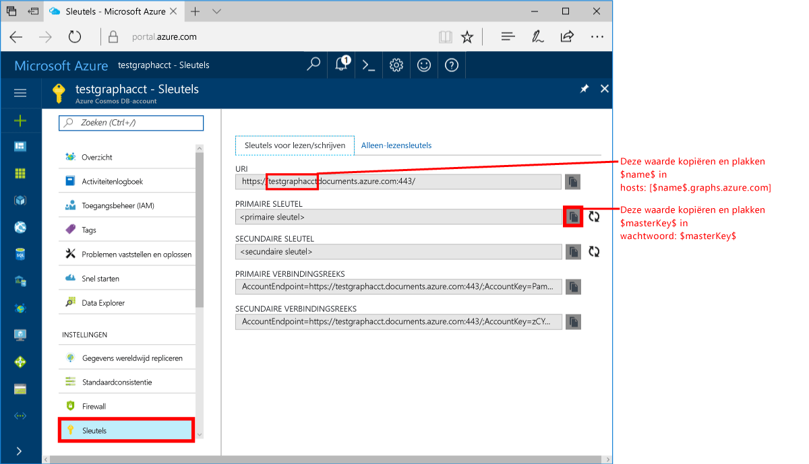
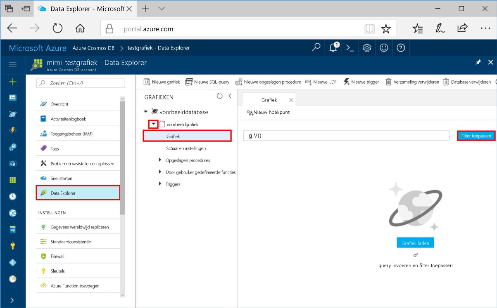
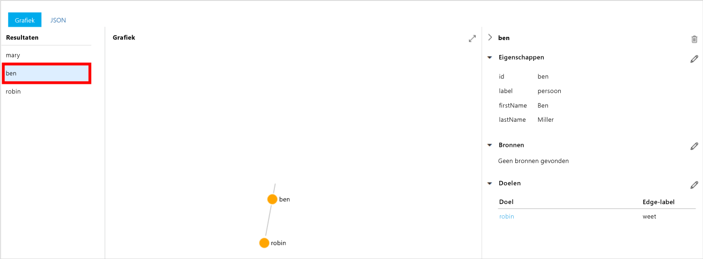
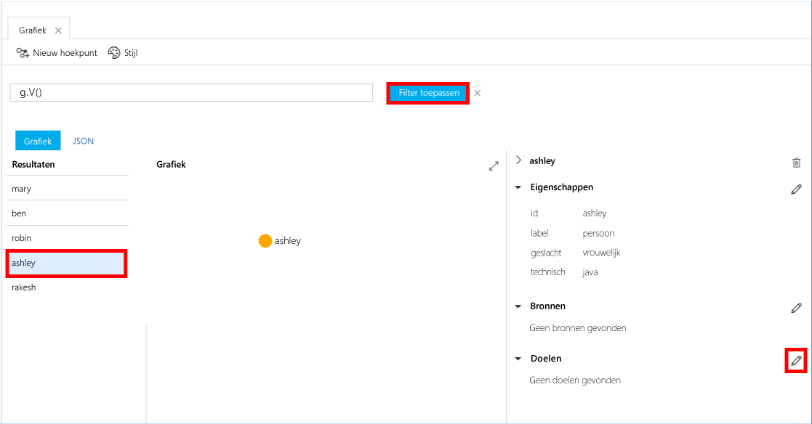
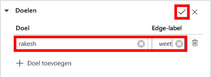
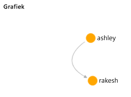

# <a name="azure-cosmos-db-create-a-graph-database-using-java-and-hello-azure-portal"></a>Azure Cosmos DB: Maak een graph-database met behulp van Java en hello Azure-portal

Azure Cosmos DB is de wereldwijd gedistribueerde multimodel-databaseservice van Microsoft. U kunt snel maken en query document, de sleutel/waarde en de grafiek databases, die allemaal van Hallo wereldwijde distributie en mogelijkheden van de horizontale schaal Hallo kern van Azure Cosmos DB profiteren. 

Deze snelstartgids maakt een grafiek database met Azure portal-hulpprogramma's Hallo voor Azure Cosmos DB. Deze snelstartgids ook ziet u hoe tooquickly maken voor een Java-consoletoepassing met behulp van een graph-database met behulp van Hallo OSS [Gremlin Java](https://mvnrepository.com/artifact/org.apache.tinkerpop/gremlin-driver) stuurprogramma. Hallo-instructies in deze snelstartgids kunnen worden uitgevoerd op elk besturingssysteem waarmee Java uitgevoerd. Deze snelstartgids familiarizes u met het maken en wijzigen van de grafiek bronnen in de Hallo gebruikersinterface of via een programma, afhankelijk van wat uw voorkeur is. 

## <a name="prerequisites"></a>Vereisten

* [Java Development Kit (JDK) 1.7+](http://www.oracle.com/technetwork/java/javase/downloads/jdk8-downloads-2133151.html)
    * Voer op Ubuntu, `apt-get install default-jdk` tooinstall hello JDK.
    * Worden ervoor tooset hello JAVA_HOME omgeving variabele toopoint toohello map is waarin Hallo JDK is geïnstalleerd.
* [Download](http://maven.apache.org/download.cgi) en [installeer](http://maven.apache.org/install.html) een binair [Maven](http://maven.apache.org/)-archief
    * Ubuntu, u kunt uitvoeren `apt-get install maven` tooinstall Maven.
* [Git](https://www.git-scm.com/)
    * Ubuntu, u kunt uitvoeren `sudo apt-get install git` tooinstall Git.

[!INCLUDE [quickstarts-free-trial-note](../../includes/quickstarts-free-trial-note.md)]

## <a name="create-a-database-account"></a>Een databaseaccount maken

Voordat u een database van de grafiek maken kunt, moet u een databaseaccount Gremlin (grafiek) met Azure Cosmos DB toocreate.

[!INCLUDE [cosmos-db-create-dbaccount-graph](../../includes/cosmos-db-create-dbaccount-graph.md)]

## <a name="add-a-graph"></a>Een graaf toevoegen

U kunt nu Hallo Data Explorer hulpprogramma gebruiken in hello Azure portal toocreate een graph-database. 

1. Klik in de Azure-portal in links navigatiemenu Hallo Hallo op **Data Explorer (Preview)**. 
2. In Hallo **Data Explorer (Preview)** blade, klikt u op **nieuwe grafiek**, vul vervolgens met behulp van de volgende informatie Hallo Hallo-pagina:

    

    Instelling|Voorgestelde waarde|Beschrijving
    ---|---|---
    Database-id|voorbeelddatabase|Hallo-ID voor de nieuwe database. Databasenamen moeten tussen de 1 en 255 tekens zijn en mogen geen `/ \ # ?` bevatten of eindigen op een spatie.
    Grafiek-id|voorbeeldgrafiek|Hallo-ID voor de nieuwe grafiek. Namen van de grafiek Hallo hebben dezelfde vereisten als de database-id's teken.
    Opslagcapaciteit| 10 GB|Laat de standaardwaarde Hallo. Dit is de opslagcapaciteit Hallo van Hallo-database.
    Doorvoer|400 RU‘s|Laat de standaardwaarde Hallo. U kunt opschalen doorvoer hello later als u wilt dat tooreduce latentie.
    Partitiesleutel|Leeg laten|Hallo-doel van deze snelstartgids, Hallo partitiesleutel leeg laten.

3. Zodra het Hallo-formulier wordt ingevuld, klikt u op **OK**.

## <a name="clone-hello-sample-application"></a>Hallo-voorbeeldtoepassing klonen

Nu gaan we een graph-app vanuit github Hallo verbindingsreeks instellen en voer dit klonen. U ziet hoe eenvoudig het is toowork met gegevens via een programma. 

1. Open een git-terminalvenster zoals git bash en en `cd` tooa werkmap.  

2. Hallo na de opdracht tooclone Hallo voorbeeld opslagplaats worden uitgevoerd. 

    ```bash
    git clone https://github.com/Azure-Samples/azure-cosmos-db-graph-java-getting-started.git
    ```

## <a name="review-hello-code"></a>Hallo code bekijken

We maken een kort overzicht van wat in Hallo-app gebeurt er. Open Hallo `Program.java` bestand van Hallo \src\GetStarted map en deze regels code vinden. 

* Hallo Gremlin `Client` wordt geïnitialiseerd vanuit Hallo-configuratie in `src/remote.yaml`.

    ```java
    cluster = Cluster.build(new File("src/remote.yaml")).create();
    ...
    client = cluster.connect();
    ```

* Een reeks Gremlin stappen worden uitgevoerd met Hallo `client.submit` methode.

    ```java
    ResultSet results = client.submit(gremlin);

    CompletableFuture<List<Result>> completableFutureResults = results.all();
    List<Result> resultList = completableFutureResults.get();

    for (Result result : resultList) {
        System.out.println(result.toString());
    }
    ```

## <a name="update-your-connection-string"></a>Uw verbindingsreeks bijwerken

1. Open Hallo src/remote.yaml-bestand. 

3. Vul uw *hosts*, *gebruikersnaam*, en *wachtwoord* waarden in Hallo src/remote.yaml bestand. Hallo rest Hallo instellingen hoeven niet toobe gewijzigd.

    Instelling|Voorgestelde waarde|Beschrijving
    ---|---|---
    Hosts|[***.graphs.azure.com]|Zie Hallo schermafbeelding onder deze tabel. Deze waarde is Hallo Gremlin URI-waarde op de overzichtspagina Hallo Hallo Azure-portal tussen vierkante haken met hallo afsluitende: 443 / verwijderd.<br><br>Deze waarde kan ook worden opgehaald uit Hallo sleutels tabblad Hallo URI-waarde met https:// te verwijderen, documenten toographs wijzigen en verwijderen van Hallo afsluitende: 443 /.
    Gebruikersnaam|/dbs/sample-database/colls/sample-graph|bron van het formulier Hallo Hallo `/dbs/<db>/colls/<coll>` waar `<db>` is de databasenaam van uw bestaande en `<coll>` is de Collectienaam van uw bestaande.
    Wachtwoord|*Uw primaire hoofdsleutel*|Zie de tweede schermafbeelding Hallo onder deze tabel. Deze waarde is de primaire sleutel, die u uit Hallo sleutels pagina Hallo in Hallo primaire sleutel in Azure portal ophalen kunt. Hallo-waarde met behulp van de knop kopiëren Hallo aan de rechterkant Hallo van Hallo vak kopiëren.

    Voor Hallo Hosts waarde, kopieert u Hallo **Gremlin URI** waarde van Hallo **overzicht** pagina. Zie Hallo-instructies in Hallo Hosts rij in de voorgaande tabel over het maken van Hallo Gremlin URI van de blade sleutels Hallo Hallo als deze leeg is.


    Voor Hallo waarde wachtwoord, kopieert u Hallo **primaire sleutel** van Hallo **sleutels** blade: 

## <a name="run-hello-console-app"></a>Hallo-console-app uitvoeren

1. In Hallo git terminalvenster, `cd` toohello azure-cosmos-db-graph-java-getting-started map.

2. Typ in het Hallo git terminalvenster, `mvn package` tooinstall Hallo vereist Java-pakketten.

3. Voer in Hallo git terminalvenster, `mvn exec:java -D exec.mainClass=GetStarted.Program` in Hallo terminalvenster toostart uw Java-toepassing.

Hallo terminalvenster geeft Hallo hoekpunten toohello grafiek worden toegevoegd. Eenmaal Hallo programma is voltooid, schakelt u back-toohello Azure-portal in uw internetbrowser. 

<a id="add-sample-data"></a>
## <a name="review-and-add-sample-data"></a>Voorbeeldgegevens bekijken en toevoegen

U kunt nu gaat u terug tooData Explorer en Zie Hallo hoekpunten toohello grafiek toegevoegd en voeg extra gegevenspunten.

1. Vouw in de Data Explorer Hallo **-voorbeelddatabase**/**voorbeeld grafiek**, klikt u op **grafiek**, en klik vervolgens op **Filter toepassen**. 

   

2. In Hallo **resultaten** lijst, Hallo nieuwe gebruikers toegevoegd toohello grafiek. Selecteer **ben** ziet u dat hij toorobin is verbonden. U kunt Hallo hoekpunten verplaatsen op Hallo grafiek explorer, in-en uitzoomen, uitvouwen en grootte van Hallo grafiek explorer oppervlak Hallo. 

   

3. Laten we enkele nieuwe gebruikers toohello grafiek met Hallo Data Explorer toevoegen. Klik op Hallo **nieuw hoekpunt** knop tooadd gegevens tooyour grafiek.

   

4. Voer een label van *persoon* Voer Hallo volgende sleutels en waarden toocreate Hallo eerste hoekpunt in Hallo-grafiek. U kunt unieke eigenschappen maken voor elke persoon in de grafiek. Alleen Hallo-id sleutel is vereist.

    sleutel|waarde|Opmerkingen
    ----|----|----
    id|ashley|Hallo unieke id voor Hallo hoekpunt. Als u geen id opgeeft, wordt er een id voor u gegenereerd.
    geslacht|vrouwelijk| 
    technisch | java | 

    > [!NOTE]
    > In deze snelstartgids maken we een niet-gepartitioneerde verzameling. Echter, als u een gepartitioneerde verzameling maken door op te geven van een partitiesleutel tijdens het maken van de verzameling hello, moet u tooinclude Hallo partitiesleutel als de sleutel in elk nieuw hoekpunt. 

5. Klik op **OK**. Mogelijk moet u tooexpand uw scherm toosee **OK** op Hallo onderaan welkomstscherm.

6. Klik op **Nieuw hoekpunt** en voeg nog een nieuwe gebruiker toe. Voer een label van *persoon* voert u de volgende Hallo sleutels en waarden:

    sleutel|waarde|Opmerkingen
    ----|----|----
    id|rakesh|Hallo unieke id voor Hallo hoekpunt. Als u geen id opgeeft, wordt er een id voor u gegenereerd.
    geslacht|man| 
    school|MIT| 

7. Klik op **OK**. 

8. Klik op **Filter toepassen** met Hallo standaard `g.V()` filter. Alle Hallo gebruikers nu worden weergegeven in Hallo **resultaten** lijst. Als u meer gegevens toevoegt, kunt u filters toolimit uw resultaten. Data Explorer gebruikt standaard `g.V()` tooretrieve alle hoekpunten van een grafiek, maar u kunnen wijzigen die andere tooa [grafiek query](tutorial-query-graph.md), zoals `g.V().count()`, tooreturn een telling van alle Hallo hoekpunten van de grafiek Hallo in JSON-indeling.

9. Nu kunnen we rakesh en ashley met elkaar verbinden. Zorg ervoor dat **Pascaline** in geselecteerd in Hallo **resultaten** lijst en klik op de knop bewerken Hallo volgende te**doelen** lagere rechts op. Mogelijk moet u toowiden uw venster toosee hello **eigenschappen** gebied.

   

10. In Hallo **doel** vak type *rakesh*, en in Hallo **rand label** vak type *kent*, en klik vervolgens op het selectievakje Hallo.

   

11. Nu selecteren **rakesh** uit de lijst met resultaten Hallo en om te zien of Pascaline en rakesh zijn verbonden. 

   

    U kunt ook Data Explorer toocreate opgeslagen procedures, UDF's en triggers tooperform-bedrijfslogica server ook gebruiken als de doorvoer van de schaal. Data Explorer toont alle Hallo ingebouwde programmatische toegang tot gegevens beschikbaar zijn in Hallo API's, maar biedt eenvoudige toegang tooyour gegevens in hello Azure-portal.


## <a name="review-slas-in-hello-azure-portal"></a>Sla's bekijken in hello Azure-portal

[!INCLUDE [cosmosdb-tutorial-review-slas](../../includes/cosmos-db-tutorial-review-slas.md)]

## <a name="clean-up-resources"></a>Resources opschonen

Als u deze app niet toocontinue toouse gaat, verwijdert u alle resources die zijn gemaakt door deze snelstartgids in hello Azure-portal met Hallo stappen te volgen: 

1. Hallo links menu in hello Azure-portal en klik op **resourcegroepen** en klik vervolgens op Hallo-naam van het Hallo-resource die u hebt gemaakt. 
2. Klik op de pagina van de groep resource **verwijderen**, typ de naam Hallo van Hallo resource toodelete in Hallo tekstvak en klik op **verwijderen**.

## <a name="next-steps"></a>Volgende stappen

In deze snelstartgids hebt u geleerd hoe toocreate een Cosmos-DB Azure-account maken van een grafiek met Hallo Data Explorer en een app uitvoeren. U kunt nu complexere query's maken en met Gremlin krachtige logica implementeren om door een graaf te gaan. 

> [!div class="nextstepaction"]
> [Query’s uitvoeren met Gremlin](tutorial-query-graph.md)

