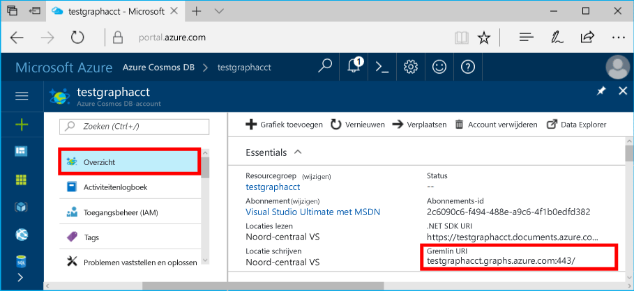

# <a name="azure-cosmos-db-build-a-nodejs-application-by-using-graph-api"></a><span data-ttu-id="8d422-103">Azure Cosmos DB: een Node.js-toepassing ontwikkelen met de Graph API</span><span class="sxs-lookup"><span data-stu-id="8d422-103">Azure Cosmos DB: Build a Node.js application by using Graph API</span></span>

<span data-ttu-id="8d422-104">Azure Cosmos DB is de globaal gedistribueerde multimodel-databaseservice van Microsoft.</span><span class="sxs-lookup"><span data-stu-id="8d422-104">Azure Cosmos DB is the globally distributed multi-model database service from Microsoft.</span></span> <span data-ttu-id="8d422-105">U kunt snel databases maken van documenten, sleutel/waarde-paren en grafieken en hier query’s op uitvoeren. Deze databases genieten allemaal het voordeel van de globale distributie en horizontale schaalmogelijkheden die ten grondslag liggen aan Azure Cosmos DB.</span><span class="sxs-lookup"><span data-stu-id="8d422-105">You can quickly create and query document, key/value, and graph databases, all of which benefit from the global distribution and horizontal scale capabilities at the core of Azure Cosmos DB.</span></span> 

<span data-ttu-id="8d422-106">In dit artikel ziet u hoe u met Azure Portal een Azure Cosmos DB-account voor Graph API (preview), een database en een graaf kunt maken.</span><span class="sxs-lookup"><span data-stu-id="8d422-106">This quick-start article demonstrates how to create an Azure Cosmos DB account for Graph API (preview), database, and graph by using the Azure portal.</span></span> <span data-ttu-id="8d422-107">U gaat vervolgens een console-app ontwikkelen en uitvoeren met behulp van het opensourcestuurprogramma [Gremlin Node.js](https://www.npmjs.com/package/gremlin-secure).</span><span class="sxs-lookup"><span data-stu-id="8d422-107">You then build and run a console app by using the open-source [Gremlin Node.js](https://www.npmjs.com/package/gremlin-secure) driver.</span></span>  

> [!NOTE]
> <span data-ttu-id="8d422-108">De npm-module `gremlin-secure` is een gewijzigde versie van de `gremlin`-module met ondersteuning voor SSL en SASL, vereist om verbinding te maken met Azure Cosmos DB.</span><span class="sxs-lookup"><span data-stu-id="8d422-108">The npm module `gremlin-secure` is a modified version of `gremlin` module, with support for SSL and SASL required for connecting with Azure Cosmos DB.</span></span> <span data-ttu-id="8d422-109">Broncode is beschikbaar op [GitHub](https://github.com/CosmosDB/gremlin-javascript).</span><span class="sxs-lookup"><span data-stu-id="8d422-109">Source code is available on [GitHub](https://github.com/CosmosDB/gremlin-javascript).</span></span>
>

## <a name="prerequisites"></a><span data-ttu-id="8d422-110">Vereisten</span><span class="sxs-lookup"><span data-stu-id="8d422-110">Prerequisites</span></span>

<span data-ttu-id="8d422-111">Voordat u met dit voorbeeld aan de slag gaat, moet u aan de volgende vereisten voldoen:</span><span class="sxs-lookup"><span data-stu-id="8d422-111">Before you can run this sample, you must have the following prerequisites:</span></span>
* <span data-ttu-id="8d422-112">[Node.js](https://nodejs.org/en/) versie v0.10.29 of hoger</span><span class="sxs-lookup"><span data-stu-id="8d422-112">[Node.js](https://nodejs.org/en/) version v0.10.29 or later</span></span>
* [<span data-ttu-id="8d422-113">Git</span><span class="sxs-lookup"><span data-stu-id="8d422-113">Git</span></span>](http://git-scm.com/)

[!INCLUDE [quickstarts-free-trial-note](../../includes/quickstarts-free-trial-note.md)]

## <a name="create-a-database-account"></a><span data-ttu-id="8d422-114">Een databaseaccount maken</span><span class="sxs-lookup"><span data-stu-id="8d422-114">Create a database account</span></span>

[!INCLUDE [cosmos-db-create-dbaccount-graph](../../includes/cosmos-db-create-dbaccount-graph.md)]

## <a name="add-a-graph"></a><span data-ttu-id="8d422-115">Een graaf toevoegen</span><span class="sxs-lookup"><span data-stu-id="8d422-115">Add a graph</span></span>

[!INCLUDE [cosmos-db-create-graph](../../includes/cosmos-db-create-graph.md)]

## <a name="clone-the-sample-application"></a><span data-ttu-id="8d422-116">De voorbeeldtoepassing klonen</span><span class="sxs-lookup"><span data-stu-id="8d422-116">Clone the sample application</span></span>

<span data-ttu-id="8d422-117">We gaan nu een Graph API-app klonen vanaf GitHub, de verbindingsreeks instellen en de app uitvoeren.</span><span class="sxs-lookup"><span data-stu-id="8d422-117">Now let's clone a Graph API app from GitHub, set the connection string, and run it.</span></span> <span data-ttu-id="8d422-118">U zult zien hoe gemakkelijk het is om op een programmatische manier met gegevens te werken.</span><span class="sxs-lookup"><span data-stu-id="8d422-118">You'll see how easy it is to work with data programmatically.</span></span> 

1. <span data-ttu-id="8d422-119">Open een venster in een Git-terminal, zoals Git Bash, en ga (met de opdracht `cd`) naar een werkmap.</span><span class="sxs-lookup"><span data-stu-id="8d422-119">Open a Git terminal window, such as Git Bash, and change (via `cd` command) to a working directory.</span></span>  

2. <span data-ttu-id="8d422-120">Voer de volgende opdracht uit om de voorbeeldopslagplaats te klonen.</span><span class="sxs-lookup"><span data-stu-id="8d422-120">Run the following command to clone the sample repository.</span></span> 

    ```bash
    git clone https://github.com/Azure-Samples/azure-cosmos-db-graph-nodejs-getting-started.git
    ```

3. <span data-ttu-id="8d422-121">Open het oplossingenbestand in Visual Studio.</span><span class="sxs-lookup"><span data-stu-id="8d422-121">Open the solution file in Visual Studio.</span></span> 

## <a name="review-the-code"></a><span data-ttu-id="8d422-122">De code bekijken</span><span class="sxs-lookup"><span data-stu-id="8d422-122">Review the code</span></span>

<span data-ttu-id="8d422-123">Laten we eens kijken wat er precies gebeurt in de app.</span><span class="sxs-lookup"><span data-stu-id="8d422-123">Let's make a quick review of what's happening in the app.</span></span> <span data-ttu-id="8d422-124">Open het bestand `app.js`. Hier ziet u de volgende regels code.</span><span class="sxs-lookup"><span data-stu-id="8d422-124">Open the `app.js` file, and you'll find the following lines of code.</span></span> 

* <span data-ttu-id="8d422-125">De Gremlin-client wordt gemaakt.</span><span class="sxs-lookup"><span data-stu-id="8d422-125">The Gremlin client is created.</span></span>

    ```nodejs
    const client = Gremlin.createClient(
        443, 
        config.endpoint, 
        { 
            "session": false, 
            "ssl": true, 
            "user": `/dbs/${config.database}/colls/${config.collection}`,
            "password": config.primaryKey
        });
    ```

  <span data-ttu-id="8d422-126">De configuraties bevinden zich allemaal in `config.js`, wat in het volgende gedeelte wordt bewerkt.</span><span class="sxs-lookup"><span data-stu-id="8d422-126">The configurations are all in `config.js`, which we edit in the following section.</span></span>

* <span data-ttu-id="8d422-127">Een reeks Gremlin-stappen wordt uitgevoerd met behulp van de methode `client.execute`.</span><span class="sxs-lookup"><span data-stu-id="8d422-127">A series of Gremlin steps are executed with the `client.execute` method.</span></span>

    ```nodejs
    console.log('Running Count'); 
    client.execute("g.V().count()", { }, (err, results) => {
        if (err) return console.error(err);
        console.log(JSON.stringify(results));
        console.log();
    });
    ```

## <a name="update-your-connection-string"></a><span data-ttu-id="8d422-128">Uw verbindingsreeks bijwerken</span><span class="sxs-lookup"><span data-stu-id="8d422-128">Update your connection string</span></span>

1. <span data-ttu-id="8d422-129">Open het bestand config.js.</span><span class="sxs-lookup"><span data-stu-id="8d422-129">Open the config.js file.</span></span> 

2. <span data-ttu-id="8d422-130">Vul in config.js voor de sleutel config.endpoint de **Gremlin URI**-waarde in van de pagina **Overzicht** van de Azure Portal.</span><span class="sxs-lookup"><span data-stu-id="8d422-130">In config.js, fill in the config.endpoint key with the **Gremlin URI** value from the **Overview** page of the Azure portal.</span></span> 

    `config.endpoint = "GRAPHENDPOINT";`

    

   <span data-ttu-id="8d422-132">Als de **Gremlin URI**-waarde leeg is, kunt u de waarde van de pagina **Sleutels** in de portal genereren met behulp van de **URI**-waarde, waarbij https:// wordt verwijderd en documenten in grafieken worden gewijzigd.</span><span class="sxs-lookup"><span data-stu-id="8d422-132">If the **Gremlin URI** value is blank, you can generate the value from the **Keys** page in the portal, using the **URI** value, removing https://, and changing documents to graphs.</span></span>

   <span data-ttu-id="8d422-133">Het Gremlin-eindpunt moet alleen de hostnaam zijn zonder het protocol-/poortnummer, zoals `mygraphdb.graphs.azure.com` (niet `https://mygraphdb.graphs.azure.com` of `mygraphdb.graphs.azure.com:433`).</span><span class="sxs-lookup"><span data-stu-id="8d422-133">The Gremlin endpoint must be only the host name without the protocol/port number, like `mygraphdb.graphs.azure.com` (not `https://mygraphdb.graphs.azure.com` or `mygraphdb.graphs.azure.com:433`).</span></span>

3. <span data-ttu-id="8d422-134">Vul in config.js voor de waarde config.primaryKey de waarde van de **Primaire sleutel** in van de pagina **Sleutels** van de Azure Portal.</span><span class="sxs-lookup"><span data-stu-id="8d422-134">In config.js, fill in the config.primaryKey value in with the **Primary Key** value from the **Keys** page of the Azure portal.</span></span> 

    `config.primaryKey = "PRIMARYKEY";`

   

4. <span data-ttu-id="8d422-136">Voer de databasenaam en de naam van de graaf (container) in voor de waarde van config.database en config.collection.</span><span class="sxs-lookup"><span data-stu-id="8d422-136">Enter the database name, and graph (container) name for the value of config.database and config.collection.</span></span> 

<span data-ttu-id="8d422-137">Hier volgt een voorbeeld van hoe het voltooide bestand config.js eruit moet zien:</span><span class="sxs-lookup"><span data-stu-id="8d422-137">Here is an example of what your completed config.js file should look like:</span></span>

```nodejs
var config = {}

// Note that this must not have HTTPS or the port number
config.endpoint = "testgraphacct.graphs.azure.com";
config.primaryKey = "Pams6e7LEUS7LJ2Qk0fjZf3eGo65JdMWHmyn65i52w8ozPX2oxY3iP0yu05t9v1WymAHNcMwPIqNAEv3XDFsEg==";
config.database = "graphdb"
config.collection = "Persons"

module.exports = config;
```

## <a name="run-the-console-app"></a><span data-ttu-id="8d422-138">De app console uitvoeren</span><span class="sxs-lookup"><span data-stu-id="8d422-138">Run the console app</span></span>

1. <span data-ttu-id="8d422-139">Open een terminalvenster en ga (via de opdracht `cd`) naar de installatiemap voor het bestand package.json dat is opgenomen in het project.</span><span class="sxs-lookup"><span data-stu-id="8d422-139">Open a terminal window and change (via `cd` command) to the installation directory for the package.json file that's included in the project.</span></span>  

2. <span data-ttu-id="8d422-140">Voer `npm install` uit om de vereiste npm-modules, waaronder `gremlin-secure`, te installeren.</span><span class="sxs-lookup"><span data-stu-id="8d422-140">Run `npm install` to install the required npm modules, including `gremlin-secure`.</span></span>

3. <span data-ttu-id="8d422-141">Voer `node app.js` uit op een terminal om uw knooppunttoepassing te starten.</span><span class="sxs-lookup"><span data-stu-id="8d422-141">Run `node app.js` in a terminal to start your node application.</span></span>

## <a name="browse-with-data-explorer"></a><span data-ttu-id="8d422-142">Bladeren met Data Explorer</span><span class="sxs-lookup"><span data-stu-id="8d422-142">Browse with Data Explorer</span></span>

<span data-ttu-id="8d422-143">U kunt nu teruggaan naar Data Explorer in Azure Portal en uw nieuwe graafgegevens bekijken, aanpassen en bewerken en er query's op uitvoeren.</span><span class="sxs-lookup"><span data-stu-id="8d422-143">You can now go back to Data Explorer in the Azure portal to view, query, modify, and work with your new graph data.</span></span>

<span data-ttu-id="8d422-144">De nieuwe database wordt in Data Explorer weergegeven in het deelvenster **Grafieken**.</span><span class="sxs-lookup"><span data-stu-id="8d422-144">In Data Explorer, the new database appears in the **Graphs** pane.</span></span> <span data-ttu-id="8d422-145">Vouw de database uit, gevolgd door de verzameling en klik vervolgens op **Grafiek**.</span><span class="sxs-lookup"><span data-stu-id="8d422-145">Expand the database, followed by the collection, then click **Graph**.</span></span>

<span data-ttu-id="8d422-146">De gegevens die worden gegenereerd door de voorbeeld-app worden weergegeven op het volgende deelvenster binnen het tabblad **Grafiek** wanneer u op tabblad **Filter toepassen** klikt.</span><span class="sxs-lookup"><span data-stu-id="8d422-146">The data generated by the sample app is displayed in the next pane within the **Graph** tab when you click **Apply Filter**.</span></span>

<span data-ttu-id="8d422-147">Probeer `g.V()` voltooien met `.has('firstName', 'Thomas')` om het filter te testen.</span><span class="sxs-lookup"><span data-stu-id="8d422-147">Try completing `g.V()` with `.has('firstName', 'Thomas')` to test the filter.</span></span> <span data-ttu-id="8d422-148">Houd er rekening mee dat de waarde hoofdlettergevoelig is.</span><span class="sxs-lookup"><span data-stu-id="8d422-148">Do note that the value is case sensitive.</span></span>

## <a name="review-slas-in-the-azure-portal"></a><span data-ttu-id="8d422-149">SLA’s bekijken in Azure Portal</span><span class="sxs-lookup"><span data-stu-id="8d422-149">Review SLAs in the Azure portal</span></span>

[!INCLUDE [cosmosdb-tutorial-review-slas](../../includes/cosmos-db-tutorial-review-slas.md)]

## <a name="clean-up-your-resources"></a><span data-ttu-id="8d422-150">Uw resources opschonen</span><span class="sxs-lookup"><span data-stu-id="8d422-150">Clean up your resources</span></span>

<span data-ttu-id="8d422-151">Als u niet van plan bent om door te gaan met het gebruik van deze app, verwijdert u alle resources die u in dit artikel hebt gemaakt als volgt:</span><span class="sxs-lookup"><span data-stu-id="8d422-151">If you do not plan to continue using this app, delete all resources that you created in this article by doing the following:</span></span> 

1. <span data-ttu-id="8d422-152">Klik in het menu aan de linkerkant in Azure Portal op **Resourcegroepen** en klik vervolgens op de resource die u hebt gemaakt.</span><span class="sxs-lookup"><span data-stu-id="8d422-152">In the Azure portal, on the left navigation menu, click **Resource groups**, and then click the name of the resource that you created.</span></span> 
2. <span data-ttu-id="8d422-153">Klik op de pagina van uw resourcegroep op **Verwijderen**, typ de naam van de resource die u wilt verwijderen en klik vervolgens op **Verwijderen**.</span><span class="sxs-lookup"><span data-stu-id="8d422-153">On your resource group page, click **Delete**, type the name of the resource to be deleted, and then click **Delete**.</span></span>

## <a name="next-steps"></a><span data-ttu-id="8d422-154">Volgende stappen</span><span class="sxs-lookup"><span data-stu-id="8d422-154">Next steps</span></span>

<span data-ttu-id="8d422-155">In dit artikel hebt u geleerd hoe u een Azure Cosmos DB-account kunt maken, hebt u een graaf gemaakt met Data Explorer en hebt u een app uitgevoerd.</span><span class="sxs-lookup"><span data-stu-id="8d422-155">In this article, you've learned how to create an Azure Cosmos DB account, create a graph by using Data Explorer, and run an app.</span></span> <span data-ttu-id="8d422-156">U kunt nu complexere query's maken en met Gremlin krachtige logica implementeren om door een graaf te gaan.</span><span class="sxs-lookup"><span data-stu-id="8d422-156">You can now build more complex queries and implement powerful graph traversal logic by using Gremlin.</span></span> 

> [!div class="nextstepaction"]
> [<span data-ttu-id="8d422-157">Query’s uitvoeren met Gremlin</span><span class="sxs-lookup"><span data-stu-id="8d422-157">Query using Gremlin</span></span>](tutorial-query-graph.md)
