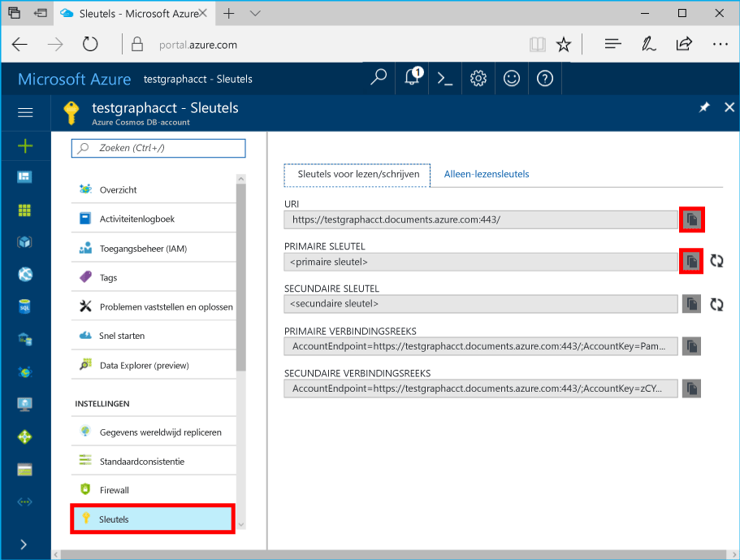

# <a name="azure-cosmos-db-build-a-nodejs-application-by-using-graph-api"></a><span data-ttu-id="9b682-103">Azure Cosmos DB: een Node.js-toepassing ontwikkelen met de Graph API</span><span class="sxs-lookup"><span data-stu-id="9b682-103">Azure Cosmos DB: Build a Node.js application by using Graph API</span></span>

<span data-ttu-id="9b682-104">Azure Cosmos DB is Hallo globaal gedistribueerd met meerdere modellen database-service van Microsoft.</span><span class="sxs-lookup"><span data-stu-id="9b682-104">Azure Cosmos DB is hello globally distributed multi-model database service from Microsoft.</span></span> <span data-ttu-id="9b682-105">U kunt snel maken en query document, de sleutel/waarde en de grafiek databases, die allemaal van Hallo wereldwijde distributie en mogelijkheden van de horizontale schaal Hallo kern van Azure Cosmos DB profiteren.</span><span class="sxs-lookup"><span data-stu-id="9b682-105">You can quickly create and query document, key/value, and graph databases, all of which benefit from hello global distribution and horizontal scale capabilities at hello core of Azure Cosmos DB.</span></span> 

<span data-ttu-id="9b682-106">In dit artikel snel starten laat zien hoe een Cosmos Azure DB toocreate administratief Graph API (preview), de database en de grafiek met behulp van hello Azure-portal.</span><span class="sxs-lookup"><span data-stu-id="9b682-106">This quick-start article demonstrates how toocreate an Azure Cosmos DB account for Graph API (preview), database, and graph by using hello Azure portal.</span></span> <span data-ttu-id="9b682-107">U vervolgens bouwen en uitvoeren van een console-app met behulp van Hallo open-source [Gremlin Node.js](https://www.npmjs.com/package/gremlin-secure) stuurprogramma.</span><span class="sxs-lookup"><span data-stu-id="9b682-107">You then build and run a console app by using hello open-source [Gremlin Node.js](https://www.npmjs.com/package/gremlin-secure) driver.</span></span>  

> [!NOTE]
> <span data-ttu-id="9b682-108">Hallo npm-module `gremlin-secure` is een gewijzigde versie van `gremlin` module met ondersteuning voor SSL en SASL vereist om verbinding te maken met Azure Cosmos DB.</span><span class="sxs-lookup"><span data-stu-id="9b682-108">hello npm module `gremlin-secure` is a modified version of `gremlin` module, with support for SSL and SASL required for connecting with Azure Cosmos DB.</span></span> <span data-ttu-id="9b682-109">Broncode is beschikbaar op [GitHub](https://github.com/CosmosDB/gremlin-javascript).</span><span class="sxs-lookup"><span data-stu-id="9b682-109">Source code is available on [GitHub](https://github.com/CosmosDB/gremlin-javascript).</span></span>
>

## <a name="prerequisites"></a><span data-ttu-id="9b682-110">Vereisten</span><span class="sxs-lookup"><span data-stu-id="9b682-110">Prerequisites</span></span>

<span data-ttu-id="9b682-111">Voordat u dit voorbeeld uitvoeren kunt, hebt u Hallo volgende vereisten:</span><span class="sxs-lookup"><span data-stu-id="9b682-111">Before you can run this sample, you must have hello following prerequisites:</span></span>
* <span data-ttu-id="9b682-112">[Node.js](https://nodejs.org/en/) versie v0.10.29 of hoger</span><span class="sxs-lookup"><span data-stu-id="9b682-112">[Node.js](https://nodejs.org/en/) version v0.10.29 or later</span></span>
* [<span data-ttu-id="9b682-113">Git</span><span class="sxs-lookup"><span data-stu-id="9b682-113">Git</span></span>](http://git-scm.com/)

[!INCLUDE [quickstarts-free-trial-note](../../includes/quickstarts-free-trial-note.md)]

## <a name="create-a-database-account"></a><span data-ttu-id="9b682-114">Een databaseaccount maken</span><span class="sxs-lookup"><span data-stu-id="9b682-114">Create a database account</span></span>

[!INCLUDE [cosmos-db-create-dbaccount-graph](../../includes/cosmos-db-create-dbaccount-graph.md)]

## <a name="add-a-graph"></a><span data-ttu-id="9b682-115">Een graaf toevoegen</span><span class="sxs-lookup"><span data-stu-id="9b682-115">Add a graph</span></span>

[!INCLUDE [cosmos-db-create-graph](../../includes/cosmos-db-create-graph.md)]

## <a name="clone-hello-sample-application"></a><span data-ttu-id="9b682-116">Hallo-voorbeeldtoepassing klonen</span><span class="sxs-lookup"><span data-stu-id="9b682-116">Clone hello sample application</span></span>

<span data-ttu-id="9b682-117">Nu gaan we kloon een Graph-API-app vanuit GitHub Hallo verbindingsreeks instellen en uitvoeren.</span><span class="sxs-lookup"><span data-stu-id="9b682-117">Now let's clone a Graph API app from GitHub, set hello connection string, and run it.</span></span> <span data-ttu-id="9b682-118">U ziet hoe eenvoudig het is toowork met gegevens via een programma.</span><span class="sxs-lookup"><span data-stu-id="9b682-118">You'll see how easy it is toowork with data programmatically.</span></span> 

1. <span data-ttu-id="9b682-119">Open een Git-terminalvenster zoals Git Bash en wijzig (via `cd` opdracht) tooa werkmap.</span><span class="sxs-lookup"><span data-stu-id="9b682-119">Open a Git terminal window, such as Git Bash, and change (via `cd` command) tooa working directory.</span></span>  

2. <span data-ttu-id="9b682-120">Hallo na de opdracht tooclone Hallo voorbeeld opslagplaats worden uitgevoerd.</span><span class="sxs-lookup"><span data-stu-id="9b682-120">Run hello following command tooclone hello sample repository.</span></span> 

    ```bash
    git clone https://github.com/Azure-Samples/azure-cosmos-db-graph-nodejs-getting-started.git
    ```

3. <span data-ttu-id="9b682-121">Open het oplossingsbestand Hallo in Visual Studio.</span><span class="sxs-lookup"><span data-stu-id="9b682-121">Open hello solution file in Visual Studio.</span></span> 

## <a name="review-hello-code"></a><span data-ttu-id="9b682-122">Hallo code bekijken</span><span class="sxs-lookup"><span data-stu-id="9b682-122">Review hello code</span></span>

<span data-ttu-id="9b682-123">We maken een kort overzicht van wat in Hallo-app gebeurt er.</span><span class="sxs-lookup"><span data-stu-id="9b682-123">Let's make a quick review of what's happening in hello app.</span></span> <span data-ttu-id="9b682-124">Open Hallo `app.js` -bestand en u vindt Hallo volgende regels code.</span><span class="sxs-lookup"><span data-stu-id="9b682-124">Open hello `app.js` file, and you'll find hello following lines of code.</span></span> 

* <span data-ttu-id="9b682-125">Hallo Gremlin client wordt gemaakt.</span><span class="sxs-lookup"><span data-stu-id="9b682-125">hello Gremlin client is created.</span></span>

    ```nodejs
    const client = Gremlin.createClient(
        443, 
        config.endpoint, 
        { 
            "session": false, 
            "ssl": true, 
            "user": `/dbs/${config.database}/colls/${config.collection}`,
            "password": config.primaryKey
        });
    ```

  <span data-ttu-id="9b682-126">Hallo configuraties bevinden zich allemaal in `config.js`, die we in de volgende sectie Hallo bewerken.</span><span class="sxs-lookup"><span data-stu-id="9b682-126">hello configurations are all in `config.js`, which we edit in hello following section.</span></span>

* <span data-ttu-id="9b682-127">Een reeks Gremlin stappen worden uitgevoerd met een Hallo `client.execute` methode.</span><span class="sxs-lookup"><span data-stu-id="9b682-127">A series of Gremlin steps are executed with hello `client.execute` method.</span></span>

    ```nodejs
    console.log('Running Count'); 
    client.execute("g.V().count()", { }, (err, results) => {
        if (err) return console.error(err);
        console.log(JSON.stringify(results));
        console.log();
    });
    ```

## <a name="update-your-connection-string"></a><span data-ttu-id="9b682-128">Uw verbindingsreeks bijwerken</span><span class="sxs-lookup"><span data-stu-id="9b682-128">Update your connection string</span></span>

1. <span data-ttu-id="9b682-129">Open Hallo bestand config.js file.</span><span class="sxs-lookup"><span data-stu-id="9b682-129">Open hello config.js file.</span></span> 

2. <span data-ttu-id="9b682-130">In het bestand config.js, vult u Hallo config.endpoint sleutel met de Hallo **Gremlin URI** waarde van Hallo **overzicht** pagina Hallo Azure-portal.</span><span class="sxs-lookup"><span data-stu-id="9b682-130">In config.js, fill in hello config.endpoint key with hello **Gremlin URI** value from hello **Overview** page of hello Azure portal.</span></span> 

    `config.endpoint = "GRAPHENDPOINT";`

    

   <span data-ttu-id="9b682-132">Als hello **Gremlin URI** waarde leeg is, kunt u Hallo waarde genereren van Hallo **sleutels** pagina in Hallo-portal, met Hallo **URI** waarde, https:// te verwijderen of wijzigen documenten toographs.</span><span class="sxs-lookup"><span data-stu-id="9b682-132">If hello **Gremlin URI** value is blank, you can generate hello value from hello **Keys** page in hello portal, using hello **URI** value, removing https://, and changing documents toographs.</span></span>

   <span data-ttu-id="9b682-133">Hallo Gremlin eindpunt moet alleen Hallo hostnaam zonder Hallo protocol/poortnummer, zoals `mygraphdb.graphs.azure.com` (geen `https://mygraphdb.graphs.azure.com` of `mygraphdb.graphs.azure.com:433`).</span><span class="sxs-lookup"><span data-stu-id="9b682-133">hello Gremlin endpoint must be only hello host name without hello protocol/port number, like `mygraphdb.graphs.azure.com` (not `https://mygraphdb.graphs.azure.com` or `mygraphdb.graphs.azure.com:433`).</span></span>

3. <span data-ttu-id="9b682-134">In config.js, vult u Hallo config.primaryKey waarde met de Hallo **primaire sleutel** waarde van Hallo **sleutels** pagina Hallo Azure-portal.</span><span class="sxs-lookup"><span data-stu-id="9b682-134">In config.js, fill in hello config.primaryKey value in with hello **Primary Key** value from hello **Keys** page of hello Azure portal.</span></span> 

    `config.primaryKey = "PRIMARYKEY";`

   

4. <span data-ttu-id="9b682-136">Hallo-databasenaam en de grafieknaam van de (container) voor Hallo-waarde van config.database en config.collection invoeren.</span><span class="sxs-lookup"><span data-stu-id="9b682-136">Enter hello database name, and graph (container) name for hello value of config.database and config.collection.</span></span> 

<span data-ttu-id="9b682-137">Hier volgt een voorbeeld van hoe het voltooide bestand config.js eruit moet zien:</span><span class="sxs-lookup"><span data-stu-id="9b682-137">Here is an example of what your completed config.js file should look like:</span></span>

```nodejs
var config = {}

// Note that this must not have HTTPS or hello port number
config.endpoint = "testgraphacct.graphs.azure.com";
config.primaryKey = "Pams6e7LEUS7LJ2Qk0fjZf3eGo65JdMWHmyn65i52w8ozPX2oxY3iP0yu05t9v1WymAHNcMwPIqNAEv3XDFsEg==";
config.database = "graphdb"
config.collection = "Persons"

module.exports = config;
```

## <a name="run-hello-console-app"></a><span data-ttu-id="9b682-138">Hallo-console-app uitvoeren</span><span class="sxs-lookup"><span data-stu-id="9b682-138">Run hello console app</span></span>

1. <span data-ttu-id="9b682-139">Open een terminalvenster en wijzig (via `cd` opdracht) installatiemap toohello voor Hallo package.json-bestand dat opgenomen in het Hallo-project.</span><span class="sxs-lookup"><span data-stu-id="9b682-139">Open a terminal window and change (via `cd` command) toohello installation directory for hello package.json file that's included in hello project.</span></span>  

2. <span data-ttu-id="9b682-140">Voer `npm install` tooinstall Hallo vereist npm-modules, waaronder `gremlin-secure`.</span><span class="sxs-lookup"><span data-stu-id="9b682-140">Run `npm install` tooinstall hello required npm modules, including `gremlin-secure`.</span></span>

3. <span data-ttu-id="9b682-141">Voer `node app.js` in een terminal toostart uw knooppunttoepassing.</span><span class="sxs-lookup"><span data-stu-id="9b682-141">Run `node app.js` in a terminal toostart your node application.</span></span>

## <a name="browse-with-data-explorer"></a><span data-ttu-id="9b682-142">Bladeren met Data Explorer</span><span class="sxs-lookup"><span data-stu-id="9b682-142">Browse with Data Explorer</span></span>

<span data-ttu-id="9b682-143">U kunt nu gaat u terug tooData Explorer in Azure portal tooview hello, query, wijzigen en werken met uw nieuwe grafiekgegevens.</span><span class="sxs-lookup"><span data-stu-id="9b682-143">You can now go back tooData Explorer in hello Azure portal tooview, query, modify, and work with your new graph data.</span></span>

<span data-ttu-id="9b682-144">In Data Explorer Hallo nieuwe database wordt weergegeven in Hallo **grafieken** deelvenster.</span><span class="sxs-lookup"><span data-stu-id="9b682-144">In Data Explorer, hello new database appears in hello **Graphs** pane.</span></span> <span data-ttu-id="9b682-145">Hallo-database, gevolgd door de verzameling hello, uitbreiden en klik vervolgens op **grafiek**.</span><span class="sxs-lookup"><span data-stu-id="9b682-145">Expand hello database, followed by hello collection, then click **Graph**.</span></span>

<span data-ttu-id="9b682-146">Hallo-gegevens die zijn gegenereerd door Hallo voorbeeld-app wordt weergegeven in de Volgend deelvenster binnen Hallo Hallo **grafiek** wanneer u klikt op tabblad **Filter toepassen**.</span><span class="sxs-lookup"><span data-stu-id="9b682-146">hello data generated by hello sample app is displayed in hello next pane within hello **Graph** tab when you click **Apply Filter**.</span></span>

<span data-ttu-id="9b682-147">Probeer voltooien `g.V()` met `.has('firstName', 'Thomas')` tootest Hallo filter.</span><span class="sxs-lookup"><span data-stu-id="9b682-147">Try completing `g.V()` with `.has('firstName', 'Thomas')` tootest hello filter.</span></span> <span data-ttu-id="9b682-148">Houd er rekening mee dat de waarde Hallo hoofdlettergevoelig is.</span><span class="sxs-lookup"><span data-stu-id="9b682-148">Do note that hello value is case sensitive.</span></span>

## <a name="review-slas-in-hello-azure-portal"></a><span data-ttu-id="9b682-149">Sla's bekijken in hello Azure-portal</span><span class="sxs-lookup"><span data-stu-id="9b682-149">Review SLAs in hello Azure portal</span></span>

[!INCLUDE [cosmosdb-tutorial-review-slas](../../includes/cosmos-db-tutorial-review-slas.md)]

## <a name="clean-up-your-resources"></a><span data-ttu-id="9b682-150">Uw resources opschonen</span><span class="sxs-lookup"><span data-stu-id="9b682-150">Clean up your resources</span></span>

<span data-ttu-id="9b682-151">Als u niet van plan gebruik van deze app toocontinue bent, verwijdert u alle resources die u hebt gemaakt in dit artikel door Hallo volgende te doen:</span><span class="sxs-lookup"><span data-stu-id="9b682-151">If you do not plan toocontinue using this app, delete all resources that you created in this article by doing hello following:</span></span> 

1. <span data-ttu-id="9b682-152">Klik in de Azure-portal op Hallo linkernavigatievenster menu Hallo op **resourcegroepen**, en klik vervolgens op Hallo-naam van Hallo resource die u hebt gemaakt.</span><span class="sxs-lookup"><span data-stu-id="9b682-152">In hello Azure portal, on hello left navigation menu, click **Resource groups**, and then click hello name of hello resource that you created.</span></span> 
2. <span data-ttu-id="9b682-153">Klik op de pagina van de groep resource **verwijderen**, typ de naam Hallo van Hallo resource toobe verwijderd en klik op **verwijderen**.</span><span class="sxs-lookup"><span data-stu-id="9b682-153">On your resource group page, click **Delete**, type hello name of hello resource toobe deleted, and then click **Delete**.</span></span>

## <a name="next-steps"></a><span data-ttu-id="9b682-154">Volgende stappen</span><span class="sxs-lookup"><span data-stu-id="9b682-154">Next steps</span></span>

<span data-ttu-id="9b682-155">In dit artikel hebt u geleerd hoe toocreate een Cosmos-DB Azure-account maken van een grafiek met behulp van Data Explorer en een app uitvoert.</span><span class="sxs-lookup"><span data-stu-id="9b682-155">In this article, you've learned how toocreate an Azure Cosmos DB account, create a graph by using Data Explorer, and run an app.</span></span> <span data-ttu-id="9b682-156">U kunt nu complexere query's maken en met Gremlin krachtige logica implementeren om door een graaf te gaan.</span><span class="sxs-lookup"><span data-stu-id="9b682-156">You can now build more complex queries and implement powerful graph traversal logic by using Gremlin.</span></span> 

> [!div class="nextstepaction"]
> [<span data-ttu-id="9b682-157">Query’s uitvoeren met Gremlin</span><span class="sxs-lookup"><span data-stu-id="9b682-157">Query using Gremlin</span></span>](tutorial-query-graph.md)
