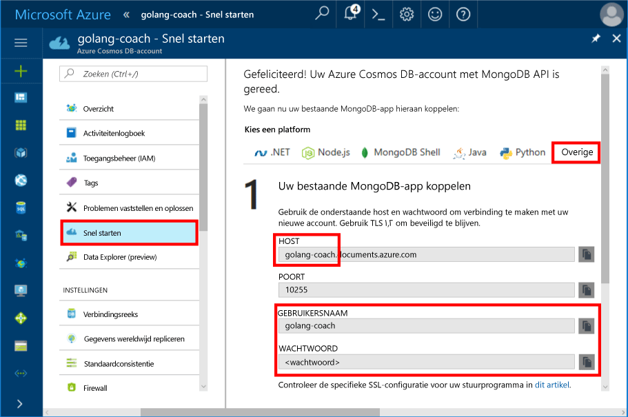
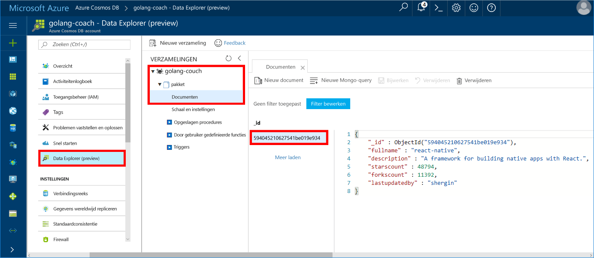

# <a name="azure-cosmos-db-build-a-mongodb-api-console-app-with-golang-and-hello-azure-portal"></a>Azure Cosmos DB: Een consoletoepassing MongoDB-API met Golang bouwen en hello Azure-portal

Azure Cosmos DB is de wereldwijd gedistribueerde multimodel-databaseservice van Microsoft. U kunt snel maken en query document, de sleutel/waarde en de grafiek databases, die allemaal van Hallo wereldwijde distributie en mogelijkheden van de horizontale schaal Hallo kern van Azure Cosmos DB profiteren.

Deze snel starten laat zien hoe een bestaande toouse [MongoDB](https://docs.microsoft.com/en-us/azure/cosmos-db/mongodb-introduction) app, geschreven in [Golang](https://golang.org/) en verbinding maken met het tooyour Azure DB die Cosmos-database, die ondersteuning biedt voor MongoDB-clientverbindingen.

Met andere woorden, kent uw toepassing Golang alleen er wordt verbinding gemaakt met behulp van MongoDB APIs tooa-database. Is transparant toohello-toepassing die Hallo van gegevens wordt opgeslagen in Azure Cosmos DB.

## <a name="prerequisites"></a>Vereisten

- Een Azure-abonnement. Als u nog geen abonnement op Azure hebt, maakt u een [gratis account](https://azure.microsoft.com/free) aan voordat u begint.
- [Ga](https://golang.org/dl/) en basiskennis van Hallo [gaat](https://golang.org/) taal.
- Een IDE: [Gogland](https://www.jetbrains.com/go/) van Jetbrains, [Visual Studio Code](https://code.visualstudio.com/) van Microsoft of [Atom](https://atom.io/). In deze zelfstudie wordt Goglang gebruikt.

<a id="create-account"></a>
## <a name="create-a-database-account"></a>Een databaseaccount maken

[!INCLUDE [cosmos-db-create-dbaccount](../../includes/cosmos-db-create-dbaccount-mongodb.md)]

## <a name="clone-hello-sample-application"></a>Hallo-voorbeeldtoepassing klonen

Hallo-voorbeeldtoepassing klonen en vereist hello-pakketten installeren.

1. Maak een map met de naam CosmosDBSample hello GOROOT\src map C:\Go\ is standaard.
2. Hallo volgende opdracht met een terminalvenster git zoals git bash tooclone Hallo voorbeeld-opslagplaats in Hallo CosmosDBSample map worden uitgevoerd. 

    ```bash
    git clone https://github.com/Azure-Samples/azure-cosmos-db-mongodb-golang-getting-started.git
    ```
3.  Hallo na de opdracht tooget Hallo mgo pakket worden uitgevoerd. 

    ```
    go get gopkg.in/mgo.v2
    ```

Hallo [mgo](http://labix.org/mgo) stuurprogramma (uitgesproken als *mango*) is een [MongoDB](http://www.mongodb.org/) stuurprogramma voor Hallo [gaat taal](http://golang.org/) die implementeert een uitgebreide en getest goed selectie van functies onder een zeer eenvoudige API standaard Ga idioms te volgen.

<a id="connection-string"></a>

## <a name="update-your-connection-string"></a>Uw verbindingsreeks bijwerken

Nu gaat u terug toohello Azure portal tooget verbindingsreeksgegevens en kopieer dit naar Hallo-app.

1. Klik op **snel starten** in het navigatiemenu links Hallo en klik vervolgens op **andere** tooview Hallo verbindingsinformatie vereist door Hallo Ga-toepassing.

2. In Goglang, Hallo main.go bestand in Hallo GOROOT\CosmosDBSample directory openen en bijwerken van de volgende regels code Hallo verbindingsreeksgegevens van hello Azure-portal gebruikt, zoals wordt weergegeven in de volgende schermafbeelding Hallo Hallo. 

    Hallo-databasenaam is Hallo voorvoegsel Hallo **Host** waarde in het deelvenster voor hello Azure portal verbinding-tekenreeks. Hallo-databasenaam is voor Hallo-account wordt weergegeven in onderstaande afbeelding voor Hallo golang-bus.

    ```go
    Database: "hello prefix of hello Host value in hello Azure portal",
    Username: "hello Username in hello Azure portal",
    Password: "hello Password in hello Azure portal",
    ```

    

3. Hallo main.go bestand opslaan.

## <a name="review-hello-code"></a>Hallo code bekijken

We maken een kort overzicht van wat er in Hallo main.go-bestand gebeurt. 

### <a name="connecting-hello-go-app-tooazure-cosmos-db"></a>Verbinding maken met de Hallo Ga app tooAzure Cosmos-DB

Azure Cosmos DB ondersteunt Hallo MongoDB SSL zijn ingeschakeld. tooconnect tooan MongoDB SSL is ingeschakeld, moet u toodefine hello **DialServer** werken in [mgo. DialInfo](http://gopkg.in/mgo.v2#DialInfo), en maken gebruik van Hallo [tls. *Externe* ](http://golang.org/pkg/crypto/tls#Dial) tooperform Hallo verbinding werkt.

Hallo Golang codefragment na verbindt Hallo Ga app met Azure Cosmos DB MongoDB-API. Hallo *DialInfo* klasse bevat de opties voor het tot stand brengen van een sessie met een cluster met MongoDB.

```go
// DialInfo holds options for establishing a session with a MongoDB cluster.
dialInfo := &mgo.DialInfo{
    Addrs:    []string{"golang-couch.documents.azure.com:10255"}, // Get HOST + PORT
    Timeout:  60 * time.Second,
    Database: "database", // It can be anything
    Username: "username", // Username
    Password: "Azure database connect password from Azure Portal", // PASSWORD
    DialServer: func(addr *mgo.ServerAddr) (net.Conn, error) {
        return tls.Dial("tcp", addr.String(), &tls.Config{})
    },
}

// Create a session which maintains a pool of socket connections
// tooour Azure Cosmos DB MongoDB database.
session, err := mgo.DialWithInfo(dialInfo)

if err != nil {
    fmt.Printf("Can't connect toomongo, go error %v\n", err)
    os.Exit(1)
}

defer session.Close()

// SetSafe changes hello session safety mode.
// If hello safe parameter is nil, hello session is put in unsafe mode, 
// and writes become fire-and-forget,
// without error checking. hello unsafe mode is faster since operations won't hold on waiting for a confirmation.
// 
session.SetSafe(&mgo.Safe{})
```

Hallo **mgo. Dial()** methode wordt gebruikt wanneer er geen SSL-verbinding is. Voor een SSL-verbinding Hallo **mgo. DialWithInfo()** methode is vereist.

Een exemplaar van Hallo **DialWIthInfo {}** -object is gebruikte toocreate Hallo-sessieobject. Zodra het Hallo-sessie tot stand is gebracht, kunt u Hallo verzameling kunt openen met behulp van de volgende codefragment Hallo:

```go
collection := session.DB(“database”).C(“package”)
```

<a id="create-document"></a>

### <a name="create-a-document"></a>Een document maken

```go
// Model
type Package struct {
    Id bson.ObjectId  `bson:"_id,omitempty"`
    FullName      string
    Description   string
    StarsCount    int
    ForksCount    int
    LastUpdatedBy string
}

// insert Document in collection
err = collection.Insert(&Package{
    FullName:"react",
    Description:"A framework for building native apps with React.",
    ForksCount: 11392,
    StarsCount:48794,
    LastUpdatedBy:"shergin",

})

if err != nil {
    log.Fatal("Problem inserting data: ", err)
    return
}
```

### <a name="query-or-read-a-document"></a>Query's uitvoeren voor een document of een document lezen

Azure Cosmos DB biedt ondersteuning voor uitgebreide query's voor de JSON-documenten die zijn opgeslagen in elke verzameling. Hallo ziet volgende voorbeeldcode u een query die u op Hallo documenten in uw verzameling uitvoeren kunt.

```go
// Get a Document from hello collection
result := Package{}
err = collection.Find(bson.M{"fullname": "react"}).One(&result)
if err != nil {
    log.Fatal("Error finding record: ", err)
    return
}

fmt.Println("Description:", result.Description)
```


### <a name="update-a-document"></a>Een document bijwerken

```go
// Update a document
updateQuery := bson.M{"_id": result.Id}
change := bson.M{"$set": bson.M{"fullname": "react-native"}}
err = collection.Update(updateQuery, change)
if err != nil {
    log.Fatal("Error updating record: ", err)
    return
}
```

### <a name="delete-a-document"></a>Een document verwijderen

Azure Cosmos DB biedt ondersteuning voor het verwijderen van JSON-documenten.

```go
// Delete a document
query := bson.M{"_id": result.Id}
err = collection.Remove(query)
if err != nil {
   log.Fatal("Error deleting record: ", err)
   return
}
```
    
## <a name="run-hello-app"></a>Hallo-app uitvoeren

1. Goglang, zorg ervoor dat in uw GOPATH (onder **bestand**, **instellingen**, **gaat**, **GOPATH**) Hallo locatie in welke Hallo opnemen gopkg is, welke USERPROFILE\go is standaard geïnstalleerd. 
2. Hallo-regels die Hallo document, regels 91-96 verwijderen uitcommentariëren zodat u Hallo document na actieve Hallo-app kunt zien.
3. In Goglang klikt u op **Uitvoeren** en daarna op **'Build main.go and run' uitvoeren**.

    Hallo-app is voltooid en geeft weer Hallo beschrijving van Hallo document dat is gemaakt [maken van een document](#create-document).
    
    ```
    Description: A framework for building native apps with React.
    
    Process finished with exit code 0
    ```

    
    
## <a name="review-your-document-in-data-explorer"></a>Uw document bekijken in Data Explorer

Ga terug toohello Azure portal toosee uw document in Data Explorer.

1. Klik op **Data Explorer (Preview)** Vouw in het linkerdeelvenster navigatiemenu Hallo **golang bus**, **pakket**, en klik vervolgens op **documenten**. In Hallo **documenten** en klik op Hallo \_id toodisplay Hallo document in het rechterdeelvenster Hallo. 

    
    
2. U kunt vervolgens werkt met Hallo document inline en klikt u op **Update** toosave deze. U kunt ook Hallo document verwijderen of maken van nieuwe documenten of query's.

## <a name="review-slas-in-hello-azure-portal"></a>Sla's bekijken in hello Azure-portal

[!INCLUDE [cosmosdb-tutorial-review-slas](../../includes/cosmos-db-tutorial-review-slas.md)]

## <a name="clean-up-resources"></a>Resources opschonen

Als u deze app niet toocontinue toouse gaat, verwijdert u alle resources die zijn gemaakt door deze snelstartgids in hello Azure-portal met Hallo stappen te volgen:

1. Hallo links menu in hello Azure-portal en klik op **resourcegroepen** en klik vervolgens op Hallo-naam van het Hallo-resource die u hebt gemaakt. 
2. Klik op de pagina van de groep resource **verwijderen**, typ de naam Hallo van Hallo resource toodelete in Hallo tekstvak en klik op **verwijderen**.

## <a name="next-steps"></a>Volgende stappen

In deze snelstartgids hebt u geleerd hoe toocreate een Cosmos-DB Azure-account en voer een Golang app met Hallo API voor MongoDB. U kunt nu aanvullende gegevens tooyour Cosmos DB account importeren. 

> [!div class="nextstepaction"]
> [Gegevens importeren in Azure Cosmos DB voor Hallo MongoDB-API](mongodb-migrate.md)
