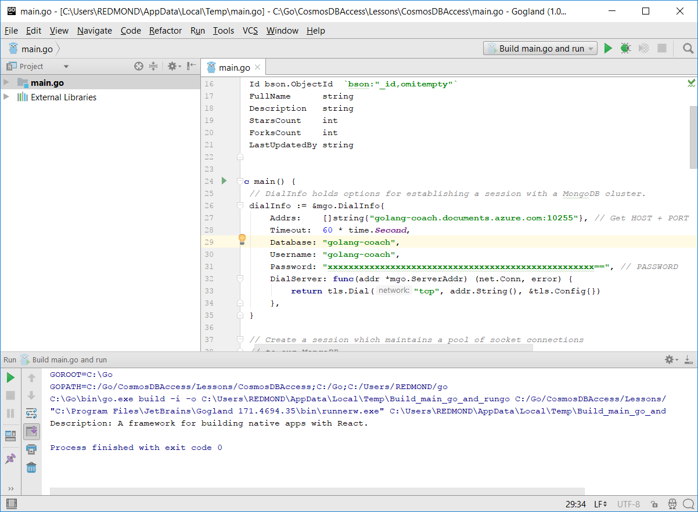

# <a name="azure-cosmos-db-build-a-mongodb-api-console-app-with-golang-and-hello-azure-portal"></a><span data-ttu-id="726da-103">Azure Cosmos DB: Een consoletoepassing MongoDB-API met Golang bouwen en hello Azure-portal</span><span class="sxs-lookup"><span data-stu-id="726da-103">Azure Cosmos DB: Build a MongoDB API console app with Golang and hello Azure portal</span></span>

<span data-ttu-id="726da-104">Azure Cosmos DB is de wereldwijd gedistribueerde multimodel-databaseservice van Microsoft.</span><span class="sxs-lookup"><span data-stu-id="726da-104">Azure Cosmos DB is Microsoft’s globally distributed multi-model database service.</span></span> <span data-ttu-id="726da-105">U kunt snel maken en query document, de sleutel/waarde en de grafiek databases, die allemaal van Hallo wereldwijde distributie en mogelijkheden van de horizontale schaal Hallo kern van Azure Cosmos DB profiteren.</span><span class="sxs-lookup"><span data-stu-id="726da-105">You can quickly create and query document, key/value, and graph databases, all of which benefit from hello global distribution and horizontal scale capabilities at hello core of Azure Cosmos DB.</span></span>

<span data-ttu-id="726da-106">Deze snel starten laat zien hoe een bestaande toouse [MongoDB](https://docs.microsoft.com/en-us/azure/cosmos-db/mongodb-introduction) app, geschreven in [Golang](https://golang.org/) en verbinding maken met het tooyour Azure DB die Cosmos-database, die ondersteuning biedt voor MongoDB-clientverbindingen.</span><span class="sxs-lookup"><span data-stu-id="726da-106">This quick-start demonstrates how toouse an existing [MongoDB](https://docs.microsoft.com/en-us/azure/cosmos-db/mongodb-introduction) app written in [Golang](https://golang.org/) and connect it tooyour Azure Cosmos DB database, which supports MongoDB client connections.</span></span>

<span data-ttu-id="726da-107">Met andere woorden, kent uw toepassing Golang alleen er wordt verbinding gemaakt met behulp van MongoDB APIs tooa-database.</span><span class="sxs-lookup"><span data-stu-id="726da-107">In other words, your Golang application only knows that it's connecting tooa database using MongoDB APIs.</span></span> <span data-ttu-id="726da-108">Is transparant toohello-toepassing die Hallo van gegevens wordt opgeslagen in Azure Cosmos DB.</span><span class="sxs-lookup"><span data-stu-id="726da-108">It is transparent toohello application that hello data is stored in Azure Cosmos DB.</span></span>

## <a name="prerequisites"></a><span data-ttu-id="726da-109">Vereisten</span><span class="sxs-lookup"><span data-stu-id="726da-109">Prerequisites</span></span>

- <span data-ttu-id="726da-110">Een Azure-abonnement.</span><span class="sxs-lookup"><span data-stu-id="726da-110">An Azure subscription.</span></span> <span data-ttu-id="726da-111">Als u nog geen abonnement op Azure hebt, maakt u een [gratis account](https://azure.microsoft.com/free) aan voordat u begint.</span><span class="sxs-lookup"><span data-stu-id="726da-111">If you don’t have an Azure subscription, create a [free account](https://azure.microsoft.com/free) before you begin.</span></span>
- <span data-ttu-id="726da-112">[Ga](https://golang.org/dl/) en basiskennis van Hallo [gaat](https://golang.org/) taal.</span><span class="sxs-lookup"><span data-stu-id="726da-112">[Go](https://golang.org/dl/) and a basic knowledge of hello [Go](https://golang.org/) language.</span></span>
- <span data-ttu-id="726da-113">Een IDE: [Gogland](https://www.jetbrains.com/go/) van Jetbrains, [Visual Studio Code](https://code.visualstudio.com/) van Microsoft of [Atom](https://atom.io/).</span><span class="sxs-lookup"><span data-stu-id="726da-113">An IDE — [Gogland](https://www.jetbrains.com/go/) by Jetbrains, [Visual Studio Code](https://code.visualstudio.com/) by Microsoft, or [Atom](https://atom.io/).</span></span> <span data-ttu-id="726da-114">In deze zelfstudie wordt Goglang gebruikt.</span><span class="sxs-lookup"><span data-stu-id="726da-114">In this tutorial, I'm using Goglang.</span></span>

<a id="create-account"></a>
## <a name="create-a-database-account"></a><span data-ttu-id="726da-115">Een databaseaccount maken</span><span class="sxs-lookup"><span data-stu-id="726da-115">Create a database account</span></span>

[!INCLUDE [cosmos-db-create-dbaccount](../../includes/cosmos-db-create-dbaccount-mongodb.md)]

## <a name="clone-hello-sample-application"></a><span data-ttu-id="726da-116">Hallo-voorbeeldtoepassing klonen</span><span class="sxs-lookup"><span data-stu-id="726da-116">Clone hello sample application</span></span>

<span data-ttu-id="726da-117">Hallo-voorbeeldtoepassing klonen en vereist hello-pakketten installeren.</span><span class="sxs-lookup"><span data-stu-id="726da-117">Clone hello sample application and install hello required packages.</span></span>

1. <span data-ttu-id="726da-118">Maak een map met de naam CosmosDBSample hello GOROOT\src map C:\Go\ is standaard.</span><span class="sxs-lookup"><span data-stu-id="726da-118">Create a folder named CosmosDBSample inside hello GOROOT\src folder, which is C:\Go\ by default.</span></span>
2. <span data-ttu-id="726da-119">Hallo volgende opdracht met een terminalvenster git zoals git bash tooclone Hallo voorbeeld-opslagplaats in Hallo CosmosDBSample map worden uitgevoerd.</span><span class="sxs-lookup"><span data-stu-id="726da-119">Run hello following command using a git terminal window such as git bash tooclone hello sample repository into hello CosmosDBSample folder.</span></span> 

    ```bash
    git clone https://github.com/Azure-Samples/azure-cosmos-db-mongodb-golang-getting-started.git
    ```
3.  <span data-ttu-id="726da-120">Hallo na de opdracht tooget Hallo mgo pakket worden uitgevoerd.</span><span class="sxs-lookup"><span data-stu-id="726da-120">Run hello following command tooget hello mgo package.</span></span> 

    ```
    go get gopkg.in/mgo.v2
    ```

<span data-ttu-id="726da-121">Hallo [mgo](http://labix.org/mgo) stuurprogramma (uitgesproken als *mango*) is een [MongoDB](http://www.mongodb.org/) stuurprogramma voor Hallo [gaat taal](http://golang.org/) die implementeert een uitgebreide en getest goed selectie van functies onder een zeer eenvoudige API standaard Ga idioms te volgen.</span><span class="sxs-lookup"><span data-stu-id="726da-121">hello [mgo](http://labix.org/mgo) driver (pronounced as *mango*) is a [MongoDB](http://www.mongodb.org/) driver for hello [Go language](http://golang.org/) that implements a rich and well tested selection of features under a very simple API following standard Go idioms.</span></span>

<a id="connection-string"></a>

## <a name="update-your-connection-string"></a><span data-ttu-id="726da-122">Uw verbindingsreeks bijwerken</span><span class="sxs-lookup"><span data-stu-id="726da-122">Update your connection string</span></span>

<span data-ttu-id="726da-123">Nu gaat u terug toohello Azure portal tooget verbindingsreeksgegevens en kopieer dit naar Hallo-app.</span><span class="sxs-lookup"><span data-stu-id="726da-123">Now go back toohello Azure portal tooget your connection string information and copy it into hello app.</span></span>

1. <span data-ttu-id="726da-124">Klik op **snel starten** in het navigatiemenu links Hallo en klik vervolgens op **andere** tooview Hallo verbindingsinformatie vereist door Hallo Ga-toepassing.</span><span class="sxs-lookup"><span data-stu-id="726da-124">Click **Quick start** in hello left navigation menu, and then click **Other** tooview hello connection string information required by hello Go application.</span></span>

2. <span data-ttu-id="726da-125">In Goglang, Hallo main.go bestand in Hallo GOROOT\CosmosDBSample directory openen en bijwerken van de volgende regels code Hallo verbindingsreeksgegevens van hello Azure-portal gebruikt, zoals wordt weergegeven in de volgende schermafbeelding Hallo Hallo.</span><span class="sxs-lookup"><span data-stu-id="726da-125">In Goglang, open hello main.go file in hello GOROOT\CosmosDBSample directory and update hello following lines of code using hello connection string information from hello Azure portal as shown in hello following screenshot.</span></span> 

    <span data-ttu-id="726da-126">Hallo-databasenaam is Hallo voorvoegsel Hallo **Host** waarde in het deelvenster voor hello Azure portal verbinding-tekenreeks.</span><span class="sxs-lookup"><span data-stu-id="726da-126">hello Database name is hello prefix of hello **Host** value in hello Azure portal connection string pane.</span></span> <span data-ttu-id="726da-127">Hallo-databasenaam is voor Hallo-account wordt weergegeven in onderstaande afbeelding voor Hallo golang-bus.</span><span class="sxs-lookup"><span data-stu-id="726da-127">For hello account shown in hello image below, hello Database name is golang-coach.</span></span>

    ```go
    Database: "hello prefix of hello Host value in hello Azure portal",
    Username: "hello Username in hello Azure portal",
    Password: "hello Password in hello Azure portal",
    ```

    

3. <span data-ttu-id="726da-129">Hallo main.go bestand opslaan.</span><span class="sxs-lookup"><span data-stu-id="726da-129">Save hello main.go file.</span></span>

## <a name="review-hello-code"></a><span data-ttu-id="726da-130">Hallo code bekijken</span><span class="sxs-lookup"><span data-stu-id="726da-130">Review hello code</span></span>

<span data-ttu-id="726da-131">We maken een kort overzicht van wat er in Hallo main.go-bestand gebeurt.</span><span class="sxs-lookup"><span data-stu-id="726da-131">Let's make a quick review of what's happening in hello main.go file.</span></span> 

### <a name="connecting-hello-go-app-tooazure-cosmos-db"></a><span data-ttu-id="726da-132">Verbinding maken met de Hallo Ga app tooAzure Cosmos-DB</span><span class="sxs-lookup"><span data-stu-id="726da-132">Connecting hello Go app tooAzure Cosmos DB</span></span>

<span data-ttu-id="726da-133">Azure Cosmos DB ondersteunt Hallo MongoDB SSL zijn ingeschakeld.</span><span class="sxs-lookup"><span data-stu-id="726da-133">Azure Cosmos DB supports hello SSL-enabled MongoDB.</span></span> <span data-ttu-id="726da-134">tooconnect tooan MongoDB SSL is ingeschakeld, moet u toodefine hello **DialServer** werken in [mgo. DialInfo](http://gopkg.in/mgo.v2#DialInfo), en maken gebruik van Hallo [tls. *Externe* ](http://golang.org/pkg/crypto/tls#Dial) tooperform Hallo verbinding werkt.</span><span class="sxs-lookup"><span data-stu-id="726da-134">tooconnect tooan SSL-enabled MongoDB, you need toodefine hello **DialServer** function in [mgo.DialInfo](http://gopkg.in/mgo.v2#DialInfo), and make use of hello [tls.*Dial*](http://golang.org/pkg/crypto/tls#Dial) function tooperform hello connection.</span></span>

<span data-ttu-id="726da-135">Hallo Golang codefragment na verbindt Hallo Ga app met Azure Cosmos DB MongoDB-API.</span><span class="sxs-lookup"><span data-stu-id="726da-135">hello following Golang code snippet connects hello Go app with Azure Cosmos DB MongoDB API.</span></span> <span data-ttu-id="726da-136">Hallo *DialInfo* klasse bevat de opties voor het tot stand brengen van een sessie met een cluster met MongoDB.</span><span class="sxs-lookup"><span data-stu-id="726da-136">hello *DialInfo* class holds options for establishing a session with a MongoDB cluster.</span></span>

```go
// DialInfo holds options for establishing a session with a MongoDB cluster.
dialInfo := &mgo.DialInfo{
    Addrs:    []string{"golang-couch.documents.azure.com:10255"}, // Get HOST + PORT
    Timeout:  60 * time.Second,
    Database: "database", // It can be anything
    Username: "username", // Username
    Password: "Azure database connect password from Azure Portal", // PASSWORD
    DialServer: func(addr *mgo.ServerAddr) (net.Conn, error) {
        return tls.Dial("tcp", addr.String(), &tls.Config{})
    },
}

// Create a session which maintains a pool of socket connections
// tooour Azure Cosmos DB MongoDB database.
session, err := mgo.DialWithInfo(dialInfo)

if err != nil {
    fmt.Printf("Can't connect toomongo, go error %v\n", err)
    os.Exit(1)
}

defer session.Close()

// SetSafe changes hello session safety mode.
// If hello safe parameter is nil, hello session is put in unsafe mode, 
// and writes become fire-and-forget,
// without error checking. hello unsafe mode is faster since operations won't hold on waiting for a confirmation.
// 
session.SetSafe(&mgo.Safe{})
```

<span data-ttu-id="726da-137">Hallo **mgo. Dial()** methode wordt gebruikt wanneer er geen SSL-verbinding is.</span><span class="sxs-lookup"><span data-stu-id="726da-137">hello **mgo.Dial()** method is used when there is no SSL connection.</span></span> <span data-ttu-id="726da-138">Voor een SSL-verbinding Hallo **mgo. DialWithInfo()** methode is vereist.</span><span class="sxs-lookup"><span data-stu-id="726da-138">For an SSL connection, hello **mgo.DialWithInfo()** method is required.</span></span>

<span data-ttu-id="726da-139">Een exemplaar van Hallo **DialWIthInfo {}** -object is gebruikte toocreate Hallo-sessieobject.</span><span class="sxs-lookup"><span data-stu-id="726da-139">An instance of hello **DialWIthInfo{}** object is used toocreate hello session object.</span></span> <span data-ttu-id="726da-140">Zodra het Hallo-sessie tot stand is gebracht, kunt u Hallo verzameling kunt openen met behulp van de volgende codefragment Hallo:</span><span class="sxs-lookup"><span data-stu-id="726da-140">Once hello session is established, you can access hello collection by using hello following code snippet:</span></span>

```go
collection := session.DB(“database”).C(“package”)
```

<a id="create-document"></a>

### <a name="create-a-document"></a><span data-ttu-id="726da-141">Een document maken</span><span class="sxs-lookup"><span data-stu-id="726da-141">Create a document</span></span>

```go
// Model
type Package struct {
    Id bson.ObjectId  `bson:"_id,omitempty"`
    FullName      string
    Description   string
    StarsCount    int
    ForksCount    int
    LastUpdatedBy string
}

// insert Document in collection
err = collection.Insert(&Package{
    FullName:"react",
    Description:"A framework for building native apps with React.",
    ForksCount: 11392,
    StarsCount:48794,
    LastUpdatedBy:"shergin",

})

if err != nil {
    log.Fatal("Problem inserting data: ", err)
    return
}
```

### <a name="query-or-read-a-document"></a><span data-ttu-id="726da-142">Query's uitvoeren voor een document of een document lezen</span><span class="sxs-lookup"><span data-stu-id="726da-142">Query or read a document</span></span>

<span data-ttu-id="726da-143">Azure Cosmos DB biedt ondersteuning voor uitgebreide query's voor de JSON-documenten die zijn opgeslagen in elke verzameling.</span><span class="sxs-lookup"><span data-stu-id="726da-143">Azure Cosmos DB supports rich queries against JSON documents stored in each collection.</span></span> <span data-ttu-id="726da-144">Hallo ziet volgende voorbeeldcode u een query die u op Hallo documenten in uw verzameling uitvoeren kunt.</span><span class="sxs-lookup"><span data-stu-id="726da-144">hello following sample code shows a query that you can run against hello documents in your collection.</span></span>

```go
// Get a Document from hello collection
result := Package{}
err = collection.Find(bson.M{"fullname": "react"}).One(&result)
if err != nil {
    log.Fatal("Error finding record: ", err)
    return
}

fmt.Println("Description:", result.Description)
```


### <a name="update-a-document"></a><span data-ttu-id="726da-145">Een document bijwerken</span><span class="sxs-lookup"><span data-stu-id="726da-145">Update a document</span></span>

```go
// Update a document
updateQuery := bson.M{"_id": result.Id}
change := bson.M{"$set": bson.M{"fullname": "react-native"}}
err = collection.Update(updateQuery, change)
if err != nil {
    log.Fatal("Error updating record: ", err)
    return
}
```

### <a name="delete-a-document"></a><span data-ttu-id="726da-146">Een document verwijderen</span><span class="sxs-lookup"><span data-stu-id="726da-146">Delete a document</span></span>

<span data-ttu-id="726da-147">Azure Cosmos DB biedt ondersteuning voor het verwijderen van JSON-documenten.</span><span class="sxs-lookup"><span data-stu-id="726da-147">Azure Cosmos DB supports deleting JSON documents.</span></span>

```go
// Delete a document
query := bson.M{"_id": result.Id}
err = collection.Remove(query)
if err != nil {
   log.Fatal("Error deleting record: ", err)
   return
}
```
    
## <a name="run-hello-app"></a><span data-ttu-id="726da-148">Hallo-app uitvoeren</span><span class="sxs-lookup"><span data-stu-id="726da-148">Run hello app</span></span>

1. <span data-ttu-id="726da-149">Goglang, zorg ervoor dat in uw GOPATH (onder **bestand**, **instellingen**, **gaat**, **GOPATH**) Hallo locatie in welke Hallo opnemen gopkg is, welke USERPROFILE\go is standaard geïnstalleerd.</span><span class="sxs-lookup"><span data-stu-id="726da-149">In Goglang, ensure that your GOPATH (available under **File**, **Settings**, **Go**, **GOPATH**) include hello location in which hello gopkg was installed, which is USERPROFILE\go by default.</span></span> 
2. <span data-ttu-id="726da-150">Hallo-regels die Hallo document, regels 91-96 verwijderen uitcommentariëren zodat u Hallo document na actieve Hallo-app kunt zien.</span><span class="sxs-lookup"><span data-stu-id="726da-150">Comment out hello lines that delete hello document, lines 91-96, so that you can see hello document after running hello app.</span></span>
3. <span data-ttu-id="726da-151">In Goglang klikt u op **Uitvoeren** en daarna op **'Build main.go and run' uitvoeren**.</span><span class="sxs-lookup"><span data-stu-id="726da-151">In Goglang, click **Run**, and then click **Run 'Build main.go and run'**.</span></span>

    <span data-ttu-id="726da-152">Hallo-app is voltooid en geeft weer Hallo beschrijving van Hallo document dat is gemaakt [maken van een document](#create-document).</span><span class="sxs-lookup"><span data-stu-id="726da-152">hello app finishes and displays hello description of hello document created in [Create a document](#create-document).</span></span>
    
    ```
    Description: A framework for building native apps with React.
    
    Process finished with exit code 0
    ```

    
    
## <a name="review-your-document-in-data-explorer"></a><span data-ttu-id="726da-154">Uw document bekijken in Data Explorer</span><span class="sxs-lookup"><span data-stu-id="726da-154">Review your document in Data Explorer</span></span>

<span data-ttu-id="726da-155">Ga terug toohello Azure portal toosee uw document in Data Explorer.</span><span class="sxs-lookup"><span data-stu-id="726da-155">Go back toohello Azure portal toosee your document in Data Explorer.</span></span>

1. <span data-ttu-id="726da-156">Klik op **Data Explorer (Preview)** Vouw in het linkerdeelvenster navigatiemenu Hallo **golang bus**, **pakket**, en klik vervolgens op **documenten**.</span><span class="sxs-lookup"><span data-stu-id="726da-156">Click **Data Explorer (Preview)** in hello left navigation menu, expand **golang-coach**, **package**, and then click **Documents**.</span></span> <span data-ttu-id="726da-157">In Hallo **documenten** en klik op Hallo \_id toodisplay Hallo document in het rechterdeelvenster Hallo.</span><span class="sxs-lookup"><span data-stu-id="726da-157">In hello **Documents** tab, click hello \_id toodisplay hello document in hello right pane.</span></span> 

    
    
2. <span data-ttu-id="726da-159">U kunt vervolgens werkt met Hallo document inline en klikt u op **Update** toosave deze.</span><span class="sxs-lookup"><span data-stu-id="726da-159">You can then work with hello document inline and click **Update** toosave it.</span></span> <span data-ttu-id="726da-160">U kunt ook Hallo document verwijderen of maken van nieuwe documenten of query's.</span><span class="sxs-lookup"><span data-stu-id="726da-160">You can also delete hello document, or create new documents or queries.</span></span>

## <a name="review-slas-in-hello-azure-portal"></a><span data-ttu-id="726da-161">Sla's bekijken in hello Azure-portal</span><span class="sxs-lookup"><span data-stu-id="726da-161">Review SLAs in hello Azure portal</span></span>

[!INCLUDE [cosmosdb-tutorial-review-slas](../../includes/cosmos-db-tutorial-review-slas.md)]

## <a name="clean-up-resources"></a><span data-ttu-id="726da-162">Resources opschonen</span><span class="sxs-lookup"><span data-stu-id="726da-162">Clean up resources</span></span>

<span data-ttu-id="726da-163">Als u deze app niet toocontinue toouse gaat, verwijdert u alle resources die zijn gemaakt door deze snelstartgids in hello Azure-portal met Hallo stappen te volgen:</span><span class="sxs-lookup"><span data-stu-id="726da-163">If you're not going toocontinue toouse this app, delete all resources created by this quickstart in hello Azure portal with hello following steps:</span></span>

1. <span data-ttu-id="726da-164">Hallo links menu in hello Azure-portal en klik op **resourcegroepen** en klik vervolgens op Hallo-naam van het Hallo-resource die u hebt gemaakt.</span><span class="sxs-lookup"><span data-stu-id="726da-164">From hello left-hand menu in hello Azure portal, click **Resource groups** and then click hello name of hello resource you created.</span></span> 
2. <span data-ttu-id="726da-165">Klik op de pagina van de groep resource **verwijderen**, typ de naam Hallo van Hallo resource toodelete in Hallo tekstvak en klik op **verwijderen**.</span><span class="sxs-lookup"><span data-stu-id="726da-165">On your resource group page, click **Delete**, type hello name of hello resource toodelete in hello text box, and then click **Delete**.</span></span>

## <a name="next-steps"></a><span data-ttu-id="726da-166">Volgende stappen</span><span class="sxs-lookup"><span data-stu-id="726da-166">Next steps</span></span>

<span data-ttu-id="726da-167">In deze snelstartgids hebt u geleerd hoe toocreate een Cosmos-DB Azure-account en voer een Golang app met Hallo API voor MongoDB.</span><span class="sxs-lookup"><span data-stu-id="726da-167">In this quickstart, you've learned how toocreate an Azure Cosmos DB account and run a Golang app using hello API for MongoDB.</span></span> <span data-ttu-id="726da-168">U kunt nu aanvullende gegevens tooyour Cosmos DB account importeren.</span><span class="sxs-lookup"><span data-stu-id="726da-168">You can now import additional data tooyour Cosmos DB account.</span></span> 

> [!div class="nextstepaction"]
> [<span data-ttu-id="726da-169">Gegevens importeren in Azure Cosmos DB voor Hallo MongoDB-API</span><span class="sxs-lookup"><span data-stu-id="726da-169">Import data into Azure Cosmos DB for hello MongoDB API</span></span>](mongodb-migrate.md)
