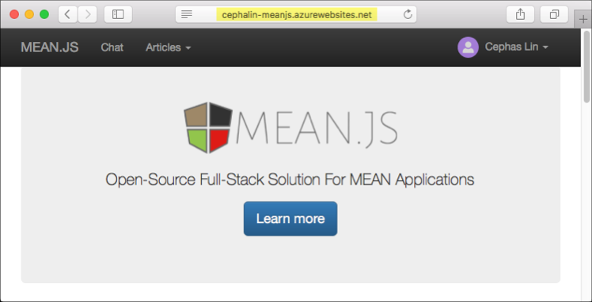
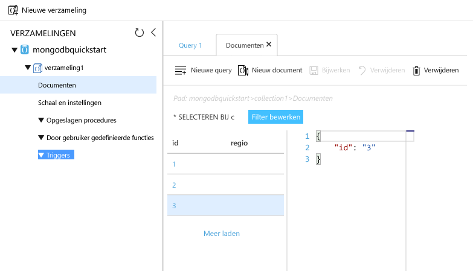

# <a name="azure-cosmos-db-migrate-an-existing-nodejs-mongodb-web-app"></a>Azure Cosmos DB: een bestaande Node.js MongoDB-web-app migreren 

Azure Cosmos DB is de wereldwijd gedistribueerde multimodel-databaseservice van Microsoft. U kunt snel maken en query document, de sleutel/waarde en de grafiek databases, die allemaal van Hallo wereldwijde distributie en mogelijkheden van de horizontale schaal Hallo kern van Azure Cosmos DB profiteren. 

Deze snelstartgids demonstreert hoe een bestaande toouse [MongoDB](mongodb-introduction.md) app, geschreven in Node.js en verbinding maken met het tooyour Azure DB die Cosmos-database, die ondersteuning biedt voor MongoDB-clientverbindingen. Met andere woorden, kent uw Node.js-toepassing alleen er wordt verbinding gemaakt met behulp van MongoDB APIs tooa-database. Is transparant toohello-toepassing die Hallo van gegevens wordt opgeslagen in Azure Cosmos DB.

Als u klaar bent, beschikt u over een MEAN-toepassing (MongoDB, Express, AngularJS en Node.js) die wordt uitgevoerd op [Azure Cosmos DB](https://azure.microsoft.com/services/cosmos-db/). 




[!INCLUDE [cloud-shell-try-it](../../includes/cloud-shell-try-it.md)]

Als u tooinstall kiest en Hallo CLI lokaal gebruiken, wordt in dit onderwerp vereist dat u hello Azure CLI versie 2.0 of hoger worden uitgevoerd. Voer `az --version` toofind Hallo versie. Als u tooinstall of upgrade nodig hebt, raadpleegt u [2.0 voor Azure CLI installeren]( /cli/azure/install-azure-cli). 

## <a name="prerequisites"></a>Vereisten 
Bovendien tooAzure CLI, moet u [Node.js](https://nodejs.org/) en [Git](http://www.git-scm.com/downloads) lokaal toorun geïnstalleerd `npm` en `git` opdrachten.

U moet bekend zijn met de basisbegrippen van Node.js. Deze snelstartgids is niet bedoeld toohelp u met het ontwikkelen van Node.js-toepassingen in het algemeen.

## <a name="clone-hello-sample-application"></a>Hallo-voorbeeldtoepassing klonen

Open een git-terminalvenster zoals git bash en en `cd` tooa werkmap.  

Hallo na opdrachten tooclone Hallo voorbeeld opslagplaats worden uitgevoerd. Deze voorbeeld-bibliotheek bevat standaard Hallo [MEAN.js](http://meanjs.org/) toepassing. 

```bash
git clone https://github.com/prashanthmadi/mean
```

## <a name="run-hello-application"></a>Hallo-toepassing uitvoeren

Vereist hello-pakketten installeren en start de toepassing hello.

```bash
cd mean
npm install
npm start
```

## <a name="log-in-tooazure"></a>Meld u bij tooAzure

Als u van een geïnstalleerde Azure CLI gebruikmaakt, meldt u zich in Azure-abonnement met Hallo tooyour [az aanmelding](/cli/azure/#login) opdracht in en volg Hallo op het scherm instructies. U kunt deze stap overslaan als u hello Azure Cloud-Shell.

```azurecli
az login 
``` 
   
## <a name="add-hello-azure-cosmos-db-module"></a>Hello Azure Cosmos DB-module toevoegen

Als u van een geïnstalleerde Azure CLI gebruikmaakt, controleert u toosee als hello `cosmosdb` onderdeel al is geïnstalleerd door het uitvoeren van Hallo `az` opdracht. Als `cosmosdb` in lijst met opdrachten base Hallo, gaan de volgende opdracht toohello is. U kunt deze stap overslaan als u hello Azure Cloud-Shell.

Als `cosmosdb` is niet in lijst met opdrachten base Hallo, installeer [Azure CLI 2.0]( /cli/azure/install-azure-cli).

## <a name="create-a-resource-group"></a>Een resourcegroep maken

Maak een [resourcegroep](../azure-resource-manager/resource-group-overview.md) Hello [az groep maken](/cli/azure/group#create). Een Azure-resourcegroep is een logische container waarin Azure-resources, zoals web-apps, databases en opslagaccounts, worden geïmplementeerd en beheerd. 

Hallo maakt volgende voorbeeld een resourcegroep in de regio West-Europa Hallo. Kies een unieke naam voor de resourcegroep Hallo.

Als u van Azure Cloud-Shell gebruikmaakt, klikt u op **probeert het**, volg Hallo aanwijzingen toologin en Hallo-opdracht kopiëren naar het Hallo-opdrachtprompt.

```azurecli-interactive
az group create --name myResourceGroup --location "West Europe"
```

## <a name="create-an-azure-cosmos-db-account"></a>Maak een Azure Cosmos DB-account

Een Azure DB die Cosmos-account maken met de Hallo [az cosmosdb maken](/cli/azure/cosmosdb#create) opdracht.

In Hallo opdracht, na Neem vervangen door uw eigen unieke Azure DB die Cosmos-accountnaam waar u Hallo zien `<cosmosdb-name>` tijdelijke aanduiding. Deze unieke naam wordt gebruikt als onderdeel van uw Azure DB die Cosmos-eindpunt (`https://<cosmosdb-name>.documents.azure.com/`), zodat het Hallo-naam moet toobe unieke alle Azure DB die Cosmos-accounts in Azure. 

```azurecli-interactive
az cosmosdb create --name <cosmosdb-name> --resource-group myResourceGroup --kind MongoDB
```

Hallo `--kind MongoDB` parameter zorgt ervoor dat MongoDB-clientverbindingen.

Wanneer hello Azure DB die Cosmos-account is gemaakt, ziet u hello Azure CLI informatie vergelijkbare toohello voorbeeld te volgen. 

> [!NOTE]
> In dit voorbeeld gebruikt JSON als hello Azure CLI uitvoerindeling, Hallo standaard. een andere uitvoer toouse indeling, Zie [uitvoerindelingen voor Azure CLI 2.0 opdrachten](https://docs.microsoft.com/cli/azure/format-output-azure-cli).

```json
{
  "databaseAccountOfferType": "Standard",
  "documentEndpoint": "https://<cosmosdb-name>.documents.azure.com:443/",
  "id": "/subscriptions/00000000-0000-0000-0000-000000000000/resourceGroups/myResourceGroup/providers/Microsoft.Document
DB/databaseAccounts/<cosmosdb-name>",
  "kind": "MongoDB",
  "location": "West Europe",
  "name": "<cosmosdb-name>",
  "readLocations": [
    {
      "documentEndpoint": "https://<cosmosdb-name>-westeurope.documents.azure.com:443/",
      "failoverPriority": 0,
      "id": "<cosmosdb-name>-westeurope",
      "locationName": "West Europe",
      "provisioningState": "Succeeded"
    }
  ],
  "resourceGroup": "myResourceGroup",
  "type": "Microsoft.DocumentDB/databaseAccounts",
  "writeLocations": [
    {
      "documentEndpoint": "https://<cosmosdb-name>-westeurope.documents.azure.com:443/",
      "failoverPriority": 0,
      "id": "<cosmosdb-name>-westeurope",
      "locationName": "West Europe",
      "provisioningState": "Succeeded"
    }
  ]
} 
```

## <a name="connect-your-nodejs-application-toohello-database"></a>Verbinding maken met uw Node.js-toepassing toohello database

In deze stap maakt u verbinding maken uw MEAN.js toepassing tooan Azure Cosmos DB voorbeelddatabase die u zojuist hebt gemaakt, met een verbindingsreeks voor MongoDB. 

<a name="devconfig"></a>
## <a name="configure-hello-connection-string-in-your-nodejs-application"></a>Hallo-verbindingsreeks configureren in uw Node.js-toepassing

Open `config/env/local-development.js` in uw MEAN.js-opslagplaats.

Hallo-inhoud van dit bestand vervangen door Hallo code te volgen. Zorg ervoor dat tooalso vervangen Hallo twee `<cosmosdb-name>` tijdelijke aanduidingen door de naam van uw Azure Cosmos DB.

```javascript
'use strict';

module.exports = {
  db: {
    uri: 'mongodb://<cosmosdb-name>:<primary_master_key>@<cosmosdb-name>.documents.azure.com:10255/mean-dev?ssl=true&sslverifycertificate=false'
  }
};
```

## <a name="retrieve-hello-key"></a>Hallo-sleutel ophalen

In de volgorde tooconnect tooan Azure DB die Cosmos-database moet u Hallo databasesleutel. Gebruik Hallo [az cosmosdb lijst-sleutels](/cli/azure/cosmosdb#list-keys) opdracht tooretrieve Hallo primaire sleutel.

```azurecli-interactive
az cosmosdb list-keys --name <cosmosdb-name> --resource-group myResourceGroup --query "primaryMasterKey"
```

Hello Azure CLI levert informatie vergelijkbare toohello voorbeeld te volgen. 

```json
"RUayjYjixJDWG5xTqIiXjC..."
```

Hallo-waarde van kopiëren `primaryMasterKey`. Plak dit via Hallo `<primary_master_key>` in `local-development.js`.

Sla uw wijzigingen op.

### <a name="run-hello-application-again"></a>Hallo toepassing opnieuw uitvoeren.

Voer `npm start` opnieuw uit. 

```bash
npm start
```

Een consolebericht moet u nu vertellen dat die Hallo ontwikkelings-omgeving actief is. 

Navigeer te`http://localhost:3000` in een browser. Klik op **aanmelden** in de bovenste menu en probeer het toocreate Hallo twee testupdate worden uitgevoerd van gebruikers. 

Hallo MEAN.js voorbeeldtoepassing slaat gebruikersgegevens in Hallo-database. Als u geslaagde en MEAN.js automatisch zich aanmeldt bij Hallo gebruiker gemaakt en de Azure DB die Cosmos-verbinding werkt. 


## <a name="view-data-in-data-explorer"></a>Gegevens bekijken in Data Explorer

Gegevens die zijn opgeslagen door een Cosmos Azure DB is beschikbaar tooview query en voer bedrijfslogica ingeschakeld in hello Azure-portal.

tooview, opvragen en werken met gebruikersgegevens Hallo gemaakt in Hallo vorige stap, aanmelding toohello [Azure-portal](https://portal.azure.com) in uw webbrowser.

Typ in Hallo top zoekvak Azure Cosmos DB. Wanneer uw Cosmos DB-accountblade wordt geopend, selecteert u uw Cosmos DB-account. Klik in het Hallo linkernavigatiebalk, Data Explorer. Vouw uw verzameling in hello verzamelingen deelvenster en vervolgens u kunt Hallo documenten weergeven in de verzameling hello, Hallo-gegevens opvragen, en zelfs maken en opgeslagen procedures, triggers en UDF's worden uitgevoerd. 




## <a name="deploy-hello-nodejs-application-tooazure"></a>Hallo Node.js-toepassing tooAzure implementeren

In deze stap maakt implementeren u uw MongoDB verbonden Node.js-toepassing tooAzure Cosmos DB.

Hebt u wellicht dat Hallo-configuratiebestand dat u eerder hebt gewijzigd is voor Hallo-ontwikkelomgeving (`/config/env/local-development.js`). Wanneer u uw toepassing tooApp Service implementeert, wordt deze standaard in de productieomgeving Hallo uitgevoerd. U moet nu dus toomake Hallo dezelfde toohello respectieve configuratiebestand wijzigen.

Open `config/env/production.js` in uw MEAN.js-opslagplaats.

In Hallo `db` object, vervang de waarde Hallo van `uri` net als in het volgende voorbeeld Hallo weergeven. Worden ervoor tooreplace Hallo tijdelijke aanduidingen als voor.

```javascript
'mongodb://<cosmosdb-name>:<primary_master_key>@<cosmosdb-name>.documents.azure.com:10255/mean?ssl=true&sslverifycertificate=false',
```

> [!NOTE] 
> Hallo `ssl=true` optie is belangrijk omdat [SSL is vereist voor Azure Cosmos DB](connect-mongodb-account.md#connection-string-requirements). 
>
>

In terminal hello, alle uw wijzigingen in Git. U kunt beide toorun opdrachten kopiëren ze samen.

```bash
git add .
git commit -m "configured MongoDB connection string"
```
## <a name="clean-up-resources"></a>Resources opschonen

Als u deze app niet toocontinue toouse gaat, verwijdert u alle resources die zijn gemaakt door deze snelstartgids in hello Azure-portal met Hallo stappen te volgen:

1. Hallo links menu in hello Azure-portal en klik op **resourcegroepen** en klik vervolgens op Hallo-naam van het Hallo-resource die u hebt gemaakt. 
2. Klik op de pagina van de groep resource **verwijderen**, typ de naam Hallo van Hallo resource toodelete in Hallo tekstvak en klik op **verwijderen**.

## <a name="next-steps"></a>Volgende stappen

In deze snelstartgids hebt u geleerd hoe een Cosmos Azure DB toocreate account en een Hallo Data Explorer met MongoDB-verzameling maken. U kunt nu uw MongoDB gegevens tooAzure Cosmos DB migreren.  

> [!div class="nextstepaction"]
> [MongoDB-gegevens importeren in Azure Cosmos DB](mongodb-migrate.md)
