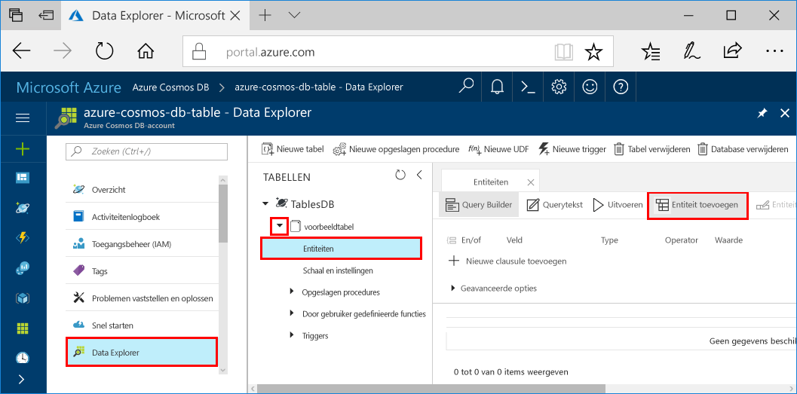

# <a name="azure-cosmos-db-build-a-net-application-using-the-table-api"></a><span data-ttu-id="f8a51-103">Azure Cosmos DB: een .NET-toepassing ontwikkelen met de Table-API</span><span class="sxs-lookup"><span data-stu-id="f8a51-103">Azure Cosmos DB: Build a .NET application using the Table API</span></span>

<span data-ttu-id="f8a51-104">Azure Cosmos DB is de globaal gedistribueerde multimodel-databaseservice van Microsoft.</span><span class="sxs-lookup"><span data-stu-id="f8a51-104">Azure Cosmos DB is Microsoft’s globally distributed multi-model database service.</span></span> <span data-ttu-id="f8a51-105">U kunt snel databases maken van documenten, sleutel/waarde-paren en grafieken en hier query’s op uitvoeren. Deze databases genieten allemaal het voordeel van de globale distributie en horizontale schaalmogelijkheden die ten grondslag liggen aan Azure Cosmos DB.</span><span class="sxs-lookup"><span data-stu-id="f8a51-105">You can quickly create and query document, key/value, and graph databases, all of which benefit from the global distribution and horizontal scale capabilities at the core of Azure Cosmos DB.</span></span> 

<span data-ttu-id="f8a51-106">Deze Quick Start laat zien hoe u een Azure Cosmos DB-account en een tabel binnen dat account kunt maken met behulp van de Azure Portal.</span><span class="sxs-lookup"><span data-stu-id="f8a51-106">This quick start demonstrates how to create an Azure Cosmos DB account, and create a table within that account using the Azure portal.</span></span> <span data-ttu-id="f8a51-107">U moet vervolgens code schrijven om entiteiten in te voegen, bij te werken en te verwijderen en enkele query's uit te voeren met behulp van het nieuwe [Windows Azure Storage Premium Table](https://aka.ms/premiumtablenuget)-pakket (preview) van NuGet.</span><span class="sxs-lookup"><span data-stu-id="f8a51-107">You'll then write code to insert, update, and delete entities, and run some queries using the new [Windows Azure Storage Premium Table](https://aka.ms/premiumtablenuget) (preview) package from NuGet.</span></span> <span data-ttu-id="f8a51-108">Deze bibliotheek heeft dezelfde klassen en handtekeningen voor methodes als de openbare [Windows Azure Storage SDK](https://www.nuget.org/packages/WindowsAzure.Storage), maar biedt ook de mogelijkheid verbinding te maken met Azure Cosmos DB-accounts met behulp van de [Table-API](table-introduction.md) (preview).</span><span class="sxs-lookup"><span data-stu-id="f8a51-108">This library has the same classes and method signatures as the public [Windows Azure Storage SDK](https://www.nuget.org/packages/WindowsAzure.Storage), but also has the ability to connect to Azure Cosmos DB accounts using the [Table API](table-introduction.md) (preview).</span></span> 

## <a name="prerequisites"></a><span data-ttu-id="f8a51-109">Vereisten</span><span class="sxs-lookup"><span data-stu-id="f8a51-109">Prerequisites</span></span>

<span data-ttu-id="f8a51-110">Als u Visual Studio 2017 nog niet hebt geïnstalleerd, kunt u het downloaden en de **gratis** [Community Edition van Visual Studio 2017](https://www.visualstudio.com/downloads/) gebruiken.</span><span class="sxs-lookup"><span data-stu-id="f8a51-110">If you don’t already have Visual Studio 2017 installed, you can download and use the **free** [Visual Studio 2017 Community Edition](https://www.visualstudio.com/downloads/).</span></span> <span data-ttu-id="f8a51-111">Zorg ervoor dat u **Azure-ontwikkeling** inschakelt tijdens de installatie van Visual Studio.</span><span class="sxs-lookup"><span data-stu-id="f8a51-111">Make sure that you enable **Azure development** during the Visual Studio setup.</span></span>

[!INCLUDE [quickstarts-free-trial-note](../../includes/quickstarts-free-trial-note.md)]

## <a name="create-a-database-account"></a><span data-ttu-id="f8a51-112">Een databaseaccount maken</span><span class="sxs-lookup"><span data-stu-id="f8a51-112">Create a database account</span></span>

[!INCLUDE [cosmos-db-create-dbaccount-table](../../includes/cosmos-db-create-dbaccount-table.md)]

## <a name="add-a-table"></a><span data-ttu-id="f8a51-113">Een tabel toevoegen</span><span class="sxs-lookup"><span data-stu-id="f8a51-113">Add a table</span></span>

[!INCLUDE [cosmos-db-create-table](../../includes/cosmos-db-create-table.md)]

## <a name="add-sample-data"></a><span data-ttu-id="f8a51-114">Voorbeeldgegevens toevoegen</span><span class="sxs-lookup"><span data-stu-id="f8a51-114">Add sample data</span></span>

<span data-ttu-id="f8a51-115">U kunt nu gegevens aan uw nieuwe tabel toevoegen met behulp van Data Explorer (Preview).</span><span class="sxs-lookup"><span data-stu-id="f8a51-115">You can now add data to your new table using Data Explorer (Preview).</span></span>

1. <span data-ttu-id="f8a51-116">Vouw in Data Explorer **sample-table** uit, klik op **Entiteiten** en klik vervolgens op **Entiteit toevoegen**.</span><span class="sxs-lookup"><span data-stu-id="f8a51-116">In Data Explorer, expand **sample-table**, click **Entities**, and then click **Add Entity**.</span></span>

   
2. <span data-ttu-id="f8a51-118">Voeg nu gegevens toe aan de vakken met een waarde voor PartitionKey en RowKey en klik op **Entiteit toevoegen**.</span><span class="sxs-lookup"><span data-stu-id="f8a51-118">Now add data to the PartitionKey value box and RowKey value box, and click **Add Entity**.</span></span>

   
  
    <span data-ttu-id="f8a51-120">U kunt nu meer entiteiten toevoegen aan uw tabel, uw entiteiten bewerken of een query op uw gegevens uitvoeren in Data Explorer.</span><span class="sxs-lookup"><span data-stu-id="f8a51-120">You can now add more entities to your table, edit your entities, or query your data in Data Explorer.</span></span> <span data-ttu-id="f8a51-121">Data Explorer is ook de plek waar u uw doorvoer kunt schalen en opgeslagen procedures, door de gebruiker gedefinieerde functies en triggers aan uw tabel kunt toevoegen.</span><span class="sxs-lookup"><span data-stu-id="f8a51-121">Data Explorer is also where you can scale your throughput and add stored procedures, user defined functions, and triggers to your table.</span></span>

## <a name="clone-the-sample-application"></a><span data-ttu-id="f8a51-122">De voorbeeldtoepassing klonen</span><span class="sxs-lookup"><span data-stu-id="f8a51-122">Clone the sample application</span></span>

<span data-ttu-id="f8a51-123">We gaan nu een Table-app klonen vanaf GitHub, de verbindingsreeks instellen en de app uitvoeren.</span><span class="sxs-lookup"><span data-stu-id="f8a51-123">Now let's clone a Table app from github, set the connection string, and run it.</span></span> <span data-ttu-id="f8a51-124">U zult zien hoe gemakkelijk het is om op een programmatische manier met gegevens te werken.</span><span class="sxs-lookup"><span data-stu-id="f8a51-124">You'll see how easy it is to work with data programmatically.</span></span> 

1. <span data-ttu-id="f8a51-125">Open een venster in een git-terminal zoals git bash en `cd` naar een werkmap.</span><span class="sxs-lookup"><span data-stu-id="f8a51-125">Open a git terminal window, such as git bash, and `cd` to a working directory.</span></span>  

2. <span data-ttu-id="f8a51-126">Voer de volgende opdracht uit om de voorbeeldopslagplaats te klonen.</span><span class="sxs-lookup"><span data-stu-id="f8a51-126">Run the following command to clone the sample repository.</span></span> 

    ```bash
    git clone https://github.com/Azure-Samples/azure-cosmos-db-table-dotnet-getting-started.git
    ```

3. <span data-ttu-id="f8a51-127">Open vervolgens het oplossingenbestand in Visual Studio.</span><span class="sxs-lookup"><span data-stu-id="f8a51-127">Then open the solution file in Visual Studio.</span></span> 

## <a name="review-the-code"></a><span data-ttu-id="f8a51-128">De code bekijken</span><span class="sxs-lookup"><span data-stu-id="f8a51-128">Review the code</span></span>

<span data-ttu-id="f8a51-129">Laten we eens kijken wat er precies gebeurt in de app.</span><span class="sxs-lookup"><span data-stu-id="f8a51-129">Let's make a quick review of what's happening in the app.</span></span> <span data-ttu-id="f8a51-130">Open het bestand Program.cs en u zult zien dat deze regels code de Azure Cosmos DB-resources maken.</span><span class="sxs-lookup"><span data-stu-id="f8a51-130">Open the Program.cs file and you'll find that these lines of code create the Azure Cosmos DB resources.</span></span> 

* <span data-ttu-id="f8a51-131">De CloudTableClient is geïnitialiseerd.</span><span class="sxs-lookup"><span data-stu-id="f8a51-131">The CloudTableClient is initialized.</span></span>

    ```csharp
    CloudStorageAccount storageAccount = CloudStorageAccount.Parse(connectionString); 
    CloudTableClient tableClient = storageAccount.CreateCloudTableClient();
    ```

* <span data-ttu-id="f8a51-132">Er wordt een nieuwe tabel gemaakt als er nog geen tabel bestaat.</span><span class="sxs-lookup"><span data-stu-id="f8a51-132">A new table is created if it does not exist.</span></span>

    ```csharp
    CloudTable table = tableClient.GetTableReference("people");
    table.CreateIfNotExists();
    ```

* <span data-ttu-id="f8a51-133">Er wordt een nieuwe Table-container gemaakt.</span><span class="sxs-lookup"><span data-stu-id="f8a51-133">A new Table container is created.</span></span> <span data-ttu-id="f8a51-134">Deze code is vergelijkbaar met de reguliere code van de Azure Table Storage-SDK.</span><span class="sxs-lookup"><span data-stu-id="f8a51-134">You will notice this code very similar to regular Azure Table storage SDK.</span></span> 

    ```csharp
    CustomerEntity item = new CustomerEntity()
                {
                    PartitionKey = Guid.NewGuid().ToString(),
                    RowKey = Guid.NewGuid().ToString(),
                    Email = $"{GetRandomString(6)}@contoso.com",
                    PhoneNumber = "425-555-0102",
                    Bio = GetRandomString(1000)
                };
    ```

## <a name="update-your-connection-string"></a><span data-ttu-id="f8a51-135">Uw verbindingsreeks bijwerken</span><span class="sxs-lookup"><span data-stu-id="f8a51-135">Update your connection string</span></span>

<span data-ttu-id="f8a51-136">We werken nu de verbindingsreeksinformatie bij, zodat uw app kan communiceren met Azure Cosmos DB.</span><span class="sxs-lookup"><span data-stu-id="f8a51-136">Now we'll update the connection string information so your app can talk to Azure Cosmos DB.</span></span> 

1. <span data-ttu-id="f8a51-137">In Visual Studio opent u het bestand app.config.</span><span class="sxs-lookup"><span data-stu-id="f8a51-137">In Visual Studio, open the app.config file.</span></span> 

2. <span data-ttu-id="f8a51-138">In [Azure Portal](http://portal.azure.com/) klikt u in het Azure Cosmos DB-navigatiemenu links op **Verbindingsreeks**.</span><span class="sxs-lookup"><span data-stu-id="f8a51-138">In the [Azure portal](http://portal.azure.com/), in the Azure Cosmos DB left navigation menu, click **Connection String**.</span></span> <span data-ttu-id="f8a51-139">Klik vervolgens in het nieuwe deelvenster op de knop Kopiëren voor de verbindingsreeks.</span><span class="sxs-lookup"><span data-stu-id="f8a51-139">Then in the new pane click the copy button for the connection string.</span></span> 

    

3. <span data-ttu-id="f8a51-141">Plak de waarde in het bestand app.config als de waarde van de PremiumStorageConnectionString.</span><span class="sxs-lookup"><span data-stu-id="f8a51-141">Paste the value into the app.config file as the value of the PremiumStorageConnectionString.</span></span> 

    `<add key="PremiumStorageConnectionString" 
        value="DefaultEndpointsProtocol=https;AccountName=MYSTORAGEACCOUNT;AccountKey=AUTHKEY;TableEndpoint=https://COSMOSDB.documents.azure.com" />`    

    <span data-ttu-id="f8a51-142">U kunt de StandardStorageConnectionString ongewijzigd laten.</span><span class="sxs-lookup"><span data-stu-id="f8a51-142">You can leave the StandardStorageConnectionString as is.</span></span>

<span data-ttu-id="f8a51-143">U hebt uw app nu bijgewerkt met alle informatie die nodig is voor de communicatie met Azure Cosmos DB.</span><span class="sxs-lookup"><span data-stu-id="f8a51-143">You've now updated your app with all the info it needs to communicate with Azure Cosmos DB.</span></span> 

## <a name="run-the-web-app"></a><span data-ttu-id="f8a51-144">De web-app uitvoeren</span><span class="sxs-lookup"><span data-stu-id="f8a51-144">Run the web app</span></span>

1. <span data-ttu-id="f8a51-145">Klik in Visual Studio met de rechtermuisknop op het project in **PremiumTableGetStarted** in **Solution Explorer** en klik vervolgens op **NuGet-pakketten beheren**.</span><span class="sxs-lookup"><span data-stu-id="f8a51-145">In Visual Studio, right-click on the **PremiumTableGetStarted** project in **Solution Explorer** and then click **Manage NuGet Packages**.</span></span> 

2. <span data-ttu-id="f8a51-146">Typ in het vak **Bladeren** in NuGet *WindowsAzure.Storage-PremiumTable*.</span><span class="sxs-lookup"><span data-stu-id="f8a51-146">In the NuGet **Browse** box, type *WindowsAzure.Storage-PremiumTable*.</span></span>

3. <span data-ttu-id="f8a51-147">Controleer het vak **Prerelease insluiten**.</span><span class="sxs-lookup"><span data-stu-id="f8a51-147">Check the **Include prerelease** box.</span></span> 

4. <span data-ttu-id="f8a51-148">Installeer de bibliotheek **WindowsAzure.Storage-PremiumTable** vanuit de lijst met resultaten.</span><span class="sxs-lookup"><span data-stu-id="f8a51-148">From the results, install the **WindowsAzure.Storage-PremiumTable** library.</span></span> <span data-ttu-id="f8a51-149">Nu wordt de preview geïnstalleerd van het Azure Cosmos DB Table-API-pakket en alle daarvoor vereiste onderdelen.</span><span class="sxs-lookup"><span data-stu-id="f8a51-149">This installs the preview Azure Cosmos DB Table API package as well as all dependencies.</span></span> <span data-ttu-id="f8a51-150">Houd er rekening mee dat dit een ander NuGet-pakket is dan het Windows Azure Storage-pakket dat wordt gebruikt door Azure Table Storage.</span><span class="sxs-lookup"><span data-stu-id="f8a51-150">Note that this is a different NuGet package than the Windows Azure Storage package used by Azure Table storage.</span></span> 

5. <span data-ttu-id="f8a51-151">Klik op Ctrl+F5 om de toepassing uit te voeren.</span><span class="sxs-lookup"><span data-stu-id="f8a51-151">Click CTRL + F5 to run the application.</span></span>

    <span data-ttu-id="f8a51-152">In het consolevenster worden de gegevens weergegeven die worden toegevoegd, opgehaald, opgevraagd, vervangen en verwijderd uit de tabel.</span><span class="sxs-lookup"><span data-stu-id="f8a51-152">The console window displays the data being added, retrieved, queried, replaced and deleted from the table.</span></span> <span data-ttu-id="f8a51-153">Zodra het script is voltooid, drukt u op een willekeurige toets om het consolevenster te sluiten.</span><span class="sxs-lookup"><span data-stu-id="f8a51-153">When the script completes, press any key to close the console window.</span></span> 
    
    

6. <span data-ttu-id="f8a51-155">Als u de nieuwe entiteiten in Data Explorer wilt weergeven, plaatst u opmerkingen bij regels 188-208 in program.cs, zodat deze niet worden verwijderd. Vervolgens voert u het voorbeeld opnieuw uit.</span><span class="sxs-lookup"><span data-stu-id="f8a51-155">If you want to see the new entities in Data Explorer, just comment out lines 188-208 in program.cs so they aren't deleted, then run the sample again.</span></span> 

    <span data-ttu-id="f8a51-156">U kunt nu terug naar Data Explorer. Klik op **Vernieuwen**, vouw de tabel **Mensen** uit en klik op **Entiteiten**. Maar vervolgens gebruik van deze nieuwe gegevens.</span><span class="sxs-lookup"><span data-stu-id="f8a51-156">You can now go back to Data Explorer, click **Refresh**, expand the **people** table and click **Entities**, and then work with this new data.</span></span> 

    

## <a name="review-slas-in-the-azure-portal"></a><span data-ttu-id="f8a51-158">SLA’s bekijken in Azure Portal</span><span class="sxs-lookup"><span data-stu-id="f8a51-158">Review SLAs in the Azure portal</span></span>

[!INCLUDE [cosmosdb-tutorial-review-slas](../../includes/cosmos-db-tutorial-review-slas.md)]

## <a name="clean-up-resources"></a><span data-ttu-id="f8a51-159">Resources opschonen</span><span class="sxs-lookup"><span data-stu-id="f8a51-159">Clean up resources</span></span>

<span data-ttu-id="f8a51-160">Als u deze app niet verder gaat gebruiken, kunt u alle resources verwijderen die door deze Quick Start zijn aangemaakt door onderstaande stappen te volgen in Azure Portal:</span><span class="sxs-lookup"><span data-stu-id="f8a51-160">If you're not going to continue to use this app, delete all resources created by this quickstart in the Azure portal with the following steps:</span></span> 

1. <span data-ttu-id="f8a51-161">Klik in het menu aan de linkerkant in Azure Portal op **Resourcegroepen** en klik vervolgens op de resource die u hebt gemaakt.</span><span class="sxs-lookup"><span data-stu-id="f8a51-161">From the left-hand menu in the Azure portal, click **Resource groups** and then click the name of the resource you created.</span></span> 
2. <span data-ttu-id="f8a51-162">Klik op de pagina van uw resourcegroep op **Verwijderen**, typ de naam van de resource die u wilt verwijderen in het tekstvak en klik vervolgens op **Verwijderen**.</span><span class="sxs-lookup"><span data-stu-id="f8a51-162">On your resource group page, click **Delete**, type the name of the resource to delete in the text box, and then click **Delete**.</span></span>

## <a name="next-steps"></a><span data-ttu-id="f8a51-163">Volgende stappen</span><span class="sxs-lookup"><span data-stu-id="f8a51-163">Next steps</span></span>

<span data-ttu-id="f8a51-164">In deze Quick Start hebt u geleerd hoe u een Azure Cosmos DB-account kunt maken, hebt u een tabel gemaakt met de Data Explorer en hebt u een app uitgevoerd.</span><span class="sxs-lookup"><span data-stu-id="f8a51-164">In this quickstart, you've learned how to create an Azure Cosmos DB account, create a table using the Data Explorer, and run an app.</span></span>  <span data-ttu-id="f8a51-165">Nu kunt u een query uitvoeren op uw gegevens met de Table-API.</span><span class="sxs-lookup"><span data-stu-id="f8a51-165">Now you can query your data using the Table API.</span></span>  

> [!div class="nextstepaction"]
> [<span data-ttu-id="f8a51-166">Query uitvoeren met behulp van de Table-API</span><span class="sxs-lookup"><span data-stu-id="f8a51-166">Query using the Table API</span></span>](tutorial-query-table.md)

