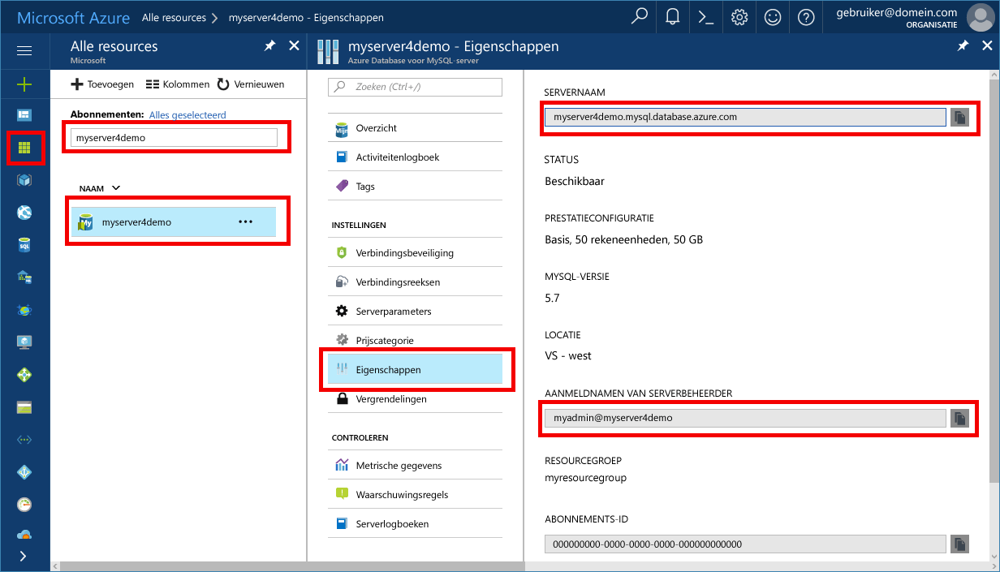

# <a name="migrate-your-mysql-database-tooazure-database-for-mysql-using-dump-and-restore"></a><span data-ttu-id="959a7-103">Migreren van uw MySQL-database tooAzure Database voor MySQL met behulp van de dump en terugzetten</span><span class="sxs-lookup"><span data-stu-id="959a7-103">Migrate your MySQL database tooAzure Database for MySQL using dump and restore</span></span>
<span data-ttu-id="959a7-104">In dit artikel wordt uitgelegd twee algemene manieren tooback up en MySQL-databases in uw Azure-Database herstellen</span><span class="sxs-lookup"><span data-stu-id="959a7-104">This article explains two common ways tooback up and restore databases in your Azure Database for MySQL</span></span>
- <span data-ttu-id="959a7-105">Dump en herstel van Hallo opdrachtregelprogramma (met behulp van mysqldump)</span><span class="sxs-lookup"><span data-stu-id="959a7-105">Dump and restore from hello command-line (using mysqldump)</span></span> 
- <span data-ttu-id="959a7-106">Dump en herstellen met behulp van PHPMyAdmin</span><span class="sxs-lookup"><span data-stu-id="959a7-106">Dump and restore using PHPMyAdmin</span></span> 

## <a name="before-you-begin"></a><span data-ttu-id="959a7-107">Voordat u begint</span><span class="sxs-lookup"><span data-stu-id="959a7-107">Before you begin</span></span>
<span data-ttu-id="959a7-108">toostep via deze procedure-tooguide, moet u toohave:</span><span class="sxs-lookup"><span data-stu-id="959a7-108">toostep through this how-tooguide, you need toohave:</span></span>
- [<span data-ttu-id="959a7-109">Azure-Database maken voor de server van de MySQL - Azure-portal</span><span class="sxs-lookup"><span data-stu-id="959a7-109">Create Azure Database for MySQL server - Azure portal</span></span>](quickstart-create-mysql-server-database-using-azure-portal.md)
- <span data-ttu-id="959a7-110">[mysqldump](https://dev.mysql.com/doc/refman/5.7/en/mysqldump.html) opdrachtregelprogramma geïnstalleerd op een computer.</span><span class="sxs-lookup"><span data-stu-id="959a7-110">[mysqldump](https://dev.mysql.com/doc/refman/5.7/en/mysqldump.html) command-line utility installed on a machine.</span></span>
- <span data-ttu-id="959a7-111">MySQL-Workbench [MySQL Workbench downloaden](https://dev.mysql.com/downloads/workbench/), Toad, Navicat of andere derden MySQL hulpprogramma toodo dump en opdrachten herstellen.</span><span class="sxs-lookup"><span data-stu-id="959a7-111">MySQL Workbench [MySQL Workbench Download](https://dev.mysql.com/downloads/workbench/), Toad, Navicat, or other third-party MySQL tool toodo dump and restore commands.</span></span>

## <a name="use-common-tools"></a><span data-ttu-id="959a7-112">Algemene hulpprogramma's gebruiken</span><span class="sxs-lookup"><span data-stu-id="959a7-112">Use common tools</span></span>
<span data-ttu-id="959a7-113">Algemene hulpprogramma's en hulpprogramma's zoals MySQL Workbench, mysqldump, Toad of Navicat tooremotely verbinding maken en herstellen van gegevens voor MySQL in Azure-Database.</span><span class="sxs-lookup"><span data-stu-id="959a7-113">Use common utilities and tools such as MySQL Workbench, mysqldump, Toad, or Navicat tooremotely connect and restore data into Azure Database for MySQL.</span></span> <span data-ttu-id="959a7-114">Gebruik deze hulpprogramma's op de clientcomputer met een internet verbinding tooconnect toohello Azure Database voor MySQL.</span><span class="sxs-lookup"><span data-stu-id="959a7-114">Use such tools on your client machine with an internet connection tooconnect toohello Azure Database for MySQL.</span></span> <span data-ttu-id="959a7-115">Een SSL versleutelde verbinding gebruiken voor best practices voor beveiliging, Zie ook [configureren van SSL-verbindingen in Azure-Database voor MySQL](concepts-ssl-connection-security.md).</span><span class="sxs-lookup"><span data-stu-id="959a7-115">Use an SSL encrypted connection for best security practices, see also [Configure SSL connectivity in Azure Database for MySQL](concepts-ssl-connection-security.md).</span></span> <span data-ttu-id="959a7-116">U hoeft niet toomove Hallo dump tooany speciale cloud locatie bij het migreren van tooAzure Database voor MySQL.</span><span class="sxs-lookup"><span data-stu-id="959a7-116">You do not need toomove hello dump files tooany special cloud location when migrating tooAzure Database for MySQL.</span></span> 

## <a name="common-uses-for-dump-and-restore"></a><span data-ttu-id="959a7-117">Veelvoorkomende toepassingen voor dump en herstel</span><span class="sxs-lookup"><span data-stu-id="959a7-117">Common uses for dump and restore</span></span>
<span data-ttu-id="959a7-118">U kunt de MySQL-hulpprogramma's zoals mysqldump en mysqlpump toodump en de belasting databases in een Azure MySQL-Database in verschillende algemene scenario's.</span><span class="sxs-lookup"><span data-stu-id="959a7-118">You may use MySQL utilities such as mysqldump and mysqlpump toodump and load databases into an Azure MySQL Database in several common scenarios.</span></span> <span data-ttu-id="959a7-119">In andere scenario's, mag u Hallo [importeren en exporteren](concepts-migrate-import-export.md) in plaats daarvan benaderen.</span><span class="sxs-lookup"><span data-stu-id="959a7-119">In other scenarios, you may use hello [Import and Export](concepts-migrate-import-export.md) approach instead.</span></span>

- <span data-ttu-id="959a7-120">Gebruik database dumpen wanneer u de gehele database Hallo migreert.</span><span class="sxs-lookup"><span data-stu-id="959a7-120">Use database dumps when you are migrating hello entire database.</span></span> <span data-ttu-id="959a7-121">Deze aanbeveling bevat bij het verplaatsen van een grote hoeveelheid gegevens MySQL, of als u wilt dat toominimize onderbreking van de service voor live sites of toepassingen.</span><span class="sxs-lookup"><span data-stu-id="959a7-121">This recommendation holds when moving a large amount of MySQL data, or when you want toominimize service interruption for live sites or applications.</span></span> 
-  <span data-ttu-id="959a7-122">Zorg ervoor dat alle tabellen in de database Hallo Hallo InnoDB opslag-engine gebruiken bij het laden van gegevens in Azure-Database voor MySQL.</span><span class="sxs-lookup"><span data-stu-id="959a7-122">Make sure all tables in hello database use hello InnoDB storage engine when loading data into Azure Database for MySQL.</span></span> <span data-ttu-id="959a7-123">Azure MySQL-Database ondersteunt alleen InnoDB opslag-engine en daarom biedt geen ondersteuning voor alternatieve opslag-engines.</span><span class="sxs-lookup"><span data-stu-id="959a7-123">Azure Database for MySQL supports only InnoDB Storage engine, and therefore does not support alternative storage engines.</span></span> <span data-ttu-id="959a7-124">Als uw tabellen zijn geconfigureerd met andere motoren opslag, te converteren naar Hallo InnoDB engine indeling vóór de migratie tooAzure Database voor MySQL.</span><span class="sxs-lookup"><span data-stu-id="959a7-124">If your tables are configured with other storage engines, convert them into hello InnoDB engine format before migration tooAzure Database for MySQL.</span></span>
   <span data-ttu-id="959a7-125">Bijvoorbeeld, hebt u een WordPress of WebApp Hallo MyISAM tabellen, converteert u eerst deze tabellen door te migreren naar InnoDB indeling, voordat u tooAzure Database terugzet voor MySQL.</span><span class="sxs-lookup"><span data-stu-id="959a7-125">For example, if you have a WordPress or WebApp using hello MyISAM tables, first convert those tables by migrating into InnoDB format before restoring tooAzure Database for MySQL.</span></span> <span data-ttu-id="959a7-126">Gebruik Hallo component `ENGINE=InnoDB` tooset Hallo-engine gebruikt bij het maken van een nieuwe tabel en klik vervolgens Hallo gegevens overdragen naar Hallo compatibel tabel vóór Hallo herstellen.</span><span class="sxs-lookup"><span data-stu-id="959a7-126">Use hello clause `ENGINE=InnoDB` tooset hello engine used when creating a new table, then transfer hello data into hello compatible table before hello restore.</span></span> 

   ```sql
   INSERT INTO innodb_table SELECT * FROM myisam_table ORDER BY primary_key_columns
   ```
- <span data-ttu-id="959a7-127">tooavoid eventuele compatibiliteit van software, Controleer Hallo dezelfde versie van MySQL op Hallo-bron- en doelserver systemen wordt gebruikt wanneer het dumpen van databases.</span><span class="sxs-lookup"><span data-stu-id="959a7-127">tooavoid any compatibility issues, ensure hello same version of MySQL is used on hello source and destination systems when dumping databases.</span></span> <span data-ttu-id="959a7-128">Bijvoorbeeld, als uw bestaande MySQL-server versie 5.7, moet vervolgens u migreren tooAzure Database voor MySQL geconfigureerd toorun versie 5.7.</span><span class="sxs-lookup"><span data-stu-id="959a7-128">For example, if your existing MySQL server is version 5.7, then you should migrate tooAzure Database for MySQL configured toorun version 5.7.</span></span> <span data-ttu-id="959a7-129">Hallo `mysql_upgrade` opdracht werkt niet in een Azure-Database voor de MySQL-server en wordt niet ondersteund.</span><span class="sxs-lookup"><span data-stu-id="959a7-129">hello `mysql_upgrade` command does not function in an Azure Database for MySQL server, and is not supported.</span></span> <span data-ttu-id="959a7-130">Als u tooupgrade op versies van MySQL moet, eerst dump of de lagere versie database exporteren naar een hogere versie van MySQL in uw eigen omgeving.</span><span class="sxs-lookup"><span data-stu-id="959a7-130">If you need tooupgrade across MySQL versions, first dump or export your lower version database into a higher version of MySQL in your own environment.</span></span> <span data-ttu-id="959a7-131">Voer `mysql_upgrade`, voordat u de migratie naar een Azure-Database voor MySQL.</span><span class="sxs-lookup"><span data-stu-id="959a7-131">Then run `mysql_upgrade`, before attempting migration into an Azure Database for MySQL.</span></span>

## <a name="performance-considerations"></a><span data-ttu-id="959a7-132">Prestatieoverwegingen</span><span class="sxs-lookup"><span data-stu-id="959a7-132">Performance considerations</span></span>
<span data-ttu-id="959a7-133">Los het bericht van deze overwegingen bij het dumpen van grote databases toooptimize prestaties:</span><span class="sxs-lookup"><span data-stu-id="959a7-133">toooptimize performance, take notice of these considerations when dumping large databases:</span></span>
-   <span data-ttu-id="959a7-134">Gebruik Hallo `exclude-triggers` optie in mysqldump wanneer het dumpen van databases.</span><span class="sxs-lookup"><span data-stu-id="959a7-134">Use hello `exclude-triggers` option in mysqldump when dumping databases.</span></span> <span data-ttu-id="959a7-135">Triggers uitsluiten van dump bestanden tooavoid Hallo trigger opdrachten uitgevoerd tijdens het Hallo-gegevens terugzetten.</span><span class="sxs-lookup"><span data-stu-id="959a7-135">Exclude triggers from dump files tooavoid hello trigger commands firing during hello data restore.</span></span> 
-   <span data-ttu-id="959a7-136">Hallo voorkomen `single-transaction` optie in mysqldump wanneer het dumpen van zeer grote databases.</span><span class="sxs-lookup"><span data-stu-id="959a7-136">Avoid hello `single-transaction` option in mysqldump when dumping very large databases.</span></span> <span data-ttu-id="959a7-137">Dumpen van een groot aantal tabellen binnen een transactie van zorgt ervoor dat de extra opslag en geheugen resources toobe verbruikt tijdens het terugzetten en kan leiden tot vertragingen prestaties of resourcebeperkingen.</span><span class="sxs-lookup"><span data-stu-id="959a7-137">Dumping many tables within a single transaction causes extra storage and memory resources toobe consumed during restore and may cause performance delays or resource constraints.</span></span>
-   <span data-ttu-id="959a7-138">Gebruik met meerdere waarden wordt ingevoegd bij het laden met SQL toominimize instructie uitvoering overhead bij het dumpen van databases.</span><span class="sxs-lookup"><span data-stu-id="959a7-138">Use multi-value inserts when loading with SQL toominimize statement execution overhead when dumping databases.</span></span> <span data-ttu-id="959a7-139">Wanneer u dumpbestanden gegenereerd door mysqldump hulpprogramma gebruikt, worden meerdere waarden invoegen standaard ingeschakeld.</span><span class="sxs-lookup"><span data-stu-id="959a7-139">When using dump files generated by mysqldump utility, multi-value inserts are enabled by default.</span></span> 
-  <span data-ttu-id="959a7-140">Gebruik Hallo `order-by-primary` optie in mysqldump wanneer het dumpen van databases, zodat gegevens Hallo in volgorde van de primaire sleutel in een script vastgelegd.</span><span class="sxs-lookup"><span data-stu-id="959a7-140">Use hello `order-by-primary` option in mysqldump when dumping databases, so that hello data is scripted in primary key order.</span></span>
-   <span data-ttu-id="959a7-141">Gebruik Hallo `disable-keys` optie in mysqldump wanneer het dumpen van gegevens, toodisable referentiële-sleutelbeperkingen vóór belasting.</span><span class="sxs-lookup"><span data-stu-id="959a7-141">Use hello `disable-keys` option in mysqldump when dumping data, toodisable foreign key constraints before load.</span></span> <span data-ttu-id="959a7-142">Refererende sleutel controles uit te schakelen, biedt betere prestaties.</span><span class="sxs-lookup"><span data-stu-id="959a7-142">Disabling foreign key checks provides performance gains.</span></span> <span data-ttu-id="959a7-143">Schakel Hallo beperkingen en Hallo gegevens na het Hallo load tooensure referentiële integriteit verifiëren.</span><span class="sxs-lookup"><span data-stu-id="959a7-143">Enable hello constraints and verify hello data after hello load tooensure referential integrity.</span></span>
-   <span data-ttu-id="959a7-144">Gepartitioneerde tabellen, indien van toepassing gebruiken.</span><span class="sxs-lookup"><span data-stu-id="959a7-144">Use partitioned tables when appropriate.</span></span>
-   <span data-ttu-id="959a7-145">Gegevens parallel worden geladen.</span><span class="sxs-lookup"><span data-stu-id="959a7-145">Load data in parallel.</span></span> <span data-ttu-id="959a7-146">Vermijd te veel parallelle uitvoering die zou ertoe leiden dat u een limiet resource toohit en bewaken van resources met behulp van Hallo metrische gegevens beschikbaar zijn in hello Azure-portal.</span><span class="sxs-lookup"><span data-stu-id="959a7-146">Avoid too much parallelism that would cause you toohit a resource limit, and monitor resources using hello metrics available in hello Azure portal.</span></span> 
-   <span data-ttu-id="959a7-147">Gebruik Hallo `defer-table-indexes` optie in mysqlpump wanneer het dumpen van databases, zodat het maken van een index gebeurt nadat tabellen gegevens zijn geladen.</span><span class="sxs-lookup"><span data-stu-id="959a7-147">Use hello `defer-table-indexes` option in mysqlpump when dumping databases, so that index creation happens after tables data is loaded.</span></span>

## <a name="create-a-backup-file-from-hello-command-line-using-mysqldump"></a><span data-ttu-id="959a7-148">Een back-upbestand van Hallo opdrachtregelprogramma maken met behulp van mysqldump</span><span class="sxs-lookup"><span data-stu-id="959a7-148">Create a backup file from hello command-line using mysqldump</span></span>
<span data-ttu-id="959a7-149">tooback van een bestaande MySQL-database op Hallo lokale on-premises server of in een virtuele machine, voert u Hallo volgende opdracht:</span><span class="sxs-lookup"><span data-stu-id="959a7-149">tooback up an existing MySQL database on hello local on-premises server or in a virtual machine, run hello following command:</span></span> 
```bash
$ mysqldump --opt -u [uname] -p[pass] [dbname] > [backupfile.sql]
```

<span data-ttu-id="959a7-150">Hallo parameters tooprovide zijn:</span><span class="sxs-lookup"><span data-stu-id="959a7-150">hello parameters tooprovide are:</span></span>
- <span data-ttu-id="959a7-151">[uname] Uw database-gebruikersnaam</span><span class="sxs-lookup"><span data-stu-id="959a7-151">[uname] Your database username</span></span> 
- <span data-ttu-id="959a7-152">[pass] Hallo wachtwoord voor uw database (Let er is geen ruimte tussen -p en Hallo wachtwoord)</span><span class="sxs-lookup"><span data-stu-id="959a7-152">[pass] hello password for your database (note there is no space between -p and hello password)</span></span> 
- <span data-ttu-id="959a7-153">[dbname] Hallo-naam van uw database</span><span class="sxs-lookup"><span data-stu-id="959a7-153">[dbname] hello name of your database</span></span> 
- <span data-ttu-id="959a7-154">[backupfile.sql] Hallo bestandsnaam voor de back-up van uw database</span><span class="sxs-lookup"><span data-stu-id="959a7-154">[backupfile.sql] hello filename for your database backup</span></span> 
- <span data-ttu-id="959a7-155">[--opt] Hallo mysqldump-optie</span><span class="sxs-lookup"><span data-stu-id="959a7-155">[--opt] hello mysqldump option</span></span> 

<span data-ttu-id="959a7-156">Bijvoorbeeld: tooback up van een database met de naam 'testdb' op uw server MySQL met Hallo gebruikersnaam 'testgebruiker' en er is geen wachtwoord tooa bestand testdb_backup.sql, Hallo volgende opdracht gebruiken.</span><span class="sxs-lookup"><span data-stu-id="959a7-156">For example, tooback up a database named 'testdb' on your MySQL server with hello username 'testuser' and with no password tooa file testdb_backup.sql, use hello following command.</span></span> <span data-ttu-id="959a7-157">Hallo opdracht een back-up Hallo `testdb` database naar een bestand met de naam `testdb_backup.sql`, die alle Hallo SQL-instructies bevat die nodig zijn toore-Hallo-database maken.</span><span class="sxs-lookup"><span data-stu-id="959a7-157">hello command backs up hello `testdb` database into a file called `testdb_backup.sql`, which contains all hello SQL statements needed toore-create hello database.</span></span> 

```bash
$ mysqldump -u root -p testdb > testdb_backup.sql
```
<span data-ttu-id="959a7-158">tooselect specifieke tabellen in uw database tooback up, lijst Hallo tabelnamen gescheiden door spaties.</span><span class="sxs-lookup"><span data-stu-id="959a7-158">tooselect specific tables in your database tooback up, list hello table names separated by spaces.</span></span> <span data-ttu-id="959a7-159">Bijvoorbeeld, volg tooback alleen table1 en table2 tabellen uit Hallo 'testdb' in dit voorbeeld:</span><span class="sxs-lookup"><span data-stu-id="959a7-159">For example, tooback up only table1 and table2 tables from hello 'testdb', follow this example:</span></span> 
```bash
$ mysqldump -u root -p testdb table1 table2 > testdb_tables_backup.sql
```

<span data-ttu-id="959a7-160">tooback van meer dan één database tegelijkertijd gebruik Hallo--database gaat en lijst Hallo databasenamen gescheiden door spaties.</span><span class="sxs-lookup"><span data-stu-id="959a7-160">tooback up more than one database at once, use hello --database switch and list hello database names separated by spaces.</span></span> 
```bash
$ mysqldump -u root -p --databases testdb1 testdb3 testdb5 > testdb135_backup.sql 
```
<span data-ttu-id="959a7-161">tooback van alle Hallo databases in één keer Hallo-server, moet u Hallo--de optie all-databases.</span><span class="sxs-lookup"><span data-stu-id="959a7-161">tooback up all hello databases in hello server at one time, you should use hello --all-databases option.</span></span>
```
$ mysqldump -u root -p --all-databases > alldb_backup.sql 
```

## <a name="create-a-database-on-hello-target-azure-database-for-mysql-server"></a><span data-ttu-id="959a7-162">Een database maken op Hallo doel-Azure-Database voor de MySQL-server</span><span class="sxs-lookup"><span data-stu-id="959a7-162">Create a database on hello target Azure Database for MySQL server</span></span>
<span data-ttu-id="959a7-163">Een lege database maken op Hallo doel-Azure-Database voor de MySQL-server waar u toomigrate Hallo gegevens.</span><span class="sxs-lookup"><span data-stu-id="959a7-163">Create an empty database on hello target Azure Database for MySQL server where you want toomigrate hello data.</span></span> <span data-ttu-id="959a7-164">Gebruik een hulpprogramma zoals MySQL Workbench, Toad of Navicat toocreate Hallo-database.</span><span class="sxs-lookup"><span data-stu-id="959a7-164">Use a tool such as MySQL Workbench, Toad, or Navicat toocreate hello database.</span></span> <span data-ttu-id="959a7-165">Hallo-database kan dezelfde naam als het Hallo-database die is opgenomen Hallo gedumpt gegevens Hallo of u kunt een database maken met een andere naam.</span><span class="sxs-lookup"><span data-stu-id="959a7-165">hello database can have hello same name as hello database that is contained hello dumped data or you can create a database with a different name.</span></span>

<span data-ttu-id="959a7-166">tooget aangesloten, Hallo verbindingsgegevens op de pagina eigenschappen Hallo in uw Azure-Database voor MySQL vinden.</span><span class="sxs-lookup"><span data-stu-id="959a7-166">tooget connected, locate hello connection information on hello Properties page in your Azure Database for MySQL.</span></span>
<span data-ttu-id="959a7-167"></span><span class="sxs-lookup"><span data-stu-id="959a7-167"></span></span>

<span data-ttu-id="959a7-168">Hallo-verbindingsgegevens naar uw MySQL-Workbench toevoegen.</span><span class="sxs-lookup"><span data-stu-id="959a7-168">Add hello connection information into your MySQL Workbench.</span></span>
<span data-ttu-id="959a7-169"></span><span class="sxs-lookup"><span data-stu-id="959a7-169"></span></span>


## <a name="restore-your-mysql-database-using-command-line-or-mysql-workbench"></a><span data-ttu-id="959a7-170">Uw MySQL-database met een opdrachtregel of MySQL Workbench herstellen</span><span class="sxs-lookup"><span data-stu-id="959a7-170">Restore your MySQL database using command-line or MySQL Workbench</span></span>
<span data-ttu-id="959a7-171">Nadat u de doeldatabase Hallo hebt gemaakt, kunt u Hallo mysql opdracht of MySQL Workbench toorestore Hallo gegevens in specifieke Hallo nieuw gemaakte database van het dumpbestand Hallo.</span><span class="sxs-lookup"><span data-stu-id="959a7-171">Once you have created hello target database, you can use hello mysql command or MySQL Workbench toorestore hello data into hello specific newly created database from hello dump file.</span></span>
```bash
mysql -h [hostname] -u [uname] -p[pass] [db_to_restore] < [backupfile.sql]
```
<span data-ttu-id="959a7-172">In dit voorbeeld Hallo gegevens in Hallo nieuwe database gemaakt op Hallo doel-Azure-Database voor de MySQL-server te herstellen.</span><span class="sxs-lookup"><span data-stu-id="959a7-172">In this example, restore hello data into hello newly created database on hello target Azure Database for MySQL server.</span></span>
```bash
$ mysql -h myserver4demo.mysql.database.azure.com -u myadmin@myserver4demo -p testdb < testdb_backup.sql
```

## <a name="export-using-phpmyadmin"></a><span data-ttu-id="959a7-173">Exporteren met behulp van PHPMyAdmin</span><span class="sxs-lookup"><span data-stu-id="959a7-173">Export using PHPMyAdmin</span></span>
<span data-ttu-id="959a7-174">tooexport, kunt u Hallo algemene hulpprogramma phpMyAdmin, die u mogelijk al hebt geïnstalleerd lokaal in uw omgeving.</span><span class="sxs-lookup"><span data-stu-id="959a7-174">tooexport, you can use hello common tool phpMyAdmin, which you may already have installed locally in your environment.</span></span> <span data-ttu-id="959a7-175">tooexport uw MySQL-database met behulp van PHPMyAdmin:</span><span class="sxs-lookup"><span data-stu-id="959a7-175">tooexport your MySQL database using PHPMyAdmin:</span></span>
- <span data-ttu-id="959a7-176">Open phpMyAdmin.</span><span class="sxs-lookup"><span data-stu-id="959a7-176">Open phpMyAdmin.</span></span>
- <span data-ttu-id="959a7-177">Selecteer uw database.</span><span class="sxs-lookup"><span data-stu-id="959a7-177">Select your database.</span></span> <span data-ttu-id="959a7-178">Klik op Hallo databasenaam in de lijst Hallo op Hallo links.</span><span class="sxs-lookup"><span data-stu-id="959a7-178">Click hello database name in hello list on hello left.</span></span> 
- <span data-ttu-id="959a7-179">Klik op Hallo **exporteren** koppeling.</span><span class="sxs-lookup"><span data-stu-id="959a7-179">Click hello **Export** link.</span></span> <span data-ttu-id="959a7-180">Een nieuwe pagina wordt weergegeven tooview Hallo dump database.</span><span class="sxs-lookup"><span data-stu-id="959a7-180">A new page appears tooview hello dump of database.</span></span>
- <span data-ttu-id="959a7-181">In Hallo gebied exporteren, klikt u op Hallo **Alles selecteren** toochoose Hallo tabellen in de database te koppelen.</span><span class="sxs-lookup"><span data-stu-id="959a7-181">In hello Export area, click hello **Select All** link toochoose hello tables in your database.</span></span> 
- <span data-ttu-id="959a7-182">Hallo gebied van SQL-opties, klik op de juiste opties Hallo.</span><span class="sxs-lookup"><span data-stu-id="959a7-182">In hello SQL options area, click hello appropriate options.</span></span> 
- <span data-ttu-id="959a7-183">Klik op Hallo **opslaan als bestand** optie en de bijbehorende compressie Hallo optie en klik vervolgens op Hallo **gaat** knop.</span><span class="sxs-lookup"><span data-stu-id="959a7-183">Click hello **Save as file** option and hello corresponding compression option and then click hello **Go** button.</span></span> <span data-ttu-id="959a7-184">Een dialoogvenster moet worden weergegeven aanbieden u toosave Hallo bestand lokaal op.</span><span class="sxs-lookup"><span data-stu-id="959a7-184">A dialog box should appear prompting you toosave hello file locally.</span></span>

## <a name="import-using-phpmyadmin"></a><span data-ttu-id="959a7-185">Importeren met PHPMyAdmin</span><span class="sxs-lookup"><span data-stu-id="959a7-185">Import using PHPMyAdmin</span></span>
<span data-ttu-id="959a7-186">Importeren van uw database is vergelijkbaar tooexporting.</span><span class="sxs-lookup"><span data-stu-id="959a7-186">Importing your database is similar tooexporting.</span></span> <span data-ttu-id="959a7-187">Hallo volgende acties:</span><span class="sxs-lookup"><span data-stu-id="959a7-187">Do hello following actions:</span></span>
- <span data-ttu-id="959a7-188">Open phpMyAdmin.</span><span class="sxs-lookup"><span data-stu-id="959a7-188">Open phpMyAdmin.</span></span> 
- <span data-ttu-id="959a7-189">Klik in de installatiepagina van Hallo phpMyAdmin op **toevoegen** tooadd uw Azure-Database voor de MySQL-server.</span><span class="sxs-lookup"><span data-stu-id="959a7-189">In hello phpMyAdmin setup page, click **Add** tooadd your Azure Database for MySQL server.</span></span> <span data-ttu-id="959a7-190">Geef Verbindingsdetails voor Hallo en aanmeldingsgegevens.</span><span class="sxs-lookup"><span data-stu-id="959a7-190">Provide hello connection details and login information.</span></span>
- <span data-ttu-id="959a7-191">Maak een geschikte naam database en selecteer het aan de linkerkant Hallo van welkomstscherm.</span><span class="sxs-lookup"><span data-stu-id="959a7-191">Create an appropriately named database and select it on hello left of hello screen.</span></span> <span data-ttu-id="959a7-192">toorewrite bestaande database Hallo Hallo-databasenaam op, schakel alle selectievakjes Hallo naast Hallo tabelnamen en selecteer **Drop** toodelete Hallo bestaande tabellen.</span><span class="sxs-lookup"><span data-stu-id="959a7-192">toorewrite hello existing database, click hello database name, select all hello check boxes beside hello table names, and select **Drop** toodelete hello  existing tables.</span></span> 
- <span data-ttu-id="959a7-193">Klik op Hallo **SQL** koppeling tooshow Hallo pagina kunt u typt in SQL-opdrachten, of uw SQL-bestand uploaden.</span><span class="sxs-lookup"><span data-stu-id="959a7-193">Click hello **SQL** link tooshow hello page where you can type in SQL commands, or upload your SQL file.</span></span> 
- <span data-ttu-id="959a7-194">Gebruik Hallo **Bladeren** knop toofind Hallo-databasebestand.</span><span class="sxs-lookup"><span data-stu-id="959a7-194">Use hello **browse** button toofind hello database file.</span></span> 
- <span data-ttu-id="959a7-195">Klik op Hallo **gaat** knop tooexport Hallo back-up, Hallo SQL-opdrachten uitvoeren en de database opnieuw maken.</span><span class="sxs-lookup"><span data-stu-id="959a7-195">Click hello **Go** button tooexport hello backup, execute hello SQL commands, and re-create your database.</span></span>

## <a name="next-steps"></a><span data-ttu-id="959a7-196">Volgende stappen</span><span class="sxs-lookup"><span data-stu-id="959a7-196">Next steps</span></span>
[<span data-ttu-id="959a7-197">Verbinding maken met toepassingen tooAzure Database voor MySQL</span><span class="sxs-lookup"><span data-stu-id="959a7-197">Connect applications tooAzure Database for MySQL</span></span>](./howto-connection-string.md)
