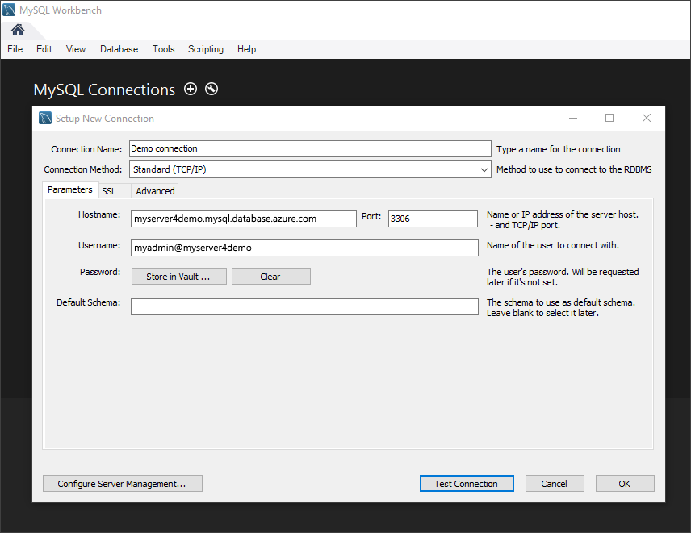

# <a name="migrate-your-mysql-database-tooazure-database-for-mysql-using-dump-and-restore"></a>Migreren van uw MySQL-database tooAzure Database voor MySQL met behulp van de dump en terugzetten
In dit artikel wordt uitgelegd twee algemene manieren tooback up en MySQL-databases in uw Azure-Database herstellen
- Dump en herstel van Hallo opdrachtregelprogramma (met behulp van mysqldump) 
- Dump en herstellen met behulp van PHPMyAdmin 

## <a name="before-you-begin"></a>Voordat u begint
toostep via deze procedure-tooguide, moet u toohave:
- [Azure-Database maken voor de server van de MySQL - Azure-portal](quickstart-create-mysql-server-database-using-azure-portal.md)
- [mysqldump](https://dev.mysql.com/doc/refman/5.7/en/mysqldump.html) opdrachtregelprogramma geïnstalleerd op een computer.
- MySQL-Workbench [MySQL Workbench downloaden](https://dev.mysql.com/downloads/workbench/), Toad, Navicat of andere derden MySQL hulpprogramma toodo dump en opdrachten herstellen.

## <a name="use-common-tools"></a>Algemene hulpprogramma's gebruiken
Algemene hulpprogramma's en hulpprogramma's zoals MySQL Workbench, mysqldump, Toad of Navicat tooremotely verbinding maken en herstellen van gegevens voor MySQL in Azure-Database. Gebruik deze hulpprogramma's op de clientcomputer met een internet verbinding tooconnect toohello Azure Database voor MySQL. Een SSL versleutelde verbinding gebruiken voor best practices voor beveiliging, Zie ook [configureren van SSL-verbindingen in Azure-Database voor MySQL](concepts-ssl-connection-security.md). U hoeft niet toomove Hallo dump tooany speciale cloud locatie bij het migreren van tooAzure Database voor MySQL. 

## <a name="common-uses-for-dump-and-restore"></a>Veelvoorkomende toepassingen voor dump en herstel
U kunt de MySQL-hulpprogramma's zoals mysqldump en mysqlpump toodump en de belasting databases in een Azure MySQL-Database in verschillende algemene scenario's. In andere scenario's, mag u Hallo [importeren en exporteren](concepts-migrate-import-export.md) in plaats daarvan benaderen.

- Gebruik database dumpen wanneer u de gehele database Hallo migreert. Deze aanbeveling bevat bij het verplaatsen van een grote hoeveelheid gegevens MySQL, of als u wilt dat toominimize onderbreking van de service voor live sites of toepassingen. 
-  Zorg ervoor dat alle tabellen in de database Hallo Hallo InnoDB opslag-engine gebruiken bij het laden van gegevens in Azure-Database voor MySQL. Azure MySQL-Database ondersteunt alleen InnoDB opslag-engine en daarom biedt geen ondersteuning voor alternatieve opslag-engines. Als uw tabellen zijn geconfigureerd met andere motoren opslag, te converteren naar Hallo InnoDB engine indeling vóór de migratie tooAzure Database voor MySQL.
   Bijvoorbeeld, hebt u een WordPress of WebApp Hallo MyISAM tabellen, converteert u eerst deze tabellen door te migreren naar InnoDB indeling, voordat u tooAzure Database terugzet voor MySQL. Gebruik Hallo component `ENGINE=InnoDB` tooset Hallo-engine gebruikt bij het maken van een nieuwe tabel en klik vervolgens Hallo gegevens overdragen naar Hallo compatibel tabel vóór Hallo herstellen. 

   ```sql
   INSERT INTO innodb_table SELECT * FROM myisam_table ORDER BY primary_key_columns
   ```
- tooavoid eventuele compatibiliteit van software, Controleer Hallo dezelfde versie van MySQL op Hallo-bron- en doelserver systemen wordt gebruikt wanneer het dumpen van databases. Bijvoorbeeld, als uw bestaande MySQL-server versie 5.7, moet vervolgens u migreren tooAzure Database voor MySQL geconfigureerd toorun versie 5.7. Hallo `mysql_upgrade` opdracht werkt niet in een Azure-Database voor de MySQL-server en wordt niet ondersteund. Als u tooupgrade op versies van MySQL moet, eerst dump of de lagere versie database exporteren naar een hogere versie van MySQL in uw eigen omgeving. Voer `mysql_upgrade`, voordat u de migratie naar een Azure-Database voor MySQL.

## <a name="performance-considerations"></a>Prestatieoverwegingen
Los het bericht van deze overwegingen bij het dumpen van grote databases toooptimize prestaties:
-   Gebruik Hallo `exclude-triggers` optie in mysqldump wanneer het dumpen van databases. Triggers uitsluiten van dump bestanden tooavoid Hallo trigger opdrachten uitgevoerd tijdens het Hallo-gegevens terugzetten. 
-   Hallo voorkomen `single-transaction` optie in mysqldump wanneer het dumpen van zeer grote databases. Dumpen van een groot aantal tabellen binnen een transactie van zorgt ervoor dat de extra opslag en geheugen resources toobe verbruikt tijdens het terugzetten en kan leiden tot vertragingen prestaties of resourcebeperkingen.
-   Gebruik met meerdere waarden wordt ingevoegd bij het laden met SQL toominimize instructie uitvoering overhead bij het dumpen van databases. Wanneer u dumpbestanden gegenereerd door mysqldump hulpprogramma gebruikt, worden meerdere waarden invoegen standaard ingeschakeld. 
-  Gebruik Hallo `order-by-primary` optie in mysqldump wanneer het dumpen van databases, zodat gegevens Hallo in volgorde van de primaire sleutel in een script vastgelegd.
-   Gebruik Hallo `disable-keys` optie in mysqldump wanneer het dumpen van gegevens, toodisable referentiële-sleutelbeperkingen vóór belasting. Refererende sleutel controles uit te schakelen, biedt betere prestaties. Schakel Hallo beperkingen en Hallo gegevens na het Hallo load tooensure referentiële integriteit verifiëren.
-   Gepartitioneerde tabellen, indien van toepassing gebruiken.
-   Gegevens parallel worden geladen. Vermijd te veel parallelle uitvoering die zou ertoe leiden dat u een limiet resource toohit en bewaken van resources met behulp van Hallo metrische gegevens beschikbaar zijn in hello Azure-portal. 
-   Gebruik Hallo `defer-table-indexes` optie in mysqlpump wanneer het dumpen van databases, zodat het maken van een index gebeurt nadat tabellen gegevens zijn geladen.

## <a name="create-a-backup-file-from-hello-command-line-using-mysqldump"></a>Een back-upbestand van Hallo opdrachtregelprogramma maken met behulp van mysqldump
tooback van een bestaande MySQL-database op Hallo lokale on-premises server of in een virtuele machine, voert u Hallo volgende opdracht: 
```bash
$ mysqldump --opt -u [uname] -p[pass] [dbname] > [backupfile.sql]
```

Hallo parameters tooprovide zijn:
- [uname] Uw database-gebruikersnaam 
- [pass] Hallo wachtwoord voor uw database (Let er is geen ruimte tussen -p en Hallo wachtwoord) 
- [dbname] Hallo-naam van uw database 
- [backupfile.sql] Hallo bestandsnaam voor de back-up van uw database 
- [--opt] Hallo mysqldump-optie 

Bijvoorbeeld: tooback up van een database met de naam 'testdb' op uw server MySQL met Hallo gebruikersnaam 'testgebruiker' en er is geen wachtwoord tooa bestand testdb_backup.sql, Hallo volgende opdracht gebruiken. Hallo opdracht een back-up Hallo `testdb` database naar een bestand met de naam `testdb_backup.sql`, die alle Hallo SQL-instructies bevat die nodig zijn toore-Hallo-database maken. 

```bash
$ mysqldump -u root -p testdb > testdb_backup.sql
```
tooselect specifieke tabellen in uw database tooback up, lijst Hallo tabelnamen gescheiden door spaties. Bijvoorbeeld, volg tooback alleen table1 en table2 tabellen uit Hallo 'testdb' in dit voorbeeld: 
```bash
$ mysqldump -u root -p testdb table1 table2 > testdb_tables_backup.sql
```

tooback van meer dan één database tegelijkertijd gebruik Hallo--database gaat en lijst Hallo databasenamen gescheiden door spaties. 
```bash
$ mysqldump -u root -p --databases testdb1 testdb3 testdb5 > testdb135_backup.sql 
```
tooback van alle Hallo databases in één keer Hallo-server, moet u Hallo--de optie all-databases.
```
$ mysqldump -u root -p --all-databases > alldb_backup.sql 
```

## <a name="create-a-database-on-hello-target-azure-database-for-mysql-server"></a>Een database maken op Hallo doel-Azure-Database voor de MySQL-server
Een lege database maken op Hallo doel-Azure-Database voor de MySQL-server waar u toomigrate Hallo gegevens. Gebruik een hulpprogramma zoals MySQL Workbench, Toad of Navicat toocreate Hallo-database. Hallo-database kan dezelfde naam als het Hallo-database die is opgenomen Hallo gedumpt gegevens Hallo of u kunt een database maken met een andere naam.

tooget aangesloten, Hallo verbindingsgegevens op de pagina eigenschappen Hallo in uw Azure-Database voor MySQL vinden.


Hallo-verbindingsgegevens naar uw MySQL-Workbench toevoegen.



## <a name="restore-your-mysql-database-using-command-line-or-mysql-workbench"></a>Uw MySQL-database met een opdrachtregel of MySQL Workbench herstellen
Nadat u de doeldatabase Hallo hebt gemaakt, kunt u Hallo mysql opdracht of MySQL Workbench toorestore Hallo gegevens in specifieke Hallo nieuw gemaakte database van het dumpbestand Hallo.
```bash
mysql -h [hostname] -u [uname] -p[pass] [db_to_restore] < [backupfile.sql]
```
In dit voorbeeld Hallo gegevens in Hallo nieuwe database gemaakt op Hallo doel-Azure-Database voor de MySQL-server te herstellen.
```bash
$ mysql -h myserver4demo.mysql.database.azure.com -u myadmin@myserver4demo -p testdb < testdb_backup.sql
```

## <a name="export-using-phpmyadmin"></a>Exporteren met behulp van PHPMyAdmin
tooexport, kunt u Hallo algemene hulpprogramma phpMyAdmin, die u mogelijk al hebt geïnstalleerd lokaal in uw omgeving. tooexport uw MySQL-database met behulp van PHPMyAdmin:
- Open phpMyAdmin.
- Selecteer uw database. Klik op Hallo databasenaam in de lijst Hallo op Hallo links. 
- Klik op Hallo **exporteren** koppeling. Een nieuwe pagina wordt weergegeven tooview Hallo dump database.
- In Hallo gebied exporteren, klikt u op Hallo **Alles selecteren** toochoose Hallo tabellen in de database te koppelen. 
- Hallo gebied van SQL-opties, klik op de juiste opties Hallo. 
- Klik op Hallo **opslaan als bestand** optie en de bijbehorende compressie Hallo optie en klik vervolgens op Hallo **gaat** knop. Een dialoogvenster moet worden weergegeven aanbieden u toosave Hallo bestand lokaal op.

## <a name="import-using-phpmyadmin"></a>Importeren met PHPMyAdmin
Importeren van uw database is vergelijkbaar tooexporting. Hallo volgende acties:
- Open phpMyAdmin. 
- Klik in de installatiepagina van Hallo phpMyAdmin op **toevoegen** tooadd uw Azure-Database voor de MySQL-server. Geef Verbindingsdetails voor Hallo en aanmeldingsgegevens.
- Maak een geschikte naam database en selecteer het aan de linkerkant Hallo van welkomstscherm. toorewrite bestaande database Hallo Hallo-databasenaam op, schakel alle selectievakjes Hallo naast Hallo tabelnamen en selecteer **Drop** toodelete Hallo bestaande tabellen. 
- Klik op Hallo **SQL** koppeling tooshow Hallo pagina kunt u typt in SQL-opdrachten, of uw SQL-bestand uploaden. 
- Gebruik Hallo **Bladeren** knop toofind Hallo-databasebestand. 
- Klik op Hallo **gaat** knop tooexport Hallo back-up, Hallo SQL-opdrachten uitvoeren en de database opnieuw maken.

## <a name="next-steps"></a>Volgende stappen
[Verbinding maken met toepassingen tooAzure Database voor MySQL](./howto-connection-string.md)
