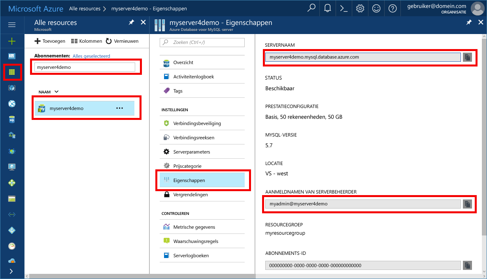

# <a name="azure-database-for-mysql-use-connectorc-tooconnect-and-query-data"></a><span data-ttu-id="42765-103">Azure MySQL-Database: gebruik Connector/C++ tooconnect en query-gegevens</span><span class="sxs-lookup"><span data-stu-id="42765-103">Azure Database for MySQL: Use Connector/C++ tooconnect and query data</span></span>
<span data-ttu-id="42765-104">Deze snelstartgids demonstreert hoe tooconnect tooan Azure-Database voor MySQL met behulp van een C++-toepassing.</span><span class="sxs-lookup"><span data-stu-id="42765-104">This quickstart demonstrates how tooconnect tooan Azure Database for MySQL using a C++ application.</span></span> <span data-ttu-id="42765-105">Er wordt weergegeven hoe toouse SQL-instructies tooquery invoegen, bijwerken en verwijderen van gegevens in Hallo-database.</span><span class="sxs-lookup"><span data-stu-id="42765-105">It shows how toouse SQL statements tooquery, insert, update, and delete data in hello database.</span></span> <span data-ttu-id="42765-106">Hallo stappen in dit artikel wordt ervan uitgegaan dat u bekend bent met ontwikkelen met C++, en dat u een nieuwe tooworking met Azure-Database voor MySQL bent.</span><span class="sxs-lookup"><span data-stu-id="42765-106">hello steps in this article assume that you are familiar with developing using C++, and that you are new tooworking with Azure Database for MySQL.</span></span>

## <a name="prerequisites"></a><span data-ttu-id="42765-107">Vereisten</span><span class="sxs-lookup"><span data-stu-id="42765-107">Prerequisites</span></span>
<span data-ttu-id="42765-108">Deze snelstartgids Hallo bronnen die zijn gemaakt in een van deze handleidingen als uitgangspunt gebruikt:</span><span class="sxs-lookup"><span data-stu-id="42765-108">This quickstart uses hello resources created in either of these guides as a starting point:</span></span>
- [<span data-ttu-id="42765-109">Een Azure-database voor een MySQL-server maken met behulp van Azure Portal</span><span class="sxs-lookup"><span data-stu-id="42765-109">Create an Azure Database for MySQL server using Azure portal</span></span>](./quickstart-create-mysql-server-database-using-azure-portal.md)
- [<span data-ttu-id="42765-110">Een Azure-database voor een MySQL-server maken met behulp van Azure CLI</span><span class="sxs-lookup"><span data-stu-id="42765-110">Create an Azure Database for MySQL server using Azure CLI</span></span>](./quickstart-create-mysql-server-database-using-azure-cli.md)

<span data-ttu-id="42765-111">U moet ook het volgende doen:</span><span class="sxs-lookup"><span data-stu-id="42765-111">You also need to:</span></span>
- <span data-ttu-id="42765-112">[.NET Framework](https://www.microsoft.com/net/download) installeren</span><span class="sxs-lookup"><span data-stu-id="42765-112">Install [.NET Framework](https://www.microsoft.com/net/download)</span></span>
- <span data-ttu-id="42765-113">[Visual Studio](https://www.visualstudio.com/downloads/) installeren</span><span class="sxs-lookup"><span data-stu-id="42765-113">Install [Visual Studio](https://www.visualstudio.com/downloads/)</span></span>
- <span data-ttu-id="42765-114">[MySQL-connector/C++](https://dev.mysql.com/downloads/connector/cpp/) installeren</span><span class="sxs-lookup"><span data-stu-id="42765-114">Install [MySQL Connector/C++](https://dev.mysql.com/downloads/connector/cpp/)</span></span> 
- <span data-ttu-id="42765-115">[Boost](http://www.boost.org/) installeren</span><span class="sxs-lookup"><span data-stu-id="42765-115">Install [Boost](http://www.boost.org/)</span></span>

## <a name="install-visual-studio-and-net"></a><span data-ttu-id="42765-116">Visual Studio en .NET installeren</span><span class="sxs-lookup"><span data-stu-id="42765-116">Install Visual Studio and .NET</span></span>
<span data-ttu-id="42765-117">Hallo stappen in deze sectie wordt ervan uitgegaan dat u bekend bent met ontwikkelen met behulp van .NET.</span><span class="sxs-lookup"><span data-stu-id="42765-117">hello steps in this section assume that you are familiar with developing using .NET.</span></span>

### <a name="windows"></a><span data-ttu-id="42765-118">**Windows**</span><span class="sxs-lookup"><span data-stu-id="42765-118">**Windows**</span></span>
1. <span data-ttu-id="42765-119">Installeer Visual Studio 2017 Community. Dit is een volledig functionele, uitbreidbare en gratis IDE voor het maken van moderne toepassingen voor Android, iOS en Windows, voor web- en databasetoepassingen, en voor cloudservices.</span><span class="sxs-lookup"><span data-stu-id="42765-119">Install Visual Studio 2017 Community, which is a full featured, extensible, free IDE for creating modern applications for Android, iOS, Windows, as well as web & database applications and cloud services.</span></span> <span data-ttu-id="42765-120">U kunt ofwel Hallo volledige .NET Framework of alleen .NET Core installeren.</span><span class="sxs-lookup"><span data-stu-id="42765-120">You can install either hello full .NET Framework or just .NET Core.</span></span> <span data-ttu-id="42765-121">Hallo codefragmenten in Hallo Quick Start met een werken.</span><span class="sxs-lookup"><span data-stu-id="42765-121">hello code snippets in hello Quickstart work with either.</span></span> <span data-ttu-id="42765-122">Als u Visual Studio is geïnstalleerd op uw computer al hebt, moet u de volgende twee stappen Hallo overslaan.</span><span class="sxs-lookup"><span data-stu-id="42765-122">If you already have Visual Studio installed on your machine, skip hello next two steps.</span></span>
   - <span data-ttu-id="42765-123">Hallo downloaden [Visual Studio 2017 installer](https://www.visualstudio.com/thank-you-downloading-visual-studio/?sku=Community&rel=15).</span><span class="sxs-lookup"><span data-stu-id="42765-123">Download hello [Visual Studio 2017 installer](https://www.visualstudio.com/thank-you-downloading-visual-studio/?sku=Community&rel=15).</span></span> 
   - <span data-ttu-id="42765-124">Hallo-installatieprogramma uitvoeren en volg Hallo installatie wordt u gevraagd toocomplete Hallo-installatie.</span><span class="sxs-lookup"><span data-stu-id="42765-124">Run hello installer and follow hello installation prompts toocomplete hello installation.</span></span>

### <a name="configure-visual-studio"></a><span data-ttu-id="42765-125">**Visual Studio configureren**</span><span class="sxs-lookup"><span data-stu-id="42765-125">**Configure Visual Studio**</span></span>
1. <span data-ttu-id="42765-126">Eigenschap vanuit Visual Studio-project > configuratie-eigenschappen > C/C++ > linker > Algemeen > aanvullende bibliotheekmappen, Hallo lib\opt map toevoegen (dat wil zeggen: C:\Program Files (x86) \MySQL\MySQL Connector C++ 1.1.9\lib\opt) van Hallo c++ Connector.</span><span class="sxs-lookup"><span data-stu-id="42765-126">From Visual Studio, project property > configuration properties > C/C++ > linker > general > additional library directories, add hello lib\opt directory (i.e.: C:\Program Files (x86)\MySQL\MySQL Connector C++ 1.1.9\lib\opt) of hello c++ connector.</span></span>
2. <span data-ttu-id="42765-127">Ga in Visual Studio naar projecteigenschap > configuratie-eigenschappen > C/C++ > algemeen > aanvullende includemappen</span><span class="sxs-lookup"><span data-stu-id="42765-127">From Visual Studio, project property > configuration properties > C/C++ > general > additional include directories</span></span>
   - <span data-ttu-id="42765-128">Voeg include/map van c++-connector toe (bijvoorbeeld: C:\Program Files (x86)\MySQL\MySQL Connector C++ 1.1.9\include\)</span><span class="sxs-lookup"><span data-stu-id="42765-128">Add include/ directory of c++ connector (i.e.: C:\Program Files (x86)\MySQL\MySQL Connector C++ 1.1.9\include\)</span></span>
   - <span data-ttu-id="42765-129">Voeg de hoofdmap van de Boost-bibliotheek toe (bijvoorbeeld: C:\boost_1_64_0\)</span><span class="sxs-lookup"><span data-stu-id="42765-129">Add Boost library's root directory (i.e.: C:\boost_1_64_0\)</span></span>
3. <span data-ttu-id="42765-130">Eigenschap vanuit Visual Studio-project > configuratie-eigenschappen > C/C++ > linker > invoer > Extra afhankelijkheden mysqlcppconn.lib in Hallo tekstveld toevoegen</span><span class="sxs-lookup"><span data-stu-id="42765-130">From Visual Studio, project property > configuration properties > C/C++ > linker > Input > Additional Dependencies, add mysqlcppconn.lib into hello text field</span></span>
4. <span data-ttu-id="42765-131">Beide mysqlcppconn.dll kopie van Hallo c++ connector bibliotheekmap in stap 3 toohello dezelfde directory als Hallo toepassing uitvoerbaar bestand of deze omgevingsvariabele toohello toevoegen zodat uw toepassing kan worden gedetecteerd.</span><span class="sxs-lookup"><span data-stu-id="42765-131">Either copy mysqlcppconn.dll from hello c++ connector library folder in step 3 toohello same directory as hello application executable or add it toohello environment variable so your application can find it.</span></span>

## <a name="get-connection-information"></a><span data-ttu-id="42765-132">Verbindingsgegevens ophalen</span><span class="sxs-lookup"><span data-stu-id="42765-132">Get connection information</span></span>
<span data-ttu-id="42765-133">Hallo verbinding informatie die nodig is tooconnect toohello Azure Database voor MySQL niet ophalen.</span><span class="sxs-lookup"><span data-stu-id="42765-133">Get hello connection information needed tooconnect toohello Azure Database for MySQL.</span></span> <span data-ttu-id="42765-134">U moet Hallo van server volledig gekwalificeerde servernaam en aanmeldingsreferenties.</span><span class="sxs-lookup"><span data-stu-id="42765-134">You need hello fully qualified server name and login credentials.</span></span>

1. <span data-ttu-id="42765-135">Meld u bij toohello [Azure-portal](https://portal.azure.com/).</span><span class="sxs-lookup"><span data-stu-id="42765-135">Log in toohello [Azure portal](https://portal.azure.com/).</span></span>
2. <span data-ttu-id="42765-136">Hallo links menu in Azure-portal en klik op **alle resources** en zoek naar Hallo-server die u hebt gemaakt, zoals **myserver4demo**.</span><span class="sxs-lookup"><span data-stu-id="42765-136">From hello left-hand menu in Azure portal, click **All resources** and search for hello server you have created, such as **myserver4demo**.</span></span>
3. <span data-ttu-id="42765-137">Klik op Hallo servernaam.</span><span class="sxs-lookup"><span data-stu-id="42765-137">Click hello server name.</span></span>
4. <span data-ttu-id="42765-138">Selecteer Hallo-server **eigenschappen** pagina.</span><span class="sxs-lookup"><span data-stu-id="42765-138">Select hello server's **Properties** page.</span></span> <span data-ttu-id="42765-139">Maak een notitie van Hallo **servernaam** en **aanmeldingsnaam van Server-beheerder**.</span><span class="sxs-lookup"><span data-stu-id="42765-139">Make a note of hello **Server name** and **Server admin login name**.</span></span>
 <span data-ttu-id="42765-140"></span><span class="sxs-lookup"><span data-stu-id="42765-140"></span></span>
5. <span data-ttu-id="42765-141">Als u uw aanmeldingsgegevens server bent vergeten, gaat u toohello **overzicht** pagina tooview Hallo Server admin-aanmeldingsnaam en, indien nodig, opnieuw ingesteld wachtwoord Hallo.</span><span class="sxs-lookup"><span data-stu-id="42765-141">If you forget your server login information, navigate toohello **Overview** page tooview hello Server admin login name and, if necessary, reset hello password.</span></span>

## <a name="connect-create-table-and-insert-data"></a><span data-ttu-id="42765-142">Verbinden, tabel maken en gegevens invoegen</span><span class="sxs-lookup"><span data-stu-id="42765-142">Connect, create table, and insert data</span></span>
<span data-ttu-id="42765-143">Gebruik Hallo volgende tooconnect code en laden van gegevens met Hallo **CREATE TABLE** en **INSERT INTO** SQL-instructies.</span><span class="sxs-lookup"><span data-stu-id="42765-143">Use hello following code tooconnect and load hello data using **CREATE TABLE** and  **INSERT INTO** SQL statements.</span></span> <span data-ttu-id="42765-144">Hallo code sql::Driver klasse Hallo Connect ()-methode tooestablish een tooMySQL verbinding gebruikt.</span><span class="sxs-lookup"><span data-stu-id="42765-144">hello code uses sql::Driver class with hello connect() method tooestablish a connection tooMySQL.</span></span> <span data-ttu-id="42765-145">Hallo code gebruikt vervolgens de methode createStatement() en execute() toorun Hallo databaseopdrachten.</span><span class="sxs-lookup"><span data-stu-id="42765-145">Then hello code uses method createStatement() and execute() toorun hello database commands.</span></span> 

<span data-ttu-id="42765-146">Hallo-Host, DBName, gebruiker en het wachtwoord parameters vervangen door Hallo waarden die u hebt opgegeven toen u Hallo-server en database gemaakt.</span><span class="sxs-lookup"><span data-stu-id="42765-146">Replace hello Host, DBName, User, and Password parameters with hello values that you specified when you created hello server and database.</span></span> 

```c++
#include <stdlib.h>
#include <iostream>
#include "stdafx.h"

#include "mysql_connection.h"
#include <cppconn/driver.h>
#include <cppconn/exception.h>
#include <cppconn/prepared_statement.h>
using namespace std;

int main()
{
    sql::Driver *driver;
    sql::Connection *con;
    sql::Statement *stmt;
    sql::PreparedStatement *pstmt;

    try
    {
        driver = get_driver_instance();
        //for demonstration only. never save password in hello code!
        con = driver>connect("tcp://myserver4demo.mysql.database.azure.com:3306/quickstartdb", "myadmin@myserver4demo", "server_admin_password");
    }
    catch (sql::SQLException e)
    {
        cout << "Could not connect toodatabase. Error message: " << e.what() << endl;
        system("pause");
        exit(1);
    }

    stmt = con>createStatement();
    stmt>execute("DROP TABLE IF EXISTS inventory");
    cout << "Finished dropping table (if existed)" << endl;
    stmt>execute("CREATE TABLE inventory (id serial PRIMARY KEY, name VARCHAR(50), quantity INTEGER);");
    cout << "Finished creating table" << endl;
    delete stmt;

    pstmt = con>prepareStatement("INSERT INTO inventory(name, quantity) VALUES(?,?)");
    pstmt>setString(1, "banana");
    pstmt>setInt(2, 150);
    pstmt>execute();
    cout << "One row inserted." << endl;

    pstmt>setString(1, "orange");
    pstmt>setInt(2, 154);
    pstmt>execute();
    cout << "One row inserted." << endl;

    pstmt>setString(1, "apple");
    pstmt>setInt(2, 100);
    pstmt>execute();
    cout << "One row inserted." << endl;
    
    delete pstmt;   
    delete con;
    system("pause");
    return 0;

```

## <a name="read-data"></a><span data-ttu-id="42765-147">Gegevens lezen</span><span class="sxs-lookup"><span data-stu-id="42765-147">Read data</span></span>

<span data-ttu-id="42765-148">Gebruik Hallo volgende tooconnect code en lezen Hallo gegevens met een **Selecteer** SQL-instructie.</span><span class="sxs-lookup"><span data-stu-id="42765-148">Use hello following code tooconnect and read hello data using a **SELECT** SQL statement.</span></span> <span data-ttu-id="42765-149">Hallo code sql::Driver klasse Hallo Connect ()-methode tooestablish een tooMySQL verbinding gebruikt.</span><span class="sxs-lookup"><span data-stu-id="42765-149">hello code uses sql::Driver class with hello connect() method tooestablish a connection tooMySQL.</span></span> <span data-ttu-id="42765-150">Vervolgens Hallo code gebruikt methode prepareStatement() en executeQuery() toorun Hallo Selecteer opdrachten.</span><span class="sxs-lookup"><span data-stu-id="42765-150">Then hello code uses method prepareStatement() and executeQuery() toorun hello select commands.</span></span> <span data-ttu-id="42765-151">Ten slotte gebruikt Hallo code next() tooadvance toohello records in Hallo resultaten.</span><span class="sxs-lookup"><span data-stu-id="42765-151">Finally hello code uses next() tooadvance toohello records in hello results.</span></span> <span data-ttu-id="42765-152">Hallo code gebruikt vervolgens getInt() en getString() tooparse Hallo waarden in Hallo-record.</span><span class="sxs-lookup"><span data-stu-id="42765-152">Then hello code uses getInt() and getString() tooparse hello values in hello record.</span></span>

<span data-ttu-id="42765-153">Hallo-Host, DBName, gebruiker en het wachtwoord parameters vervangen door Hallo waarden die u hebt opgegeven toen u Hallo-server en database gemaakt.</span><span class="sxs-lookup"><span data-stu-id="42765-153">Replace hello Host, DBName, User, and Password parameters with hello values that you specified when you created hello server and database.</span></span> 

```csharp
#include <stdlib.h>
#include <iostream>
#include "stdafx.h"

#include "mysql_connection.h"
#include <cppconn/driver.h>
#include <cppconn/exception.h>
#include <cppconn/resultset.h>
#include <cppconn/prepared_statement.h>
using namespace std;

int main()
{
    sql::Driver *driver;
    sql::Connection *con;
    sql::PreparedStatement *pstmt;
    sql::ResultSet *result;

    try
    {
        driver = get_driver_instance();
        //for demonstration only. never save password in hello code!
        con = driver>connect("tcp://myserver4demo.mysql.database.azure.com:3306/quickstartdb", "myadmin@myserver4demo", "server_admin_password");
    }
    catch (sql::SQLException e)
    {
        cout << "Could not connect toodatabase. Error message: " << e.what() << endl;
        system("pause");
        exit(1);
    }   

//  select  
    pstmt = con>prepareStatement("SELECT * FROM inventory;");
    result = pstmt>executeQuery();  
    
    while (result>next())
        printf("Reading from table=(%d, %s, %d)\n", result>getInt(1), result>getString(2).c_str(), result>getInt(3));   
    
    delete result;
    delete pstmt;   
    delete con;
    system("pause");
    return 0;
}
```

## <a name="update-data"></a><span data-ttu-id="42765-154">Gegevens bijwerken</span><span class="sxs-lookup"><span data-stu-id="42765-154">Update data</span></span>
<span data-ttu-id="42765-155">Gebruik Hallo volgende tooconnect code en lezen Hallo gegevens met een **UPDATE** SQL-instructie.</span><span class="sxs-lookup"><span data-stu-id="42765-155">Use hello following code tooconnect and read hello data using a **UPDATE** SQL statement.</span></span> <span data-ttu-id="42765-156">Hallo code sql::Driver klasse Hallo Connect ()-methode tooestablish een tooMySQL verbinding gebruikt.</span><span class="sxs-lookup"><span data-stu-id="42765-156">hello code uses sql::Driver class with hello connect() method tooestablish a connection tooMySQL.</span></span> <span data-ttu-id="42765-157">Hallo code gebruikt vervolgens de methode prepareStatement() en executeQuery() toorun Hallo bijwerkopdrachten.</span><span class="sxs-lookup"><span data-stu-id="42765-157">Then hello code uses method prepareStatement() and executeQuery() toorun hello update commands.</span></span> 

<span data-ttu-id="42765-158">Hallo-Host, DBName, gebruiker en het wachtwoord parameters vervangen door Hallo waarden die u hebt opgegeven toen u Hallo-server en database gemaakt.</span><span class="sxs-lookup"><span data-stu-id="42765-158">Replace hello Host, DBName, User, and Password parameters with hello values that you specified when you created hello server and database.</span></span> 

```csharp
#include <stdlib.h>
#include <iostream>
#include "stdafx.h"

#include "mysql_connection.h"
#include <cppconn/driver.h>
#include <cppconn/exception.h>
#include <cppconn/prepared_statement.h>
using namespace std;

int main()
{
    sql::Driver *driver;
    sql::Connection *con;
    sql::PreparedStatement *pstmt;

    try
    {
        driver = get_driver_instance();
        //for demonstration only. never save password in hello code!
        con = driver>connect("tcp://myserver4demo.mysql.database.azure.com:3306/quickstartdb", "myadmin@myserver4demo", "server_admin_password");
    }
    catch (sql::SQLException e)
    {
        cout << "Could not connect toodatabase. Error message: " << e.what() << endl;
        system("pause");
        exit(1);
    }   

    //update
    pstmt = con>prepareStatement("UPDATE inventory SET quantity = ? WHERE name = ?");
    pstmt>setInt(1, 200);
    pstmt>setString(2, "banana");
    pstmt>executeQuery();
    printf("Row updated\n");
    
    delete con;
    delete pstmt;
    system("pause");
    return 0;
}
```


## <a name="delete-data"></a><span data-ttu-id="42765-159">Gegevens verwijderen</span><span class="sxs-lookup"><span data-stu-id="42765-159">Delete data</span></span>
<span data-ttu-id="42765-160">Gebruik Hallo volgende tooconnect code en lezen Hallo gegevens met een **verwijderen** SQL-instructie.</span><span class="sxs-lookup"><span data-stu-id="42765-160">Use hello following code tooconnect and read hello data using a **DELETE** SQL statement.</span></span> <span data-ttu-id="42765-161">Hallo code sql::Driver klasse Hallo Connect ()-methode tooestablish een tooMySQL verbinding gebruikt.</span><span class="sxs-lookup"><span data-stu-id="42765-161">hello code uses sql::Driver class with hello connect() method tooestablish a connection tooMySQL.</span></span> <span data-ttu-id="42765-162">Hallo code gebruikt vervolgens de methode prepareStatement() executeQuery() toorun Hallo opdrachten of verwijderen.</span><span class="sxs-lookup"><span data-stu-id="42765-162">Then hello code uses method prepareStatement() and executeQuery() toorun hello delete commands.</span></span>

<span data-ttu-id="42765-163">Hallo-Host, DBName, gebruiker en het wachtwoord parameters vervangen door Hallo waarden die u hebt opgegeven toen u Hallo-server en database gemaakt.</span><span class="sxs-lookup"><span data-stu-id="42765-163">Replace hello Host, DBName, User, and Password parameters with hello values that you specified when you created hello server and database.</span></span> 

```csharp
#include <stdlib.h>
#include <iostream>
#include "stdafx.h"

#include "mysql_connection.h"
#include <cppconn/driver.h>
#include <cppconn/exception.h>
#include <cppconn/resultset.h>
#include <cppconn/prepared_statement.h>
using namespace std;

int main()
{
    sql::Driver *driver;
    sql::Connection *con;
    sql::PreparedStatement *pstmt;
    sql::ResultSet *result;

    try
    {
        driver = get_driver_instance();
        //for demonstration only. never save password in hello code!
        con = driver>connect("tcp://myserver4demo.mysql.database.azure.com:3306/quickstartdb", "myadmin@myserver4demo", "server_admin_password");
    }
    catch (sql::SQLException e)
    {
        cout << "Could not connect toodatabase. Error message: " << e.what() << endl;
        system("pause");
        exit(1);
    }
        
    //delete
    pstmt = con>prepareStatement("DELETE FROM inventory WHERE name = ?");
    pstmt>setString(1, "orange");
    result = pstmt>executeQuery();
    printf("Row deleted\n");    
    
    delete pstmt;
    delete con;
    delete result;
    system("pause");
    return 0;
}
```

## <a name="next-steps"></a><span data-ttu-id="42765-164">Volgende stappen</span><span class="sxs-lookup"><span data-stu-id="42765-164">Next steps</span></span>
> [!div class="nextstepaction"]
> [<span data-ttu-id="42765-165">Migreren van uw MySQL-database tooAzure Database voor MySQL met behulp van de dump en terugzetten</span><span class="sxs-lookup"><span data-stu-id="42765-165">Migrate your MySQL database tooAzure Database for MySQL using dump and restore</span></span>](concepts-migrate-dump-restore.md)
