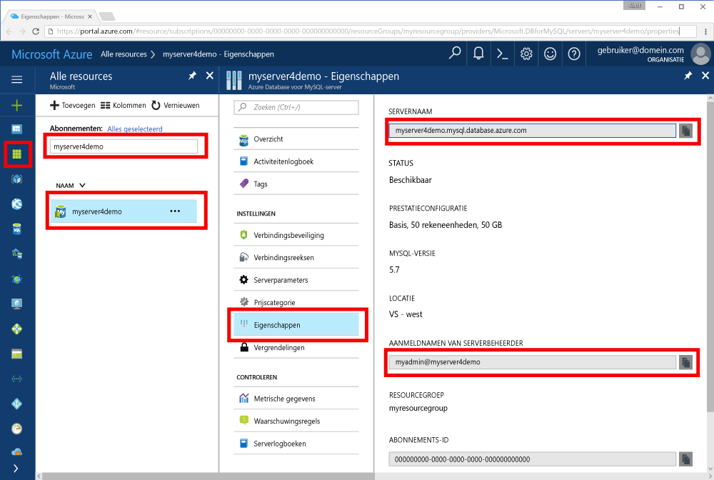

# <a name="azure-database-for-mysql-use-go-language-tooconnect-and-query-data"></a><span data-ttu-id="05048-103">Azure MySQL-Database: taal tooconnect en query gegevens gaat gebruiken</span><span class="sxs-lookup"><span data-stu-id="05048-103">Azure Database for MySQL: Use Go language tooconnect and query data</span></span>
<span data-ttu-id="05048-104">Deze snelstartgids demonstreert hoe tooconnect tooan Azure Database voor het gebruik van MySQL geschreven in Hallo code [gaat](https://golang.org/) taal van Windows-, Ubuntu Linux- en Apple Mac OS-platformen.</span><span class="sxs-lookup"><span data-stu-id="05048-104">This quickstart demonstrates how tooconnect tooan Azure Database for MySQL using code written in hello [Go](https://golang.org/) language from Windows, Ubuntu Linux, and Apple macOS platforms.</span></span> <span data-ttu-id="05048-105">Er wordt weergegeven hoe toouse SQL-instructies tooquery invoegen, bijwerken en verwijderen van gegevens in Hallo-database.</span><span class="sxs-lookup"><span data-stu-id="05048-105">It shows how toouse SQL statements tooquery, insert, update, and delete data in hello database.</span></span> <span data-ttu-id="05048-106">In dit artikel wordt ervan uitgegaan dat u bekend bent met het ontwikkelen met behulp van gaat, maar in dat u nieuwe tooworking met Azure-Database voor MySQL.</span><span class="sxs-lookup"><span data-stu-id="05048-106">This article assumes you are familiar with development using Go, but that you are new tooworking with Azure Database for MySQL.</span></span>

## <a name="prerequisites"></a><span data-ttu-id="05048-107">Vereisten</span><span class="sxs-lookup"><span data-stu-id="05048-107">Prerequisites</span></span>
<span data-ttu-id="05048-108">Deze snelstartgids Hallo bronnen die zijn gemaakt in een van deze handleidingen als uitgangspunt gebruikt:</span><span class="sxs-lookup"><span data-stu-id="05048-108">This quickstart uses hello resources created in either of these guides as a starting point:</span></span>
- [<span data-ttu-id="05048-109">Een Azure-database voor een MySQL-server maken met behulp van Azure Portal</span><span class="sxs-lookup"><span data-stu-id="05048-109">Create an Azure Database for MySQL server using Azure portal</span></span>](./quickstart-create-mysql-server-database-using-azure-portal.md)
- [<span data-ttu-id="05048-110">Een Azure-database voor een MySQL-server maken met behulp van Azure CLI</span><span class="sxs-lookup"><span data-stu-id="05048-110">Create an Azure Database for MySQL server using Azure CLI</span></span>](./quickstart-create-mysql-server-database-using-azure-cli.md)

## <a name="install-go-and-mysql-connector"></a><span data-ttu-id="05048-111">Go en de MySQL-connector installeren</span><span class="sxs-lookup"><span data-stu-id="05048-111">Install Go and MySQL connector</span></span>
<span data-ttu-id="05048-112">Installeer [gaat](https://golang.org/doc/install) en Hallo [gaat u-sql-stuurprogramma voor MySQL](https://github.com/go-sql-driver/mysql#installation) op uw computer.</span><span class="sxs-lookup"><span data-stu-id="05048-112">Install [Go](https://golang.org/doc/install) and hello [go-sql-driver for MySQL](https://github.com/go-sql-driver/mysql#installation) on your own machine.</span></span> <span data-ttu-id="05048-113">Hallo stappen, afhankelijk van uw platform:</span><span class="sxs-lookup"><span data-stu-id="05048-113">Depending on your platform, follow hello steps:</span></span>

### <a name="windows"></a><span data-ttu-id="05048-114">Windows</span><span class="sxs-lookup"><span data-stu-id="05048-114">Windows</span></span>
1. <span data-ttu-id="05048-115">[Download](https://golang.org/dl/) en Ga voor Microsoft Windows toohello volgens installeren [installatie-instructies](https://golang.org/doc/install).</span><span class="sxs-lookup"><span data-stu-id="05048-115">[Download](https://golang.org/dl/) and install Go for Microsoft Windows according toohello [installation instructions](https://golang.org/doc/install).</span></span>
2. <span data-ttu-id="05048-116">Hallo-opdrachtregel vanuit het startmenu Hallo starten.</span><span class="sxs-lookup"><span data-stu-id="05048-116">Launch hello command prompt from hello start menu.</span></span>
3. <span data-ttu-id="05048-117">Maak een map voor uw project, bijvoorbeeld:</span><span class="sxs-lookup"><span data-stu-id="05048-117">Make a folder for your project such.</span></span> <span data-ttu-id="05048-118">`mkdir  %USERPROFILE%\go\src\mysqlgo`.</span><span class="sxs-lookup"><span data-stu-id="05048-118">`mkdir  %USERPROFILE%\go\src\mysqlgo`.</span></span>
4. <span data-ttu-id="05048-119">Wijzig map in de projectmap hello, zoals `cd %USERPROFILE%\go\src\mysqlgo`.</span><span class="sxs-lookup"><span data-stu-id="05048-119">Change directory into hello project folder, such as `cd %USERPROFILE%\go\src\mysqlgo`.</span></span>
5. <span data-ttu-id="05048-120">Hallo-omgevingsvariabele voor GOPATH toopoint toohello source code directory ingesteld.</span><span class="sxs-lookup"><span data-stu-id="05048-120">Set hello environment variable for GOPATH toopoint toohello source code directory.</span></span> <span data-ttu-id="05048-121">`set GOPATH=%USERPROFILE%\go`.</span><span class="sxs-lookup"><span data-stu-id="05048-121">`set GOPATH=%USERPROFILE%\go`.</span></span>
6. <span data-ttu-id="05048-122">Hallo installeren [gaat u-sql-stuurprogramma voor mysql](https://github.com/go-sql-driver/mysql#installation) door het uitvoeren van Hallo `go get github.com/go-sql-driver/mysql` opdracht.</span><span class="sxs-lookup"><span data-stu-id="05048-122">Install hello [go-sql-driver for mysql](https://github.com/go-sql-driver/mysql#installation) by running hello `go get github.com/go-sql-driver/mysql` command.</span></span>

   <span data-ttu-id="05048-123">Kortom, installeer Ga en voer vervolgens deze opdrachten in het Hallo-opdrachtprompt:</span><span class="sxs-lookup"><span data-stu-id="05048-123">In summary, install Go, then run these commands in hello command prompt:</span></span>
   ```cmd
   mkdir  %USERPROFILE%\go\src\mysqlgo
   cd %USERPROFILE%\go\src\mysqlgo
   set GOPATH=%USERPROFILE%\go
   go get github.com/go-sql-driver/mysql
   ```

### <a name="linux-ubuntu"></a><span data-ttu-id="05048-124">Linux (Ubuntu)</span><span class="sxs-lookup"><span data-stu-id="05048-124">Linux (Ubuntu)</span></span>
1. <span data-ttu-id="05048-125">Hallo Bash-shell start.</span><span class="sxs-lookup"><span data-stu-id="05048-125">Launch hello Bash shell.</span></span> 
2. <span data-ttu-id="05048-126">Installeer Go door `sudo apt-get install golang-go` uit te voeren.</span><span class="sxs-lookup"><span data-stu-id="05048-126">Install Go by running `sudo apt-get install golang-go`.</span></span>
3. <span data-ttu-id="05048-127">Maak in de basismap een map voor uw project, bijvoorbeeld `mkdir -p ~/go/src/mysqlgo/`.</span><span class="sxs-lookup"><span data-stu-id="05048-127">Make a folder for your project in your home directory, such as `mkdir -p ~/go/src/mysqlgo/`.</span></span>
4. <span data-ttu-id="05048-128">Wijzig map naar de map hello, zoals `cd ~/go/src/mysqlgo/`.</span><span class="sxs-lookup"><span data-stu-id="05048-128">Change directory into hello folder, such as `cd ~/go/src/mysqlgo/`.</span></span>
5. <span data-ttu-id="05048-129">Set Hallo GOPATH omgeving variabele toopoint tooa geldige bronmap, zoals uw huidige startpagina van de directory gaat map.</span><span class="sxs-lookup"><span data-stu-id="05048-129">Set hello GOPATH environment variable toopoint tooa valid source directory, such as your current home directory's go folder.</span></span> <span data-ttu-id="05048-130">Uitvoeren op Hallo bash-shell, `export GOPATH=~/go` tooadd Hallo directory gaat u als hello GOPATH voor Hallo huidige shell-sessie.</span><span class="sxs-lookup"><span data-stu-id="05048-130">At hello bash shell, run `export GOPATH=~/go` tooadd hello go directory as hello GOPATH for hello current shell session.</span></span>
6. <span data-ttu-id="05048-131">Hallo installeren [gaat u-sql-stuurprogramma voor mysql](https://github.com/go-sql-driver/mysql#installation) door het uitvoeren van Hallo `go get github.com/go-sql-driver/mysql` opdracht.</span><span class="sxs-lookup"><span data-stu-id="05048-131">Install hello [go-sql-driver for mysql](https://github.com/go-sql-driver/mysql#installation) by running hello `go get github.com/go-sql-driver/mysql` command.</span></span>

   <span data-ttu-id="05048-132">Kortom: voer deze Bash-opdrachten uit:</span><span class="sxs-lookup"><span data-stu-id="05048-132">In summary, run these bash commands:</span></span>
   ```bash
   sudo apt-get install golang-go
   mkdir -p ~/go/src/mysqlgo/
   cd ~/go/src/mysqlgo/
   export GOPATH=~/go/
   go get github.com/go-sql-driver/mysql
   ```

### <a name="apple-macos"></a><span data-ttu-id="05048-133">Apple macOS</span><span class="sxs-lookup"><span data-stu-id="05048-133">Apple macOS</span></span>
1. <span data-ttu-id="05048-134">Download en installeer gaat op basis van toohello [installatie-instructies](https://golang.org/doc/install) die overeenkomt met uw platform.</span><span class="sxs-lookup"><span data-stu-id="05048-134">Download and install Go according toohello [installation instructions](https://golang.org/doc/install)  matching your platform.</span></span> 
2. <span data-ttu-id="05048-135">Hallo Bash-shell start.</span><span class="sxs-lookup"><span data-stu-id="05048-135">Launch hello Bash shell.</span></span> 
3. <span data-ttu-id="05048-136">Maak in de basismap een map voor uw project, bijvoorbeeld `mkdir -p ~/go/src/mysqlgo/`.</span><span class="sxs-lookup"><span data-stu-id="05048-136">Make a folder for your project in your home directory, such as `mkdir -p ~/go/src/mysqlgo/`.</span></span>
4. <span data-ttu-id="05048-137">Wijzig map naar de map hello, zoals `cd ~/go/src/mysqlgo/`.</span><span class="sxs-lookup"><span data-stu-id="05048-137">Change directory into hello folder, such as `cd ~/go/src/mysqlgo/`.</span></span>
5. <span data-ttu-id="05048-138">Set Hallo GOPATH omgeving variabele toopoint tooa geldige bronmap, zoals uw huidige startpagina van de directory gaat map.</span><span class="sxs-lookup"><span data-stu-id="05048-138">Set hello GOPATH environment variable toopoint tooa valid source directory, such as your current home directory's go folder.</span></span> <span data-ttu-id="05048-139">Uitvoeren op Hallo bash-shell, `export GOPATH=~/go` tooadd Hallo directory gaat u als hello GOPATH voor Hallo huidige shell-sessie.</span><span class="sxs-lookup"><span data-stu-id="05048-139">At hello bash shell, run `export GOPATH=~/go` tooadd hello go directory as hello GOPATH for hello current shell session.</span></span>
6. <span data-ttu-id="05048-140">Hallo installeren [gaat u-sql-stuurprogramma voor mysql](https://github.com/go-sql-driver/mysql#installation) door het uitvoeren van Hallo `go get github.com/go-sql-driver/mysql` opdracht.</span><span class="sxs-lookup"><span data-stu-id="05048-140">Install hello [go-sql-driver for mysql](https://github.com/go-sql-driver/mysql#installation) by running hello `go get github.com/go-sql-driver/mysql` command.</span></span>

   <span data-ttu-id="05048-141">Kortom: installeer Go en voer deze Bash-opdrachten uit:</span><span class="sxs-lookup"><span data-stu-id="05048-141">In summary, install Go, then run these bash commands:</span></span>
   ```bash
   mkdir -p ~/go/src/mysqlgo/
   cd ~/go/src/mysqlgo/
   export GOPATH=~/go/
   go get github.com/go-sql-driver/mysql
   ```

## <a name="get-connection-information"></a><span data-ttu-id="05048-142">Verbindingsgegevens ophalen</span><span class="sxs-lookup"><span data-stu-id="05048-142">Get connection information</span></span>
<span data-ttu-id="05048-143">Hallo verbinding informatie die nodig is tooconnect toohello Azure Database voor MySQL niet ophalen.</span><span class="sxs-lookup"><span data-stu-id="05048-143">Get hello connection information needed tooconnect toohello Azure Database for MySQL.</span></span> <span data-ttu-id="05048-144">U moet Hallo van server volledig gekwalificeerde servernaam en aanmeldingsreferenties.</span><span class="sxs-lookup"><span data-stu-id="05048-144">You need hello fully qualified server name and login credentials.</span></span>

1. <span data-ttu-id="05048-145">Meld u bij toohello [Azure-portal](https://portal.azure.com/).</span><span class="sxs-lookup"><span data-stu-id="05048-145">Log in toohello [Azure portal](https://portal.azure.com/).</span></span>
2. <span data-ttu-id="05048-146">Hallo links menu in Azure-portal en klik op **alle resources** en zoek naar Hallo-server die u hebt ook, zoals **myserver4demo**.</span><span class="sxs-lookup"><span data-stu-id="05048-146">From hello left-hand menu in Azure portal, click **All resources** and search for hello server you have creased, such as **myserver4demo**.</span></span>
3. <span data-ttu-id="05048-147">Klik op de servernaam Hallo **myserver4demo**.</span><span class="sxs-lookup"><span data-stu-id="05048-147">Click hello server name **myserver4demo**.</span></span>
4. <span data-ttu-id="05048-148">Selecteer Hallo-server **eigenschappen** pagina.</span><span class="sxs-lookup"><span data-stu-id="05048-148">Select hello server's **Properties** page.</span></span> <span data-ttu-id="05048-149">Maak een notitie van Hallo **servernaam** en **aanmeldingsnaam van Server-beheerder**.</span><span class="sxs-lookup"><span data-stu-id="05048-149">Make a note of hello **Server name** and **Server admin login name**.</span></span>
 <span data-ttu-id="05048-150"></span><span class="sxs-lookup"><span data-stu-id="05048-150"></span></span>
5. <span data-ttu-id="05048-151">Als u uw aanmeldingsgegevens server bent vergeten, gaat u toohello **overzicht** pagina tooview Hallo Server admin-aanmeldingsnaam en, indien nodig, opnieuw ingesteld wachtwoord Hallo.</span><span class="sxs-lookup"><span data-stu-id="05048-151">If you forget your server login information, navigate toohello **Overview** page tooview hello Server admin login name and, if necessary, reset hello password.</span></span>
   

## <a name="build-and-run-go-code"></a><span data-ttu-id="05048-152">Go-code schrijven en uitvoeren</span><span class="sxs-lookup"><span data-stu-id="05048-152">Build and run Go code</span></span> 
1. <span data-ttu-id="05048-153">toowrite Golang code, kunt u een eenvoudige teksteditor zoals Kladblok in Microsoft Windows [vi](http://manpages.ubuntu.com/manpages/xenial/man1/nvi.1.html#contenttoc5) of [Nano](https://www.nano-editor.org/) in Ubuntu en TextEdit voor Mac OS.</span><span class="sxs-lookup"><span data-stu-id="05048-153">toowrite Golang code, you can use a simple text editor, such as Notepad in Microsoft Windows, [vi](http://manpages.ubuntu.com/manpages/xenial/man1/nvi.1.html#contenttoc5) or [Nano](https://www.nano-editor.org/) in Ubuntu, or TextEdit in macOS.</span></span> <span data-ttu-id="05048-154">Als u liever een uitgebreidere Interactive Development Environment (IDE) gebruikt, gaat u aan de slag met [Gogland](https://www.jetbrains.com/go/) van Jetbrains, [Visual Studio Code](https://code.visualstudio.com/) van Microsoft of [Atom](https://atom.io/).</span><span class="sxs-lookup"><span data-stu-id="05048-154">If you prefer a richer Interactive Development Environment (IDE) try [Gogland](https://www.jetbrains.com/go/) by Jetbrains, [Visual Studio Code](https://code.visualstudio.com/) by Microsoft, or [Atom](https://atom.io/).</span></span>
2. <span data-ttu-id="05048-155">Hallo gaat u de code van Hallo secties in tekstbestanden te plakken en opslaan in de projectmap van uw met de bestandsextensie \*.gaat u, zoals Windows-pad `%USERPROFILE%\go\src\mysqlgo\createtable.go` of Linux-pad `~/go/src/mysqlgo/createtable.go`.</span><span class="sxs-lookup"><span data-stu-id="05048-155">Paste hello Go code from hello sections below into text files, and save into your project folder with file extension \*.go, such as Windows path `%USERPROFILE%\go\src\mysqlgo\createtable.go` or Linux path `~/go/src/mysqlgo/createtable.go`.</span></span>
3. <span data-ttu-id="05048-156">Zoek Hallo `HOST`, `DATABASE`, `USER`, en `PASSWORD` constanten in Hallo code en het Hallo-voorbeeldwaarden vervangen met uw eigen waarden.</span><span class="sxs-lookup"><span data-stu-id="05048-156">Locate hello `HOST`, `DATABASE`, `USER`, and `PASSWORD` constants in hello code, and replace hello example values with your own values.</span></span> 
4. <span data-ttu-id="05048-157">Hallo-opdrachtregel starten of bash-shell.</span><span class="sxs-lookup"><span data-stu-id="05048-157">Launch hello command prompt or bash shell.</span></span> <span data-ttu-id="05048-158">Wijzig de map in de projectmap.</span><span class="sxs-lookup"><span data-stu-id="05048-158">Change directory into your project folder.</span></span> <span data-ttu-id="05048-159">Voorbeeld voor Windows: `cd %USERPROFILE%\go\src\mysqlgo\`.</span><span class="sxs-lookup"><span data-stu-id="05048-159">For example, on Windows `cd %USERPROFILE%\go\src\mysqlgo\`.</span></span> <span data-ttu-id="05048-160">Voorbeeld voor Linux: `cd ~/go/src/mysqlgo/`.</span><span class="sxs-lookup"><span data-stu-id="05048-160">On Linux `cd ~/go/src/mysqlgo/`.</span></span>  <span data-ttu-id="05048-161">Aantal Hallo IDE editors vermeld bieden mogelijkheden voor foutopsporing en runtime zonder shell-opdrachten.</span><span class="sxs-lookup"><span data-stu-id="05048-161">Some of hello IDE editors mentioned offer debug and runtime capabilities without requiring shell commands.</span></span>
5. <span data-ttu-id="05048-162">Hallo code uitvoeren met de opdracht Hallo `go run createtable.go` toocompile Hallo toepassing en voer deze uit.</span><span class="sxs-lookup"><span data-stu-id="05048-162">Run hello code by typing hello command `go run createtable.go` toocompile hello application and run it.</span></span> 
6. <span data-ttu-id="05048-163">U kunt ook toobuild Hallo code in een systeemeigen toepassing `go build createtable.go`, start vervolgens `createtable.exe` toorun Hallo-toepassing.</span><span class="sxs-lookup"><span data-stu-id="05048-163">Alternatively, toobuild hello code into a native application, `go build createtable.go`, then launch `createtable.exe` toorun hello application.</span></span>

## <a name="connect-create-table-and-insert-data"></a><span data-ttu-id="05048-164">Verbinden, tabel maken en gegevens invoegen</span><span class="sxs-lookup"><span data-stu-id="05048-164">Connect, create table, and insert data</span></span>
<span data-ttu-id="05048-165">Gebruik Hallo volgende code tooconnect toohello server, een tabel maken en laden Hallo gegevens met een **invoegen** SQL-instructie.</span><span class="sxs-lookup"><span data-stu-id="05048-165">Use hello following code tooconnect toohello server, create a table, and load hello data using an **INSERT** SQL statement.</span></span> 

<span data-ttu-id="05048-166">Hallo code importeert drie pakketten: Hallo [sql-pakket](https://golang.org/pkg/database/sql/), Hallo [Ga sql-stuurprogramma voor mysql](https://github.com/go-sql-driver/mysql#installation) als een stuurprogramma toocommunicate met hello Azure Database voor MySQL en Hallo [fmt pakket](https://golang.org/pkg/fmt/)voor afgedrukte invoer en uitvoer op Hallo-opdrachtregel.</span><span class="sxs-lookup"><span data-stu-id="05048-166">hello code imports three packages: hello [sql package](https://golang.org/pkg/database/sql/), hello [go sql driver for mysql](https://github.com/go-sql-driver/mysql#installation) as a driver toocommunicate with hello Azure Database for MySQL, and hello [fmt package](https://golang.org/pkg/fmt/) for printed input and output on hello command line.</span></span>

<span data-ttu-id="05048-167">Hallo code roept de methode [sql. Open()](http://go-database-sql.org/accessing.html) tooconnect tooAzure Database voor MySQL en controles Hallo verbinding heeft via de methode [db. Ping()](https://golang.org/pkg/database/sql/#DB.Ping).</span><span class="sxs-lookup"><span data-stu-id="05048-167">hello code calls method [sql.Open()](http://go-database-sql.org/accessing.html) tooconnect tooAzure Database for MySQL, and checks hello connection using method [db.Ping()](https://golang.org/pkg/database/sql/#DB.Ping).</span></span> <span data-ttu-id="05048-168">Een [database ingang](https://golang.org/pkg/database/sql/#DB) wordt gebruikt in, houden van de verbindingsgroep Hallo voor Hallo database-server.</span><span class="sxs-lookup"><span data-stu-id="05048-168">A [database handle](https://golang.org/pkg/database/sql/#DB) is used throughout, holding hello connection pool for hello database server.</span></span> <span data-ttu-id="05048-169">Hallo code aanroepen Hallo [Exec()](https://golang.org/pkg/database/sql/#DB.Exec) methode meerdere keren toorun verschillende DDL-opdrachten.</span><span class="sxs-lookup"><span data-stu-id="05048-169">hello code calls hello [Exec()](https://golang.org/pkg/database/sql/#DB.Exec) method several times toorun several DDL commands.</span></span> <span data-ttu-id="05048-170">Hallo code gebruikt ook Hallo [Prepare()](http://go-database-sql.org/prepared.html) en Exec() toorun voorbereid instructies met andere parameters tooinsert drie rijen.</span><span class="sxs-lookup"><span data-stu-id="05048-170">hello code also uses hello [Prepare()](http://go-database-sql.org/prepared.html) and Exec() toorun prepared statements with different parameters tooinsert three rows.</span></span> <span data-ttu-id="05048-171">Telkens wanneer een aangepaste checkError()-methode is gebruikte toocheck als een fout opgetreden en tooexit zorgen.</span><span class="sxs-lookup"><span data-stu-id="05048-171">Each time a custom checkError() method is used toocheck if an error occurred and panic tooexit.</span></span>

<span data-ttu-id="05048-172">Vervang Hallo `host`, `database`, `user`, en `password` constanten met uw eigen waarden.</span><span class="sxs-lookup"><span data-stu-id="05048-172">Replace hello `host`, `database`, `user`, and `password` constants with your own values.</span></span> 

```Go
package main

import (
    "database/sql"
    "fmt"

    _ "github.com/go-sql-driver/mysql"
)

const (
    host     = "myserver4demo.mysql.database.azure.com"
    database = "quickstartdb"
    user     = "myadmin@myserver4demo"
    password = "yourpassword"
)

func checkError(err error) {
    if err != nil {
        panic(err)
    }
}

func main() {

    // Initialize connection string.
    var connectionString = fmt.Sprintf("%s:%s@tcp(%s:3306)/%s?allowNativePasswords=true", user, password, host, database)

    // Initialize connection object.
    db, err := sql.Open("mysql", connectionString)
    checkError(err)
    defer db.Close()

    err = db.Ping()
    checkError(err)
    fmt.Println("Successfully created connection toodatabase.")

    // Drop previous table of same name if one exists.
    _, err = db.Exec("DROP TABLE IF EXISTS inventory;")
    checkError(err)
    fmt.Println("Finished dropping table (if existed).")

    // Create table.
    _, err = db.Exec("CREATE TABLE inventory (id serial PRIMARY KEY, name VARCHAR(50), quantity INTEGER);")
    checkError(err)
    fmt.Println("Finished creating table.")

    // Insert some data into table.
    sqlStatement, err := db.Prepare("INSERT INTO inventory (name, quantity) VALUES (?, ?);")
    res, err := sqlStatement.Exec("banana", 150)
    checkError(err)
    rowCount, err := res.RowsAffected()
    fmt.Printf("Inserted %d row(s) of data.\n", rowCount)

    res, err = sqlStatement.Exec("orange", 154)
    checkError(err)
    rowCount, err = res.RowsAffected()
    fmt.Printf("Inserted %d row(s) of data.\n", rowCount)

    res, err = sqlStatement.Exec("apple", 100)
    checkError(err)
    rowCount, err = res.RowsAffected()
    fmt.Printf("Inserted %d row(s) of data.\n", rowCount)
    fmt.Println("Done.")
}

```

## <a name="read-data"></a><span data-ttu-id="05048-173">Gegevens lezen</span><span class="sxs-lookup"><span data-stu-id="05048-173">Read data</span></span>
<span data-ttu-id="05048-174">Gebruik Hallo volgende tooconnect code en lezen Hallo gegevens met een **Selecteer** SQL-instructie.</span><span class="sxs-lookup"><span data-stu-id="05048-174">Use hello following code tooconnect and read hello data using a **SELECT** SQL statement.</span></span> 

<span data-ttu-id="05048-175">Hallo code importeert drie pakketten: Hallo [sql-pakket](https://golang.org/pkg/database/sql/), Hallo [Ga sql-stuurprogramma voor mysql](https://github.com/go-sql-driver/mysql#installation) als een stuurprogramma toocommunicate met hello Azure Database voor MySQL en Hallo [fmt pakket](https://golang.org/pkg/fmt/)voor afgedrukte invoer en uitvoer op Hallo-opdrachtregel.</span><span class="sxs-lookup"><span data-stu-id="05048-175">hello code imports three packages: hello [sql package](https://golang.org/pkg/database/sql/), hello [go sql driver for mysql](https://github.com/go-sql-driver/mysql#installation) as a driver toocommunicate with hello Azure Database for MySQL, and hello [fmt package](https://golang.org/pkg/fmt/) for printed input and output on hello command line.</span></span>

<span data-ttu-id="05048-176">Hallo code roept de methode [sql. Open()](http://go-database-sql.org/accessing.html) tooconnect tooAzure Database voor MySQL en controles Hallo verbinding heeft via de methode [db. Ping()](https://golang.org/pkg/database/sql/#DB.Ping).</span><span class="sxs-lookup"><span data-stu-id="05048-176">hello code calls method [sql.Open()](http://go-database-sql.org/accessing.html) tooconnect tooAzure Database for MySQL, and checks hello connection using method [db.Ping()](https://golang.org/pkg/database/sql/#DB.Ping).</span></span> <span data-ttu-id="05048-177">Een [database ingang](https://golang.org/pkg/database/sql/#DB) wordt gebruikt in, houden van de verbindingsgroep Hallo voor Hallo database-server.</span><span class="sxs-lookup"><span data-stu-id="05048-177">A [database handle](https://golang.org/pkg/database/sql/#DB) is used throughout, holding hello connection pool for hello database server.</span></span> <span data-ttu-id="05048-178">Hallo code aanroepen Hallo [Query()](https://golang.org/pkg/database/sql/#DB.Query) methode toorun Hallo select-opdracht.</span><span class="sxs-lookup"><span data-stu-id="05048-178">hello code calls hello [Query()](https://golang.org/pkg/database/sql/#DB.Query) method toorun hello select command.</span></span> <span data-ttu-id="05048-179">Vervolgens wordt uitgevoerd [Next()](https://golang.org/pkg/database/sql/#Rows.Next) tooiterate door Hallo resultaatset en [Scan()](https://golang.org/pkg/database/sql/#Rows.Scan) tooparse Hallo kolomwaarden, Hallo waarde opslaan naar variabelen.</span><span class="sxs-lookup"><span data-stu-id="05048-179">Then it runs [Next()](https://golang.org/pkg/database/sql/#Rows.Next) tooiterate through hello result set and [Scan()](https://golang.org/pkg/database/sql/#Rows.Scan) tooparse hello column values, saving hello value into variables.</span></span> <span data-ttu-id="05048-180">Telkens wanneer een aangepaste checkError()-methode is gebruikte toocheck als een fout opgetreden en tooexit zorgen.</span><span class="sxs-lookup"><span data-stu-id="05048-180">Each time a custom checkError() method is used toocheck if an error occurred and panic tooexit.</span></span>

<span data-ttu-id="05048-181">Vervang Hallo `host`, `database`, `user`, en `password` constanten met uw eigen waarden.</span><span class="sxs-lookup"><span data-stu-id="05048-181">Replace hello `host`, `database`, `user`, and `password` constants with your own values.</span></span> 

```Go
package main

import (
    "database/sql"
    "fmt"

    _ "github.com/go-sql-driver/mysql"
)

const (
    host     = "myserver4demo.mysql.database.azure.com"
    database = "quickstartdb"
    user     = "myadmin@myserver4demo"
    password = "yourpassword"
)

func checkError(err error) {
    if err != nil {
        panic(err)
    }
}

func main() {

    // Initialize connection string.
    var connectionString = fmt.Sprintf("%s:%s@tcp(%s:3306)/%s?allowNativePasswords=true", user, password, host, database)

    // Initialize connection object.
    db, err := sql.Open("mysql", connectionString)
    checkError(err)
    defer db.Close()

    err = db.Ping()
    checkError(err)
    fmt.Println("Successfully created connection toodatabase.")

    // Variables for printing column data when scanned.
    var (
        id       int
        name     string
        quantity int
    )

    // Read some data from hello table.
    rows, err := db.Query("SELECT id, name, quantity from inventory;")
    checkError(err)
    defer rows.Close()
    fmt.Println("Reading data:")
    for rows.Next() {
        err := rows.Scan(&id, &name, &quantity)
        checkError(err)
        fmt.Printf("Data row = (%d, %s, %d)\n", id, name, quantity)
    }
    err = rows.Err()
    checkError(err)
    fmt.Println("Done.")
}
```

## <a name="update-data"></a><span data-ttu-id="05048-182">Gegevens bijwerken</span><span class="sxs-lookup"><span data-stu-id="05048-182">Update data</span></span>
<span data-ttu-id="05048-183">Gebruik Hallo volgende tooconnect code en bij te werken Hallo gegevens met een **bijwerken** SQL-instructie.</span><span class="sxs-lookup"><span data-stu-id="05048-183">Use hello following code tooconnect and update hello data using a **UPDATE** SQL statement.</span></span> 

<span data-ttu-id="05048-184">Hallo code importeert drie pakketten: Hallo [sql-pakket](https://golang.org/pkg/database/sql/), Hallo [Ga sql-stuurprogramma voor mysql](https://github.com/go-sql-driver/mysql#installation) als een stuurprogramma toocommunicate met hello Azure Database voor MySQL en Hallo [fmt pakket](https://golang.org/pkg/fmt/)voor afgedrukte invoer en uitvoer op Hallo-opdrachtregel.</span><span class="sxs-lookup"><span data-stu-id="05048-184">hello code imports three packages: hello [sql package](https://golang.org/pkg/database/sql/), hello [go sql driver for mysql](https://github.com/go-sql-driver/mysql#installation) as a driver toocommunicate with hello Azure Database for MySQL, and hello [fmt package](https://golang.org/pkg/fmt/) for printed input and output on hello command line.</span></span>

<span data-ttu-id="05048-185">Hallo code roept de methode [sql. Open()](http://go-database-sql.org/accessing.html) tooconnect tooAzure Database voor MySQL en controles Hallo verbinding heeft via de methode [db. Ping()](https://golang.org/pkg/database/sql/#DB.Ping).</span><span class="sxs-lookup"><span data-stu-id="05048-185">hello code calls method [sql.Open()](http://go-database-sql.org/accessing.html) tooconnect tooAzure Database for MySQL, and checks hello connection using method [db.Ping()](https://golang.org/pkg/database/sql/#DB.Ping).</span></span> <span data-ttu-id="05048-186">Een [database ingang](https://golang.org/pkg/database/sql/#DB) wordt gebruikt in, houden van de verbindingsgroep Hallo voor Hallo database-server.</span><span class="sxs-lookup"><span data-stu-id="05048-186">A [database handle](https://golang.org/pkg/database/sql/#DB) is used throughout, holding hello connection pool for hello database server.</span></span> <span data-ttu-id="05048-187">Hallo code aanroepen Hallo [Exec()](https://golang.org/pkg/database/sql/#DB.Exec) opdracht methode toorun Hallo-update.</span><span class="sxs-lookup"><span data-stu-id="05048-187">hello code calls hello [Exec()](https://golang.org/pkg/database/sql/#DB.Exec) method toorun hello update command.</span></span> <span data-ttu-id="05048-188">Telkens wanneer een aangepaste checkError()-methode is gebruikte toocheck als een fout opgetreden en tooexit zorgen.</span><span class="sxs-lookup"><span data-stu-id="05048-188">Each time a custom checkError() method is used toocheck if an error occurred and panic tooexit.</span></span>

<span data-ttu-id="05048-189">Vervang Hallo `host`, `database`, `user`, en `password` constanten met uw eigen waarden.</span><span class="sxs-lookup"><span data-stu-id="05048-189">Replace hello `host`, `database`, `user`, and `password` constants with your own values.</span></span> 

```Go
package main

import (
    "database/sql"
    "fmt"

    _ "github.com/go-sql-driver/mysql"
)

const (
    host     = "myserver4demo.mysql.database.azure.com"
    database = "quickstartdb"
    user     = "myadmin@myserver4demo"
    password = "yourpassword"
)

func checkError(err error) {
    if err != nil {
        panic(err)
    }
}

func main() {

    // Initialize connection string.
    var connectionString = fmt.Sprintf("%s:%s@tcp(%s:3306)/%s?allowNativePasswords=true", user, password, host, database)

    // Initialize connection object.
    db, err := sql.Open("mysql", connectionString)
    checkError(err)
    defer db.Close()

    err = db.Ping()
    checkError(err)
    fmt.Println("Successfully created connection toodatabase.")

    // Modify some data in table.
    rows, err := db.Exec("UPDATE inventory SET quantity = ? WHERE name = ?", 200, "banana")
    checkError(err)
    rowCount, err := rows.RowsAffected()
    fmt.Printf("Deleted %d row(s) of data.\n", rowCount)
    fmt.Println("Done.")
}
```

## <a name="delete-data"></a><span data-ttu-id="05048-190">Gegevens verwijderen</span><span class="sxs-lookup"><span data-stu-id="05048-190">Delete data</span></span>
<span data-ttu-id="05048-191">Gebruik Hallo volgende tooconnect code en verwijderen van gegevens met een **verwijderen** SQL-instructie.</span><span class="sxs-lookup"><span data-stu-id="05048-191">Use hello following code tooconnect and remove data using a **DELETE** SQL statement.</span></span> 

<span data-ttu-id="05048-192">Hallo code importeert drie pakketten: Hallo [sql-pakket](https://golang.org/pkg/database/sql/), Hallo [Ga sql-stuurprogramma voor mysql](https://github.com/go-sql-driver/mysql#installation) als een stuurprogramma toocommunicate met hello Azure Database voor MySQL en Hallo [fmt pakket](https://golang.org/pkg/fmt/)voor afgedrukte invoer en uitvoer op Hallo-opdrachtregel.</span><span class="sxs-lookup"><span data-stu-id="05048-192">hello code imports three packages: hello [sql package](https://golang.org/pkg/database/sql/), hello [go sql driver for mysql](https://github.com/go-sql-driver/mysql#installation) as a driver toocommunicate with hello Azure Database for MySQL, and hello [fmt package](https://golang.org/pkg/fmt/) for printed input and output on hello command line.</span></span>

<span data-ttu-id="05048-193">Hallo code roept de methode [sql. Open()](http://go-database-sql.org/accessing.html) tooconnect tooAzure Database voor MySQL en controles Hallo verbinding heeft via de methode [db. Ping()](https://golang.org/pkg/database/sql/#DB.Ping).</span><span class="sxs-lookup"><span data-stu-id="05048-193">hello code calls method [sql.Open()](http://go-database-sql.org/accessing.html) tooconnect tooAzure Database for MySQL, and checks hello connection using method [db.Ping()](https://golang.org/pkg/database/sql/#DB.Ping).</span></span> <span data-ttu-id="05048-194">Een [database ingang](https://golang.org/pkg/database/sql/#DB) wordt gebruikt in, houden van de verbindingsgroep Hallo voor Hallo database-server.</span><span class="sxs-lookup"><span data-stu-id="05048-194">A [database handle](https://golang.org/pkg/database/sql/#DB) is used throughout, holding hello connection pool for hello database server.</span></span> <span data-ttu-id="05048-195">Hallo code aanroepen Hallo [Exec()](https://golang.org/pkg/database/sql/#DB.Exec) methode toorun Hallo opdracht verwijderen.</span><span class="sxs-lookup"><span data-stu-id="05048-195">hello code calls hello [Exec()](https://golang.org/pkg/database/sql/#DB.Exec) method toorun hello delete command.</span></span> <span data-ttu-id="05048-196">Telkens wanneer een aangepaste checkError()-methode is gebruikte toocheck als een fout opgetreden en tooexit zorgen.</span><span class="sxs-lookup"><span data-stu-id="05048-196">Each time a custom checkError() method is used toocheck if an error occurred and panic tooexit.</span></span>

<span data-ttu-id="05048-197">Vervang Hallo `host`, `database`, `user`, en `password` constanten met uw eigen waarden.</span><span class="sxs-lookup"><span data-stu-id="05048-197">Replace hello `host`, `database`, `user`, and `password` constants with your own values.</span></span> 

```Go
package main

import (
    "database/sql"
    "fmt"
    _ "github.com/go-sql-driver/mysql"
)

const (
    host     = "myserver4demo.mysql.database.azure.com"
    database = "quickstartdb"
    user     = "myadmin@myserver4demo"
    password = "yourpassword"
)

func checkError(err error) {
    if err != nil {
        panic(err)
    }
}

func main() {

    // Initialize connection string.
    var connectionString = fmt.Sprintf("%s:%s@tcp(%s:3306)/%s?allowNativePasswords=true", user, password, host, database)

    // Initialize connection object.
    db, err := sql.Open("mysql", connectionString)
    checkError(err)
    defer db.Close()

    err = db.Ping()
    checkError(err)
    fmt.Println("Successfully created connection toodatabase.")

    // Modify some data in table.
    rows, err := db.Exec("DELETE FROM inventory WHERE name = ?", "orange")
    checkError(err)
    rowCount, err := rows.RowsAffected()
    fmt.Printf("Deleted %d row(s) of data.\n", rowCount)
    fmt.Println("Done.")
}
```

## <a name="next-steps"></a><span data-ttu-id="05048-198">Volgende stappen</span><span class="sxs-lookup"><span data-stu-id="05048-198">Next steps</span></span>
> [!div class="nextstepaction"]
> [<span data-ttu-id="05048-199">Een database migreren met behulp van Exporteren en importeren</span><span class="sxs-lookup"><span data-stu-id="05048-199">Migrate your database using Export and Import</span></span>](./concepts-migrate-import-export.md)
