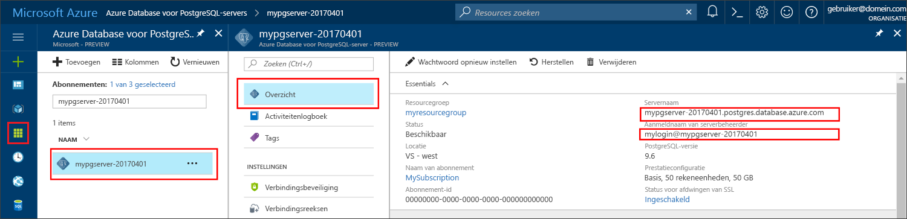

# <a name="azure-database-for-postgresql-use-net-c-tooconnect-and-query-data"></a><span data-ttu-id="c6add-103">Azure PostgreSQL-Database: gebruikt .NET (C#) tooconnect en query-gegevens</span><span class="sxs-lookup"><span data-stu-id="c6add-103">Azure Database for PostgreSQL: Use .NET (C#) tooconnect and query data</span></span>
<span data-ttu-id="c6add-104">Deze snelstartgids demonstreert hoe tooconnect tooan Azure-Database voor PostgreSQL met een C#-toepassing.</span><span class="sxs-lookup"><span data-stu-id="c6add-104">This quickstart demonstrates how tooconnect tooan Azure Database for PostgreSQL using a C# application.</span></span> <span data-ttu-id="c6add-105">Er wordt weergegeven hoe toouse SQL-instructies tooquery invoegen, bijwerken en verwijderen van gegevens in Hallo-database.</span><span class="sxs-lookup"><span data-stu-id="c6add-105">It shows how toouse SQL statements tooquery, insert, update, and delete data in hello database.</span></span> <span data-ttu-id="c6add-106">Hallo stappen in dit artikel wordt ervan uitgegaan dat u bekend bent met ontwikkelen met C#, en dat u een nieuwe tooworking met Azure-Database voor PostgreSQL bent.</span><span class="sxs-lookup"><span data-stu-id="c6add-106">hello steps in this article assume that you are familiar with developing using C#, and that you are new tooworking with Azure Database for PostgreSQL.</span></span>

## <a name="prerequisites"></a><span data-ttu-id="c6add-107">Vereisten</span><span class="sxs-lookup"><span data-stu-id="c6add-107">Prerequisites</span></span>
<span data-ttu-id="c6add-108">Deze snelstartgids Hallo bronnen die zijn gemaakt in een van deze handleidingen als uitgangspunt gebruikt:</span><span class="sxs-lookup"><span data-stu-id="c6add-108">This quickstart uses hello resources created in either of these guides as a starting point:</span></span>
- [<span data-ttu-id="c6add-109">Database maken - Portal</span><span class="sxs-lookup"><span data-stu-id="c6add-109">Create DB - Portal</span></span>](quickstart-create-server-database-portal.md)
- [<span data-ttu-id="c6add-110">Database maken - CLI</span><span class="sxs-lookup"><span data-stu-id="c6add-110">Create DB - CLI</span></span>](quickstart-create-server-database-azure-cli.md)

<span data-ttu-id="c6add-111">U moet ook het volgende doen:</span><span class="sxs-lookup"><span data-stu-id="c6add-111">You also need to:</span></span>
- <span data-ttu-id="c6add-112">Installeer [.NET Framework](https://www.microsoft.com/net/download).</span><span class="sxs-lookup"><span data-stu-id="c6add-112">Install [.NET Framework](https://www.microsoft.com/net/download).</span></span> <span data-ttu-id="c6add-113">Volg de stappen Hallo in Hallo gekoppeld artikel tooinstall .NET specifiek voor uw platform (Windows, Ubuntu Linux en Mac OS).</span><span class="sxs-lookup"><span data-stu-id="c6add-113">Follow hello steps in hello linked article tooinstall .NET specifically for your platform (Windows, Ubuntu Linux, or macOS).</span></span> 
- <span data-ttu-id="c6add-114">Installeer [Visual Studio](https://www.visualstudio.com/downloads/) of Visual Studio Code tootype en bewerk code.</span><span class="sxs-lookup"><span data-stu-id="c6add-114">Install [Visual Studio](https://www.visualstudio.com/downloads/) or Visual Studio Code tootype and edit code.</span></span>
- <span data-ttu-id="c6add-115">Installeer de bibliotheek [Npgsql](http://www.npgsql.org/doc/index.html) zoals hieronder wordt beschreven.</span><span class="sxs-lookup"><span data-stu-id="c6add-115">Install [Npgsql](http://www.npgsql.org/doc/index.html) library as described below.</span></span>

## <a name="install-npgsql-references-into-your-visual-studio-solution"></a><span data-ttu-id="c6add-116">Npgsql-verwijzingen installeren in uw Visual Studio-oplossing</span><span class="sxs-lookup"><span data-stu-id="c6add-116">Install Npgsql references into your Visual Studio solution</span></span>
<span data-ttu-id="c6add-117">tooconnect van Hallo C#-toepassing tooPostgreSQL, gebruik Hallo ADO.NET-bibliotheek voor open-source Npgsql aangeroepen.</span><span class="sxs-lookup"><span data-stu-id="c6add-117">tooconnect from hello C# application tooPostgreSQL, use hello open source ADO.NET library called Npgsql.</span></span> <span data-ttu-id="c6add-118">NuGet kunt downloaden en eenvoudig hello verwijzingen beheren.</span><span class="sxs-lookup"><span data-stu-id="c6add-118">NuGet helps download and manage hello references easily.</span></span>

1. <span data-ttu-id="c6add-119">Maak als volgt een nieuwe C#-oplossing of open een bestaande:</span><span class="sxs-lookup"><span data-stu-id="c6add-119">Create a new C# solution, or open an existing one:</span></span> 
   - <span data-ttu-id="c6add-120">Maak in Visual Studio een oplossing door te klikken op het menu Bestand **Nieuw** > **Project**.</span><span class="sxs-lookup"><span data-stu-id="c6add-120">Within Visual Studio, create a solution, by clicking File menu **New** > **Project**.</span></span>
   - <span data-ttu-id="c6add-121">Vouw in het dialoogvenster Nieuw Project Hallo, **sjablonen** > **Visual C#**.</span><span class="sxs-lookup"><span data-stu-id="c6add-121">In hello New Project dialogue, expand **Templates** > **Visual C#**.</span></span> 
   - <span data-ttu-id="c6add-122">Kies een geschikte sjabloon, bijvoorbeeld **Console-app (.NET Core)**.</span><span class="sxs-lookup"><span data-stu-id="c6add-122">Choose an appropriate template such as **Console App (.NET Core)**.</span></span>

2. <span data-ttu-id="c6add-123">Hallo Nuget Package Manager tooinstall Npgsql gebruiken:</span><span class="sxs-lookup"><span data-stu-id="c6add-123">Use hello Nuget Package Manager tooinstall Npgsql:</span></span>
   - <span data-ttu-id="c6add-124">Klik op Hallo **extra** menu > **NuGet Package Manager** > **Package Manager Console**.</span><span class="sxs-lookup"><span data-stu-id="c6add-124">Click hello **Tools** menu > **NuGet Package Manager** > **Package Manager Console**.</span></span>
   - <span data-ttu-id="c6add-125">In Hallo **Package Manager Console**, type`Install-Package Npgsql`</span><span class="sxs-lookup"><span data-stu-id="c6add-125">In hello **Package Manager Console**, type `Install-Package Npgsql`</span></span>
   - <span data-ttu-id="c6add-126">Hallo opdracht downloads Hallo Npgsql.dll en verwante assembly's installeren en toegevoegd als afhankelijkheden in Hallo-oplossing.</span><span class="sxs-lookup"><span data-stu-id="c6add-126">hello install command downloads hello Npgsql.dll and related assemblies and adds them as dependencies in hello solution.</span></span>

## <a name="get-connection-information"></a><span data-ttu-id="c6add-127">Verbindingsgegevens ophalen</span><span class="sxs-lookup"><span data-stu-id="c6add-127">Get connection information</span></span>
<span data-ttu-id="c6add-128">Hallo verbinding informatie die nodig is tooconnect toohello Azure Database voor PostgreSQL niet ophalen.</span><span class="sxs-lookup"><span data-stu-id="c6add-128">Get hello connection information needed tooconnect toohello Azure Database for PostgreSQL.</span></span> <span data-ttu-id="c6add-129">U moet Hallo van server volledig gekwalificeerde servernaam en aanmeldingsreferenties.</span><span class="sxs-lookup"><span data-stu-id="c6add-129">You need hello fully qualified server name and login credentials.</span></span>

1. <span data-ttu-id="c6add-130">Meld u bij toohello [Azure-portal](https://portal.azure.com/).</span><span class="sxs-lookup"><span data-stu-id="c6add-130">Log in toohello [Azure portal](https://portal.azure.com/).</span></span>
2. <span data-ttu-id="c6add-131">Hallo links menu in Azure-portal en klik op **alle resources** en zoek naar Hallo-server die u hebt gemaakt, zoals **mypgserver 20170401**.</span><span class="sxs-lookup"><span data-stu-id="c6add-131">From hello left-hand menu in Azure portal, click **All resources** and search for hello server you have created, such as **mypgserver-20170401**.</span></span>
3. <span data-ttu-id="c6add-132">Klik op de servernaam Hallo **mypgserver 20170401**.</span><span class="sxs-lookup"><span data-stu-id="c6add-132">Click hello server name **mypgserver-20170401**.</span></span>
4. <span data-ttu-id="c6add-133">Selecteer Hallo-server **overzicht** pagina.</span><span class="sxs-lookup"><span data-stu-id="c6add-133">Select hello server's **Overview** page.</span></span> <span data-ttu-id="c6add-134">Maak een notitie van Hallo **servernaam** en **aanmeldingsnaam van Server-beheerder**.</span><span class="sxs-lookup"><span data-stu-id="c6add-134">Make a note of hello **Server name** and **Server admin login name**.</span></span>
 <span data-ttu-id="c6add-135"></span><span class="sxs-lookup"><span data-stu-id="c6add-135"></span></span>
5. <span data-ttu-id="c6add-136">Als u uw aanmeldingsgegevens server bent vergeten, gaat u toohello **overzicht** pagina tooview Hallo Server admin-aanmeldingsnaam en, indien nodig, opnieuw ingesteld wachtwoord Hallo.</span><span class="sxs-lookup"><span data-stu-id="c6add-136">If you forget your server login information, navigate toohello **Overview** page tooview hello Server admin login name and, if necessary, reset hello password.</span></span>

## <a name="connect-create-table-and-insert-data"></a><span data-ttu-id="c6add-137">Verbinden, tabel maken en gegevens invoegen</span><span class="sxs-lookup"><span data-stu-id="c6add-137">Connect, create table, and insert data</span></span>
<span data-ttu-id="c6add-138">Gebruik Hallo volgende tooconnect code en laden van gegevens met Hallo **CREATE TABLE** en **INSERT INTO** SQL-instructies.</span><span class="sxs-lookup"><span data-stu-id="c6add-138">Use hello following code tooconnect and load hello data using **CREATE TABLE** and  **INSERT INTO** SQL statements.</span></span> <span data-ttu-id="c6add-139">Hallo code NpgsqlCommand klasse gebruikt met methode [Open()](http://www.npgsql.org/api/Npgsql.NpgsqlConnection.html#Npgsql_NpgsqlConnection_Open) tooestablish een tooPostgreSQL verbinding.</span><span class="sxs-lookup"><span data-stu-id="c6add-139">hello code uses NpgsqlCommand class with method [Open()](http://www.npgsql.org/api/Npgsql.NpgsqlConnection.html#Npgsql_NpgsqlConnection_Open) tooestablish a connection tooPostgreSQL.</span></span> <span data-ttu-id="c6add-140">Hallo-code wordt de methode [CreateCommand()](http://www.npgsql.org/api/Npgsql.NpgsqlConnection.html#Npgsql_NpgsqlConnection_CreateCommand), stelt de eigenschap CommandText Hallo en roept de methode [ExecuteNonQuery()](http://www.npgsql.org/api/Npgsql.NpgsqlCommand.html#Npgsql_NpgsqlCommand_ExecuteNonQuery) toorun Hallo databaseopdrachten.</span><span class="sxs-lookup"><span data-stu-id="c6add-140">Then hello code uses method [CreateCommand()](http://www.npgsql.org/api/Npgsql.NpgsqlConnection.html#Npgsql_NpgsqlConnection_CreateCommand), sets hello CommandText property, and calls method [ExecuteNonQuery()](http://www.npgsql.org/api/Npgsql.NpgsqlCommand.html#Npgsql_NpgsqlCommand_ExecuteNonQuery) toorun hello database commands.</span></span> 

<span data-ttu-id="c6add-141">Hallo-Host, DBName, gebruiker en het wachtwoord parameters vervangen door Hallo waarden die u hebt opgegeven toen u Hallo-server en database gemaakt.</span><span class="sxs-lookup"><span data-stu-id="c6add-141">Replace hello Host, DBName, User, and Password parameters with hello values that you specified when you created hello server and database.</span></span> 

```csharp
using System;
using System.Collections.Generic;
using System.Linq;
using System.Text;
using System.Threading.Tasks;
using Npgsql;

namespace Driver
{
    public class AzurePostgresCreate
    {
        // Obtain connection string information from hello portal
        //
        private static string Host = "mypgserver-20170401.postgres.database.azure.com";
        private static string User = "mylogin@mypgserver-20170401";
        private static string DBname = "mypgsqldb";
        private static string Password = "<server_admin_password>";
        private static string Port = "5432";

        static void Main(string[] args)
        {
            // Build connection string using parameters from portal
            //
            string connString =
                String.Format(
                    "Server={0}; User Id={1}; Database={2}; Port={3}; Password={4}; SSL Mode=Prefer; Trust Server Certificate=true",
                    Host,
                    User,
                    DBname,
                    Port,
                    Password);

            var conn = new NpgsqlConnection(connString);

            Console.Out.WriteLine("Opening connection");
            conn.Open();

            var command = conn.CreateCommand();
            command.CommandText = "DROP TABLE IF EXISTS inventory;";
            command.ExecuteNonQuery();
            Console.Out.WriteLine("Finished dropping table (if existed)");

            command.CommandText = "CREATE TABLE inventory (id serial PRIMARY KEY, name VARCHAR(50), quantity INTEGER);";
            command.ExecuteNonQuery();
            Console.Out.WriteLine("Finished creating table");

            command.CommandText =
                String.Format(
                    @"
                                INSERT INTO inventory (name, quantity) VALUES ({0}, {1});
                                INSERT INTO inventory (name, quantity) VALUES ({2}, {3});
                                INSERT INTO inventory (name, quantity) VALUES ({4}, {5});
                            ",
                    "\'banana\'", 150,
                    "\'orange\'", 154,
                    "\'apple\'", 100
                    );

            int nRows = command.ExecuteNonQuery();
            Console.Out.WriteLine(String.Format("Number of rows inserted={0}", nRows));

            Console.Out.WriteLine("Closing connection");
            conn.Close();

            Console.WriteLine("Press RETURN tooexit");
            Console.ReadLine();
        }
    }
}
```

## <a name="read-data"></a><span data-ttu-id="c6add-142">Gegevens lezen</span><span class="sxs-lookup"><span data-stu-id="c6add-142">Read data</span></span>
<span data-ttu-id="c6add-143">Gebruik Hallo volgende tooconnect code en lezen Hallo gegevens met een **Selecteer** SQL-instructie.</span><span class="sxs-lookup"><span data-stu-id="c6add-143">Use hello following code tooconnect and read hello data using a **SELECT** SQL statement.</span></span> <span data-ttu-id="c6add-144">Hallo code NpgsqlCommand klasse gebruikt met methode [Open()](http://www.npgsql.org/api/Npgsql.NpgsqlConnection.html#Npgsql_NpgsqlConnection_Open) tooestablish een tooPostgreSQL verbinding.</span><span class="sxs-lookup"><span data-stu-id="c6add-144">hello code uses NpgsqlCommand class with method [Open()](http://www.npgsql.org/api/Npgsql.NpgsqlConnection.html#Npgsql_NpgsqlConnection_Open) tooestablish a connection tooPostgreSQL.</span></span> <span data-ttu-id="c6add-145">Hallo-code wordt de methode [CreateCommand()](http://www.npgsql.org/api/Npgsql.NpgsqlConnection.html#Npgsql_NpgsqlConnection_CreateCommand) en methode [ExecuteReader())](http://www.npgsql.org/api/Npgsql.NpgsqlCommand.html#Npgsql_NpgsqlCommand_ExecuteReader) toorun Hallo databaseopdrachten.</span><span class="sxs-lookup"><span data-stu-id="c6add-145">Then hello code uses method [CreateCommand()](http://www.npgsql.org/api/Npgsql.NpgsqlConnection.html#Npgsql_NpgsqlConnection_CreateCommand) and method [ExecuteReader()](http://www.npgsql.org/api/Npgsql.NpgsqlCommand.html#Npgsql_NpgsqlCommand_ExecuteReader) toorun hello database commands.</span></span> <span data-ttu-id="c6add-146">Naast Hallo code wordt [Read()](http://www.npgsql.org/api/Npgsql.NpgsqlDataReader.html#Npgsql_NpgsqlDataReader_Read) tooadvance toohello records in Hallo resultaten.</span><span class="sxs-lookup"><span data-stu-id="c6add-146">Next hello code uses [Read()](http://www.npgsql.org/api/Npgsql.NpgsqlDataReader.html#Npgsql_NpgsqlDataReader_Read) tooadvance toohello records in hello results.</span></span> <span data-ttu-id="c6add-147">Hallo-code wordt [GetInt32()](http://www.npgsql.org/api/Npgsql.NpgsqlDataReader.html#Npgsql_NpgsqlDataReader_GetInt32_System_Int32_) en [GetString()](http://www.npgsql.org/api/Npgsql.NpgsqlDataReader.html#Npgsql_NpgsqlDataReader_GetString_System_Int32_) tooparse Hallo waarden in Hallo record.</span><span class="sxs-lookup"><span data-stu-id="c6add-147">Then hello code uses [GetInt32()](http://www.npgsql.org/api/Npgsql.NpgsqlDataReader.html#Npgsql_NpgsqlDataReader_GetInt32_System_Int32_) and [GetString()](http://www.npgsql.org/api/Npgsql.NpgsqlDataReader.html#Npgsql_NpgsqlDataReader_GetString_System_Int32_) tooparse hello values in hello record.</span></span>

<span data-ttu-id="c6add-148">Hallo-Host, DBName, gebruiker en het wachtwoord parameters vervangen door Hallo waarden die u hebt opgegeven toen u Hallo-server en database gemaakt.</span><span class="sxs-lookup"><span data-stu-id="c6add-148">Replace hello Host, DBName, User, and Password parameters with hello values that you specified when you created hello server and database.</span></span> 

```csharp
using System;
using System.Collections.Generic;
using System.Linq;
using System.Text;
using System.Threading.Tasks;
using Npgsql;

namespace Driver
{
    public class AzurePostgresRead
    {
        // Obtain connection string information from hello portal
        //
        private static string Host = "mypgserver-20170401.postgres.database.azure.com";
        private static string User = "mylogin@mypgserver-20170401";
        private static string DBname = "mypgsqldb";
        private static string Password = "<server_admin_password>";
        private static string Port = "5432";

        static void Main(string[] args)
        {
            // Build connection string using parameters from portal
            //
            string connString =
                String.Format(
                    "Server={0}; User Id={1}; Database={2}; Port={3}; Password={4};",
                    Host,
                    User,
                    DBname,
                    Port,
                    Password);

            var conn = new NpgsqlConnection(connString);

            Console.Out.WriteLine("Opening connection");
            conn.Open();

            var command = conn.CreateCommand();
            command.CommandText = "SELECT * FROM inventory;";

            var reader = command.ExecuteReader();
            while (reader.Read())
            {
                Console.WriteLine(
                    string.Format(
                        "Reading from table=({0}, {1}, {2})",
                        reader.GetInt32(0).ToString(),
                        reader.GetString(1),
                        reader.GetInt32(2).ToString()
                        )
                    );
            }

            Console.Out.WriteLine("Closing connection");
            conn.Close();

            Console.WriteLine("Press RETURN tooexit");
            Console.ReadLine();
        }
    }
}
```


## <a name="update-data"></a><span data-ttu-id="c6add-149">Gegevens bijwerken</span><span class="sxs-lookup"><span data-stu-id="c6add-149">Update data</span></span>
<span data-ttu-id="c6add-150">Gebruik Hallo volgende tooconnect code en lezen Hallo gegevens met een **UPDATE** SQL-instructie.</span><span class="sxs-lookup"><span data-stu-id="c6add-150">Use hello following code tooconnect and read hello data using a **UPDATE** SQL statement.</span></span> <span data-ttu-id="c6add-151">Hallo code NpgsqlCommand klasse gebruikt met methode [Open()](http://www.npgsql.org/api/Npgsql.NpgsqlConnection.html#Npgsql_NpgsqlConnection_Open) tooestablish een tooPostgreSQL verbinding.</span><span class="sxs-lookup"><span data-stu-id="c6add-151">hello code uses NpgsqlCommand class with method [Open()](http://www.npgsql.org/api/Npgsql.NpgsqlConnection.html#Npgsql_NpgsqlConnection_Open) tooestablish a connection tooPostgreSQL.</span></span> <span data-ttu-id="c6add-152">Hallo-code wordt de methode [CreateCommand()](http://www.npgsql.org/api/Npgsql.NpgsqlConnection.html#Npgsql_NpgsqlConnection_CreateCommand), stelt de eigenschap CommandText Hallo en roept de methode [ExecuteNonQuery()](http://www.npgsql.org/api/Npgsql.NpgsqlCommand.html#Npgsql_NpgsqlCommand_ExecuteNonQuery) toorun Hallo databaseopdrachten.</span><span class="sxs-lookup"><span data-stu-id="c6add-152">Then hello code uses method [CreateCommand()](http://www.npgsql.org/api/Npgsql.NpgsqlConnection.html#Npgsql_NpgsqlConnection_CreateCommand), sets hello CommandText property, and calls method [ExecuteNonQuery()](http://www.npgsql.org/api/Npgsql.NpgsqlCommand.html#Npgsql_NpgsqlCommand_ExecuteNonQuery) toorun hello database commands.</span></span>

<span data-ttu-id="c6add-153">Hallo-Host, DBName, gebruiker en het wachtwoord parameters vervangen door Hallo waarden die u hebt opgegeven toen u Hallo-server en database gemaakt.</span><span class="sxs-lookup"><span data-stu-id="c6add-153">Replace hello Host, DBName, User, and Password parameters with hello values that you specified when you created hello server and database.</span></span> 

```csharp
using System;
using System.Collections.Generic;
using System.Linq;
using System.Text;
using System.Threading.Tasks;
using Npgsql;

namespace Driver
{
    public class AzurePostgresUpdate
    {
        // Obtain connection string information from hello portal
        //
        private static string Host = "mypgserver-20170401.postgres.database.azure.com";
        private static string User = "mylogin@mypgserver-20170401";
        private static string DBname = "mypgsqldb";
        private static string Password = "<server_admin_password>";
        private static string Port = "5432";

        static void Main(string[] args)
        {
            // Build connection string using parameters from portal
            //
            string connString =
                String.Format(
                    "Server={0}; User Id={1}; Database={2}; Port={3}; Password={4};",
                    Host,
                    User,
                    DBname,
                    Port,
                    Password);

            var conn = new NpgsqlConnection(connString);

            Console.Out.WriteLine("Opening connection");
            conn.Open();

            var command = conn.CreateCommand();
            command.CommandText =
            String.Format("UPDATE inventory SET quantity = {0} WHERE name = {1};",
                200,
                "\'banana\'"
                );

            int nRows = command.ExecuteNonQuery();
            Console.Out.WriteLine(String.Format("Number of rows updated={0}", nRows));

            Console.Out.WriteLine("Closing connection");
            conn.Close();

            Console.WriteLine("Press RETURN tooexit");
            Console.ReadLine();
        }
    }
}
```


## <a name="delete-data"></a><span data-ttu-id="c6add-154">Gegevens verwijderen</span><span class="sxs-lookup"><span data-stu-id="c6add-154">Delete data</span></span>
<span data-ttu-id="c6add-155">Gebruik Hallo volgende tooconnect code en lezen Hallo gegevens met een **verwijderen** SQL-instructie.</span><span class="sxs-lookup"><span data-stu-id="c6add-155">Use hello following code tooconnect and read hello data using a **DELETE** SQL statement.</span></span> 

 <span data-ttu-id="c6add-156">Hallo code NpgsqlCommand klasse gebruikt met methode [Open()](http://www.npgsql.org/api/Npgsql.NpgsqlConnection.html#Npgsql_NpgsqlConnection_Open) tooestablish een tooPostgreSQL verbinding.</span><span class="sxs-lookup"><span data-stu-id="c6add-156">hello code uses NpgsqlCommand class with method [Open()](http://www.npgsql.org/api/Npgsql.NpgsqlConnection.html#Npgsql_NpgsqlConnection_Open) tooestablish a connection tooPostgreSQL.</span></span> <span data-ttu-id="c6add-157">Hallo-code wordt de methode [CreateCommand()](http://www.npgsql.org/api/Npgsql.NpgsqlConnection.html#Npgsql_NpgsqlConnection_CreateCommand), stelt de eigenschap CommandText Hallo en roept de methode [ExecuteNonQuery()](http://www.npgsql.org/api/Npgsql.NpgsqlCommand.html#Npgsql_NpgsqlCommand_ExecuteNonQuery) toorun Hallo databaseopdrachten.</span><span class="sxs-lookup"><span data-stu-id="c6add-157">Then hello code uses method [CreateCommand()](http://www.npgsql.org/api/Npgsql.NpgsqlConnection.html#Npgsql_NpgsqlConnection_CreateCommand), sets hello CommandText property, and calls method [ExecuteNonQuery()](http://www.npgsql.org/api/Npgsql.NpgsqlCommand.html#Npgsql_NpgsqlCommand_ExecuteNonQuery) toorun hello database commands.</span></span>

<span data-ttu-id="c6add-158">Hallo-Host, DBName, gebruiker en het wachtwoord parameters vervangen door Hallo waarden die u hebt opgegeven toen u Hallo-server en database gemaakt.</span><span class="sxs-lookup"><span data-stu-id="c6add-158">Replace hello Host, DBName, User, and Password parameters with hello values that you specified when you created hello server and database.</span></span> 

```csharp
using System;
using System.Collections.Generic;
using System.Linq;
using System.Text;
using System.Threading.Tasks;
using Npgsql;

namespace Driver
{
    public class AzurePostgresDelete
    {
        // Obtain connection string information from hello portal
        //
        private static string Host = "mypgserver-20170401.postgres.database.azure.com";
        private static string User = "mylogin@mypgserver-20170401";
        private static string DBname = "mypgsqldb";
        private static string Password = "<server_admin_password>";
        private static string Port = "5432";

        static void Main(string[] args)
        {
            // Build connection string using parameters from portal
            //
            string connString =
                String.Format(
                    "Server={0}; User Id={1}; Database={2}; Port={3}; Password={4};",
                    Host,
                    User,
                    DBname,
                    Port,
                    Password);

            var conn = new NpgsqlConnection(connString);

            Console.Out.WriteLine("Opening connection");
            conn.Open();

            var command = conn.CreateCommand();
            command.CommandText =
            String.Format("DELETE FROM inventory WHERE name = {0};",
                "\'orange\'");
            int nRows = command.ExecuteNonQuery();
            Console.Out.WriteLine(String.Format("Number of rows deleted={0}", nRows));

            Console.Out.WriteLine("Closing connection");
            conn.Close();

            Console.WriteLine("Press RETURN tooexit");
            Console.ReadLine();
        }
    }
}
```

## <a name="next-steps"></a><span data-ttu-id="c6add-159">Volgende stappen</span><span class="sxs-lookup"><span data-stu-id="c6add-159">Next steps</span></span>
> [!div class="nextstepaction"]
> [<span data-ttu-id="c6add-160">Een database migreren met behulp van Exporteren en importeren</span><span class="sxs-lookup"><span data-stu-id="c6add-160">Migrate your database using Export and Import</span></span>](./howto-migrate-using-export-and-import.md)
