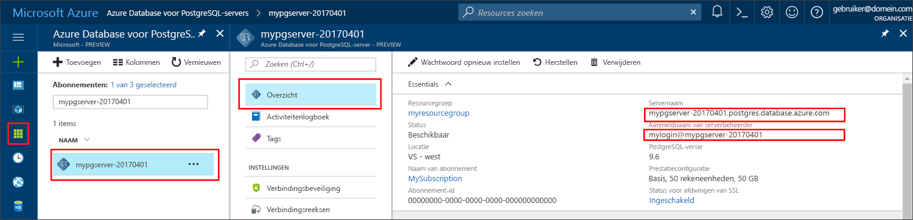

# <a name="azure-database-for-postgresql-use-ruby-tooconnect-and-query-data"></a>Azure-Database voor PostgreSQL: gebruik Ruby tooconnect en query-gegevens
Deze snelstartgids demonstreert hoe tooconnect tooan Azure-Database voor het gebruik van PostgreSQL een [Ruby](https://www.ruby-lang.org) toepassing. Er wordt weergegeven hoe toouse SQL-instructies tooquery invoegen, bijwerken en verwijderen van gegevens in Hallo-database. In dit artikel wordt ervan uitgegaan dat u bekend bent met het ontwikkelen met behulp van Ruby, maar dat u nieuwe tooworking met Azure-Database voor PostgreSQL zijn.

## <a name="prerequisites"></a>Vereisten
Deze snelstartgids Hallo bronnen die zijn gemaakt in een van deze handleidingen als uitgangspunt gebruikt:
- [Database maken - Portal](quickstart-create-server-database-portal.md)
- [Database maken - Azure CLI](quickstart-create-server-database-azure-cli.md)

## <a name="install-ruby"></a>Ruby installeren
Installeer Ruby op uw eigen machine. 

### <a name="windows"></a>Windows
- Download en installeer Hallo meest recente versie van [Ruby](http://rubyinstaller.org/downloads/).
- Op Hallo voltooien scherm van de MSI-installer hello, Hallo selectievakje met de tekst 'uitvoeren 'ridk installeren' tooinstall MSYS2 en ontwikkeling toolchain'. Klik vervolgens op **voltooien** toolaunch Hallo volgende installatieprogramma.
- Hallo RubyInstaller2 voor Windows installer wordt gestart. Typ 2 tooinstall hello MSYS2 opslagplaats update. Nadat deze is voltooid en toohello gevraagd te installeren retourneert, sluit u Hallo-opdrachtvenster.
- Start een nieuwe opdrachtprompt (cmd) vanuit het startmenu Hallo.
- Test Hallo Ruby installatie `ruby -v` toosee Hallo versie is geïnstalleerd.
- Hallo Gem installatie testen `gem -v` toosee Hallo versie is geïnstalleerd.
- Hallo PostgreSQL-module maken voor Ruby Gem door Hallo opdracht uit te voeren met `gem install pg`.

### <a name="macos"></a>MacOS
- Installeren met behulp van Homebrew met Hallo opdracht Ruby `brew install ruby`. Zie voor meer opties voor installatie, Hallo Ruby [documentatie voor de installatie](https://www.ruby-lang.org/en/documentation/installation/#homebrew)
- Test Hallo Ruby installatie `ruby -v` toosee Hallo versie is geïnstalleerd.
- Hallo Gem installatie testen `gem -v` toosee Hallo versie is geïnstalleerd.
- Hallo PostgreSQL-module maken voor Ruby Gem door Hallo opdracht uit te voeren met `gem install pg`.

### <a name="linux-ubuntu"></a>Linux (Ubuntu)
- Ruby installeren met de opdracht Hallo `sudo apt-get install ruby-full`. Zie voor meer opties voor installatie, Hallo Ruby [documentatie voor de installatie](https://www.ruby-lang.org/en/documentation/installation/).
- Test Hallo Ruby installatie `ruby -v` toosee Hallo versie is geïnstalleerd.
- Hallo meest recente updates installeren voor de Gem met Hallo opdracht `sudo gem update --system`.
- Hallo Gem installatie testen `gem -v` toosee Hallo versie is geïnstalleerd.
- Hallo gcc, type en andere build-hulpprogramma's installeren met de opdracht Hallo `sudo apt-get install build-essential`.
- Hallo PostgreSQL bibliotheken installeren met de opdracht Hallo `sudo apt-get install libpq-dev`.
- Hallo Ruby pg-module met behulp van Gem met Hallo opdracht maken `sudo gem install pg`.

## <a name="run-ruby-code"></a>Ruby-code uitvoeren 
- Hallo-code in een tekstbestand op te slaan en opslaan Hallo in een projectmap met bestand extensie .rb, zoals `C:\rubypostgres\read.rb` of`/home/username/rubypostgres/read.rb`
- toorun hello code, opdrachtregel Hallo starten of bash-shell. De map wijzigen in de projectmap `cd rubypostgres`, typt u de opdracht Hallo `ruby read.rb` toorun Hallo-toepassing.

## <a name="get-connection-information"></a>Verbindingsgegevens ophalen
Hallo verbinding informatie die nodig is tooconnect toohello Azure Database voor PostgreSQL niet ophalen. U moet Hallo van server volledig gekwalificeerde servernaam en aanmeldingsreferenties.

1. Meld u bij toohello [Azure-portal](https://portal.azure.com/).
2. Hallo links menu in Azure-portal en klik op **alle resources** en zoek naar Hallo-server die u hebt gemaakt, zoals **mypgserver 20170401**.
3. Klik op de servernaam Hallo **mypgserver 20170401**.
4. Selecteer Hallo-server **overzicht** pagina. Maak een notitie van Hallo **servernaam** en **aanmeldingsnaam van Server-beheerder**.
 
5. Als u uw aanmeldingsgegevens server bent vergeten, gaat u toohello **overzicht** pagina tooview Hallo aanmeldingsnaam van de serverbeheerder. Indien nodig, Hallo-wachtwoord opnieuw instellen.

## <a name="connect-and-create-a-table"></a>Verbinding maken en een tabel maken
Gebruik Hallo volgende tooconnect code en maak een tabel met **CREATE TABLE** SQL-instructie, gevolgd door **INSERT INTO** SQL-instructies tooadd rijen in de tabel Hallo.

Hallo-code wordt een [PG::Connection](http://www.rubydoc.info/gems/pg/PG/Connection) object met de constructor [New](http://www.rubydoc.info/gems/pg/PG%2FConnection:initialize) tooconnect tooAzure Database voor PostgreSQL. Vervolgens deze methode roept [exec()](http://www.rubydoc.info/gems/pg/PG/Connection#exec-instance_method) toorun Hallo neerzetten CREATE TABLE en INSERT INTO-opdrachten. Hallo code controleert op fouten bij het gebruik van Hallo [PG::Error](http://www.rubydoc.info/gems/pg/PG/Error) klasse. Vervolgens deze methode roept [close()](http://www.rubydoc.info/gems/pg/PG/Connection#lo_close-instance_method) tooclose Hallo verbinding voordat het wordt beëindigd.

Vervang Hallo `host`, `database`, `user`, en `password` tekenreeksen door uw eigen waarden. 
```ruby
require 'pg'

begin
    # Initialize connection variables.
    host = String('mypgserver-20170401.postgres.database.azure.com')
    database = String('postgres')
    user = String('mylogin@mypgserver-20170401')
    password = String('<server_admin_password>')

    # Initialize connection object.
    connection = PG::Connection.new(:host => host, :user => user, :dbname => database, :port => '5432', :password => password)
    puts 'Successfully created connection toodatabase'

    # Drop previous table of same name if one exists
    connection.exec('DROP TABLE IF EXISTS inventory;')
    puts 'Finished dropping table (if existed).'

    # Drop previous table of same name if one exists.
    connection.exec('CREATE TABLE inventory (id serial PRIMARY KEY, name VARCHAR(50), quantity INTEGER);')
    puts 'Finished creating table.'

    # Insert some data into table.
    connection.exec("INSERT INTO inventory VALUES(1, 'banana', 150)")
    connection.exec("INSERT INTO inventory VALUES(2, 'orange', 154)")
    connection.exec("INSERT INTO inventory VALUES(3, 'apple', 100)")
    puts 'Inserted 3 rows of data.'

rescue PG::Error => e
    puts e.message 
    
ensure
    connection.close if connection
end
```

## <a name="read-data"></a>Gegevens lezen
Gebruik Hallo volgende tooconnect code en lezen Hallo gegevens met een **Selecteer** SQL-instructie. 

Hallo-code wordt een [PG::Connection](http://www.rubydoc.info/gems/pg/PG/Connection) object met de constructor [New](http://www.rubydoc.info/gems/pg/PG%2FConnection:initialize) tooconnect tooAzure Database voor PostgreSQL. Vervolgens deze methode roept [exec()](http://www.rubydoc.info/gems/pg/PG/Connection#exec-instance_method) toorun Hallo SELECT-opdracht, waarbij u Hallo resultaten in een resultatenset. Hallo resultaat set collectie wordt herhaald ten opzichte van Hallo `resultSet.each do` lus, waarbij u de huidige rijwaarden Hallo in Hallo `row` variabele. Hallo code controleert op fouten bij het gebruik van Hallo [PG::Error](http://www.rubydoc.info/gems/pg/PG/Error) klasse. Vervolgens deze methode roept [close()](http://www.rubydoc.info/gems/pg/PG/Connection#lo_close-instance_method) tooclose Hallo verbinding voordat het wordt beëindigd.

Vervang Hallo `host`, `database`, `user`, en `password` tekenreeksen door uw eigen waarden. 

```ruby
require 'pg'

begin
    # Initialize connection variables.
    host = String('mypgserver-20170401.postgres.database.azure.com')
    database = String('postgres')
    user = String('mylogin@mypgserver-20170401')
    password = String('<server_admin_password>')

    # Initialize connection object.
    connection = PG::Connection.new(:host => host, :user => user, :database => dbname, :port => '5432', :password => password)
    puts 'Successfully created connection toodatabase.'

    resultSet = connection.exec('SELECT * from inventory;')
    resultSet.each do |row|
        puts 'Data row = (%s, %s, %s)' % [row['id'], row['name'], row['quantity']]
    end

rescue PG::Error => e
    puts e.message 
    
ensure
    connection.close if connection
end
```

## <a name="update-data"></a>Gegevens bijwerken
Gebruik Hallo volgende tooconnect code en bij te werken Hallo gegevens met een **bijwerken** SQL-instructie.

Hallo-code wordt een [PG::Connection](http://www.rubydoc.info/gems/pg/PG/Connection) object met de constructor [New](http://www.rubydoc.info/gems/pg/PG%2FConnection:initialize) tooconnect tooAzure Database voor PostgreSQL. Vervolgens deze methode roept [exec()](http://www.rubydoc.info/gems/pg/PG/Connection#exec-instance_method) toorun Hallo opdracht bijwerken. Hallo code controleert op fouten bij het gebruik van Hallo [PG::Error](http://www.rubydoc.info/gems/pg/PG/Error) klasse. Vervolgens deze methode roept [close()](http://www.rubydoc.info/gems/pg/PG/Connection#lo_close-instance_method) tooclose Hallo verbinding voordat het wordt beëindigd.

Vervang Hallo `host`, `database`, `user`, en `password` tekenreeksen door uw eigen waarden. 

```ruby
require 'pg'

begin
    # Initialize connection variables.
    host = String('mypgserver-20170401.postgres.database.azure.com')
    database = String('postgres')
    user = String('mylogin@mypgserver-20170401')
    password = String('<server_admin_password>')

    # Initialize connection object.
    connection = PG::Connection.new(:host => host, :user => user, :dbname => database, :port => '5432', :password => password)
    puts 'Successfully created connection toodatabase.'

    # Modify some data in table.
    connection.exec('UPDATE inventory SET quantity = %d WHERE name = %s;' % [200, '\'banana\''])
    puts 'Updated 1 row of data.'

rescue PG::Error => e
    puts e.message 
    
ensure
    connection.close if connection
end
```


## <a name="delete-data"></a>Gegevens verwijderen
Gebruik Hallo volgende tooconnect code en lezen Hallo gegevens met een **verwijderen** SQL-instructie. 

Hallo-code wordt een [PG::Connection](http://www.rubydoc.info/gems/pg/PG/Connection) object met de constructor [New](http://www.rubydoc.info/gems/pg/PG%2FConnection:initialize) tooconnect tooAzure Database voor PostgreSQL. Vervolgens deze methode roept [exec()](http://www.rubydoc.info/gems/pg/PG/Connection#exec-instance_method) toorun Hallo opdracht bijwerken. Hallo code controleert op fouten bij het gebruik van Hallo [PG::Error](http://www.rubydoc.info/gems/pg/PG/Error) klasse. Vervolgens deze methode roept [close()](http://www.rubydoc.info/gems/pg/PG/Connection#lo_close-instance_method) tooclose Hallo verbinding voordat het wordt beëindigd.

Vervang Hallo `host`, `database`, `user`, en `password` tekenreeksen door uw eigen waarden. 

```ruby
require 'pg'

begin
    # Initialize connection variables.
    host = String('mypgserver-20170401.postgres.database.azure.com')
    database = String('postgres')
    user = String('mylogin@mypgserver-20170401')
    password = String('<server_admin_password>')

    # Initialize connection object.
    connection = PG::Connection.new(:host => host, :user => user, :dbname => database, :port => '5432', :password => password)
    puts 'Successfully created connection toodatabase.'

    # Modify some data in table.
    connection.exec('DELETE FROM inventory WHERE name = %s;' % ['\'orange\''])
    puts 'Deleted 1 row of data.'

rescue PG::Error => e
    puts e.message 
    
ensure
    connection.close if connection
end
```

## <a name="next-steps"></a>Volgende stappen
> [!div class="nextstepaction"]
> [Een database migreren met behulp van Exporteren en importeren](./howto-migrate-using-export-and-import.md)
