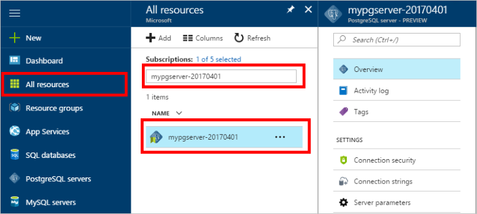

# <a name="create-an-azure-database-for-postgresql-in-hello-azure-portal"></a><span data-ttu-id="407a8-103">Een Azure-Database maken voor PostgreSQL in hello Azure-portal</span><span class="sxs-lookup"><span data-stu-id="407a8-103">Create an Azure Database for PostgreSQL in hello Azure portal</span></span>

<span data-ttu-id="407a8-104">Azure PostgreSQL-Database is een beheerde service waarmee u toorun, beheren en schalen van maximaal beschikbare PostgreSQL-databases in de cloud Hallo.</span><span class="sxs-lookup"><span data-stu-id="407a8-104">Azure Database for PostgreSQL is a managed service that enables you toorun, manage, and scale highly available PostgreSQL databases in hello cloud.</span></span> <span data-ttu-id="407a8-105">Deze snelstartgids ziet u hoe toocreate een Azure-Database voor PostgreSQL-server met behulp van hello Azure-portal in ongeveer vijf minuten.</span><span class="sxs-lookup"><span data-stu-id="407a8-105">This quickstart shows you how toocreate an Azure Database for PostgreSQL server using hello Azure portal in about five minutes.</span></span>

<span data-ttu-id="407a8-106">Als u nog geen Azure-abonnement hebt, maakt u een [gratis account](https://azure.microsoft.com/free/) voordat u begint.</span><span class="sxs-lookup"><span data-stu-id="407a8-106">If you don't have an Azure subscription, create a [free](https://azure.microsoft.com/free/) account before you begin.</span></span>

## <a name="log-in-toohello-azure-portal"></a><span data-ttu-id="407a8-107">Meld u bij toohello Azure-portal</span><span class="sxs-lookup"><span data-stu-id="407a8-107">Log in toohello Azure portal</span></span>
<span data-ttu-id="407a8-108">Open uw webbrowser en navigeer toohello [Microsoft Azure-portal](https://portal.azure.com/).</span><span class="sxs-lookup"><span data-stu-id="407a8-108">Open your web browser, and navigate toohello [Microsoft Azure portal](https://portal.azure.com/).</span></span> <span data-ttu-id="407a8-109">Voer uw referenties toosign in toohello-portal.</span><span class="sxs-lookup"><span data-stu-id="407a8-109">Enter your credentials toosign in toohello portal.</span></span> <span data-ttu-id="407a8-110">Hallo standaardweergave is uw servicedashboard.</span><span class="sxs-lookup"><span data-stu-id="407a8-110">hello default view is your service dashboard.</span></span>

## <a name="create-an-azure-database-for-postgresql"></a><span data-ttu-id="407a8-111">Een Azure Database voor PostgreSQL-server maken</span><span class="sxs-lookup"><span data-stu-id="407a8-111">Create an Azure Database for PostgreSQL</span></span>

<span data-ttu-id="407a8-112">Een Azure Database voor PostgreSQL-server wordt gemaakt met een gedefinieerde set [reken- en opslagresources](./concepts-compute-unit-and-storage.md).</span><span class="sxs-lookup"><span data-stu-id="407a8-112">An Azure Database for PostgreSQL server is created with a defined set of [compute and storage resources](./concepts-compute-unit-and-storage.md).</span></span> <span data-ttu-id="407a8-113">Hallo-server is gemaakt binnen een [Azure-resourcegroep](../azure-resource-manager/resource-group-overview.md).</span><span class="sxs-lookup"><span data-stu-id="407a8-113">hello server is created within an [Azure resource group](../azure-resource-manager/resource-group-overview.md).</span></span>

<span data-ttu-id="407a8-114">Volg deze stappen toocreate een Azure-Database voor PostgreSQL-server:</span><span class="sxs-lookup"><span data-stu-id="407a8-114">Follow these steps toocreate an Azure Database for PostgreSQL server:</span></span>
1.  <span data-ttu-id="407a8-115">Klik op Hallo **nieuw** knop (+) gevonden op Hallo linkerbovenhoek Hallo Azure-portal.</span><span class="sxs-lookup"><span data-stu-id="407a8-115">Click hello **New** button (+) found on hello upper left-hand corner of hello Azure portal.</span></span>
2.  <span data-ttu-id="407a8-116">Selecteer **Databases** van Hallo **nieuw** pagina en selecteer **Azure Database voor PostgreSQL** van Hallo **Databases** pagina.</span><span class="sxs-lookup"><span data-stu-id="407a8-116">Select **Databases** from hello **New** page, and select **Azure Database for PostgreSQL** from hello **Databases** page.</span></span>
 <span data-ttu-id="407a8-117"></span><span class="sxs-lookup"><span data-stu-id="407a8-117"></span></span>

3.  <span data-ttu-id="407a8-118">Hallo nieuwe server detailformulier invullen Hello volgende informatie, zoals wordt weergegeven op Hallo voorafgaand aan de installatiekopie:</span><span class="sxs-lookup"><span data-stu-id="407a8-118">Fill out hello new server details form with hello following information, as shown on hello preceding image:</span></span>

    <span data-ttu-id="407a8-119">Instelling</span><span class="sxs-lookup"><span data-stu-id="407a8-119">Setting</span></span>|<span data-ttu-id="407a8-120">Voorgestelde waarde</span><span class="sxs-lookup"><span data-stu-id="407a8-120">Suggested value</span></span>|<span data-ttu-id="407a8-121">Beschrijving</span><span class="sxs-lookup"><span data-stu-id="407a8-121">Description</span></span>
    ---|---|---
    <span data-ttu-id="407a8-122">Servernaam</span><span class="sxs-lookup"><span data-stu-id="407a8-122">Server name</span></span> |<span data-ttu-id="407a8-123">*mypgserver-20170401*</span><span class="sxs-lookup"><span data-stu-id="407a8-123">*mypgserver-20170401*</span></span>|<span data-ttu-id="407a8-124">Kies een unieke naam ter identificatie van uw Azure-database voor PostgreSQL-server.</span><span class="sxs-lookup"><span data-stu-id="407a8-124">Choose a unique name that identifies your Azure Database for PostgreSQL server.</span></span> <span data-ttu-id="407a8-125">Hallo-domeinnaam *postgres.database.azure.com* toegevoegde toohello servernaam u toepassingen tooconnect om te voorzien.</span><span class="sxs-lookup"><span data-stu-id="407a8-125">hello domain name *postgres.database.azure.com* is appended toohello server name you provide for applications tooconnect to.</span></span> <span data-ttu-id="407a8-126">Hallo-servernaam mag alleen kleine letters, cijfers en Hallo koppelteken (-) bevatten en moet tussen 3 en 63 tekens bevatten.</span><span class="sxs-lookup"><span data-stu-id="407a8-126">hello server name can contain only lowercase letters, numbers, and hello hyphen (-) character, and it must contain from 3 through 63 characters.</span></span>
    <span data-ttu-id="407a8-127">Abonnement</span><span class="sxs-lookup"><span data-stu-id="407a8-127">Subscription</span></span>|<span data-ttu-id="407a8-128">*Uw abonnement*</span><span class="sxs-lookup"><span data-stu-id="407a8-128">*Your subscription*</span></span>|<span data-ttu-id="407a8-129">Hello Azure-abonnement dat u wilt de toouse voor uw server.</span><span class="sxs-lookup"><span data-stu-id="407a8-129">hello Azure subscription that you want toouse for your server.</span></span> <span data-ttu-id="407a8-130">Als u meerdere abonnementen hebt, kiest u Hallo juiste abonnement waarin Hallo resource wordt gefactureerd voor.</span><span class="sxs-lookup"><span data-stu-id="407a8-130">If you have multiple subscriptions, choose hello appropriate subscription in which hello resource is billed for.</span></span>
    <span data-ttu-id="407a8-131">Resourcegroep</span><span class="sxs-lookup"><span data-stu-id="407a8-131">Resource Group</span></span>|<span data-ttu-id="407a8-132">*myresourcegroup*</span><span class="sxs-lookup"><span data-stu-id="407a8-132">*myresourcegroup*</span></span>| <span data-ttu-id="407a8-133">U kunt een nieuwe resourcegroepnaam maken of een bestaande naam uit uw abonnement gebruiken.</span><span class="sxs-lookup"><span data-stu-id="407a8-133">You may make a new resource group name, or use an existing one from your subscription.</span></span>
    <span data-ttu-id="407a8-134">Aanmeldgegevens van serverbeheerder</span><span class="sxs-lookup"><span data-stu-id="407a8-134">Server admin login</span></span> |<span data-ttu-id="407a8-135">*mylogin*</span><span class="sxs-lookup"><span data-stu-id="407a8-135">*mylogin*</span></span>| <span data-ttu-id="407a8-136">Controleer uw eigen account aanmelding toouse wanneer toohello server verbinding kunnen maken.</span><span class="sxs-lookup"><span data-stu-id="407a8-136">Make your own login account toouse when connecting toohello server.</span></span> <span data-ttu-id="407a8-137">Hallo beheerder aanmeldingsnaam mag niet 'azure_superuser', 'azure_pg_admin', 'admin', ' administrator', 'root', 'gast' of 'openbaar', en mag niet beginnen met 'pg_'.</span><span class="sxs-lookup"><span data-stu-id="407a8-137">hello admin login name cannot be 'azure_superuser', 'azure_pg_admin', 'admin', 'administrator', 'root', 'guest', or 'public', and cannot start with 'pg_'.</span></span>
    <span data-ttu-id="407a8-138">Wachtwoord</span><span class="sxs-lookup"><span data-stu-id="407a8-138">Password</span></span> |<span data-ttu-id="407a8-139">*Uw keuze*</span><span class="sxs-lookup"><span data-stu-id="407a8-139">*Your choice*</span></span> | <span data-ttu-id="407a8-140">Maak een nieuw wachtwoord voor Hallo server-beheerdersaccount.</span><span class="sxs-lookup"><span data-stu-id="407a8-140">Create a new password for hello server admin account.</span></span> <span data-ttu-id="407a8-141">Moet uit 8 too128 tekens bevatten.</span><span class="sxs-lookup"><span data-stu-id="407a8-141">Must contain from 8 too128 characters.</span></span> <span data-ttu-id="407a8-142">Uw wachtwoord moet tekens bevatten uit drie van Hallo volgende categorieën: Nederlandse hoofdletters letters, Nederlandse kleine letters, cijfers (0-9) en niet-alfanumerieke tekens (!, $, #, %, etc.).</span><span class="sxs-lookup"><span data-stu-id="407a8-142">Your password must contain characters from three of hello following categories – English uppercase letters, English lowercase letters, numbers (0-9), and non-alphanumeric characters (!, $, #, %, etc.).</span></span>
    <span data-ttu-id="407a8-143">Locatie</span><span class="sxs-lookup"><span data-stu-id="407a8-143">Location</span></span>|<span data-ttu-id="407a8-144">*Hallo regio dichtstbijzijnde tooyour gebruikers*</span><span class="sxs-lookup"><span data-stu-id="407a8-144">*hello region closest tooyour users*</span></span>| <span data-ttu-id="407a8-145">Hallo-locatie die het dichtst tooyour gebruikers kiezen.</span><span class="sxs-lookup"><span data-stu-id="407a8-145">Choose hello location that's closest tooyour users.</span></span>
    <span data-ttu-id="407a8-146">PostgreSQL-versie</span><span class="sxs-lookup"><span data-stu-id="407a8-146">PostgreSQL Version</span></span>|<span data-ttu-id="407a8-147">*Kies de meest recente versie Hallo*</span><span class="sxs-lookup"><span data-stu-id="407a8-147">*Choose hello latest version*</span></span>| <span data-ttu-id="407a8-148">Kies de meest recente versie Hallo tenzij er specifieke vereisten.</span><span class="sxs-lookup"><span data-stu-id="407a8-148">Choose hello latest version unless you have specific requirements.</span></span>
    <span data-ttu-id="407a8-149">Prijscategorie</span><span class="sxs-lookup"><span data-stu-id="407a8-149">Pricing Tier</span></span> | <span data-ttu-id="407a8-150">**Basic**, **50 rekeneenheden**, **50 GB**</span><span class="sxs-lookup"><span data-stu-id="407a8-150">**Basic**, **50 Compute Units** **50 GB**</span></span> | <span data-ttu-id="407a8-151">Klik op **prijscategorie** toospecify Hallo prijscategorie en prestatieniveau serviceniveau voor de nieuwe database.</span><span class="sxs-lookup"><span data-stu-id="407a8-151">Click **Pricing tier** toospecify hello service tier and performance level for your new database.</span></span> <span data-ttu-id="407a8-152">Kies basisstaffel in Hallo boven op Hallo-tabblad.</span><span class="sxs-lookup"><span data-stu-id="407a8-152">Choose Basic tier in hello tab at hello top.</span></span> <span data-ttu-id="407a8-153">Klik op Hallo linkereinde van Hallo Compute eenheden schuifregelaar tooadjust Hallo waarde toohello zo min mogelijk beschikbaar voor deze snelstartgids.</span><span class="sxs-lookup"><span data-stu-id="407a8-153">Click hello left end of hello Compute Units slider tooadjust hello value toohello least amount available for this quickstart.</span></span> <span data-ttu-id="407a8-154">Klik op **Ok** toosave Hallo laag selectie prijzen.</span><span class="sxs-lookup"><span data-stu-id="407a8-154">Click **Ok** toosave hello pricing tier selection.</span></span> <span data-ttu-id="407a8-155">Zie Hallo volgende schermopname.</span><span class="sxs-lookup"><span data-stu-id="407a8-155">See hello following screenshot.</span></span>
    | <span data-ttu-id="407a8-156">Pincode toodashboard</span><span class="sxs-lookup"><span data-stu-id="407a8-156">Pin toodashboard</span></span> | <span data-ttu-id="407a8-157">Selecteren</span><span class="sxs-lookup"><span data-stu-id="407a8-157">Check</span></span> | <span data-ttu-id="407a8-158">Controleer de Hallo **pincode toodashboard** optie tooallow eenvoudig bijhouden van uw server op Hallo front dashboardpagina van uw Azure-portal.</span><span class="sxs-lookup"><span data-stu-id="407a8-158">Check hello **Pin toodashboard** option tooallow easy tracking of your server on hello front dashboard page of your Azure portal.</span></span>

  > [!IMPORTANT]
  > <span data-ttu-id="407a8-159">aanmeldgegevens van serverbeheerder Hallo en het wachtwoord dat u hier opgeeft, zijn vereiste toolog in toohello server en de databases verderop in dit snel starten.</span><span class="sxs-lookup"><span data-stu-id="407a8-159">hello server admin login and password that you specify here are required toolog in toohello server and its databases later in this quick start.</span></span> <span data-ttu-id="407a8-160">Onthoud of noteer deze informatie voor later gebruik.</span><span class="sxs-lookup"><span data-stu-id="407a8-160">Remember or record this information for later use.</span></span>

    

4.  <span data-ttu-id="407a8-162">Klik op **maken** tooprovision Hallo-server.</span><span class="sxs-lookup"><span data-stu-id="407a8-162">Click **Create** tooprovision hello server.</span></span> <span data-ttu-id="407a8-163">Inrichting duurt een paar minuten, up too20 minuten maximum.</span><span class="sxs-lookup"><span data-stu-id="407a8-163">Provisioning takes a few minutes, up too20 minutes maximum.</span></span>

5.  <span data-ttu-id="407a8-164">Op de werkbalk Hallo **meldingen** toomonitor Hallo-implementatieproces.</span><span class="sxs-lookup"><span data-stu-id="407a8-164">On hello toolbar, click **Notifications** toomonitor hello deployment process.</span></span>
 <span data-ttu-id="407a8-165"></span><span class="sxs-lookup"><span data-stu-id="407a8-165"></span></span>
   
  <span data-ttu-id="407a8-166">De database **postgres** wordt gemaakt op uw server.</span><span class="sxs-lookup"><span data-stu-id="407a8-166">By default, **postgres** database gets created under your server.</span></span> <span data-ttu-id="407a8-167">Hallo [postgres](https://www.postgresql.org/docs/9.6/static/app-initdb.html) database is een standaarddatabase zijn alleen bedoeld voor gebruik door gebruikers, hulpprogramma's en toepassingen van derden.</span><span class="sxs-lookup"><span data-stu-id="407a8-167">hello [postgres](https://www.postgresql.org/docs/9.6/static/app-initdb.html) database is a default database meant for use by users, utilities, and third-party applications.</span></span> 

## <a name="configure-a-server-level-firewall-rule"></a><span data-ttu-id="407a8-168">Een serverfirewallregel configureren</span><span class="sxs-lookup"><span data-stu-id="407a8-168">Configure a server-level firewall rule</span></span>

<span data-ttu-id="407a8-169">Hello Azure Database voor PostgreSQL-service maakt een firewall op serverniveau Hallo.</span><span class="sxs-lookup"><span data-stu-id="407a8-169">hello Azure Database for PostgreSQL service creates a firewall at hello server-level.</span></span> <span data-ttu-id="407a8-170">Deze firewall voorkomt dat externe toepassingen en hulpprogramma's verbinden toohello server en alle databases op Hallo van server, tenzij een firewallregel tooopen Hallo firewall voor specifieke IP-adressen is gemaakt.</span><span class="sxs-lookup"><span data-stu-id="407a8-170">This firewall prevents external applications and tools from connecting toohello server and any databases on hello server, unless a firewall rule is created tooopen hello firewall for specific IP addresses.</span></span> 

1.  <span data-ttu-id="407a8-171">Ga naar de server nadat het Hallo-implementatie is voltooid.</span><span class="sxs-lookup"><span data-stu-id="407a8-171">Locate your server after hello deployment completes.</span></span> <span data-ttu-id="407a8-172">U kunt desgewenst naar de server zoeken.</span><span class="sxs-lookup"><span data-stu-id="407a8-172">If needed, you can search for it.</span></span> <span data-ttu-id="407a8-173">Bijvoorbeeld, klik op **alle Resources** van links menu Hallo en typt u de servernaam Hallo (zoals Hallo voorbeeld *mypgserver 20170401*) toosearch voor de nieuwe virtuele server.</span><span class="sxs-lookup"><span data-stu-id="407a8-173">For example, click **All Resources** from hello left-hand menu and type in hello server name (such as hello example *mypgserver-20170401*) toosearch for your newly created server.</span></span> <span data-ttu-id="407a8-174">Klik op de naam van uw server weergegeven in zoekresultaten Hallo.</span><span class="sxs-lookup"><span data-stu-id="407a8-174">Click on your server name listed in hello search result.</span></span> <span data-ttu-id="407a8-175">Hallo **overzicht** pagina voor de server wordt geopend en opties voor verdere configuratie biedt.</span><span class="sxs-lookup"><span data-stu-id="407a8-175">hello **Overview** page for your server opens and provides options for further configuration.</span></span>
 
    

2.  <span data-ttu-id="407a8-177">Selecteer op de pagina Hallo **verbindingsbeveiliging**.</span><span class="sxs-lookup"><span data-stu-id="407a8-177">On hello server page, select **Connection security**.</span></span> 
    <span data-ttu-id="407a8-178"></span><span class="sxs-lookup"><span data-stu-id="407a8-178"></span></span>

3.  <span data-ttu-id="407a8-179">Onder Hallo **Firewall-regels** kop, klik in de lege tekstvak Hallo in Hallo **regelnaam** kolom toobegin Hallo firewallregel maken.</span><span class="sxs-lookup"><span data-stu-id="407a8-179">Under hello **Firewall rules** heading, click in hello blank text box in hello **Rule Name** column toobegin creating hello firewall rule.</span></span> 

    <span data-ttu-id="407a8-180">Voor deze snel starten, gaan we toestaan alle IP-adressen in Hallo-server door in te vullen in het tekstvak in elke kolom Hallo Hello volgende waarden:</span><span class="sxs-lookup"><span data-stu-id="407a8-180">For this quick start, let's allow all IP addresses into hello server by filling in hello text box in each column with hello following values:</span></span>

    <span data-ttu-id="407a8-181">Regelnaam</span><span class="sxs-lookup"><span data-stu-id="407a8-181">Rule Name</span></span> | <span data-ttu-id="407a8-182">Start-IP</span><span class="sxs-lookup"><span data-stu-id="407a8-182">Start IP</span></span> | <span data-ttu-id="407a8-183">Eind-IP</span><span class="sxs-lookup"><span data-stu-id="407a8-183">End IP</span></span> 
    ---|---|---
    <span data-ttu-id="407a8-184">AllowAllIps</span><span class="sxs-lookup"><span data-stu-id="407a8-184">AllowAllIps</span></span> |  <span data-ttu-id="407a8-185">0.0.0.0</span><span class="sxs-lookup"><span data-stu-id="407a8-185">0.0.0.0</span></span> | <span data-ttu-id="407a8-186">255.255.255.255</span><span class="sxs-lookup"><span data-stu-id="407a8-186">255.255.255.255</span></span>

4. <span data-ttu-id="407a8-187">Klik op de bovenste werkbalk van Hallo verbinding beveiligingspagina Hallo **opslaan**.</span><span class="sxs-lookup"><span data-stu-id="407a8-187">On hello upper toolbar of hello Connection security page, click **Save**.</span></span> <span data-ttu-id="407a8-188">Wacht enkele ogenblikken en bericht Hallo melding weergegeven dat het bijwerken van de beveiliging van de verbinding is voltooid, voordat u doorgaat.</span><span class="sxs-lookup"><span data-stu-id="407a8-188">Wait for a few moments and notice hello notification showing that updating connection security has finished successfully before continuing.</span></span>

    > [!NOTE]
    > <span data-ttu-id="407a8-189">Verbindingen tooyour Azure Database voor PostgreSQL server communiceren via poort 5432.</span><span class="sxs-lookup"><span data-stu-id="407a8-189">Connections tooyour Azure Database for PostgreSQL server communicate over port 5432.</span></span> <span data-ttu-id="407a8-190">Als u tooconnect van binnen een bedrijfsnetwerk probeert, kan uitgaand verkeer via poort 5432 niet worden toegestaan door de firewall van uw netwerk.</span><span class="sxs-lookup"><span data-stu-id="407a8-190">If you are trying tooconnect from within a corporate network, outbound traffic over port 5432 may not be allowed by your network's firewall.</span></span> <span data-ttu-id="407a8-191">Zo ja, zich u niet kunnen tooconnect tooyour server tenzij uw IT-afdeling poort 5432 wordt geopend.</span><span class="sxs-lookup"><span data-stu-id="407a8-191">If so, you will not be able tooconnect tooyour server unless your IT department opens port 5432.</span></span>
    >

## <a name="get-hello-connection-information"></a><span data-ttu-id="407a8-192">Hallo-verbindingsgegevens ophalen</span><span class="sxs-lookup"><span data-stu-id="407a8-192">Get hello connection information</span></span>

<span data-ttu-id="407a8-193">Wanneer u de Azure Database voor PostgreSQL-server maakt, wordt de standaarddatabase met de naam **postgres** gemaakt.</span><span class="sxs-lookup"><span data-stu-id="407a8-193">When we created our Azure Database for PostgreSQL server, a default database named **postgres** gets created.</span></span> <span data-ttu-id="407a8-194">tooconnect tooyour database-server, moet u tooremember Hallo volledige server name en beheer aanmeldingsreferenties.</span><span class="sxs-lookup"><span data-stu-id="407a8-194">tooconnect tooyour database server, you need tooremember hello full server name and admin login credentials.</span></span> <span data-ttu-id="407a8-195">Hebt u mogelijk deze waarden eerder in Hallo snel aan de slag-artikel hebt genoteerd.</span><span class="sxs-lookup"><span data-stu-id="407a8-195">You may have noted those values earlier in hello quick start article.</span></span> <span data-ttu-id="407a8-196">Als u niet hebt gedaan, kunt u gemakkelijk Hallo server servernaam en informatie van overzichtspagina Hallo-server vinden in hello Azure-portal.</span><span class="sxs-lookup"><span data-stu-id="407a8-196">In case you did not, you can easily find hello server name and login information from hello server Overview page in hello Azure portal.</span></span>

1. <span data-ttu-id="407a8-197">Open de pagina **Overzicht** van de server.</span><span class="sxs-lookup"><span data-stu-id="407a8-197">Open your server's **Overview** page.</span></span> <span data-ttu-id="407a8-198">Maak een notitie van Hallo **servernaam** en **aanmeldingsnaam van Server-beheerder**.</span><span class="sxs-lookup"><span data-stu-id="407a8-198">Make a note of hello **Server name** and **Server admin login name**.</span></span>
    <span data-ttu-id="407a8-199">Beweeg de muisaanwijzer de cursor over elk veld en pictogram voor Hallo kopiëren toohello rechts van de tekst hello wordt weergegeven.</span><span class="sxs-lookup"><span data-stu-id="407a8-199">Hover your cursor over each field, and hello copy icon appears toohello right of hello text.</span></span> <span data-ttu-id="407a8-200">Klik op pictogram van Hallo kopiëren als benodigde toocopy Hallo waarden.</span><span class="sxs-lookup"><span data-stu-id="407a8-200">Click hello copy icon as needed toocopy hello values.</span></span>

 

## <a name="connect-toopostgresql-database-using-psql-in-cloud-shell"></a><span data-ttu-id="407a8-202">Verbinding maken met tooPostgreSQL database met behulp van psql in de Cloud-Shell</span><span class="sxs-lookup"><span data-stu-id="407a8-202">Connect tooPostgreSQL database using psql in Cloud Shell</span></span>

<span data-ttu-id="407a8-203">Er zijn een aantal toepassingen kunt u tooconnect tooyour Azure Database voor PostgreSQL-server.</span><span class="sxs-lookup"><span data-stu-id="407a8-203">There are a number of applications you can use tooconnect tooyour Azure Database for PostgreSQL server.</span></span> <span data-ttu-id="407a8-204">Laten we eerst gebruik Hallo psql opdrachtregelprogramma tooillustrate hoe tooconnect toohello server.</span><span class="sxs-lookup"><span data-stu-id="407a8-204">Let's first use hello psql command-line utility tooillustrate how tooconnect toohello server.</span></span>  <span data-ttu-id="407a8-205">U kunt een webbrowser en hello Azure Cloud Shell zoals hier wordt beschreven zonder Hallo moet tooinstall geen extra software.</span><span class="sxs-lookup"><span data-stu-id="407a8-205">You can use a web browser and hello Azure Cloud Shell as described here without hello need tooinstall any additional software.</span></span> <span data-ttu-id="407a8-206">Als u Hallo psql hulpprogramma lokaal is geïnstalleerd op uw computer hebt, kunt u daar ook.</span><span class="sxs-lookup"><span data-stu-id="407a8-206">If you have hello psql utility installed locally on your own machine, you can connect from there as well.</span></span>

1. <span data-ttu-id="407a8-207">Hello Azure Cloud Shell via terminal Hallo-pictogram op het bovenste navigatiedeelvenster Hallo start.</span><span class="sxs-lookup"><span data-stu-id="407a8-207">Launch hello Azure Cloud Shell via hello terminal icon on hello top navigation pane.</span></span>

   

2. <span data-ttu-id="407a8-209">Hello Azure Cloud Shell wordt geopend in uw browser, zodat u tootype bash-shell-opdrachten.</span><span class="sxs-lookup"><span data-stu-id="407a8-209">hello Azure Cloud Shell opens in your browser, enabling you tootype bash shell commands.</span></span>

   

3. <span data-ttu-id="407a8-211">Op Hallo Cloud Shell-prompt, verbinding maken met de database tooa in uw Azure-Database voor PostgreSQL-server door Hallo psql opdrachtregel bij Hallo groen prompt typen.</span><span class="sxs-lookup"><span data-stu-id="407a8-211">At hello Cloud Shell prompt, connect tooa database in your Azure Database for PostgreSQL server by typing hello psql command line at hello green prompt.</span></span>

    <span data-ttu-id="407a8-212">Hallo volgende indeling is gebruikte tooconnect tooan Azure Database voor de server PostgreSQL Hello [psql](https://www.postgresql.org/docs/9.6/static/app-psql.html) hulpprogramma:</span><span class="sxs-lookup"><span data-stu-id="407a8-212">hello following format is used tooconnect tooan Azure Database for PostgreSQL server with hello [psql](https://www.postgresql.org/docs/9.6/static/app-psql.html) utility:</span></span>
    ```bash
    psql --host=<yourserver> --port=<port> --username=<server admin login> --dbname=<database name>
    ```

    <span data-ttu-id="407a8-213">Bijvoorbeeld: tooan voorbeeld server verbindt met in Hallo volgende opdracht:</span><span class="sxs-lookup"><span data-stu-id="407a8-213">For example, hello following command connects tooan example server:</span></span>

    ```bash
    psql --host=mypgserver-20170401.postgres.database.azure.com --port=5432 --username=mylogin@mypgserver-20170401 --dbname=postgres
    ```

    <span data-ttu-id="407a8-214">psql parameter</span><span class="sxs-lookup"><span data-stu-id="407a8-214">psql parameter</span></span> |<span data-ttu-id="407a8-215">Voorgestelde waarde</span><span class="sxs-lookup"><span data-stu-id="407a8-215">Suggested value</span></span>|<span data-ttu-id="407a8-216">Beschrijving</span><span class="sxs-lookup"><span data-stu-id="407a8-216">Description</span></span>
    ---|---|---
    <span data-ttu-id="407a8-217">--host</span><span class="sxs-lookup"><span data-stu-id="407a8-217">--host</span></span> | <span data-ttu-id="407a8-218">*servernaam*</span><span class="sxs-lookup"><span data-stu-id="407a8-218">*server name*</span></span> | <span data-ttu-id="407a8-219">Hallo-server de naam van waarde dat werd gebruikt toen u eerder hebt gemaakt hello Azure Database voor PostgreSQL opgeven.</span><span class="sxs-lookup"><span data-stu-id="407a8-219">Specify hello server name value that was used when you created hello Azure Database for PostgreSQL earlier.</span></span> <span data-ttu-id="407a8-220">Onze weergegeven voorbeeldserver mypgserver-20170401.postgres.database.azure.com. Gebruik Hallo volledig gekwalificeerde domeinnaam (\*. postgres.database.azure.com) zoals weergegeven in Hallo-voorbeeld.</span><span class="sxs-lookup"><span data-stu-id="407a8-220">Our example server shown is mypgserver-20170401.postgres.database.azure.com. Use hello fully qualified domain name (\*.postgres.database.azure.com) as shown in hello example.</span></span> <span data-ttu-id="407a8-221">Stappen Hallo in Hallo vorige sectie tooget Hallo verbindingsgegevens als u niet meer de servernaam van uw weet.</span><span class="sxs-lookup"><span data-stu-id="407a8-221">Follow hello steps in hello previous section tooget hello connection information if you do not remember your server name.</span></span> 
    <span data-ttu-id="407a8-222">--poort</span><span class="sxs-lookup"><span data-stu-id="407a8-222">--port</span></span> | <span data-ttu-id="407a8-223">**5432**</span><span class="sxs-lookup"><span data-stu-id="407a8-223">**5432**</span></span> | <span data-ttu-id="407a8-224">Gebruik altijd poort 5432 bij het verbinden van tooAzure Database voor PostgreSQL.</span><span class="sxs-lookup"><span data-stu-id="407a8-224">Always use port 5432 when connecting tooAzure Database for PostgreSQL.</span></span> 
    <span data-ttu-id="407a8-225">--gebruikersnaam</span><span class="sxs-lookup"><span data-stu-id="407a8-225">--username</span></span> | <span data-ttu-id="407a8-226">*aanmeldnaam van serverbeheerder*</span><span class="sxs-lookup"><span data-stu-id="407a8-226">*server admin login name*</span></span> |<span data-ttu-id="407a8-227">Typ Hallo server admin aanmelding gebruikersnaam opgegeven toen u eerder hebt gemaakt hello Azure Database voor PostgreSQL.</span><span class="sxs-lookup"><span data-stu-id="407a8-227">Type in hello  server admin login username supplied when you created hello Azure Database for PostgreSQL earlier.</span></span> <span data-ttu-id="407a8-228">Stappen Hallo in Hallo vorige sectie tooget Hallo verbindingsgegevens als u niet meer Hallo gebruikersnaam weet.</span><span class="sxs-lookup"><span data-stu-id="407a8-228">Follow hello steps in hello previous section tooget hello connection information if you do not remember hello username.</span></span>  <span data-ttu-id="407a8-229">Hallo-indeling is  *username@servername* .</span><span class="sxs-lookup"><span data-stu-id="407a8-229">hello format is *username@servername*.</span></span>
    <span data-ttu-id="407a8-230">--dbnaam</span><span class="sxs-lookup"><span data-stu-id="407a8-230">--dbname</span></span> | <span data-ttu-id="407a8-231">**postgres**</span><span class="sxs-lookup"><span data-stu-id="407a8-231">**postgres**</span></span> | <span data-ttu-id="407a8-232">Databasenaam voor gebruik Hallo standaard systeem gegenereerde *postgres* voor de eerste verbinding Hallo.</span><span class="sxs-lookup"><span data-stu-id="407a8-232">Use hello default system generated database name *postgres* for hello first connection.</span></span> <span data-ttu-id="407a8-233">Later kunt u uw eigen database maken.</span><span class="sxs-lookup"><span data-stu-id="407a8-233">Later you create your own database.</span></span>

    <span data-ttu-id="407a8-234">Na actieve Hallo psql-opdracht bent met uw eigen parameterwaarden u beheerderswachtwoord voor vraag tootype Hallo-server.</span><span class="sxs-lookup"><span data-stu-id="407a8-234">After running hello psql command, with your own parameter values, you are prompted tootype hello server admin password.</span></span> <span data-ttu-id="407a8-235">Dit wachtwoord is Hallo dezelfde die u hebt opgegeven tijdens het Hallo-server maken.</span><span class="sxs-lookup"><span data-stu-id="407a8-235">This password is hello same that you provided when you created hello server.</span></span> 

    <span data-ttu-id="407a8-236">psql parameter</span><span class="sxs-lookup"><span data-stu-id="407a8-236">psql parameter</span></span> |<span data-ttu-id="407a8-237">Voorgestelde waarde</span><span class="sxs-lookup"><span data-stu-id="407a8-237">Suggested value</span></span>|<span data-ttu-id="407a8-238">Beschrijving</span><span class="sxs-lookup"><span data-stu-id="407a8-238">Description</span></span>
    ---|---|---
    <span data-ttu-id="407a8-239">wachtwoord</span><span class="sxs-lookup"><span data-stu-id="407a8-239">password</span></span> | <span data-ttu-id="407a8-240">*uw beheerderswachtwoord*</span><span class="sxs-lookup"><span data-stu-id="407a8-240">*your admin password*</span></span> | <span data-ttu-id="407a8-241">Houd er rekening mee, Hallo getypte wachtwoord tekens niet op Hallo bash vragen weergegeven worden.</span><span class="sxs-lookup"><span data-stu-id="407a8-241">Note, hello typed password characters are not shown on hello bash prompt.</span></span> <span data-ttu-id="407a8-242">Druk op enter nadat u alle Hallo tekens tooauthenticate hebt getypt en verbinding maakt.</span><span class="sxs-lookup"><span data-stu-id="407a8-242">Press enter after you have typed all hello characters tooauthenticate and connect.</span></span>

    <span data-ttu-id="407a8-243">Eenmaal zijn verbonden, weergegeven Hallo psql hulpprogramma een bericht met postgres u sql-opdrachten typt.</span><span class="sxs-lookup"><span data-stu-id="407a8-243">Once connected, hello psql utility displays a postgres prompt where you type sql commands.</span></span> <span data-ttu-id="407a8-244">In de uitvoer van de eerste verbinding hello, worden een waarschuwing weergegeven omdat een Hallo psql in hello Azure Cloud Shell kan een verschillende versie dan hello Azure Database voor PostgreSQL server-versie zijn.</span><span class="sxs-lookup"><span data-stu-id="407a8-244">In hello initial connection output, a warning may be displayed since hello psql in hello Azure Cloud Shell may be a different  version than hello Azure Database for PostgreSQL server version.</span></span> 
    
    <span data-ttu-id="407a8-245">Voorbeeld van psql-uitvoer:</span><span class="sxs-lookup"><span data-stu-id="407a8-245">Example psql output:</span></span>
    ```bash
    psql (9.5.7, server 9.6.2)
    WARNING: psql major version 9.5, server major version 9.6.
        Some psql features might not work.
    SSL connection (protocol: TLSv1.2, cipher: ECDHE-RSA-AES256-SHA384, bits: 256, compression: off)
    Type "help" for help.
   
    postgres=> 
    ```

    > [!TIP]
    > <span data-ttu-id="407a8-246">Als het Hallo-firewall is niet geconfigureerd tooallow Hallo IP-adres van hello Azure Cloud-Shell, hello volgende fout is opgetreden:</span><span class="sxs-lookup"><span data-stu-id="407a8-246">If hello firewall is not configured tooallow hello IP address of hello Azure Cloud Shell, hello following error occurs:</span></span>
    > 
    > <span data-ttu-id="407a8-247">"psql: FATAL:  no pg_hba.conf entry for host "138.91.195.82", user "mylogin", database "postgres", SSL on FATAL:  SSL connection is required.</span><span class="sxs-lookup"><span data-stu-id="407a8-247">"psql: FATAL:  no pg_hba.conf entry for host "138.91.195.82", user "mylogin", database "postgres", SSL on FATAL:  SSL connection is required.</span></span> <span data-ttu-id="407a8-248">Please specify SSL options and retry.</span><span class="sxs-lookup"><span data-stu-id="407a8-248">Please specify SSL options and retry.</span></span>
    > 
    > <span data-ttu-id="407a8-249">Fout in tooresolve hello, zorg ervoor dat Hallo server configuratie komt overeen met Hallo stappen voor het Hallo *een firewallregel op serverniveau configureren* sectie Hallo artikel.</span><span class="sxs-lookup"><span data-stu-id="407a8-249">tooresolve hello error, make sure hello server configuration matches hello steps in hello *Configure a server-level firewall rule* section of hello article.</span></span>

4.  <span data-ttu-id="407a8-250">Een lege database maken op Hallo vragen door Hallo volgende opdracht te typen:</span><span class="sxs-lookup"><span data-stu-id="407a8-250">Create a blank database at hello prompt by typing hello following command:</span></span>
    ```bash
    CREATE DATABASE mypgsqldb;
    ```
    <span data-ttu-id="407a8-251">Hallo opdracht duurt enkele ogenblikken toocomplete.</span><span class="sxs-lookup"><span data-stu-id="407a8-251">hello command may take a few moments toocomplete.</span></span> 

5.  <span data-ttu-id="407a8-252">Opdrachtprompt Hallo uitvoeren Hallo opdracht tooswitch verbinding toohello nieuw gemaakte database na **mypgsqldb**.</span><span class="sxs-lookup"><span data-stu-id="407a8-252">At hello prompt, execute hello following command tooswitch connection toohello newly created database **mypgsqldb**.</span></span>
    ```bash
    \c mypgsqldb
    ```

6.  <span data-ttu-id="407a8-253">Typ \q en druk op ENTER tooquit psql.</span><span class="sxs-lookup"><span data-stu-id="407a8-253">Type \q and then press ENTER tooquit psql.</span></span> <span data-ttu-id="407a8-254">Nadat u klaar bent, kunt u hello Azure Cloud Shell sluiten.</span><span class="sxs-lookup"><span data-stu-id="407a8-254">You can close hello Azure Cloud Shell after you are done.</span></span>

<span data-ttu-id="407a8-255">U hebt nu toohello Azure Database verbonden voor PostgreSQL en heeft een lege database gemaakt.</span><span class="sxs-lookup"><span data-stu-id="407a8-255">Now you have connected toohello Azure Database for PostgreSQL and created a blank user database.</span></span> <span data-ttu-id="407a8-256">Toohello volgende sectie tooconnect met behulp van een andere algemene hulpprogramma pgAdmin blijven.</span><span class="sxs-lookup"><span data-stu-id="407a8-256">Continue toohello next section tooconnect using another common tool, pgAdmin.</span></span>

## <a name="connect-toopostgresql-database-using-pgadmin"></a><span data-ttu-id="407a8-257">Verbinding maken met behulp van pgAdmin tooPostgreSQL-database</span><span class="sxs-lookup"><span data-stu-id="407a8-257">Connect tooPostgreSQL database using pgAdmin</span></span>

<span data-ttu-id="407a8-258">tooconnect tooAzure PostgreSQL server met behulp van Hallo GUI-hulpprogramma _pgAdmin_</span><span class="sxs-lookup"><span data-stu-id="407a8-258">tooconnect tooAzure PostgreSQL server using hello GUI tool _pgAdmin_</span></span>
1.  <span data-ttu-id="407a8-259">Hallo starten _pgAdmin_ toepassing op de clientcomputer.</span><span class="sxs-lookup"><span data-stu-id="407a8-259">Launch hello _pgAdmin_ application on your client computer.</span></span> <span data-ttu-id="407a8-260">U kunt _pgAdmin_ installeren via http://www.pgadmin.org/.</span><span class="sxs-lookup"><span data-stu-id="407a8-260">You can install _pgAdmin_ from http://www.pgadmin.org/.</span></span>
2.  <span data-ttu-id="407a8-261">Klik op Hallo **nieuwe Server toevoegen** Hallo-pictogram **snelkoppelingen** sectie in Hallo center van de dashboardpagina Hallo.</span><span class="sxs-lookup"><span data-stu-id="407a8-261">Click hello **Add New Server** icon from hello **Quick Links** section in hello center of hello Dashboard page.</span></span>
3.  <span data-ttu-id="407a8-262">In Hallo **maken - Server** in het dialoogvenster **algemene** tabblad, voer een unieke beschrijvende naam voor het Hallo-server, zoals **Azure PostgreSQL Server**.</span><span class="sxs-lookup"><span data-stu-id="407a8-262">In hello **Create - Server** dialog box **General** tab, enter a unique friendly Name for hello server, such as **Azure PostgreSQL Server**.</span></span>
<span data-ttu-id="407a8-263"></span><span class="sxs-lookup"><span data-stu-id="407a8-263"></span></span>
4.  <span data-ttu-id="407a8-264">In Hallo **maken - Server** in het dialoogvenster **verbinding** tabblad, Hallo-instellingen gebruikt als opgegeven en op **opslaan**.</span><span class="sxs-lookup"><span data-stu-id="407a8-264">In hello **Create - Server** dialog box, **Connection** tab, use hello settings as specified and click **Save**.</span></span>
   <span data-ttu-id="407a8-265"></span><span class="sxs-lookup"><span data-stu-id="407a8-265"></span></span>

    <span data-ttu-id="407a8-266">Parameter pgAdmin</span><span class="sxs-lookup"><span data-stu-id="407a8-266">pgAdmin parameter</span></span> |<span data-ttu-id="407a8-267">Voorgestelde waarde</span><span class="sxs-lookup"><span data-stu-id="407a8-267">Suggested value</span></span>|<span data-ttu-id="407a8-268">Beschrijving</span><span class="sxs-lookup"><span data-stu-id="407a8-268">Description</span></span>
    ---|---|---
    <span data-ttu-id="407a8-269">Host Name/Address</span><span class="sxs-lookup"><span data-stu-id="407a8-269">Host Name/Address</span></span> | <span data-ttu-id="407a8-270">*servernaam*</span><span class="sxs-lookup"><span data-stu-id="407a8-270">*server name*</span></span> | <span data-ttu-id="407a8-271">Hallo-server de naam van waarde dat werd gebruikt toen u eerder hebt gemaakt hello Azure Database voor PostgreSQL opgeven.</span><span class="sxs-lookup"><span data-stu-id="407a8-271">Specify hello server name value that was used when you created hello Azure Database for PostgreSQL earlier.</span></span> <span data-ttu-id="407a8-272">Onze weergegeven voorbeeldserver mypgserver-20170401.postgres.database.azure.com. Gebruik Hallo volledig gekwalificeerde domeinnaam (\*. postgres.database.azure.com) zoals weergegeven in Hallo-voorbeeld.</span><span class="sxs-lookup"><span data-stu-id="407a8-272">Our example server shown is mypgserver-20170401.postgres.database.azure.com. Use hello fully qualified domain name (\*.postgres.database.azure.com) as shown in hello example.</span></span> <span data-ttu-id="407a8-273">Stappen Hallo in Hallo vorige sectie tooget Hallo verbindingsgegevens als u niet meer de servernaam van uw weet.</span><span class="sxs-lookup"><span data-stu-id="407a8-273">Follow hello steps in hello previous section tooget hello connection information if you do not remember your server name.</span></span> 
    <span data-ttu-id="407a8-274">Poort</span><span class="sxs-lookup"><span data-stu-id="407a8-274">Port</span></span> | <span data-ttu-id="407a8-275">**5432**</span><span class="sxs-lookup"><span data-stu-id="407a8-275">**5432**</span></span> | <span data-ttu-id="407a8-276">Gebruik altijd poort 5432 bij het verbinden van tooAzure Database voor PostgreSQL.</span><span class="sxs-lookup"><span data-stu-id="407a8-276">Always use port 5432 when connecting tooAzure Database for PostgreSQL.</span></span>  
    <span data-ttu-id="407a8-277">Maintenance Database</span><span class="sxs-lookup"><span data-stu-id="407a8-277">Maintenance Database</span></span> | <span data-ttu-id="407a8-278">**postgres**</span><span class="sxs-lookup"><span data-stu-id="407a8-278">**postgres**</span></span> | <span data-ttu-id="407a8-279">Databasenaam voor gebruik Hallo standaard systeem gegenereerde *postgres*.</span><span class="sxs-lookup"><span data-stu-id="407a8-279">Use hello default system generated database name *postgres*.</span></span>
    <span data-ttu-id="407a8-280">Gebruikersnaam</span><span class="sxs-lookup"><span data-stu-id="407a8-280">User Name</span></span> | <span data-ttu-id="407a8-281">*aanmeldnaam van serverbeheerder*</span><span class="sxs-lookup"><span data-stu-id="407a8-281">*server admin login name*</span></span> | <span data-ttu-id="407a8-282">Typ Hallo server admin aanmelding gebruikersnaam opgegeven toen u eerder hebt gemaakt hello Azure Database voor PostgreSQL.</span><span class="sxs-lookup"><span data-stu-id="407a8-282">Type in hello server admin login username supplied when you created hello Azure Database for PostgreSQL earlier.</span></span> <span data-ttu-id="407a8-283">Stappen Hallo in Hallo vorige sectie tooget Hallo verbindingsgegevens als u niet meer Hallo gebruikersnaam weet.</span><span class="sxs-lookup"><span data-stu-id="407a8-283">Follow hello steps in hello previous section tooget hello connection information if you do not remember hello username.</span></span> <span data-ttu-id="407a8-284">Hallo-indeling is  *username@servername* .</span><span class="sxs-lookup"><span data-stu-id="407a8-284">hello format is *username@servername*.</span></span>
    <span data-ttu-id="407a8-285">Wachtwoord</span><span class="sxs-lookup"><span data-stu-id="407a8-285">Password</span></span> | <span data-ttu-id="407a8-286">*uw beheerderswachtwoord*</span><span class="sxs-lookup"><span data-stu-id="407a8-286">*your admin password*</span></span> |  <span data-ttu-id="407a8-287">Hallo wachtwoord u hebt gekozen toen u eerder in deze snelstartgids Hallo-server hebt gemaakt.</span><span class="sxs-lookup"><span data-stu-id="407a8-287">hello password you chose when you created hello server earlier in this quickstart.</span></span>
    <span data-ttu-id="407a8-288">Rol</span><span class="sxs-lookup"><span data-stu-id="407a8-288">Role</span></span> | <span data-ttu-id="407a8-289">*leeg laten*</span><span class="sxs-lookup"><span data-stu-id="407a8-289">*leave blank*</span></span> | <span data-ttu-id="407a8-290">Geen moet tooprovide een rol Geef een naam op dit moment.</span><span class="sxs-lookup"><span data-stu-id="407a8-290">No need tooprovide a role name at this point.</span></span> <span data-ttu-id="407a8-291">Hallo veld leeg laten.</span><span class="sxs-lookup"><span data-stu-id="407a8-291">Leave hello field blank.</span></span>
    <span data-ttu-id="407a8-292">SSL Mode</span><span class="sxs-lookup"><span data-stu-id="407a8-292">SSL Mode</span></span> | <span data-ttu-id="407a8-293">Require</span><span class="sxs-lookup"><span data-stu-id="407a8-293">Require</span></span> | <span data-ttu-id="407a8-294">Standaard worden alle Azure PostgreSQL-servers gemaakt waarbij SSL geforceerd wordt ingeschakeld.</span><span class="sxs-lookup"><span data-stu-id="407a8-294">By default, all Azure PostgreSQL servers are created with SSL enforcing turned ON.</span></span> <span data-ttu-id="407a8-295">tooturn uit het afdwingen van SSL, Zie de details in [SSL afdwingen](./concepts-ssl-connection-security.md).</span><span class="sxs-lookup"><span data-stu-id="407a8-295">tooturn OFF SSL enforcing, see details in [Enforcing SSL](./concepts-ssl-connection-security.md).</span></span>
    
5.  <span data-ttu-id="407a8-296">Klik op **Opslaan**.</span><span class="sxs-lookup"><span data-stu-id="407a8-296">Click **Save**.</span></span>
6.  <span data-ttu-id="407a8-297">Vouw in Hallo Browser linkerdeelvenster Hallo **Servers** knooppunt.</span><span class="sxs-lookup"><span data-stu-id="407a8-297">In hello Browser left pane, expand hello **Servers** node.</span></span> <span data-ttu-id="407a8-298">Kies uw server, bijvoorbeeld **Azure PostgreSQL Server** en tooconnect tooit op.</span><span class="sxs-lookup"><span data-stu-id="407a8-298">Choose your server, for example **Azure PostgreSQL Server** and click tooconnect tooit.</span></span>
7. <span data-ttu-id="407a8-299">Vouw het serverknooppunt Hallo uit en vouw vervolgens **Databases** eronder.</span><span class="sxs-lookup"><span data-stu-id="407a8-299">Expand hello server node, and then expand **Databases** under it.</span></span> <span data-ttu-id="407a8-300">Hallo lijst met moet bevatten uw bestaande *postgres* database en een gebruiker gemaakte database, zoals *mypgsqldb*, die in de vorige sectie Hallo is gemaakt.</span><span class="sxs-lookup"><span data-stu-id="407a8-300">hello list should include your existing *postgres* database, and any newly created user database, such as *mypgsqldb*, that we created in hello previous section.</span></span> <span data-ttu-id="407a8-301">U kunt met Azure Database voor PostgreSQL meerdere databases per server maken.</span><span class="sxs-lookup"><span data-stu-id="407a8-301">Notice that you may create multiple databases per server with Azure Database for PostgreSQL.</span></span>
8. <span data-ttu-id="407a8-302">Met de rechtermuisknop op **Databases**, kies Hallo **maken** , en klik op **Database**.</span><span class="sxs-lookup"><span data-stu-id="407a8-302">Right-click on **Databases**, choose hello **Create** menu, and click **Database**.</span></span>
9.  <span data-ttu-id="407a8-303">Typ de naam van een database van uw keuze in Hallo **Database** veld zoals *mypgsqldb* in Hallo voorbeeld wordt getoond.</span><span class="sxs-lookup"><span data-stu-id="407a8-303">Type a database name of your choice in hello **Database** field, such as *mypgsqldb* shown in hello example.</span></span> 
10. <span data-ttu-id="407a8-304">Selecteer Hallo **eigenaar** voor de database uit de vervolgkeuzelijst Hallo Hallo.</span><span class="sxs-lookup"><span data-stu-id="407a8-304">Select hello **Owner** for hello database from hello drop-down box.</span></span> <span data-ttu-id="407a8-305">Kies de aanmeldingsnaam van de serverbeheerder, zoals *mylogin* uit ons voorbeeld.</span><span class="sxs-lookup"><span data-stu-id="407a8-305">Choose your server admin login name, such as our example *mylogin*.</span></span>
10. <span data-ttu-id="407a8-306">Klik op **opslaan** toocreate een nieuwe lege database.</span><span class="sxs-lookup"><span data-stu-id="407a8-306">Click **Save** toocreate a new blank database.</span></span>
11. <span data-ttu-id="407a8-307">In Hallo **Browser** deelvenster Hallo-database die u hebt gemaakt in de lijst met Databases Hallo onder de servernaam van uw wordt weergegeven.</span><span class="sxs-lookup"><span data-stu-id="407a8-307">In hello **Browser** pane, see hello database you created in hello list of Databases under your server name.</span></span>
 <span data-ttu-id="407a8-308"></span><span class="sxs-lookup"><span data-stu-id="407a8-308"></span></span>


## <a name="clean-up-resources"></a><span data-ttu-id="407a8-309">Resources opschonen</span><span class="sxs-lookup"><span data-stu-id="407a8-309">Clean up resources</span></span>
<span data-ttu-id="407a8-310">Hallo-resources die u hebt gemaakt in Hallo Quick Start opruimen door het verwijderen van Hallo [Azure-resourcegroep](../azure-resource-manager/resource-group-overview.md), waaronder alle Hallo resources in de resourcegroep Hallo of bron Hallo één server als u wilt dat tookeep Hallo andere bronnen intact.</span><span class="sxs-lookup"><span data-stu-id="407a8-310">Clean up hello resources you created in hello quickstart either by deleting hello [Azure resource group](../azure-resource-manager/resource-group-overview.md), which includes all hello resources in hello resource group, or by deleting hello one server resource if you want tookeep hello other resources intact.</span></span>

> [!TIP]
> <span data-ttu-id="407a8-311">Andere Quick Starts in deze verzameling zijn op deze Quick Start gebaseerd.</span><span class="sxs-lookup"><span data-stu-id="407a8-311">Other quickstarts in this collection build upon this quick start.</span></span> <span data-ttu-id="407a8-312">Als u van plan toocontinue toowork met latere bent Hallo snelstartgidsen, komen niet opschoning van resources in deze snelstartgids hebt gemaakt.</span><span class="sxs-lookup"><span data-stu-id="407a8-312">If you plan toocontinue on toowork with subsequent quickstarts, do not clean up hello resources created in this quickstart.</span></span> <span data-ttu-id="407a8-313">Als u niet van plan toocontinue bent, gebruikt u Hallo stappen toodelete resources gemaakt door deze in hello Azure-portal Quick Start volgen.</span><span class="sxs-lookup"><span data-stu-id="407a8-313">If you do not plan toocontinue, use hello following steps toodelete resources created by this quickstart in hello Azure portal.</span></span>

<span data-ttu-id="407a8-314">toodelete hello hele resourcegroep waaronder Hallo nieuwe server:</span><span class="sxs-lookup"><span data-stu-id="407a8-314">toodelete hello entire resource group including hello newly created server:</span></span>
1.  <span data-ttu-id="407a8-315">De resourcegroep niet vinden in hello Azure-portal.</span><span class="sxs-lookup"><span data-stu-id="407a8-315">Locate your resource group in hello Azure portal.</span></span> <span data-ttu-id="407a8-316">Hallo links menu in hello Azure-portal en klik op **resourcegroepen** en klik vervolgens op Hallo-naam van de resourcegroep, zoals ons voorbeeld **myresourcegroup**.</span><span class="sxs-lookup"><span data-stu-id="407a8-316">From hello left-hand menu in hello Azure portal, click **Resource groups** and then click hello name of your resource group, such as our example **myresourcegroup**.</span></span>
2.  <span data-ttu-id="407a8-317">Klik op de pagina van de resourcegroep op **Verwijderen**.</span><span class="sxs-lookup"><span data-stu-id="407a8-317">On your resource group page, click **Delete**.</span></span> <span data-ttu-id="407a8-318">Vervolgens Hallo typenaam van de resourcegroep, zoals ons voorbeeld **myresourcegroup**in Hallo tekst vak tooconfirm verwijderen en klik vervolgens op **verwijderen**.</span><span class="sxs-lookup"><span data-stu-id="407a8-318">Then type hello name of your resource group, such as our example **myresourcegroup**, in hello text box tooconfirm deletion, and then click **Delete**.</span></span>

<span data-ttu-id="407a8-319">Of in plaats daarvan toodelete Hallo nieuw server gemaakt:</span><span class="sxs-lookup"><span data-stu-id="407a8-319">Or instead, toodelete hello newly created server:</span></span>
1.  <span data-ttu-id="407a8-320">De server niet vinden in hello Azure-portal, als u niet hebt geopend.</span><span class="sxs-lookup"><span data-stu-id="407a8-320">Locate your server in hello Azure portal, if you do not have it open.</span></span> <span data-ttu-id="407a8-321">Hallo links menu in Azure-portal en klik op **alle resources**, en zoek vervolgens naar het Hallo-server die u hebt gemaakt.</span><span class="sxs-lookup"><span data-stu-id="407a8-321">From hello left-hand menu in Azure portal, click **All resources**, and then search for hello server you created.</span></span>
2.  <span data-ttu-id="407a8-322">Op Hallo **overzicht** pagina, klikt u op Hallo **verwijderen** knop op het bovenste deelvenster Hallo.</span><span class="sxs-lookup"><span data-stu-id="407a8-322">On hello **Overview** page, click hello **Delete** button on hello top pane.</span></span>
<span data-ttu-id="407a8-323"></span><span class="sxs-lookup"><span data-stu-id="407a8-323"></span></span>
3.  <span data-ttu-id="407a8-324">Bevestig Hallo servernaam u toodelete wilt gebruiken en weergeven van Hallo databases in deze die worden beïnvloed.</span><span class="sxs-lookup"><span data-stu-id="407a8-324">Confirm hello server name you want toodelete, and show hello databases under it that are affected.</span></span> <span data-ttu-id="407a8-325">Typ de naam van uw server in het tekstvak hello, zoals ons voorbeeld **mypgserver 20170401**, en klik vervolgens op **verwijderen**.</span><span class="sxs-lookup"><span data-stu-id="407a8-325">Type your server name in hello text box, such as our example **mypgserver-20170401**, and then click **Delete**.</span></span>

## <a name="next-steps"></a><span data-ttu-id="407a8-326">Volgende stappen</span><span class="sxs-lookup"><span data-stu-id="407a8-326">Next steps</span></span>
> [!div class="nextstepaction"]
> [<span data-ttu-id="407a8-327">Een database migreren met behulp van Exporteren en importeren</span><span class="sxs-lookup"><span data-stu-id="407a8-327">Migrate your database using Export and Import</span></span>](./howto-migrate-using-export-and-import.md)
