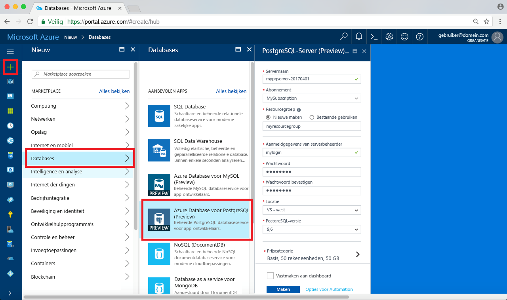

# <a name="create-an-azure-database-for-postgresql-in-hello-azure-portal"></a>Een Azure-Database maken voor PostgreSQL in hello Azure-portal

Azure PostgreSQL-Database is een beheerde service waarmee u toorun, beheren en schalen van maximaal beschikbare PostgreSQL-databases in de cloud Hallo. Deze snelstartgids ziet u hoe toocreate een Azure-Database voor PostgreSQL-server met behulp van hello Azure-portal in ongeveer vijf minuten.

Als u nog geen Azure-abonnement hebt, maakt u een [gratis account](https://azure.microsoft.com/free/) voordat u begint.

## <a name="log-in-toohello-azure-portal"></a>Meld u bij toohello Azure-portal
Open uw webbrowser en navigeer toohello [Microsoft Azure-portal](https://portal.azure.com/). Voer uw referenties toosign in toohello-portal. Hallo standaardweergave is uw servicedashboard.

## <a name="create-an-azure-database-for-postgresql"></a>Een Azure Database voor PostgreSQL-server maken

Een Azure Database voor PostgreSQL-server wordt gemaakt met een gedefinieerde set [reken- en opslagresources](./concepts-compute-unit-and-storage.md). Hallo-server is gemaakt binnen een [Azure-resourcegroep](../azure-resource-manager/resource-group-overview.md).

Volg deze stappen toocreate een Azure-Database voor PostgreSQL-server:
1.  Klik op Hallo **nieuw** knop (+) gevonden op Hallo linkerbovenhoek Hallo Azure-portal.
2.  Selecteer **Databases** van Hallo **nieuw** pagina en selecteer **Azure Database voor PostgreSQL** van Hallo **Databases** pagina.
 

3.  Hallo nieuwe server detailformulier invullen Hello volgende informatie, zoals wordt weergegeven op Hallo voorafgaand aan de installatiekopie:

    Instelling|Voorgestelde waarde|Beschrijving
    ---|---|---
    Servernaam |*mypgserver-20170401*|Kies een unieke naam ter identificatie van uw Azure-database voor PostgreSQL-server. Hallo-domeinnaam *postgres.database.azure.com* toegevoegde toohello servernaam u toepassingen tooconnect om te voorzien. Hallo-servernaam mag alleen kleine letters, cijfers en Hallo koppelteken (-) bevatten en moet tussen 3 en 63 tekens bevatten.
    Abonnement|*Uw abonnement*|Hello Azure-abonnement dat u wilt de toouse voor uw server. Als u meerdere abonnementen hebt, kiest u Hallo juiste abonnement waarin Hallo resource wordt gefactureerd voor.
    Resourcegroep|*myresourcegroup*| U kunt een nieuwe resourcegroepnaam maken of een bestaande naam uit uw abonnement gebruiken.
    Aanmeldgegevens van serverbeheerder |*mylogin*| Controleer uw eigen account aanmelding toouse wanneer toohello server verbinding kunnen maken. Hallo beheerder aanmeldingsnaam mag niet 'azure_superuser', 'azure_pg_admin', 'admin', ' administrator', 'root', 'gast' of 'openbaar', en mag niet beginnen met 'pg_'.
    Wachtwoord |*Uw keuze* | Maak een nieuw wachtwoord voor Hallo server-beheerdersaccount. Moet uit 8 too128 tekens bevatten. Uw wachtwoord moet tekens bevatten uit drie van Hallo volgende categorieën: Nederlandse hoofdletters letters, Nederlandse kleine letters, cijfers (0-9) en niet-alfanumerieke tekens (!, $, #, %, etc.).
    Locatie|*Hallo regio dichtstbijzijnde tooyour gebruikers*| Hallo-locatie die het dichtst tooyour gebruikers kiezen.
    PostgreSQL-versie|*Kies de meest recente versie Hallo*| Kies de meest recente versie Hallo tenzij er specifieke vereisten.
    Prijscategorie | **Basic**, **50 rekeneenheden**, **50 GB** | Klik op **prijscategorie** toospecify Hallo prijscategorie en prestatieniveau serviceniveau voor de nieuwe database. Kies basisstaffel in Hallo boven op Hallo-tabblad. Klik op Hallo linkereinde van Hallo Compute eenheden schuifregelaar tooadjust Hallo waarde toohello zo min mogelijk beschikbaar voor deze snelstartgids. Klik op **Ok** toosave Hallo laag selectie prijzen. Zie Hallo volgende schermopname.
    | Pincode toodashboard | Selecteren | Controleer de Hallo **pincode toodashboard** optie tooallow eenvoudig bijhouden van uw server op Hallo front dashboardpagina van uw Azure-portal.

  > [!IMPORTANT]
  > aanmeldgegevens van serverbeheerder Hallo en het wachtwoord dat u hier opgeeft, zijn vereiste toolog in toohello server en de databases verderop in dit snel starten. Onthoud of noteer deze informatie voor later gebruik.

    

4.  Klik op **maken** tooprovision Hallo-server. Inrichting duurt een paar minuten, up too20 minuten maximum.

5.  Op de werkbalk Hallo **meldingen** toomonitor Hallo-implementatieproces.
 
   
  De database **postgres** wordt gemaakt op uw server. Hallo [postgres](https://www.postgresql.org/docs/9.6/static/app-initdb.html) database is een standaarddatabase zijn alleen bedoeld voor gebruik door gebruikers, hulpprogramma's en toepassingen van derden. 

## <a name="configure-a-server-level-firewall-rule"></a>Een serverfirewallregel configureren

Hello Azure Database voor PostgreSQL-service maakt een firewall op serverniveau Hallo. Deze firewall voorkomt dat externe toepassingen en hulpprogramma's verbinden toohello server en alle databases op Hallo van server, tenzij een firewallregel tooopen Hallo firewall voor specifieke IP-adressen is gemaakt. 

1.  Ga naar de server nadat het Hallo-implementatie is voltooid. U kunt desgewenst naar de server zoeken. Bijvoorbeeld, klik op **alle Resources** van links menu Hallo en typt u de servernaam Hallo (zoals Hallo voorbeeld *mypgserver 20170401*) toosearch voor de nieuwe virtuele server. Klik op de naam van uw server weergegeven in zoekresultaten Hallo. Hallo **overzicht** pagina voor de server wordt geopend en opties voor verdere configuratie biedt.
 
    

2.  Selecteer op de pagina Hallo **verbindingsbeveiliging**. 
    

3.  Onder Hallo **Firewall-regels** kop, klik in de lege tekstvak Hallo in Hallo **regelnaam** kolom toobegin Hallo firewallregel maken. 

    Voor deze snel starten, gaan we toestaan alle IP-adressen in Hallo-server door in te vullen in het tekstvak in elke kolom Hallo Hello volgende waarden:

    Regelnaam | Start-IP | Eind-IP 
    ---|---|---
    AllowAllIps |  0.0.0.0 | 255.255.255.255

4. Klik op de bovenste werkbalk van Hallo verbinding beveiligingspagina Hallo **opslaan**. Wacht enkele ogenblikken en bericht Hallo melding weergegeven dat het bijwerken van de beveiliging van de verbinding is voltooid, voordat u doorgaat.

    > [!NOTE]
    > Verbindingen tooyour Azure Database voor PostgreSQL server communiceren via poort 5432. Als u tooconnect van binnen een bedrijfsnetwerk probeert, kan uitgaand verkeer via poort 5432 niet worden toegestaan door de firewall van uw netwerk. Zo ja, zich u niet kunnen tooconnect tooyour server tenzij uw IT-afdeling poort 5432 wordt geopend.
    >

## <a name="get-hello-connection-information"></a>Hallo-verbindingsgegevens ophalen

Wanneer u de Azure Database voor PostgreSQL-server maakt, wordt de standaarddatabase met de naam **postgres** gemaakt. tooconnect tooyour database-server, moet u tooremember Hallo volledige server name en beheer aanmeldingsreferenties. Hebt u mogelijk deze waarden eerder in Hallo snel aan de slag-artikel hebt genoteerd. Als u niet hebt gedaan, kunt u gemakkelijk Hallo server servernaam en informatie van overzichtspagina Hallo-server vinden in hello Azure-portal.

1. Open de pagina **Overzicht** van de server. Maak een notitie van Hallo **servernaam** en **aanmeldingsnaam van Server-beheerder**.
    Beweeg de muisaanwijzer de cursor over elk veld en pictogram voor Hallo kopiëren toohello rechts van de tekst hello wordt weergegeven. Klik op pictogram van Hallo kopiëren als benodigde toocopy Hallo waarden.

 

## <a name="connect-toopostgresql-database-using-psql-in-cloud-shell"></a>Verbinding maken met tooPostgreSQL database met behulp van psql in de Cloud-Shell

Er zijn een aantal toepassingen kunt u tooconnect tooyour Azure Database voor PostgreSQL-server. Laten we eerst gebruik Hallo psql opdrachtregelprogramma tooillustrate hoe tooconnect toohello server.  U kunt een webbrowser en hello Azure Cloud Shell zoals hier wordt beschreven zonder Hallo moet tooinstall geen extra software. Als u Hallo psql hulpprogramma lokaal is geïnstalleerd op uw computer hebt, kunt u daar ook.

1. Hello Azure Cloud Shell via terminal Hallo-pictogram op het bovenste navigatiedeelvenster Hallo start.

   

2. Hello Azure Cloud Shell wordt geopend in uw browser, zodat u tootype bash-shell-opdrachten.

   

3. Op Hallo Cloud Shell-prompt, verbinding maken met de database tooa in uw Azure-Database voor PostgreSQL-server door Hallo psql opdrachtregel bij Hallo groen prompt typen.

    Hallo volgende indeling is gebruikte tooconnect tooan Azure Database voor de server PostgreSQL Hello [psql](https://www.postgresql.org/docs/9.6/static/app-psql.html) hulpprogramma:
    ```bash
    psql --host=<yourserver> --port=<port> --username=<server admin login> --dbname=<database name>
    ```

    Bijvoorbeeld: tooan voorbeeld server verbindt met in Hallo volgende opdracht:

    ```bash
    psql --host=mypgserver-20170401.postgres.database.azure.com --port=5432 --username=mylogin@mypgserver-20170401 --dbname=postgres
    ```

    psql parameter |Voorgestelde waarde|Beschrijving
    ---|---|---
    --host | *servernaam* | Hallo-server de naam van waarde dat werd gebruikt toen u eerder hebt gemaakt hello Azure Database voor PostgreSQL opgeven. Onze weergegeven voorbeeldserver mypgserver-20170401.postgres.database.azure.com. Gebruik Hallo volledig gekwalificeerde domeinnaam (\*. postgres.database.azure.com) zoals weergegeven in Hallo-voorbeeld. Stappen Hallo in Hallo vorige sectie tooget Hallo verbindingsgegevens als u niet meer de servernaam van uw weet. 
    --poort | **5432** | Gebruik altijd poort 5432 bij het verbinden van tooAzure Database voor PostgreSQL. 
    --gebruikersnaam | *aanmeldnaam van serverbeheerder* |Typ Hallo server admin aanmelding gebruikersnaam opgegeven toen u eerder hebt gemaakt hello Azure Database voor PostgreSQL. Stappen Hallo in Hallo vorige sectie tooget Hallo verbindingsgegevens als u niet meer Hallo gebruikersnaam weet.  Hallo-indeling is  *username@servername* .
    --dbnaam | **postgres** | Databasenaam voor gebruik Hallo standaard systeem gegenereerde *postgres* voor de eerste verbinding Hallo. Later kunt u uw eigen database maken.

    Na actieve Hallo psql-opdracht bent met uw eigen parameterwaarden u beheerderswachtwoord voor vraag tootype Hallo-server. Dit wachtwoord is Hallo dezelfde die u hebt opgegeven tijdens het Hallo-server maken. 

    psql parameter |Voorgestelde waarde|Beschrijving
    ---|---|---
    wachtwoord | *uw beheerderswachtwoord* | Houd er rekening mee, Hallo getypte wachtwoord tekens niet op Hallo bash vragen weergegeven worden. Druk op enter nadat u alle Hallo tekens tooauthenticate hebt getypt en verbinding maakt.

    Eenmaal zijn verbonden, weergegeven Hallo psql hulpprogramma een bericht met postgres u sql-opdrachten typt. In de uitvoer van de eerste verbinding hello, worden een waarschuwing weergegeven omdat een Hallo psql in hello Azure Cloud Shell kan een verschillende versie dan hello Azure Database voor PostgreSQL server-versie zijn. 
    
    Voorbeeld van psql-uitvoer:
    ```bash
    psql (9.5.7, server 9.6.2)
    WARNING: psql major version 9.5, server major version 9.6.
        Some psql features might not work.
    SSL connection (protocol: TLSv1.2, cipher: ECDHE-RSA-AES256-SHA384, bits: 256, compression: off)
    Type "help" for help.
   
    postgres=> 
    ```

    > [!TIP]
    > Als het Hallo-firewall is niet geconfigureerd tooallow Hallo IP-adres van hello Azure Cloud-Shell, hello volgende fout is opgetreden:
    > 
    > "psql: FATAL:  no pg_hba.conf entry for host "138.91.195.82", user "mylogin", database "postgres", SSL on FATAL:  SSL connection is required. Please specify SSL options and retry.
    > 
    > Fout in tooresolve hello, zorg ervoor dat Hallo server configuratie komt overeen met Hallo stappen voor het Hallo *een firewallregel op serverniveau configureren* sectie Hallo artikel.

4.  Een lege database maken op Hallo vragen door Hallo volgende opdracht te typen:
    ```bash
    CREATE DATABASE mypgsqldb;
    ```
    Hallo opdracht duurt enkele ogenblikken toocomplete. 

5.  Opdrachtprompt Hallo uitvoeren Hallo opdracht tooswitch verbinding toohello nieuw gemaakte database na **mypgsqldb**.
    ```bash
    \c mypgsqldb
    ```

6.  Typ \q en druk op ENTER tooquit psql. Nadat u klaar bent, kunt u hello Azure Cloud Shell sluiten.

U hebt nu toohello Azure Database verbonden voor PostgreSQL en heeft een lege database gemaakt. Toohello volgende sectie tooconnect met behulp van een andere algemene hulpprogramma pgAdmin blijven.

## <a name="connect-toopostgresql-database-using-pgadmin"></a>Verbinding maken met behulp van pgAdmin tooPostgreSQL-database

tooconnect tooAzure PostgreSQL server met behulp van Hallo GUI-hulpprogramma _pgAdmin_
1.  Hallo starten _pgAdmin_ toepassing op de clientcomputer. U kunt _pgAdmin_ installeren via http://www.pgadmin.org/.
2.  Klik op Hallo **nieuwe Server toevoegen** Hallo-pictogram **snelkoppelingen** sectie in Hallo center van de dashboardpagina Hallo.
3.  In Hallo **maken - Server** in het dialoogvenster **algemene** tabblad, voer een unieke beschrijvende naam voor het Hallo-server, zoals **Azure PostgreSQL Server**.

4.  In Hallo **maken - Server** in het dialoogvenster **verbinding** tabblad, Hallo-instellingen gebruikt als opgegeven en op **opslaan**.
   

    Parameter pgAdmin |Voorgestelde waarde|Beschrijving
    ---|---|---
    Host Name/Address | *servernaam* | Hallo-server de naam van waarde dat werd gebruikt toen u eerder hebt gemaakt hello Azure Database voor PostgreSQL opgeven. Onze weergegeven voorbeeldserver mypgserver-20170401.postgres.database.azure.com. Gebruik Hallo volledig gekwalificeerde domeinnaam (\*. postgres.database.azure.com) zoals weergegeven in Hallo-voorbeeld. Stappen Hallo in Hallo vorige sectie tooget Hallo verbindingsgegevens als u niet meer de servernaam van uw weet. 
    Poort | **5432** | Gebruik altijd poort 5432 bij het verbinden van tooAzure Database voor PostgreSQL.  
    Maintenance Database | **postgres** | Databasenaam voor gebruik Hallo standaard systeem gegenereerde *postgres*.
    Gebruikersnaam | *aanmeldnaam van serverbeheerder* | Typ Hallo server admin aanmelding gebruikersnaam opgegeven toen u eerder hebt gemaakt hello Azure Database voor PostgreSQL. Stappen Hallo in Hallo vorige sectie tooget Hallo verbindingsgegevens als u niet meer Hallo gebruikersnaam weet. Hallo-indeling is  *username@servername* .
    Wachtwoord | *uw beheerderswachtwoord* |  Hallo wachtwoord u hebt gekozen toen u eerder in deze snelstartgids Hallo-server hebt gemaakt.
    Rol | *leeg laten* | Geen moet tooprovide een rol Geef een naam op dit moment. Hallo veld leeg laten.
    SSL Mode | Require | Standaard worden alle Azure PostgreSQL-servers gemaakt waarbij SSL geforceerd wordt ingeschakeld. tooturn uit het afdwingen van SSL, Zie de details in [SSL afdwingen](./concepts-ssl-connection-security.md).
    
5.  Klik op **Opslaan**.
6.  Vouw in Hallo Browser linkerdeelvenster Hallo **Servers** knooppunt. Kies uw server, bijvoorbeeld **Azure PostgreSQL Server** en tooconnect tooit op.
7. Vouw het serverknooppunt Hallo uit en vouw vervolgens **Databases** eronder. Hallo lijst met moet bevatten uw bestaande *postgres* database en een gebruiker gemaakte database, zoals *mypgsqldb*, die in de vorige sectie Hallo is gemaakt. U kunt met Azure Database voor PostgreSQL meerdere databases per server maken.
8. Met de rechtermuisknop op **Databases**, kies Hallo **maken** , en klik op **Database**.
9.  Typ de naam van een database van uw keuze in Hallo **Database** veld zoals *mypgsqldb* in Hallo voorbeeld wordt getoond. 
10. Selecteer Hallo **eigenaar** voor de database uit de vervolgkeuzelijst Hallo Hallo. Kies de aanmeldingsnaam van de serverbeheerder, zoals *mylogin* uit ons voorbeeld.
10. Klik op **opslaan** toocreate een nieuwe lege database.
11. In Hallo **Browser** deelvenster Hallo-database die u hebt gemaakt in de lijst met Databases Hallo onder de servernaam van uw wordt weergegeven.
 


## <a name="clean-up-resources"></a>Resources opschonen
Hallo-resources die u hebt gemaakt in Hallo Quick Start opruimen door het verwijderen van Hallo [Azure-resourcegroep](../azure-resource-manager/resource-group-overview.md), waaronder alle Hallo resources in de resourcegroep Hallo of bron Hallo één server als u wilt dat tookeep Hallo andere bronnen intact.

> [!TIP]
> Andere Quick Starts in deze verzameling zijn op deze Quick Start gebaseerd. Als u van plan toocontinue toowork met latere bent Hallo snelstartgidsen, komen niet opschoning van resources in deze snelstartgids hebt gemaakt. Als u niet van plan toocontinue bent, gebruikt u Hallo stappen toodelete resources gemaakt door deze in hello Azure-portal Quick Start volgen.

toodelete hello hele resourcegroep waaronder Hallo nieuwe server:
1.  De resourcegroep niet vinden in hello Azure-portal. Hallo links menu in hello Azure-portal en klik op **resourcegroepen** en klik vervolgens op Hallo-naam van de resourcegroep, zoals ons voorbeeld **myresourcegroup**.
2.  Klik op de pagina van de resourcegroep op **Verwijderen**. Vervolgens Hallo typenaam van de resourcegroep, zoals ons voorbeeld **myresourcegroup**in Hallo tekst vak tooconfirm verwijderen en klik vervolgens op **verwijderen**.

Of in plaats daarvan toodelete Hallo nieuw server gemaakt:
1.  De server niet vinden in hello Azure-portal, als u niet hebt geopend. Hallo links menu in Azure-portal en klik op **alle resources**, en zoek vervolgens naar het Hallo-server die u hebt gemaakt.
2.  Op Hallo **overzicht** pagina, klikt u op Hallo **verwijderen** knop op het bovenste deelvenster Hallo.

3.  Bevestig Hallo servernaam u toodelete wilt gebruiken en weergeven van Hallo databases in deze die worden beïnvloed. Typ de naam van uw server in het tekstvak hello, zoals ons voorbeeld **mypgserver 20170401**, en klik vervolgens op **verwijderen**.

## <a name="next-steps"></a>Volgende stappen
> [!div class="nextstepaction"]
> [Een database migreren met behulp van Exporteren en importeren](./howto-migrate-using-export-and-import.md)
