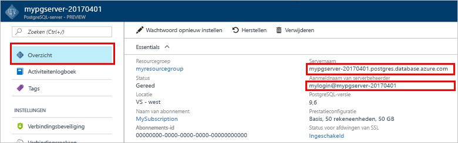

# <a name="create-an-azure-database-for-postgresql-in-the-azure-portal"></a><span data-ttu-id="9220c-103">Een Azure Database voor PostgreSQL-server maken in Azure Portal</span><span class="sxs-lookup"><span data-stu-id="9220c-103">Create an Azure Database for PostgreSQL in the Azure portal</span></span>

<span data-ttu-id="9220c-104">Azure Database voor PostgreSQL is een beheerde service waarmee u PostgreSQL-databases met hoge beschikbaarheid in de cloud kunt uitvoeren, beheren en schalen.</span><span class="sxs-lookup"><span data-stu-id="9220c-104">Azure Database for PostgreSQL is a managed service that enables you to run, manage, and scale highly available PostgreSQL databases in the cloud.</span></span> <span data-ttu-id="9220c-105">In deze Quick Start ontdekt u hoe u in ongeveer vijf minuten een Azure Database voor PostgreSQL-server maakt in Azure Portal.</span><span class="sxs-lookup"><span data-stu-id="9220c-105">This quickstart shows you how to create an Azure Database for PostgreSQL server using the Azure portal in about five minutes.</span></span>

<span data-ttu-id="9220c-106">Als u nog geen Azure-abonnement hebt, maakt u een [gratis account](https://azure.microsoft.com/free/) voordat u begint.</span><span class="sxs-lookup"><span data-stu-id="9220c-106">If you don't have an Azure subscription, create a [free](https://azure.microsoft.com/free/) account before you begin.</span></span>

## <a name="log-in-to-the-azure-portal"></a><span data-ttu-id="9220c-107">Aanmelden bij Azure Portal</span><span class="sxs-lookup"><span data-stu-id="9220c-107">Log in to the Azure portal</span></span>
<span data-ttu-id="9220c-108">Open uw webbrowser en ga naar de [Microsoft Azure Portal](https://portal.azure.com/).</span><span class="sxs-lookup"><span data-stu-id="9220c-108">Open your web browser, and navigate to the [Microsoft Azure portal](https://portal.azure.com/).</span></span> <span data-ttu-id="9220c-109">Voer uw referenties in om u aan te melden bij de portal.</span><span class="sxs-lookup"><span data-stu-id="9220c-109">Enter your credentials to sign in to the portal.</span></span> <span data-ttu-id="9220c-110">De standaardweergave is uw service-dashboard.</span><span class="sxs-lookup"><span data-stu-id="9220c-110">The default view is your service dashboard.</span></span>

## <a name="create-an-azure-database-for-postgresql"></a><span data-ttu-id="9220c-111">Een Azure Database voor PostgreSQL-server maken</span><span class="sxs-lookup"><span data-stu-id="9220c-111">Create an Azure Database for PostgreSQL</span></span>

<span data-ttu-id="9220c-112">Een Azure Database voor PostgreSQL-server wordt gemaakt met een gedefinieerde set [reken- en opslagresources](./concepts-compute-unit-and-storage.md).</span><span class="sxs-lookup"><span data-stu-id="9220c-112">An Azure Database for PostgreSQL server is created with a defined set of [compute and storage resources](./concepts-compute-unit-and-storage.md).</span></span> <span data-ttu-id="9220c-113">De server wordt gemaakt in een [Azure-resourcegroep](../azure-resource-manager/resource-group-overview.md).</span><span class="sxs-lookup"><span data-stu-id="9220c-113">The server is created within an [Azure resource group](../azure-resource-manager/resource-group-overview.md).</span></span>

<span data-ttu-id="9220c-114">Volg deze stappen voor het maken van een Azure Database voor PostgreSQL-server:</span><span class="sxs-lookup"><span data-stu-id="9220c-114">Follow these steps to create an Azure Database for PostgreSQL server:</span></span>
1.  <span data-ttu-id="9220c-115">Klik op de knop **Nieuw** (+) in de linkerbovenhoek van Azure Portal.</span><span class="sxs-lookup"><span data-stu-id="9220c-115">Click the **New** button (+) found on the upper left-hand corner of the Azure portal.</span></span>
2.  <span data-ttu-id="9220c-116">Selecteer **Databases** op de pagina **Nieuw** en selecteer **Azure Database voor PostgreSQL** op de pagina **Databases**.</span><span class="sxs-lookup"><span data-stu-id="9220c-116">Select **Databases** from the **New** page, and select **Azure Database for PostgreSQL** from the **Databases** page.</span></span>
 <span data-ttu-id="9220c-117"></span><span class="sxs-lookup"><span data-stu-id="9220c-117"></span></span>

3.  <span data-ttu-id="9220c-118">Vul het formulier voor gegevens van nieuwe server in met de volgende informatie, zoals in de voorgaande afbeelding wordt weergegeven:</span><span class="sxs-lookup"><span data-stu-id="9220c-118">Fill out the new server details form with the following information, as shown on the preceding image:</span></span>

    <span data-ttu-id="9220c-119">Instelling</span><span class="sxs-lookup"><span data-stu-id="9220c-119">Setting</span></span>|<span data-ttu-id="9220c-120">Voorgestelde waarde</span><span class="sxs-lookup"><span data-stu-id="9220c-120">Suggested value</span></span>|<span data-ttu-id="9220c-121">Beschrijving</span><span class="sxs-lookup"><span data-stu-id="9220c-121">Description</span></span>
    ---|---|---
    <span data-ttu-id="9220c-122">Servernaam</span><span class="sxs-lookup"><span data-stu-id="9220c-122">Server name</span></span> |<span data-ttu-id="9220c-123">*mypgserver-20170401*</span><span class="sxs-lookup"><span data-stu-id="9220c-123">*mypgserver-20170401*</span></span>|<span data-ttu-id="9220c-124">Kies een unieke naam ter identificatie van uw Azure-database voor PostgreSQL-server.</span><span class="sxs-lookup"><span data-stu-id="9220c-124">Choose a unique name that identifies your Azure Database for PostgreSQL server.</span></span> <span data-ttu-id="9220c-125">De domeinnaam *postgres.database.azure.com* wordt toegevoegd aan de naam van de server die u opgeeft voor de toepassingen waarmee verbinding moet worden gemaakt.</span><span class="sxs-lookup"><span data-stu-id="9220c-125">The domain name *postgres.database.azure.com* is appended to the server name you provide for applications to connect to.</span></span> <span data-ttu-id="9220c-126">De servernaam mag alleen kleine letters, cijfers en het koppelteken (-) bevatten en moet 3 tot 63 tekens lang zijn.</span><span class="sxs-lookup"><span data-stu-id="9220c-126">The server name can contain only lowercase letters, numbers, and the hyphen (-) character, and it must contain from 3 through 63 characters.</span></span>
    <span data-ttu-id="9220c-127">Abonnement</span><span class="sxs-lookup"><span data-stu-id="9220c-127">Subscription</span></span>|<span data-ttu-id="9220c-128">*Uw abonnement*</span><span class="sxs-lookup"><span data-stu-id="9220c-128">*Your subscription*</span></span>|<span data-ttu-id="9220c-129">Het Azure-abonnement dat u wilt gebruiken voor uw server.</span><span class="sxs-lookup"><span data-stu-id="9220c-129">The Azure subscription that you want to use for your server.</span></span> <span data-ttu-id="9220c-130">Als u meerdere abonnementen hebt, kiest u het juiste abonnement waarin de resource zal worden gefactureerd.</span><span class="sxs-lookup"><span data-stu-id="9220c-130">If you have multiple subscriptions, choose the appropriate subscription in which the resource is billed for.</span></span>
    <span data-ttu-id="9220c-131">Resourcegroep</span><span class="sxs-lookup"><span data-stu-id="9220c-131">Resource Group</span></span>|<span data-ttu-id="9220c-132">*myresourcegroup*</span><span class="sxs-lookup"><span data-stu-id="9220c-132">*myresourcegroup*</span></span>| <span data-ttu-id="9220c-133">U kunt een nieuwe resourcegroepnaam maken of een bestaande naam uit uw abonnement gebruiken.</span><span class="sxs-lookup"><span data-stu-id="9220c-133">You may make a new resource group name, or use an existing one from your subscription.</span></span>
    <span data-ttu-id="9220c-134">Aanmeldgegevens van serverbeheerder</span><span class="sxs-lookup"><span data-stu-id="9220c-134">Server admin login</span></span> |<span data-ttu-id="9220c-135">*mylogin*</span><span class="sxs-lookup"><span data-stu-id="9220c-135">*mylogin*</span></span>| <span data-ttu-id="9220c-136">Maak uw eigen aanmeldingsaccount die moet worden gebruikt om verbinding te maken met de server.</span><span class="sxs-lookup"><span data-stu-id="9220c-136">Make your own login account to use when connecting to the server.</span></span> <span data-ttu-id="9220c-137">De aanmeldingsnaam voor de beheerder kan niet 'azure_superuser', 'azure_pg_admin', 'admin', ' administrator', 'root', 'guest' of 'public' zijn en mag niet beginnen met 'pg_'.</span><span class="sxs-lookup"><span data-stu-id="9220c-137">The admin login name cannot be 'azure_superuser', 'azure_pg_admin', 'admin', 'administrator', 'root', 'guest', or 'public', and cannot start with 'pg_'.</span></span>
    <span data-ttu-id="9220c-138">Wachtwoord</span><span class="sxs-lookup"><span data-stu-id="9220c-138">Password</span></span> |<span data-ttu-id="9220c-139">*Uw keuze*</span><span class="sxs-lookup"><span data-stu-id="9220c-139">*Your choice*</span></span> | <span data-ttu-id="9220c-140">Maak een nieuw wachtwoord voor het beheerdersaccount voor de server.</span><span class="sxs-lookup"><span data-stu-id="9220c-140">Create a new password for the server admin account.</span></span> <span data-ttu-id="9220c-141">Het moet 8 tot 128 tekens bevatten.</span><span class="sxs-lookup"><span data-stu-id="9220c-141">Must contain from 8 to 128 characters.</span></span> <span data-ttu-id="9220c-142">Uw wachtwoord moet tekens bevatten uit drie van de volgende categorieën: Nederlandse hoofdletters, Nederlandse kleine letters, cijfers (0-9) en niet-alfanumerieke tekens (!, $, #, %, etc.).</span><span class="sxs-lookup"><span data-stu-id="9220c-142">Your password must contain characters from three of the following categories – English uppercase letters, English lowercase letters, numbers (0-9), and non-alphanumeric characters (!, $, #, %, etc.).</span></span>
    <span data-ttu-id="9220c-143">Locatie</span><span class="sxs-lookup"><span data-stu-id="9220c-143">Location</span></span>|<span data-ttu-id="9220c-144">*De regio het dichtst bij uw gebruikers*</span><span class="sxs-lookup"><span data-stu-id="9220c-144">*The region closest to your users*</span></span>| <span data-ttu-id="9220c-145">Kies de locatie die het dichtst bij uw gebruikers is.</span><span class="sxs-lookup"><span data-stu-id="9220c-145">Choose the location that's closest to your users.</span></span>
    <span data-ttu-id="9220c-146">PostgreSQL-versie</span><span class="sxs-lookup"><span data-stu-id="9220c-146">PostgreSQL Version</span></span>|<span data-ttu-id="9220c-147">*Kies de nieuwste versie*</span><span class="sxs-lookup"><span data-stu-id="9220c-147">*Choose the latest version*</span></span>| <span data-ttu-id="9220c-148">Kies de meest recente versie, tenzij u specifieke vereisten hebt.</span><span class="sxs-lookup"><span data-stu-id="9220c-148">Choose the latest version unless you have specific requirements.</span></span>
    <span data-ttu-id="9220c-149">Prijscategorie</span><span class="sxs-lookup"><span data-stu-id="9220c-149">Pricing Tier</span></span> | <span data-ttu-id="9220c-150">**Basic**, **50 rekeneenheden**, **50 GB**</span><span class="sxs-lookup"><span data-stu-id="9220c-150">**Basic**, **50 Compute Units** **50 GB**</span></span> | <span data-ttu-id="9220c-151">Klik op **Prijscategorie** om de servicelaag en het prestatieniveau voor de nieuwe database op te geven.</span><span class="sxs-lookup"><span data-stu-id="9220c-151">Click **Pricing tier** to specify the service tier and performance level for your new database.</span></span> <span data-ttu-id="9220c-152">Kies de prijscategorie Basic op het tabblad bovenaan.</span><span class="sxs-lookup"><span data-stu-id="9220c-152">Choose Basic tier in the tab at the top.</span></span> <span data-ttu-id="9220c-153">Klik aan de linkerkant van de schuifregelaar Rekeneenheden zodat de waarde zo laag mogelijk is voor deze snelstartgids.</span><span class="sxs-lookup"><span data-stu-id="9220c-153">Click the left end of the Compute Units slider to adjust the value to the least amount available for this quickstart.</span></span> <span data-ttu-id="9220c-154">Klik vervolgens op **OK** om de geselecteerde prijscategorie op te slaan.</span><span class="sxs-lookup"><span data-stu-id="9220c-154">Click **Ok** to save the pricing tier selection.</span></span> <span data-ttu-id="9220c-155">Zie de volgende schermafbeelding.</span><span class="sxs-lookup"><span data-stu-id="9220c-155">See the following screenshot.</span></span>
    | <span data-ttu-id="9220c-156">Vastmaken aan dashboard</span><span class="sxs-lookup"><span data-stu-id="9220c-156">Pin to dashboard</span></span> | <span data-ttu-id="9220c-157">Selecteren</span><span class="sxs-lookup"><span data-stu-id="9220c-157">Check</span></span> | <span data-ttu-id="9220c-158">Selecteer de optie **Vastmaken aan dashboard** om het eenvoudig bijhouden van uw server op de eerste dashboardpagina van uw Azure Portal in te schakelen.</span><span class="sxs-lookup"><span data-stu-id="9220c-158">Check the **Pin to dashboard** option to allow easy tracking of your server on the front dashboard page of your Azure portal.</span></span>

  > [!IMPORTANT]
  > <span data-ttu-id="9220c-159">De beheerdersaanmelding bij de server en het wachtwoord die u hier opgeeft, zijn vereist voor aanmelding bij de server en de bijbehorende databases verderop in deze Quick Start.</span><span class="sxs-lookup"><span data-stu-id="9220c-159">The server admin login and password that you specify here are required to log in to the server and its databases later in this quick start.</span></span> <span data-ttu-id="9220c-160">Onthoud of noteer deze informatie voor later gebruik.</span><span class="sxs-lookup"><span data-stu-id="9220c-160">Remember or record this information for later use.</span></span>

    

4.  <span data-ttu-id="9220c-162">Klik op **Maken** om de server in te richten.</span><span class="sxs-lookup"><span data-stu-id="9220c-162">Click **Create** to provision the server.</span></span> <span data-ttu-id="9220c-163">Het inrichten duurt enkele minuten, maximaal 20 minuten.</span><span class="sxs-lookup"><span data-stu-id="9220c-163">Provisioning takes a few minutes, up to 20 minutes maximum.</span></span>

5.  <span data-ttu-id="9220c-164">Klik op de werkbalk op **Meldingen** om het implementatieproces te bewaken.</span><span class="sxs-lookup"><span data-stu-id="9220c-164">On the toolbar, click **Notifications** to monitor the deployment process.</span></span>
 <span data-ttu-id="9220c-165"></span><span class="sxs-lookup"><span data-stu-id="9220c-165"></span></span>
   
  <span data-ttu-id="9220c-166">De database **postgres** wordt gemaakt op uw server.</span><span class="sxs-lookup"><span data-stu-id="9220c-166">By default, **postgres** database gets created under your server.</span></span> <span data-ttu-id="9220c-167">De database [postgres](https://www.postgresql.org/docs/9.6/static/app-initdb.html) is een standaarddatabase die kan worden gebruikt door gebruikers, hulpprogramma's en toepassingen van derden.</span><span class="sxs-lookup"><span data-stu-id="9220c-167">The [postgres](https://www.postgresql.org/docs/9.6/static/app-initdb.html) database is a default database meant for use by users, utilities, and third-party applications.</span></span> 

## <a name="configure-a-server-level-firewall-rule"></a><span data-ttu-id="9220c-168">Een serverfirewallregel configureren</span><span class="sxs-lookup"><span data-stu-id="9220c-168">Configure a server-level firewall rule</span></span>

<span data-ttu-id="9220c-169">De Azure Database voor PostgreSQL-service maakt een firewall op serverniveau.</span><span class="sxs-lookup"><span data-stu-id="9220c-169">The Azure Database for PostgreSQL service creates a firewall at the server-level.</span></span> <span data-ttu-id="9220c-170">De firewall voorkomt dat externe toepassingen en hulpprogramma's verbinding maken met de server of databases op de server, tenzij er een firewallregel wordt gemaakt om de firewall te openen voor specifieke IP-adressen.</span><span class="sxs-lookup"><span data-stu-id="9220c-170">This firewall prevents external applications and tools from connecting to the server and any databases on the server, unless a firewall rule is created to open the firewall for specific IP addresses.</span></span> 

1.  <span data-ttu-id="9220c-171">Ga naar de server nadat de implementatie is voltooid.</span><span class="sxs-lookup"><span data-stu-id="9220c-171">Locate your server after the deployment completes.</span></span> <span data-ttu-id="9220c-172">U kunt desgewenst naar de server zoeken.</span><span class="sxs-lookup"><span data-stu-id="9220c-172">If needed, you can search for it.</span></span> <span data-ttu-id="9220c-173">Klik bijvoorbeeld op **Alle resources** in het menu links en voer de naam van de server (bijvoorbeeld *mypgserver-20170401*) in om te zoeken naar de zojuist gemaakte server.</span><span class="sxs-lookup"><span data-stu-id="9220c-173">For example, click **All Resources** from the left-hand menu and type in the server name (such as the example *mypgserver-20170401*) to search for your newly created server.</span></span> <span data-ttu-id="9220c-174">Klik op de servernaam in de zoekresultaten.</span><span class="sxs-lookup"><span data-stu-id="9220c-174">Click on your server name listed in the search result.</span></span> <span data-ttu-id="9220c-175">De pagina **Overzicht** wordt geopend voor uw server en biedt opties voor verdere configuratie.</span><span class="sxs-lookup"><span data-stu-id="9220c-175">The **Overview** page for your server opens and provides options for further configuration.</span></span>
 
    

2.  <span data-ttu-id="9220c-177">Selecteer **Verbindingsbeveiliging** op de serverpagina.</span><span class="sxs-lookup"><span data-stu-id="9220c-177">On the server page, select **Connection security**.</span></span> 
    <span data-ttu-id="9220c-178"></span><span class="sxs-lookup"><span data-stu-id="9220c-178"></span></span>

3.  <span data-ttu-id="9220c-179">Klik onder de kop **Firewallregels** in het lege tekstvak in de kolom **Regelnaam** om te beginnen met het maken van de firewallregel.</span><span class="sxs-lookup"><span data-stu-id="9220c-179">Under the **Firewall rules** heading, click in the blank text box in the **Rule Name** column to begin creating the firewall rule.</span></span> 

    <span data-ttu-id="9220c-180">In deze snelstartgids staan we alle IP-adressen toe in de server door de volgende waarden in te vullen in het tekstvak in elke kolom:</span><span class="sxs-lookup"><span data-stu-id="9220c-180">For this quick start, let's allow all IP addresses into the server by filling in the text box in each column with the following values:</span></span>

    <span data-ttu-id="9220c-181">Regelnaam</span><span class="sxs-lookup"><span data-stu-id="9220c-181">Rule Name</span></span> | <span data-ttu-id="9220c-182">Start-IP</span><span class="sxs-lookup"><span data-stu-id="9220c-182">Start IP</span></span> | <span data-ttu-id="9220c-183">Eind-IP</span><span class="sxs-lookup"><span data-stu-id="9220c-183">End IP</span></span> 
    ---|---|---
    <span data-ttu-id="9220c-184">AllowAllIps</span><span class="sxs-lookup"><span data-stu-id="9220c-184">AllowAllIps</span></span> |  <span data-ttu-id="9220c-185">0.0.0.0</span><span class="sxs-lookup"><span data-stu-id="9220c-185">0.0.0.0</span></span> | <span data-ttu-id="9220c-186">255.255.255.255</span><span class="sxs-lookup"><span data-stu-id="9220c-186">255.255.255.255</span></span>

4. <span data-ttu-id="9220c-187">Klik in de bovenste werkbalk van de pagina Verbindingsbeveiliging op **Opslaan**.</span><span class="sxs-lookup"><span data-stu-id="9220c-187">On the upper toolbar of the Connection security page, click **Save**.</span></span> <span data-ttu-id="9220c-188">Wacht even totdat er een melding wordt weergegeven dat het bijwerken van de beveiliging van de verbinding is voltooid.</span><span class="sxs-lookup"><span data-stu-id="9220c-188">Wait for a few moments and notice the notification showing that updating connection security has finished successfully before continuing.</span></span>

    > [!NOTE]
    > <span data-ttu-id="9220c-189">Verbindingen met uw Azure Database voor PostgreSQL-server communiceren via poort 5432.</span><span class="sxs-lookup"><span data-stu-id="9220c-189">Connections to your Azure Database for PostgreSQL server communicate over port 5432.</span></span> <span data-ttu-id="9220c-190">Als u verbinding probeert te maken vanuit een bedrijfsnetwerk, wordt uitgaand verkeer via poort 5432 mogelijk niet toegestaan door de firewall van uw netwerk.</span><span class="sxs-lookup"><span data-stu-id="9220c-190">If you are trying to connect from within a corporate network, outbound traffic over port 5432 may not be allowed by your network's firewall.</span></span> <span data-ttu-id="9220c-191">In dat geval kunt u alleen verbinding maken met uw server als uw IT-afdeling poort 5432 openstelt.</span><span class="sxs-lookup"><span data-stu-id="9220c-191">If so, you will not be able to connect to your server unless your IT department opens port 5432.</span></span>
    >

## <a name="get-the-connection-information"></a><span data-ttu-id="9220c-192">De verbindingsgegevens ophalen</span><span class="sxs-lookup"><span data-stu-id="9220c-192">Get the connection information</span></span>

<span data-ttu-id="9220c-193">Wanneer u de Azure Database voor PostgreSQL-server maakt, wordt de standaarddatabase met de naam **postgres** gemaakt.</span><span class="sxs-lookup"><span data-stu-id="9220c-193">When we created our Azure Database for PostgreSQL server, a default database named **postgres** gets created.</span></span> <span data-ttu-id="9220c-194">Om verbinding te maken met uw databaseserver, moet u de volledige servernaam en aanmeldingsreferenties van de beheerder weten.</span><span class="sxs-lookup"><span data-stu-id="9220c-194">To connect to your database server, you need to remember the full server name and admin login credentials.</span></span> <span data-ttu-id="9220c-195">U hebt deze waarden mogelijk al eerder in dit snelstartartikel genoteerd.</span><span class="sxs-lookup"><span data-stu-id="9220c-195">You may have noted those values earlier in the quick start article.</span></span> <span data-ttu-id="9220c-196">Als u dat niet hebt gedaan, kunt u de servernaam en aanmeldingsgegevens gemakkelijk terugvinden op de overzichtspagina voor de server in Azure Portal.</span><span class="sxs-lookup"><span data-stu-id="9220c-196">In case you did not, you can easily find the server name and login information from the server Overview page in the Azure portal.</span></span>

1. <span data-ttu-id="9220c-197">Open de pagina **Overzicht** van de server.</span><span class="sxs-lookup"><span data-stu-id="9220c-197">Open your server's **Overview** page.</span></span> <span data-ttu-id="9220c-198">Noteer de **servernaam** en de **gebruikersnaam van de serverbeheerder**.</span><span class="sxs-lookup"><span data-stu-id="9220c-198">Make a note of the **Server name** and **Server admin login name**.</span></span>
    <span data-ttu-id="9220c-199">Beweeg de muisaanwijzer de cursor over elk veld. Het kopieerpictogram wordt rechts van de tekst weergegeven.</span><span class="sxs-lookup"><span data-stu-id="9220c-199">Hover your cursor over each field, and the copy icon appears to the right of the text.</span></span> <span data-ttu-id="9220c-200">Klik op het kopieerpictogram indien nodig om de waarden te kopiëren.</span><span class="sxs-lookup"><span data-stu-id="9220c-200">Click the copy icon as needed to copy the values.</span></span>

 

## <a name="connect-to-postgresql-database-using-psql-in-cloud-shell"></a><span data-ttu-id="9220c-202">Verbinding maken met een PostgreSQL-database met behulp van psql in Cloud Shell</span><span class="sxs-lookup"><span data-stu-id="9220c-202">Connect to PostgreSQL database using psql in Cloud Shell</span></span>

<span data-ttu-id="9220c-203">Er zijn een aantal toepassingen die kunt gebruiken om verbinding te maken met uw Azure Database voor PostgreSQL-server.</span><span class="sxs-lookup"><span data-stu-id="9220c-203">There are a number of applications you can use to connect to your Azure Database for PostgreSQL server.</span></span> <span data-ttu-id="9220c-204">We gaan eerst het opdrachtregelprogramma psql gebruiken om te laten zien hoe u verbinding maakt met de server.</span><span class="sxs-lookup"><span data-stu-id="9220c-204">Let's first use the psql command-line utility to illustrate how to connect to the server.</span></span>  <span data-ttu-id="9220c-205">U kunt een webbrowser en de Azure Cloud Shell gebruiken zoals hier wordt beschreven, zonder dat u extra software hoeft te installeren.</span><span class="sxs-lookup"><span data-stu-id="9220c-205">You can use a web browser and the Azure Cloud Shell as described here without the need to install any additional software.</span></span> <span data-ttu-id="9220c-206">Als het hulpprogramma psql lokaal op uw computer is geïnstalleerd, kunt u dit ook gebruiken om verbinding te maken.</span><span class="sxs-lookup"><span data-stu-id="9220c-206">If you have the psql utility installed locally on your own machine, you can connect from there as well.</span></span>

1. <span data-ttu-id="9220c-207">Open Azure Cloud Shell via het terminalpictogram in het navigatiedeelvenster bovenaan.</span><span class="sxs-lookup"><span data-stu-id="9220c-207">Launch the Azure Cloud Shell via the terminal icon on the top navigation pane.</span></span>

   

2. <span data-ttu-id="9220c-209">Azure Cloud Shell wordt geopend in uw browser zodat u bash shell-opdrachten kunt invoeren.</span><span class="sxs-lookup"><span data-stu-id="9220c-209">The Azure Cloud Shell opens in your browser, enabling you to type bash shell commands.</span></span>

   

3. <span data-ttu-id="9220c-211">Maak bij de Cloud Shell-prompt verbinding met een database in uw Azure Database voor PostgreSQL-server door de psql-opdrachtregel te typen bij de groene prompt.</span><span class="sxs-lookup"><span data-stu-id="9220c-211">At the Cloud Shell prompt, connect to a database in your Azure Database for PostgreSQL server by typing the psql command line at the green prompt.</span></span>

    <span data-ttu-id="9220c-212">De volgende indeling wordt gebruikt om verbinding te maken met een Azure Database voor PostgreSQL-server via het [psql](https://www.postgresql.org/docs/9.6/static/app-psql.html)-hulpprogramma:</span><span class="sxs-lookup"><span data-stu-id="9220c-212">The following format is used to connect to an Azure Database for PostgreSQL server with the [psql](https://www.postgresql.org/docs/9.6/static/app-psql.html) utility:</span></span>
    ```bash
    psql --host=<yourserver> --port=<port> --username=<server admin login> --dbname=<database name>
    ```

    <span data-ttu-id="9220c-213">De volgende opdracht maakt bijvoorbeeld verbinding met een voorbeeldserver:</span><span class="sxs-lookup"><span data-stu-id="9220c-213">For example, the following command connects to an example server:</span></span>

    ```bash
    psql --host=mypgserver-20170401.postgres.database.azure.com --port=5432 --username=mylogin@mypgserver-20170401 --dbname=postgres
    ```

    <span data-ttu-id="9220c-214">psql parameter</span><span class="sxs-lookup"><span data-stu-id="9220c-214">psql parameter</span></span> |<span data-ttu-id="9220c-215">Voorgestelde waarde</span><span class="sxs-lookup"><span data-stu-id="9220c-215">Suggested value</span></span>|<span data-ttu-id="9220c-216">Beschrijving</span><span class="sxs-lookup"><span data-stu-id="9220c-216">Description</span></span>
    ---|---|---
    <span data-ttu-id="9220c-217">--host</span><span class="sxs-lookup"><span data-stu-id="9220c-217">--host</span></span> | <span data-ttu-id="9220c-218">*servernaam*</span><span class="sxs-lookup"><span data-stu-id="9220c-218">*server name*</span></span> | <span data-ttu-id="9220c-219">Geef de waarde van de servernaam op die u hebt gebruikt toen u de Azure Database voor PostgreSQL hebt gemaakt.</span><span class="sxs-lookup"><span data-stu-id="9220c-219">Specify the server name value that was used when you created the Azure Database for PostgreSQL earlier.</span></span> <span data-ttu-id="9220c-220">Onze weergegeven voorbeeldserver mypgserver-20170401.postgres.database.azure.com. Gebruik de FQDN (Fully Qualified Domain Name) (\*. postgres.database.azure.com) zoals weergegeven in het voorbeeld.</span><span class="sxs-lookup"><span data-stu-id="9220c-220">Our example server shown is mypgserver-20170401.postgres.database.azure.com. Use the fully qualified domain name (\*.postgres.database.azure.com) as shown in the example.</span></span> <span data-ttu-id="9220c-221">Volg de stappen in de vorige sectie om de verbindingsgegevens op te halen als u de servernaam bent vergeten.</span><span class="sxs-lookup"><span data-stu-id="9220c-221">Follow the steps in the previous section to get the connection information if you do not remember your server name.</span></span> 
    <span data-ttu-id="9220c-222">--poort</span><span class="sxs-lookup"><span data-stu-id="9220c-222">--port</span></span> | <span data-ttu-id="9220c-223">**5432**</span><span class="sxs-lookup"><span data-stu-id="9220c-223">**5432**</span></span> | <span data-ttu-id="9220c-224">Gebruik altijd poort 5432 bij het verbinden met Azure Database voor PostgreSQL.</span><span class="sxs-lookup"><span data-stu-id="9220c-224">Always use port 5432 when connecting to Azure Database for PostgreSQL.</span></span> 
    <span data-ttu-id="9220c-225">--gebruikersnaam</span><span class="sxs-lookup"><span data-stu-id="9220c-225">--username</span></span> | <span data-ttu-id="9220c-226">*aanmeldnaam van serverbeheerder*</span><span class="sxs-lookup"><span data-stu-id="9220c-226">*server admin login name*</span></span> |<span data-ttu-id="9220c-227">Typ de gebruikersnaam van de serverbeheerder die u hebt opgegeven toen u de Azure Database voor PostgreSQL hebt gemaakt.</span><span class="sxs-lookup"><span data-stu-id="9220c-227">Type in the  server admin login username supplied when you created the Azure Database for PostgreSQL earlier.</span></span> <span data-ttu-id="9220c-228">Volg de stappen in de vorige sectie om de verbindingsgegevens op te halen als u de gebruikersnaam bent vergeten.</span><span class="sxs-lookup"><span data-stu-id="9220c-228">Follow the steps in the previous section to get the connection information if you do not remember the username.</span></span>  <span data-ttu-id="9220c-229">De indeling is *username@servername*.</span><span class="sxs-lookup"><span data-stu-id="9220c-229">The format is *username@servername*.</span></span>
    <span data-ttu-id="9220c-230">--dbnaam</span><span class="sxs-lookup"><span data-stu-id="9220c-230">--dbname</span></span> | <span data-ttu-id="9220c-231">**postgres**</span><span class="sxs-lookup"><span data-stu-id="9220c-231">**postgres**</span></span> | <span data-ttu-id="9220c-232">Gebruik de standaardnaam voor de database *postgres* die door het systeem is gegenereerd voor de eerste verbinding.</span><span class="sxs-lookup"><span data-stu-id="9220c-232">Use the default system generated database name *postgres* for the first connection.</span></span> <span data-ttu-id="9220c-233">Later kunt u uw eigen database maken.</span><span class="sxs-lookup"><span data-stu-id="9220c-233">Later you create your own database.</span></span>

    <span data-ttu-id="9220c-234">Na het uitvoeren van de psql-opdracht met uw eigen parameterwaarden, wordt u gevraagd het beheerderswachtwoord van de server in te voeren.</span><span class="sxs-lookup"><span data-stu-id="9220c-234">After running the psql command, with your own parameter values, you are prompted to type the server admin password.</span></span> <span data-ttu-id="9220c-235">Dit is het wachtwoord dat u hebt opgegeven tijdens het maken van de server.</span><span class="sxs-lookup"><span data-stu-id="9220c-235">This password is the same that you provided when you created the server.</span></span> 

    <span data-ttu-id="9220c-236">psql parameter</span><span class="sxs-lookup"><span data-stu-id="9220c-236">psql parameter</span></span> |<span data-ttu-id="9220c-237">Voorgestelde waarde</span><span class="sxs-lookup"><span data-stu-id="9220c-237">Suggested value</span></span>|<span data-ttu-id="9220c-238">Beschrijving</span><span class="sxs-lookup"><span data-stu-id="9220c-238">Description</span></span>
    ---|---|---
    <span data-ttu-id="9220c-239">wachtwoord</span><span class="sxs-lookup"><span data-stu-id="9220c-239">password</span></span> | <span data-ttu-id="9220c-240">*uw beheerderswachtwoord*</span><span class="sxs-lookup"><span data-stu-id="9220c-240">*your admin password*</span></span> | <span data-ttu-id="9220c-241">Houd er rekening mee dat de getypte wachtwoordtekens niet worden weergegeven bij de bash-prompt.</span><span class="sxs-lookup"><span data-stu-id="9220c-241">Note, the typed password characters are not shown on the bash prompt.</span></span> <span data-ttu-id="9220c-242">Druk op enter nadat u de tekens hebt getypt om te verifiëren en verbinding te maken.</span><span class="sxs-lookup"><span data-stu-id="9220c-242">Press enter after you have typed all the characters to authenticate and connect.</span></span>

    <span data-ttu-id="9220c-243">Als de verbinding tot stand is gebracht, wordt er door het hulpprogramma psql een postgres-prompt weergegeven. Hier kunt u sql-opdrachten typen.</span><span class="sxs-lookup"><span data-stu-id="9220c-243">Once connected, the psql utility displays a postgres prompt where you type sql commands.</span></span> <span data-ttu-id="9220c-244">In de uitvoer van de eerste verbinding kan een waarschuwing worden weergegeven omdat de psql in de Azure Cloud Shell misschien niet dezelfde versie heeft als de psql voor Azure Database voor PostgreSQL-server.</span><span class="sxs-lookup"><span data-stu-id="9220c-244">In the initial connection output, a warning may be displayed since the psql in the Azure Cloud Shell may be a different  version than the Azure Database for PostgreSQL server version.</span></span> 
    
    <span data-ttu-id="9220c-245">Voorbeeld van psql-uitvoer:</span><span class="sxs-lookup"><span data-stu-id="9220c-245">Example psql output:</span></span>
    ```bash
    psql (9.5.7, server 9.6.2)
    WARNING: psql major version 9.5, server major version 9.6.
        Some psql features might not work.
    SSL connection (protocol: TLSv1.2, cipher: ECDHE-RSA-AES256-SHA384, bits: 256, compression: off)
    Type "help" for help.
   
    postgres=> 
    ```

    > [!TIP]
    > <span data-ttu-id="9220c-246">Als de firewall niet is geconfigureerd voor het toestaan van het IP-adres van de Azure Cloud Shell, wordt het volgende foutbericht weergegeven:</span><span class="sxs-lookup"><span data-stu-id="9220c-246">If the firewall is not configured to allow the IP address of the Azure Cloud Shell, the following error occurs:</span></span>
    > 
    > <span data-ttu-id="9220c-247">"psql: FATAL:  no pg_hba.conf entry for host "138.91.195.82", user "mylogin", database "postgres", SSL on FATAL:  SSL connection is required.</span><span class="sxs-lookup"><span data-stu-id="9220c-247">"psql: FATAL:  no pg_hba.conf entry for host "138.91.195.82", user "mylogin", database "postgres", SSL on FATAL:  SSL connection is required.</span></span> <span data-ttu-id="9220c-248">Please specify SSL options and retry.</span><span class="sxs-lookup"><span data-stu-id="9220c-248">Please specify SSL options and retry.</span></span>
    > 
    > <span data-ttu-id="9220c-249">U kunt deze fout oplossen door ervoor te zorgen dat de serverconfiguratie overeenkomt met de stappen in de sectie *Een serverfirewallregel configureren* van het artikel.</span><span class="sxs-lookup"><span data-stu-id="9220c-249">To resolve the error, make sure the server configuration matches the steps in the *Configure a server-level firewall rule* section of the article.</span></span>

4.  <span data-ttu-id="9220c-250">Maak een lege database door bij de prompt de volgende opdracht te typen:</span><span class="sxs-lookup"><span data-stu-id="9220c-250">Create a blank database at the prompt by typing the following command:</span></span>
    ```bash
    CREATE DATABASE mypgsqldb;
    ```
    <span data-ttu-id="9220c-251">Het uitvoeren van de opdracht kan even duren.</span><span class="sxs-lookup"><span data-stu-id="9220c-251">The command may take a few moments to complete.</span></span> 

5.  <span data-ttu-id="9220c-252">In het prompt voert u de volgende opdracht uit om verbinding te maken met de zojuist gemaakte database **mypgsqldb**.</span><span class="sxs-lookup"><span data-stu-id="9220c-252">At the prompt, execute the following command to switch connection to the newly created database **mypgsqldb**.</span></span>
    ```bash
    \c mypgsqldb
    ```

6.  <span data-ttu-id="9220c-253">Typ \q en druk op ENTER om psql af te sluiten.</span><span class="sxs-lookup"><span data-stu-id="9220c-253">Type \q and then press ENTER to quit psql.</span></span> <span data-ttu-id="9220c-254">U kunt de Azure Cloud Shell sluiten als u klaar bent.</span><span class="sxs-lookup"><span data-stu-id="9220c-254">You can close the Azure Cloud Shell after you are done.</span></span>

<span data-ttu-id="9220c-255">U hebt nu verbinding met de Azure Database voor PostgreSQL en hebt een lege gebruikersdatabase gemaakt.</span><span class="sxs-lookup"><span data-stu-id="9220c-255">Now you have connected to the Azure Database for PostgreSQL and created a blank user database.</span></span> <span data-ttu-id="9220c-256">Ga verder met de volgende sectie om verbinding te maken via een ander algemeen hulpprogramma: pgAdmin.</span><span class="sxs-lookup"><span data-stu-id="9220c-256">Continue to the next section to connect using another common tool, pgAdmin.</span></span>

## <a name="connect-to-postgresql-database-using-pgadmin"></a><span data-ttu-id="9220c-257">Verbinding maken met een PostgreSQL-database met behulp van pgAdmin</span><span class="sxs-lookup"><span data-stu-id="9220c-257">Connect to PostgreSQL database using pgAdmin</span></span>

<span data-ttu-id="9220c-258">Verbinding maken met een Azure PostgreSQL-server met behulp van het GUI-hulpprogramma _pgAdmin_</span><span class="sxs-lookup"><span data-stu-id="9220c-258">To connect to Azure PostgreSQL server using the GUI tool _pgAdmin_</span></span>
1.  <span data-ttu-id="9220c-259">Start de toepassing _pgAdmin_ op uw clientcomputer.</span><span class="sxs-lookup"><span data-stu-id="9220c-259">Launch the _pgAdmin_ application on your client computer.</span></span> <span data-ttu-id="9220c-260">U kunt _pgAdmin_ installeren via http://www.pgadmin.org/.</span><span class="sxs-lookup"><span data-stu-id="9220c-260">You can install _pgAdmin_ from http://www.pgadmin.org/.</span></span>
2.  <span data-ttu-id="9220c-261">Ga naar de sectie **Quick Links** in het midden van de pagina Dashboard en klik op het pictogram **Add New Server**.</span><span class="sxs-lookup"><span data-stu-id="9220c-261">Click the **Add New Server** icon from the **Quick Links** section in the center of the Dashboard page.</span></span>
3.  <span data-ttu-id="9220c-262">In het dialoogvenster **Create - Server** gaat u naar het tabblad **General** en voert u een unieke beschrijvende naam in voor de server, zoals **Azure PostgreSQL-server**.</span><span class="sxs-lookup"><span data-stu-id="9220c-262">In the **Create - Server** dialog box **General** tab, enter a unique friendly Name for the server, such as **Azure PostgreSQL Server**.</span></span>
<span data-ttu-id="9220c-263"></span><span class="sxs-lookup"><span data-stu-id="9220c-263"></span></span>
4.  <span data-ttu-id="9220c-264">In het dialoogvenster **Create - Server** gaat u naar het tabblad **Connection**, gebruikt u de opgegeven instellingen en klikt u op **Save**.</span><span class="sxs-lookup"><span data-stu-id="9220c-264">In the **Create - Server** dialog box, **Connection** tab, use the settings as specified and click **Save**.</span></span>
   <span data-ttu-id="9220c-265"></span><span class="sxs-lookup"><span data-stu-id="9220c-265"></span></span>

    <span data-ttu-id="9220c-266">Parameter pgAdmin</span><span class="sxs-lookup"><span data-stu-id="9220c-266">pgAdmin parameter</span></span> |<span data-ttu-id="9220c-267">Voorgestelde waarde</span><span class="sxs-lookup"><span data-stu-id="9220c-267">Suggested value</span></span>|<span data-ttu-id="9220c-268">Beschrijving</span><span class="sxs-lookup"><span data-stu-id="9220c-268">Description</span></span>
    ---|---|---
    <span data-ttu-id="9220c-269">Host Name/Address</span><span class="sxs-lookup"><span data-stu-id="9220c-269">Host Name/Address</span></span> | <span data-ttu-id="9220c-270">*servernaam*</span><span class="sxs-lookup"><span data-stu-id="9220c-270">*server name*</span></span> | <span data-ttu-id="9220c-271">Geef de waarde van de servernaam op die u hebt gebruikt toen u de Azure Database voor PostgreSQL hebt gemaakt.</span><span class="sxs-lookup"><span data-stu-id="9220c-271">Specify the server name value that was used when you created the Azure Database for PostgreSQL earlier.</span></span> <span data-ttu-id="9220c-272">Onze weergegeven voorbeeldserver mypgserver-20170401.postgres.database.azure.com. Gebruik de FQDN (Fully Qualified Domain Name) (\*. postgres.database.azure.com) zoals weergegeven in het voorbeeld.</span><span class="sxs-lookup"><span data-stu-id="9220c-272">Our example server shown is mypgserver-20170401.postgres.database.azure.com. Use the fully qualified domain name (\*.postgres.database.azure.com) as shown in the example.</span></span> <span data-ttu-id="9220c-273">Volg de stappen in de vorige sectie om de verbindingsgegevens op te halen als u de servernaam bent vergeten.</span><span class="sxs-lookup"><span data-stu-id="9220c-273">Follow the steps in the previous section to get the connection information if you do not remember your server name.</span></span> 
    <span data-ttu-id="9220c-274">Poort</span><span class="sxs-lookup"><span data-stu-id="9220c-274">Port</span></span> | <span data-ttu-id="9220c-275">**5432**</span><span class="sxs-lookup"><span data-stu-id="9220c-275">**5432**</span></span> | <span data-ttu-id="9220c-276">Gebruik altijd poort 5432 bij het verbinden met Azure Database voor PostgreSQL.</span><span class="sxs-lookup"><span data-stu-id="9220c-276">Always use port 5432 when connecting to Azure Database for PostgreSQL.</span></span>  
    <span data-ttu-id="9220c-277">Maintenance Database</span><span class="sxs-lookup"><span data-stu-id="9220c-277">Maintenance Database</span></span> | <span data-ttu-id="9220c-278">**postgres**</span><span class="sxs-lookup"><span data-stu-id="9220c-278">**postgres**</span></span> | <span data-ttu-id="9220c-279">Gebruik de door het systeem gegenereerde standaarddatabasenaam *postgres*.</span><span class="sxs-lookup"><span data-stu-id="9220c-279">Use the default system generated database name *postgres*.</span></span>
    <span data-ttu-id="9220c-280">Gebruikersnaam</span><span class="sxs-lookup"><span data-stu-id="9220c-280">User Name</span></span> | <span data-ttu-id="9220c-281">*aanmeldnaam van serverbeheerder*</span><span class="sxs-lookup"><span data-stu-id="9220c-281">*server admin login name*</span></span> | <span data-ttu-id="9220c-282">Typ de gebruikersnaam van de serverbeheerder die u hebt opgegeven toen u de Azure Database voor PostgreSQL-server eerder hebt gemaakt.</span><span class="sxs-lookup"><span data-stu-id="9220c-282">Type in the server admin login username supplied when you created the Azure Database for PostgreSQL earlier.</span></span> <span data-ttu-id="9220c-283">Volg de stappen in de vorige sectie om de verbindingsgegevens op te halen als u de gebruikersnaam bent vergeten.</span><span class="sxs-lookup"><span data-stu-id="9220c-283">Follow the steps in the previous section to get the connection information if you do not remember the username.</span></span> <span data-ttu-id="9220c-284">De indeling is *username@servername*.</span><span class="sxs-lookup"><span data-stu-id="9220c-284">The format is *username@servername*.</span></span>
    <span data-ttu-id="9220c-285">Wachtwoord</span><span class="sxs-lookup"><span data-stu-id="9220c-285">Password</span></span> | <span data-ttu-id="9220c-286">*uw beheerderswachtwoord*</span><span class="sxs-lookup"><span data-stu-id="9220c-286">*your admin password*</span></span> |  <span data-ttu-id="9220c-287">Het wachtwoord dat u hebt gekozen toen u eerder in deze Quick Start de server maakte.</span><span class="sxs-lookup"><span data-stu-id="9220c-287">The password you chose when you created the server earlier in this quickstart.</span></span>
    <span data-ttu-id="9220c-288">Rol</span><span class="sxs-lookup"><span data-stu-id="9220c-288">Role</span></span> | <span data-ttu-id="9220c-289">*leeg laten*</span><span class="sxs-lookup"><span data-stu-id="9220c-289">*leave blank*</span></span> | <span data-ttu-id="9220c-290">U hoeft op dit moment geen rolnaam op te geven.</span><span class="sxs-lookup"><span data-stu-id="9220c-290">No need to provide a role name at this point.</span></span> <span data-ttu-id="9220c-291">Laat het veld leeg.</span><span class="sxs-lookup"><span data-stu-id="9220c-291">Leave the field blank.</span></span>
    <span data-ttu-id="9220c-292">SSL Mode</span><span class="sxs-lookup"><span data-stu-id="9220c-292">SSL Mode</span></span> | <span data-ttu-id="9220c-293">Require</span><span class="sxs-lookup"><span data-stu-id="9220c-293">Require</span></span> | <span data-ttu-id="9220c-294">Standaard worden alle Azure PostgreSQL-servers gemaakt waarbij SSL geforceerd wordt ingeschakeld.</span><span class="sxs-lookup"><span data-stu-id="9220c-294">By default, all Azure PostgreSQL servers are created with SSL enforcing turned ON.</span></span> <span data-ttu-id="9220c-295">Zie [SSL afdwingen](./concepts-ssl-connection-security.md) als u het geforceerd inschakelen van SSL wilt uitschakelen.</span><span class="sxs-lookup"><span data-stu-id="9220c-295">To turn OFF SSL enforcing, see details in [Enforcing SSL](./concepts-ssl-connection-security.md).</span></span>
    
5.  <span data-ttu-id="9220c-296">Klik op **Opslaan**.</span><span class="sxs-lookup"><span data-stu-id="9220c-296">Click **Save**.</span></span>
6.  <span data-ttu-id="9220c-297">Vouw in het linkerdeelvenster Browser het knooppunt **Servers** uit.</span><span class="sxs-lookup"><span data-stu-id="9220c-297">In the Browser left pane, expand the **Servers** node.</span></span> <span data-ttu-id="9220c-298">Kies uw server, bijvoorbeeld **Azure PostgreSQL Server** en klik erop om een verbinding tot stand te brengen.</span><span class="sxs-lookup"><span data-stu-id="9220c-298">Choose your server, for example **Azure PostgreSQL Server** and click to connect to it.</span></span>
7. <span data-ttu-id="9220c-299">Vouw het knooppunt Servers uit en vouw vervolgens **Databases** eronder uit.</span><span class="sxs-lookup"><span data-stu-id="9220c-299">Expand the server node, and then expand **Databases** under it.</span></span> <span data-ttu-id="9220c-300">De lijst moet uw bestaande *postgres*-database bevatten, evenals de gebruikersdatabase *mypgsqldb* die we in de vorige sectie hebben gemaakt.</span><span class="sxs-lookup"><span data-stu-id="9220c-300">The list should include your existing *postgres* database, and any newly created user database, such as *mypgsqldb*, that we created in the previous section.</span></span> <span data-ttu-id="9220c-301">U kunt met Azure Database voor PostgreSQL meerdere databases per server maken.</span><span class="sxs-lookup"><span data-stu-id="9220c-301">Notice that you may create multiple databases per server with Azure Database for PostgreSQL.</span></span>
8. <span data-ttu-id="9220c-302">Klik met de rechtermuisknop op **Databases**, kies het menu **Create** en klik op **Database**.</span><span class="sxs-lookup"><span data-stu-id="9220c-302">Right-click on **Databases**, choose the **Create** menu, and click **Database**.</span></span>
9.  <span data-ttu-id="9220c-303">Typ een naam voor de database in het veld **Database**, zoals *mypgsqldb* uit het voorbeeld.</span><span class="sxs-lookup"><span data-stu-id="9220c-303">Type a database name of your choice in the **Database** field, such as *mypgsqldb* shown in the example.</span></span> 
10. <span data-ttu-id="9220c-304">Selecteer bij **Owner** de eigenaar voor de database uit de vervolgkeuzelijst.</span><span class="sxs-lookup"><span data-stu-id="9220c-304">Select the **Owner** for the database from the drop-down box.</span></span> <span data-ttu-id="9220c-305">Kies de aanmeldingsnaam van de serverbeheerder, zoals *mylogin* uit ons voorbeeld.</span><span class="sxs-lookup"><span data-stu-id="9220c-305">Choose your server admin login name, such as our example *mylogin*.</span></span>
10. <span data-ttu-id="9220c-306">Klik op **Opslaan** om een nieuwe, lege database te maken.</span><span class="sxs-lookup"><span data-stu-id="9220c-306">Click **Save** to create a new blank database.</span></span>
11. <span data-ttu-id="9220c-307">In het deelvenster **Browser** ziet u de database die u hebt gemaakt nu in de lijst met databases onder de naam van uw server.</span><span class="sxs-lookup"><span data-stu-id="9220c-307">In the **Browser** pane, see the database you created in the list of Databases under your server name.</span></span>
 <span data-ttu-id="9220c-308"></span><span class="sxs-lookup"><span data-stu-id="9220c-308"></span></span>


## <a name="clean-up-resources"></a><span data-ttu-id="9220c-309">Resources opschonen</span><span class="sxs-lookup"><span data-stu-id="9220c-309">Clean up resources</span></span>
<span data-ttu-id="9220c-310">De resources die u hebt gemaakt in de Quick Start kunt u opschonen door de [Azure-resourcegroep](../azure-resource-manager/resource-group-overview.md) te verwijderen, met daarin alle resources in de resourcegroep, of door alleen de serverresource te verwijderen als u de andere resources intact wilt houden.</span><span class="sxs-lookup"><span data-stu-id="9220c-310">Clean up the resources you created in the quickstart either by deleting the [Azure resource group](../azure-resource-manager/resource-group-overview.md), which includes all the resources in the resource group, or by deleting the one server resource if you want to keep the other resources intact.</span></span>

> [!TIP]
> <span data-ttu-id="9220c-311">Andere Quick Starts in deze verzameling zijn op deze Quick Start gebaseerd.</span><span class="sxs-lookup"><span data-stu-id="9220c-311">Other quickstarts in this collection build upon this quick start.</span></span> <span data-ttu-id="9220c-312">Als u van plan bent om door te gaan met andere Quick Starts, verwijdert u de resources die u in deze Quick Start hebt gemaakt niet.</span><span class="sxs-lookup"><span data-stu-id="9220c-312">If you plan to continue on to work with subsequent quickstarts, do not clean up the resources created in this quickstart.</span></span> <span data-ttu-id="9220c-313">Als u niet wilt doorgaan, gebruikt u de volgende stappen om resources te verwijderen die tijdens deze Quick Start in Azure Portal zijn gemaakt.</span><span class="sxs-lookup"><span data-stu-id="9220c-313">If you do not plan to continue, use the following steps to delete resources created by this quickstart in the Azure portal.</span></span>

<span data-ttu-id="9220c-314">De hele resourcegroep verwijderen, met inbegrip van de nieuwe server:</span><span class="sxs-lookup"><span data-stu-id="9220c-314">To delete the entire resource group including the newly created server:</span></span>
1.  <span data-ttu-id="9220c-315">Zoek de resourcegroep in Azure Portal.</span><span class="sxs-lookup"><span data-stu-id="9220c-315">Locate your resource group in the Azure portal.</span></span> <span data-ttu-id="9220c-316">Klik in het menu aan de linkerkant in Azure Portal op **Resourcegroepen** en klik vervolgens op de naam van uw resourcegroep, zoals **myresourcegroup** in ons voorbeeld.</span><span class="sxs-lookup"><span data-stu-id="9220c-316">From the left-hand menu in the Azure portal, click **Resource groups** and then click the name of your resource group, such as our example **myresourcegroup**.</span></span>
2.  <span data-ttu-id="9220c-317">Klik op de pagina van de resourcegroep op **Verwijderen**.</span><span class="sxs-lookup"><span data-stu-id="9220c-317">On your resource group page, click **Delete**.</span></span> <span data-ttu-id="9220c-318">Typ vervolgens de naam van de resourcegroep, zoals **myresourcegroup** uit het voorbeeld, in het tekstvak om het verwijderen te bevestigen en klik vervolgens op **Verwijderen**.</span><span class="sxs-lookup"><span data-stu-id="9220c-318">Then type the name of your resource group, such as our example **myresourcegroup**, in the text box to confirm deletion, and then click **Delete**.</span></span>

<span data-ttu-id="9220c-319">Alleen de zojuist gemaakte server verwijderen:</span><span class="sxs-lookup"><span data-stu-id="9220c-319">Or instead, to delete the newly created server:</span></span>
1.  <span data-ttu-id="9220c-320">Als de server niet is geopend, zoekt u de server in Azure Portal.</span><span class="sxs-lookup"><span data-stu-id="9220c-320">Locate your server in the Azure portal, if you do not have it open.</span></span> <span data-ttu-id="9220c-321">Klik in het menu aan de linkerkant in Azure Portal op **Alle resources** en zoek naar de server die u hebt gemaakt.</span><span class="sxs-lookup"><span data-stu-id="9220c-321">From the left-hand menu in Azure portal, click **All resources**, and then search for the server you created.</span></span>
2.  <span data-ttu-id="9220c-322">Ga op de pagina **Overzicht** naar het bovenste deelvenster en klik op de knop **Verwijderen**.</span><span class="sxs-lookup"><span data-stu-id="9220c-322">On the **Overview** page, click the **Delete** button on the top pane.</span></span>
<span data-ttu-id="9220c-323"></span><span class="sxs-lookup"><span data-stu-id="9220c-323"></span></span>
3.  <span data-ttu-id="9220c-324">Controleer de naam van de server die u gaat verwijderen en kijk welke databases eveneens worden verwijderd.</span><span class="sxs-lookup"><span data-stu-id="9220c-324">Confirm the server name you want to delete, and show the databases under it that are affected.</span></span> <span data-ttu-id="9220c-325">Typ de naam van uw server in het tekstvak, zoals **mypgserver-20170401** uit ons voorbeeld, en klik vervolgens op **Verwijderen**.</span><span class="sxs-lookup"><span data-stu-id="9220c-325">Type your server name in the text box, such as our example **mypgserver-20170401**, and then click **Delete**.</span></span>

## <a name="next-steps"></a><span data-ttu-id="9220c-326">Volgende stappen</span><span class="sxs-lookup"><span data-stu-id="9220c-326">Next steps</span></span>
> [!div class="nextstepaction"]
> [<span data-ttu-id="9220c-327">Een database migreren met behulp van Exporteren en importeren</span><span class="sxs-lookup"><span data-stu-id="9220c-327">Migrate your database using Export and Import</span></span>](./howto-migrate-using-export-and-import.md)
