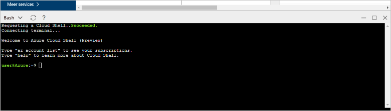

# <a name="design-your-first-azure-database-for-postgresql-using-hello-azure-portal"></a>Ontwerp van uw eerste Azure-Database voor PostgreSQL met hello Azure-portal

Azure PostgreSQL-Database is een beheerde service waarmee u toorun, beheren en schalen van maximaal beschikbare PostgreSQL-databases in de cloud Hallo. Hello Azure-portal gebruikt, kunt u eenvoudig beheren van uw server en ontwerpen van een database.

In deze zelfstudie gebruikt u Azure portal toolearn Hallo hoe naar:
> [!div class="checklist"]
> * Een Azure Database voor PostgreSQL-server maken
> * Hallo serverfirewall configureren
> * Gebruik [ **psql** ](https://www.postgresql.org/docs/9.6/static/app-psql.html) hulpprogramma toocreate een database
> * Voorbeeldgegevens laden
> * Querygegevens
> * Gegevens bijwerken
> * Gegevens terugzetten

## <a name="prerequisites"></a>Vereisten
Als u nog geen Azure-abonnement hebt, maakt u een [gratis account](https://azure.microsoft.com/free/) voordat u begint.

## <a name="log-in-toohello-azure-portal"></a>Meld u bij toohello Azure-portal
Meld u bij toohello [Azure-portal](https://portal.azure.com).

## <a name="create-an-azure-database-for-postgresql"></a>Een Azure Database voor PostgreSQL-server maken

Een Azure Database voor PostgreSQL-server wordt gemaakt met een gedefinieerde set [reken- en opslagresources](./concepts-compute-unit-and-storage.md). Hallo-server is gemaakt binnen een [Azure-resourcegroep](../azure-resource-manager/resource-group-overview.md).

Volg deze stappen toocreate een Azure-Database voor PostgreSQL-server:
1.  Klik op Hallo **+ nieuw** knop gevonden op Hallo linkerbovenhoek Hallo Azure-portal.
2.  Selecteer **Databases** van Hallo **nieuw** pagina en selecteer **Azure Database voor PostgreSQL** van Hallo **Databases** pagina.
 

3.  Hallo nieuwe server detailformulier invullen Hello volgende informatie, zoals wordt weergegeven op Hallo voorafgaand aan de installatiekopie:
    - Servernaam: **mypgserver 20170401** (naam van een server tooDNS-naam toegewezen en is dus vereist toobe globally unique identifier) 
    - Abonnement: Als u meerdere abonnementen hebt, kies Hallo in de juiste abonnement waarin Hallo resource bestaat en of wordt gefactureerd voor.
    - Resourcegroep: **myresourcegroup**
    - De aanmeldgegevens van de serverbeheerder (gebruikersnaam en wachtwoord)
    - Locatie
    - PostgreSQL-versie

  > [!IMPORTANT]
  > aanmeldgegevens van serverbeheerder Hallo en het wachtwoord dat u hier opgeeft, zijn vereiste toolog in toohello server en de databases verderop in dit snel starten. Onthoud of noteer deze informatie voor later gebruik.

4.  Klik op **prijscategorie** toospecify Hallo prijscategorie en prestatieniveau serviceniveau voor de nieuwe database. Selecteer voor deze Quick Start de laag **Basic**, **50 rekeneenheden** en **50 GB** bijbehorende opslag.
 
5.  Klik op **OK**.
6.  Klik op **maken** tooprovision Hallo-server. De inrichting duurt een paar minuten.

  > [!TIP]
  > Controleer de Hallo **pincode toodashboard** optie tooallow eenvoudig bijhouden van uw implementaties.

7.  Op de werkbalk Hallo **meldingen** toomonitor Hallo-implementatieproces.
 
   
  De database **postgres** wordt gemaakt op uw server. Hallo [postgres](https://www.postgresql.org/docs/9.6/static/app-initdb.html) database is een standaarddatabase zijn alleen bedoeld voor gebruik door gebruikers, hulpprogramma's en toepassingen van derden. 

## <a name="configure-a-server-level-firewall-rule"></a>Een serverfirewallregel configureren

Hello Azure Database voor PostgreSQL-service maakt een firewall op serverniveau Hallo. Deze firewall voorkomt u dat externe toepassingen en hulpprogramma's verbinden toohello server en alle databases op Hallo server tenzij een firewallregel tooopen Hallo firewall voor specifieke IP-adressen is gemaakt. 

1.  Nadat het Hallo-implementatie is voltooid, klikt u op **alle Resources** van Hallo links menu en typt u de naam van de Hallo **mypgserver 20170401** toosearch voor de nieuwe virtuele server. Klik op Hallo servernaam weergegeven in zoekresultaten Hallo. Hallo **overzicht** pagina voor de server wordt geopend en opties voor verdere configuratie biedt.
 
 

2.  Selecteer in de blade van de server hello, **verbindingsbeveiliging**. 
3.  Klik in het tekstvak Hallo onder **regelnaam** en voeg een nieuw firewall regel toowhitelist Hallo IP-bereik voor connectiviteit. Voor deze zelfstudie gaan we toestaan dat alle IP-adressen door te typen in **regelnaam = AllowAllIps**, **eerste IP-0.0.0.0 =** en **End-IP 255.255.255.255 =** en klik vervolgens op **opslaan** . U kunt een firewallregel die betrekking heeft op een IP-bereik toobe kunnen tooconnect van uw netwerk kunt instellen.
 
 

4.  Klik op **opslaan** en klik vervolgens op Hallo **X** tooclose hello **verbindingen beveiliging** pagina.

  > [!NOTE]
  > De Azure PostgreSQL-server communiceert via poort 5432. Als u tooconnect van binnen een bedrijfsnetwerk probeert, kan uitgaand verkeer via poort 5432 niet worden toegestaan door de firewall van uw netwerk. Zo ja, zich u niet kunnen tooconnect tooyour Azure SQL Database-server tenzij uw IT-afdeling poort 5432 wordt geopend.
  >


## <a name="get-hello-connection-information"></a>Hallo-verbindingsgegevens ophalen

Wanneer we ons Azure-Database voor PostgreSQL-server hebt gemaakt, Hallo standaard **postgres** ook database wordt gemaakt. tooconnect tooyour database-server, moet u tooprovide host informatie en toegang referenties.

1. Hallo links menu in Azure-portal en klik op **alle resources** en zoek naar Hallo-server die u zojuist hebt gemaakt **mypgserver 20170401**.

  

3. Klik op de servernaam Hallo **mypgserver 20170401**.
4. Selecteer Hallo-server **overzicht** pagina. Maak een notitie van Hallo **servernaam** en **aanmeldingsnaam van Server-beheerder**.

 


## <a name="connect-toopostgresql-database-using-psql-in-cloud-shell"></a>Verbinding maken met tooPostgreSQL database met behulp van psql in de Cloud-Shell

Nu gaan we Hallo psql opdrachtregelprogramma tooconnect toohello Azure Database gebruiken voor PostgreSQL-server. 
1. Hello Azure Cloud Shell via terminal Hallo-pictogram op het bovenste navigatiedeelvenster Hallo start.

   

2. Hello Azure Cloud Shell wordt geopend in uw browser, zodat u tootype bash-opdrachten.

   

3. Verbinding maken tooyour Azure Database voor PostgreSQL-server met Hallo psql opdrachten bij Hallo Cloud Shell-prompt. Hallo volgende indeling is gebruikte tooconnect tooan Azure Database voor de server PostgreSQL Hello [psql](https://www.postgresql.org/docs/9.6/static/app-psql.html) hulpprogramma:
   ```bash
   psql --host=<myserver> --port=<port> --username=<server admin login> --dbname=<database name>
   ```

   Bijvoorbeeld, Hallo volgende opdracht maakt verbinding met toohello standaarddatabase aangeroepen **postgres** op uw server PostgreSQL **mypgserver 20170401.postgres.database.azure.com** met referenties voor toegang. Voer het wachtwoord van de serverbeheerder in wanneer dat wordt gevraagd.

   ```bash
   psql --host=mypgserver-20170401.postgres.database.azure.com --port=5432 --username=mylogin@mypgserver-20170401 --dbname=postgres
   ```

## <a name="create-a-new-database"></a>Een nieuwe Database maken
Als u verbonden toohello server bent, maakt u een lege database op Hallo-prompt.
```bash
CREATE DATABASE mypgsqldb;
```

Opdrachtprompt Hallo uitvoeren Hallo opdracht tooswitch verbinding toohello nieuw gemaakte database na **mypgsqldb**.
```bash
\c mypgsqldb
```
## <a name="create-tables-in-hello-database"></a>Tabellen maken in Hallo-database
Als u weet hoe tooconnect toohello Azure Database voor PostgreSQL, we kunt gaan om de manier waarop toocomplete sommige basistaken uitvoeren.

We kunnen eerst een tabel maken en deze met enkele gegevens te laden. We gaan een tabel maken die inventarisgegevens houdt.
```sql
CREATE TABLE inventory (
    id serial PRIMARY KEY, 
    name VARCHAR(50), 
    quantity INTEGER
);
```

Hier ziet u Hallo zojuist gemaakt tabel in de lijst Hallo van tabvles nu door te typen:
```sql
\dt
```

## <a name="load-data-into-hello-tables"></a>Gegevens laden in Hallo tabellen
Nu dat we een tabel hebben, kunnen we sommige gegevens invoegen in het. Op Hallo open opdrachtpromptvenster, uitgevoerd Hallo query tooinsert volgen een aantal rijen van gegevens
```sql
INSERT INTO inventory (id, name, quantity) VALUES (1, 'banana', 150); 
INSERT INTO inventory (id, name, quantity) VALUES (2, 'orange', 154);
```

U hebt nu twee rijen van de voorbeeldgegevens in Hallo tabel die u eerder hebt gemaakt.

## <a name="query-and-update-hello-data-in-hello-tables"></a>Vragen en het Hallo-gegevens in het Hallo-tabellen bijwerken
Hallo volgende tooretrieve querygegevens uit Hallo-databasetabel worden uitgevoerd. 
```sql
SELECT * FROM inventory;
```

U kunt ook Hallo-gegevens in Hallo-tabellen bijwerken
```sql
UPDATE inventory SET quantity = 200 WHERE name = 'banana';
```

Hallo rij opgehaald dienovereenkomstig bijgewerkt wanneer u gegevens ophaalt.
```sql
SELECT * FROM inventory;
```

## <a name="restore-data-tooa-previous-point-in-time"></a>Vorige gegevenspunt tooa tijdstip herstellen
Stel dat u deze tabel per ongeluk hebt verwijderd. Deze situatie is iets dat die u eenvoudig niet vanuit herstellen. Azure PostgreSQL-Database kunt u toogo back tooany van punt in tijd (in hello laatste too7 dagen (basis) en 35 dagen (standaard)) en dit punt in tijd tooa nieuwe server herstellen. U kunt deze nieuwe server toorecover uw verwijderde gegevens te gebruiken. Hallo na stappen Hallo voorbeeld server tooa herstelpunt voordat Hallo tabel toegevoegd.

1.  Klik op Hallo Azure Database voor PostgreSQL-pagina voor uw server, **herstellen** op Hallo-werkbalk. Hallo **herstellen** pagina wordt geopend.
  
2.  Hallo invullen **herstellen** formulier met Hallo vereist informatie:

  
  - **Herstelpunt**: Selecteer een point-in-time die deze gebeurtenis treedt op voordat het Hallo-server is gewijzigd
  - **Doelserver**: Geef een nieuwe naam van een server toorestore naar gewenste
  - **Locatie**: U kunt geen Hallo regio selecteren, standaard is dit hetzelfde als de bronserver Hallo
  - **Prijscategorie**: U kunt deze waarde niet wijzigen bij het herstellen van een server. Dit is hetzelfde als de bronserver Hallo. 
3.  Klik op **OK** toorestore Hallo server te[tooa punt in tijd herstellen](./howto-restore-server-portal.md) voordat Hallo tabellen is verwijderd. Herstellen van een andere server tooa-punt in tijd maakt een dubbele nieuwe server als de oorspronkelijke server Hallo als u van Hallo punt in tijd opgeeft, mits dit binnen de bewaarperiode Hallo voor uw [servicelaag](./concepts-service-tiers.md).

## <a name="next-steps"></a>Volgende stappen
In deze zelfstudie hebt u geleerd hoe toouse hello Azure-portal en andere hulpprogramma's voor:
> [!div class="checklist"]
> * Een Azure Database voor PostgreSQL-server maken
> * Hallo serverfirewall configureren
> * Gebruik [ **psql** ](https://www.postgresql.org/docs/9.6/static/app-psql.html) hulpprogramma toocreate een database
> * Voorbeeldgegevens laden
> * Querygegevens
> * Gegevens bijwerken
> * Gegevens terugzetten

Vervolgens leert u hoe toouse Azure CLI toodo vergelijkbare taken, deze zelfstudie bekijken: [ontwerpen van uw eerste Azure-Database voor PostgreSQL met Azure CLI](tutorial-design-database-using-azure-cli.md)
