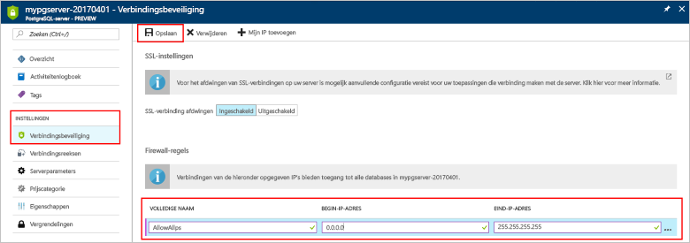

# <a name="design-your-first-azure-database-for-postgresql-using-hello-azure-portal"></a><span data-ttu-id="8be97-103">Ontwerp van uw eerste Azure-Database voor PostgreSQL met hello Azure-portal</span><span class="sxs-lookup"><span data-stu-id="8be97-103">Design your first Azure Database for PostgreSQL using hello Azure portal</span></span>

<span data-ttu-id="8be97-104">Azure PostgreSQL-Database is een beheerde service waarmee u toorun, beheren en schalen van maximaal beschikbare PostgreSQL-databases in de cloud Hallo.</span><span class="sxs-lookup"><span data-stu-id="8be97-104">Azure Database for PostgreSQL is a managed service that enables you toorun, manage, and scale highly available PostgreSQL databases in hello cloud.</span></span> <span data-ttu-id="8be97-105">Hello Azure-portal gebruikt, kunt u eenvoudig beheren van uw server en ontwerpen van een database.</span><span class="sxs-lookup"><span data-stu-id="8be97-105">Using hello Azure portal, you can easily manage your server and design a database.</span></span>

<span data-ttu-id="8be97-106">In deze zelfstudie gebruikt u Azure portal toolearn Hallo hoe naar:</span><span class="sxs-lookup"><span data-stu-id="8be97-106">In this tutorial, you use hello Azure portal toolearn how to:</span></span>
> [!div class="checklist"]
> * <span data-ttu-id="8be97-107">Een Azure Database voor PostgreSQL-server maken</span><span class="sxs-lookup"><span data-stu-id="8be97-107">Create an Azure Database for PostgreSQL</span></span>
> * <span data-ttu-id="8be97-108">Hallo serverfirewall configureren</span><span class="sxs-lookup"><span data-stu-id="8be97-108">Configure hello server firewall</span></span>
> * <span data-ttu-id="8be97-109">Gebruik [ **psql** ](https://www.postgresql.org/docs/9.6/static/app-psql.html) hulpprogramma toocreate een database</span><span class="sxs-lookup"><span data-stu-id="8be97-109">Use [**psql**](https://www.postgresql.org/docs/9.6/static/app-psql.html) utility toocreate a database</span></span>
> * <span data-ttu-id="8be97-110">Voorbeeldgegevens laden</span><span class="sxs-lookup"><span data-stu-id="8be97-110">Load sample data</span></span>
> * <span data-ttu-id="8be97-111">Querygegevens</span><span class="sxs-lookup"><span data-stu-id="8be97-111">Query data</span></span>
> * <span data-ttu-id="8be97-112">Gegevens bijwerken</span><span class="sxs-lookup"><span data-stu-id="8be97-112">Update data</span></span>
> * <span data-ttu-id="8be97-113">Gegevens terugzetten</span><span class="sxs-lookup"><span data-stu-id="8be97-113">Restore data</span></span>

## <a name="prerequisites"></a><span data-ttu-id="8be97-114">Vereisten</span><span class="sxs-lookup"><span data-stu-id="8be97-114">Prerequisites</span></span>
<span data-ttu-id="8be97-115">Als u nog geen Azure-abonnement hebt, maakt u een [gratis account](https://azure.microsoft.com/free/) voordat u begint.</span><span class="sxs-lookup"><span data-stu-id="8be97-115">If you don't have an Azure subscription, create a [free](https://azure.microsoft.com/free/) account before you begin.</span></span>

## <a name="log-in-toohello-azure-portal"></a><span data-ttu-id="8be97-116">Meld u bij toohello Azure-portal</span><span class="sxs-lookup"><span data-stu-id="8be97-116">Log in toohello Azure portal</span></span>
<span data-ttu-id="8be97-117">Meld u bij toohello [Azure-portal](https://portal.azure.com).</span><span class="sxs-lookup"><span data-stu-id="8be97-117">Log in toohello [Azure portal](https://portal.azure.com).</span></span>

## <a name="create-an-azure-database-for-postgresql"></a><span data-ttu-id="8be97-118">Een Azure Database voor PostgreSQL-server maken</span><span class="sxs-lookup"><span data-stu-id="8be97-118">Create an Azure Database for PostgreSQL</span></span>

<span data-ttu-id="8be97-119">Een Azure Database voor PostgreSQL-server wordt gemaakt met een gedefinieerde set [reken- en opslagresources](./concepts-compute-unit-and-storage.md).</span><span class="sxs-lookup"><span data-stu-id="8be97-119">An Azure Database for PostgreSQL server is created with a defined set of [compute and storage resources](./concepts-compute-unit-and-storage.md).</span></span> <span data-ttu-id="8be97-120">Hallo-server is gemaakt binnen een [Azure-resourcegroep](../azure-resource-manager/resource-group-overview.md).</span><span class="sxs-lookup"><span data-stu-id="8be97-120">hello server is created within an [Azure resource group](../azure-resource-manager/resource-group-overview.md).</span></span>

<span data-ttu-id="8be97-121">Volg deze stappen toocreate een Azure-Database voor PostgreSQL-server:</span><span class="sxs-lookup"><span data-stu-id="8be97-121">Follow these steps toocreate an Azure Database for PostgreSQL server:</span></span>
1.  <span data-ttu-id="8be97-122">Klik op Hallo **+ nieuw** knop gevonden op Hallo linkerbovenhoek Hallo Azure-portal.</span><span class="sxs-lookup"><span data-stu-id="8be97-122">Click hello **+ New**  button found on hello upper left-hand corner of hello Azure portal.</span></span>
2.  <span data-ttu-id="8be97-123">Selecteer **Databases** van Hallo **nieuw** pagina en selecteer **Azure Database voor PostgreSQL** van Hallo **Databases** pagina.</span><span class="sxs-lookup"><span data-stu-id="8be97-123">Select **Databases** from hello **New** page, and select **Azure Database for PostgreSQL** from hello **Databases** page.</span></span>
 <span data-ttu-id="8be97-124"></span><span class="sxs-lookup"><span data-stu-id="8be97-124"></span></span>

3.  <span data-ttu-id="8be97-125">Hallo nieuwe server detailformulier invullen Hello volgende informatie, zoals wordt weergegeven op Hallo voorafgaand aan de installatiekopie:</span><span class="sxs-lookup"><span data-stu-id="8be97-125">Fill out hello new server details form with hello following information, as shown on hello preceding image:</span></span>
    - <span data-ttu-id="8be97-126">Servernaam: **mypgserver 20170401** (naam van een server tooDNS-naam toegewezen en is dus vereist toobe globally unique identifier)</span><span class="sxs-lookup"><span data-stu-id="8be97-126">Server name: **mypgserver-20170401** (name of a server maps tooDNS name and is thus required toobe globally unique)</span></span> 
    - <span data-ttu-id="8be97-127">Abonnement: Als u meerdere abonnementen hebt, kies Hallo in de juiste abonnement waarin Hallo resource bestaat en of wordt gefactureerd voor.</span><span class="sxs-lookup"><span data-stu-id="8be97-127">Subscription: If you have multiple subscriptions, choose hello appropriate subscription in which hello resource exists or is billed for.</span></span>
    - <span data-ttu-id="8be97-128">Resourcegroep: **myresourcegroup**</span><span class="sxs-lookup"><span data-stu-id="8be97-128">Resource group: **myresourcegroup**</span></span>
    - <span data-ttu-id="8be97-129">De aanmeldgegevens van de serverbeheerder (gebruikersnaam en wachtwoord)</span><span class="sxs-lookup"><span data-stu-id="8be97-129">Server admin login and password of your choice</span></span>
    - <span data-ttu-id="8be97-130">Locatie</span><span class="sxs-lookup"><span data-stu-id="8be97-130">Location</span></span>
    - <span data-ttu-id="8be97-131">PostgreSQL-versie</span><span class="sxs-lookup"><span data-stu-id="8be97-131">PostgreSQL Version</span></span>

  > [!IMPORTANT]
  > <span data-ttu-id="8be97-132">aanmeldgegevens van serverbeheerder Hallo en het wachtwoord dat u hier opgeeft, zijn vereiste toolog in toohello server en de databases verderop in dit snel starten.</span><span class="sxs-lookup"><span data-stu-id="8be97-132">hello server admin login and password that you specify here are required toolog in toohello server and its databases later in this quick start.</span></span> <span data-ttu-id="8be97-133">Onthoud of noteer deze informatie voor later gebruik.</span><span class="sxs-lookup"><span data-stu-id="8be97-133">Remember or record this information for later use.</span></span>

4.  <span data-ttu-id="8be97-134">Klik op **prijscategorie** toospecify Hallo prijscategorie en prestatieniveau serviceniveau voor de nieuwe database.</span><span class="sxs-lookup"><span data-stu-id="8be97-134">Click **Pricing tier** toospecify hello service tier and performance level for your new database.</span></span> <span data-ttu-id="8be97-135">Selecteer voor deze Quick Start de laag **Basic**, **50 rekeneenheden** en **50 GB** bijbehorende opslag.</span><span class="sxs-lookup"><span data-stu-id="8be97-135">For this quick start, select **Basic** Tier, **50 Compute Units** and **50 GB** of included storage.</span></span>
 <span data-ttu-id="8be97-136"></span><span class="sxs-lookup"><span data-stu-id="8be97-136"></span></span>
5.  <span data-ttu-id="8be97-137">Klik op **OK**.</span><span class="sxs-lookup"><span data-stu-id="8be97-137">Click **Ok**.</span></span>
6.  <span data-ttu-id="8be97-138">Klik op **maken** tooprovision Hallo-server.</span><span class="sxs-lookup"><span data-stu-id="8be97-138">Click **Create** tooprovision hello server.</span></span> <span data-ttu-id="8be97-139">De inrichting duurt een paar minuten.</span><span class="sxs-lookup"><span data-stu-id="8be97-139">Provisioning takes a few minutes.</span></span>

  > [!TIP]
  > <span data-ttu-id="8be97-140">Controleer de Hallo **pincode toodashboard** optie tooallow eenvoudig bijhouden van uw implementaties.</span><span class="sxs-lookup"><span data-stu-id="8be97-140">Check hello **Pin toodashboard** option tooallow easy tracking of your deployments.</span></span>

7.  <span data-ttu-id="8be97-141">Op de werkbalk Hallo **meldingen** toomonitor Hallo-implementatieproces.</span><span class="sxs-lookup"><span data-stu-id="8be97-141">On hello toolbar, click **Notifications** toomonitor hello deployment process.</span></span>
 <span data-ttu-id="8be97-142"></span><span class="sxs-lookup"><span data-stu-id="8be97-142"></span></span>
   
  <span data-ttu-id="8be97-143">De database **postgres** wordt gemaakt op uw server.</span><span class="sxs-lookup"><span data-stu-id="8be97-143">By default, **postgres** database gets created under your server.</span></span> <span data-ttu-id="8be97-144">Hallo [postgres](https://www.postgresql.org/docs/9.6/static/app-initdb.html) database is een standaarddatabase zijn alleen bedoeld voor gebruik door gebruikers, hulpprogramma's en toepassingen van derden.</span><span class="sxs-lookup"><span data-stu-id="8be97-144">hello [postgres](https://www.postgresql.org/docs/9.6/static/app-initdb.html) database is a default database meant for use by users, utilities, and third-party applications.</span></span> 

## <a name="configure-a-server-level-firewall-rule"></a><span data-ttu-id="8be97-145">Een serverfirewallregel configureren</span><span class="sxs-lookup"><span data-stu-id="8be97-145">Configure a server-level firewall rule</span></span>

<span data-ttu-id="8be97-146">Hello Azure Database voor PostgreSQL-service maakt een firewall op serverniveau Hallo.</span><span class="sxs-lookup"><span data-stu-id="8be97-146">hello Azure Database for PostgreSQL service creates a firewall at hello server-level.</span></span> <span data-ttu-id="8be97-147">Deze firewall voorkomt u dat externe toepassingen en hulpprogramma's verbinden toohello server en alle databases op Hallo server tenzij een firewallregel tooopen Hallo firewall voor specifieke IP-adressen is gemaakt.</span><span class="sxs-lookup"><span data-stu-id="8be97-147">This firewall prevents external applications and tools from connecting toohello server and any databases on hello server unless a firewall rule is created tooopen hello firewall for specific IP addresses.</span></span> 

1.  <span data-ttu-id="8be97-148">Nadat het Hallo-implementatie is voltooid, klikt u op **alle Resources** van Hallo links menu en typt u de naam van de Hallo **mypgserver 20170401** toosearch voor de nieuwe virtuele server.</span><span class="sxs-lookup"><span data-stu-id="8be97-148">After hello deployment completes, click **All Resources** from hello left-hand menu and type in hello name **mypgserver-20170401** toosearch for your newly created server.</span></span> <span data-ttu-id="8be97-149">Klik op Hallo servernaam weergegeven in zoekresultaten Hallo.</span><span class="sxs-lookup"><span data-stu-id="8be97-149">Click hello server name listed in hello search result.</span></span> <span data-ttu-id="8be97-150">Hallo **overzicht** pagina voor de server wordt geopend en opties voor verdere configuratie biedt.</span><span class="sxs-lookup"><span data-stu-id="8be97-150">hello **Overview** page for your server opens and provides options for further configuration.</span></span>
 
 

2.  <span data-ttu-id="8be97-152">Selecteer in de blade van de server hello, **verbindingsbeveiliging**.</span><span class="sxs-lookup"><span data-stu-id="8be97-152">In hello server blade, select **Connection Security**.</span></span> 
3.  <span data-ttu-id="8be97-153">Klik in het tekstvak Hallo onder **regelnaam** en voeg een nieuw firewall regel toowhitelist Hallo IP-bereik voor connectiviteit.</span><span class="sxs-lookup"><span data-stu-id="8be97-153">Click in hello text box under **Rule Name,** and add a new firewall rule toowhitelist hello IP range for connectivity.</span></span> <span data-ttu-id="8be97-154">Voor deze zelfstudie gaan we toestaan dat alle IP-adressen door te typen in **regelnaam = AllowAllIps**, **eerste IP-0.0.0.0 =** en **End-IP 255.255.255.255 =** en klik vervolgens op **opslaan** .</span><span class="sxs-lookup"><span data-stu-id="8be97-154">For this tutorial, let's allow all IPs by typing in **Rule Name = AllowAllIps**, **Start IP = 0.0.0.0** and **End IP = 255.255.255.255** and then click **Save**.</span></span> <span data-ttu-id="8be97-155">U kunt een firewallregel die betrekking heeft op een IP-bereik toobe kunnen tooconnect van uw netwerk kunt instellen.</span><span class="sxs-lookup"><span data-stu-id="8be97-155">You can set a firewall rule that covers an IP range toobe able tooconnect from your network.</span></span>
 
 

4.  <span data-ttu-id="8be97-157">Klik op **opslaan** en klik vervolgens op Hallo **X** tooclose hello **verbindingen beveiliging** pagina.</span><span class="sxs-lookup"><span data-stu-id="8be97-157">Click **Save** and then click hello **X** tooclose hello **Connections Security** page.</span></span>

  > [!NOTE]
  > <span data-ttu-id="8be97-158">De Azure PostgreSQL-server communiceert via poort 5432.</span><span class="sxs-lookup"><span data-stu-id="8be97-158">Azure PostgreSQL server communicates over port 5432.</span></span> <span data-ttu-id="8be97-159">Als u tooconnect van binnen een bedrijfsnetwerk probeert, kan uitgaand verkeer via poort 5432 niet worden toegestaan door de firewall van uw netwerk.</span><span class="sxs-lookup"><span data-stu-id="8be97-159">If you are trying tooconnect from within a corporate network, outbound traffic over port 5432 may not be allowed by your network's firewall.</span></span> <span data-ttu-id="8be97-160">Zo ja, zich u niet kunnen tooconnect tooyour Azure SQL Database-server tenzij uw IT-afdeling poort 5432 wordt geopend.</span><span class="sxs-lookup"><span data-stu-id="8be97-160">If so, you will not be able tooconnect tooyour Azure SQL Database server unless your IT department opens port 5432.</span></span>
  >


## <a name="get-hello-connection-information"></a><span data-ttu-id="8be97-161">Hallo-verbindingsgegevens ophalen</span><span class="sxs-lookup"><span data-stu-id="8be97-161">Get hello connection information</span></span>

<span data-ttu-id="8be97-162">Wanneer we ons Azure-Database voor PostgreSQL-server hebt gemaakt, Hallo standaard **postgres** ook database wordt gemaakt.</span><span class="sxs-lookup"><span data-stu-id="8be97-162">When we created our Azure Database for PostgreSQL server, hello default **postgres** database also gets created.</span></span> <span data-ttu-id="8be97-163">tooconnect tooyour database-server, moet u tooprovide host informatie en toegang referenties.</span><span class="sxs-lookup"><span data-stu-id="8be97-163">tooconnect tooyour database server, you need tooprovide host information and access credentials.</span></span>

1. <span data-ttu-id="8be97-164">Hallo links menu in Azure-portal en klik op **alle resources** en zoek naar Hallo-server die u zojuist hebt gemaakt **mypgserver 20170401**.</span><span class="sxs-lookup"><span data-stu-id="8be97-164">From hello left-hand menu in Azure portal, click **All resources** and search for hello server you just created **mypgserver-20170401**.</span></span>

  

3. <span data-ttu-id="8be97-166">Klik op de servernaam Hallo **mypgserver 20170401**.</span><span class="sxs-lookup"><span data-stu-id="8be97-166">Click hello server name **mypgserver-20170401**.</span></span>
4. <span data-ttu-id="8be97-167">Selecteer Hallo-server **overzicht** pagina.</span><span class="sxs-lookup"><span data-stu-id="8be97-167">Select hello server's **Overview** page.</span></span> <span data-ttu-id="8be97-168">Maak een notitie van Hallo **servernaam** en **aanmeldingsnaam van Server-beheerder**.</span><span class="sxs-lookup"><span data-stu-id="8be97-168">Make a note of hello **Server name** and **Server admin login name**.</span></span>

 


## <a name="connect-toopostgresql-database-using-psql-in-cloud-shell"></a><span data-ttu-id="8be97-170">Verbinding maken met tooPostgreSQL database met behulp van psql in de Cloud-Shell</span><span class="sxs-lookup"><span data-stu-id="8be97-170">Connect tooPostgreSQL database using psql in Cloud Shell</span></span>

<span data-ttu-id="8be97-171">Nu gaan we Hallo psql opdrachtregelprogramma tooconnect toohello Azure Database gebruiken voor PostgreSQL-server.</span><span class="sxs-lookup"><span data-stu-id="8be97-171">Let's now use hello psql command-line utility tooconnect toohello Azure Database for PostgreSQL server.</span></span> 
1. <span data-ttu-id="8be97-172">Hello Azure Cloud Shell via terminal Hallo-pictogram op het bovenste navigatiedeelvenster Hallo start.</span><span class="sxs-lookup"><span data-stu-id="8be97-172">Launch hello Azure Cloud Shell via hello terminal icon on hello top navigation pane.</span></span>

   

2. <span data-ttu-id="8be97-174">Hello Azure Cloud Shell wordt geopend in uw browser, zodat u tootype bash-opdrachten.</span><span class="sxs-lookup"><span data-stu-id="8be97-174">hello Azure Cloud Shell opens in your browser, enabling you tootype bash commands.</span></span>

   

3. <span data-ttu-id="8be97-176">Verbinding maken tooyour Azure Database voor PostgreSQL-server met Hallo psql opdrachten bij Hallo Cloud Shell-prompt.</span><span class="sxs-lookup"><span data-stu-id="8be97-176">At hello Cloud Shell prompt, connect tooyour Azure Database for PostgreSQL server using hello psql commands.</span></span> <span data-ttu-id="8be97-177">Hallo volgende indeling is gebruikte tooconnect tooan Azure Database voor de server PostgreSQL Hello [psql](https://www.postgresql.org/docs/9.6/static/app-psql.html) hulpprogramma:</span><span class="sxs-lookup"><span data-stu-id="8be97-177">hello following format is used tooconnect tooan Azure Database for PostgreSQL server with hello [psql](https://www.postgresql.org/docs/9.6/static/app-psql.html) utility:</span></span>
   ```bash
   psql --host=<myserver> --port=<port> --username=<server admin login> --dbname=<database name>
   ```

   <span data-ttu-id="8be97-178">Bijvoorbeeld, Hallo volgende opdracht maakt verbinding met toohello standaarddatabase aangeroepen **postgres** op uw server PostgreSQL **mypgserver 20170401.postgres.database.azure.com** met referenties voor toegang.</span><span class="sxs-lookup"><span data-stu-id="8be97-178">For example, hello following command connects toohello default database called **postgres** on your PostgreSQL server **mypgserver-20170401.postgres.database.azure.com** using access credentials.</span></span> <span data-ttu-id="8be97-179">Voer het wachtwoord van de serverbeheerder in wanneer dat wordt gevraagd.</span><span class="sxs-lookup"><span data-stu-id="8be97-179">Enter your server admin password when prompted.</span></span>

   ```bash
   psql --host=mypgserver-20170401.postgres.database.azure.com --port=5432 --username=mylogin@mypgserver-20170401 --dbname=postgres
   ```

## <a name="create-a-new-database"></a><span data-ttu-id="8be97-180">Een nieuwe Database maken</span><span class="sxs-lookup"><span data-stu-id="8be97-180">Create a New Database</span></span>
<span data-ttu-id="8be97-181">Als u verbonden toohello server bent, maakt u een lege database op Hallo-prompt.</span><span class="sxs-lookup"><span data-stu-id="8be97-181">Once you're connected toohello server, create a blank database at hello prompt.</span></span>
```bash
CREATE DATABASE mypgsqldb;
```

<span data-ttu-id="8be97-182">Opdrachtprompt Hallo uitvoeren Hallo opdracht tooswitch verbinding toohello nieuw gemaakte database na **mypgsqldb**.</span><span class="sxs-lookup"><span data-stu-id="8be97-182">At hello prompt, execute hello following command tooswitch connection toohello newly created database **mypgsqldb**.</span></span>
```bash
\c mypgsqldb
```
## <a name="create-tables-in-hello-database"></a><span data-ttu-id="8be97-183">Tabellen maken in Hallo-database</span><span class="sxs-lookup"><span data-stu-id="8be97-183">Create tables in hello database</span></span>
<span data-ttu-id="8be97-184">Als u weet hoe tooconnect toohello Azure Database voor PostgreSQL, we kunt gaan om de manier waarop toocomplete sommige basistaken uitvoeren.</span><span class="sxs-lookup"><span data-stu-id="8be97-184">Now that you know how tooconnect toohello Azure Database for PostgreSQL, we can go over how toocomplete some basic tasks.</span></span>

<span data-ttu-id="8be97-185">We kunnen eerst een tabel maken en deze met enkele gegevens te laden.</span><span class="sxs-lookup"><span data-stu-id="8be97-185">First, we can create a table and load it with some data.</span></span> <span data-ttu-id="8be97-186">We gaan een tabel maken die inventarisgegevens houdt.</span><span class="sxs-lookup"><span data-stu-id="8be97-186">Let's create a table that tracks inventory information.</span></span>
```sql
CREATE TABLE inventory (
    id serial PRIMARY KEY, 
    name VARCHAR(50), 
    quantity INTEGER
);
```

<span data-ttu-id="8be97-187">Hier ziet u Hallo zojuist gemaakt tabel in de lijst Hallo van tabvles nu door te typen:</span><span class="sxs-lookup"><span data-stu-id="8be97-187">You can see hello newly created table in hello list of tabvles now by typing:</span></span>
```sql
\dt
```

## <a name="load-data-into-hello-tables"></a><span data-ttu-id="8be97-188">Gegevens laden in Hallo tabellen</span><span class="sxs-lookup"><span data-stu-id="8be97-188">Load data into hello tables</span></span>
<span data-ttu-id="8be97-189">Nu dat we een tabel hebben, kunnen we sommige gegevens invoegen in het.</span><span class="sxs-lookup"><span data-stu-id="8be97-189">Now that we have a table, we can insert some data into it.</span></span> <span data-ttu-id="8be97-190">Op Hallo open opdrachtpromptvenster, uitgevoerd Hallo query tooinsert volgen een aantal rijen van gegevens</span><span class="sxs-lookup"><span data-stu-id="8be97-190">At hello open command prompt window, run hello following query tooinsert some rows of data</span></span>
```sql
INSERT INTO inventory (id, name, quantity) VALUES (1, 'banana', 150); 
INSERT INTO inventory (id, name, quantity) VALUES (2, 'orange', 154);
```

<span data-ttu-id="8be97-191">U hebt nu twee rijen van de voorbeeldgegevens in Hallo tabel die u eerder hebt gemaakt.</span><span class="sxs-lookup"><span data-stu-id="8be97-191">You have now two rows of sample data into hello table you created earlier.</span></span>

## <a name="query-and-update-hello-data-in-hello-tables"></a><span data-ttu-id="8be97-192">Vragen en het Hallo-gegevens in het Hallo-tabellen bijwerken</span><span class="sxs-lookup"><span data-stu-id="8be97-192">Query and update hello data in hello tables</span></span>
<span data-ttu-id="8be97-193">Hallo volgende tooretrieve querygegevens uit Hallo-databasetabel worden uitgevoerd.</span><span class="sxs-lookup"><span data-stu-id="8be97-193">Execute hello following query tooretrieve information from hello database table.</span></span> 
```sql
SELECT * FROM inventory;
```

<span data-ttu-id="8be97-194">U kunt ook Hallo-gegevens in Hallo-tabellen bijwerken</span><span class="sxs-lookup"><span data-stu-id="8be97-194">You can also update hello data in hello tables</span></span>
```sql
UPDATE inventory SET quantity = 200 WHERE name = 'banana';
```

<span data-ttu-id="8be97-195">Hallo rij opgehaald dienovereenkomstig bijgewerkt wanneer u gegevens ophaalt.</span><span class="sxs-lookup"><span data-stu-id="8be97-195">hello row gets updated accordingly when you retrieve data.</span></span>
```sql
SELECT * FROM inventory;
```

## <a name="restore-data-tooa-previous-point-in-time"></a><span data-ttu-id="8be97-196">Vorige gegevenspunt tooa tijdstip herstellen</span><span class="sxs-lookup"><span data-stu-id="8be97-196">Restore data tooa previous point in time</span></span>
<span data-ttu-id="8be97-197">Stel dat u deze tabel per ongeluk hebt verwijderd.</span><span class="sxs-lookup"><span data-stu-id="8be97-197">Imagine you have accidentally deleted this table.</span></span> <span data-ttu-id="8be97-198">Deze situatie is iets dat die u eenvoudig niet vanuit herstellen.</span><span class="sxs-lookup"><span data-stu-id="8be97-198">This situation is something you cannot easily recover from.</span></span> <span data-ttu-id="8be97-199">Azure PostgreSQL-Database kunt u toogo back tooany van punt in tijd (in hello laatste too7 dagen (basis) en 35 dagen (standaard)) en dit punt in tijd tooa nieuwe server herstellen.</span><span class="sxs-lookup"><span data-stu-id="8be97-199">Azure Database for PostgreSQL allows you toogo back tooany point-in-time (in hello last up too7 days (Basic) and 35 days (Standard)) and restore this point-in-time tooa new server.</span></span> <span data-ttu-id="8be97-200">U kunt deze nieuwe server toorecover uw verwijderde gegevens te gebruiken.</span><span class="sxs-lookup"><span data-stu-id="8be97-200">You can use this new server toorecover your deleted data.</span></span> <span data-ttu-id="8be97-201">Hallo na stappen Hallo voorbeeld server tooa herstelpunt voordat Hallo tabel toegevoegd.</span><span class="sxs-lookup"><span data-stu-id="8be97-201">hello following steps restore hello sample server tooa point before hello table was added.</span></span>

1.  <span data-ttu-id="8be97-202">Klik op Hallo Azure Database voor PostgreSQL-pagina voor uw server, **herstellen** op Hallo-werkbalk.</span><span class="sxs-lookup"><span data-stu-id="8be97-202">On hello Azure Database for PostgreSQL page for your server, click **Restore** on hello toolbar.</span></span> <span data-ttu-id="8be97-203">Hallo **herstellen** pagina wordt geopend.</span><span class="sxs-lookup"><span data-stu-id="8be97-203">hello **Restore** page opens.</span></span>
  <span data-ttu-id="8be97-204"></span><span class="sxs-lookup"><span data-stu-id="8be97-204"></span></span>
2.  <span data-ttu-id="8be97-205">Hallo invullen **herstellen** formulier met Hallo vereist informatie:</span><span class="sxs-lookup"><span data-stu-id="8be97-205">Fill out hello **Restore** form with hello required information:</span></span>

  
  - <span data-ttu-id="8be97-207">**Herstelpunt**: Selecteer een point-in-time die deze gebeurtenis treedt op voordat het Hallo-server is gewijzigd</span><span class="sxs-lookup"><span data-stu-id="8be97-207">**Restore point**: Select a point-in-time that occurs before hello server was changed</span></span>
  - <span data-ttu-id="8be97-208">**Doelserver**: Geef een nieuwe naam van een server toorestore naar gewenste</span><span class="sxs-lookup"><span data-stu-id="8be97-208">**Target server**: Provide a new server name you want toorestore to</span></span>
  - <span data-ttu-id="8be97-209">**Locatie**: U kunt geen Hallo regio selecteren, standaard is dit hetzelfde als de bronserver Hallo</span><span class="sxs-lookup"><span data-stu-id="8be97-209">**Location**: You cannot select hello region, by default it is same as hello source server</span></span>
  - <span data-ttu-id="8be97-210">**Prijscategorie**: U kunt deze waarde niet wijzigen bij het herstellen van een server.</span><span class="sxs-lookup"><span data-stu-id="8be97-210">**Pricing tier**: You cannot change this value when restoring a server.</span></span> <span data-ttu-id="8be97-211">Dit is hetzelfde als de bronserver Hallo.</span><span class="sxs-lookup"><span data-stu-id="8be97-211">It is same as hello source server.</span></span> 
3.  <span data-ttu-id="8be97-212">Klik op **OK** toorestore Hallo server te[tooa punt in tijd herstellen](./howto-restore-server-portal.md) voordat Hallo tabellen is verwijderd.</span><span class="sxs-lookup"><span data-stu-id="8be97-212">Click **OK** toorestore hello server too[restore tooa point-in-time](./howto-restore-server-portal.md) before hello tables was deleted.</span></span> <span data-ttu-id="8be97-213">Herstellen van een andere server tooa-punt in tijd maakt een dubbele nieuwe server als de oorspronkelijke server Hallo als u van Hallo punt in tijd opgeeft, mits dit binnen de bewaarperiode Hallo voor uw [servicelaag](./concepts-service-tiers.md).</span><span class="sxs-lookup"><span data-stu-id="8be97-213">Restoring a server tooa different point in time creates a duplicate new server as hello original server as of hello point in time you specify, provided that it is within hello retention period for your [service tier](./concepts-service-tiers.md).</span></span>

## <a name="next-steps"></a><span data-ttu-id="8be97-214">Volgende stappen</span><span class="sxs-lookup"><span data-stu-id="8be97-214">Next Steps</span></span>
<span data-ttu-id="8be97-215">In deze zelfstudie hebt u geleerd hoe toouse hello Azure-portal en andere hulpprogramma's voor:</span><span class="sxs-lookup"><span data-stu-id="8be97-215">In this tutorial, you learned how toouse hello Azure portal and other utilities to:</span></span>
> [!div class="checklist"]
> * <span data-ttu-id="8be97-216">Een Azure Database voor PostgreSQL-server maken</span><span class="sxs-lookup"><span data-stu-id="8be97-216">Create an Azure Database for PostgreSQL</span></span>
> * <span data-ttu-id="8be97-217">Hallo serverfirewall configureren</span><span class="sxs-lookup"><span data-stu-id="8be97-217">Configure hello server firewall</span></span>
> * <span data-ttu-id="8be97-218">Gebruik [ **psql** ](https://www.postgresql.org/docs/9.6/static/app-psql.html) hulpprogramma toocreate een database</span><span class="sxs-lookup"><span data-stu-id="8be97-218">Use [**psql**](https://www.postgresql.org/docs/9.6/static/app-psql.html) utility toocreate a database</span></span>
> * <span data-ttu-id="8be97-219">Voorbeeldgegevens laden</span><span class="sxs-lookup"><span data-stu-id="8be97-219">Load sample data</span></span>
> * <span data-ttu-id="8be97-220">Querygegevens</span><span class="sxs-lookup"><span data-stu-id="8be97-220">Query data</span></span>
> * <span data-ttu-id="8be97-221">Gegevens bijwerken</span><span class="sxs-lookup"><span data-stu-id="8be97-221">Update data</span></span>
> * <span data-ttu-id="8be97-222">Gegevens terugzetten</span><span class="sxs-lookup"><span data-stu-id="8be97-222">Restore data</span></span>

<span data-ttu-id="8be97-223">Vervolgens leert u hoe toouse Azure CLI toodo vergelijkbare taken, deze zelfstudie bekijken: [ontwerpen van uw eerste Azure-Database voor PostgreSQL met Azure CLI](tutorial-design-database-using-azure-cli.md)</span><span class="sxs-lookup"><span data-stu-id="8be97-223">Next, learn how toouse Azure CLI toodo similar tasks, review this tutorial: [Design your first Azure Database for PostgreSQL using Azure CLI](tutorial-design-database-using-azure-cli.md)</span></span>
