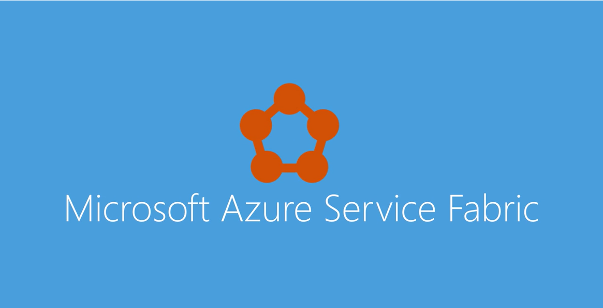

# Overzicht van Azure Service FabricOverview of Azure Service Fabric
Azure Service Fabric is een platform voor gedistribueerde systemen waarmee u eenvoudig toopackage kunt, implementeren en beheren van schaalbare en betrouwbare microservices en containers.Azure Service Fabric is a distributed systems platform that makes it easy toopackage, deploy, and manage scalable and reliable microservices and containers. Service Fabric ook een oplossing voor grote uitdagingen Hallo ontwikkelen en beheren van systeemeigen cloudtoepassingen.Service Fabric also addresses hello significant challenges in developing and managing cloud native applications. Ontwikkelaars en beheerders kunnen complexe infrastructuurproblemen voorkomen en zich concentreren op het implementeren van bedrijfsspecifieke, veeleisende werkbelastingen die schaalbaar, betrouwbaar en beheerbaar zijn.Developers and administrators can avoid complex infrastructure problems and focus on implementing mission-critical, demanding workloads that are scalable, reliable, and manageable. Service Fabric vertegenwoordigt Hallo next generation platform voor het maken en beheren van deze bedrijfsniveau, laag 1, cloud-toepassingen uitvoeren in containers.Service Fabric represents hello next-generation platform for building and managing these enterprise-class, tier-1, cloud-scale applications running in containers.

In deze korte video introduceert Service Fabric en microservices:
<a target="_blank" href="https://aka.ms/servicefabricvideo">This short video introduces Service Fabric and microservices: 
<a target="_blank" href="https://aka.ms/servicefabricvideo">  
  
</a>

## Toepassingen bestaan uit microservicesApplications composed of microservices 
Service Fabric kunt u toobuild en schaalbare en betrouwbare toepassingen bestaan uit microservices dat tooas een cluster dat wordt aangeduid als u een high-density uitvoeren op een gedeelde groep machines, beheren.Service Fabric enables you toobuild and manage scalable and reliable applications composed of microservices that run at high density on a shared pool of machines, which is referred tooas a cluster. Het biedt een geavanceerde, lichtgewicht runtime toobuild gedistribueerd, schaalbaar, staatloze en stateful microservices uitgevoerd in de containers.It provides a sophisticated, lightweight runtime toobuild distributed, scalable, stateless, and stateful microservices running in containers. Het bevat ook uitgebreide toepassing management mogelijkheden tooprovision, implementeren, bewaken, upgrade/patch en geïmplementeerde toepassingen, met inbegrip van beperkte services te verwijderen.It also provides comprehensive application management capabilities tooprovision, deploy, monitor, upgrade/patch, and delete deployed applications including containerized services.

Service Fabric drijft veel Microsoft-services vandaag, waaronder Azure SQL Database, Azure Cosmos DB, Cortana Microsoft Power BI, Microsoft Intune, Azure Event Hubs, Azure IoT Hub, Dynamics 365, Skype voor bedrijven en veel core Azure-services.Service Fabric powers many Microsoft services today, including Azure SQL Database, Azure Cosmos DB, Cortana, Microsoft Power BI, Microsoft Intune, Azure Event Hubs, Azure IoT Hub, Dynamics 365, Skype for Business, and many core Azure services.

Service Fabric is op maat gemaakte toocreate systeemeigen cloudservices die kunnen begin klein, indien nodig en toomassive schaal met honderden of duizenden computers groeien.Service Fabric is tailored toocreate cloud native services that can start small, as needed, and grow toomassive scale with hundreds or thousands of machines.

De hedendaagse Internet scale services zijn opgebouwd uit microservices.Today's Internet-scale services are built of microservices. Voorbeelden van microservices zijn protocol gateways, gebruikersprofielen, winkelen winkelwagentjes, inventaris verwerking, wachtrijen, en in de cache opslaat.Examples of microservices include protocol gateways, user profiles, shopping carts, inventory processing, queues, and caches. Service Fabric is een microservices-platform die elke microservice (of de container) biedt een unieke naam op die stateless of stateful worden kan.Service Fabric is a microservices platform that gives every microservice (or container) a unique name that can be either stateless or stateful.

Service Fabric bevat uitgebreide runtime en lifecycle management mogelijkheden tooapplications die van deze microservices bestaan.Service Fabric provides comprehensive runtime and lifecycle management capabilities tooapplications that are composed of these microservices. Deze als host fungeert voor microservices in containers die zijn geïmplementeerd en geactiveerd via Hallo Service Fabric-cluster.It hosts microservices inside containers that are deployed and activated across hello Service Fabric cluster. Een verplaatsing van virtuele machines toocontainers maakt mogelijk een orde van grootte toename in dichtheid.A move from virtual machines toocontainers makes possible an order-of-magnitude increase in density. Op deze manier wordt een andere orde van grootte in dichtheid mogelijk wanneer u van containers toomicroservices in deze containers verplaatst.Similarly, another order of magnitude in density becomes possible when you move from containers toomicroservices in these containers. Één cluster voor Azure SQL Database omvat bijvoorbeeld honderden computers met tienduizenden containers die als host fungeren voor een totaal van honderden of duizenden databases.For example, a single cluster for Azure SQL Database comprises hundreds of machines running tens of thousands of containers that host a total of hundreds of thousands of databases. Elke database is een stateful Service Fabric-microservice.Each database is a Service Fabric stateful microservice. 

Lees voor meer informatie over Hallo microservices benadering [waarom een microservices benadering toobuilding toepassingen?](service-fabric-overview-microservices.md)For more on hello microservices approach, read [Why a microservices approach toobuilding applications?](service-fabric-overview-microservices.md)

## Implementatie van de container en orchestrationContainer deployment and orchestration
Service Fabric is van Microsoft [container orchestrator](service-fabric-cluster-resource-manager-introduction.md) microservices implementeert in een cluster van machines.Service Fabric is Microsoft's [container orchestrator](service-fabric-cluster-resource-manager-introduction.md) deploying microservices across a cluster of machines. Microservices kunnen worden ontwikkeld in tal van manieren met behulp van Hallo [Service Fabric modellen programming](service-fabric-choose-framework.md), [ASP.NET Core](service-fabric-reliable-services-communication-aspnetcore.md), toodeploying [code van uw keuze](service-fabric-deploy-existing-app.md).Microservices can be developed in many ways from using hello [Service Fabric programming models](service-fabric-choose-framework.md), [ASP.NET Core](service-fabric-reliable-services-communication-aspnetcore.md), toodeploying [any code of your choice](service-fabric-deploy-existing-app.md). Belangrijker nog, kunt u beide services in processen en -services in containers in Hallo elkaar dezelfde toepassing.Importantly, you can mix both services in processes and services in containers in hello same application. Als u alleen te wilt[implementeren en beheren van containers](service-fabric-containers-overview.md), Service Fabric is een ideale keuze als een container orchestrator.If you just want too[deploy and manage containers](service-fabric-containers-overview.md), Service Fabric is a perfect choice as a container orchestrator.

## Een besturingssysteem in een cloudAny OS, any cloud
Service Fabric kan overal worden uitgevoerd.Service Fabric runs everywhere. In veel omgevingen, waaronder Azure of on-premises, op Windows Server of op Linux, kunt u clusters voor Service Fabric.You can create clusters for Service Fabric in many environments, including Azure or on premises, on Windows Server, or on Linux. U kunt zelfs clusters maken op andere openbare clouds.You can even create clusters on other public clouds. Hallo-ontwikkelomgeving in Hallo SDK is bovendien **identieke** toohello productie-omgeving met geen emulators die betrokken zijn.In addition, hello development environment in hello SDK is **identical** toohello production environment, with no emulators involved. Met andere woorden, implementeert wat wordt uitgevoerd op uw lokaal ontwikkelcluster toohello clusters in andere omgevingen.In other words, what runs on your local development cluster deploys toohello clusters in other environments.

![Service Fabric-platform][Image1]

Lees voor meer informatie over het maken van clusters met lokale [maken van een cluster op Windows Server- of Linux](service-fabric-deploy-anywhere.md) of voor Azure maken van een cluster [via hello Azure-portal](service-fabric-cluster-creation-via-portal.md).For more information on creating clusters on-premises, read [creating a cluster on Windows Server or Linux](service-fabric-deploy-anywhere.md) or for Azure creating a cluster [via hello Azure portal](service-fabric-cluster-creation-via-portal.md).

## Staatloze en stateful microservices voor Service FabricStateless and stateful microservices for Service Fabric
Service Fabric kunt u toobuild toepassingen die bestaan uit microservices of containers.Service Fabric enables you toobuild applications that consist of microservices or containers. Staatloze microservices (zoals protocol gateways en webproxy) gedurende niet een veranderlijke status buiten een aanvraag en de reactie van Hallo-service.Stateless microservices (such as protocol gateways and web proxies) do not maintain a mutable state outside a request and its response from hello service. Azure Cloud Services-werkrollen zijn een voorbeeld van een staatloze service.Azure Cloud Services worker roles are an example of a stateless service. Stateful microservices (zoals gebruikersaccounts, databases, apparaten, on en wachtrijen) onderhouden de status van een veranderlijke, gezaghebbende buiten Hallo-aanvraag en het antwoord.Stateful microservices (such as user accounts, databases, devices, shopping carts, and queues) maintain a mutable, authoritative state beyond hello request and its response. De hedendaagse Internet-toepassingen bestaan uit een combinatie van staatloze en stateful microservices.Today's Internet-scale applications consist of a combination of stateless and stateful microservices. 

Een sleutel differentation met Service Fabric wordt de nadruk op het ontwikkelen van stateful services, hetzij met Hallo [ingebouwde programmeermodellen ](service-fabric-choose-framework.md) of met beperkte stateful services.A key differentation with Service Fabric is its strong focus on building stateful services, either with hello [built-in programming models ](service-fabric-choose-framework.md) or with  containerized stateful services. Hallo [toepassingsscenario's](service-fabric-application-scenarios.md) beschrijven Hallo scenario's waar stateful services worden gebruikt.hello [application scenarios](service-fabric-application-scenarios.md) describe hello scenarios where stateful services are used.

## De levenscyclus van ToepassingsbeheerApplication lifecycle management
Service Fabric biedt ondersteuning voor de levenscyclus van de volledige toepassing hello en CI/CD van cloudtoepassingen, met inbegrip van containers.Service Fabric provides support for hello full application lifecycle and CI/CD of cloud applications including containers. Deze levenscyclus beheren bevat ontwikkeling tot implementatie, dagelijkse beheer en onderhoud tooeventual buiten gebruik stellen.This lifecycle includes development through deployment, daily management, and maintenance tooeventual decommissioning.

Beheermogelijkheden voor service Fabric-toepassing lifecycle toepassingsbeheerders en IT-operators toouse eenvoudige, lage-touch werkstromen tooprovision inschakelen, implementeren, patch en controleren van toepassingen.Service Fabric application lifecycle management capabilities enable application administrators and IT operators toouse simple, low-touch workflows tooprovision, deploy, patch, and monitor applications. Deze ingebouwde werkstromen minder aanzienlijk Hallo last van de IT-operators tookeep toepassingen die continu beschikbaar zijn.These built-in workflows greatly reduce hello burden on IT operators tookeep applications continuously available.

De meeste toepassingen bestaan uit een combinatie van staatloze en stateful microservices containers en andere uitvoerbare bestanden die samen zijn geïmplementeerd.Most applications consist of a combination of stateless and stateful microservices, containers, and other executables that are deployed together. Doordat de sterke-typen op Hallo toepassingen, kunnen Service Fabric Hallo-implementatie van meerdere exemplaren van een toepassing.By having strong types on hello applications, Service Fabric enables hello deployment of multiple application instances. Elk exemplaar wordt beheerd en onafhankelijk bijgewerkt.Each instance is managed and upgraded independently. Houd voor ogen dat Service Fabric implementeren containers of alle uitvoerbare bestanden en zodat ze betrouwbaar.Importantly, Service Fabric can deploy containers or any executables and make them reliable. Service Fabric kan bijvoorbeeld .NET, ASP.NET Core, node.js, Windows containers, Linux-containers, Java virtuele machines, scripts, Angular of elke willekeurige waarmee u uw toepassing implementeren.For example, Service Fabric can deploy .NET, ASP.NET Core, node.js, Windows containers, Linux containers, Java virtual machines, scripts, Angular, or literally anything that makes up your application.

Service Fabric is geïntegreerd met CI/CD-hulpprogramma's zoals [Visual Studio Team Services](https://www.visualstudio.com/team-services/), [Jenkins](https://jenkins.io/index.html), en [Octopus implementeren](https://octopus.com/) en kan worden gebruikt met een ander populaire CI/CD-hulpprogramma.Service Fabric is integrated with CI/CD tools such as [Visual Studio Team Services](https://www.visualstudio.com/team-services/), [Jenkins](https://jenkins.io/index.html), and [Octopus Deploy](https://octopus.com/) and can be used with any other popular CI/CD tool.

Lees voor meer informatie over de levenscyclus van Toepassingsbeheer [toepassing lifecycle](service-fabric-application-lifecycle.md).For more information about application lifecycle management, read [Application lifecycle](service-fabric-application-lifecycle.md). Voor meer informatie over hoe toodeploy code, Zie [implementeren van een gast uitvoerbaar bestand](service-fabric-deploy-existing-app.md).For more about how toodeploy any code, see [deploy a guest executable](service-fabric-deploy-existing-app.md).

## Belangrijkste mogelijkhedenKey capabilities
U kunt met behulp van Service Fabric:By using Service Fabric, you can:

* Implementeer tooAzure of tooon-premises datacenters waarop Windows of Linux wordt uitgevoerd met nul codewijzigingen.Deploy tooAzure or tooon-premises datacenters that run Windows or Linux with zero code changes. Eenmalig schrijven en vervolgens implementeren overal tooany Service Fabric-cluster.Write once, and then deploy anywhere tooany Service Fabric cluster.
* Schaalbare toepassingen ontwikkelen die bestaan uit een van de microservices via Hallo Service Fabric-programmeermodellen, containers of code.Develop scalable applications that are composed of microservices by using hello Service Fabric programming models, containers, or any code.
* Maximaal betrouwbare microservices voor staatloze en stateful ontwikkelen.Develop highly reliable stateless and stateful microservices. Hallo-ontwerp van uw toepassing met behulp van stateful microservices vereenvoudigen.Simplify hello design of your application by using stateful microservices. 
* Gebruik Hallo nieuwe Reliable Actors programming model toocreate cloudobjecten met zelfstandige code en status.Use hello novel Reliable Actors programming model toocreate cloud objects with self contained code and state.
* Implementeren en te organiseren containers die containers voor Windows en Linux-containers zijn.Deploy and orchestrate containers that include Windows containers and Linux containers. Service Fabric is een container op de hoogte, stateful is, gegevens orchestrator.Service Fabric is a data aware, stateful, container orchestrator.
* Toepassingen implementeren in seconden, op high-density met honderden of duizenden toepassingen of containers per computer.Deploy applications in seconds, at high density with hundreds or thousands of applications or containers per machine.
* Verschillende versies van Hallo dezelfde toepassing zijde elkaar en elke toepassing onafhankelijk werk implementeren.Deploy different versions of hello same application side by side, and upgrade each application independently.
* Hallo levenscyclus van uw toepassingen zonder uitvaltijd, met inbegrip van breken en vaste upgrades beheren.Manage hello lifecycle of your applications without any downtime, including breaking and nonbreaking upgrades.
* Uitbreiden of schalen in Hallo aantal knooppunten in een cluster.Scale out or scale in hello number of nodes in a cluster. Als u knooppunten schalen, is uw toepassingen automatisch schalen.As you scale nodes, your applications automatically scale.
* Bewaken en onderzoeken Hallo status van uw toepassingen en beleidsregels voor het uitvoeren van automatische reparaties instellen.Monitor and diagnose hello health of your applications and set policies for performing automatic repairs.
* Bekijkt hello resource balancer indelen Hallo herdistributie van toepassingen over Hallo-cluster.Watch hello resource balancer orchestrate hello redistribution of applications across hello cluster. Service Fabric vanuit fouten herstelt en optimaliseert de Hallo-verdeling van de belasting op basis van beschikbare resources.Service Fabric recovers from failures and optimizes hello distribution of load based on available resources.

<!--Every topic should have next steps and links toohello next logical set of content tookeep hello customer engaged-->
## Volgende stappenNext steps
* Voor meer informatie:For more information:
  * [Waarom een microservices benadering toobuilding toepassingen?Why a microservices approach toobuilding applications?](service-fabric-overview-microservices.md)
  * [Overzicht van de terminologieTerminology overview](service-fabric-technical-overview.md)
* Instellen van uw Service Fabric [ontwikkelomgeving](service-fabric-get-started.md)Setting up your Service Fabric [development environment](service-fabric-get-started.md)  
* Meer informatie over [ondersteuningsopties voor Service Fabric](service-fabric-support.md)Learn about [Service Fabric support options](service-fabric-support.md)

[Image1]: media/service-fabric-overview/Service-Fabric-Overview.png
