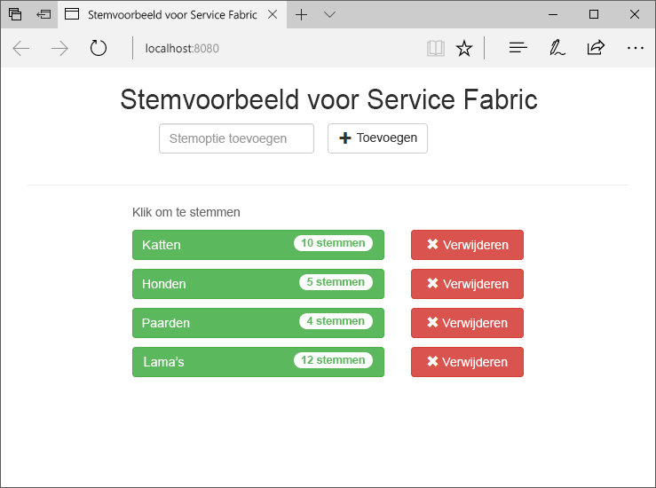
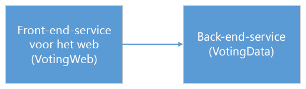
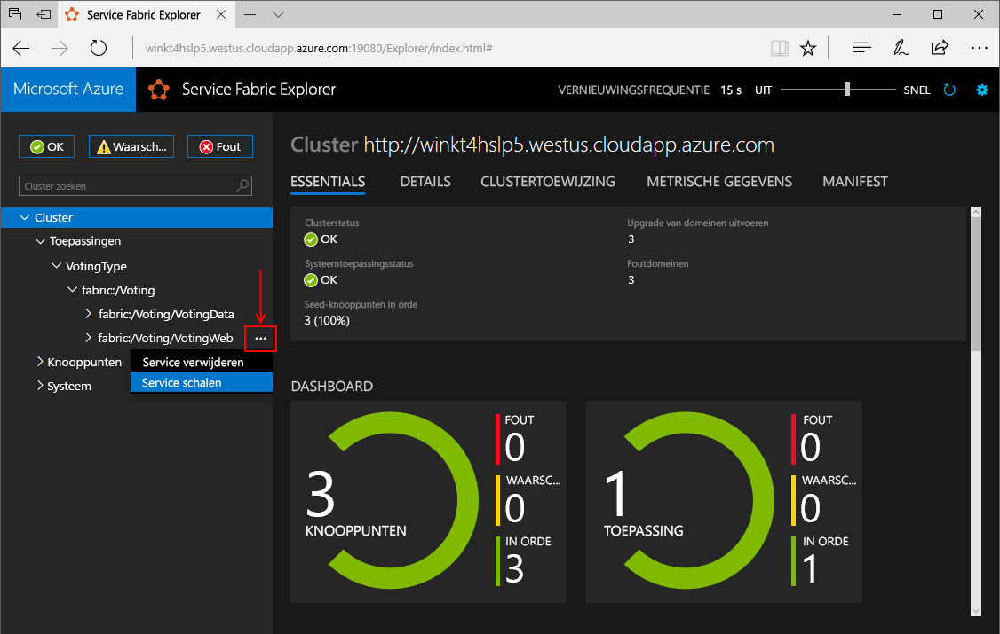
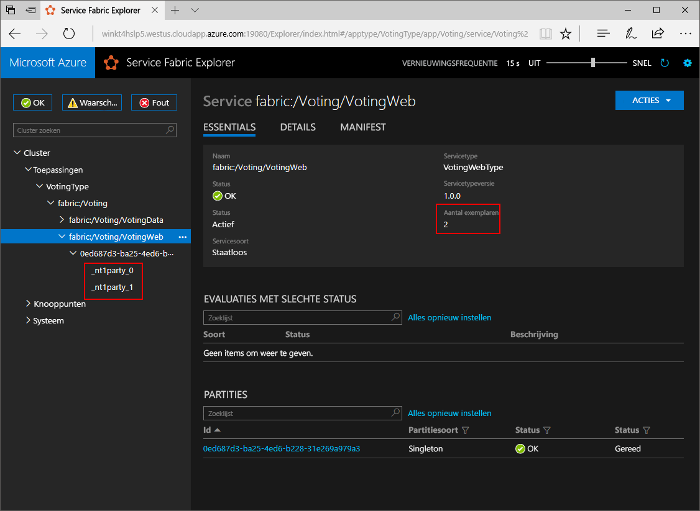
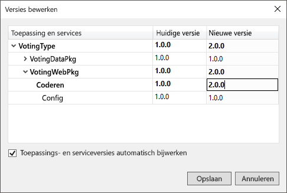
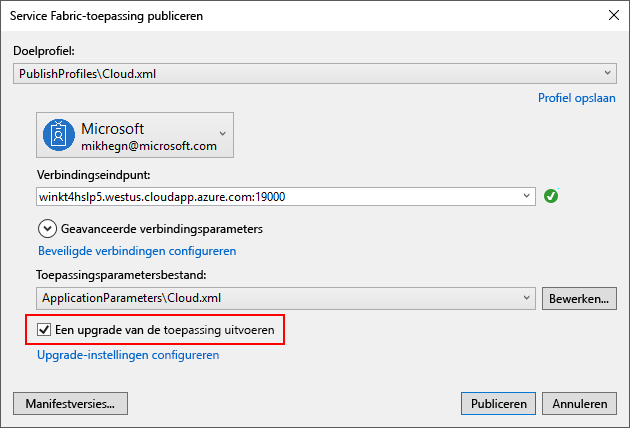
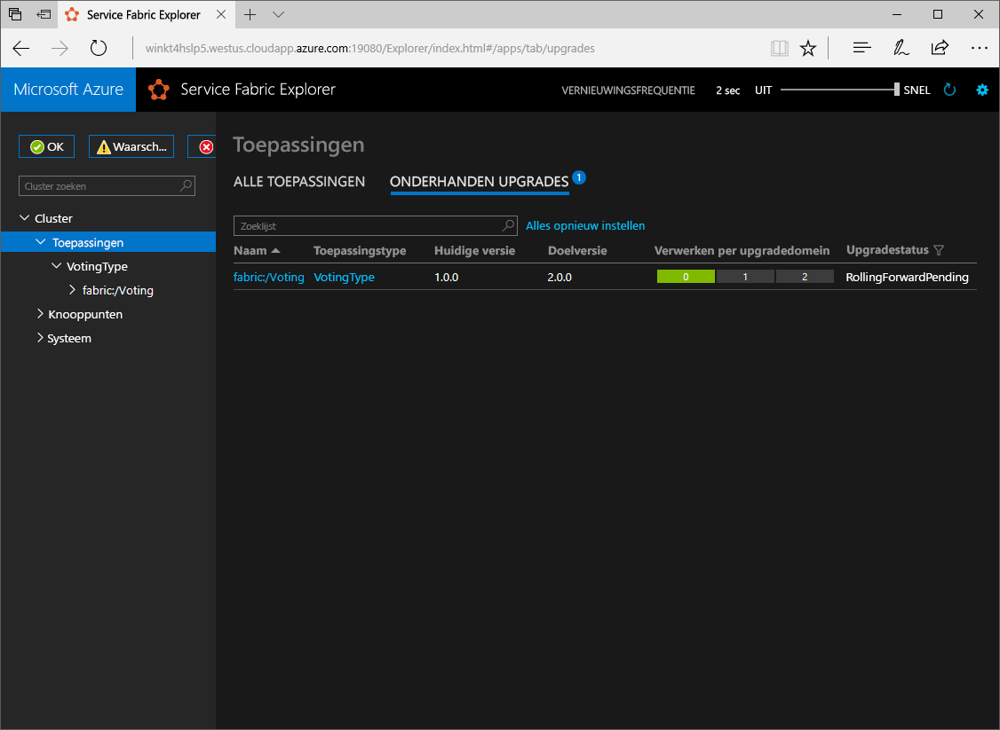

# <a name="create-a-net-service-fabric-application-in-azure"></a><span data-ttu-id="0bc35-103">Een .NET-Service Fabric-toepassing maken in Azure</span><span class="sxs-lookup"><span data-stu-id="0bc35-103">Create a .NET Service Fabric application in Azure</span></span>
<span data-ttu-id="0bc35-104">Azure Service Fabric is een platform voor gedistribueerde systemen waarmee u schaalbare en betrouwbare microservices en containers implementeert en beheert.</span><span class="sxs-lookup"><span data-stu-id="0bc35-104">Azure Service Fabric is a distributed systems platform for deploying and managing scalable and reliable microservices and containers.</span></span> 

<span data-ttu-id="0bc35-105">Deze snelstartgids toont hoe toodeploy uw eerste .NET application tooService Fabric.</span><span class="sxs-lookup"><span data-stu-id="0bc35-105">This quickstart shows how toodeploy your first .NET application tooService Fabric.</span></span> <span data-ttu-id="0bc35-106">Wanneer u klaar bent, hebt u een stemtoepassing met een ASP.NET Core web-front-die stemmende resultaten worden opgeslagen in een stateful back-end-service in Hallo-cluster.</span><span class="sxs-lookup"><span data-stu-id="0bc35-106">When you're finished, you have a voting application with an ASP.NET Core web front-end that saves voting results in a stateful back-end service in hello cluster.</span></span>



<span data-ttu-id="0bc35-108">Met behulp van deze toepassing u leert hoe:</span><span class="sxs-lookup"><span data-stu-id="0bc35-108">Using this application you learn how to:</span></span>
> [!div class="checklist"]
> * <span data-ttu-id="0bc35-109">Een toepassing maken met .NET- en Service Fabric</span><span class="sxs-lookup"><span data-stu-id="0bc35-109">Create an application using .NET and Service Fabric</span></span>
> * <span data-ttu-id="0bc35-110">ASP.NET core gebruiken als een webfront-end</span><span class="sxs-lookup"><span data-stu-id="0bc35-110">Use ASP.NET core as a web front-end</span></span>
> * <span data-ttu-id="0bc35-111">Opslaan van toepassingsgegevens in een stateful service</span><span class="sxs-lookup"><span data-stu-id="0bc35-111">Store application data in a stateful service</span></span>
> * <span data-ttu-id="0bc35-112">Fouten opsporen in uw toepassing lokaal</span><span class="sxs-lookup"><span data-stu-id="0bc35-112">Debug your application locally</span></span>
> * <span data-ttu-id="0bc35-113">Hallo toepassing tooa cluster in Azure implementeren</span><span class="sxs-lookup"><span data-stu-id="0bc35-113">Deploy hello application tooa cluster in Azure</span></span>
> * <span data-ttu-id="0bc35-114">Scale-out Hallo-toepassing op meerdere knooppunten</span><span class="sxs-lookup"><span data-stu-id="0bc35-114">Scale-out hello application across multiple nodes</span></span>
> * <span data-ttu-id="0bc35-115">Een rolling upgrade van de toepassing uitvoeren</span><span class="sxs-lookup"><span data-stu-id="0bc35-115">Perform a rolling application upgrade</span></span>

## <a name="prerequisites"></a><span data-ttu-id="0bc35-116">Vereisten</span><span class="sxs-lookup"><span data-stu-id="0bc35-116">Prerequisites</span></span>
<span data-ttu-id="0bc35-117">toocomplete deze snelstartgids:</span><span class="sxs-lookup"><span data-stu-id="0bc35-117">toocomplete this quickstart:</span></span>
1. <span data-ttu-id="0bc35-118">[Installeer Visual Studio 2017](https://www.visualstudio.com/) Hello **ontwikkelen van Azure** en **ASP.NET en web ontwikkeling** werkbelastingen.</span><span class="sxs-lookup"><span data-stu-id="0bc35-118">[Install Visual Studio 2017](https://www.visualstudio.com/) with hello **Azure development** and **ASP.NET and web development** workloads.</span></span>
2. [<span data-ttu-id="0bc35-119">Git installeren</span><span class="sxs-lookup"><span data-stu-id="0bc35-119">Install Git</span></span>](https://git-scm.com/)
3. [<span data-ttu-id="0bc35-120">Hallo Microsoft Azure Service Fabric SDK installeren</span><span class="sxs-lookup"><span data-stu-id="0bc35-120">Install hello Microsoft Azure Service Fabric SDK</span></span>](http://www.microsoft.com/web/handlers/webpi.ashx?command=getinstallerredirect&appid=MicrosoftAzure-ServiceFabric-CoreSDK)
4. <span data-ttu-id="0bc35-121">Voer Hallo opdracht tooenable Visual Studio toodeploy toohello lokale Service Fabric-cluster te volgen:</span><span class="sxs-lookup"><span data-stu-id="0bc35-121">Run hello following command tooenable Visual Studio toodeploy toohello local Service Fabric cluster:</span></span>
    ```powershell
    Set-ExecutionPolicy -ExecutionPolicy Unrestricted -Force -Scope CurrentUser
    ```

## <a name="download-hello-sample"></a><span data-ttu-id="0bc35-122">Hallo voorbeeld downloaden</span><span class="sxs-lookup"><span data-stu-id="0bc35-122">Download hello sample</span></span>
<span data-ttu-id="0bc35-123">In een opdrachtvenster Hallo na de opdracht tooclone Hallo voorbeeld-app-opslagplaats tooyour lokale computer worden uitgevoerd.</span><span class="sxs-lookup"><span data-stu-id="0bc35-123">In a command window, run hello following command tooclone hello sample app repository tooyour local machine.</span></span>
```
git clone https://github.com/Azure-Samples/service-fabric-dotnet-quickstart
```

## <a name="run-hello-application-locally"></a><span data-ttu-id="0bc35-124">Hallo-toepassing lokaal uitvoeren</span><span class="sxs-lookup"><span data-stu-id="0bc35-124">Run hello application locally</span></span>
<span data-ttu-id="0bc35-125">Met de rechtermuisknop op Hallo Visual Studio-pictogram in het Menu Start Hallo en kies **als administrator uitvoeren**.</span><span class="sxs-lookup"><span data-stu-id="0bc35-125">Right-click hello Visual Studio icon in hello Start Menu and choose **Run as administrator**.</span></span> <span data-ttu-id="0bc35-126">In de volgorde tooattach Hallo foutopsporingsprogramma tooyour services moet u toorun Visual Studio als beheerder.</span><span class="sxs-lookup"><span data-stu-id="0bc35-126">In order tooattach hello debugger tooyour services, you need toorun Visual Studio as administrator.</span></span>

<span data-ttu-id="0bc35-127">Open Hallo **Voting.sln** Visual Studio-oplossing uit Hallo opslagplaats u gekloond.</span><span class="sxs-lookup"><span data-stu-id="0bc35-127">Open hello **Voting.sln** Visual Studio solution from hello repository you cloned.</span></span>

<span data-ttu-id="0bc35-128">Druk op-toepassing hello toodeploy **F5**.</span><span class="sxs-lookup"><span data-stu-id="0bc35-128">toodeploy hello application, press **F5**.</span></span>

> [!NOTE]
> <span data-ttu-id="0bc35-129">Hallo maakt eerst u uitvoeren en implementeren van de toepassing hello, Visual Studio een lokaal cluster voor foutopsporing.</span><span class="sxs-lookup"><span data-stu-id="0bc35-129">hello first time you run and deploy hello application, Visual Studio creates a local cluster for debugging.</span></span> <span data-ttu-id="0bc35-130">Deze bewerking kan enige tijd duren.</span><span class="sxs-lookup"><span data-stu-id="0bc35-130">This operation may take some time.</span></span> <span data-ttu-id="0bc35-131">status van het Hallo-cluster maken wordt weergegeven in Visual Studio-uitvoervenster Hallo.</span><span class="sxs-lookup"><span data-stu-id="0bc35-131">hello cluster creation status is displayed in hello Visual Studio output window.</span></span>

<span data-ttu-id="0bc35-132">Wanneer het Hallo-implementatie is voltooid, een browser starten en open deze pagina: `http://localhost:8080` -Hallo webfront-end van de toepassing hello.</span><span class="sxs-lookup"><span data-stu-id="0bc35-132">When hello deployment is complete, launch a browser and open this page: `http://localhost:8080` - hello web front-end of hello application.</span></span>


<span data-ttu-id="0bc35-134">U kunt nu een set opties voor uw stem toevoegen en begin met het maken van stemmen.</span><span class="sxs-lookup"><span data-stu-id="0bc35-134">You can now add a set of voting options, and start taking votes.</span></span> <span data-ttu-id="0bc35-135">Hallo-toepassing wordt uitgevoerd en alle gegevens worden opgeslagen in het Service Fabric-cluster zonder Hallo nodig is voor een aparte database.</span><span class="sxs-lookup"><span data-stu-id="0bc35-135">hello application runs and stores all data in your Service Fabric cluster, without hello need for a separate database.</span></span>

## <a name="walk-through-hello-voting-sample-application"></a><span data-ttu-id="0bc35-136">Hallo stemmen voorbeeldtoepassing doorlopen</span><span class="sxs-lookup"><span data-stu-id="0bc35-136">Walk through hello voting sample application</span></span>
<span data-ttu-id="0bc35-137">Hallo stemmen toepassing bestaat uit twee services:</span><span class="sxs-lookup"><span data-stu-id="0bc35-137">hello voting application consists of two services:</span></span>
- <span data-ttu-id="0bc35-138">Web-front-service (VotingWeb): een ASP.NET Core web-front-endservice die webpagina Hallo fungeert en zichtbaar gemaakt web-API's toocommunicate met Hallo back-endservice.</span><span class="sxs-lookup"><span data-stu-id="0bc35-138">Web front-end service (VotingWeb)- An ASP.NET Core web front-end service, which serves hello web page and exposes web APIs toocommunicate with hello backend service.</span></span>
- <span data-ttu-id="0bc35-139">Back-end-service (VotingData)-Core van een ASP.NET-webservice, die zichtbaar gemaakt die een API toostore Hallo stem in een betrouwbare woordenlijst resulteert op schijf persistent.</span><span class="sxs-lookup"><span data-stu-id="0bc35-139">Back-end service (VotingData)- An ASP.NET Core web service, which exposes an API toostore hello vote results in a reliable dictionary persisted on disk.</span></span>



<span data-ttu-id="0bc35-141">Wanneer u stemmen in Hallo toepassing hello volgende gebeurtenissen:</span><span class="sxs-lookup"><span data-stu-id="0bc35-141">When you vote in hello application hello following events occur:</span></span>
1. <span data-ttu-id="0bc35-142">Een JavaScript verzendt Hallo stem aanvraag toohello web API in Hallo web-front-service als een HTTP PUT-aanvraag.</span><span class="sxs-lookup"><span data-stu-id="0bc35-142">A JavaScript sends hello vote request toohello web API in hello web front-end service as an HTTP PUT request.</span></span>

2. <span data-ttu-id="0bc35-143">Hallo-web-front-service gebruikt een toolocate proxy en doorsturen van een HTTP PUT-aanvraag toohello back-endservice.</span><span class="sxs-lookup"><span data-stu-id="0bc35-143">hello web front-end service uses a proxy toolocate and forward an HTTP PUT request toohello back-end service.</span></span>

3. <span data-ttu-id="0bc35-144">Hallo back-endservice Hallo inkomende aanvraag duurt en winkels Hallo bijgewerkt resulteren in een betrouwbare woordenlijst die gerepliceerde toomultiple knooppunten binnen Hallo cluster opgehaald en opgeslagen op schijf.</span><span class="sxs-lookup"><span data-stu-id="0bc35-144">hello back-end service takes hello incoming request, and stores hello updated result in a reliable dictionary, which gets replicated toomultiple nodes within hello cluster and persisted on disk.</span></span> <span data-ttu-id="0bc35-145">Alle Hallo toepassingsgegevens wordt opgeslagen in Hallo-cluster, zodat er geen database nodig is.</span><span class="sxs-lookup"><span data-stu-id="0bc35-145">All hello application's data is stored in hello cluster, so no database is needed.</span></span>

## <a name="debug-in-visual-studio"></a><span data-ttu-id="0bc35-146">Fouten opsporen in Visual Studio</span><span class="sxs-lookup"><span data-stu-id="0bc35-146">Debug in Visual Studio</span></span>
<span data-ttu-id="0bc35-147">Als u fouten opspoort toepassing in Visual Studio, gebruikt u een lokaal cluster van de Service Fabric-ontwikkeling.</span><span class="sxs-lookup"><span data-stu-id="0bc35-147">When debugging application in Visual Studio, you are using a local Service Fabric development cluster.</span></span> <span data-ttu-id="0bc35-148">U hebt uw foutopsporing ervaring tooyour scenario Hallo optie tooadjust.</span><span class="sxs-lookup"><span data-stu-id="0bc35-148">You have hello option tooadjust your debugging experience tooyour scenario.</span></span> <span data-ttu-id="0bc35-149">In deze toepassing opgeslagen gegevens in onze back-end-service met behulp van een betrouwbare woordenlijst.</span><span class="sxs-lookup"><span data-stu-id="0bc35-149">In this application, we store data in our back-end service, using a reliable dictionary.</span></span> <span data-ttu-id="0bc35-150">Visual Studio Hiermee verwijdert u de toepassing hello per standaard wanneer u Hallo foutopsporingsprogramma stopt.</span><span class="sxs-lookup"><span data-stu-id="0bc35-150">Visual Studio removes hello application per default when you stop hello debugger.</span></span> <span data-ttu-id="0bc35-151">Verwijderen van de toepassing hello zorgt ervoor dat de gegevens Hallo in Hallo back-end service tooalso worden verwijderd.</span><span class="sxs-lookup"><span data-stu-id="0bc35-151">Removing hello application causes hello data in hello back-end service tooalso be removed.</span></span> <span data-ttu-id="0bc35-152">toopersist hello gegevens tussen foutopsporingssessies, kunt u Hallo **toepassing foutopsporingsmodus** als eigenschap op Hallo **Voting** -project in Visual Studio.</span><span class="sxs-lookup"><span data-stu-id="0bc35-152">toopersist hello data between debugging sessions, you can change hello **Application Debug Mode** as a property on hello **Voting** project in Visual Studio.</span></span>

<span data-ttu-id="0bc35-153">toolook op wat er gebeurt in Hallo code voltooid Hallo stappen te volgen:</span><span class="sxs-lookup"><span data-stu-id="0bc35-153">toolook at what happens in hello code, complete hello following steps:</span></span>
1. <span data-ttu-id="0bc35-154">Open Hallo **VotesController.cs** bestands- en stel een onderbrekingspunt in Hallo web-API's **plaatsen** methode (regel 47) - u kunt zoeken naar Hallo-bestand in Hallo Solution Explorer in Visual Studio.</span><span class="sxs-lookup"><span data-stu-id="0bc35-154">Open hello **VotesController.cs** file and set a breakpoint in hello web API's **Put** method (line 47) - You can search for hello file in hello Solution Explorer in Visual Studio.</span></span>

2. <span data-ttu-id="0bc35-155">Open Hallo **VoteDataController.cs** bestands- en stel een onderbrekingspunt in deze web-API **plaatsen** methode (line 50).</span><span class="sxs-lookup"><span data-stu-id="0bc35-155">Open hello **VoteDataController.cs** file and set a breakpoint in this web API's **Put** method (line 50).</span></span>

3. <span data-ttu-id="0bc35-156">Ga terug toohello browser en klik op een optie of toevoegen van een nieuwe stemmende optie.</span><span class="sxs-lookup"><span data-stu-id="0bc35-156">Go back toohello browser and click a voting option or add a new voting option.</span></span> <span data-ttu-id="0bc35-157">U onderbrekingspunt Hallo eerste in Hallo web front-end van api-controller.</span><span class="sxs-lookup"><span data-stu-id="0bc35-157">You hit hello first breakpoint in hello web front-end's api controller.</span></span>
    - <span data-ttu-id="0bc35-158">Dit is waar Hallo JavaScript in browser Hallo verzendt u een aanvraag toohello web API-controller in Hallo front-end-service.</span><span class="sxs-lookup"><span data-stu-id="0bc35-158">This is where hello JavaScript in hello browser sends a request toohello web API controller in hello front-end service.</span></span>
    
    

    - <span data-ttu-id="0bc35-160">Eerst we Hallo URL toohello ReverseProxy opstellen voor onze back-endservice **(1)**.</span><span class="sxs-lookup"><span data-stu-id="0bc35-160">First we construct hello URL toohello ReverseProxy for our back-end service **(1)**.</span></span>
    - <span data-ttu-id="0bc35-161">Vervolgens we Hallo HTTP PUT-aanvraag toohello ReverseProxy sturen **(2)**.</span><span class="sxs-lookup"><span data-stu-id="0bc35-161">Then we send hello HTTP PUT Request toohello ReverseProxy **(2)**.</span></span>
    - <span data-ttu-id="0bc35-162">Ten slotte hello wordt teruggeplaatst antwoord Hallo van Hallo back-endservice toohello client **(3)**.</span><span class="sxs-lookup"><span data-stu-id="0bc35-162">Finally hello we return hello response from hello back-end service toohello client **(3)**.</span></span>

4. <span data-ttu-id="0bc35-163">Druk op **F5** toocontinue</span><span class="sxs-lookup"><span data-stu-id="0bc35-163">Press **F5** toocontinue</span></span>
    - <span data-ttu-id="0bc35-164">U bent nu op Hallo break punt in Hallo back-endservice.</span><span class="sxs-lookup"><span data-stu-id="0bc35-164">You are now at hello break point in hello back-end service.</span></span>
    
    

    - <span data-ttu-id="0bc35-166">In de eerste regel in de methode Hallo Hallo **(1)** gebruiken we Hallo `StateManager` tooget of toevoegen van een betrouwbare woordenlijst aangeroepen `counts`.</span><span class="sxs-lookup"><span data-stu-id="0bc35-166">In hello first line in hello method **(1)** we are using hello `StateManager` tooget or add a reliable dictionary called `counts`.</span></span>
    - <span data-ttu-id="0bc35-167">Alle interacties met waarden in een betrouwbare woordenlijst vereisen een transactie, deze met de instructie **(2)** die transactie maakt.</span><span class="sxs-lookup"><span data-stu-id="0bc35-167">All interactions with values in a reliable dictionary require a transaction, this using statement **(2)** creates that transaction.</span></span>
    - <span data-ttu-id="0bc35-168">In de transactie hello, werk we vervolgens Hallo-waarde van relevante Hallo-sleutel voor uw stem optie Hallo en doorvoeracties Hallo bewerking **(3)**.</span><span class="sxs-lookup"><span data-stu-id="0bc35-168">In hello transaction, we then update hello value of hello relevant key for hello voting option and commits hello operation **(3)**.</span></span> <span data-ttu-id="0bc35-169">Zodra het Hallo doorvoeren retourneert methode, Hallo gegevens wordt bijgewerkt in de woordenlijst Hallo en tooother knooppunten in cluster Hallo gerepliceerd.</span><span class="sxs-lookup"><span data-stu-id="0bc35-169">Once hello commit method returns, hello data is updated in hello dictionary and replicated tooother nodes in hello cluster.</span></span> <span data-ttu-id="0bc35-170">Hallo gegevens worden nu veilig opgeslagen in de cluster Hallo en Hallo back-endservice failover tooother knooppunten, nog steeds Hallo gegevens beschikbaar.</span><span class="sxs-lookup"><span data-stu-id="0bc35-170">hello data is now safely stored in hello cluster, and hello back-end service can fail over tooother nodes, still having hello data available.</span></span>
5. <span data-ttu-id="0bc35-171">Druk op **F5** toocontinue</span><span class="sxs-lookup"><span data-stu-id="0bc35-171">Press **F5** toocontinue</span></span>

<span data-ttu-id="0bc35-172">toostop hello foutopsporingssessie, drukt u op **Shift + F5**.</span><span class="sxs-lookup"><span data-stu-id="0bc35-172">toostop hello debugging session, press **Shift+F5**.</span></span>

## <a name="deploy-hello-application-tooazure"></a><span data-ttu-id="0bc35-173">Hallo toepassing tooAzure implementeren</span><span class="sxs-lookup"><span data-stu-id="0bc35-173">Deploy hello application tooAzure</span></span>
<span data-ttu-id="0bc35-174">toodeploy hello toepassing tooa cluster in Azure, u kunt ofwel toocreate uw eigen cluster of gebruik een Cluster van derden.</span><span class="sxs-lookup"><span data-stu-id="0bc35-174">toodeploy hello application tooa cluster in Azure, you can either choose toocreate your own cluster, or use a Party Cluster.</span></span>

<span data-ttu-id="0bc35-175">Partijen clusters zijn gratis, tijdelijke Service Fabric clusters gehost op Azure en uitgevoerd door Hallo Service Fabric-team waar iedereen toepassingen implementeren en meer informatie over het Hallo-platform.</span><span class="sxs-lookup"><span data-stu-id="0bc35-175">Party clusters are free, limited-time Service Fabric clusters hosted on Azure and run by hello Service Fabric team where anyone can deploy applications and learn about hello platform.</span></span> <span data-ttu-id="0bc35-176">tooget toegang tooa partij Cluster [Hallo instructies](http://aka.ms/tryservicefabric).</span><span class="sxs-lookup"><span data-stu-id="0bc35-176">tooget access tooa Party Cluster, [follow hello instructions](http://aka.ms/tryservicefabric).</span></span> 

<span data-ttu-id="0bc35-177">Zie voor meer informatie over het maken van uw eigen cluster [Uw eerste Service Fabric-cluster maken op Azure](service-fabric-get-started-azure-cluster.md).</span><span class="sxs-lookup"><span data-stu-id="0bc35-177">For information about creating your own cluster, see [Create your first Service Fabric cluster on Azure](service-fabric-get-started-azure-cluster.md).</span></span>

> [!Note]
> <span data-ttu-id="0bc35-178">Hallo-web-front-service is geconfigureerd toolisten op poort 8080 voor binnenkomend verkeer.</span><span class="sxs-lookup"><span data-stu-id="0bc35-178">hello web front-end service is configured toolisten on port 8080 for incoming traffic.</span></span> <span data-ttu-id="0bc35-179">Zorg ervoor dat de poort is geopend in het cluster.</span><span class="sxs-lookup"><span data-stu-id="0bc35-179">Make sure that port is open in your cluster.</span></span> <span data-ttu-id="0bc35-180">Als u Hallo partij Cluster gebruikt, is deze poort is geopend.</span><span class="sxs-lookup"><span data-stu-id="0bc35-180">If you are using hello Party Cluster, this port is open.</span></span>
>

### <a name="deploy-hello-application-using-visual-studio"></a><span data-ttu-id="0bc35-181">Hallo-toepassing met Visual Studio implementeren</span><span class="sxs-lookup"><span data-stu-id="0bc35-181">Deploy hello application using Visual Studio</span></span>
<span data-ttu-id="0bc35-182">Nu dat de toepassing hello klaar is, kunt u het cluster tooa rechtstreeks vanuit Visual Studio implementeren.</span><span class="sxs-lookup"><span data-stu-id="0bc35-182">Now that hello application is ready, you can deploy it tooa cluster directly from Visual Studio.</span></span>

1. <span data-ttu-id="0bc35-183">Met de rechtermuisknop op **Voting** Hallo in Solution Explorer en kiest u **publiceren**.</span><span class="sxs-lookup"><span data-stu-id="0bc35-183">Right-click **Voting** in hello Solution Explorer and choose **Publish**.</span></span> <span data-ttu-id="0bc35-184">Hallo publiceren dialoogvenster wordt weergegeven.</span><span class="sxs-lookup"><span data-stu-id="0bc35-184">hello Publish dialog appears.</span></span>

    

2. <span data-ttu-id="0bc35-186">Type in Hallo verbindingseindpunt van Hallo-cluster op Hallo **verbindingseindpunt** veld en klikt u op **publiceren**.</span><span class="sxs-lookup"><span data-stu-id="0bc35-186">Type in hello Connection Endpoint of hello cluster in hello **Connection Endpoint** field and click **Publish**.</span></span> <span data-ttu-id="0bc35-187">Wanneer u zich registreren voor Hallo partij Cluster, vindt u in Hallo browser Hallo verbindingseindpunt.</span><span class="sxs-lookup"><span data-stu-id="0bc35-187">When signing up for hello Party Cluster, hello Connection Endpoint is provided in hello browser.</span></span> <span data-ttu-id="0bc35-188">-bijvoorbeeld `winh1x87d1d.westus.cloudapp.azure.com:19000`.</span><span class="sxs-lookup"><span data-stu-id="0bc35-188">- for example, `winh1x87d1d.westus.cloudapp.azure.com:19000`.</span></span>

3. <span data-ttu-id="0bc35-189">Open een browser en typ in het adres van de cluster Hallo - bijvoorbeeld `http://winh1x87d1d.westus.cloudapp.azure.com`.</span><span class="sxs-lookup"><span data-stu-id="0bc35-189">Open a browser and type in hello cluster address - for example, `http://winh1x87d1d.westus.cloudapp.azure.com`.</span></span> <span data-ttu-id="0bc35-190">U ziet nu Hallo-toepassing in Hallo-cluster in Azure wordt uitgevoerd.</span><span class="sxs-lookup"><span data-stu-id="0bc35-190">You should now see hello application running in hello cluster in Azure.</span></span>


## <a name="scale-applications-and-services-in-a-cluster"></a><span data-ttu-id="0bc35-192">Toepassingen en services voor schalen in een cluster</span><span class="sxs-lookup"><span data-stu-id="0bc35-192">Scale applications and services in a cluster</span></span>
<span data-ttu-id="0bc35-193">Service Fabric-services kunnen eenvoudig worden geschaald over een tooaccommodate cluster voor een wijziging in Hallo belasting op Hallo-services.</span><span class="sxs-lookup"><span data-stu-id="0bc35-193">Service Fabric services can easily be scaled across a cluster tooaccommodate for a change in hello load on hello services.</span></span> <span data-ttu-id="0bc35-194">U schaalt een service door Hallo aantal exemplaren in Hallo cluster wordt uitgevoerd te wijzigen.</span><span class="sxs-lookup"><span data-stu-id="0bc35-194">You scale a service by changing hello number of instances running in hello cluster.</span></span> <span data-ttu-id="0bc35-195">U hebt meerdere manieren schalen van uw services, kunt u scripts of opdrachten van PowerShell of CLI van de Fabric-Service (sfctl).</span><span class="sxs-lookup"><span data-stu-id="0bc35-195">You have multiple ways of scaling your services, you can use scripts or commands from PowerShell or Service Fabric CLI (sfctl).</span></span> <span data-ttu-id="0bc35-196">In dit voorbeeld gebruiken we Service Fabric Explorer.</span><span class="sxs-lookup"><span data-stu-id="0bc35-196">In this example, we are using Service Fabric Explorer.</span></span>

<span data-ttu-id="0bc35-197">Service Fabric Explorer wordt uitgevoerd in alle Service Fabric-clusters en toegankelijk is vanuit een browser door te bladeren toohello clusters HTTP-poort (19080), bijvoorbeeld `http://winh1x87d1d.westus.cloudapp.azure.com:19080`.</span><span class="sxs-lookup"><span data-stu-id="0bc35-197">Service Fabric Explorer runs in all Service Fabric clusters and can be accessed from a browser, by browsing toohello clusters HTTP management port (19080), for example, `http://winh1x87d1d.westus.cloudapp.azure.com:19080`.</span></span>

<span data-ttu-id="0bc35-198">Hallo tooscale web-front-endservice, Hallo volgende stappen:</span><span class="sxs-lookup"><span data-stu-id="0bc35-198">tooscale hello web front-end service, do hello following steps:</span></span>

1. <span data-ttu-id="0bc35-199">Open Service Fabric Explorer in het cluster - bijvoorbeeld: `http://winh1x87d1d.westus.cloudapp.azure.com:19080`.</span><span class="sxs-lookup"><span data-stu-id="0bc35-199">Open Service Fabric Explorer in your cluster - for example,`http://winh1x87d1d.westus.cloudapp.azure.com:19080`.</span></span>
2. <span data-ttu-id="0bc35-200">Klik op Hallo weglatingsteken (drie punten) volgende toohello **fabric: / Voting/VotingWeb** knooppunt in de treeview Hallo en kies **Scale Service**.</span><span class="sxs-lookup"><span data-stu-id="0bc35-200">Click on hello ellipsis (three dots) next toohello **fabric:/Voting/VotingWeb** node in hello treeview and choose **Scale Service**.</span></span>

    

    <span data-ttu-id="0bc35-202">U kunt nu tooscale Hallo aantal exemplaren van Hallo web-front-service.</span><span class="sxs-lookup"><span data-stu-id="0bc35-202">You can now choose tooscale hello number of instances of hello web front-end service.</span></span>

3. <span data-ttu-id="0bc35-203">Hallo nummer te wijzigen**2** en klik op **Scale Service**.</span><span class="sxs-lookup"><span data-stu-id="0bc35-203">Change hello number too**2** and click **Scale Service**.</span></span>
4. <span data-ttu-id="0bc35-204">Klik op Hallo **fabric: / Voting/VotingWeb** knooppunt in Hallo structuurweergave en Hallo partitie knooppunt (vertegenwoordigd door een GUID zijn).</span><span class="sxs-lookup"><span data-stu-id="0bc35-204">Click on hello **fabric:/Voting/VotingWeb** node in hello tree-view and expand hello partition node (represented by a GUID).</span></span>

    

    <span data-ttu-id="0bc35-206">U ziet nu dat Hallo-service twee instanties heeft, en in de structuurweergave Hallo u welke knooppunten Hallo instanties worden uitgevoerd ziet op.</span><span class="sxs-lookup"><span data-stu-id="0bc35-206">You can now see that hello service has two instances, and in hello tree view you see which nodes hello instances run on.</span></span>

<span data-ttu-id="0bc35-207">Door deze taak eenvoudig beheer verdubbeld we Hallo bronnen beschikbaar voor de front-end-service tooprocess gebruiker werklast.</span><span class="sxs-lookup"><span data-stu-id="0bc35-207">By this simple management task, we doubled hello resources available for our front-end service tooprocess user load.</span></span> <span data-ttu-id="0bc35-208">Het is belangrijk toounderstand die u hoeft niet meerdere exemplaren van een service toohave het op betrouwbare wijze uitgevoerd.</span><span class="sxs-lookup"><span data-stu-id="0bc35-208">It's important toounderstand that you do not need multiple instances of a service toohave it run reliably.</span></span> <span data-ttu-id="0bc35-209">Als de service is mislukt, Service Fabric, zorgt dat een nieuwe service-exemplaar in Hallo cluster wordt uitgevoerd.</span><span class="sxs-lookup"><span data-stu-id="0bc35-209">If a service fails, Service Fabric makes sure a new service instance runs in hello cluster.</span></span>

## <a name="perform-a-rolling-application-upgrade"></a><span data-ttu-id="0bc35-210">Een rolling upgrade van de toepassing uitvoeren</span><span class="sxs-lookup"><span data-stu-id="0bc35-210">Perform a rolling application upgrade</span></span>
<span data-ttu-id="0bc35-211">Bij het implementeren van nieuwe updates tooyour toepassing implementeert Service Fabric Hallo update op een veilige manier.</span><span class="sxs-lookup"><span data-stu-id="0bc35-211">When deploying new updates tooyour application, Service Fabric rolls out hello update in a safe way.</span></span> <span data-ttu-id="0bc35-212">Rolling upgrades biedt u geen uitvaltijd tijdens het bijwerken of het terugdraaien van de geautomatiseerde moeten fouten optreden.</span><span class="sxs-lookup"><span data-stu-id="0bc35-212">Rolling upgrades gives you no downtime while upgrading as well as automated rollback should errors occur.</span></span>

<span data-ttu-id="0bc35-213">tooupgrade toepassing hello, Hallo te volgen:</span><span class="sxs-lookup"><span data-stu-id="0bc35-213">tooupgrade hello application, do hello following:</span></span>

1. <span data-ttu-id="0bc35-214">Open Hallo **Index.cshtml** bestand in Visual Studio - u kunt zoeken naar Hallo-bestand in Hallo Solution Explorer in Visual Studio.</span><span class="sxs-lookup"><span data-stu-id="0bc35-214">Open hello **Index.cshtml** file in Visual Studio - You can search for hello file in hello Solution Explorer in Visual Studio.</span></span>
2. <span data-ttu-id="0bc35-215">Hallo koppen op Hallo pagina wijzigen door sommige tekst - bijvoorbeeld toe te voegen.</span><span class="sxs-lookup"><span data-stu-id="0bc35-215">Change hello heading on hello page by adding some text - for example.</span></span>
    ```html
        <div class="col-xs-8 col-xs-offset-2 text-center">
            <h2>Service Fabric Voting Sample v2</h2>
        </div>
    ```
3. <span data-ttu-id="0bc35-216">Hallo-bestand opslaan.</span><span class="sxs-lookup"><span data-stu-id="0bc35-216">Save hello file.</span></span>
4. <span data-ttu-id="0bc35-217">Met de rechtermuisknop op **Voting** Hallo in Solution Explorer en kiest u **publiceren**.</span><span class="sxs-lookup"><span data-stu-id="0bc35-217">Right-click **Voting** in hello Solution Explorer and choose **Publish**.</span></span> <span data-ttu-id="0bc35-218">Hallo publiceren dialoogvenster wordt weergegeven.</span><span class="sxs-lookup"><span data-stu-id="0bc35-218">hello Publish dialog appears.</span></span>
5. <span data-ttu-id="0bc35-219">Klik op Hallo **Manifest versie** knop toochange Hallo versie van het Hallo-service en toepassing.</span><span class="sxs-lookup"><span data-stu-id="0bc35-219">Click hello **Manifest Version** button toochange hello version of hello service and application.</span></span>
6. <span data-ttu-id="0bc35-220">Hallo-versie wijzigen van Hallo **Code** element onder **VotingWebPkg** te '2.0.0' bijvoorbeeld en op **opslaan**.</span><span class="sxs-lookup"><span data-stu-id="0bc35-220">Change hello version of hello **Code** element under **VotingWebPkg** too"2.0.0", for example, and click **Save**.</span></span>

    
7. <span data-ttu-id="0bc35-222">In Hallo **Service Fabric-toepassing publiceren** dialoogvenster selectievakje Hallo Upgrade Hallo toepassing selectievakje en klikt u op **publiceren**.</span><span class="sxs-lookup"><span data-stu-id="0bc35-222">In hello **Publish Service Fabric Application** dialog, check hello Upgrade hello Application checkbox, and click **Publish**.</span></span>

    
8. <span data-ttu-id="0bc35-224">Open uw browser en blader toohello clusteradres op poort 19080 - bijvoorbeeld `http://winh1x87d1d.westus.cloudapp.azure.com:19080`.</span><span class="sxs-lookup"><span data-stu-id="0bc35-224">Open your browser and browse toohello cluster address on port 19080 - for example, `http://winh1x87d1d.westus.cloudapp.azure.com:19080`.</span></span>
9. <span data-ttu-id="0bc35-225">Klik op Hallo **toepassingen** knooppunt in de structuurweergave hello, en vervolgens **Upgrades uitgevoerd** in het rechterdeelvenster Hallo.</span><span class="sxs-lookup"><span data-stu-id="0bc35-225">Click on hello **Applications** node in hello tree view, and then **Upgrades in Progress** in hello right-hand pane.</span></span> <span data-ttu-id="0bc35-226">U ziet hoe Hallo upgrade totaliseert via Hallo upgradedomeinen in uw cluster ervoor te zorgen dat elk domein in orde is voordat u doorgaat toohello naast.</span><span class="sxs-lookup"><span data-stu-id="0bc35-226">You see how hello upgrade rolls through hello upgrade domains in your cluster, making sure each domain is healthy before proceeding toohello next.</span></span>
    <span data-ttu-id="0bc35-227"></span><span class="sxs-lookup"><span data-stu-id="0bc35-227"></span></span>

    <span data-ttu-id="0bc35-228">Service Fabric maakt upgrades veilig door Wacht twee minuten na de upgrade Hallo-service op elk knooppunt in het Hallo-cluster.</span><span class="sxs-lookup"><span data-stu-id="0bc35-228">Service Fabric makes upgrades safe by waiting two minutes after upgrading hello service on each node in hello cluster.</span></span> <span data-ttu-id="0bc35-229">Hallo volledige update tootake ongeveer 8 minuten verwacht.</span><span class="sxs-lookup"><span data-stu-id="0bc35-229">Expect hello entire update tootake approximately eight minutes.</span></span>

10. <span data-ttu-id="0bc35-230">Tijdens het Hallo-upgrade wordt uitgevoerd, kunt u nog steeds Hallo-toepassing.</span><span class="sxs-lookup"><span data-stu-id="0bc35-230">While hello upgrade is running, you can still use hello application.</span></span> <span data-ttu-id="0bc35-231">Omdat er twee exemplaren van Hallo-service in Hallo cluster wordt uitgevoerd, kunnen sommige met uw verzoeken, een bijgewerkte versie van de toepassing hello, krijgen terwijl anderen mogelijk nog steeds de oude versie van de Hallo.</span><span class="sxs-lookup"><span data-stu-id="0bc35-231">Because you have two instances of hello service running in hello cluster, some of your requests may get an upgraded version of hello application, while others may still get hello old version.</span></span>

## <a name="next-steps"></a><span data-ttu-id="0bc35-232">Volgende stappen</span><span class="sxs-lookup"><span data-stu-id="0bc35-232">Next steps</span></span>
<span data-ttu-id="0bc35-233">In deze snelstartgids hebt u de volgende zaken geleerd:</span><span class="sxs-lookup"><span data-stu-id="0bc35-233">In this quickstart, you learned how to:</span></span>

> [!div class="checklist"]
> * <span data-ttu-id="0bc35-234">Een toepassing maken met .NET- en Service Fabric</span><span class="sxs-lookup"><span data-stu-id="0bc35-234">Create an application using .NET and Service Fabric</span></span>
> * <span data-ttu-id="0bc35-235">ASP.NET core gebruiken als een webfront-end</span><span class="sxs-lookup"><span data-stu-id="0bc35-235">Use ASP.NET core as a web front-end</span></span>
> * <span data-ttu-id="0bc35-236">Opslaan van toepassingsgegevens in een stateful service</span><span class="sxs-lookup"><span data-stu-id="0bc35-236">Store application data in a stateful service</span></span>
> * <span data-ttu-id="0bc35-237">Fouten opsporen in uw toepassing lokaal</span><span class="sxs-lookup"><span data-stu-id="0bc35-237">Debug your application locally</span></span>
> * <span data-ttu-id="0bc35-238">Hallo toepassing tooa cluster in Azure implementeren</span><span class="sxs-lookup"><span data-stu-id="0bc35-238">Deploy hello application tooa cluster in Azure</span></span>
> * <span data-ttu-id="0bc35-239">Scale-out Hallo-toepassing op meerdere knooppunten</span><span class="sxs-lookup"><span data-stu-id="0bc35-239">Scale-out hello application across multiple nodes</span></span>
> * <span data-ttu-id="0bc35-240">Een rolling upgrade van de toepassing uitvoeren</span><span class="sxs-lookup"><span data-stu-id="0bc35-240">Perform a rolling application upgrade</span></span>

<span data-ttu-id="0bc35-241">toolearn meer informatie over Service Fabric en .NET, kijk eens naar deze zelfstudie:</span><span class="sxs-lookup"><span data-stu-id="0bc35-241">toolearn more about Service Fabric and .NET, take a look at this tutorial:</span></span>
> [!div class="nextstepaction"]
> [<span data-ttu-id="0bc35-242">.NET-toepassing op Service Fabric</span><span class="sxs-lookup"><span data-stu-id="0bc35-242">.NET application on Service Fabric</span></span>](service-fabric-tutorial-create-dotnet-app.md)