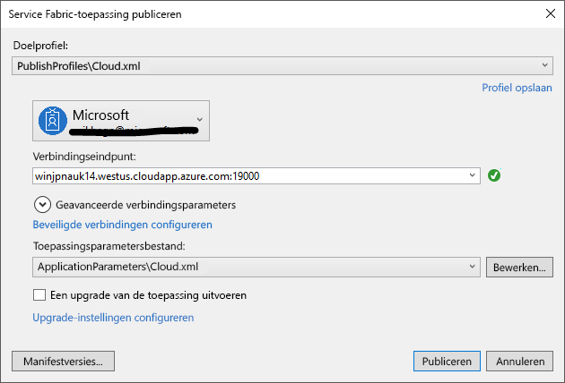

# <a name="deploy-an-application-tooa-party-cluster-in-azure"></a>Een toepassing tooa partij Cluster in Azure implementeren
Deze zelfstudie maakt deel uit van een reeks en laat u zien hoe toodeploy een Azure Service Fabric-toepassing tooa partij Cluster in Azure.

In deel twee reeks Hallo zelfstudie leert u hoe:
> [!div class="checklist"]
> * Een toepassing tooa externe cluster met Visual Studio implementeren
> * Een toepassing verwijderen van een cluster met behulp van Service Fabric Explorer

In deze zelfstudie reeks leert u hoe:
> [!div class="checklist"]
> * [Een .NET-Service Fabric-toepassing bouwen](service-fabric-tutorial-create-dotnet-app.md)
> * Hallo toepassing tooa RAS-cluster implementeren
> * [CI/CD met behulp van Visual Studio Team Services configureren](service-fabric-tutorial-deploy-app-with-cicd-vsts.md)

## <a name="prerequisites"></a>Vereisten
Voordat u deze zelfstudie begint:
- Als u geen Azure-abonnement hebt, maakt u een [gratis account](https://azure.microsoft.com/free/?WT.mc_id=A261C142F)
- [Installeer Visual Studio 2017](https://www.visualstudio.com/) en installeer Hallo **ontwikkelen van Azure** en **ASP.NET en web ontwikkeling** werkbelastingen.
- [Hallo Service Fabric SDK installeren](service-fabric-get-started.md)

## <a name="download-hello-voting-sample-application"></a>Hallo Voting voorbeeldtoepassing downloaden
Als u geen Hallo Voting voorbeeldtoepassing heeft bouwen [deel uitmaken van een van deze zelfstudie reeks](service-fabric-tutorial-create-dotnet-app.md), u kunt dit downloaden. In een opdrachtvenster Hallo na de opdracht tooclone Hallo voorbeeld-app-opslagplaats tooyour lokale computer worden uitgevoerd.

```
git clone https://github.com/Azure-Samples/service-fabric-dotnet-quickstart
```

## <a name="set-up-a-party-cluster"></a>Een Cluster partij instellen
Partijen clusters zijn gratis, tijdelijke Service Fabric clusters gehost op Azure en uitgevoerd door Hallo Service Fabric-team waar iedereen toepassingen implementeren en meer informatie over het Hallo-platform. Gratis!

tooget toegang tooa partij Cluster toothis site bladeren: http://aka.ms/tryservicefabric en volg Hallo instructies tooget RAS tooa-cluster. U moet een Facebook of GitHub-account tooget toegang tooa partij Cluster.

> [!NOTE]
> Partijen clusters zijn niet beveiligd, zodat uw toepassingen en gegevens die u in deze plaatsen mogelijk zichtbaar tooothers. Alles wat u niet wilt dat anderen niet implementeren toosee. Worden ervoor tooread via onze gebruiksvoorwaarden voor alle Hallo meer informatie.

## <a name="configure-hello-listening-port"></a>Hallo-luisterpoort configureren
Tijdens het Hallo VotingWeb front-end-service is gemaakt, Visual Studio een poort voor Hallo service toolisten willekeurig geselecteerd op.  Hallo VotingWeb-service fungeert als front-end voor deze toepassing hello en externe verkeer accepteert, dus laten we koppelt die service tooa vast en poort ook weten. Open in Solution Explorer *VotingWeb/PackageRoot/ServiceManifest.xml*.  Hallo zoeken **eindpunt** resource in Hallo **Resources** sectie en wijzig Hallo **poort** too80 waarde.

```xml
<Resources>
    <Endpoints>
      <!-- This endpoint is used by hello communication listener tooobtain hello port on which too
           listen. Please note that if your service is partitioned, this port is shared with 
           replicas of different partitions that are placed in your code. -->
      <Endpoint Protocol="http" Name="ServiceEndpoint" Type="Input" Port="80" />
    </Endpoints>
  </Resources>
```

Hallo toepassings-URL-eigenschapwaarde in Hallo Voting project ook bijwerken zodat de juiste poort toohello van een webbrowser wordt geopend wanneer u fouten opspoort, druk op F5 '.  Klik in Solution Explorer, selecteer Hallo **Voting** project en update Hallo **toepassings-URL** eigenschap.


## <a name="deploy-hello-app-toohello-azure"></a>Hallo app toohello Azure implementeren
Nu dat de toepassing hello klaar is, kunt u deze toohello partij Cluster direct vanuit Visual Studio implementeren.

1. Met de rechtermuisknop op **Voting** Hallo in Solution Explorer en kiest u **publiceren**.

    

2. Type in Hallo verbindingseindpunt Hallo partij Cluster in Hallo **verbindingseindpunt** veld en klikt u op **publiceren**.

    Zodra het Hallo-publiceren is voltooid, moet u kunnen toosend een aanvraag toohello toepassing via een browser.

3. Open uw voorkeurstijdzone browser en typt u Hallo clusteradres (Hallo verbindingseindpunt zonder poortinformatie Hallo - bijvoorbeeld win1kw5649s.westus.cloudapp.azure.com).

    U ziet nu Hallo hetzelfde resultaat als u hebt gezien wanneer Hallo toepassing lokaal wordt uitgevoerd.

    

## <a name="remove-hello-application-from-a-cluster-using-service-fabric-explorer"></a>Hallo-toepassing verwijderen van een cluster met behulp van Service Fabric Explorer
Service Fabric Explorer is een grafische interface tooexplore en beheren van toepassingen in een Service Fabric-cluster.

tooremove hello toepassing hello partij Cluster:

1. Blader toohello Service Fabric Explorer via Hallo koppeling door Hallo partij Cluster aanmeldingspagina. Bijvoorbeeld: http://win1kw5649s.westus.cloudapp.azure.com:19080/Explorer/index.html.

2. Navigeer in Service Fabric Explorer toohello **fabric://Voting** knooppunt in de treeview Hallo aan de linkerkant Hallo.

3. Klik op Hallo **actie** knop in het rechterdeelvenster Hallo **Essentials** deelvenster en kies **toepassing verwijderen**. Bevestig verwijderen Hallo toepassingsexemplaar, waardoor er Hallo-exemplaar van onze toepassing in Hallo cluster wordt uitgevoerd.


## <a name="remove-hello-application-type-from-a-cluster-using-service-fabric-explorer"></a>Type van de toepassing hello verwijderen uit een cluster met behulp van Service Fabric Explorer
Toepassingen geïmplementeerd als de soorten toepassingen in een Service Fabric-cluster, waardoor u toohave meerdere exemplaren en versies van Hallo-toepassing uitgevoerd binnen Hallo-cluster. Nadat de hebt verwijderd met een exemplaar van onze toepassing hello, kunnen we ook Hallo type, toocomplete Hallo opschoning van Hallo implementatie verwijderd.

Zie voor meer informatie over Hallo toepassingsmodel in Service Fabric [Model van een toepassing in Service Fabric](service-fabric-application-model.md).

1. Navigeer toohello **VotingType** knooppunt in Hallo treeview.

2. Klik op Hallo **actie** knop in het rechterdeelvenster Hallo **Essentials** deelvenster en kies **Type verwijderen**. Bevestig de inrichting Hallo toepassingstype.


Hiermee is Hallo zelfstudie.

## <a name="next-steps"></a>Volgende stappen
In deze zelfstudie heeft u het volgende geleerd:

> [!div class="checklist"]
> * Een toepassing tooa externe cluster met Visual Studio implementeren
> * Een toepassing verwijderen van een cluster met behulp van Service Fabric Explorer

Geavanceerde toohello volgende zelfstudie:
> [!div class="nextstepaction"]
> [Stel doorlopende integratie met behulp van Visual Studio Team Services](service-fabric-tutorial-deploy-app-with-cicd-vsts.md)