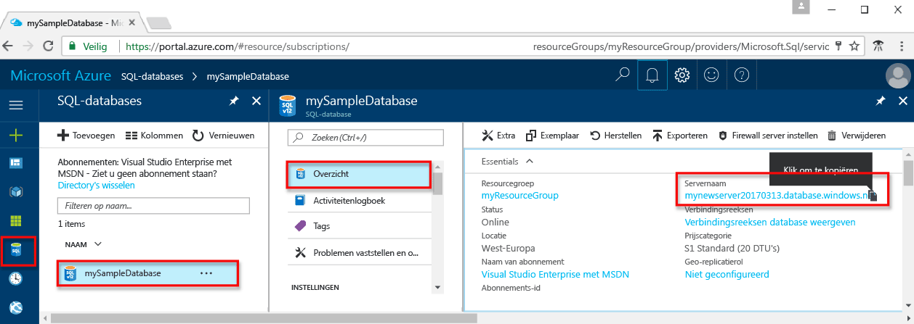

# <a name="use-net-core-c-tooquery-an-azure-sql-database"></a><span data-ttu-id="26f34-103">.NET Core (C#) tooquery een Azure SQL database gebruiken</span><span class="sxs-lookup"><span data-stu-id="26f34-103">Use .NET Core (C#) tooquery an Azure SQL database</span></span>

<span data-ttu-id="26f34-104">Deze zelfstudie laat zien hoe toouse [.NET Core](https://www.microsoft.com/net/) op Windows/Linux/Mac OS toocreate een C#-programma tooconnect tooan Azure SQL database en Transact-SQL-instructies tooquery gegevens.</span><span class="sxs-lookup"><span data-stu-id="26f34-104">This quick start tutorial demonstrates how toouse [.NET Core](https://www.microsoft.com/net/) on Windows/Linux/macOS toocreate a C# program tooconnect tooan Azure SQL database and use Transact-SQL statements tooquery data.</span></span>

## <a name="prerequisites"></a><span data-ttu-id="26f34-105">Vereisten</span><span class="sxs-lookup"><span data-stu-id="26f34-105">Prerequisites</span></span>

<span data-ttu-id="26f34-106">toocomplete dit snelle zelfstudie begint, controleert u of hebt u de volgende Hallo:</span><span class="sxs-lookup"><span data-stu-id="26f34-106">toocomplete this quick start tutorial, make sure you have hello following:</span></span>

- <span data-ttu-id="26f34-107">Een Azure SQL-database.</span><span class="sxs-lookup"><span data-stu-id="26f34-107">An Azure SQL database.</span></span> <span data-ttu-id="26f34-108">Hallo-resources die zijn gemaakt in een van deze snel aan de slag maakt gebruik van deze snel starten:</span><span class="sxs-lookup"><span data-stu-id="26f34-108">This quick start uses hello resources created in one of these quick starts:</span></span> 

   - [<span data-ttu-id="26f34-109">Database maken - Portal</span><span class="sxs-lookup"><span data-stu-id="26f34-109">Create DB - Portal</span></span>](sql-database-get-started-portal.md)
   - [<span data-ttu-id="26f34-110">Database maken - CLI</span><span class="sxs-lookup"><span data-stu-id="26f34-110">Create DB - CLI</span></span>](sql-database-get-started-cli.md)
   - [<span data-ttu-id="26f34-111">Database maken - PowerShell</span><span class="sxs-lookup"><span data-stu-id="26f34-111">Create DB - PowerShell</span></span>](sql-database-get-started-powershell.md)

- <span data-ttu-id="26f34-112">Een [firewallregel op serverniveau](sql-database-get-started-portal.md#create-a-server-level-firewall-rule) voor openbaar IP-adres van de computer Hallo Hallo u gebruiken voor deze zelfstudie voor snel starten.</span><span class="sxs-lookup"><span data-stu-id="26f34-112">A [server-level firewall rule](sql-database-get-started-portal.md#create-a-server-level-firewall-rule) for hello public IP address of hello computer you use for this quick start tutorial.</span></span>
- <span data-ttu-id="26f34-113">U hebt [.NET Core voor uw besturingssysteem](https://www.microsoft.com/net/core) geïnstalleerd.</span><span class="sxs-lookup"><span data-stu-id="26f34-113">You have installed [.NET Core for your operating system](https://www.microsoft.com/net/core).</span></span> 

## <a name="sql-server-connection-information"></a><span data-ttu-id="26f34-114">SQL Server-verbindingsgegevens</span><span class="sxs-lookup"><span data-stu-id="26f34-114">SQL server connection information</span></span>

<span data-ttu-id="26f34-115">Hallo verbinding informatie die nodig is tooconnect toohello Azure SQL-database worden opgehaald.</span><span class="sxs-lookup"><span data-stu-id="26f34-115">Get hello connection information needed tooconnect toohello Azure SQL database.</span></span> <span data-ttu-id="26f34-116">U moet Hallo volledig gekwalificeerde servernaam, databasenaam en aanmeldingsgegevens in de volgende procedures Hallo.</span><span class="sxs-lookup"><span data-stu-id="26f34-116">You will need hello fully qualified server name, database name, and login information in hello next procedures.</span></span>

1. <span data-ttu-id="26f34-117">Meld u bij toohello [Azure-portal](https://portal.azure.com/).</span><span class="sxs-lookup"><span data-stu-id="26f34-117">Log in toohello [Azure portal](https://portal.azure.com/).</span></span>
2. <span data-ttu-id="26f34-118">Selecteer **SQL-Databases** Hallo links menu en klik op de database op Hallo **SQL-databases** pagina.</span><span class="sxs-lookup"><span data-stu-id="26f34-118">Select **SQL Databases** from hello left-hand menu, and click your database on hello **SQL databases** page.</span></span> 
3. <span data-ttu-id="26f34-119">Op Hallo **overzicht** servernaam pagina voor de database, bekijk Hallo volledig gekwalificeerd zoals weergegeven in Hallo installatiekopie te volgen.</span><span class="sxs-lookup"><span data-stu-id="26f34-119">On hello **Overview** page for your database, review hello fully qualified server name as shown in hello following image.</span></span> <span data-ttu-id="26f34-120">U kunt de muisaanwijzer op Hallo server name toobring up Hallo **klikt u op toocopy** optie.</span><span class="sxs-lookup"><span data-stu-id="26f34-120">You can hover over hello server name toobring up hello **Click toocopy** option.</span></span> 

    

4. <span data-ttu-id="26f34-122">Als u de aanmeldingsgegevens van uw Azure SQL Database-server bent vergeten, gaat u toohello SQL server pagina tooview Hallo beheerder databaseservernaam.</span><span class="sxs-lookup"><span data-stu-id="26f34-122">If you forget your Azure SQL Database server login information, navigate toohello SQL Database server page tooview hello server admin name.</span></span> <span data-ttu-id="26f34-123">Indien nodig, kunt u Hallo wachtwoord opnieuw instellen.</span><span class="sxs-lookup"><span data-stu-id="26f34-123">You can reset hello password if necessary.</span></span>

5. <span data-ttu-id="26f34-124">Klik op **Databaseverbindingsreeksen tonen**.</span><span class="sxs-lookup"><span data-stu-id="26f34-124">Click **Show database connection strings**.</span></span>

6. <span data-ttu-id="26f34-125">Bekijk Hallo voltooid **ADO.NET** verbindingsreeks.</span><span class="sxs-lookup"><span data-stu-id="26f34-125">Review hello complete **ADO.NET** connection string.</span></span>

    

> [!IMPORTANT]
> <span data-ttu-id="26f34-127">U moet beschikken over een firewallregel voor het openbare IP-adres Hallo van Hallo-computer waarop u deze zelfstudie uitvoert.</span><span class="sxs-lookup"><span data-stu-id="26f34-127">You must have a firewall rule in place for hello public IP address of hello computer on which you perform this tutorial.</span></span> <span data-ttu-id="26f34-128">Als u zich op een andere computer of een ander openbaar IP-adres hebben, maakt u een [serverniveau firewall-regel met Azure-portal Hallo](sql-database-get-started-portal.md#create-a-server-level-firewall-rule).</span><span class="sxs-lookup"><span data-stu-id="26f34-128">If you are on a different computer or have a different public IP address, create a [server-level firewall rule using hello Azure portal](sql-database-get-started-portal.md#create-a-server-level-firewall-rule).</span></span> 
>
  
## <a name="create-a-new-net-project"></a><span data-ttu-id="26f34-129">Een nieuw .NET-project maken</span><span class="sxs-lookup"><span data-stu-id="26f34-129">Create a new .NET project</span></span>

1. <span data-ttu-id="26f34-130">Open een opdrachtprompt en maak een map met de naam *sqltest*.</span><span class="sxs-lookup"><span data-stu-id="26f34-130">Open a command prompt and create a folder named *sqltest*.</span></span> <span data-ttu-id="26f34-131">Navigeer toohello map u gemaakt en Hallo volgende opdracht uitvoeren:</span><span class="sxs-lookup"><span data-stu-id="26f34-131">Navigate toohello folder you created and run hello following command:</span></span>

    ```
    dotnet new console
    ```

2. <span data-ttu-id="26f34-132">Open ***sqltest.csproj*** met uw favoriete teksteditor en System.Data.SqlClient toevoegen als een afhankelijkheid Hallo volgende code gebruiken:</span><span class="sxs-lookup"><span data-stu-id="26f34-132">Open ***sqltest.csproj*** with your favorite text editor and add System.Data.SqlClient as a dependency using hello following code:</span></span>

    ```xml
    <ItemGroup>
        <PackageReference Include="System.Data.SqlClient" Version="4.3.0" />
    </ItemGroup>
    ```

## <a name="insert-code-tooquery-sql-database"></a><span data-ttu-id="26f34-133">Code tooquery SQL-database invoegen</span><span class="sxs-lookup"><span data-stu-id="26f34-133">Insert code tooquery SQL database</span></span>

1. <span data-ttu-id="26f34-134">Open **Program.cs** in uw ontwikkelomgeving of favoriete teksteditor.</span><span class="sxs-lookup"><span data-stu-id="26f34-134">In your development environment or favorite text editor open **Program.cs**</span></span>

2. <span data-ttu-id="26f34-135">Hallo inhoud vervangen door Hallo volgende code en voeg de juiste waarden Hallo voor uw server, de database, de gebruiker en het wachtwoord.</span><span class="sxs-lookup"><span data-stu-id="26f34-135">Replace hello contents with hello following code and add hello appropriate values for your server, database, user, and password.</span></span>

```csharp
using System;
using System.Data.SqlClient;
using System.Text;

namespace sqltest
{
    class Program
    {
        static void Main(string[] args)
        {
            try 
            { 
                SqlConnectionStringBuilder builder = new SqlConnectionStringBuilder();
                builder.DataSource = "your_server.database.windows.net"; 
                builder.UserID = "your_user";            
                builder.Password = "your_password";     
                builder.InitialCatalog = "your_database";

                using (SqlConnection connection = new SqlConnection(builder.ConnectionString))
                {
                    Console.WriteLine("\nQuery data example:");
                    Console.WriteLine("=========================================\n");
                    
                    connection.Open();       
                    StringBuilder sb = new StringBuilder();
                    sb.Append("SELECT TOP 20 pc.Name as CategoryName, p.name as ProductName ");
                    sb.Append("FROM [SalesLT].[ProductCategory] pc ");
                    sb.Append("JOIN [SalesLT].[Product] p ");
                    sb.Append("ON pc.productcategoryid = p.productcategoryid;");
                    String sql = sb.ToString();

                    using (SqlCommand command = new SqlCommand(sql, connection))
                    {
                        using (SqlDataReader reader = command.ExecuteReader())
                        {
                            while (reader.Read())
                            {
                                Console.WriteLine("{0} {1}", reader.GetString(0), reader.GetString(1));
                            }
                        }
                    }                    
                }
            }
            catch (SqlException e)
            {
                Console.WriteLine(e.ToString());
            }
            Console.ReadLine();
        }
    }
}
```

## <a name="run-hello-code"></a><span data-ttu-id="26f34-136">Hallo code uitvoeren</span><span class="sxs-lookup"><span data-stu-id="26f34-136">Run hello code</span></span>

1. <span data-ttu-id="26f34-137">Voer bij de opdrachtprompt Hallo Hallo opdrachten na:</span><span class="sxs-lookup"><span data-stu-id="26f34-137">At hello command prompt, run hello following commands:</span></span>

   ```csharp
   dotnet restore
   dotnet run
   ```

2. <span data-ttu-id="26f34-138">Verifieer dat Hallo top 20 rijen worden geretourneerd en het venster Hallo-toepassing sluit.</span><span class="sxs-lookup"><span data-stu-id="26f34-138">Verify that hello top 20 rows are returned and then close hello application window.</span></span>


## <a name="next-steps"></a><span data-ttu-id="26f34-139">Volgende stappen</span><span class="sxs-lookup"><span data-stu-id="26f34-139">Next steps</span></span>

- <span data-ttu-id="26f34-140">[Aan de slag met .NET Core op Windows/Linux/Mac-OS, via de opdrachtregel Hallo](/dotnet/core/tutorials/using-with-xplat-cli).</span><span class="sxs-lookup"><span data-stu-id="26f34-140">[Getting started with .NET Core on Windows/Linux/macOS using hello command line](/dotnet/core/tutorials/using-with-xplat-cli).</span></span>
- <span data-ttu-id="26f34-141">Meer informatie over hoe te[en verbinding en een Azure SQL database met behulp van Hallo .NET framework en Visual Studio query](sql-database-connect-query-dotnet-visual-studio.md).</span><span class="sxs-lookup"><span data-stu-id="26f34-141">Learn how too[connect and query an Azure SQL database using hello .NET framework and Visual Studio](sql-database-connect-query-dotnet-visual-studio.md).</span></span>  
- <span data-ttu-id="26f34-142">Meer informatie over hoe te[ontwerpen van uw eerste Azure SQL database met behulp van SSMS](sql-database-design-first-database.md) of [ontwerpen van uw eerste Azure SQL database met .NET](sql-database-design-first-database-csharp.md).</span><span class="sxs-lookup"><span data-stu-id="26f34-142">Learn how too[Design your first Azure SQL database using SSMS](sql-database-design-first-database.md) or [Design your first Azure SQL database using .NET](sql-database-design-first-database-csharp.md).</span></span>
- <span data-ttu-id="26f34-143">Raadpleeg de [.NET-documentatie](https://docs.microsoft.com/dotnet/) voor meer informatie over .NET.</span><span class="sxs-lookup"><span data-stu-id="26f34-143">For more information about .NET, see [.NET documentation](https://docs.microsoft.com/dotnet/).</span></span>
