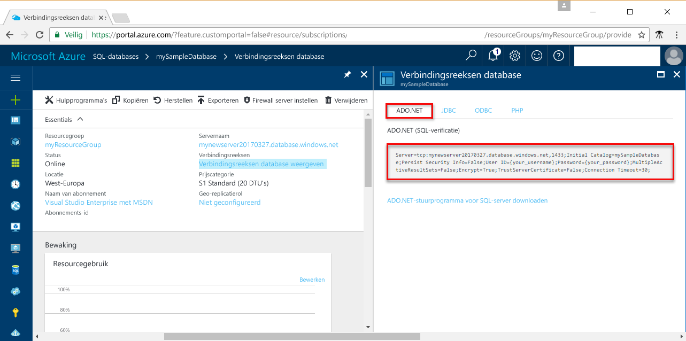

# <a name="use-net-c-with-visual-studio-tooconnect-and-query-an-azure-sql-database"></a>.NET (C#) gebruikt met Visual Studio tooconnect en query's van een Azure SQL database

Deze zelfstudie laat zien hoe toouse hello [.NET framework](https://www.microsoft.com/net/) toocreate een C# programmeren met Visual Studio tooconnect tooan Azure SQL database en Transact-SQL-instructies tooquery gegevens gebruiken.

## <a name="prerequisites"></a>Vereisten

toocomplete dit snelle zelfstudie begint, controleert u of hebt u de volgende Hallo:

- Een Azure SQL-database. Hallo-resources die zijn gemaakt in een van deze snel aan de slag maakt gebruik van deze snel starten: 

   - [Database maken - Portal](sql-database-get-started-portal.md)
   - [Database maken - CLI](sql-database-get-started-cli.md)
   - [Database maken - PowerShell](sql-database-get-started-powershell.md)

- Een [firewallregel op serverniveau](sql-database-get-started-portal.md#create-a-server-level-firewall-rule) voor openbaar IP-adres van de computer Hallo Hallo u gebruiken voor deze zelfstudie voor snel starten.
- Een installatie van [Visual Studio Community 2017, Visual Studio Professional 2017 of Visual Studio Enterprise 2017](https://www.visualstudio.com/downloads/).

## <a name="sql-server-connection-information"></a>SQL Server-verbindingsgegevens

Hallo verbinding informatie die nodig is tooconnect toohello Azure SQL-database worden opgehaald. U moet Hallo volledig gekwalificeerde servernaam, databasenaam en aanmeldingsgegevens in de volgende procedures Hallo.

1. Meld u bij toohello [Azure-portal](https://portal.azure.com/).
2. Selecteer **SQL-Databases** Hallo links menu en klik op de database op Hallo **SQL-databases** pagina. 
3. Op Hallo **overzicht** servernaam pagina voor de database, bekijk Hallo volledig gekwalificeerd zoals weergegeven in Hallo installatiekopie te volgen. U kunt de muisaanwijzer op Hallo server name toobring up Hallo **klikt u op toocopy** optie. 

    

4. Als u de aanmeldingsgegevens van uw Azure SQL Database-server bent vergeten, gaat u toohello SQL server pagina tooview Hallo beheerder databaseservernaam. Indien nodig, kunt u Hallo wachtwoord opnieuw instellen.

5. Klik op **Databaseverbindingsreeksen tonen**.

6. Bekijk Hallo voltooid **ADO.NET** verbindingsreeks.

    

> [!IMPORTANT]
> U moet beschikken over een firewallregel voor het openbare IP-adres Hallo van Hallo-computer waarop u deze zelfstudie uitvoert. Als u zich op een andere computer of een ander openbaar IP-adres hebben, maakt u een [serverniveau firewall-regel met Azure-portal Hallo](sql-database-get-started-portal.md#create-a-server-level-firewall-rule). 
>
  
## <a name="create-a-new-visual-studio-project"></a>Een nieuw Visual Studio-project maken

1. Kies in Visual Studio **File**, **New**, **Project**. 
2. In Hallo **nieuw Project** dialoogvenster, en vouw **Visual C#**.
3. Selecteer **consoletoepassing** en voer *sqltest* voor Hallo projectnaam.
4. Klik op **OK** toocreate en open Hallo nieuw project in Visual Studio
4. Klik in Solution Explorer met de rechtermuisknop op **sqltest** en klik vervolgens op **NuGet-pakketten beheren**. 
5. Op Hallo **Bladeren**, zoekt u ```System.Data.SqlClient``` en, wanneer gevonden, selecteert u deze.
6. In Hallo **System.Data.SqlClient** pagina, klikt u op **installeren**.
7. Wanneer het Hallo-installatie is voltooid, Controleer Hallo wijzigingen en klik vervolgens op **OK** tooclose hello **Preview** venster. 
8. Als een venster voor **akkoord gaan met de licentie** wordt weergegeven, klikt u op **Ik ga akkoord**.

## <a name="insert-code-tooquery-sql-database"></a>Code tooquery SQL-database invoegen
1. Te schakelen (of open indien nodig) **Program.cs**

2. Vervang de inhoud Hallo van **Program.cs** Hello volgende code en voeg de juiste waarden Hallo voor uw server, de database, de gebruiker en het wachtwoord.

```csharp
using System;
using System.Data.SqlClient;
using System.Text;

namespace sqltest
{
    class Program
    {
        static void Main(string[] args)
        {
            try 
            { 
                SqlConnectionStringBuilder builder = new SqlConnectionStringBuilder();
                builder.DataSource = "your_server.database.windows.net"; 
                builder.UserID = "your_user";            
                builder.Password = "your_password";     
                builder.InitialCatalog = "your_database";

                using (SqlConnection connection = new SqlConnection(builder.ConnectionString))
                {
                    Console.WriteLine("\nQuery data example:");
                    Console.WriteLine("=========================================\n");
                    
                    connection.Open();       
                    StringBuilder sb = new StringBuilder();
                    sb.Append("SELECT TOP 20 pc.Name as CategoryName, p.name as ProductName ");
                    sb.Append("FROM [SalesLT].[ProductCategory] pc ");
                    sb.Append("JOIN [SalesLT].[Product] p ");
                    sb.Append("ON pc.productcategoryid = p.productcategoryid;");
                    String sql = sb.ToString();

                    using (SqlCommand command = new SqlCommand(sql, connection))
                    {
                        using (SqlDataReader reader = command.ExecuteReader())
                        {
                            while (reader.Read())
                            {
                                Console.WriteLine("{0} {1}", reader.GetString(0), reader.GetString(1));
                            }
                        }
                    }                    
                }
            }
            catch (SqlException e)
            {
                Console.WriteLine(e.ToString());
            }
            Console.ReadLine();
        }
    }
}
```

## <a name="run-hello-code"></a>Hallo code uitvoeren

1. Druk op **F5** toorun Hallo-toepassing.
2. Verifieer dat Hallo top 20 rijen worden geretourneerd en het venster Hallo-toepassing sluit.

## <a name="next-steps"></a>Volgende stappen

- Meer informatie over hoe te[en verbinding en een Azure SQL database met behulp van .NET core query](sql-database-connect-query-dotnet-core.md) op Windows/Linux/Mac OS.  
- Meer informatie over [aan de slag met .NET Core op Windows/Linux/Mac-OS, via de opdrachtregel Hallo](/dotnet/core/tutorials/using-with-xplat-cli).
- Meer informatie over hoe te[ontwerpen van uw eerste Azure SQL database met behulp van SSMS](sql-database-design-first-database.md) of [ontwerpen van uw eerste Azure SQL database met .NET](sql-database-design-first-database-csharp.md).
- Raadpleeg de [.NET-documentatie](https://docs.microsoft.com/dotnet/) voor meer informatie over .NET.
