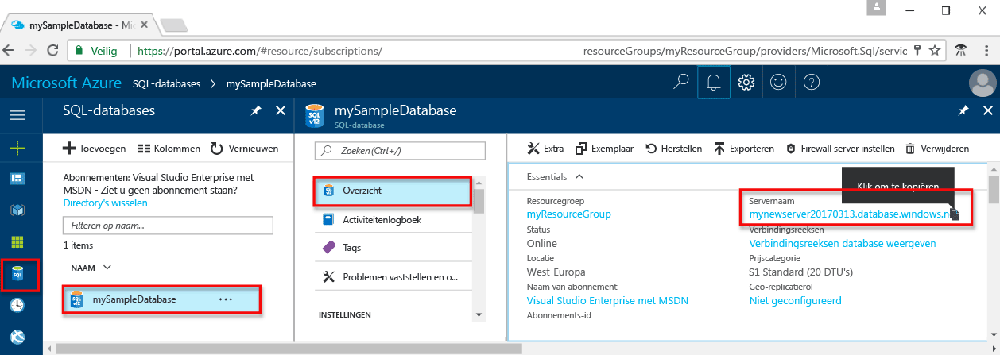

# <a name="use-python-tooquery-an-azure-sql-database"></a>Gebruik van Python tooquery een Azure SQL database

 Deze snel starten laat zien hoe toouse [Python](https://python.org) tooconnect tooan Azure SQL database en Transact-SQL-instructies tooquery gegevens.

## <a name="prerequisites"></a>Vereisten

toocomplete dit snelle zelfstudie begint, controleert u of hebt u de volgende Hallo:

- Een Azure SQL-database. Hallo-resources die zijn gemaakt in een van deze snel aan de slag maakt gebruik van deze snel starten: 

   - [Database maken - Portal](sql-database-get-started-portal.md)
   - [Database maken - CLI](sql-database-get-started-cli.md)
   - [Database maken - PowerShell](sql-database-get-started-powershell.md)

- Een [firewallregel op serverniveau](sql-database-get-started-portal.md#create-a-server-level-firewall-rule) voor openbaar IP-adres van de computer Hallo Hallo u gebruiken voor deze zelfstudie voor snel starten.

- U hebt Python en verwante software voor uw besturingssysteem geïnstalleerd.

    - **Mac OS**: Homebrew installeren en Python, Hallo ODBC-stuurprogramma en SQLCMD installeren en installeer vervolgens Hallo Python-stuurprogramma voor SQL Server. Zie [stap 1.2, 1.3 en 2.1](https://www.microsoft.com/sql-server/developer-get-started/python/mac/).
    - **Ubuntu**: Python installeren en andere vereiste pakketten en installatie Hallo Python-stuurprogramma voor SQL Server. Zie [stap 1.2, 1.3 en 2.1](https://www.microsoft.com/sql-server/developer-get-started/python/ubuntu/).
    - **Windows**: Hallo nieuwste versie van Python (omgevingsvariabele is nu geconfigureerd voor u) installeren, Hallo ODBC-stuurprogramma en SQLCMD installeren en installeer vervolgens Hallo Python-stuurprogramma voor SQL Server. Zie [Stap 1.2, 1.3 en 2.1](https://www.microsoft.com/sql-server/developer-get-started/python/windows/). 

## <a name="sql-server-connection-information"></a>SQL Server-verbindingsgegevens

Hallo verbinding informatie die nodig is tooconnect toohello Azure SQL-database worden opgehaald. U moet Hallo volledig gekwalificeerde servernaam, databasenaam en aanmeldingsgegevens in de volgende procedures Hallo.

1. Meld u bij toohello [Azure-portal](https://portal.azure.com/).
2. Selecteer **SQL-Databases** Hallo links menu en klik op de database op Hallo **SQL-databases** pagina. 
3. Op Hallo **overzicht** servernaam pagina voor de database, bekijk Hallo volledig gekwalificeerd zoals weergegeven in Hallo installatiekopie te volgen. U kunt de muisaanwijzer op Hallo server name toobring up Hallo **klikt u op toocopy** optie.  

    

4. Als u uw aanmeldingsgegevens server vergeet, navigeer toohello SQL server pagina tooview Hallo beheerder databaseservernaam en, indien nodig, opnieuw ingesteld wachtwoord Hallo.     
    
## <a name="insert-code-tooquery-sql-database"></a>Code tooquery SQL-database invoegen 

1. Maak een nieuw bestand in uw favoriete teksteditor **sqltest.py**.  

2. Hallo inhoud vervangen door Hallo volgende code en voeg de juiste waarden Hallo voor uw server, de database, de gebruiker en het wachtwoord.

```Python
import pyodbc
server = 'your_server.database.windows.net'
database = 'your_database'
username = 'your_username'
password = 'your_password'
driver= '{ODBC Driver 13 for SQL Server}'
cnxn = pyodbc.connect('DRIVER='+driver+';PORT=1433;SERVER='+server+';PORT=1443;DATABASE='+database+';UID='+username+';PWD='+ password)
cursor = cnxn.cursor()
cursor.execute("SELECT TOP 20 pc.Name as CategoryName, p.name as ProductName FROM [SalesLT].[ProductCategory] pc JOIN [SalesLT].[Product] p ON pc.productcategoryid = p.productcategoryid")
row = cursor.fetchone()
while row:
    print (str(row[0]) + " " + str(row[1]))
    row = cursor.fetchone()
```

## <a name="run-hello-code"></a>Hallo code uitvoeren

1. Voer bij de opdrachtprompt Hallo Hallo opdrachten na:

   ```Python
   python sqltest.py
   ```

2. Verifieer dat Hallo top 20 rijen worden geretourneerd en het venster Hallo-toepassing sluit.

## <a name="next-steps"></a>Volgende stappen

- [Uw eerste Azure SQL-database ontwerpen](sql-database-design-first-database.md)
- [Microsoft Python-stuurprogramma's voor SQL Server](https://docs.microsoft.com/sql/connect/python/python-driver-for-sql-server/)
- [Python Developer Center](https://azure.microsoft.com/develop/python/?v=17.23h)

